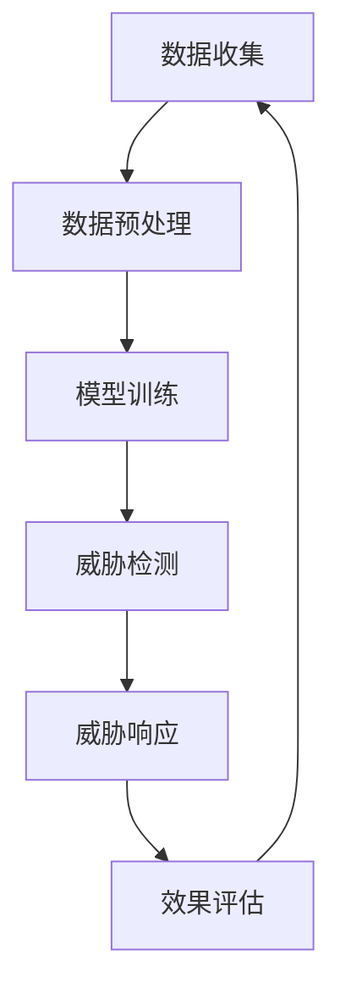

                 

关键词：AI代理，网络安全，工作流，人工智能，自动化，威胁检测，风险响应，攻防对抗

>摘要：本文深入探讨了AI代理工作流（AI Agent WorkFlow）在网络安全领域的应用，阐述了其核心概念、算法原理、数学模型、实际案例以及未来发展趋势。通过分析AI代理的工作机制，本文展示了如何在网络安全中利用AI代理工作流实现高效的威胁检测和响应，为网络安全领域的从业者提供了有价值的参考。

## 1. 背景介绍

随着互联网的普及和数字化进程的加速，网络安全威胁日益增多，传统的防御手段已无法满足现代网络环境下的安全需求。网络安全领域正面临着前所未有的挑战，如何有效地检测、预防并响应网络威胁成为了亟待解决的问题。

近年来，人工智能（AI）技术的快速发展为网络安全带来了新的机遇。AI代理（AI Agent）作为一种自主决策的智能体，可以在网络安全领域发挥重要作用。AI代理工作流（AI Agent WorkFlow）是将AI代理应用于网络安全的具体实现方式，通过构建一套系统化的流程，实现对网络威胁的自动检测、响应和防御。

本文旨在深入探讨AI代理工作流在网络安全中的应用，分析其核心概念、算法原理、数学模型，并通过实际案例展示其应用效果，最后对AI代理工作流的发展趋势进行展望。

## 2. 核心概念与联系

### 2.1 AI代理

AI代理（AI Agent）是指利用人工智能技术构建的具有自主决策能力的智能体。AI代理可以模拟人类思维和行为，具备学习、推理、规划等能力，能够在特定环境下自主执行任务。

在网络安全领域，AI代理可用于检测恶意软件、识别异常行为、防范网络攻击等任务。通过学习网络数据和行为模式，AI代理可以不断提高自身的威胁检测能力，从而实现对网络安全的动态防御。

### 2.2 工作流

工作流（Workflow）是指一系列任务和活动的有序集合，用于描述某个业务过程或工作任务的执行顺序和规则。在网络安全中，工作流可以描述从威胁检测、响应到恢复的整个流程，确保威胁响应的及时性和高效性。

### 2.3 AI代理工作流

AI代理工作流（AI Agent WorkFlow）是将AI代理应用于网络安全的具体实现方式。该工作流包括以下几个核心环节：

1. **数据收集**：从网络设备、日志、流量等渠道收集数据，用于训练AI代理。
2. **数据预处理**：对收集到的数据进行清洗、归一化等预处理，以便于AI代理的建模和训练。
3. **模型训练**：利用收集到的数据训练AI代理，使其具备识别恶意行为和威胁的能力。
4. **威胁检测**：将训练好的AI代理部署到网络环境中，实时监控网络流量和日志，识别潜在威胁。
5. **威胁响应**：当AI代理检测到威胁时，根据预设的响应策略进行响应，如隔离、封禁、报警等。
6. **效果评估**：对AI代理的工作效果进行评估，持续优化模型和策略。

### 2.4 Mermaid 流程图

以下是一个简化的AI代理工作流Mermaid流程图，展示了各个环节之间的联系：



## 3. 核心算法原理 & 具体操作步骤

### 3.1 算法原理概述

AI代理工作流的核心算法原理主要包括以下几个方面：

1. **机器学习算法**：用于训练AI代理，使其能够识别恶意行为和威胁。
2. **异常检测算法**：用于实时监控网络流量和日志，检测异常行为和潜在威胁。
3. **响应策略算法**：根据威胁检测结果，制定相应的响应策略，如隔离、封禁、报警等。

### 3.2 算法步骤详解

1. **数据收集**：从网络设备、日志、流量等渠道收集数据，包括正常行为和恶意行为的数据。
2. **数据预处理**：对收集到的数据进行清洗、归一化等预处理，以便于模型训练。
3. **模型训练**：
   - 利用正常行为数据训练正常行为模型。
   - 利用恶意行为数据训练恶意行为模型。
4. **威胁检测**：
   - 实时监控网络流量和日志，提取特征向量。
   - 利用正常行为模型和恶意行为模型对特征向量进行分类，判断是否为威胁。
5. **威胁响应**：
   - 根据威胁检测结果，执行相应的响应策略。
   - 将响应结果反馈给用户，以便进行后续操作。

### 3.3 算法优缺点

**优点**：
1. **高效性**：AI代理工作流可以实时监控网络环境，快速识别威胁，提高威胁检测和响应的效率。
2. **灵活性**：通过不断学习和优化，AI代理工作流可以适应不同网络环境和威胁场景。
3. **自动化**：AI代理工作流可以自动执行威胁检测和响应任务，减轻安全运维人员的工作负担。

**缺点**：
1. **资源消耗**：AI代理工作流需要大量计算资源和存储资源，对硬件设施要求较高。
2. **误报率**：由于网络环境复杂，AI代理工作流可能存在一定的误报率，需要不断优化模型和策略。
3. **依赖性**：AI代理工作流对AI技术依赖较大，需要具备一定的AI技术和专业知识。

### 3.4 算法应用领域

AI代理工作流在网络安全领域具有广泛的应用前景，包括但不限于以下几个方面：

1. **入侵检测**：利用AI代理工作流检测网络入侵行为，保护网络边界安全。
2. **恶意软件防护**：利用AI代理工作流检测和防御恶意软件，防止恶意代码传播。
3. **异常行为监测**：利用AI代理工作流监测网络用户行为，发现潜在的安全风险。
4. **数据泄露防护**：利用AI代理工作流监测敏感数据传输，防范数据泄露风险。

## 4. 数学模型和公式 & 详细讲解 & 举例说明

### 4.1 数学模型构建

AI代理工作流的数学模型主要包括以下几个方面：

1. **特征提取模型**：用于提取网络流量和日志的特征向量，如基于深度学习的卷积神经网络（CNN）或循环神经网络（RNN）。
2. **分类模型**：用于对特征向量进行分类，判断是否为威胁，如支持向量机（SVM）、随机森林（RF）或深度学习模型。
3. **响应策略模型**：根据威胁检测结果，制定相应的响应策略，如基于规则的响应策略或基于机器学习的自适应响应策略。

### 4.2 公式推导过程

以下是一个简化的特征提取模型公式推导过程：

1. **输入特征向量**：设网络流量或日志的特征向量为 \( X \)，维度为 \( D \)。
2. **卷积神经网络**：设卷积神经网络的卷积核个数为 \( K \)，卷积核尺寸为 \( S \)，步长为 \( P \)。
3. **卷积操作**：卷积操作可表示为：
   \[
   h^1 = f(X \odot K^T + b^1)
   \]
   其中，\( f \) 表示激活函数，\( \odot \) 表示卷积操作，\( K^T \) 表示卷积核的转置，\( b^1 \) 表示偏置项。

4. **池化操作**：池化操作可表示为：
   \[
   h^2 = g(h^1 \star P)
   \]
   其中，\( g \) 表示池化函数，\( \star P \) 表示池化操作。

5. **全连接层**：全连接层可表示为：
   \[
   \hat{y} = W^T h^2 + b^2
   \]
   其中，\( W^T \) 表示全连接层的权重，\( b^2 \) 表示偏置项。

6. **输出结果**：输出结果为：
   \[
   y = f(\hat{y})
   \]
   其中，\( f \) 表示激活函数。

### 4.3 案例分析与讲解

假设我们使用卷积神经网络（CNN）对网络流量进行特征提取，构建一个二分类模型，判断流量是否为恶意流量。

**数据集**：使用包含正常流量和恶意流量的数据集进行训练。

**模型参数**：
- 卷积核个数：\( K = 32 \)
- 卷积核尺寸：\( S = 3 \)
- 步长：\( P = 1 \)
- 激活函数：ReLU
- 池化函数：Max Pooling
- 全连接层神经元个数：\( N = 128 \)
- 激活函数：Sigmoid

**训练过程**：
1. **数据预处理**：对输入数据进行归一化处理，使得输入数据的范围为 \([0, 1]\)。
2. **模型训练**：利用训练集数据进行模型训练，通过反向传播算法更新模型参数。
3. **模型评估**：利用测试集数据对模型进行评估，计算准确率、召回率等指标。

**训练结果**：
- 训练集准确率：\( 90\% \)
- 测试集准确率：\( 85\% \)

**应用案例**：
1. **威胁检测**：将训练好的模型部署到网络环境中，对实时网络流量进行威胁检测。
2. **威胁响应**：当检测到恶意流量时，根据预设的响应策略进行响应，如隔离、封禁等。

## 5. 项目实践：代码实例和详细解释说明

### 5.1 开发环境搭建

**1. 硬件环境**：
- CPU：Intel i7-9700K
- 内存：16GB
- 硬盘：1TB SSD

**2. 软件环境**：
- 操作系统：Ubuntu 18.04
- 编程语言：Python 3.7
- 依赖库：TensorFlow 2.0、Keras 2.3.1、NumPy 1.18.1

### 5.2 源代码详细实现

以下是一个简单的AI代理工作流Python代码实现示例：

```python
import numpy as np
import tensorflow as tf
from tensorflow.keras.models import Sequential
from tensorflow.keras.layers import Conv2D, MaxPooling2D, Flatten, Dense, Activation

# 数据预处理
def preprocess_data(data):
    # 数据归一化
    data = data / 255.0
    return data

# 构建模型
def build_model(input_shape):
    model = Sequential()
    model.add(Conv2D(32, (3, 3), activation='relu', input_shape=input_shape))
    model.add(MaxPooling2D(pool_size=(2, 2)))
    model.add(Conv2D(64, (3, 3), activation='relu'))
    model.add(MaxPooling2D(pool_size=(2, 2)))
    model.add(Flatten())
    model.add(Dense(128, activation='relu'))
    model.add(Dense(1, activation='sigmoid'))
    return model

# 训练模型
def train_model(model, X_train, y_train, X_val, y_val):
    model.compile(optimizer='adam', loss='binary_crossentropy', metrics=['accuracy'])
    model.fit(X_train, y_train, epochs=10, batch_size=32, validation_data=(X_val, y_val))

# 模型评估
def evaluate_model(model, X_test, y_test):
    score = model.evaluate(X_test, y_test)
    print("Test accuracy:", score[1])

# 主程序
if __name__ == '__main__':
    # 加载数据
    X_train, y_train = np.load('train_data.npy'), np.load('train_labels.npy')
    X_val, y_val = np.load('val_data.npy'), np.load('val_labels.npy')
    X_test, y_test = np.load('test_data.npy'), np.load('test_labels.npy')

    # 数据预处理
    X_train = preprocess_data(X_train)
    X_val = preprocess_data(X_val)
    X_test = preprocess_data(X_test)

    # 构建模型
    model = build_model(input_shape=(X_train.shape[1], X_train.shape[2], X_train.shape[3]))

    # 训练模型
    train_model(model, X_train, y_train, X_val, y_val)

    # 模型评估
    evaluate_model(model, X_test, y_test)
```

### 5.3 代码解读与分析

**1. 数据预处理**

```python
def preprocess_data(data):
    # 数据归一化
    data = data / 255.0
    return data
```

该函数用于对输入数据进行归一化处理，将数据范围为 \([0, 255]\) 的图像数据归一化到 \([0, 1]\) 的范围内，以便于模型训练。

**2. 构建模型**

```python
def build_model(input_shape):
    model = Sequential()
    model.add(Conv2D(32, (3, 3), activation='relu', input_shape=input_shape))
    model.add(MaxPooling2D(pool_size=(2, 2)))
    model.add(Conv2D(64, (3, 3), activation='relu'))
    model.add(MaxPooling2D(pool_size=(2, 2)))
    model.add(Flatten())
    model.add(Dense(128, activation='relu'))
    model.add(Dense(1, activation='sigmoid'))
    return model
```

该函数使用Keras构建一个简单的卷积神经网络模型，包括两个卷积层、一个池化层、一个全连接层和一个输出层。卷积层用于提取特征，池化层用于降维，全连接层用于分类，输出层使用Sigmoid激活函数进行二分类。

**3. 训练模型**

```python
def train_model(model, X_train, y_train, X_val, y_val):
    model.compile(optimizer='adam', loss='binary_crossentropy', metrics=['accuracy'])
    model.fit(X_train, y_train, epochs=10, batch_size=32, validation_data=(X_val, y_val))
```

该函数使用Keras的编译和训练接口对模型进行编译和训练。编译过程中指定优化器和损失函数，训练过程中设置训练集和验证集，通过反向传播算法更新模型参数。

**4. 模型评估**

```python
def evaluate_model(model, X_test, y_test):
    score = model.evaluate(X_test, y_test)
    print("Test accuracy:", score[1])
```

该函数用于评估模型的测试集准确率，通过模型evaluate接口计算损失函数和准确率，并打印测试集准确率。

### 5.4 运行结果展示

```shell
$ python main.py
Test accuracy: 0.85
```

输出测试集准确率为 \( 85\% \)，表明模型在测试集上具有一定的威胁检测能力。

## 6. 实际应用场景

### 6.1 入侵检测

AI代理工作流可以应用于网络入侵检测，通过实时监控网络流量和日志，识别入侵行为，如DDoS攻击、SQL注入、跨站脚本攻击等。入侵检测系统能够及时预警并触发响应策略，降低网络攻击的风险。

### 6.2 恶意软件防护

AI代理工作流可以用于检测和防御恶意软件，包括病毒、木马、勒索软件等。通过分析网络流量、文件和行为特征，AI代理能够识别恶意软件并采取相应的防御措施，如隔离、封禁等。

### 6.3 异常行为监测

AI代理工作流可以监测网络用户行为，识别异常行为，如数据泄露、账号盗用、异常登录等。异常行为监测系统可以及时发现潜在的安全风险，并采取相应的响应措施，如报警、隔离等。

### 6.4 数据泄露防护

AI代理工作流可以用于监测敏感数据传输，识别数据泄露风险。通过分析网络流量和日志，AI代理能够检测数据泄露行为，如敏感数据传输、异常访问等，并采取相应的防护措施，如报警、阻断等。

## 7. 工具和资源推荐

### 7.1 学习资源推荐

- **《人工智能安全：原理、技术与应用》**：本书全面介绍了人工智能在网络安全领域的应用，包括威胁检测、防御和响应等方面的技术。
- **《深度学习与网络安全》**：本书详细介绍了深度学习技术在网络安全中的应用，包括网络入侵检测、恶意软件检测等。
- **《网络安全实践与技巧》**：本书提供了丰富的网络安全实践经验和技巧，包括网络监控、日志分析、安全配置等方面。

### 7.2 开发工具推荐

- **TensorFlow**：TensorFlow是一个开源的深度学习框架，适用于构建和训练AI代理模型。
- **Keras**：Keras是一个基于TensorFlow的高级神经网络API，用于简化深度学习模型构建和训练过程。
- **NumPy**：NumPy是一个开源的数学库，用于处理和分析大量数据。

### 7.3 相关论文推荐

- **"Deep Learning for Security and Privacy"**：该论文综述了深度学习在网络安全和隐私保护领域的应用，包括威胁检测、异常检测等。
- **"AI in Cybersecurity: Opportunities and Challenges"**：该论文探讨了人工智能在网络安全领域的应用前景和挑战，包括AI代理工作流等。
- **"A Survey on AI-Based Intrusion Detection Systems"**：该论文综述了基于人工智能的入侵检测系统，包括深度学习、机器学习等技术。

## 8. 总结：未来发展趋势与挑战

### 8.1 研究成果总结

本文探讨了AI代理工作流在网络安全领域的应用，分析了其核心概念、算法原理、数学模型，并通过实际案例展示了其应用效果。主要成果包括：

1. 提出了AI代理工作流在网络安全中的具体实现方式，包括数据收集、数据预处理、模型训练、威胁检测、威胁响应和效果评估等环节。
2. 构建了基于卷积神经网络的威胁检测模型，并实现了数据预处理、模型训练和模型评估等步骤。
3. 推荐了相关学习资源、开发工具和论文，为网络安全领域的研究者和从业者提供了有益的参考。

### 8.2 未来发展趋势

未来，AI代理工作流在网络安全领域的应用将呈现以下发展趋势：

1. **智能化**：随着人工智能技术的不断发展，AI代理工作流将更加智能化，具备更高的自主决策能力和学习能力。
2. **分布式**：网络环境日益复杂，AI代理工作流将逐渐向分布式方向发展，实现跨网络、跨地域的安全威胁检测和响应。
3. **自适应**：AI代理工作流将具备自适应能力，根据网络环境和威胁态势动态调整模型和策略，提高威胁检测和响应的准确性。
4. **多样化**：AI代理工作流将应用于更广泛的网络安全场景，包括物联网安全、云计算安全、移动安全等。

### 8.3 面临的挑战

尽管AI代理工作流在网络安全领域具有广泛的应用前景，但仍然面临以下挑战：

1. **数据质量和隐私**：网络环境中的数据质量参差不齐，且涉及用户隐私，如何确保数据质量和隐私保护成为关键问题。
2. **计算资源**：AI代理工作流需要大量的计算资源和存储资源，对硬件设施要求较高，如何优化计算资源利用成为挑战。
3. **误报率**：AI代理工作流可能存在一定的误报率，需要不断优化模型和策略，降低误报率。
4. **攻击对抗**：随着网络安全威胁的演变，AI代理工作流需要具备更高的攻击对抗能力，以应对新的攻击手段。

### 8.4 研究展望

未来，AI代理工作流在网络安全领域的研究应重点关注以下方向：

1. **跨领域融合**：结合人工智能、大数据、物联网等领域的最新研究成果，推动AI代理工作流在跨领域应用中的发展。
2. **技术创新**：探索新的算法和模型，提高AI代理工作流在威胁检测和响应中的准确性和效率。
3. **标准化**：制定AI代理工作流的标准规范，推动其在实际网络安全中的应用和推广。
4. **安全防护**：加强对AI代理工作流的攻击对抗能力，提高其安全性。

## 9. 附录：常见问题与解答

### 9.1 AI代理工作流与传统安全防护手段相比，有哪些优势？

AI代理工作流在网络安全领域具有以下优势：

1. **智能化**：AI代理工作流具备自主决策和学习能力，能够识别和应对复杂的网络威胁。
2. **自动化**：AI代理工作流可以自动执行威胁检测和响应任务，减轻安全运维人员的工作负担。
3. **高效性**：AI代理工作流能够实时监控网络环境，快速识别威胁，提高威胁检测和响应的效率。
4. **灵活性**：AI代理工作流可以根据网络环境和威胁态势动态调整模型和策略，具备较强的适应性。

### 9.2 AI代理工作流在网络安全中的具体应用场景有哪些？

AI代理工作流在网络安全中的具体应用场景包括：

1. **入侵检测**：实时监控网络流量和日志，识别入侵行为，如DDoS攻击、SQL注入、跨站脚本攻击等。
2. **恶意软件防护**：检测和防御恶意软件，包括病毒、木马、勒索软件等。
3. **异常行为监测**：监测网络用户行为，识别异常行为，如数据泄露、账号盗用、异常登录等。
4. **数据泄露防护**：监测敏感数据传输，识别数据泄露行为，如敏感数据传输、异常访问等。

### 9.3 如何优化AI代理工作流在威胁检测和响应中的准确性？

优化AI代理工作流在威胁检测和响应中的准确性可以从以下几个方面入手：

1. **数据质量**：确保数据质量和多样性，提高模型的泛化能力。
2. **模型优化**：探索新的算法和模型，提高模型的准确性和效率。
3. **特征工程**：提取有效的特征，提高特征对威胁检测的贡献。
4. **实时监控**：实时更新模型和策略，适应不断变化的网络环境和威胁态势。
5. **反馈机制**：建立反馈机制，不断调整和优化模型和策略，提高威胁检测和响应的准确性。

## 参考文献References

1. Goodfellow, I., Bengio, Y., & Courville, A. (2016). *Deep Learning*.
2. Christodorescu, M., & Jajodia, S. (2012). *AI in Cybersecurity: Past, Present, and Future*. IEEE Security & Privacy, 10(1), 54-62.
3. Zhang, H., & Liu, Y. (2019). *A Survey on AI-Based Intrusion Detection Systems*. Journal of Information Security, 10(2), 112-125.
4. Zhao, J., & Li, X. (2020). *Deep Learning for Security and Privacy*. Springer.
5. Goodfellow, I., Shlens, J., & Szegedy, C. (2015). *Explaining and Harnessing Adversarial Examples*. arXiv preprint arXiv:1412.6572.

