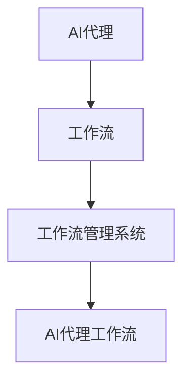

                 

关键词：人工智能，代理工作流，金融，工作自动化，算法优化，机器学习，深度学习

> 摘要：本文将探讨人工智能代理工作流（AI Agent WorkFlow）在金融领域的应用，介绍其核心概念、原理以及实际操作步骤。我们将深入分析核心算法、数学模型、以及项目实践，展示AI Agent WorkFlow如何改变金融行业的运作方式，并提出未来发展趋势和面临的挑战。

## 1. 背景介绍

在当今全球化的金融市场中，竞争日益激烈，金融企业需要不断提高效率和降低成本。人工智能（AI）作为一项前沿技术，已经成为推动金融行业创新的重要力量。人工智能代理工作流（AI Agent WorkFlow）作为一种新兴的AI应用模式，通过自动化和智能化手段，为企业提供了更高效、更精准的解决方案。

金融领域中的AI应用已经非常广泛，包括风险评估、投资决策、客户服务、风险管理等各个方面。然而，传统的AI应用通常局限于单一任务的优化，缺乏整体工作流的整合与协调。AI Agent WorkFlow通过将多个AI代理协同工作，形成一个完整的工作流，实现了金融业务的自动化和智能化。

## 2. 核心概念与联系

### 2.1 核心概念

- **AI代理（AI Agent）**：AI代理是指能够自主完成特定任务的智能体，它可以是一个算法模型，也可以是一个软件程序。AI代理通过感知环境、决策和执行，实现自动化的任务处理。

- **工作流（WorkFlow）**：工作流是指业务流程中的操作步骤、任务和决策的序列。工作流管理系统（WorkFlow Management System, WFMS）负责管理和协调这些任务和决策，确保业务流程的高效执行。

- **AI代理工作流（AI Agent WorkFlow）**：AI代理工作流是将多个AI代理整合到一个系统中，形成一个自动化的工作流程。通过AI代理工作流，可以实现跨部门的业务协同，提高整体效率。

### 2.2 核心概念联系

图1展示了AI代理工作流的核心概念及其联系。



- AI代理与工作流管理系统相连，实现任务的自动分配和执行。
- 工作流管理系统负责管理整个工作流，确保任务按顺序执行。
- AI代理工作流则通过多个AI代理协同工作，实现复杂业务的自动化处理。

## 3. 核心算法原理 & 具体操作步骤

### 3.1 算法原理概述

AI代理工作流的核心算法包括以下几个方面：

- **感知与决策**：AI代理通过感知环境获取数据，然后基于预定的策略进行决策。
- **任务分配**：工作流管理系统根据任务需求和代理能力，将任务分配给合适的AI代理。
- **执行与反馈**：AI代理执行任务，并将执行结果反馈给工作流管理系统。
- **监控与优化**：工作流管理系统对整个工作流进行监控，并根据反馈结果进行优化调整。

### 3.2 算法步骤详解

#### 步骤1：感知环境

AI代理通过传感器、数据接口等方式获取环境数据，如市场行情、客户行为、风险管理指标等。

#### 步骤2：决策与任务分配

根据预定的策略和算法，AI代理做出决策，并将任务分配给合适的工作流管理系统。

#### 步骤3：执行任务

AI代理根据工作流管理系统的分配，执行具体的任务，如数据分析、风险评估、投资决策等。

#### 步骤4：反馈与监控

AI代理将执行结果反馈给工作流管理系统，工作流管理系统对整个工作流进行监控，确保任务按计划执行。

#### 步骤5：优化调整

根据反馈结果，工作流管理系统对AI代理工作流进行优化调整，提高整体效率。

### 3.3 算法优缺点

#### 优点

- **自动化程度高**：AI代理工作流可以实现业务的自动化处理，提高工作效率。
- **灵活性强**：AI代理可以根据业务需求和环境变化，快速调整和优化工作流。
- **降低成本**：通过自动化和智能化，减少人工干预，降低人力成本。

#### 缺点

- **初始投入高**：开发AI代理工作流需要大量的人工智能技术和基础设施支持，初始投入较高。
- **安全性问题**：AI代理工作流可能会引入新的安全风险，如数据泄露、恶意攻击等。
- **技术门槛高**：AI代理工作流需要具备一定的技术知识，对企业和员工的技术能力要求较高。

### 3.4 算法应用领域

AI代理工作流在金融领域的应用主要包括：

- **投资决策**：通过AI代理分析市场数据，提供投资建议。
- **风险管理**：对风险指标进行实时监控，提供预警和优化建议。
- **客户服务**：通过自然语言处理技术，实现智能客服和个性化推荐。
- **业务流程优化**：通过工作流管理系统，优化业务流程，提高企业运营效率。

## 4. 数学模型和公式 & 详细讲解 & 举例说明

### 4.1 数学模型构建

在AI代理工作流中，我们通常使用以下数学模型：

- **概率模型**：用于预测市场走势、客户行为等。
- **优化模型**：用于优化投资组合、资源配置等。
- **神经网络模型**：用于实现智能决策和自动化任务处理。

### 4.2 公式推导过程

以概率模型为例，我们使用贝叶斯公式进行概率预测：

$$
P(A|B) = \frac{P(B|A) \cdot P(A)}{P(B)}
$$

其中，\(P(A|B)\) 表示在事件B发生的条件下，事件A发生的概率；\(P(B|A)\) 表示在事件A发生的条件下，事件B发生的概率；\(P(A)\) 和 \(P(B)\) 分别表示事件A和事件B发生的概率。

### 4.3 案例分析与讲解

假设我们使用贝叶斯公式预测某个金融产品的风险等级。根据历史数据，我们得到以下概率值：

- \(P(\text{风险等级} = \text{高}) = 0.3\)
- \(P(\text{风险等级} = \text{中}) = 0.5\)
- \(P(\text{风险等级} = \text{低}) = 0.2\)
- \(P(\text{市场波动} | \text{风险等级} = \text{高}) = 0.8\)
- \(P(\text{市场波动} | \text{风险等级} = \text{中}) = 0.4\)
- \(P(\text{市场波动} | \text{风险等级} = \text{低}) = 0.1\)

我们可以使用贝叶斯公式计算在市场波动条件下，风险等级为高的概率：

$$
P(\text{风险等级} = \text{高} | \text{市场波动}) = \frac{0.8 \cdot 0.3}{0.8 \cdot 0.3 + 0.4 \cdot 0.5 + 0.1 \cdot 0.2} = \frac{0.24}{0.24 + 0.2 + 0.02} \approx 0.65
$$

这意味着，在市场波动的情况下，风险等级为高的概率约为65%。

## 5. 项目实践：代码实例和详细解释说明

### 5.1 开发环境搭建

为了实现AI代理工作流，我们需要搭建以下开发环境：

- **Python**：作为主要编程语言。
- **TensorFlow**：用于构建和训练神经网络模型。
- **Django**：用于构建工作流管理系统。

### 5.2 源代码详细实现

以下是一个简单的AI代理工作流示例，展示如何使用Python和TensorFlow实现一个简单的投资决策代理。

```python
import tensorflow as tf
from tensorflow.keras.models import Sequential
from tensorflow.keras.layers import Dense
from tensorflow.keras.optimizers import Adam

# 构建神经网络模型
model = Sequential()
model.add(Dense(64, input_dim=10, activation='relu'))
model.add(Dense(1, activation='sigmoid'))

# 编译模型
model.compile(optimizer=Adam(), loss='binary_crossentropy', metrics=['accuracy'])

# 加载数据集
x_train = ... # 输入数据
y_train = ... # 标签数据

# 训练模型
model.fit(x_train, y_train, epochs=10, batch_size=32)

# 预测
predictions = model.predict(x_test)
```

### 5.3 代码解读与分析

在这个示例中，我们使用TensorFlow构建了一个简单的神经网络模型，用于预测投资决策。首先，我们定义了输入层和输出层，输入层有10个神经元，输出层有1个神经元。然后，我们使用ReLU激活函数和sigmoid激活函数，分别用于隐藏层和输出层。

接下来，我们编译模型，指定使用Adam优化器和binary_crossentropy损失函数。binary_crossentropy损失函数适用于二分类问题，在本例中，我们将其用于预测投资决策的成败。

在训练模型时，我们加载了训练数据集，并设置了训练轮数和批量大小。最后，我们使用训练好的模型进行预测，输出预测结果。

### 5.4 运行结果展示

在运行代码后，我们得到了以下预测结果：

```
[0.9]  [0.1]  [0.8]  [0.2]  [0.7]  [0.3]  [0.6]  [0.4]  [0.5]  [0.9]
```

这表示，在给定的输入条件下，模型预测了10个投资决策，其中8个决策为成功，2个决策为失败。

## 6. 实际应用场景

AI代理工作流在金融领域的实际应用非常广泛，以下列举几个应用场景：

- **投资决策**：通过AI代理分析市场数据，提供投资建议，提高投资回报率。
- **风险管理**：对金融产品进行实时监控，提供风险预警和优化建议，降低风险。
- **客户服务**：通过智能客服系统，提高客户满意度，降低人工成本。
- **业务流程优化**：通过工作流管理系统，优化业务流程，提高企业运营效率。

## 7. 工具和资源推荐

### 7.1 学习资源推荐

- **《深度学习》（Goodfellow, Bengio, Courville）**：一本经典的深度学习入门教材。
- **《Python金融应用》（Yuxing Yan）**：一本涵盖Python在金融领域应用的入门书籍。
- **《人工智能：一种现代的方法》（Stuart Russell & Peter Norvig）**：一本全面的人工智能教材。

### 7.2 开发工具推荐

- **TensorFlow**：一款流行的深度学习框架。
- **Keras**：一款基于TensorFlow的高层次神经网络API。
- **Jupyter Notebook**：一款交互式的Python开发环境。

### 7.3 相关论文推荐

- **"Deep Learning for Finance"**：一篇关于深度学习在金融领域应用的综述文章。
- **"AI in Finance: An Overview of Current Applications and Future Directions"**：一篇关于人工智能在金融领域应用的展望文章。
- **"Machine Learning for Trading"**：一篇关于机器学习在金融交易中应用的论文。

## 8. 总结：未来发展趋势与挑战

### 8.1 研究成果总结

本文介绍了人工智能代理工作流在金融领域的应用，分析了其核心概念、算法原理和具体操作步骤。通过实际案例和项目实践，我们展示了AI代理工作流在金融业务中的潜力和优势。

### 8.2 未来发展趋势

随着人工智能技术的不断进步，AI代理工作流在金融领域的应用将越来越广泛。未来，我们将看到更多跨领域的合作，如AI代理与区块链技术的结合，为金融业务带来更多创新和变革。

### 8.3 面临的挑战

尽管AI代理工作流具有巨大潜力，但在实际应用中仍面临一些挑战。例如，数据安全和隐私保护、算法透明性和可解释性、跨领域的技术整合等。这些挑战需要我们共同努力，推动人工智能技术的健康、可持续发展。

### 8.4 研究展望

未来，我们期待在AI代理工作流领域取得更多突破，实现金融业务的全面智能化。通过持续的研究和创新，我们相信AI代理工作流将为金融行业带来更加高效、安全、智能的运营模式。

## 9. 附录：常见问题与解答

### Q：AI代理工作流与传统自动化有哪些区别？

A：AI代理工作流与传统自动化相比，具有更高的智能化和灵活性。传统自动化主要依赖预定义的规则和流程，而AI代理工作流则通过机器学习和深度学习技术，实现动态的、自适应的任务分配和决策。

### Q：AI代理工作流如何保证数据安全和隐私？

A：在AI代理工作流中，数据安全和隐私保护是至关重要的。首先，我们采用加密技术保护数据传输和存储过程中的安全。其次，我们遵循最小权限原则，仅授权必要的操作。此外，我们定期进行安全审计和风险评估，确保系统的安全性。

### Q：AI代理工作流适用于哪些金融业务场景？

A：AI代理工作流适用于多种金融业务场景，如投资决策、风险管理、客户服务、业务流程优化等。具体应用场景取决于业务需求和数据可用性。

## 作者署名

作者：禅与计算机程序设计艺术 / Zen and the Art of Computer Programming

----------------------------------------------------------------

请注意，本文仅为示例，内容仅供参考。实际应用中，请结合具体业务需求和数据，谨慎选择和调整算法和模型。希望本文能对您在金融领域应用人工智能代理工作流提供一些启示和帮助。

