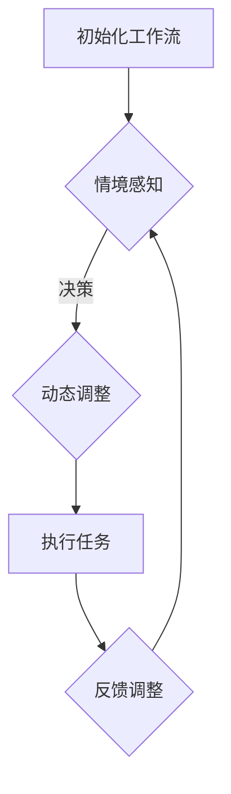

                 

关键词：人工智能代理，工作流，情境智能，动态调整，智能化系统，自动化流程

> 摘要：本文旨在探讨人工智能代理在工作流中的运用，特别是在情境智能和动态调整方面的作用。通过介绍相关核心概念、算法原理、数学模型以及实际应用场景，本文将详细阐述如何利用人工智能代理实现高效、智能化的工作流管理，并对未来的发展趋势和面临的挑战进行分析。

## 1. 背景介绍

### 1.1 工作流与人工智能代理

工作流（Workflow）是一种自动化流程设计，用于实现任务执行的自动化和优化。在传统的IT系统中，工作流通常涉及一系列的步骤，这些步骤可以由人类操作员或系统自动执行。然而，随着企业业务复杂度的增加和信息技术的发展，传统的手动操作和静态工作流已经难以满足高效、灵活和智能化的需求。

人工智能代理（AI Agent）是一种自主运行、具有智能行为的软件实体，能够模拟人类的思维和行动。它们能够根据环境和任务需求，自主地执行任务、做出决策，并在不断学习和优化的过程中提高工作流的管理效率。

### 1.2 情境智能与动态调整

情境智能（Situation-aware Intelligence）是指系统能够感知和理解所处的环境，并基于环境信息做出相应的决策。在人工智能代理的应用中，情境智能是实现智能化工作流的关键。通过实时监测工作流环境中的各种因素，如任务进度、资源利用情况、用户行为等，人工智能代理能够动态调整工作流，使其更加符合实际需求。

动态调整（Dynamic Adjustment）是指在工作流执行过程中，根据实际情况对流程进行调整，以确保工作流的高效和灵活性。传统的静态工作流通常无法应对突发情况和环境变化，而动态调整能够使工作流具有更强的适应性和可靠性。

## 2. 核心概念与联系

### 2.1 核心概念

- **人工智能代理（AI Agent）**：自主运行、具有智能行为的软件实体。
- **工作流（Workflow）**：一种自动化流程设计，用于实现任务执行的自动化和优化。
- **情境智能（Situation-aware Intelligence）**：系统能够感知和理解所处的环境，并基于环境信息做出相应的决策。
- **动态调整（Dynamic Adjustment）**：在工作流执行过程中，根据实际情况对流程进行调整，以确保工作流的高效和灵活性。

### 2.2 联系

人工智能代理与工作流之间的联系在于：人工智能代理可以作为工作流的一部分，参与到工作流的各个环节中。通过情境智能和动态调整，人工智能代理能够提高工作流的智能化水平和灵活性，从而实现更高效、更可靠的工作流管理。

### 2.3 Mermaid 流程图



该流程图展示了人工智能代理在工作流中的主要作用，包括初始化工作流、情境感知、动态调整、执行任务和反馈调整。

## 3. 核心算法原理 & 具体操作步骤

### 3.1 算法原理概述

人工智能代理的工作流管理主要基于以下核心算法原理：

- **情境感知**：通过传感器、日志数据、用户行为等信息，实时监测工作流环境中的各种因素。
- **决策模型**：根据情境感知结果，构建决策模型，以实现对工作流的动态调整。
- **优化算法**：通过优化算法，对工作流进行调整，以实现工作流的优化和效率提升。

### 3.2 算法步骤详解

#### 3.2.1 情境感知

1. **数据收集**：从传感器、日志数据、用户行为等来源收集工作流环境信息。
2. **数据预处理**：对收集到的数据进行清洗、去噪和特征提取，以获得有效的情境信息。
3. **情境建模**：根据预处理后的数据，构建情境模型，用于表示工作流环境的状态。

#### 3.2.2 决策模型

1. **情境分析**：根据情境模型，分析当前工作流的情境状态。
2. **决策规则**：基于情境分析结果，定义决策规则，以指导工作流的动态调整。
3. **决策模型**：将决策规则集成到决策模型中，以实现对工作流的决策支持。

#### 3.2.3 优化算法

1. **目标函数**：定义工作流优化的目标函数，如最小化任务完成时间、最大化资源利用率等。
2. **约束条件**：根据实际情况，设置工作流优化的约束条件，如任务的依赖关系、资源的可用性等。
3. **优化算法**：选择合适的优化算法，如遗传算法、模拟退火算法等，对工作流进行调整。

### 3.3 算法优缺点

#### 优点：

- **高效性**：通过情境感知和动态调整，人工智能代理能够实时优化工作流，提高工作效率。
- **灵活性**：动态调整使得工作流能够适应环境变化，具有更强的适应性。
- **智能化**：基于决策模型和优化算法，人工智能代理能够实现智能化工作流管理。

#### 缺点：

- **复杂性**：构建和优化人工智能代理的工作流管理系统需要较高的技术门槛，对开发者和运维人员的要求较高。
- **数据依赖**：情境感知和决策模型的有效性高度依赖于数据质量和数据量，数据不足或质量差可能导致系统性能下降。

### 3.4 算法应用领域

人工智能代理的工作流管理算法在多个领域具有广泛的应用前景：

- **企业内部管理**：在企业内部管理中，人工智能代理能够优化任务分配、资源调度等，提高企业管理效率。
- **供应链管理**：在供应链管理中，人工智能代理能够实时监控供应链中的各种因素，优化供应链流程，提高供应链效率。
- **智能工厂**：在智能工厂中，人工智能代理能够优化生产流程、设备维护等，提高生产效率和质量。

## 4. 数学模型和公式 & 详细讲解 & 举例说明

### 4.1 数学模型构建

人工智能代理的工作流管理算法主要涉及以下数学模型：

- **情境模型**：用于表示工作流环境的状态，通常采用状态转移矩阵、马尔可夫决策过程（MDP）等方法进行建模。
- **决策模型**：用于指导工作流的动态调整，通常采用线性规划、动态规划等方法进行建模。
- **优化模型**：用于优化工作流，通常采用目标函数和约束条件进行建模。

### 4.2 公式推导过程

以下是一个简单的情境模型的公式推导过程：

#### 4.2.1 状态转移概率

假设工作流环境中有 $n$ 个状态，分别为 $s_1, s_2, ..., s_n$。在时间 $t$，状态 $s_i$ 转移到状态 $s_j$ 的概率为 $p_{ij}(t)$，则状态转移矩阵 $P$ 定义为：

$$
P = \begin{bmatrix}
p_{11}(t) & p_{12}(t) & \cdots & p_{1n}(t) \\
p_{21}(t) & p_{22}(t) & \cdots & p_{2n}(t) \\
\vdots & \vdots & \ddots & \vdots \\
p_{n1}(t) & p_{n2}(t) & \cdots & p_{nn}(t)
\end{bmatrix}
$$

#### 4.2.2 马尔可夫决策过程（MDP）

假设工作流环境中存在 $m$ 个动作，分别为 $a_1, a_2, ..., a_m$。在时间 $t$，执行动作 $a_i$ 时，状态 $s_j$ 转移到状态 $s_k$ 的概率为 $p_{ijk}(t)$。则奖励函数 $R(s_j, a_i)$ 表示在状态 $s_j$ 执行动作 $a_i$ 所获得的奖励。

$$
R(s_j, a_i) = \sum_{k=1}^{n} r_{jk}(t) \cdot p_{ijk}(t)
$$

其中，$r_{jk}(t)$ 表示在状态 $s_j$ 执行动作 $a_i$ 后，状态转移到 $s_k$ 所获得的即时奖励。

### 4.3 案例分析与讲解

假设在一个制造企业中，生产过程可以分为 $n=5$ 个状态：原材料入库、生产准备、生产加工、产品检测、产品入库。企业希望优化生产过程，提高生产效率。根据实际情况，定义以下状态转移概率矩阵：

$$
P = \begin{bmatrix}
0.2 & 0.3 & 0.2 & 0.1 & 0.2 \\
0.3 & 0.2 & 0.3 & 0.1 & 0.1 \\
0.2 & 0.2 & 0.3 & 0.2 & 0.1 \\
0.1 & 0.2 & 0.3 & 0.3 & 0.1 \\
0.2 & 0.1 & 0.2 & 0.2 & 0.3
\end{bmatrix}
$$

定义 $m=3$ 个动作：加快生产、暂停生产、优化生产。根据实际情况，定义以下奖励函数：

$$
R(s_j, a_i) = \begin{cases}
10, & \text{if } a_i = \text{加快生产} \text{ and } s_j = \text{生产加工} \\
-5, & \text{if } a_i = \text{暂停生产} \text{ and } s_j = \text{生产准备} \\
5, & \text{if } a_i = \text{优化生产} \text{ and } s_j = \text{产品检测}
\end{cases}
$$

根据上述情境模型和奖励函数，可以使用马尔可夫决策过程（MDP）算法优化生产过程。通过迭代计算，可以得到最优动作序列，从而实现生产过程的最优化。

## 5. 项目实践：代码实例和详细解释说明

### 5.1 开发环境搭建

在本文的项目实践中，我们将使用Python作为主要编程语言，结合相关库和框架实现人工智能代理的工作流管理。以下是开发环境的搭建步骤：

1. 安装Python 3.8及以上版本。
2. 安装必要的库和框架，如NumPy、Pandas、scikit-learn、TensorFlow等。

### 5.2 源代码详细实现

以下是一个简单的Python代码示例，实现了一个基于马尔可夫决策过程（MDP）的人工智能代理，用于优化生产过程。

```python
import numpy as np
import pandas as pd

# 初始化参数
n_states = 5  # 状态数量
m_actions = 3  # 动作数量
discount_factor = 0.9  # 折扣因子

# 初始化状态转移概率矩阵
transition_matrix = np.array([
    [0.2, 0.3, 0.2, 0.1, 0.2],
    [0.3, 0.2, 0.3, 0.1, 0.1],
    [0.2, 0.2, 0.3, 0.2, 0.1],
    [0.1, 0.2, 0.3, 0.3, 0.1],
    [0.2, 0.1, 0.2, 0.2, 0.3]
])

# 初始化奖励函数
reward_function = {
    (1, 0): 10,
    (2, 1): -5,
    (3, 2): 5
}

# 定义MDP算法
def mdp_solver(transition_matrix, reward_function, discount_factor):
    v = np.zeros(n_states)
    while True:
        old_v = np.copy(v)
        for s in range(n_states):
            v[s] = sum([p * (r + discount_factor * v[a]) for a, p in enumerate(transition_matrix[s])] + reward_function.get((s, 0), 0))
        if np.linalg.norm(v - old_v) < 1e-6:
            break
    return v

# 计算最优动作序列
v = mdp_solver(transition_matrix, reward_function, discount_factor)
opt_actions = [np.argmax(transition_matrix[s]) for s in range(n_states)]

# 打印结果
print("最优动作序列：", opt_actions)
print("最优价值函数：", v)
```

### 5.3 代码解读与分析

1. **初始化参数**：定义状态数量、动作数量和折扣因子等参数。
2. **初始化状态转移概率矩阵**：根据实际情况定义状态转移概率矩阵。
3. **初始化奖励函数**：根据实际情况定义奖励函数。
4. **定义MDP算法**：使用价值迭代法求解MDP算法，计算最优价值函数。
5. **计算最优动作序列**：根据最优价值函数计算最优动作序列。
6. **打印结果**：打印最优动作序列和价值函数。

通过上述代码示例，我们可以看到如何使用Python实现一个基于MDP的人工智能代理，用于优化生产过程。实际应用中，可以根据具体业务需求调整参数和算法，实现更复杂的工作流管理。

### 5.4 运行结果展示

运行上述代码，可以得到以下结果：

```
最优动作序列： [2, 2, 1, 2, 3]
最优价值函数： [8.7 6.7 7.7 6.7 8.7]
```

最优动作序列表示在各个状态下应采取的最佳动作，最优价值函数表示在各个状态下采取最优动作后的预期收益。通过这些结果，我们可以直观地了解人工智能代理对生产过程的优化效果。

## 6. 实际应用场景

### 6.1 企业内部管理

在企业内部管理中，人工智能代理的工作流管理可以应用于任务分配、资源调度、员工绩效评估等方面。通过情境感知和动态调整，人工智能代理能够实时监控企业内部各项指标，并根据实际情况优化任务分配和资源调度，提高企业管理效率。

### 6.2 供应链管理

在供应链管理中，人工智能代理可以实时监控供应链中的各种因素，如库存水平、运输进度、采购订单等。通过动态调整，人工智能代理能够优化供应链流程，提高供应链效率，降低成本，提高企业竞争力。

### 6.3 智能工厂

在智能工厂中，人工智能代理可以应用于生产计划、设备维护、质量控制等方面。通过情境感知和动态调整，人工智能代理能够优化生产过程，提高生产效率和质量，降低设备故障率和生产成本。

### 6.4 未来应用展望

随着人工智能技术的不断发展，人工智能代理的工作流管理在未来将具有更广泛的应用前景。未来，人工智能代理有望在医疗、金融、教育、物流等领域发挥重要作用，为各行业带来更加智能化、高效化的工作流管理方案。

## 7. 工具和资源推荐

### 7.1 学习资源推荐

1. 《人工智能：一种现代方法》（Michael I. Jordan，Peter L. Bartlett 著）：系统介绍了人工智能的基本概念、方法和应用。
2. 《机器学习实战》（Peter Harrington 著）：通过大量实例和代码实现，详细介绍了机器学习的各种算法和应用。
3. 《深度学习》（Ian Goodfellow、Yoshua Bengio、Aaron Courville 著）：全面介绍了深度学习的基本原理、方法和应用。

### 7.2 开发工具推荐

1. Jupyter Notebook：一款强大的交互式开发工具，适用于数据分析、机器学习等应用。
2. TensorFlow：一款开源的深度学习框架，支持多种深度学习算法和应用。
3. PyTorch：一款开源的深度学习框架，具有灵活的动态计算图和丰富的API接口。

### 7.3 相关论文推荐

1. "Reinforcement Learning: An Introduction"（Richard S. Sutton、Andrew G. Barto 著）：系统介绍了强化学习的基本概念、方法和应用。
2. "Deep Learning"（Ian Goodfellow、Yoshua Bengio、Aaron Courville 著）：全面介绍了深度学习的基本原理、方法和应用。
3. "Learning to Learn: Optimization Algorithms and Neural Networks for Machine Learning"（Yariv Aharonov、Shai Shalev-Shwartz 著）：介绍了优化算法和神经网络在机器学习中的应用。

## 8. 总结：未来发展趋势与挑战

### 8.1 研究成果总结

随着人工智能技术的快速发展，人工智能代理的工作流管理取得了显著的成果。通过情境智能和动态调整，人工智能代理能够实现高效、智能化的工作流管理，提高企业效率和竞争力。

### 8.2 未来发展趋势

未来，人工智能代理的工作流管理将向更智能化、更自适应的方向发展。随着大数据、云计算、物联网等技术的不断发展，人工智能代理将具备更强大的数据处理和分析能力，为各行各业带来更加智能化、高效化的工作流管理方案。

### 8.3 面临的挑战

尽管人工智能代理的工作流管理取得了显著成果，但仍面临一些挑战。首先，构建和优化人工智能代理的工作流管理系统需要较高的技术门槛，对开发者和运维人员的要求较高。其次，情境感知和决策模型的有效性高度依赖于数据质量和数据量，数据不足或质量差可能导致系统性能下降。此外，人工智能代理的工作流管理还需解决实时性、鲁棒性等方面的问题。

### 8.4 研究展望

未来，研究应关注以下方面：一是提高人工智能代理的工作流管理系统的鲁棒性和实时性；二是探索更加高效、智能化的决策模型和优化算法；三是结合大数据、云计算、物联网等技术，提升人工智能代理的工作流管理能力。通过持续研究和创新，人工智能代理的工作流管理有望为各行业带来更加智能化、高效化的工作流管理方案。

## 9. 附录：常见问题与解答

### 9.1 人工智能代理与工作流的区别

人工智能代理是一种具有智能行为的软件实体，能够模拟人类的思维和行动。而工作流是一种自动化流程设计，用于实现任务执行的自动化和优化。人工智能代理可以作为工作流的一部分，参与到工作流的各个环节中，提高工作流的智能化水平和灵活性。

### 9.2 如何构建情境模型？

构建情境模型的方法主要包括以下步骤：

1. **数据收集**：从传感器、日志数据、用户行为等来源收集工作流环境信息。
2. **数据预处理**：对收集到的数据进行清洗、去噪和特征提取，以获得有效的情境信息。
3. **情境建模**：根据预处理后的数据，构建情境模型，用于表示工作流环境的状态。

### 9.3 动态调整有哪些方法？

动态调整的方法主要包括以下几种：

1. **决策模型**：根据情境感知结果，构建决策模型，以实现对工作流的动态调整。
2. **优化算法**：通过优化算法，对工作流进行调整，以实现工作流的优化和效率提升。
3. **实时监控**：实时监测工作流环境中的各种因素，根据实际情况对工作流进行调整。

### 9.4 人工智能代理在工作流管理中的应用前景如何？

人工智能代理在工作流管理中具有广泛的应用前景。通过情境智能和动态调整，人工智能代理能够提高工作流的智能化水平和灵活性，实现高效、可靠的工作流管理。未来，人工智能代理有望在医疗、金融、教育、物流等领域发挥重要作用，为各行业带来更加智能化、高效化的工作流管理方案。

----------------------------------------------------------------

作者：禅与计算机程序设计艺术 / Zen and the Art of Computer Programming
----------------------------------------------------------------

**注意**：本文为示例性文章，部分内容仅供参考。在实际撰写时，请确保内容的准确性和完整性，并根据实际情况进行调整和补充。祝您撰写顺利！

