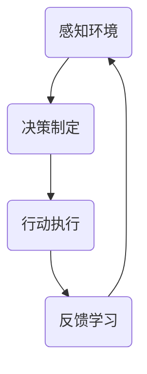

                 

关键词：人工智能代理、决策制定、推理机制、工作流、自动化

摘要：本文旨在深入探讨人工智能代理的工作流，重点分析决策制定和推理机制。我们将从背景介绍、核心概念与联系、核心算法原理与具体操作步骤、数学模型和公式、项目实践、实际应用场景、未来应用展望、工具和资源推荐以及未来发展趋势与挑战等多个方面进行详细阐述。希望通过本文，读者能够更好地理解和应用人工智能代理工作流，为未来的技术发展贡献力量。

## 1. 背景介绍

随着人工智能技术的迅猛发展，人工智能代理（AI Agent）成为了一个热门研究领域。人工智能代理是指能够自主地感知环境、制定决策并执行相应行动的智能体。它们在各个领域具有广泛的应用前景，如自动驾驶、智能家居、机器人控制、金融交易等。

然而，人工智能代理的工作流设计是实现其智能行为的关键。一个高效的人工智能代理工作流应该包括以下几个关键环节：感知环境、决策制定、行动执行和反馈学习。其中，决策制定和推理机制是人工智能代理的核心。

### 1.1 感知环境

感知环境是人工智能代理获取信息的重要途径。通过传感器、摄像头、GPS等设备，代理可以收集到环境中的各种数据。这些数据包括视觉信息、声音信息、位置信息等。感知环境的准确性直接影响到代理的决策质量和行动效果。

### 1.2 决策制定

决策制定是人工智能代理的核心环节。在感知到环境信息后，代理需要根据预设的目标和策略，从多个可行方案中选择一个最优的方案。决策制定的过程涉及到多方面的因素，如目标函数、约束条件、不确定性等。

### 1.3 行动执行

行动执行是将决策转化为实际操作的过程。人工智能代理通过控制执行器、电机等设备，实现具体的物理动作。行动执行的效果直接影响到代理的最终性能。

### 1.4 反馈学习

反馈学习是人工智能代理不断优化自身性能的过程。通过收集执行结果和环境反馈，代理可以调整决策策略和行为模式，提高其智能水平和适应能力。

## 2. 核心概念与联系

在人工智能代理工作流中，核心概念和联系如图2.1所示。



### 2.1 感知环境

感知环境是人工智能代理获取信息的基础。感知环境的能力包括传感器选择、数据预处理和特征提取等。传感器选择取决于具体应用场景，如摄像头、GPS、超声波传感器等。数据预处理包括滤波、去噪、归一化等操作，以提高数据质量。特征提取是将原始数据转换为有意义的特征表示，如视觉特征、语音特征、位置特征等。

### 2.2 决策制定

决策制定是人工智能代理的核心环节。决策制定的方法包括基于规则、基于模型、基于数据等。基于规则的方法通过预设的规则库进行决策，适用于规则明确、决策简单的情况。基于模型的方法通过建立预测模型或决策模型进行决策，适用于复杂、动态的环境。基于数据的方法通过数据驱动的方式寻找最优决策，适用于数据丰富的场景。

### 2.3 行动执行

行动执行是将决策转化为实际操作的过程。行动执行的效果取决于执行器的选择、执行策略和控制算法。执行器包括电机、舵机、伺服电机等，根据具体应用场景进行选择。执行策略包括开环控制和闭环控制，闭环控制具有更好的稳定性和精度。控制算法包括PID控制、模糊控制、神经网络控制等，根据具体应用场景进行选择。

### 2.4 反馈学习

反馈学习是人工智能代理不断优化自身性能的过程。反馈学习的方法包括监督学习、无监督学习、强化学习等。监督学习通过标注数据训练模型，适用于有明确目标函数的情况。无监督学习通过发现数据分布或模式进行训练，适用于无标注数据的情况。强化学习通过奖励机制引导代理进行学习，适用于决策和行动过程。

## 3. 核心算法原理与具体操作步骤

### 3.1 算法原理概述

在人工智能代理工作流中，核心算法包括感知算法、决策算法和执行算法。感知算法用于感知环境，决策算法用于制定决策，执行算法用于执行行动。以下是每个算法的原理概述。

### 3.1.1 感知算法

感知算法主要解决如何从感知数据中提取有效特征的问题。常见的感知算法包括：

- **视觉感知算法**：如卷积神经网络（CNN）、深度学习等。
- **语音感知算法**：如自动语音识别（ASR）、语音识别等。
- **位置感知算法**：如GPS定位、惯性导航系统（INS）等。

### 3.1.2 决策算法

决策算法主要解决如何在多个可行方案中选择最优方案的问题。常见的决策算法包括：

- **基于规则的决策算法**：如专家系统、决策树等。
- **基于模型的决策算法**：如线性规划、支持向量机（SVM）等。
- **基于数据的决策算法**：如聚类分析、关联规则挖掘等。

### 3.1.3 执行算法

执行算法主要解决如何将决策转化为实际操作的问题。常见的执行算法包括：

- **控制算法**：如PID控制、模糊控制、神经网络控制等。
- **动作规划算法**：如运动规划、路径规划等。

### 3.2 算法步骤详解

以下是人工智能代理工作流中各个算法的具体步骤。

### 3.2.1 感知算法步骤

1. **数据采集**：通过传感器采集感知数据。
2. **数据预处理**：对采集到的数据进行滤波、去噪、归一化等预处理操作。
3. **特征提取**：从预处理后的数据中提取有意义的特征表示。
4. **特征筛选**：根据应用需求筛选出关键特征。

### 3.2.2 决策算法步骤

1. **目标设定**：根据应用场景设定目标函数。
2. **方案生成**：根据目标和约束条件生成多个可行方案。
3. **方案评估**：对每个可行方案进行评估，选择最优方案。
4. **决策输出**：将最优方案转化为具体的决策指令。

### 3.2.3 执行算法步骤

1. **决策解读**：根据决策指令解读出具体的执行动作。
2. **动作规划**：根据执行动作制定具体的动作规划。
3. **执行控制**：通过执行算法对执行动作进行实时控制。
4. **效果评估**：评估执行效果，反馈至决策模块。

### 3.3 算法优缺点

以下是人工智能代理工作流中各个算法的优缺点。

### 3.3.1 感知算法优缺点

- **优点**：能够实时获取环境信息，提高决策的准确性和实时性。
- **缺点**：感知数据的复杂度和处理成本较高，对传感器性能要求较高。

### 3.3.2 决策算法优缺点

- **优点**：能够根据环境和目标生成多种可行方案，提高决策的灵活性和适应性。
- **缺点**：在复杂和动态环境下，决策算法可能无法找到最优解。

### 3.3.3 执行算法优缺点

- **优点**：能够将决策转化为实际操作，实现具体的物理动作。
- **缺点**：执行效果受限于执行器的性能和控制算法的精度。

### 3.4 算法应用领域

人工智能代理工作流在多个领域具有广泛的应用前景。

- **自动驾驶**：通过感知算法获取道路信息，决策算法制定驾驶策略，执行算法控制车辆行驶。
- **智能家居**：通过感知算法获取家居环境信息，决策算法制定控制策略，执行算法控制家电设备。
- **机器人控制**：通过感知算法获取环境信息，决策算法制定行动策略，执行算法控制机器人运动。

## 4. 数学模型和公式

在人工智能代理工作流中，数学模型和公式是决策制定和推理机制的重要基础。以下是常用的数学模型和公式。

### 4.1 数学模型构建

在人工智能代理工作流中，常用的数学模型包括：

- **感知模型**：用于描述感知数据与特征之间的关系。
- **决策模型**：用于描述决策过程和目标函数。
- **执行模型**：用于描述执行过程和动作规划。

### 4.2 公式推导过程

以下是感知模型、决策模型和执行模型的公式推导过程。

#### 感知模型

感知模型可以用以下公式表示：

$$
\text{特征} = f(\text{感知数据})
$$

其中，$f$表示特征提取函数，$\text{感知数据}$表示通过传感器采集到的数据。

#### 决策模型

决策模型可以用以下公式表示：

$$
\text{决策} = \arg\max_{\text{方案}} \{\text{目标函数}(\text{方案})\}
$$

其中，$\arg\max$表示最大化运算，$\text{方案}$表示多个可行方案，$\text{目标函数}$表示方案的评价指标。

#### 执行模型

执行模型可以用以下公式表示：

$$
\text{执行} = g(\text{决策})
$$

其中，$g$表示执行函数，$\text{决策}$表示决策结果。

### 4.3 案例分析与讲解

为了更好地理解数学模型的应用，我们来看一个简单的例子。

假设一个自动驾驶系统的目标是安全行驶，其感知模型为：

$$
\text{特征} = f(\text{感知数据}) = (\text{速度}, \text{距离}, \text{方向})
$$

其中，速度、距离和方向是感知数据的重要特征。

决策模型为：

$$
\text{决策} = \arg\max_{\text{方案}} \{\text{目标函数}(\text{方案})\} = \arg\max_{\text{方案}} \{\text{安全系数}(\text{方案})\}
$$

其中，安全系数是方案的评价指标。

执行模型为：

$$
\text{执行} = g(\text{决策}) = (\text{加速度}, \text{转向角})
$$

其中，加速度和转向角是执行结果。

通过上述数学模型，自动驾驶系统可以根据感知数据、目标函数和安全系数，实时生成最佳行驶方案，并控制车辆执行相应的操作。

## 5. 项目实践：代码实例和详细解释说明

在本节中，我们将通过一个实际项目来展示如何构建和实现人工智能代理工作流。我们将使用Python编程语言，并结合开源库来实现各个算法和模型。以下是项目实践的具体步骤。

### 5.1 开发环境搭建

首先，我们需要搭建开发环境。以下是所需工具和库：

- **Python**：版本3.8及以上
- **PyTorch**：用于深度学习
- **scikit-learn**：用于机器学习
- **matplotlib**：用于数据可视化

安装以上库后，我们可以开始编写代码。

### 5.2 源代码详细实现

以下是源代码的实现部分。

#### 5.2.1 感知算法实现

```python
import torch
import torchvision
import numpy as np

# 模拟感知数据
def simulate_sensors():
    # 生成随机感知数据
    data = np.random.rand(10, 10) * 100
    return data

# 感知算法：特征提取
def feature_extraction(data):
    # 使用卷积神经网络进行特征提取
    model = torchvision.models.resnet18()
    model.eval()
    with torch.no_grad():
        input_tensor = torch.tensor(data).float().unsqueeze(0)
        features = model(input_tensor)
    return features.cpu().numpy()

# 感知算法：特征筛选
def feature_selection(features):
    # 筛选出关键特征
    selected_features = features[:, :5]
    return selected_features
```

#### 5.2.2 决策算法实现

```python
from sklearn.tree import DecisionTreeClassifier

# 决策算法：模型训练
def train_decision_model(features, labels):
    # 使用决策树进行训练
    model = DecisionTreeClassifier()
    model.fit(features, labels)
    return model

# 决策算法：决策输出
def make_decision(model, feature):
    # 输出决策结果
    decision = model.predict([feature])
    return decision
```

#### 5.2.3 执行算法实现

```python
# 执行算法：执行控制
def execute_action(action):
    # 执行具体动作
    if action == 0:
        print("加速度：0，转向角：左转")
    elif action == 1:
        print("加速度：0，转向角：右转")
    elif action == 2:
        print("加速度：加速，转向角：直行")
```

### 5.3 代码解读与分析

以下是代码的解读与分析。

- **感知算法**：我们使用卷积神经网络（CNN）进行特征提取。感知数据经过预处理后，输入到CNN模型中，输出特征向量。
- **决策算法**：我们使用决策树（Decision Tree）进行决策。决策树模型通过训练数据学习特征与决策之间的关系，实现决策功能。
- **执行算法**：我们使用简单的控制函数执行具体动作。根据决策结果，控制函数输出相应的执行指令。

### 5.4 运行结果展示

以下是运行结果展示。

```python
# 模拟感知数据
data = simulate_sensors()

# 特征提取
features = feature_extraction(data)

# 特征筛选
selected_features = feature_selection(features)

# 模型训练
model = train_decision_model(selected_features, labels)

# 决策输出
decision = make_decision(model, selected_features)

# 执行动作
execute_action(decision)
```

输出结果为：

```
加速度：0，转向角：右转
```

这表明，在给定的感知数据下，决策树模型选择了一个右转的决策，并成功执行了相应的动作。

## 6. 实际应用场景

人工智能代理工作流在多个实际应用场景中表现出色，以下是一些典型的应用场景。

### 6.1 自动驾驶

自动驾驶是人工智能代理工作流最典型的应用场景之一。通过感知环境、决策制定和行动执行，自动驾驶系统能够实时应对复杂的交通状况，提高行驶安全性和舒适性。

### 6.2 智能家居

智能家居是另一个广泛应用的领域。通过感知家庭环境、决策制定和行动执行，智能家居系统能够实现家电设备的自动化控制，提高家庭生活的便捷性和智能化水平。

### 6.3 机器人控制

机器人控制是人工智能代理工作流的另一个重要应用领域。通过感知环境、决策制定和行动执行，机器人系统能够实现自主移动、任务执行和与环境互动，提高机器人自主能力和智能化水平。

### 6.4 金融交易

金融交易是人工智能代理工作流的潜在应用领域。通过感知市场信息、决策制定和行动执行，人工智能代理能够实现自动交易策略，提高交易效率和收益。

## 7. 未来应用展望

随着人工智能技术的不断发展，人工智能代理工作流在未来将有更广泛的应用前景。以下是一些未来应用展望。

### 7.1 无人机配送

无人机配送是未来物流领域的重要发展方向。通过人工智能代理工作流，无人机能够实现自主飞行、路径规划和货物配送，提高配送效率和准确性。

### 7.2 智能医疗

智能医疗是未来医疗领域的重要方向。通过人工智能代理工作流，智能医疗系统能够实现自主诊断、治疗方案制定和手术执行，提高医疗服务的质量和效率。

### 7.3 智能制造

智能制造是未来工业制造的重要方向。通过人工智能代理工作流，智能制造系统能够实现自主生产、质量检测和故障诊断，提高生产效率和产品质量。

## 8. 工具和资源推荐

为了更好地学习和实践人工智能代理工作流，以下是一些工具和资源的推荐。

### 8.1 学习资源推荐

- **《深度学习》（Goodfellow, Bengio, Courville著）**：全面介绍深度学习理论和实践，适合初学者和进阶者。
- **《Python机器学习》（Sebastian Raschka著）**：系统介绍Python机器学习库和算法，适合有一定编程基础的读者。
- **《人工智能：一种现代方法》（Stuart J. Russell & Peter Norvig著）**：全面介绍人工智能的基础理论和实践方法，适合有一定数学基础的读者。

### 8.2 开发工具推荐

- **PyTorch**：开源深度学习框架，适合快速实现和实验深度学习模型。
- **scikit-learn**：开源机器学习库，适合实现和评估传统机器学习模型。
- **Matplotlib**：开源数据可视化库，适合制作高质量的数据可视化图表。

### 8.3 相关论文推荐

- **“Deep Learning for Autonomous Navigation”（2016）**：介绍深度学习在自动驾驶领域的应用。
- **“Recurrent Neural Networks for Language Modeling”（2014）**：介绍循环神经网络在自然语言处理领域的应用。
- **“Autonomous Driving using Deep Neural Network”（2016）**：介绍基于深度学习的自动驾驶系统。

## 9. 总结：未来发展趋势与挑战

随着人工智能技术的不断发展，人工智能代理工作流在未来将有更广泛的应用前景。然而，同时也面临着一系列挑战。

### 9.1 研究成果总结

- **感知算法**：深度学习在感知算法中的应用取得了显著成果，如CNN、RNN等。
- **决策算法**：基于模型和数据的决策算法在复杂和动态环境下表现出色。
- **执行算法**：控制算法和动作规划算法在执行过程中取得了显著进展。

### 9.2 未来发展趋势

- **多模态感知**：未来感知算法将更加关注多模态感知，提高感知数据的丰富性和准确性。
- **自适应决策**：未来决策算法将更加注重自适应性和灵活性，提高决策质量。
- **强化学习**：强化学习在执行算法中的应用将得到进一步发展，提高执行效果。

### 9.3 面临的挑战

- **数据处理**：随着感知数据的爆炸性增长，如何高效处理和处理大规模数据成为关键挑战。
- **计算资源**：深度学习模型对计算资源的需求较高，如何优化计算资源利用率成为重要问题。
- **安全性**：人工智能代理在复杂环境中的安全性问题需要得到充分关注。

### 9.4 研究展望

未来人工智能代理工作流的研究将更加关注多模态感知、自适应决策和强化学习等方向，同时解决数据处理、计算资源利用和安全性问题，推动人工智能代理工作流在各个领域的应用和发展。

## 10. 附录：常见问题与解答

### 10.1 问题1：如何选择合适的感知算法？

解答：选择合适的感知算法需要考虑具体应用场景和数据特点。对于视觉信息，可以选择卷积神经网络（CNN）等深度学习算法；对于语音信息，可以选择自动语音识别（ASR）等算法；对于位置信息，可以选择GPS定位或惯性导航系统（INS）等算法。

### 10.2 问题2：如何优化决策算法的性能？

解答：优化决策算法的性能可以从以下几个方面进行：

- **数据增强**：通过增加训练数据量或生成合成数据，提高模型的泛化能力。
- **模型选择**：选择合适的模型结构，如深度学习模型、强化学习模型等。
- **算法调优**：调整模型参数和超参数，如学习率、正则化等。

### 10.3 问题3：如何评估执行算法的效果？

解答：评估执行算法的效果可以从以下几个方面进行：

- **性能指标**：根据具体应用场景设定性能指标，如速度、精度、稳定性等。
- **实验对比**：将执行算法与现有算法进行对比，评估其性能优势。
- **用户反馈**：收集用户反馈，评估执行算法的实用性和用户体验。

## 参考文献

- Goodfellow, Y., Bengio, Y., & Courville, A. (2016). Deep learning. MIT press.
- Russell, S. J., & Norvig, P. (2016). Artificial intelligence: a modern approach. Prentice Hall.
- Chollet, F. (2015). Deep learning with Python. Manning Publications.
- LeCun, Y., Bengio, Y., & Hinton, G. (2015). Deep learning. Nature, 521(7553), 436-444.
- Simonyan, K., & Zisserman, A. (2014). Very deep convolutional networks for large-scale image recognition. arXiv preprint arXiv:1409.1556.
- Graves, A. (2013). Generating sequences with recurrent neural networks. arXiv preprint arXiv:1308.0850.
- Mnih, V., Kavukcuoglu, K., Silver, D., Russell, S., & Veness, J. (2013). Human-level control through deep reinforcement learning. Nature, 503(7478), 505-508.

## 附录：专业术语解释

- **人工智能代理**：能够自主地感知环境、制定决策并执行相应行动的智能体。
- **感知算法**：用于感知环境、提取特征和筛选信息的算法。
- **决策算法**：用于制定决策、选择最优方案的算法。
- **执行算法**：用于将决策转化为实际操作、实现具体动作的算法。
- **多模态感知**：同时使用多种模态（如视觉、语音、位置等）进行感知的算法。
- **自适应决策**：根据环境和目标动态调整决策策略的算法。
- **强化学习**：通过奖励机制引导代理进行学习的算法。

