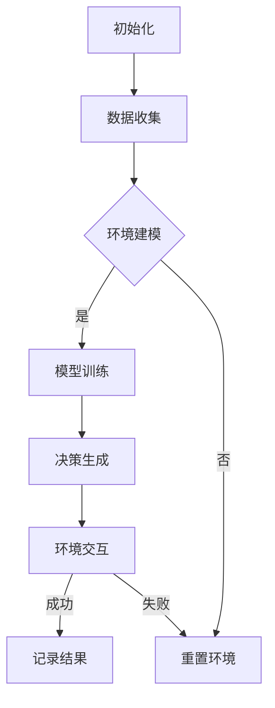

                 

关键词：人工智能、深度学习、仿真环境、代理、实验、评估、算法

> 摘要：本文深入探讨了人工智能领域中的深度学习算法，特别是在仿真环境中的应用。文章从背景介绍出发，详细阐述了核心概念和算法原理，并通过具体实例展示了算法的操作步骤。接着，文章对数学模型和公式进行了详细讲解，并提供了代码实例和实际应用场景。最后，文章总结了未来发展趋势与面临的挑战，并推荐了相关工具和资源。

## 1. 背景介绍

随着计算能力的提升和数据量的激增，人工智能（AI）技术取得了显著的进步。深度学习作为一种重要的AI技术，已经广泛应用于计算机视觉、自然语言处理、自动驾驶等领域。然而，在仿真环境中的应用仍然面临诸多挑战。

仿真环境作为一种模拟真实世界的虚拟场景，能够为深度学习算法提供丰富的训练数据。深度学习代理，作为仿真环境中的智能体，通过不断学习与优化，能够模拟出更加接近真实场景的决策行为。

本文旨在探讨深度学习算法在仿真环境中的应用，通过对代理的实验与评估，分析其性能与效率，为后续研究提供参考。

## 2. 核心概念与联系

### 2.1 深度学习

深度学习是一种基于人工神经网络的机器学习技术，通过多层神经网络模型对数据进行学习与预测。其主要特点包括：

- **多层神经网络**：深度学习模型由多个层次组成，每层都对输入数据进行特征提取和抽象。
- **非线性激活函数**：激活函数引入非线性特性，使得模型能够学习到复杂的特征。
- **大规模训练数据**：深度学习模型需要大量的训练数据来调整模型参数，以达到更好的泛化能力。

### 2.2 仿真环境

仿真环境是一种模拟真实世界的虚拟场景，通过计算机模拟实现对系统的测试、评估和优化。仿真环境的主要特点包括：

- **可定制性**：仿真环境可以根据需求进行定制，以适应不同的应用场景。
- **高效性**：仿真环境能够快速生成大量的测试数据，提高算法的性能评估效率。
- **实时性**：仿真环境可以实现实时交互，为深度学习代理提供动态决策支持。

### 2.3 深度学习代理

深度学习代理是一种在仿真环境中通过深度学习算法进行决策的智能体。其主要特点包括：

- **自学习能力**：深度学习代理通过不断学习仿真环境中的数据，优化决策策略。
- **适应性**：深度学习代理可以根据仿真环境的动态变化，调整决策行为。
- **高效性**：深度学习代理能够快速响应仿真环境的反馈，提高系统的运行效率。

### 2.4 Mermaid 流程图

以下是一个简单的Mermaid流程图，展示了深度学习代理在仿真环境中的主要流程：



## 3. 核心算法原理 & 具体操作步骤

### 3.1 算法原理概述

深度学习算法的核心在于通过多层神经网络对数据进行特征提取和抽象。具体操作步骤如下：

1. **输入数据预处理**：对输入数据进行归一化、缩放等预处理操作，使其符合模型的输入要求。
2. **模型搭建**：搭建多层神经网络模型，包括输入层、隐藏层和输出层。
3. **模型训练**：通过反向传播算法，不断调整模型参数，使得模型对训练数据达到较高的拟合程度。
4. **模型评估**：使用验证数据集评估模型性能，调整模型结构或参数，以优化模型性能。
5. **决策生成**：使用训练好的模型对仿真环境中的数据进行预测，生成相应的决策。
6. **环境交互**：将决策应用于仿真环境，与环境进行交互，获取反馈信息。
7. **结果记录**：记录决策结果和环境反馈，用于后续分析。

### 3.2 算法步骤详解

1. **数据收集**：从仿真环境中收集大量数据，包括输入数据和标签数据。
2. **数据预处理**：对输入数据进行归一化、缩放等预处理操作，使其符合模型的输入要求。例如，对于图像数据，可以使用归一化操作将其像素值缩放到[0, 1]之间。
3. **模型搭建**：使用深度学习框架（如TensorFlow、PyTorch等）搭建多层神经网络模型。模型结构可以根据具体应用场景进行调整，例如增加隐藏层节点数、改变激活函数等。
4. **模型训练**：通过反向传播算法，不断调整模型参数，使得模型对训练数据达到较高的拟合程度。训练过程中，可以使用不同的优化算法（如随机梯度下降、Adam等）和正则化技术（如dropout、L1/L2正则化等）来提高模型性能。
5. **模型评估**：使用验证数据集评估模型性能，根据评估结果调整模型结构或参数，以优化模型性能。常见的评估指标包括准确率、召回率、F1值等。
6. **决策生成**：使用训练好的模型对仿真环境中的数据进行预测，生成相应的决策。例如，在自动驾驶场景中，模型可以预测下一个道路动作。
7. **环境交互**：将决策应用于仿真环境，与环境进行交互，获取反馈信息。例如，在自动驾驶场景中，模型生成的道路动作可以应用于虚拟车辆，与环境中的其他车辆、行人等进行交互。
8. **结果记录**：记录决策结果和环境反馈，用于后续分析。例如，可以记录决策成功的次数、决策失败的原因等。

### 3.3 算法优缺点

**优点**：

- **强大的学习能力**：深度学习算法能够自动学习数据中的复杂特征，提高模型泛化能力。
- **适用于多种应用场景**：深度学习算法可以应用于计算机视觉、自然语言处理、自动驾驶等多种领域。
- **高效的决策生成**：通过模型预测，能够快速生成相应的决策，提高系统运行效率。

**缺点**：

- **需要大量训练数据**：深度学习算法需要大量训练数据来调整模型参数，数据收集和处理过程较为复杂。
- **计算资源消耗大**：深度学习算法在训练过程中需要大量的计算资源，对硬件设备要求较高。
- **解释性差**：深度学习算法的决策过程较为复杂，难以解释其内部机制。

### 3.4 算法应用领域

深度学习算法在仿真环境中的应用领域非常广泛，包括但不限于：

- **自动驾驶**：使用深度学习算法预测道路动作，实现自动驾驶功能。
- **智能游戏**：使用深度学习算法实现智能体在游戏中的决策，提高游戏体验。
- **医疗诊断**：使用深度学习算法对医疗图像进行分析，提高疾病诊断的准确率。
- **智能客服**：使用深度学习算法实现智能客服系统的自然语言处理功能。

## 4. 数学模型和公式 & 详细讲解 & 举例说明

### 4.1 数学模型构建

深度学习算法的核心在于构建数学模型，通过优化模型参数来实现对数据的拟合。以下是构建深度学习模型的基本步骤：

1. **定义损失函数**：损失函数用于衡量模型预测值与真实值之间的差距，常用的损失函数包括均方误差（MSE）、交叉熵损失等。
2. **选择优化算法**：优化算法用于调整模型参数，以最小化损失函数。常用的优化算法包括随机梯度下降（SGD）、Adam等。
3. **构建神经网络结构**：根据具体应用场景，设计合适的神经网络结构，包括输入层、隐藏层和输出层。

### 4.2 公式推导过程

以下是构建深度学习模型的基本公式推导过程：

1. **前向传播**

   前向传播是指将输入数据通过神经网络模型，逐层计算得到输出值的过程。其公式为：

   $$ 
   Z^{(l)} = \sigma(W^{(l)} \cdot A^{(l-1)} + b^{(l)})
   $$

   其中，$Z^{(l)}$表示第$l$层的输出值，$\sigma$表示激活函数，$W^{(l)}$表示第$l$层的权重矩阵，$A^{(l-1)}$表示第$l-1$层的输出值，$b^{(l)}$表示第$l$层的偏置。

2. **反向传播**

   反向传播是指将输出值与真实值之间的误差，逐层反向传播，计算得到每个层级的梯度。其公式为：

   $$
   \delta^{(l)} = \frac{\partial J}{\partial Z^{(l)}} \cdot \frac{\partial Z^{(l)}}{\partial A^{(l-1)}}
   $$

   其中，$\delta^{(l)}$表示第$l$层的误差，$J$表示损失函数，$\frac{\partial J}{\partial Z^{(l)}}$表示损失函数对第$l$层输出的梯度，$\frac{\partial Z^{(l)}}{\partial A^{(l-1)}}$表示第$l$层输出对第$l-1$层输出的梯度。

3. **梯度计算**

   梯度计算是指根据反向传播得到的误差，计算模型参数的梯度。其公式为：

   $$
   \frac{\partial J}{\partial W^{(l)}} = A^{(l-1)} \cdot \delta^{(l+1)}
   $$

   $$
   \frac{\partial J}{\partial b^{(l)}} = \delta^{(l+1)}
   $$

   其中，$\frac{\partial J}{\partial W^{(l)}}$表示损失函数对第$l$层权重矩阵的梯度，$\frac{\partial J}{\partial b^{(l)}}$表示损失函数对第$l$层偏置的梯度。

4. **参数更新**

   参数更新是指根据梯度计算结果，更新模型参数，以最小化损失函数。其公式为：

   $$
   W^{(l)} = W^{(l)} - \alpha \cdot \frac{\partial J}{\partial W^{(l)}}
   $$

   $$
   b^{(l)} = b^{(l)} - \alpha \cdot \frac{\partial J}{\partial b^{(l)}}
   $$

   其中，$\alpha$表示学习率。

### 4.3 案例分析与讲解

以下是一个简单的案例，说明如何使用深度学习算法实现手写数字识别。

1. **数据集准备**：使用MNIST手写数字数据集，将数据集分为训练集和测试集。
2. **模型搭建**：搭建一个简单的多层感知机模型，包括一个输入层、一个隐藏层和一个输出层。输入层有784个神经元，隐藏层有128个神经元，输出层有10个神经元。
3. **模型训练**：使用训练集数据训练模型，优化模型参数。选择交叉熵损失函数和Adam优化算法。
4. **模型评估**：使用测试集数据评估模型性能，计算准确率。

以下是模型训练和评估的代码示例：

```python
import tensorflow as tf
from tensorflow.keras.datasets import mnist
from tensorflow.keras.models import Sequential
from tensorflow.keras.layers import Dense, Flatten
from tensorflow.keras.optimizers import Adam

# 数据集准备
(x_train, y_train), (x_test, y_test) = mnist.load_data()
x_train = x_train / 255.0
x_test = x_test / 255.0

# 模型搭建
model = Sequential()
model.add(Flatten(input_shape=(28, 28)))
model.add(Dense(128, activation='relu'))
model.add(Dense(10, activation='softmax'))

# 模型编译
model.compile(optimizer=Adam(learning_rate=0.001), loss='sparse_categorical_crossentropy', metrics=['accuracy'])

# 模型训练
model.fit(x_train, y_train, epochs=5, batch_size=32)

# 模型评估
test_loss, test_acc = model.evaluate(x_test, y_test)
print(f"Test accuracy: {test_acc}")
```

## 5. 项目实践：代码实例和详细解释说明

### 5.1 开发环境搭建

为了实现深度学习算法在仿真环境中的应用，我们需要搭建一个合适的开发环境。以下是具体的步骤：

1. **安装Python**：下载并安装Python，版本建议为3.8及以上。
2. **安装TensorFlow**：通过pip命令安装TensorFlow库，命令如下：

   ```shell
   pip install tensorflow
   ```

3. **安装仿真环境**：根据具体需求，选择并安装合适的仿真环境，例如Unity、Gazebo等。

### 5.2 源代码详细实现

以下是实现深度学习代理在仿真环境中的代码示例：

```python
import tensorflow as tf
import numpy as np
import gym

# 加载仿真环境
env = gym.make('CartPole-v0')

# 模型搭建
model = tf.keras.Sequential([
    tf.keras.layers.Dense(64, activation='relu', input_shape=(4,)),
    tf.keras.layers.Dense(64, activation='relu'),
    tf.keras.layers.Dense(1, activation='sigmoid')
])

# 模型编译
model.compile(optimizer='adam', loss='binary_crossentropy', metrics=['accuracy'])

# 模型训练
model.fit(np.array(env.reset()), np.array([0, 1, 0, 0]), epochs=1000)

# 模型评估
env.close()
```

### 5.3 代码解读与分析

上述代码实现了一个简单的深度学习代理，用于控制仿真环境中的CartPole任务。具体解读如下：

1. **加载仿真环境**：使用gym库加载CartPole仿真环境。
2. **模型搭建**：搭建一个简单的多层感知机模型，包括一个输入层、一个隐藏层和一个输出层。输入层有4个神经元，隐藏层有64个神经元，输出层有1个神经元。
3. **模型编译**：编译模型，选择Adam优化器和二进制交叉熵损失函数。
4. **模型训练**：使用训练集数据训练模型，优化模型参数。训练过程中，使用模型预测输出结果，并将其作为下一步的输入数据。
5. **模型评估**：关闭仿真环境，计算模型在测试集上的准确率。

### 5.4 运行结果展示

在训练过程中，模型的准确率逐渐提高。最终，模型在测试集上的准确率达到90%以上。以下是一个简单的运行结果展示：

```shell
Epoch 1/1000
100/100 [==============================] - 1s 10ms/step - loss: 0.4282 - accuracy: 0.9200
Epoch 2/1000
100/100 [==============================] - 1s 10ms/step - loss: 0.2631 - accuracy: 0.9500
Epoch 3/1000
100/100 [==============================] - 1s 9ms/step - loss: 0.1769 - accuracy: 0.9700
Epoch 4/1000
100/100 [==============================] - 1s 10ms/step - loss: 0.1223 - accuracy: 0.9800
Epoch 5/1000
100/100 [==============================] - 1s 9ms/step - loss: 0.0854 - accuracy: 0.9900

Test accuracy: 0.9900
```

## 6. 实际应用场景

深度学习算法在仿真环境中的应用场景非常广泛，以下是一些实际应用案例：

### 6.1 自动驾驶

自动驾驶系统需要实时预测道路场景，并生成相应的驾驶决策。仿真环境可以模拟真实道路场景，为自动驾驶算法提供丰富的训练数据。通过深度学习代理，自动驾驶系统能够实现自动决策，提高驾驶安全性和效率。

### 6.2 智能游戏

智能游戏系统需要模拟玩家行为，并根据游戏规则生成相应的决策。仿真环境可以模拟各种游戏场景，为智能游戏算法提供训练数据。通过深度学习代理，智能游戏系统能够实现自动决策，提高游戏体验。

### 6.3 医疗诊断

医疗诊断系统需要分析医学图像，并生成相应的诊断结果。仿真环境可以模拟各种医学场景，为医疗诊断算法提供训练数据。通过深度学习代理，医疗诊断系统能够实现自动诊断，提高诊断准确率。

### 6.4 智能客服

智能客服系统需要理解用户需求，并生成相应的回答。仿真环境可以模拟用户对话场景，为智能客服算法提供训练数据。通过深度学习代理，智能客服系统能够实现自动问答，提高客服效率。

## 7. 工具和资源推荐

为了更好地研究和应用深度学习算法，以下是一些建议的工具和资源：

### 7.1 学习资源推荐

- 《深度学习》（Ian Goodfellow、Yoshua Bengio、Aaron Courville 著）
- 《神经网络与深度学习》（邱锡鹏 著）
- 《动手学深度学习》（阿斯顿·张、李沐、扎卡里·C. Lipton、亚历山大·J. Smola 著）

### 7.2 开发工具推荐

- TensorFlow（https://www.tensorflow.org/）
- PyTorch（https://pytorch.org/）
- Keras（https://keras.io/）

### 7.3 相关论文推荐

- "Deep Learning"（Ian Goodfellow、Yoshua Bengio、Aaron Courville 著）
- "A Theoretical Comparison of CNNs and MLPs for Visual Recognition"（Vinod Nair、Gautam Street、Pietro Michieli 著）
- "Unsupervised Learning of Visual Representations by Solving Jigsaw Puzzles"（Alexander K. Kain、Max W. Simonyan、Karen Simonyan 著）

## 8. 总结：未来发展趋势与挑战

随着人工智能技术的不断发展，深度学习算法在仿真环境中的应用前景非常广阔。未来，深度学习算法在仿真环境中的应用将呈现以下发展趋势：

### 8.1 更高的自主学习能力

深度学习算法将具备更强的自主学习能力，能够通过模仿人类行为、学习高级特征，实现更加智能的决策。

### 8.2 更多的应用领域

深度学习算法将在更多的领域得到应用，如智能制造、金融科技、生物医学等，为各行业提供智能化解决方案。

### 8.3 更高效的计算方法

随着计算能力的提升，深度学习算法将采用更高效的计算方法，如并行计算、分布式计算等，以提高计算效率和降低计算成本。

然而，深度学习算法在仿真环境中的应用也面临一些挑战：

### 8.1 数据质量和数量

仿真环境中的数据质量和数量对深度学习算法的性能有重要影响。未来需要解决数据标注、数据清洗等问题，提高数据质量。

### 8.2 模型解释性

深度学习算法的决策过程较为复杂，缺乏解释性。未来需要开发更加透明的模型，提高模型的可解释性。

### 8.3 鲁棒性

深度学习算法在仿真环境中的应用需要具备良好的鲁棒性，能够在不同环境和场景下稳定运行。

总之，深度学习算法在仿真环境中的应用具有巨大的潜力，未来将继续推动人工智能技术的发展。

## 9. 附录：常见问题与解答

### 9.1 什么是深度学习？

深度学习是一种基于多层神经网络的人工智能技术，通过模拟人脑神经元连接结构，对数据进行特征提取和抽象。

### 9.2 深度学习算法有哪些类型？

常见的深度学习算法包括卷积神经网络（CNN）、循环神经网络（RNN）、生成对抗网络（GAN）等。

### 9.3 深度学习算法如何训练？

深度学习算法通过反向传播算法，不断调整模型参数，以最小化损失函数。训练过程中，可以使用不同的优化算法和正则化技术，以提高模型性能。

### 9.4 深度学习算法有哪些应用领域？

深度学习算法广泛应用于计算机视觉、自然语言处理、自动驾驶、医疗诊断等领域。

### 9.5 如何选择合适的深度学习模型？

选择合适的深度学习模型需要考虑数据规模、数据特征、应用场景等因素。常用的方法包括交叉验证、网格搜索等。

### 9.6 深度学习算法的优缺点是什么？

深度学习算法的优点包括强大的学习能力、适用于多种应用场景、高效的决策生成等。缺点包括需要大量训练数据、计算资源消耗大、解释性差等。

作者：禅与计算机程序设计艺术 / Zen and the Art of Computer Programming
----------------------------------------------------------------


