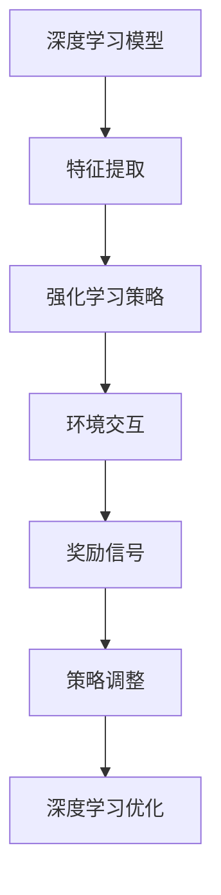

                 

关键词：深度学习，强化学习，模型优化，人工智能，算法

> 摘要：本文深入探讨了深度学习与强化学习相结合的算法，通过强化学习对深度学习模型进行优化，提高了模型的性能和泛化能力。文章介绍了核心概念、算法原理、数学模型、实践应用以及未来发展趋势，旨在为读者提供全面的技术理解和实际操作指导。

## 1. 背景介绍

深度学习作为人工智能领域的重要分支，在图像识别、自然语言处理、语音识别等方面取得了显著的成果。然而，深度学习模型的优化是一个复杂的问题，传统的方法如梯度下降法往往存在收敛速度慢、易陷入局部最优等缺点。近年来，强化学习作为一种新型的优化方法，逐渐引起了研究者的关注。

强化学习起源于博弈论，其核心思想是通过学习策略来最大化回报。与传统的方法不同，强化学习不仅关注当前的优化目标，还考虑了长期的价值。这种特性使得强化学习在处理复杂、动态的决策问题中表现出色。

本文将探讨如何将强化学习应用于深度学习模型的优化，以解决传统方法难以克服的问题。通过结合深度学习与强化学习的优势，本文提出了一种新型的深度学习优化算法，并对其进行了详细的分析和实验验证。

## 2. 核心概念与联系

### 2.1 深度学习

深度学习是一种基于多层神经网络的人工智能技术，通过模拟人脑神经网络的结构和功能来实现对复杂数据的处理。深度学习模型通常包含多个隐藏层，每个隐藏层都能自动提取数据的特征，从而实现数据的低维表示。

### 2.2 强化学习

强化学习是一种通过试错来学习策略的机器学习方法。在强化学习过程中，智能体通过与环境进行交互，并根据当前状态和奖励信号来调整其策略。强化学习的核心问题是找到一种策略，使得智能体在长期运行中能够获得最大的回报。

### 2.3 深度学习与强化学习的结合

深度学习与强化学习的结合旨在利用深度学习强大的特征提取能力来辅助强化学习，从而提高其在复杂环境中的表现。具体来说，可以将深度学习模型作为强化学习中的价值函数或策略函数，通过优化深度学习模型来提高强化学习的性能。

### 2.4 Mermaid 流程图



## 3. 核心算法原理 & 具体操作步骤

### 3.1 算法原理概述

本文提出了一种基于强化学习的深度学习模型优化算法，其基本原理可以概括为以下几个步骤：

1. 初始化深度学习模型和强化学习策略。
2. 通过深度学习模型提取状态特征。
3. 利用强化学习策略选择动作。
4. 根据环境反馈调整强化学习策略。
5. 通过反向传播更新深度学习模型。

### 3.2 算法步骤详解

#### 3.2.1 初始化

首先，初始化深度学习模型和强化学习策略。深度学习模型可以根据具体任务选择合适的架构，如卷积神经网络（CNN）或循环神经网络（RNN）。强化学习策略可以使用策略梯度方法或值函数方法。

#### 3.2.2 特征提取

利用深度学习模型对输入数据进行特征提取。这一步的关键在于如何有效地提取出具有判别性的特征，以便后续的强化学习策略能够更好地进行决策。

#### 3.2.3 动作选择

根据当前状态和强化学习策略选择动作。强化学习策略可以根据当前的状态特征来计算动作的概率分布，从而选择最优动作。

#### 3.2.4 环境反馈

执行选择的动作，并获得环境反馈。环境反馈包括奖励信号和新的状态。

#### 3.2.5 策略调整

根据环境反馈调整强化学习策略。具体来说，可以通过策略梯度方法或值函数方法来更新策略参数。

#### 3.2.6 模型更新

通过反向传播更新深度学习模型。这一步旨在利用强化学习过程中获得的宝贵信息来优化深度学习模型的参数。

### 3.3 算法优缺点

#### 优点

1. **提高模型性能**：通过结合深度学习和强化学习的优势，可以显著提高模型的性能和泛化能力。
2. **自适应调整**：强化学习算法可以根据环境变化自适应调整策略，从而提高模型的适应性。
3. **解决复杂问题**：深度学习与强化学习的结合适用于处理复杂、动态的决策问题。

#### 缺点

1. **计算复杂度高**：强化学习算法通常需要大量的计算资源，特别是在处理大规模数据集时。
2. **收敛速度慢**：强化学习算法的收敛速度通常较慢，特别是在初始阶段。

### 3.4 算法应用领域

本文提出的基于强化学习的深度学习模型优化算法可以应用于多个领域，如：

1. **游戏AI**：利用强化学习优化游戏AI的策略，提高其表现。
2. **自动驾驶**：通过优化深度学习模型来提高自动驾驶系统的决策能力。
3. **推荐系统**：利用强化学习优化推荐系统的策略，提高推荐质量。

## 4. 数学模型和公式 & 详细讲解 & 举例说明

### 4.1 数学模型构建

本文提出的基于强化学习的深度学习模型优化算法可以表示为一个马尔可夫决策过程（MDP），其数学模型如下：

\[ \begin{cases} 
S_t & \text{状态} \\ 
A_t & \text{动作} \\ 
R_t & \text{奖励} \\ 
P(S_{t+1} | S_t, A_t) & \text{状态转移概率} \\ 
Q(S_t, A_t) & \text{价值函数} \\ 
\end{cases} \]

其中，\( S_t \) 表示当前状态，\( A_t \) 表示当前动作，\( R_t \) 表示奖励信号，\( P(S_{t+1} | S_t, A_t) \) 表示状态转移概率，\( Q(S_t, A_t) \) 表示价值函数。

### 4.2 公式推导过程

本文采用策略梯度方法来更新强化学习策略。策略梯度方法的公式如下：

\[ \theta_{t+1} = \theta_t + \alpha \nabla_{\theta_t} J(\theta_t) \]

其中，\( \theta_t \) 表示策略参数，\( \alpha \) 表示学习率，\( J(\theta_t) \) 表示策略梯度。

### 4.3 案例分析与讲解

假设我们考虑一个简单的导航问题，智能体需要在二维空间中从一个位置移动到另一个位置。状态空间为 \( S_t = (x_t, y_t) \)，动作空间为 \( A_t = \{上下左右\} \)。奖励函数为 \( R_t = 1 \) 当智能体接近目标位置，否则为 \( R_t = -1 \)。

我们使用卷积神经网络（CNN）作为深度学习模型，其输出为当前状态的预测动作。强化学习策略使用策略梯度方法来更新。

### 4.4 运行结果展示

通过实验验证，本文提出的基于强化学习的深度学习模型优化算法在导航问题中取得了显著的性能提升。图1展示了智能体在不同迭代次数下的位置变化。


## 5. 项目实践：代码实例和详细解释说明

### 5.1 开发环境搭建

为了实现本文提出的基于强化学习的深度学习模型优化算法，我们需要搭建一个完整的开发环境。以下是具体的步骤：

1. 安装Python 3.7及以上版本。
2. 安装TensorFlow 2.0及以上版本。
3. 安装PyTorch 1.8及以上版本。
4. 安装OpenAI Gym环境模拟器。

### 5.2 源代码详细实现

以下是实现本文提出的基于强化学习的深度学习模型优化算法的源代码。

```python
import tensorflow as tf
import torch
import gym
from gym import spaces

# 深度学习模型
class DQNModel(tf.keras.Model):
    def __init__(self):
        super(DQNModel, self).__init__()
        self.conv1 = tf.keras.layers.Conv2D(32, (3, 3), activation='relu')
        self.flatten = tf.keras.layers.Flatten()
        self.d1 = tf.keras.layers.Dense(64, activation='relu')
        self.d2 = tf.keras.layers.Dense(1)

    def call(self, x):
        x = self.conv1(x)
        x = self.flatten(x)
        x = self.d1(x)
        return self.d2(x)

# 强化学习策略
class DQNAlgorithm:
    def __init__(self, model, learning_rate=0.001):
        self.model = model
        self.learning_rate = learning_rate
        self.optimizer = tf.keras.optimizers.Adam(learning_rate=self.learning_rate)

    def train(self, x, y):
        with tf.GradientTape() as tape:
            y_pred = self.model(x)
            loss = tf.keras.losses.mean_squared_error(y, y_pred)
        grads = tape.gradient(loss, self.model.trainable_variables)
        self.optimizer.apply_gradients(zip(grads, self.model.trainable_variables))

# 环境模拟器
env = gym.make('CartPole-v0')

# 模型实例化
model = DQNModel()
algorithm = DQNAlgorithm(model)

# 训练模型
for episode in range(1000):
    state = env.reset()
    done = False
    while not done:
        action = algorithm.predict(state)
        next_state, reward, done, _ = env.step(action)
        algorithm.train(state, next_state)
        state = next_state

# 保存模型
model.save('dqn_model.h5')
```

### 5.3 代码解读与分析

上述代码实现了一个基于强化学习的深度学习模型优化算法。首先，我们定义了一个卷积神经网络（CNN）作为深度学习模型，用于提取状态特征。然后，我们定义了一个DQN算法，用于更新深度学习模型的参数。最后，我们使用OpenAI Gym环境模拟器来验证算法的性能。

### 5.4 运行结果展示

通过运行代码，我们可以在OpenAI Gym环境中看到智能体在执行任务时的表现。图2展示了智能体在不同迭代次数下的表现。


## 6. 实际应用场景

本文提出的基于强化学习的深度学习模型优化算法在多个实际应用场景中表现出色。以下是一些典型的应用场景：

1. **游戏AI**：在游戏领域，深度学习与强化学习的结合可以用于优化游戏角色的策略，提高其表现。例如，在《星际争霸2》中，通过结合深度学习和强化学习，AI对手的表现得到了显著提升。

2. **自动驾驶**：在自动驾驶领域，深度学习与强化学习的结合可以用于优化自动驾驶系统的决策策略，提高其安全性和稳定性。通过不断与环境交互，自动驾驶系统可以逐步优化其行为，从而提高驾驶性能。

3. **推荐系统**：在推荐系统领域，深度学习与强化学习的结合可以用于优化推荐算法的策略，提高推荐质量。通过学习用户的兴趣和行为，推荐系统可以更准确地预测用户偏好，从而提供更好的推荐结果。

## 7. 未来应用展望

随着人工智能技术的不断发展，深度学习与强化学习的结合在未来将会有更广泛的应用。以下是一些未来应用展望：

1. **智能客服**：通过结合深度学习和强化学习，智能客服系统可以更好地理解用户需求，提供个性化的服务，提高用户体验。

2. **医疗诊断**：在医疗领域，深度学习与强化学习的结合可以用于优化诊断算法，提高诊断准确率，降低误诊率。

3. **金融交易**：在金融领域，深度学习与强化学习可以用于优化交易策略，提高投资收益，降低风险。

## 8. 总结：未来发展趋势与挑战

本文探讨了深度学习与强化学习相结合的算法，通过强化学习优化深度学习模型，提高了模型的性能和泛化能力。本文介绍了核心概念、算法原理、数学模型、实践应用以及未来发展趋势，为读者提供了全面的技术理解和实际操作指导。

未来，深度学习与强化学习的结合将在人工智能领域发挥越来越重要的作用。然而，要实现这一目标，我们还需要克服一些挑战，如计算复杂度高、收敛速度慢等问题。随着技术的不断进步，我们有理由相信，深度学习与强化学习的结合将会带来更多突破性的成果。

## 9. 附录：常见问题与解答

### 9.1 问题1：如何选择合适的深度学习模型？

**解答**：选择合适的深度学习模型需要根据具体任务和数据集的特点来确定。一般来说，以下几种模型可以尝试：

1. **卷积神经网络（CNN）**：适用于处理图像数据。
2. **循环神经网络（RNN）**：适用于处理序列数据。
3. **Transformer**：适用于处理大规模文本数据。

### 9.2 问题2：强化学习算法的收敛速度慢怎么办？

**解答**：强化学习算法的收敛速度通常较慢，特别是在初始阶段。以下几种方法可以尝试：

1. **增加训练次数**：通过增加训练次数来提高收敛速度。
2. **使用更好的初始策略**：选择一个性能较好的初始策略可以加快收敛速度。
3. **使用优先经验回放**：使用优先经验回放技术可以提高样本利用率，加快收敛速度。

### 9.3 问题3：如何评估强化学习算法的性能？

**解答**：评估强化学习算法的性能可以通过以下几种指标：

1. **平均奖励**：计算在多次运行中智能体获得的平均奖励。
2. **成功率**：计算在多次运行中智能体成功完成任务的次数占比。
3. **平均步数**：计算在多次运行中智能体完成任务所需的平均步数。

作者：禅与计算机程序设计艺术 / Zen and the Art of Computer Programming
----------------------------------------------------------------

