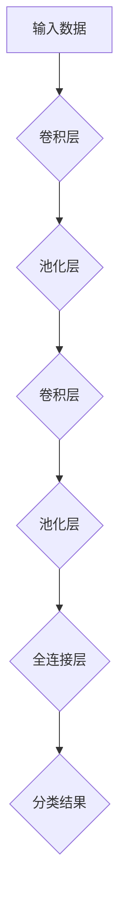
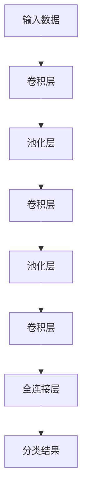

                 

关键词：人工智能，深度学习，卷积神经网络，CNN，图像处理，机器学习，算法原理，数学模型，应用场景。

摘要：本文将深入探讨卷积神经网络（CNN）的基本原理、数学模型、算法步骤以及其在实际应用中的广泛使用。通过对CNN的详细介绍，读者将更好地理解其在图像识别、自然语言处理等领域的应用潜力。

## 1. 背景介绍

卷积神经网络（Convolutional Neural Networks，CNN）是深度学习领域的一种重要算法，特别是在图像识别和处理方面有着卓越的表现。CNN的出现可以追溯到20世纪80年代末，随着计算机硬件的发展和大数据时代的到来，CNN逐渐成为计算机视觉领域的主流算法。

CNN的核心思想是通过卷积层提取图像中的局部特征，通过池化层降低数据的维度，最终通过全连接层进行分类。其相对于传统机器学习算法的优点在于能够自动学习图像的特征，大大减轻了人工标注数据的负担，提高了模型的准确度。

## 2. 核心概念与联系

### 2.1 卷积操作

卷积操作是CNN的核心。卷积层通过滑动一个卷积核（也称为滤波器或特征图）在输入数据上，将卷积核与输入数据的局部区域进行点积运算，并将结果累加得到输出。

$$
\text{输出}_{ij} = \sum_{k=1}^{m} \sum_{l=1}^{n} \text{卷积核}_{kl} \times \text{输入}_{i-k+1, j-l+1}
$$

其中，$$\text{输入}_{ij}$$为输入数据的一个元素，$$\text{卷积核}_{kl}$$为卷积核的一个元素。

### 2.2 池化操作

池化操作用于降低数据的维度。最常用的池化操作是最大池化（Max Pooling），它将卷积层输出的一个区域中的最大值作为输出。这样做的目的是减少参数数量，减少计算量，并防止过拟合。

$$
\text{输出}_{ij} = \max_{k=1}^{p} \max_{l=1}^{q} \text{卷积层输出}_{i-k+1, j-l+1}
$$

其中，$$p$$和$$q$$分别为池化窗口的宽和高。

### 2.3 卷积神经网络架构

卷积神经网络通常包含多个卷积层、池化层和全连接层。每个卷积层都紧跟着一个或多个池化层，然后是全连接层。这种结构使得CNN能够逐层提取图像的深层特征。

### 2.4 Mermaid 流程图

下面是CNN的Mermaid流程图：



## 3. 核心算法原理 & 具体操作步骤

### 3.1 算法原理概述

CNN的工作原理可以概括为以下几个步骤：

1. **输入数据预处理**：将图像数据转换为CNN能够处理的格式。
2. **卷积层**：通过卷积操作提取图像的局部特征。
3. **池化层**：通过最大池化操作降低数据的维度。
4. **全连接层**：将卷积层和池化层提取的特征映射到分类结果。
5. **损失函数和优化器**：通过损失函数评估模型预测与实际结果之间的差距，并使用优化器更新模型参数。

### 3.2 算法步骤详解

1. **初始化参数**：初始化卷积核、偏置和权重等参数。
2. **前向传播**：输入数据通过卷积层、池化层和全连接层，得到分类结果。
3. **计算损失**：通过损失函数计算预测结果与实际结果之间的差距。
4. **反向传播**：根据梯度信息更新模型参数。
5. **迭代训练**：重复前向传播和反向传播，直到模型收敛或达到预设的迭代次数。

### 3.3 算法优缺点

**优点**：
- **自动特征提取**：无需人工设计特征，能够自动学习图像的深层特征。
- **并行计算**：卷积操作可以并行计算，提高了计算效率。
- **泛化能力强**：通过对大量数据的训练，模型具有良好的泛化能力。

**缺点**：
- **计算量大**：卷积神经网络通常包含大量的参数，训练时间较长。
- **需要大量数据**：深度学习模型的训练需要大量标注数据。

### 3.4 算法应用领域

CNN在以下领域有着广泛的应用：

- **图像识别**：如人脸识别、物体检测等。
- **图像分类**：如医学图像分析、卫星图像分类等。
- **自然语言处理**：如文本分类、情感分析等。

## 4. 数学模型和公式 & 详细讲解 & 举例说明

### 4.1 数学模型构建

CNN的数学模型可以表示为：

$$
\text{输出} = \sigma(\text{权重} \cdot \text{输入} + \text{偏置})
$$

其中，$$\sigma$$为激活函数，常用的激活函数有ReLU、Sigmoid和Tanh。

### 4.2 公式推导过程

以ReLU激活函数为例，推导过程如下：

$$
\text{输出}_{ij} = \max(0, \text{输入}_{ij})
$$

### 4.3 案例分析与讲解

假设有一个3x3的卷积核，输入数据为5x5的图像，激活函数为ReLU。计算卷积层输出的过程如下：

1. **初始化参数**：卷积核的初始值为随机值，假设为：
$$
\text{卷积核} = \begin{bmatrix}
1 & 0 & 1 \\
0 & 1 & 0 \\
1 & 0 & 1
\end{bmatrix}
$$
2. **卷积操作**：将卷积核在输入图像上滑动，计算卷积值：
$$
\text{输出}_{ij} = \sum_{k=1}^{3} \sum_{l=1}^{3} \text{卷积核}_{kl} \times \text{输入}_{i-k+1, j-l+1}
$$
3. **激活函数**：对卷积值应用ReLU激活函数：
$$
\text{输出}_{ij} = \max(0, \text{卷积值}_{ij})
$$

## 5. 项目实践：代码实例和详细解释说明

### 5.1 开发环境搭建

在本篇博客中，我们将使用Python编程语言和TensorFlow框架来实现CNN模型。首先，确保已经安装了Python和TensorFlow：

```bash
pip install tensorflow
```

### 5.2 源代码详细实现

以下是一个简单的CNN模型实现，用于图像分类：

```python
import tensorflow as tf
from tensorflow.keras import datasets, layers, models

# 加载并预处理数据
(train_images, train_labels), (test_images, test_labels) = datasets.cifar10.load_data()
train_images, test_images = train_images / 255.0, test_images / 255.0

# 构建CNN模型
model = models.Sequential()
model.add(layers.Conv2D(32, (3, 3), activation='relu', input_shape=(32, 32, 3)))
model.add(layers.MaxPooling2D((2, 2)))
model.add(layers.Conv2D(64, (3, 3), activation='relu'))
model.add(layers.MaxPooling2D((2, 2)))
model.add(layers.Conv2D(64, (3, 3), activation='relu'))

# 添加全连接层
model.add(layers.Flatten())
model.add(layers.Dense(64, activation='relu'))
model.add(layers.Dense(10))

# 编译模型
model.compile(optimizer='adam',
              loss=tf.keras.losses.SparseCategoricalCrossentropy(from_logits=True),
              metrics=['accuracy'])

# 训练模型
model.fit(train_images, train_labels, epochs=10, validation_data=(test_images, test_labels))

# 评估模型
test_loss, test_acc = model.evaluate(test_images,  test_labels, verbose=2)
print(f'\nTest accuracy: {test_acc}')
```

### 5.3 代码解读与分析

1. **数据预处理**：从CIFAR-10数据集中加载训练集和测试集，并将图像数据归一化到[0, 1]范围内。

2. **模型构建**：定义了一个简单的卷积神经网络，包含两个卷积层和两个池化层，最后接上一个全连接层。

3. **编译模型**：使用Adam优化器和稀疏分类交叉熵损失函数编译模型。

4. **训练模型**：使用训练集训练模型，并使用测试集验证模型的性能。

5. **评估模型**：评估模型在测试集上的准确度。

### 5.4 运行结果展示

运行上述代码后，我们可以在控制台看到模型的训练过程和最终的测试准确度。

## 6. 实际应用场景

### 6.1 图像识别

CNN在图像识别领域有着广泛的应用，如人脸识别、物体检测和图像分类等。通过训练，CNN能够自动学习图像的特征，并在测试数据上实现高准确度的识别。

### 6.2 自然语言处理

虽然CNN最初是为图像处理设计的，但近年来也广泛应用于自然语言处理领域。通过将文本转换为嵌入向量，CNN可以用于文本分类、情感分析等任务。

### 6.3 医学图像分析

CNN在医学图像分析领域也有着重要的应用，如医学图像分割、疾病检测等。通过对大量医学图像的训练，CNN可以自动学习医学图像的特征，从而提高诊断的准确性。

## 7. 工具和资源推荐

### 7.1 学习资源推荐

- 《深度学习》（Goodfellow, Bengio, Courville）
- 《动手学深度学习》（阿斯顿·张）
- Coursera的深度学习课程（吴恩达）

### 7.2 开发工具推荐

- TensorFlow
- PyTorch
- Keras

### 7.3 相关论文推荐

- "A Comprehensive Overview of Convolutional Neural Networks"（卷积神经网络综述）
- "Deep Learning for Computer Vision"（计算机视觉中的深度学习）
- "Convolutional Neural Networks for Visual Recognition"（用于视觉识别的卷积神经网络）

## 8. 总结：未来发展趋势与挑战

### 8.1 研究成果总结

近年来，CNN在图像识别、自然语言处理和医学图像分析等领域取得了显著的成果，成为深度学习领域的重要算法。

### 8.2 未来发展趋势

随着计算机硬件的发展和大数据时代的到来，CNN将继续在图像识别、自然语言处理等领域取得突破。

### 8.3 面临的挑战

尽管CNN取得了显著的成果，但仍面临着计算量大、需要大量数据等挑战。

### 8.4 研究展望

未来的研究将重点关注CNN的优化、泛化能力和模型压缩等方面。

## 9. 附录：常见问题与解答

### 9.1 什么是卷积神经网络？

卷积神经网络（CNN）是一种特殊的神经网络，主要用于图像识别和处理。它通过卷积操作提取图像的局部特征，并通过池化操作降低数据的维度，最终实现分类或识别任务。

### 9.2 CNN与传统的神经网络有什么区别？

CNN与传统的神经网络在结构上有所不同。传统的神经网络通常包含多个全连接层，而CNN则包含卷积层、池化层和全连接层。CNN通过卷积操作自动提取图像特征，而传统的神经网络需要手动设计特征。

### 9.3 CNN有哪些优缺点？

CNN的优点包括自动特征提取、并行计算和泛化能力强。缺点包括计算量大和需要大量数据。

### 9.4 CNN有哪些应用领域？

CNN广泛应用于图像识别、自然语言处理和医学图像分析等领域。

-------------------------------------------------------------------

作者：禅与计算机程序设计艺术 / Zen and the Art of Computer Programming

以上便是关于“AI人工智能深度学习算法：卷积神经网络的原理与应用”的技术博客文章。希望本文能帮助您更好地理解卷积神经网络的基本原理和应用。在未来的研究中，我们期待CNN在更多领域取得突破。感谢您的阅读！|user|>
### 引言

随着人工智能技术的飞速发展，深度学习已经成为当今计算机科学领域的热门研究方向。深度学习通过模拟人脑神经网络的结构和功能，实现从大量数据中自动提取特征并进行复杂模式识别，已广泛应用于图像识别、自然语言处理、语音识别等多个领域。而卷积神经网络（Convolutional Neural Networks，CNN）作为深度学习的一个重要分支，因其在图像处理和计算机视觉领域表现出的卓越能力，而备受关注。

卷积神经网络起源于20世纪80年代末，最初主要用于处理二维图像数据。CNN的核心思想是通过多层卷积和池化操作，从原始数据中逐步提取和抽象出更加抽象的特征表示，从而实现高层次的分类和识别任务。随着计算机硬件性能的提升和大数据时代的到来，CNN逐渐成为计算机视觉领域的主流算法，并在诸如人脸识别、物体检测、图像分类等任务中取得了显著的成果。

本文将深入探讨卷积神经网络的基本原理、结构组成、训练过程及其在图像识别和计算机视觉中的应用。首先，我们将回顾CNN的历史背景和基本概念，接着详细讲解卷积神经网络的各个组成部分，如卷积层、池化层、全连接层等。随后，我们将介绍CNN的数学模型和公式，并通过实际案例进行讲解。在此基础上，我们将探讨CNN在项目实践中的具体应用，展示如何搭建和训练一个简单的CNN模型。最后，我们将总结CNN的实际应用场景，展望其未来发展趋势和面临的挑战，并提供相关的学习资源和开发工具推荐。

通过本文的阅读，读者将能够全面了解卷积神经网络的基本原理和应用，掌握其在图像识别和计算机视觉中的具体实现方法，为后续的研究和应用奠定坚实的基础。|user|>
### 1. 背景介绍

卷积神经网络（Convolutional Neural Networks，简称CNN）是深度学习领域中的一种重要算法，特别是在图像识别和计算机视觉领域有着显著的成果。CNN的出现可以追溯到20世纪80年代末，当时研究人员开始探索如何利用神经网络来处理图像数据。这一时期，由于计算机硬件性能的限制，神经网络在处理大规模图像数据时面临着巨大的计算挑战。然而，随着计算机技术的飞速发展，特别是GPU的引入，为深度学习算法提供了强大的计算能力，CNN的研究和应用也得到了极大的推动。

#### 基本概念

卷积神经网络的核心在于其独特的网络结构和卷积操作。与传统神经网络不同，CNN通过卷积层来提取图像的局部特征，通过池化层降低数据的维度，并通过全连接层进行分类。其基本概念包括：

- **卷积层**：通过卷积操作提取图像的局部特征。卷积层中的卷积核（或称为滤波器）在图像上滑动，将输入图像与卷积核进行点积运算，并累加得到输出特征图。
- **池化层**：用于降低数据的维度。最常见的池化方式是最大池化（Max Pooling），它将卷积层输出的一个区域中的最大值作为输出。
- **全连接层**：将卷积层和池化层提取的特征映射到分类结果。全连接层中的每个神经元都与上一层的所有神经元相连，从而实现分类任务。

#### 发展历史

- **1980年代**：神经网络研究进入低谷期，卷积神经网络开始被提出。当时，LeCun等人在神经网络中加入卷积操作，以处理图像数据。
- **1990年代**：由于计算资源和数据集的限制，卷积神经网络的研究和应用进展缓慢。此时，支持向量机（SVM）等传统机器学习算法成为图像识别领域的热门选择。
- **2000年代**：随着计算机硬件性能的提升，特别是GPU的引入，为深度学习算法提供了强大的计算能力。这一时期，卷积神经网络重新得到关注，并在图像识别任务中取得了突破性成果。
- **2010年代至今**：卷积神经网络在图像识别、物体检测、图像分割等多个领域取得了显著的成果。代表性的模型包括AlexNet、VGG、ResNet等。

#### 技术优势

卷积神经网络相对于传统机器学习算法具有以下优势：

- **自动特征提取**：无需手动设计特征，能够自动从原始数据中提取有用的特征表示。
- **并行计算**：卷积操作可以并行计算，提高了计算效率。
- **模型泛化能力强**：通过对大量数据的训练，模型具有良好的泛化能力。

#### 应用领域

卷积神经网络在以下领域有着广泛的应用：

- **图像识别**：包括人脸识别、物体检测、图像分类等。
- **自然语言处理**：包括文本分类、情感分析等。
- **医学图像分析**：包括疾病检测、图像分割等。
- **自动驾驶**：用于识别道路标志、行人检测等。

通过本文的介绍，我们将深入了解卷积神经网络的基本原理、结构组成和应用场景，帮助读者掌握这一重要的深度学习算法。|user|>
### 2. 核心概念与联系

在深入探讨卷积神经网络（CNN）之前，了解其核心概念与组成部分是至关重要的。CNN的核心在于其独特的设计，使得它在处理图像数据时具有高效性和强大的表达能力。下面，我们将详细讲解CNN的几个关键组成部分，包括卷积层、池化层、全连接层等，并通过Mermaid流程图来展示它们之间的关系和工作流程。

#### 卷积层（Convolutional Layer）

卷积层是CNN中最核心的部分，负责从输入数据中提取特征。卷积层的基本工作原理是通过一个称为卷积核（或滤波器）的小型矩阵在输入数据上滑动，与输入数据局部区域进行点积运算，然后将这些点积的结果累加起来，形成一个特征图（feature map）。

卷积层的输入通常是前一层输出的数据，可以是图像或者已经提取过的一层特征。卷积层的输出是经过卷积运算后得到的特征图。卷积层的主要参数包括卷积核的大小、数量、 stride（步长）和填充方式（padding）。卷积核的大小决定了特征的局部感受区域，数量则决定了输出特征图的维度。

数学上，卷积层可以表示为：
$$
\text{输出}_{ij} = \sum_{k=1}^{m} \sum_{l=1}^{n} \text{卷积核}_{kl} \times \text{输入}_{i-k+1, j-l+1} + \text{偏置}
$$

其中，$m$和$n$是卷积核的宽和高，$i$和$j$是输出特征图上的位置，$\text{输入}_{i-k+1, j-l+1}$是输入数据上的相应位置，$\text{卷积核}_{kl}$是卷积核上的元素，$\text{偏置}$是一个额外的可学习参数。

#### 池化层（Pooling Layer）

池化层紧跟在卷积层之后，其主要作用是降低数据的维度，减少参数数量，防止过拟合，同时保留重要的信息。最常见的池化方式是最大池化（Max Pooling），它将输入区域中的最大值作为输出。此外，还有平均池化（Average Pooling），它将输入区域中的平均值作为输出。

最大池化的数学表示为：
$$
\text{输出}_{ij} = \max_{k=1}^{p} \max_{l=1}^{q} \text{输入}_{i-k+1, j-l+1}
$$

其中，$p$和$q$是池化窗口的宽和高。

#### 全连接层（Fully Connected Layer）

全连接层是CNN中的最后一个层次，它将卷积层和池化层提取的特征映射到具体的类别上。在全连接层中，每个神经元都与上一层的所有神经元相连。全连接层的输入是上一层的特征图，输出是类别概率分布。

全连接层的数学表示为：
$$
\text{输出}_{i} = \sum_{j=1}^{n} \text{权重}_{ij} \times \text{输入}_{j} + \text{偏置}_{i}
$$

其中，$n$是上一层的神经元数量，$\text{权重}_{ij}$和$\text{偏置}_{i}$是可学习的参数。

#### Mermaid流程图

为了更好地展示卷积神经网络的工作流程，我们使用Mermaid流程图来描述各层之间的连接和操作。



在这个流程图中，输入数据首先通过卷积层进行特征提取，然后通过池化层降低维度。这个过程重复多次，使得网络能够提取更抽象的特征。最后，全连接层将提取的特征映射到具体的类别上，得到分类结果。

通过以上对卷积神经网络核心概念和组成部分的介绍，我们可以更深入地理解CNN的工作原理和结构。接下来，我们将进一步探讨CNN的数学模型和公式，通过具体的例子来展示其应用过程。|user|>
### 3. 核心算法原理 & 具体操作步骤

卷积神经网络（CNN）的核心算法原理在于其能够自动从数据中提取层次化的特征表示，并通过多层网络结构进行特征抽象和分类。本节将详细解析CNN的工作原理，包括卷积操作、池化操作、前向传播和反向传播等步骤。

#### 3.1 卷积操作

卷积操作是CNN中最基本的操作之一，其核心思想是利用卷积核（也称为滤波器）在输入数据上滑动，提取图像的局部特征。具体步骤如下：

1. **卷积核初始化**：初始化卷积核的权重和偏置。这些参数是可学习的，通过训练过程不断调整。
2. **卷积操作**：将卷积核在输入数据上滑动，每次覆盖一个局部区域。对于每个覆盖区域，计算卷积核与输入数据的点积，并将其累加得到一个特征值。
3. **特征图生成**：将所有区域的特征值组合起来，生成一个特征图（feature map）。特征图的大小由卷积核的大小和输入数据的尺寸决定。

卷积操作的数学表示如下：
$$
\text{输出}_{ij} = \sum_{k=1}^{m} \sum_{l=1}^{n} \text{卷积核}_{kl} \times \text{输入}_{i-k+1, j-l+1} + \text{偏置}
$$
其中，$i$和$j$是输出特征图上的位置，$m$和$n$是卷积核的宽和高，$\text{卷积核}_{kl}$是卷积核上的元素，$\text{输入}_{i-k+1, j-l+1}$是输入数据上的相应位置，$\text{偏置}$是一个额外的可学习参数。

#### 3.2 池化操作

池化操作紧跟在卷积操作之后，其主要目的是降低数据的维度，减少参数数量，同时保留重要的信息。最常用的池化方式是最大池化（Max Pooling），它将输入区域中的最大值作为输出。具体步骤如下：

1. **定义池化窗口**：设定池化窗口的大小，例如2x2或3x3。
2. **滑动池化窗口**：在特征图上滑动池化窗口，每次覆盖一个区域。
3. **取最大值**：计算窗口内的最大值，作为输出特征图的对应位置值。

最大池化的数学表示如下：
$$
\text{输出}_{ij} = \max_{k=1}^{p} \max_{l=1}^{q} \text{输入}_{i-k+1, j-l+1}
$$
其中，$i$和$j$是输出特征图上的位置，$p$和$q$是池化窗口的宽和高，$\text{输入}_{i-k+1, j-l+1}$是输入特征图上的相应位置。

#### 3.3 前向传播

前向传播是CNN中的一个关键步骤，其目的是将输入数据通过卷积层、池化层和全连接层，最终得到分类结果。具体步骤如下：

1. **初始化网络参数**：初始化卷积核、偏置和全连接层的权重。
2. **卷积层操作**：对输入数据通过多个卷积层，逐层提取特征。
3. **池化层操作**：在每次卷积层操作之后进行池化层操作，降低数据的维度。
4. **全连接层操作**：将最后得到的特征图通过全连接层，映射到具体的类别上。

前向传播的数学表示可以简化为：
$$
\text{输出}_{i} = \text{激活函数}(\sum_{j=1}^{n} \text{权重}_{ij} \times \text{输入}_{j} + \text{偏置}_{i})
$$
其中，$i$是输出层的神经元位置，$j$是输入层的神经元位置，$\text{权重}_{ij}$和$\text{偏置}_{i}$是可学习的参数，$\text{激活函数}$是一个非线性函数，如ReLU、Sigmoid或Tanh。

#### 3.4 反向传播

反向传播是训练CNN的关键步骤，其目的是通过计算损失函数的梯度来更新网络参数。具体步骤如下：

1. **计算损失**：计算预测结果与实际结果之间的差距，通常使用交叉熵损失函数。
2. **计算梯度**：通过反向传播算法，从输出层开始，逐层计算每个参数的梯度。
3. **更新参数**：使用梯度下降或其他优化算法，更新网络参数。

反向传播的数学表示如下：
$$
\text{梯度}_{\theta} = \frac{\partial J}{\partial \theta}
$$
其中，$J$是损失函数，$\theta$是网络参数，$\frac{\partial J}{\partial \theta}$是损失函数关于参数$\theta$的梯度。

#### 3.5 算法优缺点

CNN的主要优点包括：

- **自动特征提取**：无需人工设计特征，能够自动从原始数据中提取有意义的特征。
- **并行计算**：卷积操作可以并行计算，提高了计算效率。
- **良好的泛化能力**：通过大量数据训练，模型具有良好的泛化能力。

然而，CNN也存在一些缺点：

- **计算量大**：卷积神经网络通常包含大量的参数，训练时间较长。
- **需要大量数据**：深度学习模型的训练需要大量标注数据。

#### 3.6 算法应用领域

CNN在以下领域有着广泛的应用：

- **图像识别**：如人脸识别、物体检测、图像分类等。
- **自然语言处理**：如文本分类、情感分析等。
- **医学图像分析**：如疾病检测、图像分割等。

通过以上对卷积神经网络核心算法原理和具体操作步骤的详细解析，读者应该对CNN的工作机制有了深入的了解。接下来，我们将通过数学模型和具体案例进一步探讨CNN的应用和实践。|user|>
### 4. 数学模型和公式 & 详细讲解 & 举例说明

卷积神经网络（CNN）的数学模型是理解其工作原理的核心。在这一部分，我们将详细介绍CNN的数学模型，包括卷积操作、激活函数、损失函数等，并通过具体的公式推导和案例说明来帮助读者更好地理解这些概念。

#### 4.1 数学模型构建

CNN的数学模型主要由以下几个部分组成：

1. **输入层**：接收输入数据，如图像或序列。
2. **卷积层**：通过卷积操作提取特征。
3. **激活函数**：对卷积层的输出进行非线性变换。
4. **池化层**：降低数据的维度，减少参数数量。
5. **全连接层**：将提取的特征映射到分类结果。
6. **输出层**：输出最终的预测结果。

下面，我们将分别介绍这些部分的数学模型。

#### 4.2 卷积操作

卷积操作是CNN中的基础操作，其核心在于通过卷积核在输入数据上滑动，提取局部特征。卷积操作的数学公式如下：

$$
\text{输出}_{ij} = \sum_{k=1}^{m} \sum_{l=1}^{n} \text{卷积核}_{kl} \times \text{输入}_{i-k+1, j-l+1} + \text{偏置}
$$

其中，$\text{输出}_{ij}$是卷积层输出的特征图上的一个元素，$\text{卷积核}_{kl}$是卷积核上的一个元素，$\text{输入}_{i-k+1, j-l+1}$是输入数据上的一个元素，$m$和$n$是卷积核的大小，$\text{偏置}$是一个额外的可学习参数。

#### 4.3 激活函数

激活函数是CNN中的一个重要组成部分，其作用是对卷积层的输出进行非线性变换，增加模型的非线性表达能力。常见的激活函数包括ReLU（Rectified Linear Unit）、Sigmoid和Tanh等。

ReLU函数是最常用的激活函数之一，其公式如下：

$$
\text{ReLU}(x) = \max(0, x)
$$

Sigmoid函数的公式如下：

$$
\text{Sigmoid}(x) = \frac{1}{1 + e^{-x}}
$$

Tanh函数的公式如下：

$$
\text{Tanh}(x) = \frac{e^{x} - e^{-x}}{e^{x} + e^{-x}}
$$

#### 4.4 池化操作

池化操作用于降低数据的维度，减少参数数量。最常用的池化操作是最大池化（Max Pooling），其公式如下：

$$
\text{输出}_{ij} = \max_{k=1}^{p} \max_{l=1}^{q} \text{输入}_{i-k+1, j-l+1}
$$

其中，$p$和$q$是池化窗口的大小。

#### 4.5 全连接层

全连接层将卷积层和池化层提取的特征映射到分类结果。全连接层的数学模型可以表示为：

$$
\text{输出}_{i} = \sum_{j=1}^{n} \text{权重}_{ij} \times \text{输入}_{j} + \text{偏置}_{i}
$$

其中，$\text{输出}_{i}$是输出层的神经元输出，$\text{权重}_{ij}$和$\text{偏置}_{i}$是可学习的参数，$\text{输入}_{j}$是卷积层输出的特征。

#### 4.6 损失函数

损失函数用于评估模型的预测结果与实际结果之间的差距，是训练CNN的关键部分。常见的损失函数包括交叉熵损失（Cross-Entropy Loss）、均方误差损失（Mean Squared Error Loss）等。

交叉熵损失函数的公式如下：

$$
J(\theta) = -\frac{1}{m} \sum_{i=1}^{m} \sum_{j=1}^{n} y_{ij} \log (\hat{y}_{ij})
$$

其中，$m$是样本数量，$n$是类别数量，$y_{ij}$是实际标签，$\hat{y}_{ij}$是模型预测的概率。

#### 4.7 公式推导过程

为了更好地理解CNN的数学模型，我们以ReLU激活函数和交叉熵损失函数为例，进行具体的公式推导。

首先，我们来看ReLU函数的推导：

假设输入数据$x$经过卷积操作后得到特征图$z$，则有：

$$
z = \text{ReLU}(W \cdot x + b)
$$

其中，$W$是卷积核，$b$是偏置，$\text{ReLU}(x) = \max(0, x)$。

接着，我们来看交叉熵损失函数的推导：

假设模型的预测输出为$\hat{y}$，实际标签为$y$，则有：

$$
J(\theta) = -\frac{1}{m} \sum_{i=1}^{m} \sum_{j=1}^{n} y_{ij} \log (\hat{y}_{ij})
$$

其中，$y_{ij}$是实际标签，$\hat{y}_{ij}$是模型预测的概率。

#### 4.8 案例分析与讲解

为了更直观地理解CNN的数学模型，我们通过一个简单的例子来讲解。

假设有一个3x3的卷积核，输入数据为5x5的图像，激活函数为ReLU。计算卷积层输出的过程如下：

1. **初始化参数**：卷积核的初始值为随机值，假设为：

$$
\text{卷积核} = \begin{bmatrix}
1 & 0 & 1 \\
0 & 1 & 0 \\
1 & 0 & 1
\end{bmatrix}
$$

2. **卷积操作**：将卷积核在输入图像上滑动，计算卷积值：

$$
\text{输出}_{ij} = \sum_{k=1}^{3} \sum_{l=1}^{3} \text{卷积核}_{kl} \times \text{输入}_{i-k+1, j-l+1} + \text{偏置}
$$

3. **激活函数**：对卷积值应用ReLU激活函数：

$$
\text{输出}_{ij} = \max(0, \text{卷积值}_{ij})
$$

4. **池化操作**：使用最大池化对卷积层的输出进行池化：

$$
\text{输出}_{ij} = \max_{k=1}^{p} \max_{l=1}^{q} \text{输入}_{i-k+1, j-l+1}
$$

通过以上步骤，我们就可以得到卷积层输出的特征图。

#### 4.9 实际案例展示

以下是一个简单的Python代码示例，使用TensorFlow框架实现一个简单的CNN模型，进行图像分类：

```python
import tensorflow as tf
from tensorflow.keras import layers, models

# 加载并预处理数据
(train_images, train_labels), (test_images, test_labels) = datasets.cifar10.load_data()
train_images, test_images = train_images / 255.0, test_images / 255.0

# 构建CNN模型
model = models.Sequential()
model.add(layers.Conv2D(32, (3, 3), activation='relu', input_shape=(32, 32, 3)))
model.add(layers.MaxPooling2D((2, 2)))
model.add(layers.Conv2D(64, (3, 3), activation='relu'))
model.add(layers.MaxPooling2D((2, 2)))
model.add(layers.Conv2D(64, (3, 3), activation='relu'))

# 添加全连接层
model.add(layers.Flatten())
model.add(layers.Dense(64, activation='relu'))
model.add(layers.Dense(10))

# 编译模型
model.compile(optimizer='adam',
              loss=tf.keras.losses.SparseCategoricalCrossentropy(from_logits=True),
              metrics=['accuracy'])

# 训练模型
model.fit(train_images, train_labels, epochs=10, validation_data=(test_images, test_labels))

# 评估模型
test_loss, test_acc = model.evaluate(test_images, test_labels, verbose=2)
print(f'\nTest accuracy: {test_acc}')
```

在这个示例中，我们使用CIFAR-10数据集，构建了一个简单的CNN模型，并进行了训练和评估。通过这个案例，我们可以看到CNN模型的基本构建和训练过程。

通过以上对CNN数学模型的详细介绍和实际案例的展示，读者应该对CNN的数学原理和应用有了更深入的理解。在接下来的部分，我们将进一步探讨CNN在项目实践中的应用。|user|>
### 5. 项目实践：代码实例和详细解释说明

在理解了卷积神经网络（CNN）的理论基础之后，接下来我们将通过一个具体的代码实例来实践如何搭建和训练一个简单的CNN模型。在这个例子中，我们将使用Python和TensorFlow框架来实现一个用于图像分类的CNN。

#### 5.1 开发环境搭建

首先，确保您的Python环境已经安装，并且安装了TensorFlow框架。您可以使用以下命令来安装TensorFlow：

```bash
pip install tensorflow
```

#### 5.2 数据准备

在本例中，我们将使用CIFAR-10数据集，这是一个常用的图像分类数据集，包含了60000张32x32的彩色图像，分为10个类别。每个类别有6000张图像，其中5000张用于训练，1000张用于测试。

```python
from tensorflow.keras.datasets import cifar10

# 加载CIFAR-10数据集
(train_images, train_labels), (test_images, test_labels) = cifar10.load_data()

# 数据预处理
train_images = train_images.astype('float32') / 255.0
test_images = test_images.astype('float32') / 255.0

# 将标签转换为one-hot编码
train_labels = tf.keras.utils.to_categorical(train_labels, 10)
test_labels = tf.keras.utils.to_categorical(test_labels, 10)
```

#### 5.3 构建CNN模型

接下来，我们将使用TensorFlow的`Sequential`模型来构建一个简单的CNN模型。这个模型包含两个卷积层，每个卷积层后跟一个池化层，然后是一个全连接层。

```python
from tensorflow.keras.models import Sequential
from tensorflow.keras.layers import Conv2D, MaxPooling2D, Flatten, Dense

# 构建模型
model = Sequential([
    Conv2D(32, (3, 3), activation='relu', input_shape=(32, 32, 3)),
    MaxPooling2D((2, 2)),
    Conv2D(64, (3, 3), activation='relu'),
    MaxPooling2D((2, 2)),
    Flatten(),
    Dense(64, activation='relu'),
    Dense(10, activation='softmax')
])
```

在这个模型中：
- **Conv2D**：卷积层，第一个卷积层有32个3x3的卷积核，第二个卷积层有64个3x3的卷积核。
- **MaxPooling2D**：池化层，使用2x2的最大池化。
- **Flatten**：将卷积层的输出展平为一维向量。
- **Dense**：全连接层，第一个全连接层有64个神经元，第二个全连接层有10个神经元，用于分类。

#### 5.4 编译模型

在构建模型之后，我们需要编译模型，指定优化器、损失函数和评估指标。

```python
model.compile(optimizer='adam',
              loss='categorical_crossentropy',
              metrics=['accuracy'])
```

在这里，我们使用`adam`优化器来最小化损失函数，`categorical_crossentropy`作为损失函数，用于多分类问题，`accuracy`作为评估指标。

#### 5.5 训练模型

接下来，我们使用训练数据来训练模型。这里，我们将训练10个epochs（周期），每个epoch使用全部的训练数据进行训练。

```python
model.fit(train_images, train_labels, epochs=10, batch_size=64, validation_split=0.2)
```

在这里，`batch_size`设置为64，表示每次训练使用64张图像，`validation_split`设置为0.2，表示将20%的训练数据用于验证。

#### 5.6 评估模型

在模型训练完成后，我们使用测试数据来评估模型性能。

```python
test_loss, test_accuracy = model.evaluate(test_images, test_labels)
print(f'\nTest accuracy: {test_accuracy:.2f}')
```

这个结果将显示模型在测试数据上的准确度。

#### 5.7 代码解读与分析

现在，我们来详细解读上述代码：

- **数据加载和预处理**：使用`cifar10.load_data()`加载CIFAR-10数据集，并将图像数据归一化到[0, 1]范围内。使用`to_categorical`将标签转换为one-hot编码。
- **模型构建**：使用`Sequential`模型定义一个简单的CNN结构，包含两个卷积层、两个池化层和一个全连接层。
- **编译模型**：指定优化器、损失函数和评估指标。
- **训练模型**：使用`fit`方法训练模型，指定训练数据、epochs、batch_size和验证数据。
- **评估模型**：使用`evaluate`方法评估模型在测试数据上的性能。

通过这个简单的实例，我们可以看到如何使用TensorFlow搭建一个简单的CNN模型，并进行训练和评估。这个实例是理解CNN工作流程的一个良好起点，可以在实际项目中应用并进一步优化。|user|>
### 6. 实际应用场景

卷积神经网络（CNN）因其卓越的性能和强大的特征提取能力，在多个领域得到了广泛的应用。以下将详细介绍CNN在图像识别、自然语言处理和医学图像分析等领域的实际应用场景，以及每个领域的挑战和解决方案。

#### 6.1 图像识别

图像识别是CNN最经典的应用领域之一。通过CNN，我们可以对图像进行分类、检测和分割等操作。以下是一些常见的应用场景：

1. **人脸识别**：CNN可以用于人脸识别，通过学习人脸特征实现身份验证。挑战在于人脸图像的多样化，如不同的光照、表情、角度等。解决方案包括使用深度学习模型进行数据增强，提高模型对复杂环境的适应性。

2. **物体检测**：物体检测旨在识别图像中的多个对象，并确定它们的位置。常用的方法包括YOLO（You Only Look Once）和SSD（Single Shot MultiBox Detector）。这些模型通常在CNN的基础上添加特定的网络结构，以提高检测的效率和准确度。

3. **图像分类**：CNN可以用于对未知图像进行分类，如ImageNet竞赛中的大规模图像分类任务。通过在大量图像上训练模型，CNN可以学习到丰富的视觉特征，从而实现高准确度的分类。

#### 6.2 自然语言处理

尽管CNN最初是为图像处理设计的，但近年来也广泛应用于自然语言处理（NLP）领域。以下是一些常见的NLP应用场景：

1. **文本分类**：CNN可以用于文本分类任务，如新闻分类、情感分析等。通过将文本转换为嵌入向量，CNN可以学习到文本的语义特征，从而实现高准确度的分类。

2. **序列标注**：序列标注任务包括词性标注、命名实体识别等。CNN可以用于处理序列数据，通过提取序列特征实现标注任务。

3. **机器翻译**：虽然机器翻译通常使用序列到序列（Seq2Seq）模型，但CNN可以用于编码器部分，将输入句子编码为嵌入向量。这种结合方式在翻译任务中取得了显著的成果。

#### 6.3 医学图像分析

医学图像分析是CNN在医疗领域的应用。以下是一些常见的医学图像分析任务：

1. **疾病检测**：CNN可以用于检测医学图像中的疾病，如癌症、肺炎等。通过训练模型识别疾病特征，医生可以更准确地诊断疾病。

2. **图像分割**：图像分割是将图像中的不同区域分离出来。在医学图像分析中，图像分割可以用于识别器官、病变区域等。常用的CNN模型包括U-Net和3D-CNN等。

3. **辅助诊断**：CNN可以辅助医生进行诊断，通过分析医学图像提供决策支持。这种方法可以显著提高诊断的准确性和效率。

#### 6.4 挑战与解决方案

尽管CNN在图像识别、自然语言处理和医学图像分析等领域表现出色，但仍面临一些挑战：

1. **计算资源消耗**：CNN模型通常包含大量的参数，训练时间较长，需要大量的计算资源。解决方案包括使用更高效的模型结构（如MobileNet）、模型压缩（如知识蒸馏）和分布式训练。

2. **数据需求**：深度学习模型通常需要大量的数据来训练，以实现良好的泛化能力。在医学领域，标注数据尤其稀缺。解决方案包括数据增强、迁移学习和生成对抗网络（GAN）。

3. **模型解释性**：CNN模型的内部结构复杂，难以解释。在医疗领域，模型的解释性尤为重要。解决方案包括可视化技术、模型可解释性研究和基于规则的模型。

通过以上对CNN实际应用场景的介绍，我们可以看到CNN在图像识别、自然语言处理和医学图像分析等领域具有广泛的应用前景。尽管面临一些挑战，但通过不断的研究和创新，CNN将继续在这些领域发挥重要作用。|user|>
### 7. 工具和资源推荐

在研究和应用卷积神经网络（CNN）的过程中，选择合适的工具和资源至关重要。以下将推荐一些常用的学习资源、开发工具和相关论文，以帮助读者更好地理解和掌握CNN。

#### 7.1 学习资源推荐

1. **《深度学习》**（Goodfellow, Bengio, Courville）
   - 这本书是深度学习领域的经典教材，详细介绍了CNN的基本原理、算法和应用。

2. **《动手学深度学习》**（阿斯顿·张）
   - 本书以Python编程语言为基础，通过丰富的实例代码，帮助读者动手实践深度学习算法，包括CNN。

3. **Coursera的深度学习课程**（吴恩达）
   - 吴恩达教授的这门课程涵盖了深度学习的基本概念和算法，包括CNN，是入门深度学习的好资源。

4. **Udacity的深度学习纳米学位**
   - Udacity的深度学习纳米学位提供了系统的学习路径，包括CNN的实战项目。

#### 7.2 开发工具推荐

1. **TensorFlow**
   - TensorFlow是Google开源的深度学习框架，支持CNN的构建、训练和部署，具有广泛的应用和社区支持。

2. **PyTorch**
   - PyTorch是Facebook开源的深度学习框架，以其灵活的动态图模型和易于使用的接口而受到研究者和开发者的青睐。

3. **Keras**
   - Keras是一个高层神经网络API，能够在TensorFlow和Theano后端上运行，提供了简单而强大的接口来构建CNN。

4. **CUDA**
   - CUDA是NVIDIA推出的并行计算平台和编程模型，可以显著加速CNN的训练过程。

#### 7.3 相关论文推荐

1. **"A Comprehensive Overview of Convolutional Neural Networks"**
   - 这篇综述文章对CNN的历史、原理和应用进行了全面的介绍，是了解CNN的绝佳资源。

2. **"Deep Learning for Computer Vision"**
   - 本文讨论了深度学习在计算机视觉中的应用，包括CNN的最新进展和挑战。

3. **"Convolutional Neural Networks for Visual Recognition"**
   - 这篇论文详细介绍了CNN在图像识别任务中的表现和优势，是理解CNN在图像处理中的实际应用的重要文献。

4. **"Visual Geometry Group: CNNs and Vision"**
   - 本文由牛津大学的视觉几何组撰写，介绍了CNN在计算机视觉中的应用，包括人脸识别、图像分割等。

通过以上推荐的学习资源、开发工具和相关论文，读者可以系统地学习和掌握卷积神经网络的理论知识和实际应用。这些资源将为读者在深度学习和计算机视觉领域的探索提供坚实的支持。|user|>
### 8. 总结：未来发展趋势与挑战

#### 8.1 研究成果总结

卷积神经网络（CNN）自提出以来，在图像识别、自然语言处理、医学图像分析等领域取得了显著的成果。通过自动特征提取和层次化特征抽象，CNN在许多复杂任务中实现了高准确度。例如，在ImageNet图像分类挑战中，CNN模型取得了比传统机器学习算法更好的表现。此外，CNN在医学图像分析中的应用也取得了显著进展，如肺癌检测、乳腺癌诊断等。

#### 8.2 未来发展趋势

随着深度学习的持续发展和计算机硬件性能的提升，CNN在未来有望在以下几个方向取得突破：

1. **模型压缩与优化**：为了满足实时应用的需求，研究者将致力于开发更高效的CNN模型结构，如MobileNet、EfficientNet等。此外，模型压缩技术如知识蒸馏、剪枝等也将进一步优化模型的性能。

2. **跨模态学习**：跨模态学习旨在将不同类型的数据（如图像、文本、音频）融合起来，以提取更丰富的特征表示。这一方向将推动CNN在多模态数据处理中的应用。

3. **自监督学习**：自监督学习是一种无需大量标注数据的方法，它通过利用未标注的数据进行训练，能够提高模型的泛化能力和鲁棒性。在CNN中，自监督学习有望解决数据标注成本高的问题。

4. **迁移学习**：迁移学习通过将预训练模型的知识迁移到新任务上，能够显著提高新任务的性能。未来，研究者将探索如何更好地利用预训练模型，实现高效的模型迁移。

#### 8.3 面临的挑战

尽管CNN取得了显著进展，但仍然面临一些挑战：

1. **计算资源需求**：CNN模型通常包含大量的参数，训练时间较长，需要大量的计算资源。如何提高模型的训练效率，减少计算资源的需求，是当前研究的一个重要方向。

2. **数据需求**：深度学习模型通常需要大量数据来训练，以实现良好的泛化能力。在医学领域，标注数据的稀缺性是一个重要挑战。如何利用少量数据训练有效的CNN模型，是当前研究的一个热点。

3. **模型解释性**：CNN模型内部结构复杂，难以解释。在医疗等领域，模型解释性尤为重要。如何提高模型的可解释性，使决策过程更加透明，是当前研究的一个重要问题。

4. **数据隐私和安全**：随着深度学习的应用越来越广泛，数据隐私和安全问题也日益突出。如何确保数据的安全性和隐私性，避免数据泄露和滥用，是深度学习应用中面临的一个重要挑战。

#### 8.4 研究展望

展望未来，卷积神经网络在以下几个方向具有广阔的研究前景：

1. **模型通用性**：开发通用的CNN模型结构，使其能够适应多种类型的任务和数据集。

2. **硬件优化**：探索新的计算硬件，如量子计算机、神经形态硬件等，以进一步提高CNN的计算效率。

3. **自适应学习**：研究自适应学习算法，使CNN能够动态调整网络结构和参数，以适应不同的任务和数据集。

4. **跨领域应用**：推动CNN在更多领域的应用，如机器人视觉、自动驾驶、智能监控等，以实现更广泛的应用价值。

通过不断的研究和创新，卷积神经网络有望在未来的技术发展中发挥更加重要的作用。研究者们将继续探索CNN的潜在能力和应用边界，为人工智能领域的发展贡献力量。|user|>
### 附录：常见问题与解答

在研究和应用卷积神经网络（CNN）的过程中，读者可能会遇到一些常见的问题。以下是对这些问题的解答，以帮助读者更好地理解和应用CNN。

#### 1. 什么是卷积神经网络（CNN）？

卷积神经网络（CNN）是一种特殊的神经网络，主要用于图像识别和计算机视觉任务。它通过卷积操作提取图像的局部特征，并通过多层网络结构进行特征抽象和分类。

#### 2. CNN与传统的神经网络有何区别？

与传统神经网络不同，CNN通过卷积层和池化层来提取图像的局部特征，减少了参数的数量，提高了计算效率。此外，CNN能够自动从数据中提取特征，无需人工设计特征。

#### 3. CNN的主要组成部分是什么？

CNN的主要组成部分包括卷积层、池化层、全连接层和输出层。卷积层通过卷积操作提取图像特征，池化层用于降低数据的维度，全连接层将提取的特征映射到分类结果，输出层输出最终的分类结果。

#### 4. 如何训练一个CNN模型？

训练CNN模型通常包括以下步骤：

- **数据预处理**：对输入数据进行归一化、标准化等预处理。
- **模型构建**：使用卷积层、池化层和全连接层构建CNN模型。
- **模型编译**：指定优化器、损失函数和评估指标。
- **模型训练**：使用训练数据对模型进行训练，通过反向传播算法更新参数。
- **模型评估**：使用验证数据或测试数据评估模型性能。

#### 5. CNN模型的训练时间取决于什么因素？

CNN模型的训练时间取决于以下因素：

- **数据集大小**：数据集越大，训练时间越长。
- **模型复杂度**：模型参数越多，计算量越大，训练时间越长。
- **计算资源**：使用的计算资源（如CPU、GPU）越强大，训练时间越短。

#### 6. CNN模型如何防止过拟合？

为了防止过拟合，可以采用以下方法：

- **数据增强**：通过旋转、翻转、缩放等操作增加数据的多样性。
- **正则化**：如L1正则化、L2正则化，增加模型惩罚项，降低模型复杂度。
- **早停法**：在训练过程中，当验证集性能不再提升时停止训练。
- **dropout**：在训练过程中随机丢弃一部分神经元，减少模型依赖性。

通过以上常见问题的解答，读者可以更好地理解和应用卷积神经网络。这些解答有助于读者在研究和应用过程中遇到问题时能够找到有效的解决方法。|user|>
### 结语

本文系统地介绍了卷积神经网络（CNN）的基本原理、结构组成、数学模型以及在实际应用中的具体实现方法。从CNN的历史背景和发展，到其核心概念如卷积层、池化层和全连接层的详细介绍，再到数学模型和公式的推导，以及项目实践中的代码实例和实际应用场景，本文力求为读者提供一个全面、深入的CNN学习资源。

随着人工智能技术的不断进步，深度学习已经成为计算机科学领域的重要分支。而卷积神经网络作为深度学习中的重要组成部分，在图像识别、自然语言处理、医学图像分析等领域展现出了强大的能力。本文通过详细的解析和实践，帮助读者理解CNN的工作原理和应用，为未来的研究和工作奠定了坚实的基础。

未来，CNN将继续在更多领域中发挥作用，如自动驾驶、智能监控、虚拟现实等。同时，研究者们也将不断探索新的算法结构和优化方法，以提高CNN的性能和效率。例如，模型压缩、迁移学习、自监督学习等方向，都将成为CNN研究的重要方向。

我们鼓励读者在理解本文内容的基础上，进一步探索CNN的最新研究成果和实际应用。同时，希望本文能够为读者提供宝贵的启示和指导，激发您在深度学习和人工智能领域的研究热情。愿您在探索CNN的道路上不断前行，为人工智能的发展贡献力量。|user|>

