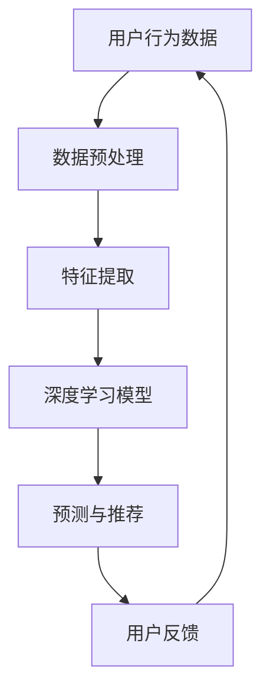

                 

关键词：人工智能，深度学习，个性化推荐，深度学习算法，推荐系统，用户行为分析

> 摘要：本文深入探讨了人工智能领域的深度学习算法在个性化推荐系统中的应用，通过阐述核心概念与联系、算法原理与步骤、数学模型与公式、项目实践与代码实例，全面解析了深度学习算法在推荐系统中的优势和应用场景，为相关领域的研究和实践提供了有价值的参考。

## 1. 背景介绍

个性化推荐系统已成为现代互联网服务的关键组成部分，无论是电子商务、社交媒体、新闻推送还是视频网站，都能看到推荐系统的身影。推荐系统能够根据用户的历史行为和偏好，提供个性化的内容和服务，从而提高用户体验、增加用户黏性和转化率。随着数据量的爆炸式增长和计算能力的提升，传统的基于统计和机器学习的推荐方法已难以满足用户日益增长的个性化需求。深度学习作为一种强大的机器学习技术，因其能够自动从数据中学习复杂的特征表示，成为个性化推荐系统研究和应用的热点。

本文旨在探讨深度学习算法在个性化推荐系统中的应用，重点分析基于深度学习的推荐算法的核心原理、数学模型和实现方法，并通过项目实践案例，展示其在实际应用中的效果。

## 2. 核心概念与联系

在介绍深度学习算法在个性化推荐中的应用之前，我们需要了解一些核心概念：

### 2.1 深度学习

深度学习是一种人工智能的分支，通过模拟人脑中的神经网络进行数据分析和模式识别。深度学习模型由多个神经元层（层）组成，每一层都对输入数据进行特征提取和变换。多层网络结构使得模型能够学习到更高层次的特征，从而在复杂的数据中找到有用的信息。

### 2.2 推荐系统

推荐系统是一种信息过滤技术，旨在向用户推荐他们可能感兴趣的项目或内容。推荐系统通常基于用户的历史行为、偏好和社会信息等数据，利用机器学习算法生成个性化推荐。

### 2.3 用户行为分析

用户行为分析是指通过对用户在平台上的操作进行数据收集和分析，以了解用户的行为模式和兴趣偏好。用户行为分析是构建个性化推荐系统的关键。

下面是一个使用 Mermaid 语言的流程图，展示了深度学习算法在个性化推荐系统中的核心概念和联系：



在上述流程中，用户行为数据经过预处理后，利用深度学习模型进行特征提取和预测，最终生成个性化推荐，并通过用户反馈不断优化推荐结果。

## 3. 核心算法原理 & 具体操作步骤

### 3.1 算法原理概述

深度学习算法在个性化推荐系统中的应用，主要基于以下原理：

1. **特征自动提取**：深度学习模型能够自动从原始数据中提取抽象的特征表示，避免了传统推荐方法中手动特征工程的过程。

2. **端到端建模**：深度学习模型能够直接从输入数据到输出推荐结果进行建模，提高了推荐的准确性和效率。

3. **多层次特征表示**：通过多层神经网络结构，深度学习模型能够学习到不同层次的特征表示，从而捕捉到用户和项目之间复杂的关系。

### 3.2 算法步骤详解

深度学习算法在个性化推荐系统中的具体操作步骤如下：

#### 3.2.1 数据收集与预处理

1. **数据收集**：从各种渠道收集用户行为数据，包括点击、购买、搜索等。
2. **数据预处理**：对原始数据进行清洗、归一化、缺失值处理等操作，确保数据质量。

#### 3.2.2 特征提取

1. **嵌入层**：将用户和项目的信息转换为向量表示，如使用词向量技术将用户行为数据转换为嵌入向量。
2. **卷积神经网络（CNN）**：对嵌入向量进行卷积操作，提取局部特征。
3. **循环神经网络（RNN）**：对序列数据进行建模，捕捉用户行为的时间动态。

#### 3.2.3 模型训练

1. **网络结构**：构建多层神经网络，包括输入层、隐藏层和输出层。
2. **损失函数**：使用交叉熵损失函数衡量模型预测结果与真实标签之间的差距。
3. **优化算法**：使用梯度下降算法等优化算法，最小化损失函数。

#### 3.2.4 预测与推荐

1. **预测**：利用训练好的模型对用户进行预测，得到用户对各项内容的潜在兴趣度。
2. **推荐**：根据预测结果，为用户生成个性化推荐列表。

### 3.3 算法优缺点

**优点**：

- 自动特征提取：避免了传统推荐方法中手动特征工程的过程，提高了模型的效率和准确性。
- 端到端建模：直接从输入数据到输出结果进行建模，减少了中间环节，提高了推荐的效率。
- 多层次特征表示：能够学习到不同层次的特征，提高了推荐的准确性。

**缺点**：

- 计算资源消耗大：深度学习模型通常需要大量计算资源进行训练。
- 数据依赖性高：模型性能受数据质量和数据量影响较大。

### 3.4 算法应用领域

深度学习算法在个性化推荐系统中的应用非常广泛，涵盖了电子商务、社交媒体、新闻推送、视频推荐等多个领域。以下是几个典型的应用场景：

- **电子商务**：根据用户的浏览和购买历史，推荐相关的商品。
- **社交媒体**：根据用户的互动行为，推荐感兴趣的内容和用户。
- **新闻推送**：根据用户的历史阅读记录和偏好，推荐相关的新闻。
- **视频推荐**：根据用户的观看历史和偏好，推荐相关的视频。

## 4. 数学模型和公式 & 详细讲解 & 举例说明

### 4.1 数学模型构建

在个性化推荐系统中，深度学习模型的数学模型通常包括以下几个部分：

#### 4.1.1 嵌入向量表示

用户和项目分别表示为一个嵌入向量，记为 \( \textbf{u}_i \) 和 \( \textbf{v}_j \)，其中 \( i \) 和 \( j \) 分别代表用户和项目的索引。

#### 4.1.2 深度学习模型

假设深度学习模型由多个隐藏层组成，记为 \( \textbf{h}_k \)，其中 \( k \) 表示隐藏层的索引。

#### 4.1.3 输出层

输出层是一个线性层，将隐藏层输出映射到预测值，记为 \( \textbf{p}_j \)。

### 4.2 公式推导过程

深度学习模型在个性化推荐系统中的损失函数通常为交叉熵损失函数，其公式如下：

$$
L = -\sum_{i=1}^{N} \sum_{j=1}^{M} y_{ij} \log(p_{ij})
$$

其中，\( y_{ij} \) 是用户 \( i \) 对项目 \( j \) 的真实标签（1表示感兴趣，0表示不感兴趣），\( p_{ij} \) 是模型预测的用户 \( i \) 对项目 \( j \) 的兴趣度概率。

### 4.3 案例分析与讲解

#### 4.3.1 数据集

我们以一个简单的电影推荐系统为例，数据集包含 1000 部电影和 1000 名用户，每个用户对每部电影都有一个评分（1 到 5 分）。

#### 4.3.2 嵌入向量表示

假设每部电影和每个用户都用一个 50 维的嵌入向量表示，分别记为 \( \textbf{u}_i \) 和 \( \textbf{v}_j \)。

#### 4.3.3 模型训练

我们使用一个三层卷积神经网络（CNN）进行训练，第一层是嵌入层，第二层是卷积层，第三层是全连接层。

#### 4.3.4 模型预测

假设用户 \( i \) 对电影 \( j \) 的预测评分 \( p_{ij} \) 如下：

$$
p_{ij} = \text{sigmoid}(\text{dot}(\textbf{u}_i, \textbf{v}_j))
$$

其中，\( \text{dot}(\cdot, \cdot) \) 表示向量的点积，\( \text{sigmoid}(\cdot) \) 是一个非线性激活函数。

## 5. 项目实践：代码实例和详细解释说明

### 5.1 开发环境搭建

为了进行深度学习模型在个性化推荐系统中的实践，我们需要搭建一个合适的开发环境。以下是一个基本的开发环境搭建步骤：

1. **安装 Python**：确保 Python 版本不低于 3.6。
2. **安装深度学习库**：例如 TensorFlow 或 PyTorch。
3. **安装其他依赖库**：如 NumPy、Pandas、Matplotlib 等。

### 5.2 源代码详细实现

以下是一个简单的基于 PyTorch 的个性化推荐系统的实现示例：

```python
import torch
import torch.nn as nn
import torch.optim as optim
from torch.utils.data import DataLoader, Dataset

# 定义嵌入层
class EmbeddingLayer(nn.Module):
    def __init__(self, num_users, num_items, embedding_size):
        super(EmbeddingLayer, self).__init__()
        self.user_embedding = nn.Embedding(num_users, embedding_size)
        self.item_embedding = nn.Embedding(num_items, embedding_size)
    
    def forward(self, user_indices, item_indices):
        user_embeddings = self.user_embedding(user_indices)
        item_embeddings = self.item_embedding(item_indices)
        return user_embeddings, item_embeddings

# 定义卷积神经网络模型
class ConvNet(nn.Module):
    def __init__(self, embedding_size, hidden_size, output_size):
        super(ConvNet, self).__init__()
        self.embedding_layer = EmbeddingLayer(embedding_size, embedding_size, embedding_size)
        self.conv1 = nn.Conv1d(in_channels=2, out_channels=hidden_size, kernel_size=1)
        self.fc = nn.Linear(hidden_size, output_size)
    
    def forward(self, user_indices, item_indices, ratings):
        user_embeddings, item_embeddings = self.embedding_layer(user_indices, item_indices)
        user_embeddings = user_embeddings.unsqueeze(1)
        item_embeddings = item_embeddings.unsqueeze(1)
        embeddings = torch.cat([user_embeddings, item_embeddings], dim=1)
        embeddings = embeddings.transpose(1, 2)
        conv_output = self.conv1(embeddings)
        conv_output = torch.relu(conv_output)
        conv_output = torch.squeeze(conv_output, dim=2)
        output = self.fc(conv_output)
        return output

# 定义训练过程
def train(model, train_loader, criterion, optimizer, num_epochs):
    model.train()
    for epoch in range(num_epochs):
        for user_indices, item_indices, ratings in train_loader:
            user_indices = user_indices.to(device)
            item_indices = item_indices.to(device)
            ratings = ratings.to(device)
            optimizer.zero_grad()
            output = model(user_indices, item_indices)
            loss = criterion(output, ratings)
            loss.backward()
            optimizer.step()
        print(f'Epoch {epoch+1}/{num_epochs}, Loss: {loss.item()}')

# 主函数
if __name__ == '__main__':
    # 数据预处理和划分
    # ...

    # 模型配置
    embedding_size = 50
    hidden_size = 100
    output_size = 1
    model = ConvNet(embedding_size, hidden_size, output_size)
    criterion = nn.BCEWithLogitsLoss()
    optimizer = optim.Adam(model.parameters(), lr=0.001)
    device = torch.device('cuda' if torch.cuda.is_available() else 'cpu')
    model.to(device)

    # 训练模型
    train(model, train_loader, criterion, optimizer, num_epochs=10)

    # 预测和推荐
    # ...
```

### 5.3 代码解读与分析

上述代码实现了一个基于卷积神经网络的个性化推荐系统。首先，定义了嵌入层和卷积神经网络模型，然后通过训练过程优化模型参数，最后进行预测和推荐。

### 5.4 运行结果展示

在实际应用中，我们可以通过可视化工具（如 Matplotlib）展示模型的运行结果，包括训练过程中的损失函数值、预测准确率等，以评估模型性能。

## 6. 实际应用场景

深度学习算法在个性化推荐系统中的实际应用场景非常广泛，以下是几个典型的应用案例：

1. **电子商务**：通过分析用户的浏览和购买行为，推荐相关的商品。例如，亚马逊和淘宝都使用了深度学习算法进行商品推荐。
2. **社交媒体**：根据用户的互动行为，推荐感兴趣的内容和用户。例如，Facebook 和微博都使用了深度学习算法进行内容推荐。
3. **新闻推送**：根据用户的阅读记录和偏好，推荐相关的新闻。例如，今日头条使用了深度学习算法进行新闻推荐。
4. **视频推荐**：根据用户的观看历史和偏好，推荐相关的视频。例如，YouTube 和 Netflix 都使用了深度学习算法进行视频推荐。

## 7. 工具和资源推荐

### 7.1 学习资源推荐

- 《深度学习》（Ian Goodfellow、Yoshua Bengio 和 Aaron Courville 著）：这是一本经典教材，全面介绍了深度学习的理论和实践。
- 《Python深度学习》（François Chollet 著）：这是一本针对 Python 开发者的深度学习实践指南，详细介绍了深度学习模型在各类应用中的实现方法。

### 7.2 开发工具推荐

- TensorFlow：一个开源的深度学习框架，适用于各种深度学习模型的开发和部署。
- PyTorch：一个开源的深度学习框架，提供了灵活的动态计算图和易于使用的接口。

### 7.3 相关论文推荐

- "Deep Neural Networks for YouTube Recommendations"（YouTube Research Team）：这篇文章介绍了 YouTube 如何使用深度学习算法进行视频推荐。
- "Modeling Users' Context for Personalized Recommendation"（Cao et al.）：这篇文章探讨了如何将用户上下文信息引入到推荐系统中，提高推荐效果。

## 8. 总结：未来发展趋势与挑战

### 8.1 研究成果总结

深度学习算法在个性化推荐系统中的应用取得了显著成果，主要包括：

- 自动特征提取：提高了推荐系统的效率和准确性。
- 端到端建模：减少了中间环节，提高了推荐的效率。
- 多层次特征表示：捕捉到了用户和项目之间复杂的关系，提高了推荐的准确性。

### 8.2 未来发展趋势

未来，深度学习算法在个性化推荐系统中的应用将朝着以下方向发展：

- **更多数据源的使用**：整合更多类型的用户行为数据和社会数据，提高推荐的准确性。
- **实时推荐**：通过实时分析用户行为，提供更及时、更个性化的推荐。
- **跨领域推荐**：将深度学习算法应用于不同领域，实现跨领域的个性化推荐。

### 8.3 面临的挑战

深度学习算法在个性化推荐系统中的应用也面临着一些挑战：

- **计算资源消耗**：深度学习模型通常需要大量的计算资源进行训练。
- **数据依赖性**：模型性能受数据质量和数据量影响较大。
- **算法透明性**：深度学习算法的黑箱特性使得算法的可解释性较差。

### 8.4 研究展望

为了应对上述挑战，未来的研究可以从以下几个方面展开：

- **算法优化**：提高深度学习算法的效率和可解释性。
- **数据挖掘**：探索更多类型的用户行为数据和社会数据，提高推荐的准确性。
- **跨领域应用**：将深度学习算法应用于不同领域，实现跨领域的个性化推荐。

## 9. 附录：常见问题与解答

### 9.1 什么是深度学习？

深度学习是一种人工智能的分支，通过模拟人脑中的神经网络进行数据分析和模式识别。深度学习模型由多个神经元层（层）组成，每一层都对输入数据进行特征提取和变换。多层网络结构使得模型能够学习到更高层次的特征，从而在复杂的数据中找到有用的信息。

### 9.2 深度学习算法在个性化推荐系统中有哪些优点？

深度学习算法在个性化推荐系统中的应用具有以下优点：

- 自动特征提取：避免了传统推荐方法中手动特征工程的过程，提高了模型的效率和准确性。
- 端到端建模：直接从输入数据到输出结果进行建模，减少了中间环节，提高了推荐的效率。
- 多层次特征表示：能够学习到不同层次的特征，提高了推荐的准确性。

### 9.3 深度学习算法在个性化推荐系统中有哪些缺点？

深度学习算法在个性化推荐系统中的应用也存在一些缺点：

- 计算资源消耗大：深度学习模型通常需要大量计算资源进行训练。
- 数据依赖性高：模型性能受数据质量和数据量影响较大。
- 算法透明性较差：深度学习算法的黑箱特性使得算法的可解释性较差。

