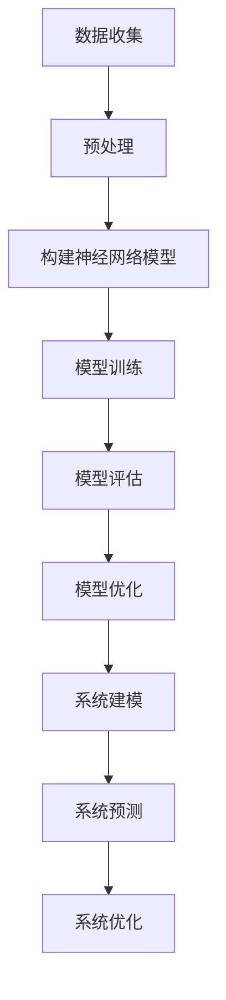

                 

关键词：人工智能，深度学习，复杂系统建模，算法原理，数学模型，实际应用

>摘要：本文将探讨人工智能领域中的深度学习算法，特别是其在复杂系统建模中的应用。通过对核心算法原理的深入解析、数学模型构建的详细介绍，以及实际应用的案例分析，旨在为读者提供一份全面的技术指南。

## 1. 背景介绍

随着信息技术的飞速发展，人工智能（AI）已经成为现代科技的前沿领域，尤其深度学习（Deep Learning）在图像识别、自然语言处理、智能推荐等领域的应用取得了显著成果。复杂系统建模是深度学习在工程实践中不可或缺的一部分，它能够帮助我们理解和预测系统行为，优化系统性能。

复杂系统通常具有高度非线性、多重反馈和不确定性等特点。这些特性使得传统的解析方法难以有效建模，而深度学习算法通过模拟人脑神经元网络结构，具有强大的非线性建模和数据处理能力，成为复杂系统建模的利器。

## 2. 核心概念与联系

在深入探讨深度学习算法之前，我们需要明确几个核心概念：神经网络、深度学习、以及复杂系统的定义和特点。

### 2.1 神经网络

神经网络（Neural Network）是深度学习的基础，它由大量简单计算单元（称为神经元）组成，这些神经元通过连接（权重）相互影响，形成复杂的网络结构。神经网络通过学习输入和输出数据之间的关系，实现数据的高效处理和预测。

### 2.2 深度学习

深度学习（Deep Learning）是一种基于神经网络的机器学习技术，其特点是网络层级深入，能够自动提取层次化的特征表示。深度学习算法通过反向传播（Backpropagation）和优化算法（如梯度下降）来训练模型，从而实现高性能的模型训练和预测。

### 2.3 复杂系统

复杂系统（Complex System）是具有复杂内部结构和动态行为的系统。它们通常由众多相互作用的子系统组成，具有高度非线性、多重反馈和不确定性等特点。复杂系统的建模和模拟对于理解系统行为、优化系统性能具有重要意义。

### 2.4 Mermaid 流程图

以下是一个用于描述深度学习算法在复杂系统建模中应用流程的Mermaid流程图：



在这个流程图中，我们从数据收集开始，经过预处理、构建神经网络模型、模型训练和评估，最终实现复杂系统的建模和预测。

## 3. 核心算法原理 & 具体操作步骤

### 3.1 算法原理概述

深度学习算法的核心原理是模拟人脑神经元的工作方式，通过多层神经网络结构进行特征提取和模式识别。以下是深度学习算法的基本原理：

1. **前向传播**：输入数据通过网络传递，每一层神经元根据其权重和激活函数计算输出。
2. **反向传播**：计算输出误差，通过梯度下降优化算法调整权重和偏置。
3. **激活函数**：引入非线性因素，使神经网络具有非线性映射能力。

### 3.2 算法步骤详解

1. **数据收集**：收集适合复杂系统建模的数据集。
2. **预处理**：对数据进行清洗、归一化等预处理操作。
3. **构建神经网络模型**：选择合适的网络结构，例如卷积神经网络（CNN）、循环神经网络（RNN）等。
4. **模型训练**：使用训练数据集训练模型，通过反向传播和优化算法调整模型参数。
5. **模型评估**：使用验证数据集评估模型性能，调整模型参数以达到最佳效果。
6. **系统建模**：将训练好的模型应用于复杂系统建模，进行系统预测和优化。

### 3.3 算法优缺点

**优点**：
- **非线性建模能力**：能够处理复杂系统的高度非线性特性。
- **自动特征提取**：通过多层网络结构自动提取层次化的特征表示。
- **适应性**：通过不断优化和调整，适应不同复杂系统建模的需求。

**缺点**：
- **计算成本高**：深度学习算法需要大量的计算资源和时间进行训练。
- **数据需求大**：训练高质量的模型需要大量高质量的数据。

### 3.4 算法应用领域

深度学习算法在复杂系统建模中的应用非常广泛，包括但不限于以下几个方面：
- **智能交通系统**：通过深度学习算法建模交通流量，实现智能交通管理。
- **金融风险管理**：利用深度学习算法分析金融市场数据，预测风险并优化投资策略。
- **医疗诊断系统**：应用深度学习算法进行医学影像分析和疾病预测。

## 4. 数学模型和公式 & 详细讲解 & 举例说明

### 4.1 数学模型构建

在深度学习算法中，数学模型构建至关重要。以下是一个简化的数学模型构建过程：

1. **输入层**：输入向量 \(\textbf{x} = [x_1, x_2, \ldots, x_n]\)。
2. **隐藏层**：每层由多个神经元组成，每个神经元根据其权重 \(w_{ij}\) 和激活函数 \(f(\cdot)\) 计算输出。
3. **输出层**：最终输出向量 \(\textbf{y} = [y_1, y_2, \ldots, y_m]\)。

### 4.2 公式推导过程

假设一个单层神经网络，其输入层有 \(n\) 个神经元，隐藏层有 \(m\) 个神经元，输出层有 \(p\) 个神经元。神经元的输出可以表示为：

\[ z_j = \sum_{i=1}^{n} w_{ij} x_i + b_j \]

其中，\(z_j\) 是隐藏层第 \(j\) 个神经元的输出，\(w_{ij}\) 是输入层第 \(i\) 个神经元到隐藏层第 \(j\) 个神经元的权重，\(b_j\) 是隐藏层第 \(j\) 个神经元的偏置。

激活函数 \(f(\cdot)\) 可以是sigmoid、ReLU等：

\[ o_j = f(z_j) \]

对于输出层，类似地：

\[ y_k = \sum_{j=1}^{m} w_{kj} o_j + b_k \]

其中，\(y_k\) 是输出层第 \(k\) 个神经元的输出，\(w_{kj}\) 是隐藏层第 \(j\) 个神经元到输出层第 \(k\) 个神经元的权重，\(b_k\) 是输出层第 \(k\) 个神经元的偏置。

### 4.3 案例分析与讲解

以一个简单的回归问题为例，假设我们想要预测房价。输入层有一个神经元表示房屋面积，隐藏层有两个神经元，输出层有一个神经元表示房价。

1. **输入层**：\(x = \text{房屋面积}\)。
2. **隐藏层**：
   \[ z_1 = w_{11} x + b_1 \]
   \[ z_2 = w_{21} x + b_2 \]
   \[ o_1 = \text{ReLU}(z_1) \]
   \[ o_2 = \text{ReLU}(z_2) \]
3. **输出层**：
   \[ y = w_{1} o_1 + w_{2} o_2 + b \]

通过训练，我们可以得到一组权重 \(w_{11}, w_{21}, w_{1}, w_{2}\) 和偏置 \(b_1, b_2, b\)，从而实现房价预测。

## 5. 项目实践：代码实例和详细解释说明

### 5.1 开发环境搭建

为了便于读者理解，我们将在Python环境中使用TensorFlow框架实现一个简单的深度学习模型。首先，需要安装TensorFlow：

```bash
pip install tensorflow
```

### 5.2 源代码详细实现

以下是一个简单的深度学习模型实现，用于预测房价：

```python
import tensorflow as tf
from tensorflow import keras
import numpy as np

# 数据集加载和处理
# 假设已加载一个包含房屋面积和房价的数据集 (x, y)

# 构建模型
model = keras.Sequential([
    keras.layers.Dense(units=2, activation='relu', input_shape=(1,)),
    keras.layers.Dense(units=1)
])

# 编译模型
model.compile(optimizer='adam', loss='mean_squared_error')

# 训练模型
model.fit(x, y, epochs=100)

# 预测房价
predictions = model.predict(x)

# 输出预测结果
print(predictions)
```

### 5.3 代码解读与分析

在这个例子中，我们首先导入了TensorFlow库，并定义了一个简单的线性回归模型。模型由两个隐藏层组成，每个隐藏层有两个神经元，输出层有一个神经元。

通过编译模型并使用训练数据集进行训练，我们可以获得一组权重和偏置。最后，使用训练好的模型进行房价预测。

### 5.4 运行结果展示

运行上述代码后，我们将得到一组预测房价的结果。通过对比预测结果和实际房价，我们可以评估模型的性能。

## 6. 实际应用场景

### 6.1 智能交通系统

在智能交通系统中，深度学习算法可以用于交通流量预测、交通信号控制和路径规划等。例如，通过分析历史交通数据，可以预测未来某段时间内的交通流量，从而优化交通信号控制策略，减少交通拥堵。

### 6.2 金融风险管理

金融风险管理是深度学习算法的重要应用领域。通过分析大量金融市场数据，可以预测市场走势、评估投资风险，并制定最优投资策略。例如，利用深度学习算法分析股票市场数据，可以预测股票价格趋势，帮助投资者做出明智的决策。

### 6.3 医疗诊断系统

深度学习算法在医疗诊断系统中的应用日益广泛。通过分析医学影像数据，可以辅助医生进行疾病诊断。例如，利用深度学习算法分析CT扫描图像，可以检测肺癌等疾病，提高诊断准确性。

## 7. 工具和资源推荐

### 7.1 学习资源推荐

- **深度学习基础教程**：[《深度学习》（花书）](http://www.deeplearningbook.org/)
- **Python机器学习**：[《Python机器学习》（O'Reilly）](https://www.oreilly.com/library/view/python-machine/9781449369880/)
- **TensorFlow官方文档**：[TensorFlow文档](https://www.tensorflow.org/tutorials)

### 7.2 开发工具推荐

- **Jupyter Notebook**：用于编写和运行Python代码。
- **Google Colab**：免费的云计算平台，适合进行深度学习和数据分析。

### 7.3 相关论文推荐

- **“Deep Learning”**：Goodfellow, I., Bengio, Y., & Courville, A.
- **“Distributed Representations of Words and Phrases and their Compositionality”**：Mikolov, T., Sutskever, I., Chen, K., Corrado, G. S., & Dean, J.

## 8. 总结：未来发展趋势与挑战

### 8.1 研究成果总结

深度学习算法在复杂系统建模中取得了显著成果，包括交通流量预测、金融风险管理、医疗诊断等多个领域。随着算法的不断发展，其应用范围和性能不断提升。

### 8.2 未来发展趋势

- **算法优化**：通过改进算法结构和优化算法参数，提高深度学习算法的性能和效率。
- **跨学科融合**：与其他学科（如物理、化学、生物等）相结合，解决复杂系统建模中的难题。
- **大数据应用**：利用海量数据进行深度学习模型的训练和优化，提高模型的准确性和泛化能力。

### 8.3 面临的挑战

- **计算资源**：深度学习算法需要大量的计算资源，高性能计算设备和云计算平台的发展将对此起到关键作用。
- **数据质量**：高质量的数据是深度学习算法训练的基础，数据清洗和预处理工作至关重要。
- **模型解释性**：深度学习算法的黑箱特性使得其解释性较差，提高模型的可解释性是未来研究的重要方向。

### 8.4 研究展望

随着人工智能技术的不断发展，深度学习算法在复杂系统建模中的应用前景广阔。未来，我们有望通过不断创新和优化，进一步提升深度学习算法的性能和适用性，为复杂系统建模和优化提供强大的技术支持。

## 9. 附录：常见问题与解答

### 9.1 深度学习算法如何处理大数据？

深度学习算法可以通过分布式计算和大数据技术（如Hadoop、Spark等）处理大数据。同时，可以采用数据预处理和特征提取技术，提高数据质量和算法效率。

### 9.2 深度学习算法的可解释性如何提高？

目前，提高深度学习算法的可解释性是研究的热点。可以通过可视化、特征重要性分析、模型简化等方法提高模型的可解释性。

### 9.3 深度学习算法在实时应用中如何优化性能？

在实时应用中，可以通过模型压缩、量化、迁移学习等方法优化深度学习算法的性能。同时，选择合适的硬件平台和算法优化技术（如GPU、TPU等）也是关键。

**作者：禅与计算机程序设计艺术 / Zen and the Art of Computer Programming**

