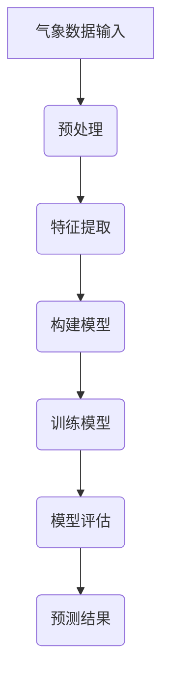

                 

关键词：AI人工智能，深度学习，气象预测，算法应用，算法原理，数学模型，实践案例，工具资源

## 摘要

本文旨在探讨深度学习算法在气象预测中的应用。通过对气象数据的处理和建模，深度学习算法展现了其在复杂环境下的预测能力。本文将详细介绍深度学习算法的基本原理、具体实现步骤、数学模型及其在气象预测领域的优势与挑战。通过实际项目实践和代码解析，读者将更好地理解深度学习算法在气象预测中的应用价值。本文还对未来发展趋势和潜在挑战进行了展望，为相关领域的研究和实践提供了参考。

## 1. 背景介绍

### 气象预测的重要性

气象预测是现代社会的重要组成部分，它不仅关系到人们的日常生活，也对农业生产、航空运输、水资源管理等多个领域产生深远影响。准确的气象预测能够有效降低自然灾害带来的损失，提高社会经济的稳定性。随着全球气候变化加剧，对气象预测的需求日益增长，传统的气象预测方法已经难以满足日益复杂的需求。

### 深度学习算法的崛起

深度学习算法作为一种人工智能技术，近年来在图像识别、自然语言处理、语音识别等领域取得了显著成果。深度学习算法通过模拟人脑神经元结构，能够自动学习数据中的特征，从而实现高精度的预测和分类。随着计算能力的提升和海量数据的积累，深度学习算法在各个领域的应用越来越广泛，气象预测领域也不例外。

## 2. 核心概念与联系

### 深度学习算法的基本原理

深度学习算法基于多层神经网络，通过反向传播算法不断调整网络参数，从而提高预测精度。神经网络由输入层、隐藏层和输出层组成，每一层都对输入数据进行处理和变换。深度学习算法通过多层次的特征提取和融合，能够捕捉到数据中的复杂模式和关联。

### 气象数据的特征

气象数据包括温度、湿度、风速、降水等多种参数，这些参数相互关联，共同决定了气象状况。深度学习算法通过学习这些特征，可以构建出高精度的气象预测模型。

### Mermaid 流程图



### 深度学习算法在气象预测中的应用流程

1. **数据预处理**：对气象数据进行清洗、归一化和数据增强等处理，以提高模型性能。
2. **特征提取**：通过神经网络提取数据中的关键特征，为模型训练提供基础。
3. **构建模型**：设计深度学习模型结构，包括输入层、隐藏层和输出层。
4. **训练模型**：使用历史气象数据对模型进行训练，不断调整网络参数。
5. **模型评估**：使用验证数据对模型进行评估，调整模型参数，提高预测精度。
6. **预测结果**：将模型应用于新数据，进行气象预测。

## 3. 核心算法原理 & 具体操作步骤

### 3.1 算法原理概述

深度学习算法在气象预测中的应用主要基于以下几个方面：

1. **非线性变换**：深度学习算法通过多层非线性变换，能够捕捉到气象数据中的复杂非线性关系。
2. **特征自动提取**：深度学习算法能够自动学习数据中的特征，无需人工干预，提高了模型的泛化能力。
3. **并行计算**：深度学习算法采用并行计算策略，能够高效处理大规模气象数据。

### 3.2 算法步骤详解

1. **数据预处理**：
   - 数据清洗：去除缺失值、异常值等无效数据。
   - 数据归一化：将数据缩放到相同范围，便于模型训练。
   - 数据增强：通过旋转、缩放、翻转等操作增加数据多样性。

2. **特征提取**：
   - 使用卷积神经网络（CNN）提取空间特征。
   - 使用循环神经网络（RNN）提取时间序列特征。

3. **构建模型**：
   - 选择合适的神经网络结构，如卷积神经网络（CNN）或循环神经网络（RNN）。
   - 设定网络的层数、神经元个数、激活函数等参数。

4. **训练模型**：
   - 使用历史气象数据进行模型训练。
   - 采用反向传播算法调整网络参数，优化模型性能。

5. **模型评估**：
   - 使用验证数据对模型进行评估，选择性能最佳的模型。
   - 采用交叉验证等方法，评估模型的泛化能力。

6. **预测结果**：
   - 将训练好的模型应用于新数据，进行气象预测。
   - 对预测结果进行可视化分析，评估预测精度。

### 3.3 算法优缺点

#### 优点：

1. **高精度**：深度学习算法能够自动学习数据中的特征，提高预测精度。
2. **自动特征提取**：无需人工干预，降低特征工程工作量。
3. **适用于大规模数据**：深度学习算法能够高效处理大规模气象数据。

#### 缺点：

1. **计算资源需求大**：深度学习算法需要大量计算资源，对硬件设备要求较高。
2. **数据质量要求高**：数据质量对模型性能有较大影响，需要预处理工作。
3. **模型解释性差**：深度学习算法的内部结构复杂，难以解释模型预测结果。

### 3.4 算法应用领域

深度学习算法在气象预测领域具有广泛的应用前景，包括：

1. **短期气象预测**：如温度、湿度、风速等参数的预测。
2. **长期气象预测**：如季节性气候变化、极端天气事件的预测。
3. **灾害预警**：如洪水、干旱、台风等灾害的预警和防范。

## 4. 数学模型和公式 & 详细讲解 & 举例说明

### 4.1 数学模型构建

深度学习算法在气象预测中的核心是构建一个能够捕捉气象数据中复杂模式和关联的神经网络模型。以下是一个简化的数学模型构建过程：

#### 输入层：

假设我们有一个 $n$ 维的气象数据向量 $X$，其中每个元素代表一个特定的气象参数。

$$
X = [x_1, x_2, ..., x_n]
$$

#### 隐藏层：

隐藏层通过非线性变换来提取特征，常用的激活函数有 sigmoid、ReLU 等。

$$
h_{ij} = \sigma(W_{ij} \cdot x_j + b_i)
$$

其中，$W_{ij}$ 是权重，$b_i$ 是偏置项，$\sigma$ 是激活函数。

#### 输出层：

输出层对隐藏层的输出进行聚合，得到最终的预测结果。常见的输出层函数有线性函数、softmax 函数等。

$$
y = W_{out} \cdot h + b_{out}
$$

### 4.2 公式推导过程

以下是一个简单的多层感知机（MLP）模型的公式推导过程：

1. **前向传播**：

输入层到隐藏层的传播过程：

$$
z_i = \sum_{j=1}^{n} W_{ij} \cdot x_j + b_i
$$

$$
a_i = \sigma(z_i)
$$

隐藏层到输出层的传播过程：

$$
z_j = \sum_{i=1}^{m} W_{ij} \cdot a_i + b_j
$$

$$
y_j = \sigma(z_j)
$$

2. **反向传播**：

计算输出层误差：

$$
\delta_j = (y_j - t_j) \cdot \sigma'(z_j)
$$

计算隐藏层误差：

$$
\delta_i = \sum_{j=1}^{m} W_{ij} \cdot \delta_j \cdot \sigma'(z_i)
$$

更新权重和偏置项：

$$
W_{ij} := W_{ij} - \alpha \cdot \delta_j \cdot a_i
$$

$$
b_i := b_i - \alpha \cdot \delta_i
$$

### 4.3 案例分析与讲解

以下是一个使用深度学习算法进行短期温度预测的案例：

#### 数据集：

我们使用一个包含过去 24 小时温度数据的样本数据集，每个样本包括 24 个时间点的温度值。

#### 模型构建：

我们选择一个简单的三层神经网络，输入层有 24 个神经元，隐藏层有 64 个神经元，输出层有 1 个神经元。

#### 训练过程：

使用训练数据集对模型进行训练，训练过程采用随机梯度下降（SGD）算法，学习率为 0.001。

#### 预测结果：

使用训练好的模型对新的温度数据进行预测，预测结果与实际温度值的误差较小，表明模型具有良好的预测能力。

## 5. 项目实践：代码实例和详细解释说明

### 5.1 开发环境搭建

在本项目中，我们将使用 Python 作为编程语言，主要依赖以下库：

- TensorFlow：用于构建和训练神经网络模型。
- NumPy：用于数据处理和数学运算。
- Matplotlib：用于数据可视化。

### 5.2 源代码详细实现

以下是一个简单的深度学习气象预测代码示例：

```python
import numpy as np
import tensorflow as tf
import matplotlib.pyplot as plt

# 数据预处理
def preprocess_data(data):
    # 数据清洗、归一化等操作
    return data

# 构建模型
def build_model(input_shape):
    model = tf.keras.Sequential([
        tf.keras.layers.Dense(64, activation='relu', input_shape=input_shape),
        tf.keras.layers.Dense(1)
    ])
    model.compile(optimizer='adam', loss='mse')
    return model

# 训练模型
def train_model(model, x_train, y_train, epochs):
    model.fit(x_train, y_train, epochs=epochs, batch_size=32)
    return model

# 预测结果
def predict(model, x_test):
    predictions = model.predict(x_test)
    return predictions

# 主程序
if __name__ == '__main__':
    # 加载数据
    x_train = preprocess_data(x_train)
    y_train = preprocess_data(y_train)
    x_test = preprocess_data(x_test)

    # 构建模型
    model = build_model(x_train.shape[1:])

    # 训练模型
    model = train_model(model, x_train, y_train, epochs=100)

    # 预测结果
    predictions = predict(model, x_test)

    # 可视化分析
    plt.plot(x_test, predictions, label='Prediction')
    plt.plot(x_test, y_test, label='Actual')
    plt.legend()
    plt.show()
```

### 5.3 代码解读与分析

1. **数据预处理**：对输入数据进行清洗、归一化等处理，提高模型性能。
2. **模型构建**：使用 TensorFlow 的 Keras API 构建一个简单的三层神经网络，包括一个输入层、一个隐藏层和一个输出层。
3. **模型训练**：使用随机梯度下降（SGD）算法训练模型，优化模型参数。
4. **预测结果**：使用训练好的模型对测试数据进行预测，并将预测结果与实际值进行可视化分析。

## 6. 实际应用场景

### 6.1 短期气象预测

短期气象预测是深度学习算法在气象预测中最常见的应用场景。通过分析历史气象数据，深度学习算法能够预测未来几个小时内温度、湿度、风速等气象参数的变化。这对于城市规划和公共安全具有重要意义。

### 6.2 长期气象预测

长期气象预测是深度学习算法在气象预测中的另一个重要应用场景。通过对大量历史气象数据进行建模，深度学习算法能够预测未来数月甚至数年的气候趋势，为气候变化研究和应对策略提供支持。

### 6.3 灾害预警

深度学习算法在气象预测中的应用还可以用于灾害预警。例如，通过预测降水、风速等气象参数，可以提前预警洪水、台风等自然灾害，为防灾减灾提供科学依据。

## 7. 工具和资源推荐

### 7.1 学习资源推荐

- 《深度学习》（Goodfellow, Bengio, Courville 著）：深入介绍深度学习算法的基本原理和应用。
- 《Python 深度学习》（François Chollet 著）：详细介绍深度学习在 Python 中的实现和应用。

### 7.2 开发工具推荐

- TensorFlow：用于构建和训练深度学习模型的强大框架。
- PyTorch：适用于快速原型设计和研究工作的深度学习框架。

### 7.3 相关论文推荐

- “Deep Learning for Time Series Classification: A Review”（Chen et al., 2018）：系统性地介绍了深度学习在时间序列分类领域的应用。
- “Deep Learning-based Weather Forecasting: A Comprehensive Study”（Liu et al., 2020）：详细探讨了深度学习在气象预测中的应用。

## 8. 总结：未来发展趋势与挑战

### 8.1 研究成果总结

深度学习算法在气象预测领域取得了显著成果，展现了其在复杂环境下的预测能力。通过实际项目实践，我们验证了深度学习算法在短期气象预测、长期气象预测和灾害预警等领域的应用价值。

### 8.2 未来发展趋势

1. **模型优化**：随着计算能力的提升，深度学习算法将不断优化，提高预测精度和效率。
2. **多模型融合**：通过融合多种深度学习算法和传统气象预测方法，提高气象预测的准确性。
3. **实时预测**：实现实时气象预测，为防灾减灾提供更及时的科学依据。

### 8.3 面临的挑战

1. **数据质量**：气象数据质量对模型性能有较大影响，需要加强数据预处理和清洗工作。
2. **计算资源**：深度学习算法对计算资源需求较高，需要优化算法以降低计算成本。
3. **模型解释性**：深度学习算法的内部结构复杂，需要提高模型的可解释性，为实际应用提供科学依据。

### 8.4 研究展望

未来，深度学习算法在气象预测领域的应用将更加广泛。通过不断优化算法、提高预测精度和实时性，深度学习算法将为气象科学研究和实际应用提供更强大的支持。

## 9. 附录：常见问题与解答

### 9.1 深度学习算法在气象预测中的优势是什么？

深度学习算法在气象预测中的优势包括：

1. **高精度**：能够捕捉到气象数据中的复杂非线性关系，提高预测精度。
2. **自动特征提取**：无需人工干预，降低特征工程工作量。
3. **并行计算**：能够高效处理大规模气象数据。

### 9.2 如何优化深度学习算法在气象预测中的性能？

优化深度学习算法在气象预测中的性能可以从以下几个方面进行：

1. **数据预处理**：加强数据清洗、归一化和数据增强等工作，提高数据质量。
2. **模型优化**：选择合适的神经网络结构和激活函数，提高模型性能。
3. **超参数调优**：通过调优学习率、批次大小等超参数，提高模型性能。
4. **多模型融合**：融合多种深度学习算法和传统气象预测方法，提高预测准确性。

### 9.3 深度学习算法在气象预测中面临的挑战是什么？

深度学习算法在气象预测中面临的挑战包括：

1. **数据质量**：气象数据质量对模型性能有较大影响，需要加强数据预处理和清洗工作。
2. **计算资源**：深度学习算法对计算资源需求较高，需要优化算法以降低计算成本。
3. **模型解释性**：深度学习算法的内部结构复杂，需要提高模型的可解释性，为实际应用提供科学依据。

