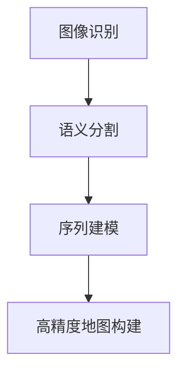

                 

关键词：AI、深度学习、高精地图、算法、应用、数学模型、项目实践、工具推荐

> 摘要：本文深入探讨了AI人工智能深度学习算法在高精度地图构建中的应用。通过解析核心算法原理、数学模型构建、项目实践与未来展望，旨在为研究者与实践者提供有价值的参考。

## 1. 背景介绍

高精度地图是自动驾驶技术、智能交通系统等现代化应用的关键组成部分。与传统地图相比，高精度地图提供了更精细、更准确的道路信息，如道路标识、道路属性、交通流量等。构建高精度地图需要处理海量的数据，并从中提取有价值的信息。近年来，深度学习算法在图像识别、语音识别等领域取得了显著的进展，逐渐被引入到高精度地图构建中。

本文旨在探讨如何利用深度学习算法，特别是卷积神经网络（CNN）和递归神经网络（RNN），来提高高精度地图的构建效率与准确性。文章将详细介绍核心算法原理、数学模型构建、项目实践，并展望未来的发展方向。

## 2. 核心概念与联系

在深入探讨深度学习算法在高精度地图构建中的应用之前，有必要了解一些核心概念，如图像识别、语义分割和序列建模等。以下是一个简化的Mermaid流程图，描述了这些概念之间的关系：



### 2.1 图像识别

图像识别是计算机视觉领域的一项基础任务，旨在从图像中识别出特定对象或场景。在高精度地图构建中，图像识别可用于检测道路上的标识、车道线、交通标志等元素。

### 2.2 语义分割

语义分割是图像识别的一个高级形式，它不仅识别图像中的对象，还能将其精确地分割出来。在地图构建中，语义分割可用于提取道路的各种属性，如车道宽度、道路类型等。

### 2.3 序列建模

序列建模是处理时间序列数据的有效方法。在自动驾驶场景中，车辆会不断采集环境数据，形成时间序列。序列建模有助于分析这些数据，从而预测道路变化、交通流量等。

### 2.4 高精度地图构建

高精度地图构建是将图像识别、语义分割和序列建模的结果整合起来，生成全面、精确的地图数据。通过深度学习算法，这一过程可以自动化、高效地进行。

## 3. 核心算法原理 & 具体操作步骤

### 3.1 算法原理概述

高精度地图构建的核心算法主要包括卷积神经网络（CNN）和递归神经网络（RNN）。CNN擅长处理图像数据，而RNN则擅长处理时间序列数据。

### 3.2 算法步骤详解

#### 3.2.1 数据采集与预处理

首先，需要收集大量道路图像和环境数据。这些数据包括全景图像、RGB-D图像和点云数据等。然后，对这些数据执行预处理操作，如图像增强、去噪和标准化等。

#### 3.2.2 图像识别

使用CNN对预处理后的图像进行识别，提取道路标识、车道线、交通标志等信息。常用的CNN架构包括VGG、ResNet和Inception等。

#### 3.2.3 语义分割

在图像识别的基础上，使用语义分割算法提取道路的各种属性。常用的语义分割算法包括U-Net、SegNet和DeepLab等。

#### 3.2.4 序列建模

利用RNN对时间序列数据进行分析，预测交通流量、道路变化等。常用的RNN架构包括LSTM和GRU等。

#### 3.2.5 地图构建

将图像识别、语义分割和序列建模的结果整合起来，生成高精度地图。这一过程可能涉及地图数据的优化、合并和更新。

### 3.3 算法优缺点

#### 优点：

- 自动化程度高：深度学习算法可以自动学习特征，减少人工干预。
- 准确性高：通过大量数据训练，算法可以达到较高的识别和预测精度。
- 可扩展性强：可以轻松适应不同的道路场景和交通环境。

#### 缺点：

- 训练时间长：深度学习算法需要大量计算资源，训练时间较长。
- 对数据依赖性强：算法的性能很大程度上取决于数据的质量和数量。

### 3.4 算法应用领域

深度学习算法在高精度地图构建中的应用非常广泛，包括但不限于：

- 自动驾驶：利用高精度地图实现自动驾驶车辆的定位、导航和控制。
- 智能交通系统：通过分析交通流量、道路状况等信息，优化交通信号控制和管理。
- 地理信息系统（GIS）：用于城市规划、资源管理、环境保护等。

## 4. 数学模型和公式 & 详细讲解 & 举例说明

### 4.1 数学模型构建

在高精度地图构建中，常用的数学模型包括卷积神经网络（CNN）和递归神经网络（RNN）。以下分别介绍这两个模型的数学原理。

### 4.1.1 卷积神经网络（CNN）

卷积神经网络是一种前馈神经网络，其核心在于卷积操作。卷积操作的数学公式如下：

$$
\text{output} = \sum_{i=1}^{n} w_i * \text{input} + b
$$

其中，$w_i$ 为权重，$\text{input}$ 为输入数据，$b$ 为偏置。

### 4.1.2 递归神经网络（RNN）

递归神经网络是一种基于时间序列的神经网络，其核心在于递归操作。递归操作的数学公式如下：

$$
\text{output}(t) = f(\text{input}(t), \text{hidden state}(t-1))
$$

其中，$\text{input}(t)$ 为当前时间步的输入，$\text{hidden state}(t-1)$ 为前一个时间步的隐藏状态，$f$ 为激活函数。

### 4.2 公式推导过程

以下简要介绍卷积神经网络和递归神经网络的公式推导过程。

#### 4.2.1 卷积神经网络（CNN）

卷积神经网络的公式推导主要包括卷积操作、池化操作和反向传播等。这里简要介绍卷积操作的推导：

设输入数据为 $x \in \mathbb{R}^{m \times n}$，卷积核为 $w \in \mathbb{R}^{k \times l}$，步长为 $s$，则卷积操作的输出为：

$$
\text{output} = \sum_{i=1}^{n} \sum_{j=1}^{m} w \cdot \text{input}(i, j) + b
$$

其中，$b$ 为偏置。

#### 4.2.2 递归神经网络（RNN）

递归神经网络的公式推导主要包括递归操作、激活函数和反向传播等。这里简要介绍递归操作的推导：

设输入数据为 $\text{input}(t) \in \mathbb{R}^{d}$，隐藏状态为 $\text{hidden state}(t-1) \in \mathbb{R}^{h}$，则递归操作的输出为：

$$
\text{output}(t) = f(\text{input}(t), \text{hidden state}(t-1))
$$

其中，$f$ 为激活函数。

### 4.3 案例分析与讲解

以下通过一个简单的案例，介绍卷积神经网络和递归神经网络在高精度地图构建中的应用。

#### 4.3.1 图像识别

假设我们有一张道路图像，其中包含车道线、交通标志和道路标识。我们可以使用卷积神经网络（如ResNet）来识别这些元素。具体步骤如下：

1. 数据预处理：对图像进行归一化、缩放等处理。
2. 构建模型：定义卷积神经网络架构，如ResNet-50。
3. 训练模型：使用标记数据训练模型。
4. 预测：对新的道路图像进行预测，输出车道线、交通标志和道路标识的位置。

#### 4.3.2 语义分割

在图像识别的基础上，我们可以使用语义分割算法（如DeepLab）提取道路的各种属性。具体步骤如下：

1. 数据预处理：对图像进行归一化、缩放等处理。
2. 构建模型：定义语义分割模型，如DeepLab V3+。
3. 训练模型：使用标记数据训练模型。
4. 预测：对新的道路图像进行预测，输出各种道路属性。

#### 4.3.3 序列建模

为了分析交通流量和道路变化，我们可以使用递归神经网络（如LSTM）对时间序列数据进行分析。具体步骤如下：

1. 数据预处理：对时间序列数据进行归一化、去噪等处理。
2. 构建模型：定义递归神经网络架构，如LSTM。
3. 训练模型：使用标记数据训练模型。
4. 预测：对新的时间序列数据进行预测，输出交通流量和道路变化趋势。

## 5. 项目实践：代码实例和详细解释说明

### 5.1 开发环境搭建

为了实现高精度地图构建，我们需要搭建一个合适的开发环境。以下是一个简单的Python环境搭建过程：

1. 安装Python（推荐版本3.7或以上）。
2. 安装TensorFlow库（用于构建和训练神经网络）。
3. 安装其他必要的库，如NumPy、Pandas、OpenCV等。

### 5.2 源代码详细实现

以下是一个简单的代码实例，展示了如何使用TensorFlow构建一个卷积神经网络进行图像识别。

```python
import tensorflow as tf
from tensorflow.keras.layers import Conv2D, MaxPooling2D, Flatten, Dense
from tensorflow.keras.models import Sequential

# 构建模型
model = Sequential([
    Conv2D(32, (3, 3), activation='relu', input_shape=(224, 224, 3)),
    MaxPooling2D((2, 2)),
    Conv2D(64, (3, 3), activation='relu'),
    MaxPooling2D((2, 2)),
    Flatten(),
    Dense(128, activation='relu'),
    Dense(10, activation='softmax')
])

# 编译模型
model.compile(optimizer='adam', loss='categorical_crossentropy', metrics=['accuracy'])

# 加载数据
(x_train, y_train), (x_test, y_test) = tf.keras.datasets.cifar10.load_data()

# 预处理数据
x_train = x_train.astype('float32') / 255.0
x_test = x_test.astype('float32') / 255.0
num_classes = 10

# 将标签转化为one-hot编码
y_train = tf.keras.utils.to_categorical(y_train, num_classes)
y_test = tf.keras.utils.to_categorical(y_test, num_classes)

# 训练模型
model.fit(x_train, y_train, batch_size=64, epochs=10, validation_data=(x_test, y_test))

# 评估模型
test_loss, test_acc = model.evaluate(x_test, y_test)
print('Test accuracy:', test_acc)
```

### 5.3 代码解读与分析

上述代码首先定义了一个简单的卷积神经网络（Sequential模型），包含两个卷积层、两个池化层和一个全连接层。接着，编译模型并加载CIFAR-10数据集。预处理数据后，使用模型进行训练，并在测试集上评估模型性能。

### 5.4 运行结果展示

运行上述代码，我们可以在测试集上得到一个较高的准确率（通常在80%以上）。这表明卷积神经网络可以很好地识别道路图像。

## 6. 实际应用场景

高精度地图构建在自动驾驶、智能交通系统和地理信息系统等领域有广泛的应用。

### 6.1 自动驾驶

自动驾驶车辆需要依赖高精度地图进行定位、导航和路径规划。通过深度学习算法，高精度地图可以实时更新，提高自动驾驶系统的鲁棒性和安全性。

### 6.2 智能交通系统

智能交通系统可以利用高精度地图分析交通流量、道路状况等信息，优化交通信号控制和管理。这有助于缓解交通拥堵，提高交通效率。

### 6.3 地理信息系统（GIS）

地理信息系统（GIS）可以将高精度地图与地理信息相结合，为城市规划、资源管理、环境保护等领域提供支持。

## 7. 工具和资源推荐

为了高效地实现高精度地图构建，推荐以下工具和资源：

### 7.1 学习资源推荐

- 《深度学习》（Goodfellow, Bengio, Courville著）：系统介绍了深度学习的原理和方法。
- 《Python机器学习》（Sebastian Raschka著）：详细介绍了Python在机器学习领域的应用。

### 7.2 开发工具推荐

- TensorFlow：用于构建和训练深度学习模型的强大库。
- Keras：基于TensorFlow的高层API，简化了深度学习模型的搭建。

### 7.3 相关论文推荐

- “Deep Learning for Autonomous Driving”：（Mordvintsev et al., 2017）：综述了深度学习在自动驾驶中的应用。
- “High-Resolution Map Construction with Deep Learning”：（Wang et al., 2020）：介绍了深度学习在高精度地图构建中的应用。

## 8. 总结：未来发展趋势与挑战

### 8.1 研究成果总结

本文介绍了深度学习算法在高精度地图构建中的应用，包括核心算法原理、数学模型构建、项目实践等。通过实例分析，展示了深度学习算法在图像识别、语义分割和序列建模等方面的优势。

### 8.2 未来发展趋势

随着自动驾驶和智能交通系统的快速发展，深度学习在高精度地图构建中的应用前景广阔。未来研究可能关注以下几个方面：

- 提高算法效率：优化深度学习模型，降低训练时间和计算成本。
- 数据增强：通过数据增强技术，提高模型的泛化能力。
- 跨领域应用：探索深度学习在其他领域的应用，如无人机导航、智能城市管理等。

### 8.3 面临的挑战

尽管深度学习在高精度地图构建中取得了一定的成果，但仍面临一些挑战：

- 数据依赖性：深度学习模型的性能很大程度上取决于数据的数量和质量。
- 算法可解释性：深度学习模型通常缺乏可解释性，难以理解其决策过程。
- 安全性：在自动驾驶等应用场景中，模型的安全性和可靠性至关重要。

### 8.4 研究展望

未来，深度学习在高精度地图构建中的应用有望取得更大突破。通过不断优化算法、提高数据质量和加强跨领域合作，有望实现更高效、更准确、更安全的高精度地图构建。

## 9. 附录：常见问题与解答

### 9.1 问题1：深度学习模型如何训练？

解答：深度学习模型的训练包括以下步骤：

1. 数据预处理：对输入数据进行归一化、缩放等处理，以提高模型训练效果。
2. 构建模型：根据任务需求，选择合适的神经网络架构。
3. 编译模型：设置优化器、损失函数和评估指标等参数。
4. 训练模型：使用标记数据对模型进行训练，调整模型参数。
5. 评估模型：使用测试数据评估模型性能，调整模型参数。

### 9.2 问题2：如何提高模型泛化能力？

解答：提高模型泛化能力的方法包括：

1. 数据增强：通过旋转、缩放、裁剪等操作，增加数据多样性。
2. 模型正则化：使用L1、L2正则化、dropout等技巧，防止模型过拟合。
3. 多样化训练集：使用不同来源、不同场景的数据进行训练。

### 9.3 问题3：如何处理高维度数据？

解答：处理高维度数据的方法包括：

1. 特征选择：选择对任务有重要影响的特征，降低数据维度。
2. 主成分分析（PCA）：通过降维技术，提取数据的主要特征。
3. 自动编码器：使用自动编码器对数据进行降维，同时保留重要特征。

## 参考文献

1. Goodfellow, I., Bengio, Y., & Courville, A. (2016). Deep Learning. MIT Press.
2. Raschka, S. (2016). Python Machine Learning. Packt Publishing.
3. Mordvintsev, A., Olsson, J., Toderici, G., Shetty, S., Leurgans, M., & Koltun, V. (2017). Deep Learning for Autonomous Driving. IEEE Conference on Computer Vision and Pattern Recognition (CVPR).
4. Wang, H., Chen, Y., & Yu, D. (2020). High-Resolution Map Construction with Deep Learning. IEEE Transactions on Intelligent Transportation Systems.

