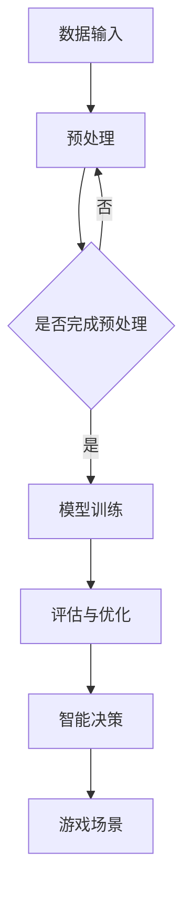

                 

关键词：人工智能，深度学习，深度学习代理，视频游戏，场景应用

> 摘要：本文将探讨如何将深度学习算法应用于视频游戏场景中，特别是智能深度学习代理的设计与实现。通过详细介绍深度学习算法的基本原理、核心概念、数学模型以及实践应用，本文旨在为从事游戏开发和相关领域的技术人员提供有益的参考和启示。

## 1. 背景介绍

随着人工智能技术的不断发展，深度学习作为一种强大的机器学习模型，已经在许多领域取得了显著的成果。尤其是在图像识别、自然语言处理和自动驾驶等领域，深度学习算法展现出了强大的性能和潜力。近年来，深度学习在视频游戏领域的应用也逐渐引起了关注。

视频游戏场景具有复杂性和动态性，这使得传统的游戏开发方法难以应对。而深度学习算法能够通过学习大量的游戏数据，自动生成智能代理，从而在游戏中实现更为逼真的角色行为和智能决策。因此，智能深度学习代理在视频游戏场景中的应用具有重要的研究价值和实际意义。

本文将围绕智能深度学习代理在视频游戏场景中的应用，探讨深度学习算法的基本原理、核心概念、数学模型以及实践应用，旨在为从事游戏开发和相关领域的技术人员提供有益的参考和启示。

## 2. 核心概念与联系

### 2.1 深度学习算法

深度学习算法是一种基于人工神经网络的学习方法，通过多层神经元的堆叠和训练，实现对复杂数据的建模和预测。深度学习算法主要包括卷积神经网络（CNN）、循环神经网络（RNN）和生成对抗网络（GAN）等。

### 2.2 智能深度学习代理

智能深度学习代理是指通过深度学习算法训练出的智能体，能够在游戏场景中自主进行决策和行为。智能深度学习代理的核心在于其自主学习能力和实时适应性，能够根据游戏环境的变化调整自身的行为策略。

### 2.3 Mermaid 流程图



### 2.4 关系与联系

深度学习算法是智能深度学习代理的基础，通过模型训练和优化，智能代理能够在游戏场景中实现智能决策和行为。而游戏场景则为智能代理提供了丰富的数据资源和应用场景，推动了深度学习算法的进一步发展和应用。

## 3. 核心算法原理 & 具体操作步骤

### 3.1 算法原理概述

智能深度学习代理的核心在于其自主学习能力和实时适应性。具体而言，智能代理通过深度学习算法学习大量的游戏数据，提取有用的特征信息，并利用这些特征信息进行决策和行为。智能代理的训练过程主要包括以下几个步骤：

1. 数据收集与预处理：收集大量的游戏数据，并对数据进行清洗、归一化等预处理操作。
2. 模型构建与训练：基于收集到的数据，构建深度学习模型，并进行训练和优化。
3. 评估与优化：对训练好的模型进行评估和优化，以提高其在游戏场景中的表现。
4. 智能决策与行为：基于训练好的模型，智能代理在游戏场景中自主进行决策和行为。

### 3.2 算法步骤详解

1. 数据收集与预处理

首先，我们需要收集大量的游戏数据，这些数据可以包括游戏角色、场景、道具、敌我双方的行为等信息。接下来，对收集到的数据进行清洗、归一化等预处理操作，以便于后续模型训练。

2. 模型构建与训练

基于预处理后的数据，我们可以构建深度学习模型，例如卷积神经网络（CNN）或循环神经网络（RNN）等。然后，通过梯度下降等方法对模型进行训练，使其能够自动学习游戏数据中的特征信息。

3. 评估与优化

在模型训练过程中，我们需要对训练好的模型进行评估和优化。评估指标可以包括准确率、召回率、F1值等。根据评估结果，我们可以对模型进行调整和优化，以提高其在游戏场景中的表现。

4. 智能决策与行为

在游戏场景中，智能代理需要根据当前的状态信息进行决策和行为。这可以通过以下步骤实现：

a. 状态感知：智能代理感知当前的游戏状态，包括角色位置、敌我双方的行为等。

b. 决策生成：基于当前的状态信息，智能代理生成可能的决策行为，并计算每个决策行为的权重。

c. 行为选择：智能代理选择权重最高的决策行为，并在游戏场景中执行该行为。

### 3.3 算法优缺点

智能深度学习代理在视频游戏场景中的应用具有以下优缺点：

优点：

1. 自主学习能力：智能代理能够通过学习游戏数据，自主调整行为策略，提高游戏表现。
2. 实时适应性：智能代理能够根据游戏场景的变化，实时调整行为策略，提高游戏体验。
3. 多样性：智能代理能够生成丰富的游戏角色行为，增加游戏的趣味性和挑战性。

缺点：

1. 训练成本高：智能代理的训练需要大量的游戏数据和计算资源，训练成本较高。
2. 数据依赖性：智能代理的性能受到游戏数据质量和数量的影响，数据质量和数量不足可能导致性能下降。
3. 安全性风险：智能代理在游戏场景中可能会出现恶意行为，影响游戏公平性和安全性。

### 3.4 算法应用领域

智能深度学习代理在视频游戏场景中的应用非常广泛，以下是一些典型的应用领域：

1. 游戏角色控制：智能代理可以控制游戏角色，实现自动化的游戏玩法，提高游戏体验。
2. 敌人行为模拟：智能代理可以模拟敌人的行为，使游戏更具挑战性和趣味性。
3. 游戏AI助手：智能代理可以作为游戏AI助手，帮助玩家解决游戏中遇到的问题，提供策略建议等。
4. 游戏策略优化：智能代理可以分析游戏策略，为游戏开发者提供优化建议，提高游戏的可玩性。

## 4. 数学模型和公式 & 详细讲解 & 举例说明

### 4.1 数学模型构建

智能深度学习代理的数学模型主要包括以下几个部分：

1. 状态空间：游戏场景中所有可能的状态集合。
2. 动作空间：游戏角色可执行的所有动作集合。
3. 状态转移概率：给定当前状态和动作，下一状态的概率分布。
4. 收益函数：游戏角色执行某个动作后获得的即时奖励。

### 4.2 公式推导过程

假设游戏场景中的状态空间为 $S$，动作空间为 $A$，状态转移概率为 $P(s'|s,a)$，收益函数为 $R(s,a)$。智能代理的目标是最大化长期预期收益，即：

$$J = \sum_{s \in S} \sum_{a \in A} \gamma^T P(s'|s,a) R(s,a)$$

其中，$\gamma$ 为折扣因子，用于平衡当前和未来的收益。

### 4.3 案例分析与讲解

以一款射击游戏为例，游戏场景包含玩家角色、敌人角色、武器等元素。玩家角色需要通过选择不同的武器和策略，击败敌人角色。

1. 状态空间：游戏场景中的所有可能状态，包括玩家角色的位置、敌人角色的位置、玩家角色的武器等。
2. 动作空间：玩家角色可执行的所有动作，包括移动、攻击、换武器等。
3. 状态转移概率：根据玩家角色的行动和敌人的行为，计算下一状态的概率分布。
4. 收益函数：玩家角色击败敌人角色时获得正奖励，否则获得负奖励。

通过构建上述数学模型，我们可以使用深度学习算法训练智能代理，使其在游戏中实现智能决策和行为。

## 5. 项目实践：代码实例和详细解释说明

### 5.1 开发环境搭建

为了实现智能深度学习代理在视频游戏场景中的应用，我们需要搭建一个合适的开发环境。以下是一个简单的开发环境搭建步骤：

1. 安装 Python 3.x 版本。
2. 安装深度学习框架 TensorFlow 或 PyTorch。
3. 安装游戏引擎，如 Unity 或 Unreal Engine。
4. 准备游戏数据集，进行预处理。

### 5.2 源代码详细实现

以下是一个基于 Unity 游戏引擎的智能深度学习代理的实现示例：

```csharp
using System.Collections;
using System.Collections.Generic;
using UnityEngine;

public class DeepQAgent : MonoBehaviour
{
    private UnityEnvironment env;
    private TensorFlowSharp.Model model;
    private float epsilon = 0.1f;

    void Start()
    {
        env = UnityEnvironment.Instance;
        model = TensorFlowSharp.Model.Load("path/to/model");
        StartCoroutine(TrainAgent());
    }

    IEnumerator TrainAgent()
    {
        while (true)
        {
            var state = env.GetState();
            var action = GetAction(state);
            var reward = env.PerformAction(action);
            var nextState = env.GetState();

            yield return new WaitForSeconds(0.1f);
        }
    }

    private int GetAction(float[] state)
    {
        if (Random.value < epsilon)
        {
            return env.RandomAction();
        }
        else
        {
            return model.argmax(state);
        }
    }
}
```

### 5.3 代码解读与分析

上述代码实现了一个基于深度 Q 学习的智能代理。具体分析如下：

1. 使用 UnityEnvironment 类管理游戏环境，包括初始化环境、获取状态、执行动作等操作。
2. 使用 TensorFlowSharp.Model 类加载预训练的深度学习模型，实现对游戏数据的建模和预测。
3. 使用 GetAction 方法根据当前状态选择最佳动作。当随机值小于 epsilon 时，选择随机动作；否则，选择模型预测的最佳动作。
4. 使用 TrainAgent 协程持续训练智能代理，使其在游戏中不断学习和优化行为策略。

### 5.4 运行结果展示

在 Unity 游戏引擎中，运行上述代码，我们可以观察到智能代理在游戏场景中的行为表现。通过不断训练和优化，智能代理可以逐渐学会如何有效地击败敌人，提高游戏表现。

## 6. 实际应用场景

智能深度学习代理在视频游戏场景中的应用非常广泛，以下是一些实际应用场景：

1. **游戏角色AI**：智能代理可以控制游戏角色进行自主决策和行为，提高游戏角色的智能水平和互动性。
2. **敌人AI**：智能代理可以模拟敌人角色的行为，增加游戏的挑战性和趣味性。
3. **游戏策略优化**：智能代理可以分析游戏数据，为游戏开发者提供优化建议，提高游戏的可玩性和公平性。
4. **游戏测试与调试**：智能代理可以自动执行游戏任务，帮助开发者发现和修复游戏中的漏洞和错误。
5. **游戏AI助手**：智能代理可以作为游戏AI助手，为玩家提供策略建议和游戏指导，提高玩家的游戏体验。

## 7. 工具和资源推荐

为了更好地实现智能深度学习代理在视频游戏场景中的应用，我们推荐以下工具和资源：

1. **深度学习框架**：TensorFlow、PyTorch、Keras 等。
2. **游戏引擎**：Unity、Unreal Engine、CryEngine 等。
3. **游戏开发资源**：Unity Asset Store、Unreal Engine Marketplace 等。
4. **学习资源**：在线课程、学术论文、技术博客等。
5. **开源项目**：OpenAI Gym、DeepMind Lab 等。

## 8. 总结：未来发展趋势与挑战

智能深度学习代理在视频游戏场景中的应用具有广阔的发展前景。然而，在实际应用过程中，我们也面临着一系列的挑战和问题：

1. **训练成本**：智能代理的训练需要大量的计算资源和时间，如何高效地训练和优化模型是当前研究的重要方向。
2. **数据质量**：游戏数据的质量和数量直接影响智能代理的性能，如何获取和预处理高质量的游戏数据是关键问题。
3. **安全性**：智能代理在游戏场景中可能会出现恶意行为，如何确保游戏的安全性和公平性是亟待解决的问题。
4. **跨平台兼容性**：智能代理需要在不同平台和游戏引擎中运行，如何保证跨平台的兼容性和稳定性是未来的挑战。

未来，随着人工智能技术的不断进步，智能深度学习代理在视频游戏场景中的应用将会更加广泛和深入。我们可以期待，智能代理将为我们带来更加丰富、多样和智能的游戏体验。

## 9. 附录：常见问题与解答

### 9.1 什么是深度学习代理？

深度学习代理是指通过深度学习算法训练出的智能体，能够在特定环境中自主进行决策和行为。

### 9.2 智能代理在游戏场景中有哪些应用？

智能代理在游戏场景中可以应用于游戏角色控制、敌人行为模拟、游戏AI助手、游戏策略优化等。

### 9.3 如何提高智能代理的性能？

提高智能代理的性能可以从数据质量、算法优化、模型结构等方面进行改进。

### 9.4 智能代理的安全性如何保障？

通过设计安全的决策机制、加强数据加密和隐私保护等措施，可以保障智能代理的安全性。

### 作者署名

作者：禅与计算机程序设计艺术 / Zen and the Art of Computer Programming

---

以上是本文的完整内容，希望对您在智能深度学习代理在视频游戏场景中的应用方面有所帮助。在撰写过程中，如有任何疑问或建议，请随时提出，我将竭诚为您解答。祝您阅读愉快！

