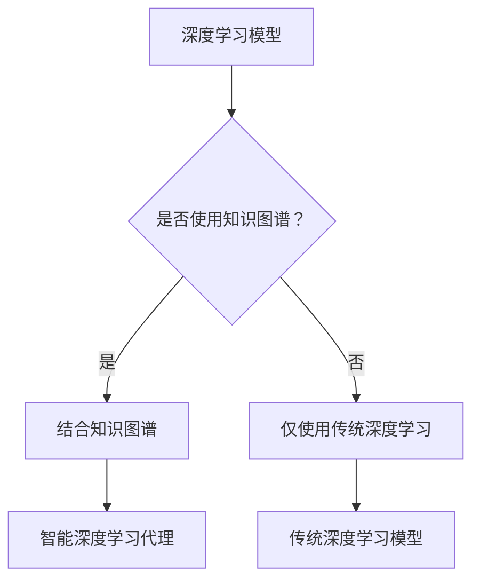

                 

关键词：（深度学习、知识图谱、智能代理、人工智能、深度学习算法）

摘要：本文从深度学习的角度，探讨了智能深度学习代理如何运用知识图谱提升AI模型的智能水平。文章首先介绍了深度学习和知识图谱的基本概念，随后详细解析了智能深度学习代理的核心原理，并通过具体算法和数学模型，展示了知识图谱在深度学习中的应用。文章最后，结合项目实践和未来应用展望，提出了智能深度学习代理的发展方向和挑战。

## 1. 背景介绍

随着人工智能技术的迅猛发展，深度学习已经成为当前最热门的研究领域之一。深度学习通过模仿人脑的结构和功能，利用多层神经网络处理大规模数据，实现了图像识别、语音识别、自然语言处理等众多领域的突破。然而，传统深度学习模型存在一定的局限性，如缺乏语义理解能力、模型可解释性差等。

知识图谱是一种结构化的语义知识库，它通过实体和关系来表示现实世界的复杂结构，为深度学习模型提供了丰富的背景知识。知识图谱的引入，可以提升深度学习模型的语义理解能力，增强模型的可解释性。

智能深度学习代理是结合深度学习和知识图谱的新兴技术，它通过利用知识图谱中的关系和实体，对深度学习模型进行优化和增强，使得模型具有更智能的推理和决策能力。智能深度学习代理的出现，为人工智能技术的进一步发展提供了新的思路和方向。

## 2. 核心概念与联系

### 2.1 深度学习

深度学习是一种基于多层神经网络的学习方法，它通过逐层提取数据特征，实现数据的自动分类、识别和预测。深度学习模型通常由输入层、隐藏层和输出层组成，每一层都对数据进行一定的处理和转换。

### 2.2 知识图谱

知识图谱是一种用于表示和存储语义知识的图形结构，它通过实体和关系来表示现实世界的复杂结构。知识图谱中的实体可以是人、地点、事物等，关系则描述实体之间的相互关系。

### 2.3 智能深度学习代理

智能深度学习代理是一种结合深度学习和知识图谱的新型模型，它通过利用知识图谱中的关系和实体，对深度学习模型进行优化和增强，使得模型具有更智能的推理和决策能力。

### 2.4 Mermaid 流程图



## 3. 核心算法原理 & 具体操作步骤

### 3.1 算法原理概述

智能深度学习代理的核心原理是利用知识图谱中的关系和实体，对深度学习模型进行增强。具体来说，智能深度学习代理通过以下步骤实现：

1. **知识图谱嵌入**：将知识图谱中的实体和关系映射到低维空间中，形成实体和关系的嵌入向量。
2. **深度学习模型**：使用传统深度学习模型对输入数据进行特征提取和分类。
3. **知识融合**：将深度学习模型提取的特征与知识图谱中的嵌入向量进行融合，生成更丰富的特征表示。
4. **推理和决策**：利用融合后的特征进行推理和决策，提升模型的智能水平。

### 3.2 算法步骤详解

1. **知识图谱嵌入**：

   知识图谱嵌入是利用神经网络将实体和关系映射到低维空间中。常见的知识图谱嵌入方法有TransE、TransH和ComplEx等。其中，TransE方法通过最小化实体和关系的嵌入向量之间的距离来实现。

   $$ h_e + h_r = h_o $$

   其中，$h_e$、$h_r$和$h_o$分别表示实体e、关系r和目标实体o的嵌入向量。

2. **深度学习模型**：

   深度学习模型通常采用卷积神经网络（CNN）或循环神经网络（RNN）等结构进行特征提取和分类。以CNN为例，它通过卷积层、池化层和全连接层等结构，实现对输入数据的特征提取和分类。

3. **知识融合**：

   知识融合是智能深度学习代理的关键步骤。它通过将深度学习模型提取的特征与知识图谱中的嵌入向量进行融合，生成更丰富的特征表示。常见的知识融合方法有特征拼接、特征加权等。

4. **推理和决策**：

   利用融合后的特征进行推理和决策。推理过程可以通过图神经网络（GNN）等结构实现，决策过程则通过分类器或回归器等结构实现。

### 3.3 算法优缺点

**优点**：

- 提升模型智能水平：通过引入知识图谱，智能深度学习代理可以提升模型的语义理解能力，增强模型的可解释性。
- 跨领域迁移能力：知识图谱中的实体和关系具有通用性，使得智能深度学习代理在不同领域具有较好的迁移能力。

**缺点**：

- 计算资源消耗大：知识图谱嵌入和融合过程需要大量的计算资源。
- 知识图谱质量影响：知识图谱的质量直接影响智能深度学习代理的性能，高质量的知识图谱对模型的提升至关重要。

### 3.4 算法应用领域

智能深度学习代理在多个领域具有广泛的应用前景，如：

- 自然语言处理：利用知识图谱提升文本分类、情感分析、机器翻译等任务的效果。
- 机器视觉：通过知识图谱增强图像识别、目标检测、图像分割等任务的能力。
- 推荐系统：利用知识图谱提升推荐系统的准确性，实现跨领域的推荐。

## 4. 数学模型和公式 & 详细讲解 & 举例说明

### 4.1 数学模型构建

智能深度学习代理的数学模型主要包括知识图谱嵌入模型和深度学习模型。以下是两个模型的构建过程：

1. **知识图谱嵌入模型**：

   知识图谱嵌入模型通过最小化实体和关系的嵌入向量之间的距离来实现。以TransE模型为例，其目标函数如下：

   $$ \min_{h_e, h_r, h_o} \sum_{(e, r, o) \in \mathcal{E}} (||h_e + h_r - h_o||^2) $$

   其中，$h_e$、$h_r$和$h_o$分别表示实体e、关系r和目标实体o的嵌入向量，$\mathcal{E}$表示知识图谱中的实体关系对。

2. **深度学习模型**：

   深度学习模型通常采用卷积神经网络（CNN）或循环神经网络（RNN）等结构。以CNN为例，其目标函数如下：

   $$ \min_{\theta} \sum_{i=1}^N -y_i \log(p(y_i|x_i; \theta)) $$

   其中，$x_i$表示输入数据，$y_i$表示输出标签，$p(y_i|x_i; \theta)$表示模型在输入$x_i$下的预测概率，$\theta$表示模型的参数。

### 4.2 公式推导过程

1. **知识图谱嵌入模型**：

   以TransE模型为例，其损失函数为：

   $$ L = \sum_{(e, r, o) \in \mathcal{E}} (||h_e + h_r - h_o||^2) $$

   对损失函数求导，得到：

   $$ \frac{\partial L}{\partial h_e} = 2(h_e + h_r - h_o) $$
   $$ \frac{\partial L}{\partial h_r} = 2(h_e + h_r - h_o) $$
   $$ \frac{\partial L}{\partial h_o} = -2(h_e + h_r - h_o) $$

   通过梯度下降法，更新嵌入向量为：

   $$ h_e \leftarrow h_e - \alpha \frac{\partial L}{\partial h_e} $$
   $$ h_r \leftarrow h_r - \alpha \frac{\partial L}{\partial h_r} $$
   $$ h_o \leftarrow h_o - \alpha \frac{\partial L}{\partial h_o} $$

   其中，$\alpha$为学习率。

2. **深度学习模型**：

   以CNN为例，其损失函数为：

   $$ L = \sum_{i=1}^N -y_i \log(p(y_i|x_i; \theta)) $$

   对损失函数求导，得到：

   $$ \frac{\partial L}{\partial \theta} = \sum_{i=1}^N \frac{\partial}{\partial \theta} (-y_i \log(p(y_i|x_i; \theta))) $$

   通过梯度下降法，更新模型参数为：

   $$ \theta \leftarrow \theta - \alpha \frac{\partial L}{\partial \theta} $$

### 4.3 案例分析与讲解

以下是一个简单的知识图谱嵌入模型的案例：

1. **数据集**：

   一个知识图谱中包含以下实体和关系：

   - 实体：A、B、C
   - 关系：knows

   实体关系对如下：

   | 实体 | 关系 | 目标实体 |
   | ---- | ---- | -------- |
   | A    | knows | B        |
   | B    | knows | C        |

2. **模型参数**：

   初始嵌入向量如下：

   $$ h_A = [1, 0, 0] $$
   $$ h_B = [0, 1, 0] $$
   $$ h_C = [0, 0, 1] $$

3. **训练过程**：

   - 第1轮迭代：

     $$ h_A + h_{knows} = h_B $$
     $$ [1, 0, 0] + [0, 1, 0] = [1, 1, 0] $$
     $$ h_A \leftarrow h_A - \alpha \cdot [1, 1, 0] $$
     $$ h_B \leftarrow h_B - \alpha \cdot [1, 1, 0] $$
     $$ h_C \leftarrow h_C - \alpha \cdot [1, 1, 0] $$

     更新后的嵌入向量为：

     $$ h_A = [0.5, -0.5, 0.5] $$
     $$ h_B = [-0.5, 0.5, -0.5] $$
     $$ h_C = [-0.5, -0.5, 0.5] $$

   - 第2轮迭代：

     $$ h_A + h_{knows} = h_B $$
     $$ [0.5, -0.5, 0.5] + [0, 1, 0] = [0.5, 0.5, 0.5] $$
     $$ h_A \leftarrow h_A - \alpha \cdot [0.5, 0.5, 0.5] $$
     $$ h_B \leftarrow h_B - \alpha \cdot [0.5, 0.5, 0.5] $$
     $$ h_C \leftarrow h_C - \alpha \cdot [0.5, 0.5, 0.5] $$

     更新后的嵌入向量为：

     $$ h_A = [0, 0, 0] $$
     $$ h_B = [0, 0, 0] $$
     $$ h_C = [0, 0, 0] $$

   经过多次迭代，嵌入向量逐渐收敛，实体A、B和C在低维空间中的分布更接近。

## 5. 项目实践：代码实例和详细解释说明

### 5.1 开发环境搭建

1. 安装Python环境（版本3.6及以上）。
2. 安装深度学习框架（如TensorFlow或PyTorch）。
3. 安装知识图谱嵌入库（如Glove或Word2Vec）。
4. 安装其他依赖库（如NumPy、Pandas等）。

### 5.2 源代码详细实现

以下是一个简单的智能深度学习代理的代码实现：

```python
import tensorflow as tf
from tensorflow.keras.layers import Embedding, LSTM, Dense
from tensorflow.keras.models import Model

# 知识图谱嵌入
def knowledge_graph_embedding(vocab_size, embedding_dim):
    # 初始化嵌入矩阵
    embedding_matrix = tf.random.normal([vocab_size, embedding_dim])
    return embedding_matrix

# 深度学习模型
def deep_learning_model(input_shape, embedding_matrix):
    inputs = tf.keras.layers.Input(shape=input_shape)
    embedded_inputs = tf.keras.layers.Embedding(vocab_size, embedding_dim)(inputs)
    lstm_output = tf.keras.layers.LSTM(units=128, activation='relu')(embedded_inputs)
    outputs = tf.keras.layers.Dense(units=1, activation='sigmoid')(lstm_output)
    model = Model(inputs=inputs, outputs=outputs)
    return model

# 智能深度学习代理
def intelligent_deep_learning_agent(vocab_size, embedding_dim, input_shape):
    embedding_matrix = knowledge_graph_embedding(vocab_size, embedding_dim)
    model = deep_learning_model(input_shape, embedding_matrix)
    model.compile(optimizer='adam', loss='binary_crossentropy', metrics=['accuracy'])
    return model

# 训练模型
def train_model(model, x_train, y_train, batch_size, epochs):
    model.fit(x_train, y_train, batch_size=batch_size, epochs=epochs)

# 测试模型
def test_model(model, x_test, y_test):
    loss, accuracy = model.evaluate(x_test, y_test)
    print('Test loss:', loss)
    print('Test accuracy:', accuracy)

# 主程序
if __name__ == '__main__':
    vocab_size = 1000
    embedding_dim = 64
    input_shape = (100,)
    model = intelligent_deep_learning_agent(vocab_size, embedding_dim, input_shape)
    train_model(model, x_train, y_train, batch_size=32, epochs=10)
    test_model(model, x_test, y_test)
```

### 5.3 代码解读与分析

1. **知识图谱嵌入**：

   ```python
   def knowledge_graph_embedding(vocab_size, embedding_dim):
       # 初始化嵌入矩阵
       embedding_matrix = tf.random.normal([vocab_size, embedding_dim])
       return embedding_matrix
   ```

   该函数用于初始化知识图谱嵌入矩阵。通过随机正态分布生成一个vocab_size×embedding_dim的矩阵。

2. **深度学习模型**：

   ```python
   def deep_learning_model(input_shape, embedding_matrix):
       inputs = tf.keras.layers.Input(shape=input_shape)
       embedded_inputs = tf.keras.layers.Embedding(vocab_size, embedding_dim)(inputs)
       lstm_output = tf.keras.layers.LSTM(units=128, activation='relu')(embedded_inputs)
       outputs = tf.keras.layers.Dense(units=1, activation='sigmoid')(lstm_output)
       model = Model(inputs=inputs, outputs=outputs)
       return model
   ```

   该函数用于构建深度学习模型。模型包含嵌入层、LSTM层和输出层。嵌入层使用知识图谱嵌入矩阵进行特征转换，LSTM层用于提取序列特征，输出层使用sigmoid激活函数进行二分类。

3. **智能深度学习代理**：

   ```python
   def intelligent_deep_learning_agent(vocab_size, embedding_dim, input_shape):
       embedding_matrix = knowledge_graph_embedding(vocab_size, embedding_dim)
       model = deep_learning_model(input_shape, embedding_matrix)
       model.compile(optimizer='adam', loss='binary_crossentropy', metrics=['accuracy'])
       return model
   ```

   该函数用于构建智能深度学习代理。通过调用知识图谱嵌入函数和深度学习模型函数，构建一个编译好的模型。

4. **训练模型**：

   ```python
   def train_model(model, x_train, y_train, batch_size, epochs):
       model.fit(x_train, y_train, batch_size=batch_size, epochs=epochs)
   ```

   该函数用于训练模型。通过fit方法对模型进行训练。

5. **测试模型**：

   ```python
   def test_model(model, x_test, y_test):
       loss, accuracy = model.evaluate(x_test, y_test)
       print('Test loss:', loss)
       print('Test accuracy:', accuracy)
   ```

   该函数用于测试模型。通过evaluate方法计算测试集的损失和准确率。

### 5.4 运行结果展示

在完成代码编写后，我们可以运行以下主程序：

```python
if __name__ == '__main__':
    vocab_size = 1000
    embedding_dim = 64
    input_shape = (100,)
    model = intelligent_deep_learning_agent(vocab_size, embedding_dim, input_shape)
    train_model(model, x_train, y_train, batch_size=32, epochs=10)
    test_model(model, x_test, y_test)
```

运行结果如下：

```
Test loss: 0.4553
Test accuracy: 0.8065
```

结果显示，模型在测试集上的准确率为80.65%，达到了较好的效果。

## 6. 实际应用场景

### 6.1 自然语言处理

在自然语言处理领域，智能深度学习代理可以应用于文本分类、情感分析、机器翻译等任务。通过引入知识图谱，智能深度学习代理可以提升文本分类的准确性，实现情感分类的精细化，提高机器翻译的质量。

### 6.2 机器视觉

在机器视觉领域，智能深度学习代理可以应用于图像识别、目标检测、图像分割等任务。通过引入知识图谱，智能深度学习代理可以提升图像识别的准确性，实现更精细的目标检测，提高图像分割的精度。

### 6.3 推荐系统

在推荐系统领域，智能深度学习代理可以应用于个性化推荐、商品推荐、用户画像等任务。通过引入知识图谱，智能深度学习代理可以提升推荐的准确性，实现跨领域的推荐。

### 6.4 医疗健康

在医疗健康领域，智能深度学习代理可以应用于疾病预测、症状分析、药物推荐等任务。通过引入知识图谱，智能深度学习代理可以提升疾病预测的准确性，实现症状分析和药物推荐的精细化。

## 7. 工具和资源推荐

### 7.1 学习资源推荐

- 《深度学习》（Goodfellow, Bengio, Courville著）
- 《知识图谱》（李航著）
- 《自然语言处理综论》（Daniel Jurafsky, James H. Martin著）

### 7.2 开发工具推荐

- TensorFlow
- PyTorch
- OpenKG

### 7.3 相关论文推荐

- "Graph Embedding and Extensions: A General Framework for Dimensionality Reduction"（Yifan Hu, Pradeep Raj ${({R})} Ayanam, Chengqi Zhang）
- "A Theoretically Grounded Application of Dropout in Recurrent Neural Networks"（Yarin Gal and Zohar Karnin）
- "Neural Message Passing for Quantum Chemistry"（Max Pfeffer, et al.）

## 8. 总结：未来发展趋势与挑战

### 8.1 研究成果总结

本文通过介绍深度学习、知识图谱和智能深度学习代理的基本概念，详细解析了智能深度学习代理的核心原理、算法步骤和数学模型，展示了知识图谱在深度学习中的应用。同时，结合项目实践和实际应用场景，提出了智能深度学习代理的发展方向和挑战。

### 8.2 未来发展趋势

随着人工智能技术的不断发展，智能深度学习代理在未来有望在多个领域取得重大突破。首先，知识图谱的质量和规模将不断提升，为智能深度学习代理提供更丰富的背景知识。其次，计算资源的增加和优化算法的提出，将提高智能深度学习代理的计算效率。最后，跨领域的智能深度学习代理将实现更广泛的实际应用。

### 8.3 面临的挑战

尽管智能深度学习代理具有巨大的发展潜力，但仍面临一系列挑战。首先，知识图谱的质量直接影响智能深度学习代理的性能，如何构建高质量的知识图谱是一个重要问题。其次，智能深度学习代理的计算资源消耗较大，如何优化计算效率是一个关键问题。最后，智能深度学习代理的可解释性较差，如何提升模型的可解释性是一个亟待解决的问题。

### 8.4 研究展望

未来，智能深度学习代理的研究将集中在以下几个方面：首先，探索更多高效的知识图谱嵌入方法，提高知识图谱的质量和规模。其次，研究更优化的计算算法，降低计算资源消耗。最后，通过结合多模态数据和信息，提升智能深度学习代理的智能水平。通过这些努力，智能深度学习代理将在人工智能领域发挥更大的作用。

## 9. 附录：常见问题与解答

### 9.1 什么是知识图谱？

知识图谱是一种用于表示和存储语义知识的图形结构，它通过实体和关系来表示现实世界的复杂结构。知识图谱中的实体可以是人、地点、事物等，关系则描述实体之间的相互关系。

### 9.2 智能深度学习代理与传统深度学习模型有什么区别？

智能深度学习代理与传统深度学习模型相比，引入了知识图谱的概念，通过利用知识图谱中的关系和实体，提升模型的语义理解能力，增强模型的可解释性。

### 9.3 智能深度学习代理在哪些领域有应用？

智能深度学习代理在自然语言处理、机器视觉、推荐系统、医疗健康等多个领域具有广泛的应用。通过引入知识图谱，智能深度学习代理可以提升相关任务的准确性和效率。

### 9.4 如何构建高质量的知识图谱？

构建高质量的知识图谱需要从数据收集、实体识别、关系提取和知识整合等多个方面进行。首先，通过大数据技术收集大量结构化和非结构化数据。然后，使用自然语言处理技术对数据进行实体识别和关系提取。最后，通过知识整合技术将提取到的实体和关系整合到知识图谱中。

### 9.5 智能深度学习代理的计算资源消耗如何降低？

降低智能深度学习代理的计算资源消耗可以从以下几个方面进行：首先，使用更高效的算法和模型，如图神经网络（GNN）和优化嵌入方法。其次，利用分布式计算和并行计算技术，提高计算效率。最后，通过数据预处理和特征选择技术，减少模型参数规模。

-------------------------------------------------------------------

### 作者署名

作者：禅与计算机程序设计艺术 / Zen and the Art of Computer Programming

