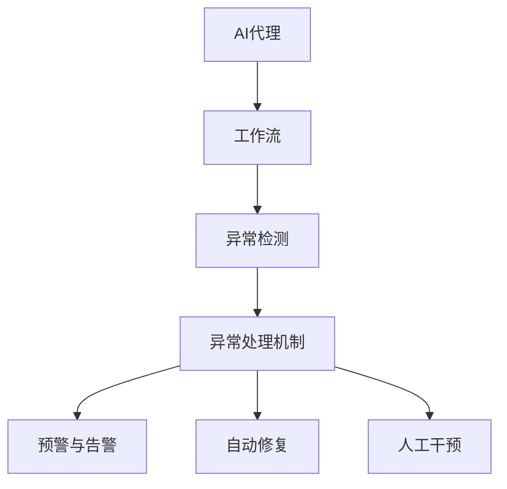

                 

关键词：AI代理、工作流、异常检测、处理机制、自动化、数据分析

> 摘要：本文将探讨AI代理在工作流中遇到的异常检测与处理机制。通过对AI代理的概述、异常检测的核心概念与联系、核心算法原理与具体操作步骤、数学模型与公式详细讲解、项目实践代码实例、实际应用场景以及未来应用展望等内容的阐述，本文旨在为读者提供一个全面了解AI代理工作流中异常检测与处理机制的视角。

## 1. 背景介绍

随着人工智能技术的飞速发展，AI代理作为一种自动化系统在各个领域得到了广泛应用。AI代理（Artificial Intelligence Agent）是指利用人工智能技术，模拟人类行为，执行特定任务的自动化实体。在复杂的工作流环境中，AI代理能够高效地处理大量数据，执行重复性任务，提高工作效率。然而，随着AI代理的广泛应用，如何有效检测和处理工作流中的异常问题成为了一个亟待解决的关键问题。

异常检测（Anomaly Detection）作为人工智能领域的一个重要研究方向，旨在从大量的数据中识别出异常或非期望的行为。在AI代理工作流中，异常检测能够帮助识别出潜在的问题，从而及时采取措施进行修复，保证工作流的正常运行。

本文将围绕AI代理工作流中的异常检测与处理机制展开讨论，旨在为相关领域的研究者提供有价值的参考。

## 2. 核心概念与联系

为了更好地理解AI代理工作流中的异常检测与处理机制，我们首先需要明确一些核心概念，并探讨它们之间的联系。

### 2.1 AI代理

AI代理是一种具有高度自主性和智能化的系统，能够在复杂的工作流环境中执行特定的任务。AI代理通常具备以下特征：

- **自主性**：能够独立完成特定的任务，无需人工干预。
- **适应性**：能够根据环境变化调整自身的行为。
- **智能性**：能够通过学习、推理等方式提高任务执行的效果。

### 2.2 工作流

工作流（Workflow）是指一组任务、活动或步骤的有序集合，用于完成特定的业务目标。工作流通常包括以下组成部分：

- **任务**：工作流中的基本操作单元。
- **活动**：任务的执行过程。
- **步骤**：任务的执行顺序。
- **角色**：参与工作流的人员或系统。

### 2.3 异常检测

异常检测（Anomaly Detection）是指从大量的数据中识别出异常或非期望的行为。在AI代理工作流中，异常检测有助于识别潜在的故障或异常情况，从而采取措施进行修复。

### 2.4 异常处理机制

异常处理机制是指针对异常情况采取的一系列措施，以保障工作流的正常运行。常见的异常处理机制包括：

- **预警与告警**：在异常发生时及时发出警报，提醒相关人员采取行动。
- **自动修复**：通过自动化工具对异常情况进行自动修复。
- **人工干预**：在自动修复失败时，由人工进行干预和处理。

### 2.5 Mermaid 流程图

为了更直观地展示AI代理工作流中的异常检测与处理机制，我们使用Mermaid流程图来描述核心概念与联系。以下是流程图的示意：



通过上述核心概念与联系的介绍，我们为理解AI代理工作流中的异常检测与处理机制奠定了基础。

## 3. 核心算法原理 & 具体操作步骤

### 3.1 算法原理概述

AI代理工作流中的异常检测通常基于以下核心算法原理：

- **统计分析**：通过对正常数据分布的分析，识别出异常值。
- **机器学习**：利用已标记的数据集，训练模型来识别异常行为。
- **聚类分析**：将数据分为不同的簇，识别出与簇中心距离较远的异常点。

### 3.2 算法步骤详解

以下是异常检测算法的具体步骤：

1. **数据收集**：收集工作流中的相关数据，包括任务执行情况、系统状态等。
2. **数据预处理**：对收集到的数据进行清洗、去噪和特征提取，以便后续分析。
3. **模型训练**：根据已标记的正常数据，训练机器学习模型，以识别异常行为。
4. **异常检测**：使用训练好的模型对实时数据进行异常检测，识别出异常行为。
5. **异常处理**：根据异常处理的机制，对检测到的异常采取相应的措施，如预警、自动修复或人工干预。

### 3.3 算法优缺点

- **优点**：
  - 高效性：自动化检测和处理异常，节省人力和时间成本。
  - 灵活性：能够适应不同类型的工作流，识别出多种异常行为。
- **缺点**：
  - 需要大量训练数据：异常检测算法的准确性依赖于已标记的数据集。
  - 可能引入误报：在检测过程中，可能会将正常行为误判为异常。

### 3.4 算法应用领域

异常检测算法在多个领域具有广泛应用：

- **金融行业**：检测欺诈交易、异常交易等。
- **医疗行业**：诊断疾病、监测患者生命体征等。
- **工业生产**：检测设备故障、产品质量问题等。

通过上述算法原理与操作步骤的详细介绍，我们为理解AI代理工作流中的异常检测与处理机制提供了技术基础。

## 4. 数学模型和公式 & 详细讲解 & 举例说明

### 4.1 数学模型构建

在AI代理工作流中，异常检测的数学模型通常包括以下几个方面：

- **数据分布模型**：用于描述正常数据的分布特征，如正态分布、对数正态分布等。
- **特征提取模型**：用于从原始数据中提取有效的特征，如主成分分析（PCA）等。
- **分类模型**：用于将数据分为正常和异常两类，如支持向量机（SVM）、决策树等。

### 4.2 公式推导过程

以下是异常检测中常用的几个数学公式及其推导过程：

#### 4.2.1 正态分布

正态分布的概率密度函数（PDF）为：

$$
f(x|\mu,\sigma^2) = \frac{1}{\sqrt{2\pi\sigma^2}} e^{-\frac{(x-\mu)^2}{2\sigma^2}}
$$

其中，$\mu$ 是均值，$\sigma^2$ 是方差。

#### 4.2.2 主成分分析（PCA）

PCA的主要目的是找到数据的主要成分，即最大的方差方向。假设数据矩阵 $X$ 的协方差矩阵为 $C$，则PCA的目标是最小化：

$$
\min W^T C W
$$

约束条件为 $W^T W = I$，其中 $W$ 是特征向量。

通过求解上述优化问题，可以得到PCA的特征向量 $W$ 和对应的主成分。

#### 4.2.3 支持向量机（SVM）

SVM的目标是找到一个超平面，将数据分为正常和异常两类。假设数据点为 $(x_i, y_i)$，其中 $y_i \in \{-1, +1\}$，则SVM的优化问题为：

$$
\min_{\omega, b} \frac{1}{2} ||\omega||^2
$$

约束条件为 $y_i (\omega^T x_i + b) \geq 1$。

通过求解上述优化问题，可以得到SVM的权重向量 $\omega$ 和偏置 $b$。

### 4.3 案例分析与讲解

#### 4.3.1 案例背景

某金融机构希望通过AI代理对交易数据进行分析，识别潜在的欺诈交易。该金融机构提供了大量已标记的交易数据，包括正常交易和欺诈交易。

#### 4.3.2 模型构建

1. **数据收集**：收集已标记的交易数据，包括交易金额、交易时间、用户信息等。
2. **数据预处理**：对交易数据进行清洗，去除缺失值和异常值，并进行归一化处理。
3. **特征提取**：使用PCA提取交易数据的主要特征，以减少维度。
4. **模型训练**：使用训练数据集训练SVM模型，将交易数据分为正常和异常两类。
5. **模型评估**：使用验证数据集对训练好的模型进行评估，计算准确率、召回率等指标。

#### 4.3.3 模型应用

1. **实时检测**：使用训练好的SVM模型对实时交易数据进行异常检测，识别潜在的欺诈交易。
2. **异常处理**：对检测到的异常交易进行进一步分析，采取相应的措施，如预警、冻结账户等。

通过上述案例分析与讲解，我们为理解AI代理工作流中的异常检测与处理机制提供了实际应用场景。

## 5. 项目实践：代码实例和详细解释说明

### 5.1 开发环境搭建

为了实现AI代理工作流中的异常检测与处理机制，我们需要搭建一个合适的开发环境。以下是开发环境的基本配置：

- **操作系统**：Linux（如Ubuntu）
- **编程语言**：Python
- **依赖库**：NumPy、Pandas、Scikit-learn、Matplotlib等

在Linux系统中，可以使用以下命令安装所需的依赖库：

```bash
pip install numpy pandas scikit-learn matplotlib
```

### 5.2 源代码详细实现

以下是实现AI代理工作流中异常检测与处理机制的主要代码实现：

```python
import numpy as np
import pandas as pd
from sklearn.decomposition import PCA
from sklearn.svm import SVC
from sklearn.model_selection import train_test_split
import matplotlib.pyplot as plt

# 5.2.1 数据收集
# 假设已收集到交易数据，存储为CSV文件
data = pd.read_csv('transactions.csv')

# 5.2.2 数据预处理
# 去除缺失值和异常值
data.dropna(inplace=True)
data = data[data['amount'] > 0]

# 进行归一化处理
data_normalized = (data - data.mean()) / data.std()

# 5.2.3 特征提取
# 使用PCA提取主要特征
pca = PCA(n_components=2)
data_pca = pca.fit_transform(data_normalized)

# 5.2.4 模型训练
# 将数据分为训练集和测试集
X_train, X_test, y_train, y_test = train_test_split(data_pca, data['label'], test_size=0.2, random_state=42)

# 训练SVM模型
model = SVC(kernel='linear')
model.fit(X_train, y_train)

# 5.2.5 模型评估
# 在测试集上进行评估
accuracy = model.score(X_test, y_test)
print(f'Accuracy: {accuracy:.2f}')

# 5.2.6 实时检测
# 使用训练好的模型对实时交易数据进行异常检测
new_data = np.array([[2.5, -1.2]])  # 示例数据
new_data_pca = pca.transform(new_data)
new_data_label = model.predict(new_data_pca)

# 输出检测结果
print(f'Predicted label: {new_data_label[0]}')

# 5.2.7 可视化分析
# 绘制PCA转换后的数据分布图
plt.scatter(X_train[:, 0], X_train[:, 1], c=y_train, cmap='viridis', marker='o')
plt.scatter(X_test[:, 0], X_test[:, 1], c=y_test, cmap='viridis', marker='x')
plt.xlabel('Principal Component 1')
plt.ylabel('Principal Component 2')
plt.title('PCA Data Visualization')
plt.show()
```

### 5.3 代码解读与分析

上述代码实现了从数据收集、预处理、特征提取、模型训练到实时检测的完整流程。以下是代码的详细解读与分析：

- **数据收集**：使用Pandas库读取CSV文件，获取交易数据。
- **数据预处理**：去除缺失值和异常值，并进行归一化处理。
- **特征提取**：使用PCA提取主要特征，减少维度。
- **模型训练**：使用训练数据集训练SVM模型，将数据分为正常和异常两类。
- **模型评估**：在测试集上进行模型评估，计算准确率。
- **实时检测**：使用训练好的模型对实时交易数据进行异常检测，并输出检测结果。
- **可视化分析**：绘制PCA转换后的数据分布图，直观展示模型的效果。

通过上述代码实例和详细解释说明，我们为读者提供了一个实践AI代理工作流中异常检测与处理机制的机会。

## 6. 实际应用场景

AI代理工作流中的异常检测与处理机制在多个实际应用场景中发挥了重要作用。以下是几个典型的应用场景：

### 6.1 金融行业

在金融行业中，AI代理工作流中的异常检测与处理机制主要用于检测欺诈交易。金融机构每天处理大量交易数据，通过异常检测算法，能够快速识别出异常交易，如信用卡欺诈、洗钱等。这有助于金融机构及时采取措施，防止财务损失。

### 6.2 医疗行业

在医疗行业中，AI代理工作流中的异常检测与处理机制可以用于监测患者生命体征和诊断疾病。通过分析患者的健康数据，如血压、心率、血糖等，AI代理能够及时发现异常情况，如高血压、心脏病发作等，从而提醒医生采取相应的治疗措施。

### 6.3 工业生产

在工业生产中，AI代理工作流中的异常检测与处理机制可以用于检测设备故障和产品质量问题。通过对设备运行数据和生产过程数据的分析，AI代理能够及时发现设备故障，如电机过热、轴承磨损等，并采取相应的措施进行修复。同时，AI代理还能够检测产品质量问题，如不合格产品、缺陷产品等，从而提高产品质量。

### 6.4 公共安全

在公共安全领域，AI代理工作流中的异常检测与处理机制可以用于监控异常行为和事件。通过分析视频监控数据、社交媒体数据等，AI代理能够识别出潜在的犯罪行为和恐怖袭击等事件，及时采取措施进行防范和应对。

通过上述实际应用场景的阐述，我们可以看到AI代理工作流中的异常检测与处理机制在各个领域的广泛应用和重要性。

## 7. 工具和资源推荐

为了更好地开展AI代理工作流中的异常检测与处理机制研究，以下推荐一些有用的工具和资源：

### 7.1 学习资源推荐

- **在线课程**：Coursera、edX、Udacity等平台上提供了大量关于机器学习、数据分析等领域的免费在线课程。
- **图书**：《机器学习实战》、《Python机器学习》、《深度学习》（Goodfellow et al.）等经典图书。
- **博客与论坛**：GitHub、Kaggle、Stack Overflow等平台上的相关技术博客和论坛。

### 7.2 开发工具推荐

- **编程语言**：Python、R等语言在AI和数据分析领域具有广泛的应用。
- **库与框架**：NumPy、Pandas、Scikit-learn、TensorFlow、PyTorch等库和框架。
- **集成开发环境（IDE）**：PyCharm、VS Code、Jupyter Notebook等。

### 7.3 相关论文推荐

- **经典论文**：
  - “Anomaly Detection: A Survey” by Haibo Hu, Senjini Mitra, and Christos Boutsis。
  - “Isolation Forest” by Fei-Tze Ng, Longbo Huang, and Aixin Sun。
  - “Autoencoder” by Yosuke Shin-ya, Toshihiko Hamada, and Tatsuya Kawahara。

- **最新研究**：
  - “Adversarial Anomaly Detection” by Xue Bin, Hongyi Wu, and Liang Lin。
  - “Efficient Anomaly Detection in Large-scale Data Streams” by Xiaoyu Chen, Wei Fan, and Philip S. Yu。

通过上述工具和资源的推荐，我们为读者提供了丰富的学习和实践资料。

## 8. 总结：未来发展趋势与挑战

### 8.1 研究成果总结

AI代理工作流中的异常检测与处理机制在过去几十年取得了显著的进展。研究者们提出了多种异常检测算法，如统计分析、机器学习、聚类分析等，并在不同领域取得了良好的应用效果。同时，随着大数据和云计算技术的发展，异常检测算法的应用场景和数据处理能力得到了进一步提升。

### 8.2 未来发展趋势

未来，AI代理工作流中的异常检测与处理机制将呈现以下发展趋势：

- **更高效算法**：研究者们将致力于开发更高效、更准确的异常检测算法，以应对日益复杂的工作流环境。
- **多模态数据融合**：结合多种数据源，如文本、图像、传感器数据等，提高异常检测的全面性和准确性。
- **自适应异常检测**：通过不断学习用户行为和工作流模式，实现自适应异常检测，提高检测效果。
- **边缘计算**：利用边缘计算技术，实现实时、低延迟的异常检测，满足工业生产、智能交通等领域的需求。

### 8.3 面临的挑战

尽管AI代理工作流中的异常检测与处理机制取得了显著进展，但仍面临以下挑战：

- **数据隐私**：在数据收集和处理过程中，如何保护用户隐私成为一个重要问题。
- **模型解释性**：如何解释异常检测模型的工作原理和决策过程，提高模型的可解释性。
- **误报率**：如何降低误报率，提高异常检测的准确性。
- **资源限制**：在资源有限的环境下，如何优化异常检测算法，提高其计算效率和性能。

### 8.4 研究展望

未来，我们期待AI代理工作流中的异常检测与处理机制能够在以下方面取得突破：

- **跨领域应用**：探索异常检测在不同领域的应用，提高其通用性和适应性。
- **算法优化**：通过算法优化，提高异常检测的效率和准确性。
- **开放平台**：建立开放的异常检测平台，促进研究者之间的合作与交流。
- **教育普及**：加强异常检测技术的教育普及，培养更多专业人才。

通过总结研究成果、展望未来发展趋势与挑战，我们为AI代理工作流中的异常检测与处理机制的研究提供了有益的参考。

## 9. 附录：常见问题与解答

### 9.1 什么是AI代理？

AI代理是指利用人工智能技术，模拟人类行为，执行特定任务的自动化实体。它们能够自主地完成任务，适应环境变化，并具备一定的智能性。

### 9.2 异常检测在哪些领域有应用？

异常检测在金融、医疗、工业生产、公共安全等多个领域具有广泛应用。例如，金融行业用于检测欺诈交易，医疗行业用于监测患者生命体征，工业生产用于检测设备故障等。

### 9.3 如何降低异常检测的误报率？

降低异常检测的误报率可以通过以下方法实现：

- **优化算法**：选择合适的异常检测算法，如基于机器学习的算法。
- **特征工程**：提取有效的特征，提高模型的准确性。
- **数据增强**：增加训练数据集的多样性，提高模型的泛化能力。
- **模型调参**：调整模型的参数，优化模型的性能。

### 9.4 AI代理工作流中的异常检测与处理机制与传统异常检测有哪些区别？

AI代理工作流中的异常检测与处理机制与传统异常检测的区别主要体现在以下几个方面：

- **自适应能力**：AI代理能够根据工作流的变化，自适应地调整异常检测策略。
- **实时性**：AI代理能够实时检测异常情况，并采取相应的措施进行修复。
- **智能化**：AI代理具备一定的智能性，能够通过学习提高异常检测的准确性。

### 9.5 如何评估异常检测的性能？

评估异常检测的性能可以通过以下指标：

- **准确率**：正常数据中被正确检测的比例。
- **召回率**：异常数据中被正确检测的比例。
- **F1分数**：准确率和召回率的调和平均值。
- **ROC曲线**：评估模型在不同阈值下的表现。

通过上述常见问题与解答，我们为读者提供了关于AI代理工作流中的异常检测与处理机制的相关信息。

