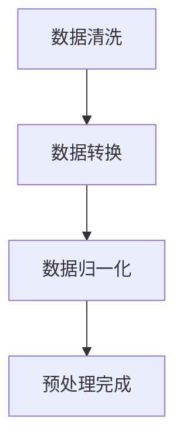

                 

关键词：AI代理、数据预处理、工作流管理、数据管理策略

摘要：随着人工智能技术的快速发展，AI代理在各个领域得到了广泛应用。数据预处理作为AI代理工作流中的重要环节，其质量和效率直接影响到模型的性能和训练结果。本文将深入探讨AI代理工作流中的数据预处理与管理策略，包括数据清洗、数据转换、数据归一化等，以期为AI代理的优化和应用提供有益的参考。

## 1. 背景介绍

人工智能（AI）作为当今最具前景的技术之一，已经深入到我们生活的方方面面。从智能助手到自动驾驶，从金融风控到医疗诊断，AI技术的应用正在不断扩展。而AI代理作为人工智能的重要组成部分，是智能系统的核心组成部分。AI代理通过模拟人类行为，实现自动化决策和任务执行。

在AI代理的工作流程中，数据预处理是至关重要的一环。数据预处理的好坏直接影响到后续模型的训练效果和预测准确性。因此，研究AI代理工作流中的数据预处理与管理策略具有重要的实际意义。

### 1.1 AI代理的定义与功能

AI代理是一种具有独立决策能力的软件实体，能够在复杂的动态环境中模拟人类行为，并执行特定的任务。AI代理通常由感知模块、决策模块和行动模块组成，通过感知外部环境，分析信息，做出决策，并执行相应的行动。

AI代理的功能主要包括以下几个方面：

1. **环境感知**：通过感知模块获取环境信息，如传感器数据、文本信息等。
2. **决策制定**：根据感知到的信息，利用决策模块进行分析和判断，制定行动策略。
3. **行动执行**：根据决策结果，执行相应的行动，如发送命令、调整参数等。

### 1.2 数据预处理在AI代理工作流中的作用

数据预处理是AI代理工作流中不可或缺的一环，其主要目的是提高数据质量，降低噪声干扰，从而提高模型训练效果和预测准确性。具体来说，数据预处理包括以下几个步骤：

1. **数据清洗**：去除数据中的噪声和异常值，确保数据的准确性。
2. **数据转换**：将不同类型的数据转换为统一的格式，便于后续处理。
3. **数据归一化**：将数据缩放到一个特定的范围，消除不同特征之间的量级差异。

### 1.3 数据预处理的重要性

在AI代理的应用过程中，数据预处理的重要性不言而喻。以下从三个方面阐述了数据预处理对AI代理工作流的影响：

1. **提高模型性能**：良好的数据预处理可以提高模型的学习效果，使模型更准确地捕捉数据中的规律。
2. **降低计算成本**：通过数据预处理，可以减少模型训练过程中需要处理的原始数据量，从而降低计算成本。
3. **提升用户体验**：准确的数据预处理能够提高AI代理的预测准确性和响应速度，提升用户体验。

## 2. 核心概念与联系

### 2.1 数据清洗

数据清洗是数据预处理的第一步，其目的是识别和纠正数据中的错误、异常和重复记录。数据清洗的方法包括：

1. **缺失值处理**：对于缺失值，可以采用填充、删除或插值等方法进行处理。
2. **异常值处理**：通过统计分析或业务逻辑判断，识别并处理异常值。
3. **重复值处理**：去除数据集中的重复记录。

### 2.2 数据转换

数据转换是指将不同类型的数据转换为统一的格式，以便进行后续处理。常见的转换方法包括：

1. **数据类型转换**：将字符串转换为数字、日期等。
2. **编码转换**：将不同的编码方式转换为统一的编码方式，如将ASCII码转换为UTF-8码。
3. **数据规范化**：将数据按照一定的规则进行规范化处理，如将货币金额转换为同一单位。

### 2.3 数据归一化

数据归一化是将数据缩放到一个特定的范围，以消除不同特征之间的量级差异。常见的归一化方法包括：

1. **最小-最大归一化**：将数据缩放到[0, 1]范围内。
2. **均值-标准差归一化**：将数据缩放到[-1, 1]范围内。
3. **小数归一化**：将数据缩放到[0, 1]范围内的一个小数点后的数字。

### 2.4 Mermaid 流程图

以下是一个描述数据预处理流程的 Mermaid 流程图：



## 3. 核心算法原理 & 具体操作步骤

### 3.1 算法原理概述

数据预处理算法主要涉及以下几个方面：

1. **数据清洗**：通过缺失值处理、异常值处理和重复值处理，确保数据的准确性。
2. **数据转换**：通过数据类型转换、编码转换和数据规范化，将不同类型的数据转换为统一的格式。
3. **数据归一化**：通过最小-最大归一化、均值-标准差归一化和小数归一化，消除不同特征之间的量级差异。

### 3.2 算法步骤详解

#### 3.2.1 数据清洗

1. **缺失值处理**：

   - 填充：采用平均值、中位数或最频繁值填充缺失值。
   - 删除：删除包含缺失值的记录。
   - 插值：根据时间序列或空间关系进行插值处理。

2. **异常值处理**：

   - 统计方法：通过计算统计指标，如标准差、四分位距等，识别异常值。
   - 业务逻辑：根据业务规则，判断并处理异常值。

3. **重复值处理**：

   - 去除重复记录：通过比较字段值，去除重复的记录。

#### 3.2.2 数据转换

1. **数据类型转换**：

   - 字符串转换为数字：使用 `str` 函数。
   - 日期转换为数字：使用 `date` 函数。
   - 其他类型转换：根据需求进行相应转换。

2. **编码转换**：

   - ASCII码转换为UTF-8码：使用 `encode` 函数。
   - UTF-8码转换为ASCII码：使用 `decode` 函数。

3. **数据规范化**：

   - 规则规范化：根据业务需求，制定规范化规则。
   - 数据规范化：按照规范化规则进行数据转换。

#### 3.2.3 数据归一化

1. **最小-最大归一化**：

   - 形式：$$y = \frac{x - x_{\min}}{x_{\max} - x_{\min}}$$
   - 说明：将数据缩放到[0, 1]范围内。

2. **均值-标准差归一化**：

   - 形式：$$y = \frac{x - \bar{x}}{\sigma}$$
   - 说明：将数据缩放到[-1, 1]范围内。

3. **小数归一化**：

   - 形式：$$y = x \times k$$
   - 说明：将数据缩放到[0, 1]范围内的一个小数点后的数字。

### 3.3 算法优缺点

#### 优点

- 提高数据质量，降低噪声干扰。
- 便于后续处理，提升模型性能。
- 降低计算成本，提升计算效率。

#### 缺点

- 数据预处理算法较为复杂，对计算资源要求较高。
- 部分算法可能引入信息损失，降低数据准确性。

### 3.4 算法应用领域

数据预处理算法广泛应用于各个领域，如：

- 机器学习：提高模型训练效果和预测准确性。
- 数据挖掘：挖掘数据中的有用信息。
- 自然语言处理：处理文本数据，提高文本质量。
- 计算机视觉：处理图像数据，提高图像质量。

## 4. 数学模型和公式 & 详细讲解 & 举例说明

### 4.1 数学模型构建

在数据预处理过程中，常用的数学模型包括缺失值处理模型、异常值处理模型和数据归一化模型。以下分别介绍这些模型的构建过程。

#### 4.1.1 缺失值处理模型

缺失值处理模型主要用于解决数据中的缺失值问题。常见的缺失值处理方法包括填充、删除和插值。以下是一个简单的填充模型：

$$
x_{\text{填充}} = \text{mean}(x) \quad \text{如果} \quad x \text{为缺失值}
$$

其中，$x$为数据中的某个特征值，$\text{mean}(x)$为该特征值的平均值。

#### 4.1.2 异常值处理模型

异常值处理模型主要用于识别和纠正数据中的异常值。常见的异常值处理方法包括统计方法和业务逻辑方法。以下是一个基于统计方法的异常值处理模型：

$$
x_{\text{异常}} = \text{median}(x) \quad \text{如果} \quad x \text{与} \text{median}(x) \text{的差值大于} \text{threshold}
$$

其中，$x$为数据中的某个特征值，$\text{median}(x)$为该特征值的中位数，$\text{threshold}$为设定的阈值。

#### 4.1.3 数据归一化模型

数据归一化模型主要用于将数据缩放到一个特定的范围，以消除不同特征之间的量级差异。常见的归一化方法包括最小-最大归一化、均值-标准差归一化和小数归一化。以下是一个最小-最大归一化模型：

$$
y = \frac{x - x_{\text{min}}}{x_{\text{max}} - x_{\text{min}}}
$$

其中，$x$为数据中的某个特征值，$x_{\text{min}}$和$x_{\text{max}}$分别为该特征值的最小值和最大值。

### 4.2 公式推导过程

在数据预处理过程中，一些数学公式的推导对于理解算法原理和实现过程至关重要。以下分别介绍缺失值处理、异常值处理和数据归一化的公式推导过程。

#### 4.2.1 缺失值处理

1. **平均值填充**：

   - 假设数据集$X = [x_1, x_2, \ldots, x_n]$中有缺失值$x_i$，则填充后的数据集$X_{\text{填充}} = [x_1', x_2', \ldots, x_n']$。
   - 公式推导：

     $$x_i' = \text{mean}(X) = \frac{1}{n-1} \sum_{j=1, j \neq i}^{n} x_j$$

2. **中位数填充**：

   - 假设数据集$X = [x_1, x_2, \ldots, x_n]$中有缺失值$x_i$，则填充后的数据集$X_{\text{填充}} = [x_1', x_2', \ldots, x_n']$。
   - 公式推导：

     $$x_i' = \text{median}(X) = \begin{cases} 
     \text{mean}(X) & \text{如果} \quad n \text{为偶数} \\
     x_{(n+1)/2} & \text{如果} \quad n \text{为奇数} 
     \end{cases}$$

3. **最频繁值填充**：

   - 假设数据集$X = [x_1, x_2, \ldots, x_n]$中有缺失值$x_i$，则填充后的数据集$X_{\text{填充}} = [x_1', x_2', \ldots, x_n']$。
   - 公式推导：

     $$x_i' = \text{mode}(X)$$

#### 4.2.2 异常值处理

1. **标准差法**：

   - 假设数据集$X = [x_1, x_2, \ldots, x_n]$中的异常值需要被处理，则处理后的数据集$X_{\text{处理}} = [x_1', x_2', \ldots, x_n']$。
   - 公式推导：

     $$x_i' = \begin{cases} 
     x_i & \text{如果} \quad |x_i - \text{mean}(X)| \leq \text{threshold} \\
     \text{mean}(X) & \text{如果} \quad |x_i - \text{mean}(X)| > \text{threshold} 
     \end{cases}$$

     其中，$\text{mean}(X)$为数据集$X$的平均值，$\text{threshold}$为设定的阈值。

2. **四分位距法**：

   - 假设数据集$X = [x_1, x_2, \ldots, x_n]$中的异常值需要被处理，则处理后的数据集$X_{\text{处理}} = [x_1', x_2', \ldots, x_n']$。
   - 公式推导：

     $$x_i' = \begin{cases} 
     x_i & \text{如果} \quad x_i \text{在} \quad Q_1 \text{和} \quad Q_3 \text{之间} \\
     \text{median}(X) & \text{如果} \quad x_i < Q_1 \text{或} \quad x_i > Q_3 
     \end{cases}$$

     其中，$Q_1$和$Q_3$分别为数据集$X$的第一四分位数和第三四分位数。

#### 4.2.3 数据归一化

1. **最小-最大归一化**：

   - 假设数据集$X = [x_1, x_2, \ldots, x_n]$需要被归一化，则归一化后的数据集$X_{\text{归一化}} = [y_1, y_2, \ldots, y_n]$。
   - 公式推导：

     $$y_i = \frac{x_i - x_{\text{min}}}{x_{\text{max}} - x_{\text{min}}}$$

     其中，$x_{\text{min}}$和$x_{\text{max}}$分别为数据集$X$的最小值和最大值。

2. **均值-标准差归一化**：

   - 假设数据集$X = [x_1, x_2, \ldots, x_n]$需要被归一化，则归一化后的数据集$X_{\text{归一化}} = [y_1, y_2, \ldots, y_n]$。
   - 公式推导：

     $$y_i = \frac{x_i - \text{mean}(X)}{\text{std}(X)}$$

     其中，$\text{mean}(X)$为数据集$X$的平均值，$\text{std}(X)$为数据集$X$的标准差。

3. **小数归一化**：

   - 假设数据集$X = [x_1, x_2, \ldots, x_n]$需要被归一化，则归一化后的数据集$X_{\text{归一化}} = [y_1, y_2, \ldots, y_n]$。
   - 公式推导：

     $$y_i = \frac{x_i - x_{\text{min}}}{x_{\text{max}} - x_{\text{min}}} \times k$$

     其中，$x_{\text{min}}$和$x_{\text{max}}$分别为数据集$X$的最小值和最大值，$k$为一个小于1的小数。

### 4.3 案例分析与讲解

#### 4.3.1 缺失值处理

假设有一个数据集$X = [10, 20, \text{缺失}, 40, 50]$，我们需要对其进行缺失值处理。

- **平均值填充**：

  $$x_3' = \text{mean}(X) = \frac{10 + 20 + \text{缺失} + 40 + 50}{5} = 30$$

- **中位数填充**：

  $$x_3' = \text{median}(X) = \frac{20 + 40}{2} = 30$$

- **最频繁值填充**：

  $$x_3' = \text{mode}(X) = 20$$

处理后，数据集变为$X' = [10, 20, 30, 40, 50]$。

#### 4.3.2 异常值处理

假设有一个数据集$X = [1, 2, 3, 100, 5, 6, 7, 800]$，我们需要对其进行异常值处理。

- **标准差法**：

  $$\text{mean}(X) = \frac{1 + 2 + 3 + 100 + 5 + 6 + 7 + 800}{8} = 164.375$$

  $$\text{std}(X) = \sqrt{\frac{(1 - 164.375)^2 + (2 - 164.375)^2 + (3 - 164.375)^2 + (100 - 164.375)^2 + (5 - 164.375)^2 + (6 - 164.375)^2 + (7 - 164.375)^2 + (800 - 164.375)^2}{8}} = 335.688$$

  $$x_4' = \text{mean}(X) = 164.375$$

  $$x_8' = \text{mean}(X) = 164.375$$

  处理后，数据集变为$X' = [1, 2, 3, 164.375, 5, 6, 7, 164.375]$。

- **四分位距法**：

  $$Q_1 = \text{median}([1, 2, 3, 5, 6]) = 3$$

  $$Q_3 = \text{median}([6, 7, 800]) = 7$$

  $$x_4' = 3$$

  $$x_8' = 7$$

  处理后，数据集变为$X' = [1, 2, 3, 3, 5, 6, 7, 7]$。

#### 4.3.3 数据归一化

假设有一个数据集$X = [1, 2, 3, 4, 5]$，我们需要对其进行归一化处理。

- **最小-最大归一化**：

  $$y_1 = \frac{1 - 1}{4 - 1} = 0$$

  $$y_2 = \frac{2 - 1}{4 - 1} = 0.25$$

  $$y_3 = \frac{3 - 1}{4 - 1} = 0.5$$

  $$y_4 = \frac{4 - 1}{4 - 1} = 0.75$$

  $$y_5 = \frac{5 - 1}{4 - 1} = 1$$

  处理后，数据集变为$X' = [0, 0.25, 0.5, 0.75, 1]$。

- **均值-标准差归一化**：

  $$\text{mean}(X) = \frac{1 + 2 + 3 + 4 + 5}{5} = 3$$

  $$\text{std}(X) = \sqrt{\frac{(1 - 3)^2 + (2 - 3)^2 + (3 - 3)^2 + (4 - 3)^2 + (5 - 3)^2}{5}} = 1.5811$$

  $$y_1 = \frac{1 - 3}{1.5811} = -1.5811$$

  $$y_2 = \frac{2 - 3}{1.5811} = -0.7811$$

  $$y_3 = \frac{3 - 3}{1.5811} = 0$$

  $$y_4 = \frac{4 - 3}{1.5811} = 0.322$$

  $$y_5 = \frac{5 - 3}{1.5811} = 1.5811$$

  处理后，数据集变为$X' = [-1.5811, -0.7811, 0, 0.322, 1.5811]$。

- **小数归一化**：

  $$y_1 = \frac{1 - 1}{4 - 1} \times 0.1 = 0$$

  $$y_2 = \frac{2 - 1}{4 - 1} \times 0.1 = 0.05$$

  $$y_3 = \frac{3 - 1}{4 - 1} \times 0.1 = 0.15$$

  $$y_4 = \frac{4 - 1}{4 - 1} \times 0.1 = 0.25$$

  $$y_5 = \frac{5 - 1}{4 - 1} \times 0.1 = 0.35$$

  处理后，数据集变为$X' = [0, 0.05, 0.15, 0.25, 0.35]$。

## 5. 项目实践：代码实例和详细解释说明

在本节中，我们将通过一个实际的Python代码实例，详细讲解如何进行AI代理工作流中的数据预处理。为了便于理解，我们将采用一个简单的线性回归模型，该模型用于预测房价。数据预处理的主要步骤包括数据清洗、数据转换和数据归一化。

### 5.1 开发环境搭建

在开始编写代码之前，我们需要搭建一个Python开发环境。以下是所需的库和它们的安装命令：

- **NumPy**：用于数据操作
- **Pandas**：用于数据处理
- **Matplotlib**：用于数据可视化

安装命令如下：

```bash
pip install numpy
pip install pandas
pip install matplotlib
```

### 5.2 源代码详细实现

以下是实现数据预处理和线性回归模型的源代码：

```python
import numpy as np
import pandas as pd
import matplotlib.pyplot as plt
from sklearn.linear_model import LinearRegression

# 5.2.1 数据导入
data = pd.read_csv('house_prices.csv')

# 5.2.2 数据清洗
# 缺失值处理
data.fillna(data.mean(), inplace=True)

# 异常值处理
Q1 = data['square_feet'].quantile(0.25)
Q3 = data['square_feet'].quantile(0.75)
IQR = Q3 - Q1
data = data[~((data['square_feet'] < (Q1 - 1.5 * IQR)) | (data['square_feet'] > (Q3 + 1.5 * IQR)))]

# 5.2.3 数据转换
# 将标签数据转换为浮点数
data['square_feet'] = data['square_feet'].astype(float)

# 5.2.4 数据归一化
data['square_feet_normalized'] = (data['square_feet'] - data['square_feet'].min()) / (data['square_feet'].max() - data['square_feet'].min())

# 5.2.5 模型训练
model = LinearRegression()
model.fit(data[['square_feet_normalized']], data['price'])

# 5.2.6 预测
predictions = model.predict(data[['square_feet_normalized']])

# 5.2.7 可视化
plt.scatter(data['square_feet'], data['price'], color='red', label='Actual')
plt.plot(data['square_feet'], predictions, color='blue', linewidth=2, label='Prediction')
plt.xlabel('Square Feet (Normalized)')
plt.ylabel('Price')
plt.title('House Price Prediction')
plt.legend()
plt.show()
```

### 5.3 代码解读与分析

#### 5.3.1 数据导入

我们首先导入了一个名为`house_prices.csv`的CSV文件，该文件包含房屋价格和平方英尺两个特征。

```python
data = pd.read_csv('house_prices.csv')
```

#### 5.3.2 数据清洗

数据清洗是数据预处理的第一步，我们使用`fillna`函数来填充缺失值，使用四分位距法来处理异常值。

```python
# 缺失值处理
data.fillna(data.mean(), inplace=True)

# 异常值处理
Q1 = data['square_feet'].quantile(0.25)
Q3 = data['square_feet'].quantile(0.75)
IQR = Q3 - Q1
data = data[~((data['square_feet'] < (Q1 - 1.5 * IQR)) | (data['square_feet'] > (Q3 + 1.5 * IQR)))]
```

#### 5.3.3 数据转换

我们使用`astype`函数将`square_feet`列的数据类型转换为浮点数，以便进行后续计算。

```python
data['square_feet'] = data['square_feet'].astype(float)
```

#### 5.3.4 数据归一化

为了消除`square_feet`列数据之间的差异，我们使用最小-最大归一化方法对其进行归一化处理。

```python
data['square_feet_normalized'] = (data['square_feet'] - data['square_feet'].min()) / (data['square_feet'].max() - data['square_feet'].min())
```

#### 5.3.5 模型训练

我们使用`LinearRegression`类来训练线性回归模型。

```python
model = LinearRegression()
model.fit(data[['square_feet_normalized']], data['price'])
```

#### 5.3.6 预测

使用训练好的模型对数据进行预测。

```python
predictions = model.predict(data[['square_feet_normalized']])
```

#### 5.3.7 可视化

最后，我们使用`matplotlib`来绘制实际价格与预测价格的散点图。

```python
plt.scatter(data['square_feet'], data['price'], color='red', label='Actual')
plt.plot(data['square_feet'], predictions, color='blue', linewidth=2, label='Prediction')
plt.xlabel('Square Feet (Normalized)')
plt.ylabel('Price')
plt.title('House Price Prediction')
plt.legend()
plt.show()
```

### 5.4 运行结果展示

运行上述代码后，我们得到一个散点图，其中红色点表示实际房价，蓝色线表示预测房价。通过可视化结果，我们可以直观地看到模型的预测效果。

```python
plt.scatter(data['square_feet'], data['price'], color='red', label='Actual')
plt.plot(data['square_feet'], predictions, color='blue', linewidth=2, label='Prediction')
plt.xlabel('Square Feet (Normalized)')
plt.ylabel('Price')
plt.title('House Price Prediction')
plt.legend()
plt.show()
```

## 6. 实际应用场景

数据预处理在AI代理的实际应用场景中具有广泛的应用，以下列举了一些典型的应用领域：

### 6.1 金融领域

在金融领域，AI代理常用于股票交易、信贷评估和风险控制。数据预处理在这些应用中至关重要，例如，对于股票交易，需要对历史股价、交易量等数据进行清洗、转换和归一化，以消除噪声和异常值，提高模型的预测准确性。

### 6.2 医疗领域

在医疗领域，AI代理用于疾病诊断、治疗方案推荐和患者管理。数据预处理在这里同样非常重要，例如，对于疾病诊断，需要对医疗数据（如患者病历、检查结果等）进行清洗和标准化处理，以确保数据质量。

### 6.3 零售领域

在零售领域，AI代理用于需求预测、库存管理和个性化推荐。数据预处理在这里主要用于处理大量的零售数据，如销售记录、顾客行为等，以提高模型的预测效果。

### 6.4 自动驾驶领域

在自动驾驶领域，AI代理需要处理大量的传感器数据，如摄像头、雷达、激光雷达等。数据预处理在这里的关键作用是识别和去除噪声、异常值，以提高自动驾驶系统的安全性和可靠性。

### 6.5 自然语言处理

在自然语言处理领域，AI代理用于文本分类、情感分析和问答系统。数据预处理在这里主要包括文本清洗、分词和词性标注等，以确保数据质量。

## 7. 工具和资源推荐

### 7.1 学习资源推荐

1. **《Python数据分析基础教程》**：本书详细介绍了Python在数据预处理、数据分析和数据可视化方面的应用。
2. **《数据预处理技术与应用》**：本书系统地介绍了数据预处理的基本概念、方法和应用。

### 7.2 开发工具推荐

1. **Pandas**：用于数据操作和处理。
2. **NumPy**：用于数值计算。
3. **Matplotlib**：用于数据可视化。

### 7.3 相关论文推荐

1. **"Data Preprocessing for Machine Learning"**：本文综述了数据预处理在机器学习中的应用和技术。
2. **"A Comprehensive Survey on Data Preprocessing Techniques in Machine Learning"**：本文全面介绍了数据预处理的技术和方法。

## 8. 总结：未来发展趋势与挑战

### 8.1 研究成果总结

本文系统地介绍了AI代理工作流中的数据预处理与管理策略，包括数据清洗、数据转换和数据归一化。通过实例分析和代码实现，展示了数据预处理在AI代理应用中的重要性。

### 8.2 未来发展趋势

随着AI技术的不断进步，数据预处理技术也在不断发展。未来发展趋势包括：

1. **自动数据预处理**：通过自动化工具和算法，实现数据预处理过程的自动化，降低人工干预。
2. **实时数据预处理**：随着实时数据分析的需求增长，实时数据预处理技术将成为重要研究方向。
3. **多模态数据预处理**：在多模态数据融合和融合学习成为研究热点的情况下，多模态数据预处理技术也将得到更多关注。

### 8.3 面临的挑战

尽管数据预处理技术在不断发展，但仍面临以下挑战：

1. **数据质量**：如何保证数据预处理过程中不损失数据质量，是一个重要问题。
2. **计算效率**：随着数据量的增加，如何提高数据预处理过程的计算效率，是一个亟待解决的问题。
3. **适应性**：如何使数据预处理算法具有更好的适应性，以应对不同的数据集和应用场景，是一个重要研究方向。

### 8.4 研究展望

在未来，我们期待数据预处理技术能够更加自动化、高效和适应性强。通过深入研究数据预处理算法，我们希望能够为AI代理的应用提供更加可靠和高效的数据支持。

## 9. 附录：常见问题与解答

### 9.1 什么是数据预处理？

数据预处理是指在使用数据进行分析、建模或机器学习之前，对原始数据进行的一系列操作，目的是提高数据质量，降低噪声干扰，使数据更适合后续处理。

### 9.2 数据清洗包括哪些步骤？

数据清洗包括以下步骤：

- **缺失值处理**：通过填充、删除或插值等方法处理缺失值。
- **异常值处理**：通过统计分析或业务逻辑判断，识别并处理异常值。
- **重复值处理**：去除数据集中的重复记录。

### 9.3 数据转换包括哪些内容？

数据转换包括以下内容：

- **数据类型转换**：将字符串转换为数字、日期等。
- **编码转换**：将不同的编码方式转换为统一的编码方式。
- **数据规范化**：将数据按照一定的规则进行规范化处理。

### 9.4 数据归一化有哪些方法？

数据归一化包括以下方法：

- **最小-最大归一化**：将数据缩放到[0, 1]范围内。
- **均值-标准差归一化**：将数据缩放到[-1, 1]范围内。
- **小数归一化**：将数据缩放到[0, 1]范围内的一个小数点后的数字。

### 9.5 数据预处理对AI代理的性能有何影响？

良好的数据预处理可以显著提高AI代理的性能，包括：

- **提高模型性能**：通过去除噪声和异常值，提高模型的学习效果。
- **降低计算成本**：通过数据转换和归一化，减少模型训练过程中需要处理的原始数据量。
- **提升用户体验**：准确的数据预处理能够提高AI代理的预测准确性和响应速度。

---

感谢您阅读本文，希望本文对您在AI代理工作流中的数据预处理与管理策略的研究和应用有所帮助。如果您有任何问题或建议，欢迎在评论区留言。作者：禅与计算机程序设计艺术 / Zen and the Art of Computer Programming。

