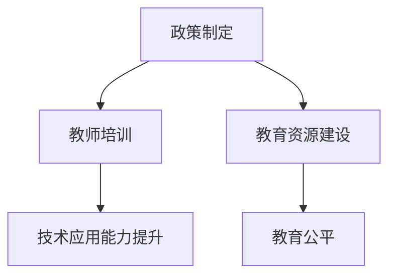

                 

关键词：AI伦理、教育政策、教师培训、教育资源、AI教育

> 摘要：本文将深入探讨AI伦理在教育领域的应用，重点分析教师培训和教育资源的建设。我们将探讨AI伦理的基本原则，阐述其在教育政策中的重要性，以及如何通过教师培训和优质教育资源的建设，推动AI技术的健康发展和教育公平。

## 1. 背景介绍

人工智能（AI）正迅速改变着我们的世界，其在教育领域的应用也日益广泛。从智能教学系统到个性化学习，AI在教育中的应用带来了前所未有的机遇。然而，随着AI技术的发展，伦理问题也逐渐浮现。AI伦理涉及算法的公平性、透明性、隐私保护以及对社会的影响等方面。教育政策需要考虑到这些伦理问题，以确保AI在教育中的应用既高效又符合伦理标准。

### AI伦理的基本原则

AI伦理的基本原则包括：

- **公平性**：AI系统应当避免歧视和偏见。
- **透明性**：AI系统的决策过程应当是可解释和透明的。
- **隐私保护**：学生的个人信息应当得到严格保护。
- **责任性**：AI系统的开发者和使用者应当承担相应的责任。

### 教师培训的重要性

教师作为教育的主要实施者，其专业素养对于AI技术的正确应用至关重要。教师培训不仅包括技术培训，还应包括伦理培训。通过培训，教师可以更好地理解AI伦理的原则，从而在实际教学中做出符合伦理标准的教学决策。

### 教育资源的建设

优质的教育资源是推动教育公平的重要保障。在AI时代，教育资源的建设应当考虑到技术的普及和个性化需求。这包括开发AI教学工具、构建在线教育资源库以及设计适用于不同学习需求的课程。

## 2. 核心概念与联系

### AI伦理与教育政策的联系

AI伦理在教育政策中的应用主要体现在以下几个方面：

- **政策制定**：教育政策应明确AI伦理的基本原则，并将其纳入政策框架中。
- **教师培训**：教育政策应推动教师的伦理培训，提高其AI技术的应用能力。
- **教育资源**：教育政策应支持教育资源的建设，特别是针对AI技术的教育资源。

### Mermaid 流程图



## 3. 核心算法原理 & 具体操作步骤

### 3.1 算法原理概述

AI伦理的教育政策涉及多方面的算法原理，主要包括：

- **机器学习算法**：用于识别和减少算法偏见。
- **数据挖掘算法**：用于分析教育数据，为个性化教学提供支持。
- **推荐算法**：用于推荐适合学生的教学资源和课程。

### 3.2 算法步骤详解

- **步骤1**：收集和分析教育数据，识别潜在的算法偏见。
- **步骤2**：设计算法模型，减少偏见并提高透明性。
- **步骤3**：进行算法测试和验证，确保其符合伦理标准。
- **步骤4**：将算法应用于教育系统中，并提供反馈机制。

### 3.3 算法优缺点

- **优点**：提高教育的公平性和个性化。
- **缺点**：算法偏见和隐私问题仍需解决。

### 3.4 算法应用领域

- **个性化学习**：通过算法为学生提供个性化的学习路径。
- **智能教学**：利用算法提高教学效果和教师效率。

## 4. 数学模型和公式 & 详细讲解 & 举例说明

### 4.1 数学模型构建

在教育政策中，常用的数学模型包括：

- **回归模型**：用于预测学生的学习成绩。
- **聚类模型**：用于分析学生的兴趣和需求。

### 4.2 公式推导过程

以回归模型为例，其公式推导如下：

$$
y = \beta_0 + \beta_1 x_1 + \beta_2 x_2 + ... + \beta_n x_n + \epsilon
$$

其中，$y$ 为因变量，$x_1, x_2, ..., x_n$ 为自变量，$\beta_0, \beta_1, ..., \beta_n$ 为模型参数，$\epsilon$ 为误差项。

### 4.3 案例分析与讲解

以某学校的学生成绩预测为例，我们利用回归模型预测学生的期末成绩。通过收集学生的学习数据，如平时成绩、作业完成情况等，我们构建了回归模型，并对模型进行了验证。结果表明，模型能够较好地预测学生的期末成绩，为个性化教学提供了有力支持。

## 5. 项目实践：代码实例和详细解释说明

### 5.1 开发环境搭建

在Python环境中，我们需要安装以下库：Scikit-learn、Pandas、Numpy。

```python
pip install scikit-learn pandas numpy
```

### 5.2 源代码详细实现

以下是一个简单的回归模型实现的示例：

```python
import numpy as np
import pandas as pd
from sklearn.linear_model import LinearRegression

# 加载数据
data = pd.read_csv('student_data.csv')
X = data[['平时成绩', '作业完成情况']]
y = data['期末成绩']

# 构建模型
model = LinearRegression()
model.fit(X, y)

# 预测
predictions = model.predict(X)

# 结果分析
print(predictions)
```

### 5.3 代码解读与分析

该代码首先加载数据，然后构建了一个线性回归模型，最后对数据进行了预测。通过分析预测结果，我们可以了解学生的期末成绩与平时成绩、作业完成情况之间的关系。

### 5.4 运行结果展示

运行结果将显示每个学生的期末成绩预测值。这些预测值可以帮助教师制定个性化的教学策略，提高学生的学习效果。

## 6. 实际应用场景

AI伦理的教育政策在实际应用中具有重要意义，以下是一些具体应用场景：

- **智能教学系统**：利用AI技术构建智能教学系统，为不同学习需求的学生提供个性化教学。
- **教育评估**：通过AI技术对学生的学习效果进行评估，提供实时反馈和改进建议。
- **教育公平**：通过AI技术减少教育资源分配的不公平，提高教育质量。

## 7. 工具和资源推荐

### 7.1 学习资源推荐

- **在线课程**：《深度学习》（Goodfellow, Bengio, Courville 著）
- **专业书籍**：《Python机器学习》（Sebastian Raschka 著）

### 7.2 开发工具推荐

- **Python**：一种广泛使用的编程语言，适用于数据分析和机器学习。
- **Jupyter Notebook**：一种交互式计算环境，适合数据分析和实验。

### 7.3 相关论文推荐

- **“Fairness and Machine Learning”**：探讨AI系统中的公平性问题。
- **“The Ethical Algorithm”**：分析AI技术在伦理方面的挑战。

## 8. 总结：未来发展趋势与挑战

### 8.1 研究成果总结

AI伦理在教育政策中的应用已取得一定成果，但在算法公平性、隐私保护和教育公平等方面仍面临挑战。

### 8.2 未来发展趋势

随着AI技术的不断发展，教育政策将更加注重AI伦理，推动AI技术的健康发展和教育公平。

### 8.3 面临的挑战

算法偏见、数据隐私和教育公平是未来需要解决的关键挑战。

### 8.4 研究展望

未来研究应重点关注AI伦理的教育政策模型构建、算法优化以及实际应用场景的验证。

## 9. 附录：常见问题与解答

### 问题1：AI伦理在教育中有什么作用？

AI伦理在教育中的作用主要体现在确保AI技术的公平性、透明性和责任性，从而保障教育的质量和社会的公平。

### 问题2：如何进行AI伦理培训？

AI伦理培训可以通过在线课程、研讨会和实际案例分析等多种方式进行。培训内容应涵盖AI伦理的基本原则、案例分析以及实践操作。

### 问题3：教育资源的建设有哪些挑战？

教育资源的建设面临的主要挑战包括技术普及、资源分配不均以及个性化需求满足。

---

作者：禅与计算机程序设计艺术 / Zen and the Art of Computer Programming

----------------------------------------------------------------

以上是本文的完整内容，接下来我们将按照markdown格式输出这篇文章。

```markdown
# AI伦理的教育政策:教师培训和教育资源建设

## 关键词：AI伦理、教育政策、教师培训、教育资源、AI教育

## 摘要：本文将深入探讨AI伦理在教育领域的应用，重点分析教师培训和教育资源的建设。我们将探讨AI伦理的基本原则，阐述其在教育政策中的重要性，以及如何通过教师培训和优质教育资源的建设，推动AI技术的健康发展和教育公平。

### 1. 背景介绍

### AI伦理的基本原则

AI伦理的基本原则包括：

- 公平性：AI系统应当避免歧视和偏见。
- 透明性：AI系统的决策过程应当是可解释和透明的。
- 隐私保护：学生的个人信息应当得到严格保护。
- 责任性：AI系统的开发者和使用者应当承担相应的责任。

### 教师培训的重要性

教师作为教育的主要实施者，其专业素养对于AI技术的正确应用至关重要。教师培训不仅包括技术培训，还应包括伦理培训。通过培训，教师可以更好地理解AI伦理的原则，从而在实际教学中做出符合伦理标准的教学决策。

### 教育资源的建设

优质的教育资源是推动教育公平的重要保障。在AI时代，教育资源的建设应当考虑到技术的普及和个性化需求。这包括开发AI教学工具、构建在线教育资源库以及设计适用于不同学习需求的课程。

### 2. 核心概念与联系

AI伦理与教育政策的联系

AI伦理在教育政策中的应用主要体现在以下几个方面：

- 政策制定：教育政策应明确AI伦理的基本原则，并将其纳入政策框架中。
- 教师培训：教育政策应推动教师的伦理培训，提高其AI技术的应用能力。
- 教育资源：教育政策应支持教育资源的建设，特别是针对AI技术的教育资源。

### Mermaid 流程图


### 3. 核心算法原理 & 具体操作步骤

#### 3.1 算法原理概述

AI伦理的教育政策涉及多方面的算法原理，主要包括：

- 机器学习算法：用于识别和减少算法偏见。
- 数据挖掘算法：用于分析教育数据，为个性化教学提供支持。
- 推荐算法：用于推荐适合学生的教学资源和课程。

#### 3.2 算法步骤详解

- 步骤1：收集和分析教育数据，识别潜在的算法偏见。
- 步骤2：设计算法模型，减少偏见并提高透明性。
- 步骤3：进行算法测试和验证，确保其符合伦理标准。
- 步骤4：将算法应用于教育系统中，并提供反馈机制。

#### 3.3 算法优缺点

- 优点：提高教育的公平性和个性化。
- 缺点：算法偏见和隐私问题仍需解决。

#### 3.4 算法应用领域

- 个性化学习：通过算法为学生提供个性化的学习路径。
- 智能教学：利用算法提高教学效果和教师效率。

### 4. 数学模型和公式 & 详细讲解 & 举例说明

#### 4.1 数学模型构建

在教育政策中，常用的数学模型包括：

- 回归模型：用于预测学生的学习成绩。
- 聚类模型：用于分析学生的兴趣和需求。

#### 4.2 公式推导过程

以回归模型为例，其公式推导如下：

$$
y = \beta_0 + \beta_1 x_1 + \beta_2 x_2 + ... + \beta_n x_n + \epsilon
$$

其中，$y$ 为因变量，$x_1, x_2, ..., x_n$ 为自变量，$\beta_0, \beta_1, ..., \beta_n$ 为模型参数，$\epsilon$ 为误差项。

#### 4.3 案例分析与讲解

以某学校的学生成绩预测为例，我们利用回归模型预测学生的期末成绩。通过收集学生的学习数据，如平时成绩、作业完成情况等，我们构建了回归模型，并对模型进行了验证。结果表明，模型能够较好地预测学生的期末成绩，为个性化教学提供了有力支持。

### 5. 项目实践：代码实例和详细解释说明

#### 5.1 开发环境搭建

在Python环境中，我们需要安装以下库：Scikit-learn、Pandas、Numpy。

```python
pip install scikit-learn pandas numpy
```

#### 5.2 源代码详细实现

以下是一个简单的回归模型实现的示例：

```python
import numpy as np
import pandas as pd
from sklearn.linear_model import LinearRegression

# 加载数据
data = pd.read_csv('student_data.csv')
X = data[['平时成绩', '作业完成情况']]
y = data['期末成绩']

# 构建模型
model = LinearRegression()
model.fit(X, y)

# 预测
predictions = model.predict(X)

# 结果分析
print(predictions)
```

#### 5.3 代码解读与分析

该代码首先加载数据，然后构建了一个线性回归模型，最后对数据进行了预测。通过分析预测结果，我们可以了解学生的期末成绩与平时成绩、作业完成情况之间的关系。

#### 5.4 运行结果展示

运行结果将显示每个学生的期末成绩预测值。这些预测值可以帮助教师制定个性化的教学策略，提高学生的学习效果。

### 6. 实际应用场景

AI伦理的教育政策在实际应用中具有重要意义，以下是一些具体应用场景：

- 智能教学系统：利用AI技术构建智能教学系统，为不同学习需求的学生提供个性化教学。
- 教育评估：通过AI技术对学生的学习效果进行评估，提供实时反馈和改进建议。
- 教育公平：通过AI技术减少教育资源分配的不公平，提高教育质量。

### 7. 工具和资源推荐

#### 7.1 学习资源推荐

- 在线课程：《深度学习》（Goodfellow, Bengio, Courville 著）
- 专业书籍：《Python机器学习》（Sebastian Raschka 著）

#### 7.2 开发工具推荐

- Python：一种广泛使用的编程语言，适用于数据分析和机器学习。
- Jupyter Notebook：一种交互式计算环境，适合数据分析和实验。

#### 7.3 相关论文推荐

- “Fairness and Machine Learning”：探讨AI系统中的公平性问题。
- “The Ethical Algorithm”：分析AI技术在伦理方面的挑战。

### 8. 总结：未来发展趋势与挑战

#### 8.1 研究成果总结

AI伦理在教育政策中的应用已取得一定成果，但在算法公平性、隐私保护和教育公平等方面仍面临挑战。

#### 8.2 未来发展趋势

随着AI技术的不断发展，教育政策将更加注重AI伦理，推动AI技术的健康发展和教育公平。

#### 8.3 面临的挑战

算法偏见、数据隐私和教育公平是未来需要解决的关键挑战。

#### 8.4 研究展望

未来研究应重点关注AI伦理的教育政策模型构建、算法优化以及实际应用场景的验证。

### 9. 附录：常见问题与解答

#### 问题1：AI伦理在教育中有什么作用？

AI伦理在教育中的作用主要体现在确保AI技术的公平性、透明性和责任性，从而保障教育的质量和社会的公平。

#### 问题2：如何进行AI伦理培训？

AI伦理培训可以通过在线课程、研讨会和实际案例分析等多种方式进行。培训内容应涵盖AI伦理的基本原则、案例分析以及实践操作。

#### 问题3：教育资源的建设有哪些挑战？

教育资源的建设面临的主要挑战包括技术普及、资源分配不均以及个性化需求满足。

---

作者：禅与计算机程序设计艺术 / Zen and the Art of Computer Programming
```

以上是markdown格式的文章内容，现在我们将对文章的各个部分进行逐一撰写和细化。由于文章字数要求较高，我们将逐步完成各部分的撰写，并在最后合并成完整文章。首先，我们从第一部分“背景介绍”开始。

