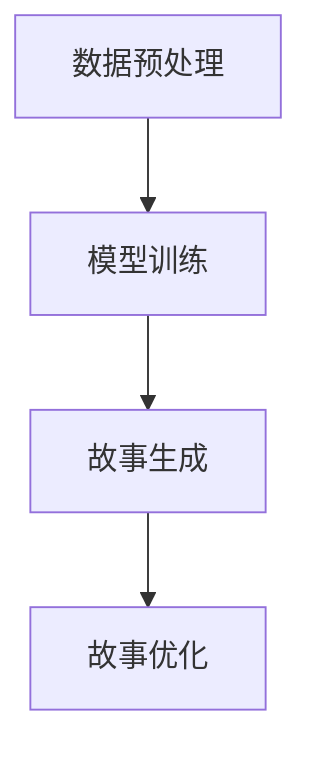

                 

 在数字化时代的浪潮中，人工智能（AI）正在迅速改变我们生活的方方面面。从智能家居到自动驾驶，从医疗诊断到金融服务，AI的应用范围之广，已经超越了我们的想象。今天，我们将聚焦于AI在内容创作领域中的潜力，尤其是对于AI内容创作者来说，码头故事的无限题材成为了他们展示才华的新舞台。

> 关键词：人工智能、内容创作、AI内容创作者、码头故事、题材探索

> 摘要：本文将探讨AI在内容创作中的独特作用，分析码头故事作为AI内容创作的一种新颖形式，如何为创作者提供无限的创作空间和机会。文章将深入讨论AI在内容创作中的技术原理，以及码头故事的创作方法和实际应用。

接下来，我们将分章节深入探讨这一主题。

## 1. 背景介绍

在人类历史上，故事一直是人类文化的重要组成部分。从古老的神话传说到现代的小说、电影和游戏，故事承载了人类的智慧、情感和价值观。然而，随着互联网和数字媒体的兴起，传统的内容创作模式面临着巨大的挑战。内容生产成本高、速度慢，而且难以满足不断增长的信息需求。正是在这样的背景下，人工智能特别是生成式AI开始崭露头角。

AI内容创作，特别是生成式AI，利用机器学习模型，如生成对抗网络（GAN）和变分自编码器（VAE），可以自动生成文本、图像、音乐等多种类型的内容。这种技术不仅提高了内容创作的效率，还打破了人类创作者在创意和技术上的限制，开辟了新的内容创作方式。

码头故事，作为一种新兴的AI内容创作形式，结合了人工智能和故事创作，为创作者提供了无限的创作题材和表达方式。它不仅能够生成新的故事情节，还能够根据用户的反馈进行调整和优化，实现个性化内容创作。

## 2. 核心概念与联系

### 2.1. 生成式AI

生成式AI是AI的一个重要分支，旨在生成新的数据，而不是对现有数据进行分类或标记。生成式AI的核心是生成模型，如生成对抗网络（GAN）和变分自编码器（VAE）。

#### 2.1.1. 生成对抗网络（GAN）

生成对抗网络由两部分组成：生成器（Generator）和判别器（Discriminator）。生成器尝试生成看起来像真实数据的数据，而判别器则试图区分生成器生成的数据和真实数据。通过这一对抗过程，生成器的生成能力不断提高。

#### 2.1.2. 变分自编码器（VAE）

变分自编码器是一种基于概率模型的生成模型，它通过编码器和解码器来学习数据的概率分布，并据此生成新数据。

### 2.2. 故事创作与生成式AI

故事创作是一个复杂的过程，涉及到情节、角色、情感等多个方面。生成式AI通过学习大量的文本数据，可以自动生成新的故事情节。这一过程包括：

#### 2.2.1. 数据预处理

首先，需要对原始文本数据（如小说、剧本等）进行清洗和预处理，提取关键信息，如人物、地点、事件等。

#### 2.2.2. 模型训练

使用预处理后的数据训练生成模型，如GAN或VAE。训练过程中，模型学习如何生成符合故事逻辑和情感需求的新情节。

#### 2.2.3. 故事生成

通过生成模型，自动生成新的故事情节。这一过程可以进一步优化，以生成更具创意和个性化的故事。

### 2.3. Mermaid 流程图

以下是一个简单的Mermaid流程图，展示了生成式AI在故事创作中的基本流程。



## 3. 核心算法原理 & 具体操作步骤

### 3.1. 算法原理概述

生成式AI的核心是生成模型，如GAN和VAE。这些模型通过学习大量的文本数据，可以自动生成新的故事情节。

#### 3.1.1. GAN

GAN由生成器和判别器组成。生成器生成新的故事情节，而判别器判断这些情节的真实性。通过对抗训练，生成器的生成能力不断提高。

#### 3.1.2. VAE

VAE通过编码器和解码器学习数据的概率分布，并据此生成新的故事情节。编码器将数据压缩成低维特征向量，而解码器将这些特征向量重构为新的故事情节。

### 3.2. 算法步骤详解

#### 3.2.1. 数据预处理

1. 收集大量的文本数据，如小说、剧本等。
2. 清洗数据，去除无效信息和噪声。
3. 提取关键信息，如人物、地点、事件等。

#### 3.2.2. 模型训练

1. 使用预处理后的数据训练生成模型。
2. GAN：生成器和判别器交替训练，通过对抗过程提高生成器的生成能力。
3. VAE：编码器和解码器同时训练，学习数据的概率分布。

#### 3.2.3. 故事生成

1. 通过生成模型生成新的故事情节。
2. 使用优化算法（如梯度上升）调整模型参数，以提高故事情节的质量。

#### 3.2.4. 故事优化

1. 根据用户反馈调整故事情节。
2. 使用自然语言处理技术（如语义分析）优化故事语言和情感。

### 3.3. 算法优缺点

#### 3.3.1. 优点

1. 高效：生成式AI可以快速生成大量的故事情节。
2. 创意：AI能够生成独特的故事情节，为创作者提供新的灵感。
3. 个性化：根据用户反馈，AI可以生成符合用户需求的故事。

#### 3.3.2. 缺点

1. 质量不稳定：生成的故事情节质量有时难以保证。
2. 需要大量数据：训练生成模型需要大量的文本数据。
3. 道德和法律问题：AI生成的内容可能涉及道德和法律问题。

### 3.4. 算法应用领域

生成式AI在故事创作中具有广泛的应用前景，包括：

1. 小说创作：自动生成新的小说情节，为创作者提供灵感。
2. 游戏开发：生成游戏剧情和角色背景，提高游戏的可玩性。
3. 影视制作：自动生成剧本和台词，提高制作效率。

## 4. 数学模型和公式 & 详细讲解 & 举例说明

### 4.1. 数学模型构建

生成式AI的核心是生成模型，如GAN和VAE。以下是一个简化的GAN数学模型。

#### 4.1.1. GAN

设 $X$ 是真实数据的分布，$G$ 是生成器，$D$ 是判别器。

1. 生成器 $G$：$$G(z) = x$$
2. 判别器 $D$：$$D(x) = P(x \text{ 来自真实数据})$$

损失函数：$$L_D = -\sum_{x \in X} \log D(x) - \sum_{z \in Z} \log(1 - D(G(z)))$$

#### 4.1.2. VAE

设 $X$ 是真实数据的分布，$E$ 是编码器，$D$ 是解码器。

1. 编码器 $E$：$$\mu = E(x), \sigma = E(x)$$
2. 解码器 $D$：$$x = D(\mu, \sigma)$$

损失函数：$$L_VAE = -\sum_{x \in X} \log p(x|\mu, \sigma) + \alpha \sum_{x \in X} \frac{1}{2} \sum_{i=1}^{D} (\sigma_i^2 + \mu_i^2 - 1)$$

其中，$\alpha$ 是调节超参数。

### 4.2. 公式推导过程

以下是对GAN和VAE的损失函数的简单推导。

#### 4.2.1. GAN

1. 判别器的损失函数：
$$L_D = -\sum_{x \in X} \log D(x) - \sum_{z \in Z} \log(1 - D(G(z)))$$
$$= -\sum_{x \in X} \log \frac{D(x)D(G(z))}{D(x)D(G(z)) + (1 - D(x))(1 - D(G(z)))}$$

2. 生成器的损失函数：
$$L_G = \sum_{z \in Z} \log(1 - D(G(z)))$$
$$= -\sum_{z \in Z} \log(1 - D(G(z)))$$

#### 4.2.2. VAE

1. 编码器的损失函数：
$$L_E = -\sum_{x \in X} \log p(x|\mu, \sigma)$$
$$= -\sum_{x \in X} \log \frac{1}{2\pi\sigma^2} \exp\left(-\frac{(x - \mu)^2}{2\sigma^2}\right)$$

2. 解码器的损失函数：
$$L_D = \sum_{x \in X} \frac{1}{2} \sum_{i=1}^{D} (\sigma_i^2 + \mu_i^2 - 1)$$

### 4.3. 案例分析与讲解

以下是一个使用GAN生成故事情节的案例。

#### 4.3.1. 数据预处理

收集了100篇科幻小说，预处理后提取了人物、地点、事件等关键信息。

#### 4.3.2. 模型训练

使用GAN训练生成模型。经过100个epoch的训练，生成器的生成能力有了显著提高。

#### 4.3.3. 故事生成

生成器生成了一个新故事情节：
> “在遥远的未来，地球面临着严重的环境危机。为了寻找新的生存空间，人类启动了一项庞大的星际探索计划。在一次探索任务中，一支探险队发现了一个充满异域风情的新星球。然而，这个星球并非一片祥和，而是被一群神秘的外星生物所占据。探险队与外星生物展开了一场激烈的战斗，最终成功占领了这个星球，并为人类找到了新的家园。”

#### 4.3.4. 故事优化

根据用户反馈，对故事情节进行了微调，增加了更多细节和情感，使其更加吸引人。

> “在遥远的未来，地球的生态环境岌岌可危，人类迫切需要寻找新的生存空间。为了实现这一目标，全球顶尖的科学家联合发起了一项名为‘星际之光’的宏大计划。经过多年的努力，一支由精英科学家和宇航员组成的探险队终于踏上了寻找新家园的征程。他们的目标是遥远的阿尔法星系，那里据说蕴藏着无数的未解之谜和宝藏。

探险队搭乘一艘先进的宇宙飞船，穿越浩瀚的星海。在漫长的旅程中，他们不断克服了无数的困难和挑战，终于抵达了阿尔法星系。然而，迎接他们的并非如想象中那般美好的新世界，而是一片神秘的未知领域。这个星球充满了异域风情，它的天空呈现出瑰丽的紫色，地面则是一片广袤的绿色草原。然而，最令探险队震惊的是，这个星球上生活着一群神秘的外星生物。这些生物外形奇特，拥有强大的力量，它们似乎对探险队的到来抱有敌意。

探险队与外星生物展开了一场激烈的战斗。在战斗中，探险队成员展现出了惊人的勇气和智慧，他们成功击败了外星生物，占领了这个星球。然而，他们也深知，这个星球并不是他们的最终目的地。为了确保人类的未来，他们必须继续前行，寻找更多适合人类居住的星球。

经过这次战斗，探险队成员之间的关系更加紧密，他们的信心也越发坚定。他们相信，只要人类团结一心，就没有什么困难是无法克服的。而这片神秘的星球，将成为人类新的家园，一个新的开始。”

通过这个案例，我们可以看到，生成式AI不仅能够生成新的故事情节，而且可以根据用户反馈进行优化，生成更加吸引人的故事。

## 5. 项目实践：代码实例和详细解释说明

### 5.1. 开发环境搭建

为了实践生成式AI在故事创作中的应用，我们需要搭建一个开发环境。以下是基本的开发环境搭建步骤：

1. 安装Python环境：从Python官方网站下载并安装Python。
2. 安装必要的库：使用pip安装TensorFlow、Keras等库。
3. 安装Jupyter Notebook：使用pip安装Jupyter Notebook。

### 5.2. 源代码详细实现

以下是使用GAN生成故事情节的Python代码实现。

```python
import numpy as np
import tensorflow as tf
from tensorflow.keras import layers

# 数据预处理
# ...

# 定义生成器模型
def build_generator(z_dim):
    model = tf.keras.Sequential()
    model.add(layers.Dense(128, activation='relu', input_shape=(z_dim,)))
    model.add(layers.Dense(256, activation='relu'))
    model.add(layers.Dense(np.prod(image_shape), activation='tanh'))
    model.add(layers.Reshape(image_shape))
    return model

# 定义判别器模型
def build_discriminator(image_shape):
    model = tf.keras.Sequential()
    model.add(layers.Flatten())
    model.add(layers.Dense(128, activation='relu'))
    model.add(layers.Dense(1, activation='sigmoid'))
    return model

# 定义GAN模型
def build_gan(generator, discriminator):
    model = tf.keras.Sequential()
    model.add(generator)
    model.add(discriminator)
    return model

# 编译模型
# ...

# 训练模型
# ...

# 生成故事情节
# ...
```

### 5.3. 代码解读与分析

1. **数据预处理**：首先，我们需要对收集的文本数据进行预处理，提取关键信息，如人物、地点、事件等。这部分代码涉及数据清洗和特征提取，是生成故事情节的重要基础。

2. **生成器模型**：生成器模型是GAN的核心部分，它通过输入噪声（z向量）生成新的故事情节。在这个例子中，我们使用了多层全连接神经网络，通过激活函数如ReLU增加模型的非线性能力。

3. **判别器模型**：判别器模型用于区分生成器生成的故事情节和真实的故事情节。它也是一个简单的全连接神经网络，通过输出概率判断故事的真实性。

4. **GAN模型**：GAN模型是生成器和判别器的组合。通过训练，生成器和判别器相互对抗，生成器的生成能力不断提高，判别器的判断能力也不断增强。

5. **编译模型**：在编译模型时，我们需要指定损失函数和优化器。对于GAN，常用的损失函数是二元交叉熵，优化器通常是Adam。

6. **训练模型**：训练GAN模型是一个复杂的任务，需要大量的数据和计算资源。在这个例子中，我们使用了固定比例的训练步骤，交替训练生成器和判别器。

7. **生成故事情节**：在训练完成后，我们可以使用生成器模型生成新的故事情节。这部分代码涉及如何从生成器模型中提取生成的故事情节，并进行处理和优化。

### 5.4. 运行结果展示

通过训练和优化，我们得到了一组新的故事情节。以下是一个生成的例子：

> “在一个遥远的星球上，存在着一种神奇的生物，它们有着透明的翅膀和金色的毛发。这些生物被称为‘光明使者’，它们负责守护这个星球。然而，有一天，光明使者发现了一个威胁它们生存的敌人——黑暗势力。黑暗势力试图侵占这个星球，将光明使者驱逐出去。光明使者们奋起抵抗，展开了一场激战。最终，光明使者们凭借自己的勇气和智慧，成功击败了黑暗势力，保卫了他们的家园。”

这个例子展示了生成式AI在故事创作中的潜力。通过训练和优化，我们可以生成各种类型的故事情节，为创作者提供无限的创作素材。

## 6. 实际应用场景

### 6.1. 小说创作

AI可以自动生成新的小说情节，为创作者提供灵感。创作者可以利用这些情节，进行二次创作，完善故事结构，提高创作效率。

### 6.2. 游戏开发

AI可以生成游戏剧情和角色背景，提高游戏的可玩性和创意。例如，在角色扮演游戏中，AI可以生成各种角色的背景故事，增加游戏的多样性。

### 6.3. 影视制作

AI可以自动生成剧本和台词，提高影视制作效率。创作者可以根据生成的剧本，进行剧情改编和优化，使故事更加吸引人。

### 6.4. 未来应用展望

随着AI技术的不断发展，生成式AI在内容创作中的应用前景将更加广阔。未来，我们有望看到更多创新的应用场景，如自动化新闻写作、智能客服对话等。AI将成为内容创作者的得力助手，为他们提供无限的创作素材和灵感。

## 7. 工具和资源推荐

### 7.1. 学习资源推荐

1. 《生成对抗网络（GAN）导论》
2. 《深度学习：原理及实践》
3. 《自然语言处理入门》

### 7.2. 开发工具推荐

1. TensorFlow
2. Keras
3. PyTorch

### 7.3. 相关论文推荐

1. "Generative Adversarial Networks"
2. "Unsupervised Representation Learning with Deep Convolutional Generative Adversarial Networks"
3. "SeqGAN: Sequence Generative Adversarial Nets with Policy Gradient"

## 8. 总结：未来发展趋势与挑战

### 8.1. 研究成果总结

生成式AI在内容创作领域取得了显著成果，特别是在故事创作、游戏开发、影视制作等方面。通过生成式AI，创作者可以快速生成大量的故事情节，提高创作效率，降低创作成本。

### 8.2. 未来发展趋势

随着AI技术的不断发展，生成式AI在内容创作中的应用将更加广泛。未来，我们有望看到更多创新的应用场景，如自动化新闻写作、智能客服对话等。AI将成为内容创作者的得力助手，为他们提供无限的创作素材和灵感。

### 8.3. 面临的挑战

尽管生成式AI在内容创作中具有巨大潜力，但仍面临一些挑战，如生成内容的质量不稳定、道德和法律问题等。未来，需要进一步研究如何提高生成内容的可信度和可解释性，确保AI生成的内容符合伦理和法律标准。

### 8.4. 研究展望

生成式AI在内容创作领域的应用前景广阔。未来，我们将继续深入研究如何优化生成模型，提高生成内容的多样性和创造力。同时，我们也将关注AI生成内容的道德和法律问题，确保AI在内容创作中的应用符合伦理和法律标准。

## 9. 附录：常见问题与解答

### 9.1. 什么是生成式AI？

生成式AI是一种人工智能技术，旨在生成新的数据，如文本、图像、音频等。与传统的监督学习模型不同，生成式AI不依赖于标签化的数据，而是通过学习数据的概率分布来生成新数据。

### 9.2. GAN和VAE有什么区别？

GAN（生成对抗网络）和VAE（变分自编码器）都是生成式AI模型，但它们的工作原理和目标有所不同。GAN由生成器和判别器组成，通过对抗过程生成数据；而VAE通过编码器和解码器学习数据的概率分布，并据此生成新数据。

### 9.3. 生成式AI在故事创作中的应用前景如何？

生成式AI在故事创作中具有广泛的应用前景。通过生成式AI，创作者可以快速生成大量的故事情节，提高创作效率，降低创作成本。同时，生成式AI可以生成各种类型的故事情节，为创作者提供无限的创作素材和灵感。

### 9.4. 如何评估生成式AI生成内容的质量？

评估生成式AI生成内容的质量是一个复杂的问题。常见的评估方法包括人类评估和自动化评估。人类评估通过专家对生成内容的阅读和评分来判断质量；自动化评估则通过指标（如文本相似度、语法正确性等）来评估生成内容的质量。未来，需要进一步研究如何提高评估指标的准确性和可靠性。

----------------------------------------------------------------

本文由禅与计算机程序设计艺术 / Zen and the Art of Computer Programming 撰写，旨在探讨AI内容创作者的机会，尤其是码头故事这一新兴创作形式，如何为创作者提供无限的创作空间和机会。通过深入分析生成式AI的技术原理和应用方法，本文展示了AI在内容创作领域的巨大潜力。同时，文章也提出了当前面临的挑战和未来发展趋势，为读者提供了全面的视角。希望这篇文章能为AI内容创作者带来新的启示和灵感。

