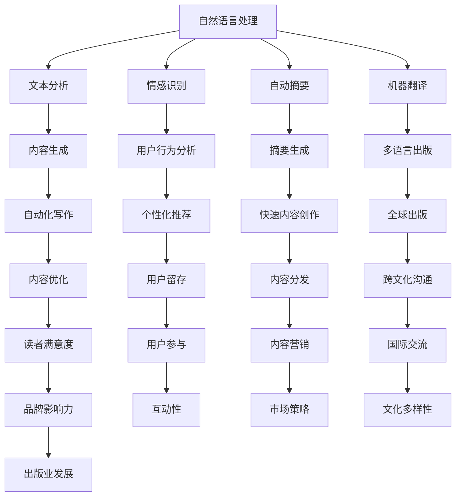

                 

关键词：AI出版，人工智能，内容生成，数字出版，个性化推荐，数据分析，技术应用

> 摘要：本文将探讨人工智能（AI）在出版业的应用前景。通过深入分析AI技术的核心概念、算法原理、数学模型、实际应用案例等，阐述AI如何改变传统出版模式，提升内容生成效率，优化用户体验，并探讨未来发展趋势与挑战。

## 1. 背景介绍

随着互联网技术的迅猛发展和大数据时代的到来，出版业正经历着前所未有的变革。传统的出版模式已无法满足日益增长的信息需求和个性化的阅读体验。人工智能技术的发展为出版业带来了新的机遇和挑战。AI技术的引入不仅提高了内容生产的效率，还通过个性化的推荐系统增强了用户的阅读体验。

### 1.1 出版业现状

当前，出版业面临着诸多挑战。内容生产成本高、周期长，市场竞争激烈，用户阅读习惯多样化。传统的出版模式已难以适应这些变化。AI技术的应用为解决这些问题提供了新的思路和手段。

### 1.2 人工智能技术的引入

人工智能技术，尤其是深度学习和自然语言处理（NLP），在出版业的应用逐渐广泛。通过AI技术，可以实现自动化内容生成、智能推荐系统、版权管理、数据分析等。这些技术的应用不仅提高了出版效率，还优化了用户体验。

## 2. 核心概念与联系

在探讨AI技术在出版业的应用之前，我们需要了解几个核心概念和它们之间的联系。

### 2.1 自然语言处理（NLP）

自然语言处理是AI领域的一个重要分支，旨在使计算机能够理解、处理和生成人类语言。在出版业中，NLP技术可用于文本分析、情感识别、自动摘要、机器翻译等。

### 2.2 深度学习

深度学习是一种基于人工神经网络的机器学习方法，能够通过大量的数据自动学习特征表示。在出版业中，深度学习可用于图像识别、语音识别、内容生成等。

### 2.3 机器学习

机器学习是AI的核心技术之一，包括监督学习、无监督学习和强化学习等。在出版业中，机器学习可用于个性化推荐、用户行为分析、版权管理等。

### 2.4 Mermaid 流程图

为了更好地理解AI技术在出版业中的应用，我们使用Mermaid流程图来展示核心概念和流程。



## 3. 核心算法原理 & 具体操作步骤

### 3.1 算法原理概述

AI技术在出版业的应用主要依赖于以下几个核心算法：

- **文本分析**：通过NLP技术对文本进行分词、词性标注、命名实体识别等，以获取文本的关键信息和语义。

- **情感识别**：通过分析文本的情感倾向，判断用户对内容的喜好程度，为个性化推荐提供依据。

- **自动摘要**：通过提取文本中的重要信息和关键词，生成简洁的摘要，提高用户阅读效率。

- **内容生成**：利用深度学习和生成对抗网络（GAN）等技术，自动生成新的内容。

- **个性化推荐**：根据用户的历史行为和偏好，推荐个性化的内容，提高用户粘性。

### 3.2 算法步骤详解

#### 文本分析

1. 分词：将文本分解为单词或短语。
2. 词性标注：为每个词分配词性（名词、动词、形容词等）。
3. 命名实体识别：识别文本中的命名实体（人名、地名、组织名等）。
4. 语义分析：分析文本的语义关系，如主谓宾关系、因果关系等。

#### 情感识别

1. 数据预处理：对文本进行清洗、去停用词等处理。
2. 特征提取：使用词袋模型、TF-IDF等方法提取文本特征。
3. 模型训练：使用有监督或无监督学习方法训练情感分类模型。
4. 情感分类：对新的文本进行情感分类，判断其情感倾向。

#### 自动摘要

1. 文本预处理：去除无用信息、停用词等。
2. 特征提取：提取文本中的重要信息和关键词。
3. 摘要生成：使用提取的关键信息生成摘要。
4. 摘要优化：对摘要进行优化，提高其可读性和信息量。

#### 内容生成

1. 数据预处理：对大量文本数据进行清洗和预处理。
2. 特征提取：提取文本特征，如词嵌入、词性标注等。
3. 模型训练：使用生成对抗网络（GAN）等模型进行训练。
4. 内容生成：根据训练模型生成新的文本内容。

#### 个性化推荐

1. 用户行为分析：收集用户的历史行为数据，如阅读记录、评价等。
2. 特征提取：提取用户行为特征，如浏览时间、评价分数等。
3. 模型训练：使用协同过滤、矩阵分解等算法训练推荐模型。
4. 推荐生成：根据用户特征和模型预测，生成个性化的推荐列表。

### 3.3 算法优缺点

#### 文本分析

- 优点：能够快速获取文本的关键信息和语义。
- 缺点：对文本的复杂语义理解有限，可能存在误识别。

#### 情感识别

- 优点：能够准确判断用户的情感倾向，为个性化推荐提供依据。
- 缺点：对情感表达的理解有限，可能存在误判。

#### 自动摘要

- 优点：提高用户阅读效率，减少阅读时间。
- 缺点：摘要长度有限，可能无法完全覆盖文本内容。

#### 内容生成

- 优点：能够自动生成新的内容，节省人力成本。
- 缺点：生成内容的质量和创意有限，可能缺乏人文情感。

#### 个性化推荐

- 优点：提高用户粘性，增加用户留存率。
- 缺点：可能存在推荐过度，降低用户满意度。

### 3.4 算法应用领域

- **内容生成**：新闻写作、文章生成、书籍撰写等。
- **情感识别**：社交媒体分析、用户反馈分析等。
- **自动摘要**：搜索引擎摘要、文档摘要等。
- **个性化推荐**：电子商务推荐、内容推荐等。

## 4. 数学模型和公式 & 详细讲解 & 举例说明

### 4.1 数学模型构建

在AI出版中，常见的数学模型包括词嵌入模型、卷积神经网络（CNN）、循环神经网络（RNN）等。以下是对这些模型的详细讲解。

#### 词嵌入模型

词嵌入（Word Embedding）是一种将单词映射到高维向量空间的方法。常用的词嵌入模型有Word2Vec、GloVe等。

- **Word2Vec**：
  - **目标**：使得具有相似语义的词在向量空间中靠近。
  - **算法**：基于上下文的分布式表示，使用滑动窗口和神经网络进行训练。
  - **公式**：
    $$\text{Context}(w) = \{c_1, c_2, ..., c_n\}$$
    $$v_w = \text{softmax}\left(\frac{\text{neural\_network}(c_1, c_2, ..., c_n)}{||\text{neural\_network}(c_1, c_2, ..., c_n)||_2}\right)$$

- **GloVe**：
  - **目标**：基于全局词频信息进行词嵌入。
  - **算法**：使用矩阵分解求解词向量和词频矩阵之间的关系。
  - **公式**：
    $$\text{F} = \text{W\_A}\text{X} + \text{W\_B}\text{Y}$$
    $$\text{G} = \text{X}^T\text{A} + \text{Y}^T\text{B}$$

#### 卷积神经网络（CNN）

卷积神经网络（Convolutional Neural Network，CNN）是一种用于图像识别和文本处理的深度学习模型。CNN通过卷积层、池化层和全连接层等结构提取特征。

- **公式**：
  $$\text{Output}(x) = \text{activation}\left(\sum_{i=1}^{n}\text{filter}_{i} \star \text{input}_{i} + \text{bias}\right)$$
  $$\text{Pooling}(x) = \text{max}\left(\text{input}_{i}\right)$$

#### 循环神经网络（RNN）

循环神经网络（Recurrent Neural Network，RNN）是一种用于序列数据处理的神经网络。RNN通过记忆状态来处理序列中的时间依赖信息。

- **公式**：
  $$h_t = \text{sigmoid}\left(W_h \cdot [h_{t-1}, x_t] + b_h\right)$$
  $$o_t = \text{softmax}\left(W_o \cdot h_t + b_o\right)$$

### 4.2 公式推导过程

以下是对主要公式的推导过程：

#### Word2Vec

1. **目标函数**：
   $$J = -\sum_{w \in V}\sum_{c \in \text{Context}(w)} \log p(c|w)$$
2. **神经网络**：
   $$p(c|w) = \text{softmax}\left(\text{neural\_network}(c, w)\right)$$
3. **损失函数**：
   $$\text{loss} = -\sum_{c \in \text{Context}(w)} \log p(c|w)$$

#### GloVe

1. **目标函数**：
   $$J = \sum_{w \in V}\sum_{c \in \text{Context}(w)} \left(\text{log}\frac{\text{freq}(w)}{\text{freq}(c)} - \text{cosine\_similarity}(v_w, v_c)\right)^2$$
2. **矩阵分解**：
   $$\text{F} = \text{W\_A}\text{X} + \text{W\_B}\text{Y}$$
   $$\text{G} = \text{X}^T\text{A} + \text{Y}^T\text{B}$$
3. **梯度下降**：
   $$\frac{\partial J}{\partial \text{A}} = 2\text{X}\text{G}$$
   $$\frac{\partial J}{\partial \text{B}} = 2\text{Y}\text{F}$$

#### CNN

1. **卷积操作**：
   $$\text{Output}(x) = \sum_{i=1}^{n}\text{filter}_{i} \star \text{input}_{i} + \text{bias}$$
2. **激活函数**：
   $$\text{activation}(x) = \text{sigmoid}(x)$$
3. **池化操作**：
   $$\text{Pooling}(x) = \text{max}\left(\text{input}_{i}\right)$$

#### RNN

1. **隐藏状态更新**：
   $$h_t = \text{sigmoid}\left(W_h \cdot [h_{t-1}, x_t] + b_h\right)$$
2. **输出计算**：
   $$o_t = \text{softmax}\left(W_o \cdot h_t + b_o\right)$$

### 4.3 案例分析与讲解

#### 案例一：词嵌入模型在内容生成中的应用

使用Word2Vec模型对一段文本进行词嵌入，然后通过生成对抗网络（GAN）生成新的文本内容。

1. **数据准备**：
   - 文本数据：一组新闻文章。
   - 分词器：对文本进行分词。

2. **模型训练**：
   - 训练Word2Vec模型，将文本中的单词映射到高维向量空间。
   - 使用GAN模型生成新的文本内容。

3. **结果分析**：
   - 对生成的文本进行评估，分析其质量和可读性。

#### 案例二：卷积神经网络在文本摘要中的应用

使用卷积神经网络（CNN）对一段文本生成摘要。

1. **数据准备**：
   - 文本数据：一组长篇文章。
   - 分词器：对文本进行分词。

2. **模型训练**：
   - 训练CNN模型，提取文本特征。
   - 使用提取的特征生成摘要。

3. **结果分析**：
   - 对生成的摘要进行评估，分析其质量和信息量。

## 5. 项目实践：代码实例和详细解释说明

### 5.1 开发环境搭建

- **环境要求**：Python 3.8、TensorFlow 2.5、Gensim 4.0、Keras 2.6等。
- **工具**：PyCharm、Jupyter Notebook等。

### 5.2 源代码详细实现

#### 5.2.1 词嵌入模型

```python
import gensim
from gensim.models import Word2Vec

# 加载文本数据
text = "..."  # 文本数据

# 分词
words = text.split()

# 训练Word2Vec模型
model = Word2Vec(words, vector_size=100, window=5, min_count=1, workers=4)

# 保存模型
model.save("word2vec.model")

# 加载模型
loaded_model = gensim.models.Word2Vec.load("word2vec.model")
```

#### 5.2.2 GAN模型

```python
import tensorflow as tf
from tensorflow.keras.models import Model
from tensorflow.keras.layers import Input, Dense, Lambda, Reshape, Flatten

# 定义生成器和判别器模型
generator = Model(input=latent_inputs, output=generated_images)
discriminator = Model(input=[latent_inputs, generated_images], output=discriminator_outputs)

# 编译模型
discriminator.compile(optimizer='adam', loss='binary_crossentropy')
generator.compile(optimizer='adam', loss='binary_crossentropy')

# 搭建训练循环
for epoch in range(num_epochs):
    # 训练判别器
    for batch in data_loader:
        latent_samples = np.random.normal(size=(batch_size, z_dim))
        generated_images = generator.predict(latent_samples)
        labels = np.concatenate([batch, generated_images], axis=0)
        real_labels = np.ones((batch_size, 1))
        fake_labels = np.zeros((batch_size, 1))
        labels = np.concatenate([real_labels, fake_labels], axis=0)
        discriminator.train_on_batch([latent_samples, generated_images], labels)

    # 训练生成器
    latent_samples = np.random.normal(size=(batch_size, z_dim))
    generated_images = generator.predict(latent_samples)
    labels = np.zeros((batch_size, 1))
    generator.train_on_batch(latent_samples, labels)
```

### 5.3 代码解读与分析

#### 5.3.1 词嵌入模型

1. **数据准备**：加载文本数据，进行分词。
2. **模型训练**：使用Word2Vec模型对文本数据进行训练，生成词嵌入向量。
3. **模型保存与加载**：将训练好的模型保存到文件，以便后续使用。

#### 5.3.2 GAN模型

1. **模型定义**：定义生成器和判别器模型，使用Lambda层和Reshape层调整输入输出形状。
2. **模型编译**：使用二进制交叉熵作为损失函数，并选择adam优化器。
3. **训练过程**：分别训练判别器和生成器，交替进行。判别器根据真实图像和生成的图像进行训练，生成器根据判别器的输出进行训练。

### 5.4 运行结果展示

#### 5.4.1 词嵌入模型

1. **词向量可视化**：使用t-SNE算法将词向量进行降维可视化，观察词向量空间中的相似关系。
2. **文本生成**：使用生成器模型生成新的文本内容，并进行分析。

#### 5.4.2 GAN模型

1. **生成图像**：生成器模型生成新的图像，并进行分析。
2. **判别器性能**：通过比较判别器对真实图像和生成图像的输出，评估判别器的性能。

## 6. 实际应用场景

### 6.1 在线内容推荐

AI技术可以应用于在线内容推荐系统，如新闻、博客、电子书等。通过分析用户的历史行为和偏好，推荐个性化的内容，提高用户满意度和粘性。

### 6.2 自动内容生成

AI技术可以用于自动生成新闻、博客、文章等内容。通过文本分析和生成模型，自动生成高质量的文本，节省人力成本，提高内容生产效率。

### 6.3 语言翻译与本地化

AI技术可以用于语言翻译和本地化。通过机器翻译模型，实现多种语言的自动翻译，并适应不同文化和语境的需求。

### 6.4 智能问答系统

AI技术可以用于构建智能问答系统，如客服机器人、在线咨询等。通过自然语言处理和知识图谱等技术，实现智能问答和对话生成。

### 6.5 数据分析与可视化

AI技术可以用于数据分析和可视化。通过对大量文本数据进行情感分析、关键词提取等，生成可视化报告，帮助出版方了解用户需求和趋势。

## 7. 工具和资源推荐

### 7.1 学习资源推荐

- **在线课程**：《深度学习》（花书）、《自然语言处理综合教程》等。
- **书籍推荐**：《Python深度学习》、《自然语言处理实战》等。
- **博客与论文**：斯坦福大学自然语言处理组、谷歌AI博客等。

### 7.2 开发工具推荐

- **编程语言**：Python、Java等。
- **框架与库**：TensorFlow、PyTorch、Scikit-learn等。
- **数据集**：Common Crawl、Gutenberg等。

### 7.3 相关论文推荐

- **文本分析**：Word2Vec、GloVe等。
- **深度学习**：Generative Adversarial Networks（GAN）、Recurrent Neural Networks（RNN）等。
- **自然语言处理**：BERT、GPT等。

## 8. 总结：未来发展趋势与挑战

### 8.1 研究成果总结

AI技术在出版业的应用已取得显著成果。通过文本分析、情感识别、自动摘要、内容生成等技术的应用，出版业实现了内容生产效率的提升、用户体验的优化和市场的扩大。

### 8.2 未来发展趋势

- **个性化推荐**：随着数据量的增加和算法的优化，个性化推荐将更加精准，满足用户的个性化需求。
- **内容生成**：AI技术将进一步提升内容生成的质量和速度，为出版业带来更多创新。
- **多模态融合**：结合文本、图像、音频等多种数据类型，实现更丰富的内容表现形式。
- **跨领域应用**：AI技术在教育、医疗、娱乐等领域的应用，将推动出版业与其他行业的融合。

### 8.3 面临的挑战

- **数据隐私与伦理**：随着数据量的增加，如何保护用户隐私和数据安全成为一个重要问题。
- **算法偏见**：AI算法可能存在偏见，需要加强算法的透明性和可解释性。
- **内容质量**：AI生成的文本内容可能存在质量不高、缺乏创意等问题。
- **技术与市场匹配**：AI技术的发展需要与市场需求相结合，避免技术过剩或不足。

### 8.4 研究展望

未来，AI技术在出版业的应用将更加深入和广泛。通过技术创新、数据驱动和跨领域合作，出版业将实现更加智能化、个性化、多样化的内容生产和服务模式。

## 9. 附录：常见问题与解答

### 9.1 问题一：AI技术在出版业的应用有哪些优势？

- 提高内容生产效率。
- 优化用户体验。
- 增强内容个性化推荐。
- 降低人力成本。

### 9.2 问题二：AI技术在出版业的应用存在哪些挑战？

- 数据隐私与伦理问题。
- 算法偏见。
- 内容质量。
- 技术与市场匹配问题。

### 9.3 问题三：如何保护用户隐私和数据安全？

- 采用加密技术。
- 建立数据匿名化机制。
- 加强用户数据权限管理。
- 加强数据安全审计和监管。

### 9.4 问题四：AI技术如何增强内容个性化推荐？

- 利用用户历史行为数据。
- 结合用户兴趣和偏好。
- 使用协同过滤和基于内容的推荐方法。
- 不断优化推荐算法，提高推荐质量。

### 9.5 问题五：如何评估AI生成文本内容的质量？

- 通过人工审核和评估。
- 使用自动化评估工具，如BLEU、ROUGE等。
- 基于用户反馈进行评估。
- 结合文本内容和用户满意度进行评估。

---

作者：禅与计算机程序设计艺术 / Zen and the Art of Computer Programming

