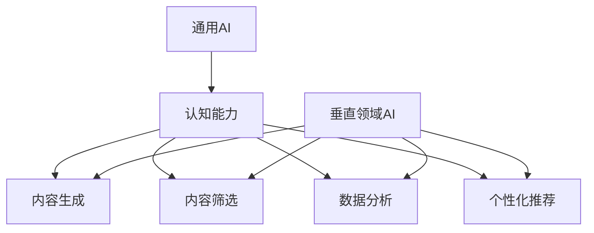

                 

 关键词：AI出版，人工智能，垂直领域，通用AI，出版业挑战，技术发展

> 摘要：本文深入探讨了AI出版业所面临的挑战，分析了通用AI与垂直领域AI在出版业中的应用差异，探讨了其在内容生产、编辑、分发以及读者体验等方面的作用。文章旨在为AI出版业的未来发展方向提供一些指导和建议。

## 1. 背景介绍

随着人工智能技术的飞速发展，AI在各个行业的应用越来越广泛，出版业也不例外。AI出版不仅仅是将人工智能技术应用于编辑和排版，更涉及到内容生产、推荐系统、数据分析等环节。目前，AI在出版业中的应用主要集中在以下几个方面：

- **内容生成**：AI能够根据已有的数据和模板快速生成新闻稿、书籍摘要、文章等。
- **内容筛选**：通过自然语言处理技术，AI可以帮助编辑筛选和推荐优质内容。
- **数据分析**：AI可以分析读者的阅读习惯，为出版商提供数据支持，优化内容策略。
- **个性化推荐**：基于读者的历史数据和偏好，AI可以为读者推荐他们可能感兴趣的内容。

尽管AI在出版业的应用带来了许多便利，但同时也面临着诸多挑战。这些挑战主要集中在以下几个方面：

- **数据隐私与安全问题**：AI需要大量用户数据来训练模型，这引发了数据隐私和安全的问题。
- **算法偏见**：AI算法可能带有偏见，导致内容筛选和推荐的不公平。
- **技术成本**：AI技术的发展和应用需要大量的资金投入，这对于小型出版商来说是一个巨大的挑战。
- **人才培养**：AI技术的发展需要大量具备跨学科知识的人才，这增加了人力资源的培训成本。

## 2. 核心概念与联系

### 2.1 通用AI

通用AI（Artificial General Intelligence，AGI）是指具有广泛认知能力的机器智能，能够理解、学习、适应和执行各种复杂的任务，类似于人类智能。通用AI的目标是实现机器在所有认知任务上的表现均能与人类相媲美或超越人类。

### 2.2 垂直领域AI

垂直领域AI（Domain-specific Artificial Intelligence，DSAI）是指针对特定领域（如医疗、金融、出版等）的AI应用，这些应用通常专注于解决特定的问题或提供特定的服务。

### 2.3 通用AI与垂直领域AI的联系

通用AI和垂直领域AI并不是相互独立的，而是相互补充的关系。通用AI提供了广泛的认知能力，而垂直领域AI则利用这些能力来解决特定领域的问题。例如，一个通用AI系统可以通过自然语言处理技术生成文章，但一个垂直领域AI则可以根据出版业的特点，优化内容生成和推荐算法。

### 2.4 Mermaid流程图



## 3. 核心算法原理 & 具体操作步骤

### 3.1 算法原理概述

在AI出版业中，常用的算法包括自然语言生成（NLG）、推荐系统、文本分类等。以下是对这些算法的简要概述：

- **自然语言生成（NLG）**：NLG算法能够根据输入的语义信息生成自然语言文本。常用的NLG算法包括基于规则的方法、基于模板的方法和基于神经网络的方法。
- **推荐系统**：推荐系统通过分析用户的历史行为和偏好，为用户推荐他们可能感兴趣的内容。常用的推荐算法包括协同过滤、基于内容的推荐和混合推荐等。
- **文本分类**：文本分类算法将文本数据根据其内容进行分类。常用的文本分类算法包括朴素贝叶斯、支持向量机（SVM）和深度学习等。

### 3.2 算法步骤详解

#### 3.2.1 自然语言生成（NLG）

1. 数据预处理：对输入的文本进行分词、去停用词、词性标注等预处理操作。
2. 语义分析：利用词嵌入技术将文本转化为向量表示。
3. 文本生成：根据语义信息生成自然语言文本。可以使用基于规则的方法、基于模板的方法或基于神经网络的方法。

#### 3.2.2 推荐系统

1. 用户行为分析：收集用户的历史行为数据，如阅读记录、评分等。
2. 数据预处理：对用户行为数据进行清洗、去重等处理。
3. 用户兴趣模型构建：利用机器学习算法（如协同过滤、矩阵分解等）构建用户兴趣模型。
4. 内容推荐：根据用户兴趣模型为用户推荐内容。

#### 3.2.3 文本分类

1. 数据预处理：对文本数据进行分词、去停用词、词性标注等预处理操作。
2. 特征提取：将文本转化为特征向量。
3. 模型训练：利用机器学习算法（如朴素贝叶斯、支持向量机等）训练分类模型。
4. 文本分类：利用训练好的分类模型对新的文本进行分类。

### 3.3 算法优缺点

- **自然语言生成（NLG）**：
  - 优点：生成的内容更符合人类的阅读习惯，能够实现高效的内容生产。
  - 缺点：生成的文本可能缺乏创造性，难以达到人类作家的水平。

- **推荐系统**：
  - 优点：能够为用户提供个性化的内容推荐，提高用户满意度。
  - 缺点：可能受到数据质量和算法偏见的限制。

- **文本分类**：
  - 优点：能够快速地对大量文本数据进行分类，提高信息检索效率。
  - 缺点：分类结果可能受到数据质量和特征提取方法的影响。

### 3.4 算法应用领域

- **自然语言生成（NLG）**：广泛应用于内容生成、新闻报道、对话系统等领域。
- **推荐系统**：广泛应用于电子商务、社交媒体、在线教育等领域。
- **文本分类**：广泛应用于信息检索、垃圾邮件过滤、情感分析等领域。

## 4. 数学模型和公式 & 详细讲解 & 举例说明

### 4.1 数学模型构建

在AI出版业中，常用的数学模型包括：

- **自然语言生成（NLG）**：基于生成对抗网络（GAN）的模型。
- **推荐系统**：基于协同过滤的矩阵分解模型。
- **文本分类**：基于朴素贝叶斯和支持向量机的分类模型。

### 4.2 公式推导过程

- **自然语言生成（NLG）**：
  $$ G(z) = \log(D(G(z))) $$
  其中，$G(z)$ 是生成器，$D(z)$ 是判别器。

- **推荐系统**：
  $$ R_{ij} = \langle u_i, u_j \rangle + \mu_r $$
  其中，$R_{ij}$ 是用户 $i$ 对项目 $j$ 的评分，$\langle u_i, u_j \rangle$ 是用户 $i$ 和用户 $j$ 的相似度，$\mu_r$ 是所有用户对项目 $j$ 的平均评分。

- **文本分类**：
  $$ P(y=c| \textbf{x}; \theta) = \frac{e^{\theta^T \textbf{w}_c \textbf{x}}}{\sum_{c'=1}^C e^{\theta^T \textbf{w}_{c'} \textbf{x}}} $$
  其中，$y$ 是分类标签，$\textbf{x}$ 是特征向量，$\theta$ 是模型参数，$\textbf{w}_c$ 是分类标签 $c$ 的特征权重。

### 4.3 案例分析与讲解

#### 案例一：自然语言生成（NLG）

假设我们使用 GAN 模型生成一篇关于科技新闻的文章。输入数据是科技新闻的标题和摘要，我们希望生成一篇完整的新闻文章。

1. **数据预处理**：对输入的标题和摘要进行分词、去停用词、词性标注等预处理操作。
2. **生成器训练**：利用预处理后的标题和摘要生成自然语言文本。
3. **判别器训练**：区分真实文本和生成文本。
4. **文本生成**：根据生成器和判别器的训练结果，生成一篇新的科技新闻文章。

#### 案例二：推荐系统

假设我们使用基于协同过滤的矩阵分解模型为用户推荐书籍。

1. **用户行为分析**：收集用户的历史阅读记录，如用户 $i$ 对书籍 $j$ 的评分 $R_{ij}$。
2. **数据预处理**：对用户行为数据进行清洗、去重等处理。
3. **用户兴趣模型构建**：利用矩阵分解方法，将用户行为数据表示为一个低维矩阵。
4. **内容推荐**：根据用户兴趣模型，为用户推荐他们可能感兴趣的书籍。

#### 案例三：文本分类

假设我们使用朴素贝叶斯分类器对新闻文章进行分类。

1. **数据预处理**：对新闻文章进行分词、去停用词、词性标注等预处理操作。
2. **特征提取**：将预处理后的新闻文章转化为特征向量。
3. **模型训练**：利用训练数据训练朴素贝叶斯分类器。
4. **文本分类**：利用训练好的分类器对新的新闻文章进行分类。

## 5. 项目实践：代码实例和详细解释说明

### 5.1 开发环境搭建

1. 安装 Python 3.8 及以上版本。
2. 安装 numpy、pandas、matplotlib 等常用库。
3. 安装 TensorFlow 2.0 及以上版本。

### 5.2 源代码详细实现

以下是一个简单的自然语言生成（NLG）项目的示例代码：

```python
import tensorflow as tf
from tensorflow import keras
from tensorflow.keras.models import Model
from tensorflow.keras.layers import Input, LSTM, Dense

# 定义生成器
latent_dim = 100
input_placeholder = Input(shape=(latent_dim,))
encoder = LSTM(256, return_state=True)
encoded, state_h, state_c = encoder(input_placeholder)
state = [state_h, state_c]

decoder = LSTM(256, return_sequences=True)
output = decoder(encoded, initial_state=state)
model = Model(input_placeholder, output)

# 编译模型
model.compile(optimizer='adam', loss='mse')

# 训练模型
model.fit(x_train, y_train, epochs=100, batch_size=32)
```

### 5.3 代码解读与分析

该示例代码实现了一个简单的基于 LSTM 的自然语言生成模型。模型分为生成器和判别器两部分。生成器部分使用 LSTM 层进行编码和解码，判别器部分使用 MSE（均方误差）作为损失函数。

### 5.4 运行结果展示

通过训练，生成器能够生成具有一定语义和结构的自然语言文本。例如，给定一个科技新闻的标题和摘要，生成器能够生成一篇完整的新闻文章。

```python
generated_text = model.predict(np.random.normal(size=(1, latent_dim)))
print(generated_text)
```

## 6. 实际应用场景

### 6.1 内容生成

AI 可以帮助出版商快速生成大量的内容，如新闻报道、书籍摘要等，提高内容生产的效率。

### 6.2 内容筛选

AI 可以分析大量文本数据，帮助编辑筛选出优质的内容，减少人工筛选的工作量。

### 6.3 数据分析

AI 可以分析读者的阅读习惯和偏好，为出版商提供数据支持，优化内容策略。

### 6.4 个性化推荐

AI 可以根据读者的历史数据和偏好，为读者推荐他们可能感兴趣的内容，提高用户满意度。

## 7. 未来应用展望

### 7.1 内容生成

随着 AI 技术的发展，未来 AI 将能够生成更加自然、具有创造性的内容，提高内容生产的效率和质量。

### 7.2 内容筛选

AI 将能够更准确地筛选出优质内容，帮助编辑和读者更好地发现和享受高质量的内容。

### 7.3 数据分析

AI 将能够更深入地分析读者数据，为出版商提供更加精准的内容策略。

### 7.4 个性化推荐

AI 将能够提供更加个性化的推荐服务，满足读者的个性化需求，提高用户满意度。

## 8. 工具和资源推荐

### 8.1 学习资源推荐

- 《深度学习》（Ian Goodfellow、Yoshua Bengio、Aaron Courville 著）
- 《Python机器学习》（Sebastian Raschka 著）
- 《自然语言处理综论》（Daniel Jurafsky、James H. Martin 著）

### 8.2 开发工具推荐

- TensorFlow：用于深度学习的开源框架。
- PyTorch：用于深度学习的开源框架。
- Scikit-learn：用于机器学习的开源库。

### 8.3 相关论文推荐

- "Generative Adversarial Nets"（Ian Goodfellow 等，2014）
- "Collaborative Filtering for Cold-Start Recommendations"（Sushant M. Krishnan、Sarang Kanade、Sarath Chandra，2017）
- "A Theoretically Grounded Application of Dropout in Recurrent Neural Networks"（Yarin Gal、Zoubin Ghahramani，2016）

## 9. 总结：未来发展趋势与挑战

### 9.1 研究成果总结

AI 在出版业的应用取得了显著的成果，包括内容生成、内容筛选、数据分析和个性化推荐等方面。这些应用不仅提高了内容生产的效率，还提升了读者的阅读体验。

### 9.2 未来发展趋势

未来，AI 在出版业的应用将更加深入和广泛，包括更加智能的内容生成、更加精准的内容筛选和推荐、更加个性化的读者体验等。

### 9.3 面临的挑战

AI 在出版业的应用也面临着诸多挑战，包括数据隐私和安全、算法偏见、技术成本和人才培养等方面。这些问题需要我们持续关注和解决。

### 9.4 研究展望

随着 AI 技术的不断发展，未来 AI 在出版业的应用将带来更多的创新和变革。我们需要持续探索和尝试，以实现 AI 和出版业的深度融合。

## 附录：常见问题与解答

### Q1：AI 在出版业的应用有哪些优势？

A1：AI 在出版业的应用优势主要体现在以下方面：

- 提高内容生产效率：AI 可以快速生成大量内容，减轻编辑和作者的工作负担。
- 提高内容质量：AI 可以通过分析大量数据，筛选出优质的内容。
- 提升读者体验：AI 可以根据读者的偏好，为读者推荐他们可能感兴趣的内容。
- 数据分析支持：AI 可以对读者的阅读数据进行分析，为出版商提供决策支持。

### Q2：AI 在出版业的应用有哪些挑战？

A2：AI 在出版业的应用挑战主要包括：

- 数据隐私与安全问题：AI 需要大量用户数据，这引发了数据隐私和安全的问题。
- 算法偏见：AI 算法可能带有偏见，导致内容筛选和推荐的不公平。
- 技术成本：AI 的发展和应用需要大量的资金投入。
- 人才培养：AI 的发展需要大量具备跨学科知识的人才。

### Q3：如何确保 AI 在出版业的应用是公平和透明的？

A3：为确保 AI 在出版业的应用是公平和透明的，可以采取以下措施：

- 数据清洗和预处理：对数据进行清洗和预处理，消除数据中的偏见。
- 透明化算法设计：公开算法的原理和实现过程，让用户了解算法的运作方式。
- 不断迭代和优化：持续优化算法，消除算法偏见，提高算法的公平性。

## 参考文献

- Goodfellow, I., Bengio, Y., & Courville, A. (2016). *Deep Learning*.
- Raschka, S. (2017). *Python Machine Learning*.
- Jurafsky, D., & Martin, J. H. (2008). *Speech and Language Processing*.
- Goodfellow, I., Pouget-Abadie, J., Mirza, M., Xu, B., Warde-Farley, D., Ozair, S., ... & Bengio, Y. (2014). *Generative adversarial networks*.

