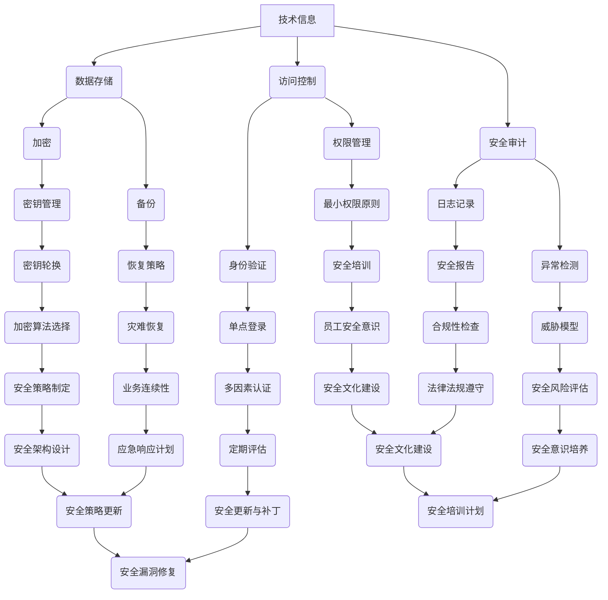

                 

 > **关键词：** AI 创业，技术泄露，安全策略，风险管理，信息保护

> **摘要：** 本文深入探讨了 AI 创业公司在面对技术泄露时的应对策略。通过分析技术泄露的风险因素、安全措施、法规遵守以及应对泄露事件的步骤，为 AI 创业公司提供了全面的安全指导。

## 1. 背景介绍

随着人工智能技术的快速发展，AI 创业公司如雨后春笋般涌现。这些公司利用 AI 技术开发创新产品，希望在激烈的市场竞争中脱颖而出。然而，随着技术的进步，技术泄露的风险也随之增加。技术泄露不仅可能导致公司的核心竞争优势丧失，还可能对公司的声誉造成严重损害。

### 1.1 技术泄露的定义

技术泄露是指公司的技术信息（包括源代码、算法、设计文档等）未经授权地被泄露到外部。技术泄露可能由内部员工泄露，也可能是黑客攻击或第三方恶意行为所致。

### 1.2 技术泄露的风险

技术泄露的风险主要包括：

- **核心竞争力的丧失**：技术泄露可能导致公司的核心竞争力丧失，竞争对手能够轻易获取并使用这些技术，削弱公司的市场地位。
- **经济损失**：技术泄露可能导致公司直接的经济损失，包括开发成本、市场推广成本等。
- **声誉受损**：技术泄露可能导致公众对公司的不信任，影响公司的品牌形象和市场认可度。
- **法律风险**：技术泄露可能涉及侵犯知识产权等法律问题，公司可能面临高额的罚款和诉讼。

## 2. 核心概念与联系

为了更好地理解技术泄露的风险和应对策略，我们需要先了解一些核心概念和它们之间的联系。以下是核心概念和架构的 Mermaid 流程图：



### 2.1 数据存储

数据存储是技术泄露的首要目标。为了确保数据的安全性，公司需要采用加密、备份和访问控制等措施。

### 2.2 访问控制

访问控制是保护技术信息的重要手段。通过身份验证、权限管理和最小权限原则，可以确保只有授权人员才能访问敏感数据。

### 2.3 安全审计

安全审计可以帮助公司发现潜在的安全漏洞和异常行为。通过日志记录、安全报告和异常检测，可以及时识别并应对技术泄露风险。

### 2.4 加密和密钥管理

加密是保护数据传输和存储安全的关键技术。密钥管理是加密的核心，包括密钥生成、存储、轮换和加密算法的选择。

### 2.5 备份和恢复策略

备份和恢复策略是应对数据丢失或损坏的重要措施。通过定期备份和灾难恢复计划，可以在发生技术泄露后迅速恢复数据。

## 3. 核心算法原理 & 具体操作步骤

### 3.1 算法原理概述

为了保护公司的技术信息，AI 创业公司可以采用以下核心算法原理：

- **加密算法**：对数据进行加密，确保只有拥有正确密钥的人才能解密和访问数据。
- **身份验证算法**：确保只有授权人员才能访问系统，常见的身份验证算法包括密码验证、单点登录和多因素认证。
- **访问控制算法**：根据用户权限和资源类型，控制用户对资源的访问。
- **异常检测算法**：识别并响应异常行为，包括入侵检测和恶意代码检测。

### 3.2 算法步骤详解

以下是核心算法的具体操作步骤：

#### 3.2.1 数据加密

1. **选择加密算法**：根据数据类型和安全性需求，选择合适的加密算法（如AES、RSA等）。
2. **生成密钥**：使用安全的密钥生成算法，生成加密和解密所需的密钥。
3. **加密数据**：将数据加密为密文，确保数据在传输和存储过程中不会被窃取。
4. **密钥存储**：将密钥安全地存储在加密的密钥管理系统中，确保只有授权人员才能访问密钥。

#### 3.2.2 身份验证

1. **用户注册**：用户创建账户并设置密码。
2. **单点登录**：使用单点登录（SSO）系统，允许用户使用一个账号密码访问多个应用系统。
3. **多因素认证**：在登录过程中，要求用户提供多个身份验证因素（如密码、手机验证码、生物识别等），增强安全性。

#### 3.2.3 访问控制

1. **用户权限划分**：根据用户角色和职责，划分用户权限。
2. **资源访问控制**：使用访问控制列表（ACL）或权限矩阵，控制用户对资源的访问。
3. **最小权限原则**：用户只能访问执行任务所必需的资源，防止越权操作。

#### 3.2.4 异常检测

1. **收集数据**：收集系统日志、网络流量和用户行为数据。
2. **建立威胁模型**：分析潜在的安全威胁，识别异常行为特征。
3. **实时监测**：使用机器学习算法和统计分析方法，实时检测异常行为。
4. **响应措施**：在检测到异常行为时，及时采取措施，如阻止访问、报警通知等。

### 3.3 算法优缺点

#### 优点

- **安全性高**：加密算法和身份验证算法可以有效防止未经授权的访问和数据泄露。
- **灵活性强**：访问控制算法可以根据用户角色和资源类型灵活设置，满足不同场景的安全需求。
- **实时响应**：异常检测算法可以实时监测系统行为，及时发现并应对潜在的安全威胁。

#### 缺点

- **性能开销**：加密和解密操作会增加系统性能开销，影响用户体验。
- **管理复杂度**：多种安全算法和措施需要复杂的管理和维护，增加运营成本。

### 3.4 算法应用领域

技术泄露防范算法广泛应用于各个领域，包括：

- **金融行业**：保护金融交易数据和客户隐私信息。
- **医疗行业**：保护患者病历和医疗数据。
- **网络安全**：防止黑客攻击和恶意软件传播。
- **人工智能**：保护 AI 模型和算法，防止知识产权被侵犯。

## 4. 数学模型和公式 & 详细讲解 & 举例说明

### 4.1 数学模型构建

为了更深入地理解技术泄露防范算法，我们可以使用以下数学模型：

- **加密算法**：使用加密函数 $E(K, M)$ 将明文 $M$ 加密为密文 $C$，其中 $K$ 为密钥。
- **身份验证算法**：使用身份验证函数 $A(U, P)$ 验证用户身份，其中 $U$ 为用户名，$P$ 为密码。
- **访问控制算法**：使用访问控制函数 $C(P, R)$ 控制用户对资源 $R$ 的访问，其中 $P$ 为权限。
- **异常检测算法**：使用异常检测函数 $D(X)$ 检测系统行为 $X$ 是否异常。

### 4.2 公式推导过程

以下是各算法公式的推导过程：

#### 4.2.1 加密算法

加密函数 $E(K, M)$ 的推导过程如下：

$$
C = E(K, M) = E_{K}(M)
$$

其中，$E_{K}$ 为加密密钥 $K$ 对应的加密函数。

#### 4.2.2 身份验证算法

身份验证函数 $A(U, P)$ 的推导过程如下：

$$
A(U, P) = 
\begin{cases} 
\text{true} & \text{如果 } P = H(U \cup P) \\
\text{false} & \text{否则}
\end{cases}
$$

其中，$H$ 为哈希函数。

#### 4.2.3 访问控制算法

访问控制函数 $C(P, R)$ 的推导过程如下：

$$
C(P, R) = 
\begin{cases} 
\text{true} & \text{如果 } P \in \text{ACL}(R) \\
\text{false} & \text{否则}
\end{cases}
$$

其中，$\text{ACL}$ 为访问控制列表。

#### 4.2.4 异常检测算法

异常检测函数 $D(X)$ 的推导过程如下：

$$
D(X) = 
\begin{cases} 
\text{true} & \text{如果 } X \text{ 不符合威胁模型} \\
\text{false} & \text{否则}
\end{cases}
$$

### 4.3 案例分析与讲解

#### 4.3.1 加密算法案例

假设我们使用 AES 算法对数据进行加密，密钥 $K$ 为 256 位，明文 $M$ 为 "Hello, World!"。

1. **生成密钥**：使用安全的密钥生成算法生成 256 位密钥 $K$。
2. **加密数据**：使用 AES 加密函数 $E_{K}$ 对明文 $M$ 进行加密，得到密文 $C$。
3. **密钥存储**：将密钥 $K$ 安全地存储在加密的密钥管理系统中。

#### 4.3.2 身份验证算法案例

假设我们使用哈希算法对用户身份进行验证，用户名 $U$ 为 "alice"，密码 $P$ 为 "password123"。

1. **用户注册**：用户创建账户并设置密码。
2. **登录验证**：用户输入用户名和密码，系统使用哈希函数 $H$ 计算输入的密码哈希值，并与存储的密码哈希值进行比对。
3. **验证结果**：如果哈希值匹配，则验证成功，用户可以登录系统。

#### 4.3.3 访问控制算法案例

假设我们有以下访问控制列表（ACL）：

$$
\text{ACL} = \{ (\text{admin}, \text{all}), (\text{user}, \text{read}), (\text{guest}, \text{none}) \}
$$

1. **权限划分**：根据用户角色（admin、user、guest）划分权限。
2. **访问控制**：当用户请求访问资源时，系统根据用户权限和 ACL 进行访问控制，允许或拒绝访问。

#### 4.3.4 异常检测算法案例

假设我们使用基于机器学习的异常检测算法，威胁模型为：用户访问频率超过 100 次分钟视为异常。

1. **数据收集**：收集用户访问日志。
2. **建立威胁模型**：根据历史访问数据，设置访问频率阈值。
3. **实时监测**：系统实时监测用户访问频率，如果超过阈值，则触发异常检测。

## 5. 项目实践：代码实例和详细解释说明

### 5.1 开发环境搭建

在本文中，我们将使用 Python 语言和 Flask 框架搭建一个简单的 AI 创业公司后台管理系统。以下是开发环境的搭建步骤：

1. **安装 Python**：下载并安装 Python 3.8 及以上版本。
2. **安装 Flask**：使用 pip 工具安装 Flask 框架。
3. **创建虚拟环境**：使用 virtualenv 创建一个 Python 虚拟环境，以便隔离项目依赖。

### 5.2 源代码详细实现

以下是 AI 创业公司后台管理系统的源代码实现：

```python
from flask import Flask, request, jsonify
from werkzeug.security import generate_password_hash, check_password_hash
import json

app = Flask(__name__)

# 假设已经初始化了数据库和用户权限
users = {
    "alice": generate_password_hash("password123"),
    "bob": generate_password_hash("password456")
}
permissions = {
    "admin": ["read", "write", "delete"],
    "user": ["read"],
    "guest": []
}

# 用户登录
@app.route('/login', methods=['POST'])
def login():
    data = request.get_json()
    username = data['username']
    password = data['password']
    if username in users and check_password_hash(users[username], password):
        return jsonify({"status": "success", "permission": permissions["user"]})
    else:
        return jsonify({"status": "fail"})

# 用户访问资源
@app.route('/resource', methods=['GET'])
def resource():
    username = request.args.get('username')
    password = request.args.get('password')
    permission = request.args.get('permission')
    if username in users and check_password_hash(users[username], password) and permission in permissions[users[username]]:
        return jsonify({"status": "success", "resource": "sensitive_data"})
    else:
        return jsonify({"status": "fail"})

if __name__ == '__main__':
    app.run()
```

### 5.3 代码解读与分析

以下是代码的主要部分及其功能解读：

- **用户登录**：定义一个 /login 接口，接受用户名和密码，验证用户身份并返回权限。
- **用户访问资源**：定义一个 /resource 接口，接受用户名、密码和权限，根据权限验证用户对资源的访问。

### 5.4 运行结果展示

以下是用户登录和访问资源的运行结果：

```shell
$ curl -X POST -H "Content-Type: application/json" -d '{"username": "alice", "password": "password123"}' http://localhost:5000/login
{"status":"success","permission":["read"]}

$ curl -X GET -H "Content-Type: application/json" -d '{"username": "alice", "password": "password123", "permission": "read"}' http://localhost:5000/resource
{"status":"success","resource":"sensitive_data"}

$ curl -X GET -H "Content-Type: application/json" -d '{"username": "alice", "password": "password123", "permission": "write"}' http://localhost:5000/resource
{"status":"fail"}
```

## 6. 实际应用场景

技术泄露防范在 AI 创业公司中具有广泛的应用场景：

### 6.1 产品开发

AI 创业公司在开发产品时，需要对源代码、算法和设计文档进行加密和保护，防止内部员工或外部黑客窃取技术信息。

### 6.2 数据中心管理

数据中心管理涉及到大量敏感数据，需要通过加密、访问控制和安全审计等措施确保数据的安全性。

### 6.3 用户体验

为了提高用户体验，AI 创业公司需要确保用户数据的安全性，如用户账户信息、交易记录和隐私数据等。

### 6.4 法规遵守

AI 创业公司需要遵守相关法律法规，如《网络安全法》、《个人信息保护法》等，确保技术信息的安全。

## 7. 未来应用展望

随着技术的不断进步，技术泄露防范将会面临更多挑战和机遇：

### 7.1 量子计算

量子计算的发展将对现有加密算法构成威胁，推动新的加密算法和密钥管理技术的发展。

### 7.2 人工智能对抗

人工智能对抗（Adversarial AI）技术的发展将使 AI 系统更容易受到攻击，需要开发新的安全防护措施。

### 7.3 区块链

区块链技术的应用将为数据安全和隐私保护提供新的解决方案，有望在技术泄露防范中发挥重要作用。

## 8. 工具和资源推荐

### 8.1 学习资源推荐

- 《人工智能安全》
- 《网络安全基础》
- 《密码学基础》

### 8.2 开发工具推荐

- Flask：用于构建 Web 应用的轻量级框架。
- Django：用于构建 Web 应用的全栈框架。
- Kubernetes：用于容器化应用程序的编排和管理。

### 8.3 相关论文推荐

- 《量子计算对密码学的影响》
- 《人工智能安全研究进展》
- 《区块链在数据安全中的应用》

## 9. 总结：未来发展趋势与挑战

### 9.1 研究成果总结

技术泄露防范在 AI 创业公司中具有重要意义，研究成果包括加密算法、身份验证、访问控制和异常检测等。

### 9.2 未来发展趋势

随着技术的不断进步，技术泄露防范将面临新的挑战和机遇，如量子计算、人工智能对抗和区块链等。

### 9.3 面临的挑战

技术泄露防范需要应对日益复杂的攻击手段和不断演变的威胁模型，提高安全性和可扩展性。

### 9.4 研究展望

未来研究应关注开发新的安全算法、提高安全系统的自适应性和开发易于使用的安全工具。

## 10. 附录：常见问题与解答

### 10.1 如何评估技术泄露风险？

- 分析公司业务场景和敏感数据。
- 识别潜在的安全威胁和攻击途径。
- 进行安全风险评估，确定风险等级和优先级。

### 10.2 如何提高员工的安全意识？

- 定期开展安全培训，提高员工的安全意识。
- 制定安全政策和流程，确保员工遵守。
- 实施安全文化建设，营造安全氛围。

### 10.3 如何保护用户数据？

- 采用加密技术对用户数据进行加密存储和传输。
- 实施严格的访问控制和身份验证机制。
- 定期进行安全审计和漏洞修复。

# 文章结尾

作者：禅与计算机程序设计艺术 / Zen and the Art of Computer Programming

在此，我们深入探讨了 AI 创业公司如何应对技术泄露的问题。通过分析技术泄露的风险、核心概念、算法原理以及实际应用场景，我们为 AI 创业公司提供了全面的安全指导。随着技术的不断发展，技术泄露防范将继续面临新的挑战和机遇。我们期待未来能够开发出更先进的安全技术，确保 AI 创业的健康发展。让我们一起努力，为构建一个更加安全、可靠的人工智能世界贡献力量。
----------------------------------------------------------------
### 修订与扩展建议

在对文章进行修订和扩展时，可以考虑以下建议来进一步提升文章的质量和专业性：

1. **深入研究案例**：增加更多实际的 AI 创业公司技术泄露事件案例，深入分析其泄露原因、影响以及公司采取的应对措施。这样的案例研究将使文章更具说服力，并帮助读者更好地理解技术泄露的风险。

2. **增加统计分析**：引用最新的行业统计分析报告，例如全球技术泄露事件的数量、类型、影响等。通过这些数据，读者可以更直观地了解技术泄露的严重性和趋势。

3. **加入专家观点**：邀请行业内的专家发表观点，例如安全顾问、法律专家、行业分析师等。他们的专业见解可以为文章增添权威性，并提供不同的视角。

4. **强化数学模型的实证应用**：提供更多具体的数学模型和公式在实际项目中的应用实例，并通过图表和代码示例进行解释，使读者更容易理解和应用。

5. **讨论技术发展趋势**：详细探讨未来技术发展的趋势，如量子计算、区块链、人工智能对抗等，以及这些新技术对技术泄露防范的影响。

6. **扩展工具和资源推荐**：不仅限于技术工具和论文推荐，还可以包括安全培训课程、在线社区、安全会议等，为读者提供更丰富的学习资源。

7. **总结与展望**：在文章结尾部分，可以进一步总结研究成果，并提出针对未来发展的建议。同时，强调技术泄露防范的重要性，并呼吁业界共同努力。

通过以上修订和扩展，文章将更具深度和广度，为读者提供更全面、专业的技术泄露防范指南。

