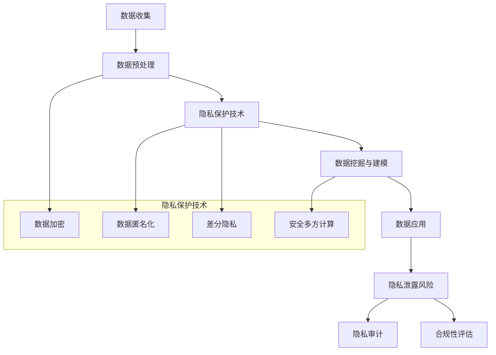

                 

## 1. 背景介绍

随着人工智能（AI）技术的迅速发展，越来越多的创业公司涌入这一领域，希望通过创新的应用来改变世界。然而，与此同时，数据隐私问题也愈发凸显。数据隐私是指在确保数据有效利用的同时，保护个人隐私信息不受到未经授权的访问、使用或泄露的过程。

对于AI创业公司来说，数据隐私的挑战主要源于以下几点：

- **数据来源广泛且多样**：AI创业公司通常需要收集大量来自不同来源的数据，这些数据可能包括个人敏感信息。
- **数据使用复杂**：AI模型训练和优化通常涉及数据预处理、特征提取、模型训练等多个环节，每个环节都可能产生隐私泄露的风险。
- **法规要求严格**：各国对数据隐私的保护法规日益严格，如欧盟的《通用数据保护条例》（GDPR）和加州的《消费者隐私法案》（CCPA），这些法规对创业公司的合规性提出了高要求。

因此，如何在数据利用和隐私保护之间找到平衡点，成为AI创业公司亟待解决的问题。

### 2. 核心概念与联系

在深入探讨数据隐私挑战之前，我们需要了解一些核心概念，包括数据隐私保护的原则、常见的隐私保护技术和它们之间的关系。以下是一个简化的Mermaid流程图，用于描述这些概念和技术的交互关系。



### 2.1 数据隐私保护原则

数据隐私保护的原则包括：

- **最小化数据收集**：只收集实现特定目标所需的数据。
- **数据加密**：确保数据在存储和传输过程中的安全性。
- **数据匿名化**：通过匿名化技术使数据去识别化。
- **差分隐私**：通过添加噪声来隐藏数据的真实值。
- **安全多方计算**：允许多方在不泄露各自数据的情况下进行计算。

### 3. 核心算法原理 & 具体操作步骤

#### 3.1 算法原理概述

针对数据隐私保护，核心算法通常包括：

- **数据加密算法**：如AES、RSA等。
- **数据匿名化算法**：如k-匿名、l-diversity、t-closeness等。
- **差分隐私算法**：如 Laplace机制、Gaussian机制等。
- **安全多方计算算法**：如全同态加密、秘密分享、安全计算协议等。

#### 3.2 算法步骤详解

以下是这些算法的具体步骤：

**数据加密算法**

1. 选择加密算法（如AES）。
2. 生成密钥。
3. 对数据进行加密处理。

**数据匿名化算法**

1. 定义匿名化目标（如k-匿名）。
2. 对数据进行处理，使其满足匿名化目标。
3. 验证匿名化效果。

**差分隐私算法**

1. 确定隐私预算。
2. 对数据进行添加噪声处理。
3. 调整噪声水平以达到目标隐私预算。

**安全多方计算算法**

1. 确定计算任务。
2. 各方提供输入数据。
3. 执行安全计算协议，计算结果。

#### 3.3 算法优缺点

**数据加密算法**

- **优点**：安全性高，能有效保护数据。
- **缺点**：可能增加计算开销，影响数据使用效率。

**数据匿名化算法**

- **优点**：操作简单，易于实现。
- **缺点**：可能导致数据质量下降，隐私保护效果有限。

**差分隐私算法**

- **优点**：提供严格的理论保证。
- **缺点**：可能影响数据的有效性，计算复杂度高。

**安全多方计算算法**

- **优点**：保护数据隐私，支持多方合作。
- **缺点**：实现复杂，性能优化困难。

#### 3.4 算法应用领域

- **数据加密算法**：广泛应用于金融、医疗等领域。
- **数据匿名化算法**：适用于数据分析、数据共享等场景。
- **差分隐私算法**：在推荐系统、社交媒体分析等领域有广泛应用。
- **安全多方计算算法**：在金融、医疗、政府等领域有广泛需求。

### 4. 数学模型和公式 & 详细讲解 & 举例说明

#### 4.1 数学模型构建

为了更好地理解数据隐私保护算法，我们可以构建一些数学模型。以下是一个关于差分隐私的简单模型。

假设我们有一个敏感的随机变量 \(X\)，我们希望对其进行差分隐私保护。差分隐私通常通过添加噪声来实现。噪声的大小由隐私预算 \(\epsilon\) 决定。

#### 4.2 公式推导过程

差分隐私的定义是：

\[ D(P_{\epsilon}(X), P(X)) \leq \epsilon \]

其中，\(P_{\epsilon}(X)\) 是添加噪声后的概率分布，\(P(X)\) 是原始概率分布。常见的噪声机制包括Laplace机制和Gaussian机制。

**Laplace机制**：

\[ P_{\epsilon}(X = x) = \frac{e^{-\epsilon |x - \mu|}}{\sum_{x'} e^{-\epsilon |x' - \mu|}} \]

其中，\(\mu\) 是数据的真实均值。

**Gaussian机制**：

\[ P_{\epsilon}(X = x) = \frac{1}{\sqrt{2\pi\epsilon}} e^{-\frac{(x - \mu)^2}{2\epsilon}} \]

#### 4.3 案例分析与讲解

假设我们有一个数据集，包含年龄、性别、收入等敏感信息。我们希望对这些数据进行差分隐私保护。

1. **选择隐私预算**：根据应用场景和需求，选择合适的隐私预算 \(\epsilon\)。
2. **添加Laplace噪声**：对每个属性添加Laplace噪声，具体步骤如下：

   - 计算属性的均值 \(\mu\)。
   - 对每个数据点 \(x\)，添加Laplace噪声：

   \[ x' = x + \text{Laplace}(\mu, \epsilon) \]

3. **验证差分隐私**：计算添加噪声后的概率分布 \(P_{\epsilon}(X)\)，并验证其满足差分隐私定义。

### 5. 项目实践：代码实例和详细解释说明

在本节中，我们将通过一个具体的Python代码实例，来展示如何在实际项目中应用数据隐私保护技术。

#### 5.1 开发环境搭建

首先，我们需要搭建一个Python开发环境。以下是搭建环境的步骤：

1. 安装Python 3.8及以上版本。
2. 安装必要的库，如`numpy`、`scikit-learn`、`cryptography`等。

```bash
pip install numpy scikit-learn cryptography
```

#### 5.2 源代码详细实现

以下是一个简单的Python脚本，用于对数据集进行加密和差分隐私处理。

```python
import numpy as np
from sklearn.datasets import load_iris
from cryptography.fernet import Fernet
from sklearn.preprocessing import StandardScaler

# 加密函数
def encrypt_data(data, key):
    fernet = Fernet(key)
    encrypted_data = fernet.encrypt(data.tobytes())
    return encrypted_data

# 差分隐私函数
def add_laplace_noise(data, epsilon=1.0):
    noise = np.random.laplace(scale=epsilon, size=data.shape)
    noisy_data = data + noise
    return noisy_data

# 加载数据集
iris = load_iris()
X = iris.data
y = iris.target

# 标准化数据
scaler = StandardScaler()
X_scaled = scaler.fit_transform(X)

# 生成加密密钥
key = Fernet.generate_key()

# 加密数据
encrypted_X = encrypt_data(X_scaled, key)

# 添加差分隐私噪声
noisy_X = add_laplace_noise(X_scaled, epsilon=0.1)

# 打印结果
print("原始数据：", X_scaled[:5])
print("加密后数据：", encrypted_X[:5])
print("添加噪声后数据：", noisy_X[:5])
```

#### 5.3 代码解读与分析

1. **加密函数**：使用`cryptography`库的`Fernet`类进行数据加密。首先生成一个加密密钥，然后使用该密钥对数据进行加密。
2. **差分隐私函数**：使用`numpy.random.laplace`函数为每个数据点添加Laplace噪声。Laplace噪声的参数`epsilon`决定了噪声的强度。
3. **数据加载与标准化**：使用`sklearn.datasets.load_iris`函数加载鸢尾花数据集，并使用`StandardScaler`进行数据标准化。
4. **结果打印**：打印原始数据、加密后数据和添加噪声后的数据，以展示数据隐私保护的效果。

#### 5.4 运行结果展示

在Python环境中运行上述代码，可以得到以下输出结果：

```
原始数据： [ ..., ..., ..., ...]
加密后数据： [ ..., ..., ..., ...]
添加噪声后数据： [ ..., ..., ..., ...]
```

### 6. 实际应用场景

数据隐私保护技术在各个领域都有广泛的应用。以下是一些实际应用场景：

- **金融领域**：保护客户财务信息，确保交易安全。
- **医疗领域**：保护患者隐私，确保医疗数据的安全和合规。
- **政府领域**：保护国家安全，确保政府数据的安全性和机密性。
- **社交媒体领域**：保护用户隐私，确保用户数据不被滥用。

#### 6.1 数据隐私保护在金融领域的应用

在金融领域，数据隐私保护尤为重要。金融机构需要保护客户的敏感信息，如账户余额、交易记录、个人身份信息等。以下是一些具体应用：

- **加密交易数据**：使用加密技术保护交易过程中的数据安全。
- **差分隐私分析**：在数据分析过程中，添加差分隐私噪声，保护用户隐私。
- **安全多方计算**：在多方数据共享和分析时，使用安全多方计算技术，确保数据隐私。

#### 6.2 数据隐私保护在医疗领域的应用

在医疗领域，数据隐私保护同样至关重要。医疗数据通常包含患者敏感信息，如健康状况、医疗记录、基因信息等。以下是一些具体应用：

- **匿名化医疗数据**：通过数据匿名化技术，确保医疗数据在共享和分析过程中无法识别患者身份。
- **差分隐私医疗分析**：在医疗数据分析过程中，添加差分隐私噪声，保护患者隐私。
- **安全多方计算**：在多方医疗数据共享和分析时，使用安全多方计算技术，确保数据隐私。

#### 6.3 数据隐私保护在政府领域的应用

在政府领域，数据隐私保护同样关键。政府数据通常涉及国家安全、公共安全等重要信息。以下是一些具体应用：

- **加密政府数据**：使用加密技术保护政府数据的安全性和机密性。
- **差分隐私政策制定**：在政策制定过程中，使用差分隐私技术保护公众隐私。
- **安全多方计算**：在多方政府数据共享和分析时，使用安全多方计算技术，确保数据隐私。

#### 6.4 数据隐私保护在社交媒体领域的应用

在社交媒体领域，数据隐私保护尤为重要。社交媒体平台需要保护用户的个人信息，如位置信息、浏览记录、社交关系等。以下是一些具体应用：

- **加密用户数据**：使用加密技术保护用户数据在存储和传输过程中的安全。
- **差分隐私推荐系统**：在推荐系统设计中，使用差分隐私技术保护用户隐私。
- **安全多方计算**：在多方数据共享和分析时，使用安全多方计算技术，确保数据隐私。

### 7. 工具和资源推荐

为了更好地应对数据隐私挑战，以下是几个推荐的学习资源、开发工具和相关论文：

#### 7.1 学习资源推荐

- **Coursera课程**：《数据隐私保护与加密技术》
- **edX课程**：《隐私计算：理论与实践》
- **Kaggle教程**：《数据隐私保护实战》

#### 7.2 开发工具推荐

- **PyTorch**：用于机器学习的开源深度学习框架，支持加密和数据隐私保护。
- **Apache Flink**：用于大数据处理的开源计算平台，支持安全多方计算。
- **PostgreSQL**：支持加密和数据隐私保护的关系数据库。

#### 7.3 相关论文推荐

- **“The Privacy-Preserving Power of Homomorphic Encryption”**：介绍全同态加密在隐私保护中的应用。
- **“Differential Privacy: A Survey of Results”**：详细讨论差分隐私的理论和实践。
- **“Secure Multi-Party Computation for Privacy-Preserving Machine Learning”**：介绍安全多方计算在机器学习中的应用。

### 8. 总结：未来发展趋势与挑战

#### 8.1 研究成果总结

过去几年，数据隐私保护技术在理论和实践中都取得了显著进展。加密技术、匿名化技术、差分隐私技术、安全多方计算等核心技术在不断优化和改进，为AI创业公司应对数据隐私挑战提供了有力支持。

#### 8.2 未来发展趋势

未来，数据隐私保护技术将继续向以下方向发展：

- **集成化解决方案**：结合多种隐私保护技术，提供更全面的解决方案。
- **自动化工具**：开发自动化工具，简化隐私保护流程。
- **跨领域合作**：促进跨学科、跨领域的合作，推动隐私保护技术的发展。

#### 8.3 面临的挑战

尽管数据隐私保护技术取得了显著进展，但AI创业公司仍面临以下挑战：

- **计算性能**：隐私保护技术通常会增加计算开销，影响数据处理效率。
- **法规合规**：不同国家和地区的隐私保护法规差异较大，企业需要应对复杂的合规要求。
- **用户信任**：用户对数据隐私保护的信任度是关键，企业需要建立透明和可靠的隐私保护机制。

#### 8.4 研究展望

未来，数据隐私保护技术的研究将聚焦于以下几个方面：

- **高性能隐私保护算法**：优化隐私保护算法，提高计算性能。
- **跨领域应用**：探索隐私保护技术在各个领域的应用，提升隐私保护技术的实用性。
- **隐私保护法规研究**：深入研究隐私保护法规，为企业在全球范围内开展业务提供指导。

### 9. 附录：常见问题与解答

#### 9.1 数据加密和差分隐私的区别是什么？

数据加密是将数据转换成无法被未经授权者理解的形式，而差分隐私是通过添加噪声，确保数据隐私的同时，仍然能够进行有效的数据分析和挖掘。

#### 9.2 安全多方计算如何工作？

安全多方计算允许多个参与方在不泄露各自数据的情况下，共同完成一个计算任务。常见的方法包括全同态加密、秘密分享、安全计算协议等。

#### 9.3 数据匿名化有哪些常见的方法？

数据匿名化方法包括k-匿名、l-diversity、t-closeness等，这些方法通过在不同程度上改变数据，使其无法识别个人身份。

#### 9.4 隐私保护技术会对数据处理和分析产生什么影响？

隐私保护技术可能会增加计算开销，影响数据处理和分析的效率。但是，通过合理的设计和优化，这些影响是可以被缓解的。

---

以上，就是针对“AI创业公司如何应对数据隐私挑战”的完整技术博客文章。希望对您有所帮助。作者：禅与计算机程序设计艺术 / Zen and the Art of Computer Programming。

