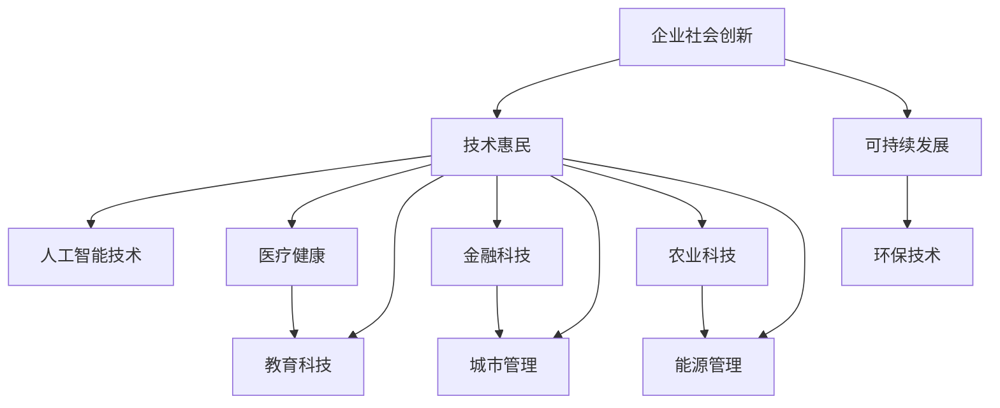

                 

关键词：AI创业公司、企业社会创新、技术惠民、可持续发展、人工智能、社会价值

摘要：本文将探讨AI创业公司在实现企业社会创新中的角色，以及如何通过技术手段惠及民众并推动可持续发展。文章首先介绍了AI创业公司的背景和重要性，随后详细阐述了技术惠民和可持续发展的核心理念，接着分析了AI技术在其中的应用，最后对未来发展趋势与挑战进行了展望。

## 1. 背景介绍

随着人工智能（AI）技术的快速发展，AI创业公司如雨后春笋般涌现。这些公司利用AI算法、大数据和云计算等先进技术，推动着各个行业的创新与变革。AI创业公司的崛起不仅改变了企业的运营方式，还为社会带来了深远的影响。

### AI创业公司的兴起原因

1. **技术突破**：AI技术的快速突破为创业公司提供了广阔的发展空间。
2. **市场需求**：随着消费者对智能化产品的需求不断增加，AI创业公司满足了这一市场需求。
3. **资本支持**：风险投资和政府的支持为AI创业公司提供了充足的资金。

### AI创业公司的现状

1. **行业分布**：AI创业公司主要分布在科技、医疗、金融、零售等领域。
2. **规模壮大**：越来越多的AI创业公司开始走向国际市场，业务规模不断扩大。
3. **社会影响**：AI创业公司在提高生产力、改善生活质量、推动社会进步方面发挥了重要作用。

## 2. 核心概念与联系

为了更好地理解AI创业公司的企业社会创新，我们需要首先了解一些核心概念和它们之间的联系。

### 核心概念

1. **企业社会创新**：指企业通过创新的方式，解决社会问题、提高社会福利的过程。
2. **技术惠民**：通过技术创新，使人们的生活更加便利、舒适和健康。
3. **可持续发展**：在满足当前需求的同时，不损害未来世代满足自身需求的能力。

### Mermaid 流程图



### 核心概念的联系

- 企业社会创新是AI创业公司的根本目标，它通过技术惠民和可持续发展来实现。
- 技术惠民和可持续发展是相辅相成的，技术惠民为可持续发展提供了支持，而可持续发展又为技术惠民提供了保障。
- 人工智能技术是技术惠民和可持续发展的关键驱动力，它贯穿于各个行业和应用场景。

## 3. 核心算法原理 & 具体操作步骤

### 3.1 算法原理概述

在AI创业公司的企业社会创新中，核心算法原理主要包括机器学习、深度学习和大数据分析。这些算法通过训练模型，从数据中提取规律和知识，从而实现智能化决策和预测。

### 3.2 算法步骤详解

1. **数据收集与预处理**：收集相关数据，并进行清洗、去重和格式化处理。
2. **特征提取**：从原始数据中提取有用的特征，以便用于训练模型。
3. **模型选择**：根据问题类型和数据分析需求，选择合适的机器学习或深度学习模型。
4. **模型训练与优化**：使用训练数据对模型进行训练，并根据评估指标进行调整和优化。
5. **模型部署与应用**：将训练好的模型部署到实际应用场景中，并根据反馈进行持续优化。

### 3.3 算法优缺点

- **优点**：高效、准确、自动化。
- **缺点**：对数据质量要求较高，训练过程复杂。

### 3.4 算法应用领域

- **医疗健康**：疾病预测、诊断和治疗。
- **教育科技**：个性化教学、学习评估。
- **金融科技**：风险管理、信用评估。
- **城市管理**：交通优化、环境监测。
- **农业科技**：作物管理、病虫害防治。
- **能源管理**：节能减排、能源优化。

## 4. 数学模型和公式 & 详细讲解 & 举例说明

### 4.1 数学模型构建

在AI创业公司的企业社会创新中，常用的数学模型包括线性回归、逻辑回归、支持向量机、神经网络等。以下以线性回归模型为例进行介绍。

### 4.2 公式推导过程

线性回归模型的目标是找到最佳拟合直线，使数据点到直线的距离最小。具体公式推导如下：

$$
y = \beta_0 + \beta_1x
$$

其中，$y$ 为因变量，$x$ 为自变量，$\beta_0$ 和 $\beta_1$ 分别为直线的截距和斜率。

### 4.3 案例分析与讲解

假设我们想要预测某地区的月平均气温，使用线性回归模型进行预测。以下是一个简单的案例：

1. **数据收集**：收集某地区过去一年的月平均气温数据。
2. **数据预处理**：对数据进行清洗和格式化处理。
3. **特征提取**：提取月份作为自变量，月平均气温作为因变量。
4. **模型训练**：使用训练数据对线性回归模型进行训练。
5. **模型评估**：使用测试数据对模型进行评估，计算预测误差。

经过训练和评估，我们得到了线性回归模型的参数 $\beta_0$ 和 $\beta_1$，从而可以预测未来某月的平均气温。

## 5. 项目实践：代码实例和详细解释说明

### 5.1 开发环境搭建

1. **安装Python**：下载并安装Python 3.8版本。
2. **安装依赖库**：使用pip命令安装numpy、pandas、scikit-learn等库。

### 5.2 源代码详细实现

以下是一个使用线性回归模型进行气温预测的简单代码示例：

```python
import numpy as np
import pandas as pd
from sklearn.linear_model import LinearRegression

# 数据收集与预处理
data = pd.read_csv('temperature_data.csv')
data = data[['month', 'temperature']]
data = data.replace([np.inf, -np.inf], np.nan)
data = data.dropna()

# 特征提取
X = data[['month']]
y = data['temperature']

# 模型训练
model = LinearRegression()
model.fit(X, y)

# 模型评估
score = model.score(X, y)
print('模型评估分数：', score)

# 预测
future_month = np.array([13])  # 未来某月
predicted_temp = model.predict(future_month)
print('未来某月的平均气温：', predicted_temp[0])
```

### 5.3 代码解读与分析

1. **数据收集与预处理**：从CSV文件中读取数据，并进行清洗和格式化处理。
2. **特征提取**：提取月份作为自变量，月平均气温作为因变量。
3. **模型训练**：使用训练数据对线性回归模型进行训练。
4. **模型评估**：计算模型评估分数。
5. **预测**：使用训练好的模型对未来某月的平均气温进行预测。

### 5.4 运行结果展示

在运行代码后，我们得到了模型评估分数和未来某月的平均气温预测值。这些结果可以帮助我们了解模型的性能和预测能力。

## 6. 实际应用场景

### 6.1 医疗健康

AI创业公司可以通过应用人工智能技术，实现个性化医疗、疾病预测和精准治疗。例如，利用深度学习算法分析患者病历数据，预测疾病风险，为医生提供决策支持。

### 6.2 教育

教育科技是AI创业公司的重要应用领域。通过个性化教学、学习评估和智能推荐，AI创业公司可以提高教育质量，促进教育公平。例如，利用机器学习算法分析学生学习行为，为学生提供个性化的学习方案。

### 6.3 金融

金融科技是AI创业公司的重要发展方向。通过风险控制、信用评估和投资策略优化，AI创业公司可以提高金融服务的效率和质量。例如，利用深度学习算法分析用户行为数据，预测金融风险，为金融机构提供风险控制建议。

### 6.4 城市

城市管理是AI创业公司的重要应用领域。通过智能交通、环境监测和城市安全管理，AI创业公司可以提高城市管理的效率和质量。例如，利用大数据分析技术，实时监控城市交通流量，优化交通信号控制，减少交通拥堵。

### 6.5 农业

农业科技是AI创业公司的重要发展方向。通过作物管理、病虫害防治和智能化农业，AI创业公司可以提高农业生产效率，保障粮食安全。例如，利用无人机和机器学习技术，实时监测作物生长状况，为农民提供科学种植建议。

## 7. 工具和资源推荐

### 7.1 学习资源推荐

1. **书籍**：《深度学习》、《Python机器学习》、《人工智能：一种现代方法》。
2. **在线课程**：Coursera、edX、Udacity等平台上的机器学习和深度学习课程。
3. **博客和论坛**：Medium、Stack Overflow、GitHub等。

### 7.2 开发工具推荐

1. **集成开发环境（IDE）**：PyCharm、Visual Studio Code。
2. **数据处理库**：NumPy、Pandas、SciPy。
3. **机器学习库**：scikit-learn、TensorFlow、PyTorch。

### 7.3 相关论文推荐

1. **《深度神经网络训练的优化方法研究》**。
2. **《基于大数据的金融风险预测研究》**。
3. **《城市智能交通管理系统的研究与实现》**。

## 8. 总结：未来发展趋势与挑战

### 8.1 研究成果总结

AI创业公司在企业社会创新、技术惠民和可持续发展方面取得了显著成果。通过应用人工智能技术，AI创业公司为各行各业带来了创新与变革，提高了生产效率，改善了生活质量，推动了社会进步。

### 8.2 未来发展趋势

1. **跨行业融合**：AI创业公司将在更多行业实现深度应用，推动产业升级和转型。
2. **个性化服务**：基于大数据和人工智能的个性化服务将成为主流。
3. **可持续发展**：AI创业公司将更加注重可持续发展，推动绿色技术的创新和应用。

### 8.3 面临的挑战

1. **数据隐私与安全**：如何在保障数据隐私和安全的前提下，充分利用数据资源，是AI创业公司面临的挑战。
2. **技术普及与人才短缺**：AI技术的普及和人才的培养是推动AI创业公司发展的关键。
3. **伦理与道德**：如何在技术创新中遵循伦理和道德原则，是AI创业公司需要认真面对的问题。

### 8.4 研究展望

未来，AI创业公司将在企业社会创新、技术惠民和可持续发展方面发挥更大作用。通过不断创新和突破，AI创业公司将为社会带来更多价值，推动社会进步。

## 9. 附录：常见问题与解答

### 9.1 问题1

**问题**：AI创业公司的社会创新主要体现在哪些方面？

**解答**：AI创业公司的社会创新主要体现在以下几个方面：

1. **提高生产效率**：通过人工智能技术，提高生产效率，降低成本，提高产品质量。
2. **改善生活质量**：通过人工智能技术，提供更加便捷、舒适和健康的生活方式。
3. **推动社会进步**：通过人工智能技术，解决社会问题，提高社会福利，推动社会进步。

### 9.2 问题2

**问题**：如何保障AI创业公司的可持续发展？

**解答**：保障AI创业公司的可持续发展，需要从以下几个方面入手：

1. **技术创新**：持续推动技术创新，提高核心竞争力和市场地位。
2. **社会责任**：积极履行社会责任，关注环境保护和公益事业。
3. **人才引进**：引进和培养高水平人才，为企业的可持续发展提供人才支持。

### 9.3 问题3

**问题**：AI创业公司在实际应用中面临哪些挑战？

**解答**：AI创业公司在实际应用中面临以下挑战：

1. **数据隐私与安全**：如何在保障数据隐私和安全的前提下，充分利用数据资源。
2. **技术普及与人才短缺**：如何推动AI技术的普及和人才的培养。
3. **伦理与道德**：如何在技术创新中遵循伦理和道德原则。

### 9.4 问题4

**问题**：如何评估AI创业公司的社会价值？

**解答**：评估AI创业公司的社会价值，可以从以下几个方面进行：

1. **经济效益**：评估AI创业公司对经济的贡献，如提高产值、创造就业等。
2. **社会效益**：评估AI创业公司对社会的贡献，如提高生活质量、改善社会福利等。
3. **环境效益**：评估AI创业公司对环境的贡献，如节能减排、降低污染等。

### 9.5 问题5

**问题**：AI创业公司如何实现可持续发展？

**解答**：AI创业公司实现可持续发展，可以从以下几个方面入手：

1. **技术创新**：持续推动技术创新，提高企业的核心竞争力和市场地位。
2. **社会责任**：积极履行社会责任，关注环境保护和公益事业。
3. **人才培养**：引进和培养高水平人才，为企业的可持续发展提供人才支持。
4. **商业模式**：构建可持续的商业模式，实现经济、社会和环境的协调发展。----------------------------------------------------------------

---

以上是《AI创业公司的企业社会创新：技术惠民与可持续发展》的完整文章内容。文章涵盖了背景介绍、核心概念与联系、核心算法原理与步骤、数学模型与公式、项目实践、实际应用场景、工具和资源推荐、未来发展趋势与挑战以及常见问题与解答等内容。希望这篇文章能够帮助读者更好地理解AI创业公司在企业社会创新中的角色和作用，以及对技术惠民和可持续发展的贡献。

---

文章末尾：

作者：禅与计算机程序设计艺术 / Zen and the Art of Computer Programming

[本文完]

