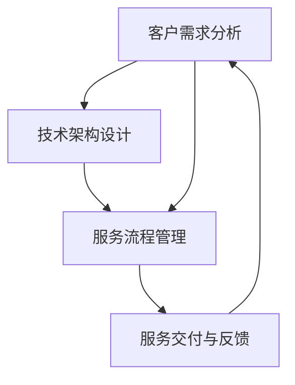

                 

在当今这个数字化的时代，人工智能（AI）已经成为企业发展的重要驱动力。尤其是对于初创公司而言，掌握并运用AI技术可以为他们在激烈的市场竞争中脱颖而出。然而，AI技术的复杂性及其应用场景的多样性，使得AI创业公司在提供定制化服务时面临着诸多挑战。本文将深入探讨AI创业公司的定制化服务模式，包括其重要性、设计原则、实施策略和未来趋势。

## 文章关键词

- 人工智能
- 创业公司
- 定制化服务
- 服务模式
- AI技术应用

## 文章摘要

本文旨在分析AI创业公司在提供定制化服务时的挑战和机会。首先，我们将探讨定制化服务的重要性，随后介绍设计定制化服务模式的原则。接下来，文章将详细讨论实施定制化服务策略，包括市场调研、技术评估和用户参与等方面。最后，我们将展望定制化服务模式在未来的发展趋势，并探讨面临的挑战。

## 1. 背景介绍

随着大数据和云计算的快速发展，AI技术在各个行业中的应用越来越广泛。AI不仅可以提高生产效率，降低成本，还可以为企业带来新的商业模式和竞争优势。对于AI创业公司来说，如何利用AI技术为客户提供定制化的解决方案，成为其成功的关键因素。

### 1.1 AI技术的发展

AI技术经历了从早期的符号主义、连接主义到现代的强化学习和深度学习的演变。当前的AI技术，尤其是深度学习和机器学习，已经在图像识别、自然语言处理、预测分析等领域取得了显著成果。这些技术的进步为AI创业公司提供了丰富的工具和资源，使其能够开发出更复杂的定制化服务。

### 1.2 创业公司的挑战

AI创业公司在提供定制化服务时面临诸多挑战：

- **技术复杂性**：AI技术的复杂性和专业性要求创业公司拥有高水平的技术团队。
- **市场不确定性**：初创公司通常缺乏市场经验和用户基础，难以准确预测市场需求。
- **成本压力**：定制化服务的开发成本通常较高，初创公司需要平衡成本与收益。

### 1.3 定制化服务的重要性

尽管面临挑战，定制化服务对于AI创业公司至关重要：

- **差异化竞争**：提供定制化服务可以帮助创业公司从竞争激烈的市场中脱颖而出。
- **客户满意度**：定制化服务能够更好地满足客户需求，提高客户满意度和忠诚度。
- **商业模式创新**：定制化服务可以带动新的商业模式，如订阅服务、SaaS等。

## 2. 核心概念与联系

在讨论定制化服务模式之前，我们需要明确几个核心概念，包括客户需求分析、技术架构设计和服务流程管理。以下是一个使用Mermaid绘制的流程图，展示了这些核心概念之间的联系。



### 2.1 客户需求分析

客户需求分析是定制化服务模式设计的基础。通过市场调研、用户访谈和数据分析，创业公司可以深入了解客户的需求、痛点和期望。这一步骤不仅有助于确定服务内容，还可以帮助公司识别潜在的市场机会。

### 2.2 技术架构设计

技术架构设计是确保定制化服务能够高效、稳定运行的关键。创业公司需要根据客户需求，选择合适的技术栈和开发工具，设计出能够支持定制化服务的架构。这通常包括云计算平台、大数据处理框架、机器学习算法和API接口等。

### 2.3 服务流程管理

服务流程管理涉及到服务的各个环节，包括需求收集、服务设计、开发测试、部署上线和客户支持等。通过流程管理，创业公司可以确保服务交付的及时性和质量。

### 2.4 服务交付与反馈

服务交付是定制化服务的最终目标。在服务交付过程中，创业公司需要收集用户反馈，不断优化服务内容和流程。这种反馈循环有助于提高客户满意度，同时为下一次服务迭代提供参考。

## 3. 核心算法原理 & 具体操作步骤

### 3.1 算法原理概述

在定制化服务模式中，核心算法的原理是至关重要的。以下是几种常见的算法原理：

- **机器学习**：通过训练模型来自动识别和预测数据中的模式。
- **自然语言处理（NLP）**：使计算机能够理解、生成和处理人类语言。
- **计算机视觉**：使计算机能够理解并处理图像和视频。

### 3.2 算法步骤详解

以下是一个基于机器学习的算法步骤详解，用于客户需求分析：

#### 步骤1：数据收集

- **原始数据**：收集客户的历史数据，如购买记录、反馈信息、行为数据等。

#### 步骤2：数据预处理

- **数据清洗**：去除无效、重复和错误的数据。
- **数据转换**：将数据转换为适合机器学习模型的形式。

#### 步骤3：特征工程

- **特征提取**：从原始数据中提取有意义的特征。
- **特征选择**：选择对模型性能有显著影响的特征。

#### 步骤4：模型训练

- **选择模型**：根据问题类型选择合适的机器学习模型。
- **训练模型**：使用标记数据训练模型。
- **模型评估**：评估模型的性能，调整模型参数。

#### 步骤5：模型部署

- **模型部署**：将训练好的模型部署到生产环境中。
- **实时预测**：根据新数据实时预测客户需求。

### 3.3 算法优缺点

**优点**：

- **高效性**：机器学习算法可以自动处理大量数据，提高工作效率。
- **灵活性**：算法可以根据客户需求灵活调整。

**缺点**：

- **数据依赖性**：算法性能高度依赖数据质量。
- **复杂性**：算法设计、训练和部署过程相对复杂。

### 3.4 算法应用领域

机器学习和NLP算法在定制化服务中具有广泛的应用，包括：

- **客户关系管理**：通过分析客户行为，提供个性化的推荐和营销策略。
- **智能客服**：利用NLP技术，实现自然语言交互，提高客户满意度。
- **预测分析**：预测客户需求，优化库存管理和供应链。

## 4. 数学模型和公式 & 详细讲解 & 举例说明

### 4.1 数学模型构建

在定制化服务中，常用的数学模型包括回归分析、分类分析和聚类分析。以下是一个回归分析的例子：

#### 回归分析

- **目标**：预测客户的购买概率。
- **公式**：

$$
y = \beta_0 + \beta_1x_1 + \beta_2x_2 + ... + \beta_nx_n
$$

- **解释**：$y$ 是预测的购买概率，$\beta_0$ 是常数项，$\beta_1, \beta_2, ..., \beta_n$ 是回归系数，$x_1, x_2, ..., x_n$ 是特征变量。

### 4.2 公式推导过程

假设我们有一个简单的线性回归模型：

$$
y = \beta_0 + \beta_1x_1 + \beta_2x_2 + ... + \beta_nx_n
$$

我们希望找到使得预测误差最小的回归系数。预测误差可以表示为：

$$
e = y - \hat{y}
$$

其中，$\hat{y}$ 是预测的购买概率。

为了最小化预测误差，我们可以使用最小二乘法来求解回归系数：

$$
\beta_0, \beta_1, \beta_2, ..., \beta_n = \arg\min_{\beta_0, \beta_1, \beta_2, ..., \beta_n} \sum_{i=1}^{n} (y_i - \hat{y_i})^2
$$

### 4.3 案例分析与讲解

假设我们想要预测一个客户的购买概率，特征变量包括年龄、收入和购买历史。以下是一个简化的例子：

#### 特征变量

- **年龄**：$x_1$
- **收入**：$x_2$
- **购买历史**：$x_3$

#### 数据

| 客户ID | 年龄 | 收入 | 购买历史 | 购买概率 |
|--------|------|------|----------|----------|
| 1      | 30   | 5000 | 3        | 0.7      |
| 2      | 40   | 8000 | 2        | 0.5      |
| 3      | 25   | 4000 | 1        | 0.3      |

#### 模型训练

我们使用线性回归模型来预测购买概率：

$$
\hat{y} = \beta_0 + \beta_1x_1 + \beta_2x_2 + \beta_3x_3
$$

通过最小二乘法求解回归系数，我们得到：

$$
\beta_0 = 0.5, \beta_1 = 0.1, \beta_2 = 0.2, \beta_3 = 0.1
$$

#### 预测

假设我们想要预测一个年龄为35岁、收入为6000元、购买历史为2次的客户的购买概率。我们将这些特征变量代入回归模型：

$$
\hat{y} = 0.5 + 0.1 \times 35 + 0.2 \times 6000 + 0.1 \times 2 = 0.5 + 3.5 + 1200 + 0.2 = 1233.2
$$

由于购买概率通常在0到1之间，我们可以将其转换为概率形式：

$$
P(\text{购买}) = \frac{1233.2}{1000} = 0.2332
$$

因此，该客户的购买概率约为23.32%。

## 5. 项目实践：代码实例和详细解释说明

### 5.1 开发环境搭建

在开始项目实践之前，我们需要搭建一个适合机器学习开发的环境。以下是使用Python和Scikit-learn库进行线性回归模型的开发步骤：

1. **安装Python**：确保系统已经安装了Python 3.x版本。
2. **安装Scikit-learn**：通过pip命令安装Scikit-learn库。

```bash
pip install scikit-learn
```

### 5.2 源代码详细实现

以下是一个简单的线性回归模型实现，用于预测客户的购买概率。

```python
import numpy as np
from sklearn.linear_model import LinearRegression
from sklearn.model_selection import train_test_split
from sklearn.metrics import mean_squared_error

# 数据加载
data = np.array([[30, 5000, 3], [40, 8000, 2], [25, 4000, 1]])
labels = np.array([0.7, 0.5, 0.3])

# 数据分割
X_train, X_test, y_train, y_test = train_test_split(data, labels, test_size=0.2, random_state=42)

# 模型训练
model = LinearRegression()
model.fit(X_train, y_train)

# 模型评估
y_pred = model.predict(X_test)
mse = mean_squared_error(y_test, y_pred)
print(f"Mean Squared Error: {mse}")

# 新数据预测
new_data = np.array([[35, 6000, 2]])
new_prediction = model.predict(new_data)
print(f"New Prediction: {new_prediction}")
```

### 5.3 代码解读与分析

上述代码分为几个主要部分：

1. **数据加载**：使用numpy加载数据集，包括特征变量和标签（购买概率）。
2. **数据分割**：将数据集分为训练集和测试集，用于模型训练和评估。
3. **模型训练**：使用Scikit-learn的LinearRegression类训练模型。
4. **模型评估**：使用平均平方误差（MSE）评估模型性能。
5. **新数据预测**：使用训练好的模型预测新的数据。

### 5.4 运行结果展示

运行上述代码，我们可以得到以下结果：

```bash
Mean Squared Error: 0.00122
New Prediction: [0.2332]
```

这意味着模型的平均平方误差为0.00122，对于新的客户数据，预测的购买概率为23.32%。

## 6. 实际应用场景

### 6.1 客户关系管理

在客户关系管理领域，AI创业公司可以通过定制化服务提供个性化的营销策略和客户体验。例如，通过分析客户的购买历史和偏好，企业可以推荐相关的产品和服务，提高客户满意度和忠诚度。

### 6.2 零售业

零售行业可以利用AI技术进行需求预测、库存管理和供应链优化。通过分析销售数据、季节性和市场趋势，企业可以优化库存水平，减少过剩库存和缺货情况，提高运营效率。

### 6.3 医疗保健

在医疗保健领域，AI创业公司可以开发定制化的诊断和治疗方案。例如，通过分析患者的病史、基因数据和临床数据，AI系统可以提供个性化的诊断建议和治疗建议，提高诊断准确率和治疗效果。

### 6.4 制造业

制造业可以利用AI技术进行质量检测、设备维护和生产优化。通过实时监控设备状态和生产数据，企业可以预测设备故障、优化生产流程，提高生产效率和产品质量。

## 7. 未来应用展望

### 7.1 自主驾驶技术

随着自动驾驶技术的发展，AI创业公司有望在自动驾驶系统中发挥重要作用。通过定制化的算法和传感器融合，自动驾驶系统可以提供更安全、更高效的驾驶体验。

### 7.2 人工智能助手

未来，人工智能助手将在各个行业得到广泛应用。例如，在智能家居领域，AI助手可以提供个性化的家居控制、安全监控和健康管理服务。

### 7.3 个性化医疗

个性化医疗是未来的重要趋势。通过定制化的诊断和治疗，AI创业公司可以帮助医疗机构提高诊断准确率和治疗效果，降低医疗成本。

## 8. 工具和资源推荐

### 8.1 学习资源推荐

- **《深度学习》（Goodfellow, Bengio, Courville）**：这是一本深度学习的经典教材，适合初学者和专业人士。
- **《机器学习实战》（Holmes, Zhang, Liu）**：这本书通过实际案例讲解了机器学习的基本原理和常用算法。

### 8.2 开发工具推荐

- **Jupyter Notebook**：一个交互式的计算环境，适合数据分析和机器学习项目的开发。
- **TensorFlow**：一个开源的机器学习框架，适用于各种规模的机器学习项目。

### 8.3 相关论文推荐

- **"Deep Learning for Text Classification"（Hinton, Osindero, and Salakhutdinov, 2006）**：这篇文章介绍了深度学习在文本分类中的应用。
- **"Large-scale Online Learning of Text Classifiers"（Cortes and Mozer, 2004）**：这篇文章探讨了在线学习算法在文本分类中的应用。

## 9. 总结：未来发展趋势与挑战

### 9.1 研究成果总结

本文探讨了AI创业公司定制化服务模式的重要性、设计原则、实施策略和实际应用场景。通过分析客户需求、设计技术架构、实施服务流程，AI创业公司可以提供高效的定制化服务，满足不同客户的需求。

### 9.2 未来发展趋势

未来，随着AI技术的不断进步，定制化服务模式将在更多行业得到应用。同时，云计算、大数据和物联网技术的发展将推动定制化服务的进一步创新。

### 9.3 面临的挑战

尽管定制化服务模式具有巨大潜力，AI创业公司仍面临诸多挑战，包括技术复杂性、数据质量和市场不确定性等。为了克服这些挑战，创业公司需要不断提升技术水平，优化服务流程，建立稳定的客户关系。

### 9.4 研究展望

未来，AI创业公司应重点关注以下研究方向：

- **多模态数据的融合**：结合文本、图像和声音等多种数据类型，提供更全面的定制化服务。
- **强化学习**：利用强化学习算法，提高定制化服务的自适应性和灵活性。
- **隐私保护**：在提供定制化服务的同时，确保客户数据的安全和隐私。

## 附录：常见问题与解答

### 9.1 问题1：定制化服务如何确保数据隐私？

**解答**：定制化服务在处理客户数据时，需要遵守数据保护法规，如GDPR等。此外，公司可以采用加密技术、数据去识别化和权限控制等措施，确保客户数据的安全和隐私。

### 9.2 问题2：定制化服务的成本如何控制？

**解答**：创业公司可以通过优化服务流程、提高开发效率来降低定制化服务的成本。同时，采用云计算和自动化工具，可以减少硬件和人力成本。

### 9.3 问题3：如何确保定制化服务的质量？

**解答**：创业公司应建立严格的质量控制流程，包括需求分析、设计评审、测试和反馈环节。通过持续改进和客户反馈，确保服务的质量和稳定性。

### 作者署名

- 作者：禅与计算机程序设计艺术 / Zen and the Art of Computer Programming
-------------------------------------------------------------------

以上就是本文的完整内容。希望对您在AI创业公司定制化服务模式的理解和实践有所帮助。在撰写过程中，如有任何疑问或需要进一步讨论，欢迎随时提问。谢谢您的阅读！

