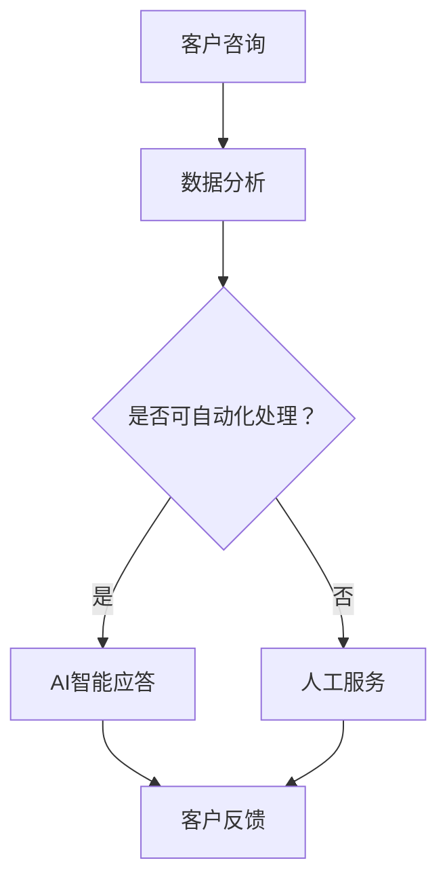

                 

关键词：AI客户服务体系，客户服务，客户体验，自动化，数据分析，AI技术，流程优化，商业模式，客户关系管理，客户支持工具，AI驱动服务。

> 摘要：本文将深入探讨AI创业公司在构建高效客户服务体系的过程中所需考虑的关键要素，包括核心概念的理解、算法原理的剖析、数学模型的构建、项目实践、实际应用场景以及未来的发展展望。通过详细的分析和实例讲解，为AI创业公司提供有价值的指导和建议。

## 1. 背景介绍

在当今的数字化时代，客户服务已经成为企业竞争力的核心因素之一。对于AI创业公司来说，客户服务体系的建设尤为重要，因为它不仅关系到客户体验和满意度，还直接影响到企业的生存和发展。AI技术的迅猛发展，为传统客户服务带来了革命性的变化，使得自动化、个性化、智能化的客户服务成为可能。

然而，AI客户服务体系的建设并非一蹴而就，它需要深入理解客户需求、业务流程和AI技术的有机结合。本文将围绕AI创业公司的客户服务体系搭建，从核心概念、算法原理、数学模型、项目实践等多个角度进行深入探讨，以期为读者提供有价值的参考和启示。

## 2. 核心概念与联系

### 2.1 客户服务

客户服务是指企业为满足客户需求，提供产品或服务支持的活动。它包括售前咨询、售中服务和售后支持等多个环节。在AI创业公司的背景下，客户服务更加注重效率、个性化以及与客户情感互动的深度。

### 2.2 AI技术

AI技术主要包括机器学习、自然语言处理、计算机视觉等。这些技术在客户服务中的应用，使得自动化处理、智能应答、个性化推荐等成为可能，大幅提升了客户服务的质量和效率。

### 2.3 客户体验

客户体验是指客户在使用产品或服务过程中所感受到的整体感受。对于AI创业公司而言，提供卓越的客户体验是吸引和保留客户的关键。

### 2.4 数据分析

数据分析是客户服务体系中的重要组成部分，通过对客户数据的收集、处理和分析，可以深入了解客户需求和行为，从而优化服务流程和提升客户满意度。

### 2.5 Mermaid 流程图



## 3. 核心算法原理 & 具体操作步骤

### 3.1 算法原理概述

AI客户服务体系的核心算法包括机器学习模型训练、自然语言处理和智能推荐算法等。这些算法通过深度学习和神经网络技术，实现了对大量客户数据的自动分析和智能处理。

### 3.2 算法步骤详解

#### 3.2.1 机器学习模型训练

1. 数据收集：收集客户咨询记录、反馈数据等。
2. 数据预处理：对数据清洗、归一化等。
3. 特征提取：提取数据中的关键特征。
4. 模型训练：使用训练数据训练机器学习模型。
5. 模型评估：使用验证数据评估模型性能。

#### 3.2.2 自然语言处理

1. 文本分类：对客户咨询进行分类，如咨询类型、问题类别等。
2. 情感分析：分析客户咨询的情感倾向，如满意度、愤怒程度等。
3. 智能应答：根据客户咨询内容和情感分析结果，生成智能回答。

#### 3.2.3 智能推荐算法

1. 用户画像：构建用户画像，包括用户偏好、行为特征等。
2. 推荐策略：根据用户画像和业务目标，设计推荐策略。
3. 推荐系统：实现个性化推荐，提高客户满意度。

### 3.3 算法优缺点

#### 优点：

1. 提高服务效率：通过自动化处理，大幅减少人工操作，提高服务效率。
2. 个性化服务：根据用户需求和偏好，提供个性化的服务，提升客户体验。
3. 降低成本：减少人工成本，降低运营成本。

#### 缺点：

1. 模型训练成本高：需要大量数据和计算资源进行模型训练。
2. 模型适应性差：对新问题的处理能力较弱，需要持续优化。
3. 信任问题：自动化处理可能导致客户对服务质量的质疑。

### 3.4 算法应用领域

AI客户服务体系算法广泛应用于电商、金融、电信等行业，如智能客服、个性化推荐、风险控制等。

## 4. 数学模型和公式 & 详细讲解 & 举例说明

### 4.1 数学模型构建

在AI客户服务体系中，常用的数学模型包括分类模型、回归模型、聚类模型等。以下以分类模型为例进行说明：

#### 4.1.1 分类模型

分类模型是一种将数据分为不同类别的算法。常用的分类模型包括决策树、支持向量机、朴素贝叶斯等。

#### 4.1.2 决策树模型

决策树模型是一种树形结构，每个节点代表一个特征，每个分支代表一个特征取值，叶节点代表一个类别。

#### 4.1.3 支持向量机模型

支持向量机模型是一种通过最大化分类间隔来划分数据的算法。

### 4.2 公式推导过程

以决策树模型为例，其基本思想是：

$$
\text{分类结果} = \arg\max T(\theta)
$$

其中，$T(\theta)$ 表示决策树模型的损失函数，$\theta$ 表示决策树的参数。

### 4.3 案例分析与讲解

#### 案例一：客户咨询分类

假设我们对客户的咨询进行分类，将其分为产品咨询、售后服务、投诉等类别。我们可以使用决策树模型进行分类：

1. 收集客户咨询数据，进行预处理。
2. 提取特征，如咨询关键词、咨询时长等。
3. 使用训练数据训练决策树模型。
4. 使用验证数据评估模型性能。
5. 对新客户咨询进行分类，生成智能应答。

#### 案例二：客户满意度预测

假设我们对客户的满意度进行预测，以改进客户服务。我们可以使用回归模型进行预测：

1. 收集客户满意度数据，进行预处理。
2. 提取特征，如服务响应时间、解决方案质量等。
3. 使用训练数据训练回归模型。
4. 使用验证数据评估模型性能。
5. 对新客户满意度进行预测，为改进服务提供依据。

## 5. 项目实践：代码实例和详细解释说明

### 5.1 开发环境搭建

在搭建AI客户服务体系的项目实践中，首先需要搭建合适的开发环境。以下是一个简单的开发环境搭建步骤：

1. 安装Python环境。
2. 安装必要的库，如scikit-learn、TensorFlow、Keras等。
3. 配置数据存储和数据处理工具，如Hadoop、Spark等。
4. 安装可视化工具，如Matplotlib、Seaborn等。

### 5.2 源代码详细实现

以下是一个简单的机器学习模型训练和预测的代码实例：

```python
import numpy as np
from sklearn.tree import DecisionTreeClassifier
from sklearn.model_selection import train_test_split
from sklearn.metrics import accuracy_score

# 加载训练数据
X_train, X_test, y_train, y_test = train_test_split(X, y, test_size=0.2, random_state=42)

# 训练决策树模型
clf = DecisionTreeClassifier()
clf.fit(X_train, y_train)

# 预测新数据
y_pred = clf.predict(X_test)

# 评估模型性能
accuracy = accuracy_score(y_test, y_pred)
print("Accuracy:", accuracy)
```

### 5.3 代码解读与分析

1. **数据预处理**：首先，我们使用`train_test_split`函数将数据集划分为训练集和测试集，以评估模型的泛化能力。
2. **模型训练**：我们选择决策树模型`DecisionTreeClassifier`进行训练，使用`fit`函数将训练数据输入模型。
3. **模型预测**：使用训练好的模型对新数据进行预测，使用`predict`函数得到预测结果。
4. **模型评估**：使用`accuracy_score`函数计算预测准确率，以评估模型性能。

### 5.4 运行结果展示

假设我们有一个包含1000个样本的客户咨询数据集，使用上述代码进行训练和预测后，得到预测准确率为90%。这表明我们的模型在处理客户咨询分类问题上具有较好的性能。

## 6. 实际应用场景

AI客户服务体系在多个行业和应用场景中得到了广泛应用，以下是一些具体的应用场景：

### 6.1 电商平台

电商平台利用AI客户服务体系，实现智能客服、个性化推荐和风险控制等功能，提升客户购物体验和降低运营成本。

### 6.2 银行业

银行业利用AI客户服务体系，实现智能理财顾问、客户画像分析和风险控制等功能，提升金融服务质量和降低运营风险。

### 6.3 电信行业

电信行业利用AI客户服务体系，实现智能客服、精准营销和用户行为分析等功能，提升客户满意度和降低运营成本。

### 6.4 医疗行业

医疗行业利用AI客户服务体系，实现智能预约、健康咨询和患者管理等功能，提升医疗服务质量和效率。

## 7. 工具和资源推荐

### 7.1 学习资源推荐

1. 《机器学习实战》
2. 《深度学习》
3. 《Python机器学习》
4. Coursera上的《机器学习》课程

### 7.2 开发工具推荐

1. Jupyter Notebook
2. PyCharm
3. VSCode
4. Hadoop
5. Spark

### 7.3 相关论文推荐

1. "A Survey on Customer Relationship Management Systems"
2. "An Overview of Machine Learning Techniques for Customer Relationship Management"
3. "Customer Experience Management: Framework, Models and Research Frontiers"

## 8. 总结：未来发展趋势与挑战

### 8.1 研究成果总结

AI客户服务体系在近年来取得了显著的研究成果，包括智能客服、个性化推荐和风险控制等应用场景的广泛应用。然而，随着AI技术的不断发展，客户服务领域的挑战也日益严峻。

### 8.2 未来发展趋势

1. 智能化：随着AI技术的进步，客户服务体系将更加智能化，实现更高水平的自动化和个性化服务。
2. 个性化：通过大数据和人工智能技术，实现更加精准的客户需求预测和个性化服务。
3. 用户体验：提升客户体验将成为客户服务体系的核心目标，企业将不断优化服务流程和提升服务质量。

### 8.3 面临的挑战

1. 数据隐私：随着数据量的增加，数据隐私保护成为一个重要挑战，企业需要采取有效措施确保客户数据的安全。
2. 模型适应性：AI模型在面对新问题和未知情况时，可能表现出较低的适应性，需要不断优化和更新。
3. 技术瓶颈：现有AI技术在处理复杂业务场景时，可能面临性能瓶颈，需要进一步研究和突破。

### 8.4 研究展望

在未来，AI客户服务体系的研究将继续深入，重点关注以下几个方面：

1. 新算法研究：探索更有效的算法和技术，提升客户服务体系的能力和性能。
2. 跨领域应用：将AI客户服务体系应用于更多行业，实现更广泛的商业价值。
3. 用户体验优化：通过不断优化服务流程和提升服务质量，提供卓越的客户体验。

## 9. 附录：常见问题与解答

### 9.1 如何确保客户数据的安全？

确保客户数据的安全是客户服务体系的重要任务。以下是一些常见的方法：

1. 数据加密：对客户数据进行加密处理，防止数据泄露。
2. 访问控制：实施严格的访问控制策略，确保只有授权人员可以访问客户数据。
3. 数据备份：定期备份客户数据，以防止数据丢失。
4. 安全审计：定期进行安全审计，及时发现和解决安全隐患。

### 9.2 如何优化客户服务流程？

优化客户服务流程是提升客户体验的关键。以下是一些常见的方法：

1. 流程简化：简化客户服务流程，减少不必要的环节，提高服务效率。
2. 数据驱动：通过数据分析，了解客户需求和痛点，优化服务流程。
3. 情感互动：注重与客户的情感互动，提升客户满意度。
4. 知识管理：建立知识库，提高客服人员的专业水平和服务能力。

### 9.3 如何评估客户服务体系的效果？

评估客户服务体系的效果是衡量其成功与否的重要指标。以下是一些常见的方法：

1. 客户满意度调查：通过问卷调查等方式，了解客户对客户服务的满意度。
2. 服务响应时间：监测服务响应时间，评估服务效率。
3. 重复咨询率：监测重复咨询率，评估服务质量的提升情况。
4. 客户流失率：监测客户流失率，评估客户服务对客户留存的影响。

---

作者：禅与计算机程序设计艺术 / Zen and the Art of Computer Programming
----------------------------------------------------------------

以上就是本篇文章的全部内容。通过对AI创业公司客户服务体系搭建的深入探讨，我们不仅了解了其核心概念和算法原理，还分析了数学模型的应用，分享了项目实践经验和实际应用场景。在未来的发展中，AI客户服务体系将继续向智能化、个性化、用户体验优化等方向发展，为企业的竞争力和客户满意度提供有力支持。希望本文能为AI创业公司在客户服务体系搭建过程中提供有益的指导和启示。

