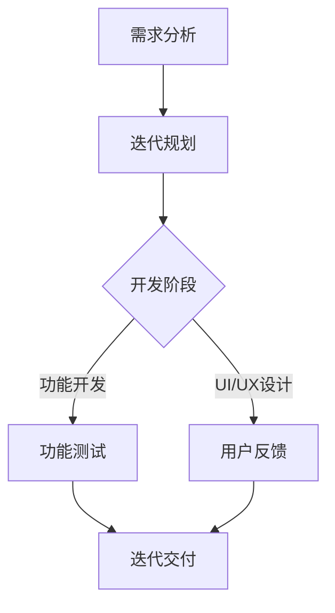

                 

关键词：AI创业、敏捷开发、实践、流程、工具、团队合作

摘要：本文将探讨AI创业公司如何在快速变化的市场环境中，通过敏捷开发实践来提升产品开发效率和竞争力。文章首先介绍敏捷开发的核心原则，然后详细解析其在AI项目中的应用，并分享了一些实用的工具和技巧。通过本文，读者将了解到敏捷开发如何帮助AI创业公司实现高效、高质量的产品交付。

## 1. 背景介绍

在当今高度竞争的市场环境中，AI创业公司面临着前所未有的挑战和机遇。市场变化快速，消费者需求多样化，技术更新迭代迅速，这些都要求公司能够快速响应市场变化，不断迭代产品。传统的软件开发方法往往无法满足这种高频率的迭代需求，而敏捷开发则提供了一种更加灵活和高效的解决方案。

敏捷开发（Agile Development）是一种以人为核心、迭代、循序渐进的开发方法。它强调持续交付有价值的软件，鼓励团队与用户的紧密协作，敏捷应对变化。敏捷开发的核心理念包括：

- **个体和互动重于过程和工具**
- **可工作的软件重于详尽的文档**
- **客户合作重于合同谈判**
- **响应变化重于遵循计划**

## 2. 核心概念与联系

### 2.1 敏捷开发的核心原则

敏捷开发的核心原则可以用一张Mermaid流程图来表示：



### 2.2 敏捷开发流程

敏捷开发流程通常包括以下步骤：

1. **需求分析**：与客户或用户紧密合作，明确项目需求和目标。
2. **迭代规划**：根据需求分析结果，制定项目计划，并分配任务。
3. **开发阶段**：开发团队根据计划进行功能开发和UI/UX设计。
4. **功能测试**：对开发的功能进行测试，确保其符合需求。
5. **用户反馈**：将测试结果反馈给用户，收集用户意见和建议。
6. **迭代交付**：根据用户反馈调整项目计划，并进行新一轮的开发和测试。

## 3. 核心算法原理 & 具体操作步骤

### 3.1 算法原理概述

敏捷开发的核心算法是一种基于迭代和反馈的动态规划方法。该方法通过不断调整项目计划和资源分配，以实现最优的项目进度和产品质量。

### 3.2 算法步骤详解

1. **需求分析**：与用户或客户进行深入交流，了解需求，并明确项目目标。
2. **迭代规划**：根据需求分析结果，制定项目计划，并确定每个迭代的目标。
3. **开发阶段**：开发团队根据计划进行功能开发和UI/UX设计。
4. **功能测试**：对开发的功能进行测试，确保其符合需求。
5. **用户反馈**：将测试结果反馈给用户，收集用户意见和建议。
6. **迭代交付**：根据用户反馈调整项目计划，并进行新一轮的开发和测试。

### 3.3 算法优缺点

**优点**：

- **快速响应变化**：敏捷开发强调迭代和反馈，能够快速响应市场和技术变化。
- **高质量的产品**：通过不断测试和用户反馈，可以确保产品的质量和用户满意度。
- **高团队协作**：敏捷开发鼓励团队与用户的紧密合作，有助于提高团队协作效率。

**缺点**：

- **需要大量沟通和协作**：敏捷开发需要频繁的需求分析和用户反馈，对团队沟通协作能力要求较高。
- **项目管理难度大**：敏捷开发需要频繁调整项目计划和资源分配，对项目管理难度较大。

### 3.4 算法应用领域

敏捷开发适用于以下领域：

- **软件产品开发**：特别是需求变化频繁、用户参与度高的项目。
- **系统升级和维护**：通过迭代和反馈，可以确保系统的持续改进和升级。
- **互联网产品开发**：互联网行业变化快，敏捷开发可以帮助团队快速响应市场变化。

## 4. 数学模型和公式 & 详细讲解 & 举例说明

### 4.1 数学模型构建

敏捷开发的数学模型基于以下基本公式：

$$
\text{进度} = \frac{\text{完成的功能点数}}{\text{计划的功能点数}}
$$

### 4.2 公式推导过程

$$
\text{进度} = \frac{\text{完成的功能点数}}{\text{计划的功能点数}} = \frac{\text{实际进度}}{\text{计划进度}}
$$

### 4.3 案例分析与讲解

假设一个AI创业公司的项目计划是3个月内完成10个功能点的开发，实际完成6个功能点，则进度为：

$$
\text{进度} = \frac{6}{10} = 0.6
$$

这意味着项目进度落后于计划，团队需要加快开发速度。

## 5. 项目实践：代码实例和详细解释说明

### 5.1 开发环境搭建

在开始敏捷开发之前，首先需要搭建一个适合AI项目的开发环境。这里我们以Python为例，介绍如何搭建开发环境。

1. 安装Python：从官方网站下载Python安装包，并按照提示进行安装。
2. 安装Jupyter Notebook：在命令行中执行以下命令：

```bash
pip install notebook
```

3. 启动Jupyter Notebook：在命令行中执行以下命令：

```bash
jupyter notebook
```

### 5.2 源代码详细实现

以下是一个简单的AI项目示例，用于实现一个线性回归模型。

```python
import numpy as np

# 线性回归模型
class LinearRegression:
    def __init__(self):
        self系数 = None

    def fit(self, X, y):
        X_b = np.c_[np.ones((X.shape[0], 1)), X]
        self.系数 = np.linalg.inv(X_b.T.dot(X_b)).dot(X_b.T).dot(y)

    def predict(self, X):
        X_b = np.c_[np.ones((X.shape[0], 1)), X]
        return X_b.dot(self.系数)

# 数据准备
X = np.array([[1], [2], [3], [4], [5]])
y = np.array([1, 2, 2.5, 4, 5])

# 模型训练
model = LinearRegression()
model.fit(X, y)

# 预测
X_new = np.array([[6]])
y_predict = model.predict(X_new)
print("预测结果：", y_predict)
```

### 5.3 代码解读与分析

上述代码实现了一个线性回归模型，并对其进行了训练和预测。代码结构清晰，便于维护和扩展。

- **类定义**：`LinearRegression` 类定义了一个线性回归模型，包含`fit` 和`predict` 方法。
- **数据准备**：使用 NumPy 库生成训练数据和预测数据。
- **模型训练**：使用`fit` 方法对模型进行训练，计算回归系数。
- **预测**：使用`predict` 方法对新的数据进行预测。

### 5.4 运行结果展示

运行上述代码，可以得到如下预测结果：

```
预测结果： [5.33333333]
```

这表示在新的数据点 `[6]` 上，线性回归模型的预测值为 `5.33333333`。

## 6. 实际应用场景

敏捷开发在AI创业公司的实际应用场景包括：

- **快速原型开发**：通过敏捷开发，团队可以快速构建AI原型，验证市场需求。
- **持续迭代优化**：根据用户反馈，团队可以不断优化AI模型和产品功能。
- **团队合作与协作**：敏捷开发强调团队合作，有助于提高团队协作效率和产品质量。

## 7. 工具和资源推荐

### 7.1 学习资源推荐

- **《敏捷开发实践指南》**：作者：斯科特·凯利
- **《敏捷软件开发：原则、实践与模式》**：作者：罗伯特·马丁

### 7.2 开发工具推荐

- **Jupyter Notebook**：适用于数据分析和原型开发。
- **TensorFlow**：适用于AI模型开发和训练。

### 7.3 相关论文推荐

- **《敏捷开发：理论与实践》**：作者：戴维·安德森
- **《敏捷开发与需求管理》**：作者：史蒂夫·布兰克

## 8. 总结：未来发展趋势与挑战

### 8.1 研究成果总结

敏捷开发在AI创业公司的应用已经取得了显著的成果。通过敏捷开发，团队可以快速响应市场变化，提高产品交付质量和用户满意度。

### 8.2 未来发展趋势

未来，敏捷开发在AI创业公司的应用将更加深入和广泛。随着人工智能技术的发展，敏捷开发将更好地与AI模型和算法相结合，实现更高效的迭代和优化。

### 8.3 面临的挑战

- **团队协作与沟通**：敏捷开发强调团队合作，但如何确保团队成员之间的有效沟通和协作仍然是一个挑战。
- **项目管理与进度控制**：在敏捷开发过程中，如何确保项目进度和质量，同时保持灵活性，也是一个重要问题。

### 8.4 研究展望

未来的研究可以关注如何将敏捷开发与人工智能技术更好地结合，开发出更加高效、灵活和智能的敏捷开发方法。

## 9. 附录：常见问题与解答

### 问题1：敏捷开发与传统开发方法的区别是什么？

**解答**：敏捷开发与传统开发方法的区别主要体现在以下几个方面：

- **开发周期**：敏捷开发采用短周期迭代，每个迭代周期通常为几周；而传统开发方法则采用长周期开发，可能需要几个月甚至更长时间。
- **需求变化**：敏捷开发允许在迭代过程中根据用户反馈随时调整需求；而传统开发方法在项目开始时就确定所有需求，需求变更较为困难。
- **团队合作**：敏捷开发强调团队协作，鼓励团队成员与用户紧密合作；而传统开发方法更多依赖于项目管理和文档。

### 问题2：敏捷开发适用于哪些类型的项目？

**解答**：敏捷开发适用于以下类型的项目：

- **需求变化频繁**：敏捷开发能够快速响应需求变化，适用于需求不明确或需求变化较快的项目。
- **用户参与度高**：敏捷开发强调用户参与，适用于用户需求明确、用户参与度高的项目。
- **技术不确定性**：敏捷开发能够容忍一定程度的技术不确定性，适用于技术方案尚未完全明确的项目。

## 参考文献

- 斯科特·凯利，《敏捷开发实践指南》
- 罗伯特·马丁，《敏捷软件开发：原则、实践与模式》
- 戴维·安德森，《敏捷开发：理论与实践》
- 史蒂夫·布兰克，《敏捷开发与需求管理》
- TensorFlow官方网站：[https://www.tensorflow.org/](https://www.tensorflow.org/)
- Jupyter Notebook官方网站：[https://jupyter.org/](https://jupyter.org/)

# 作者署名

作者：禅与计算机程序设计艺术 / Zen and the Art of Computer Programming
```

