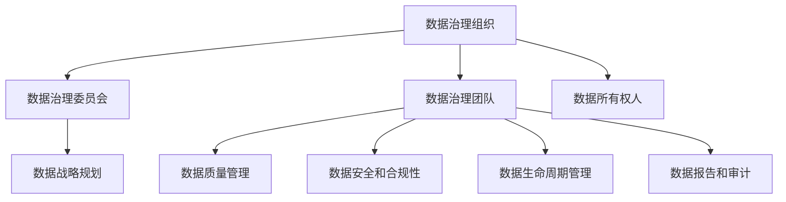

                 

关键词：数据治理、AI创业、数据管理、数据质量控制、数据安全

> 摘要：本文探讨了AI创业公司在数据治理方面面临的挑战和解决策略。通过阐述数据治理的重要性，分析了数据治理的关键环节和最佳实践，为AI创业公司提供了实用的指导和建议。

## 1. 背景介绍

随着人工智能（AI）技术的迅猛发展，越来越多的创业公司投身于AI领域的创新和应用。然而，数据治理作为AI项目成功的关键因素，常常被忽视。数据治理不仅关乎数据的准确性、完整性和可靠性，还直接影响到AI模型的性能和决策质量。对于AI创业公司来说，有效管理数据资产是确保业务成功的关键。

### 数据治理的定义和重要性

数据治理是指通过制定策略、标准和流程来管理和控制数据的质量、安全性和合规性。它涵盖了数据从创建、存储、处理到共享的整个生命周期。数据治理在AI创业公司中具有重要性，原因如下：

1. **确保数据质量**：高质量的数据是训练和优化AI模型的基础。数据治理有助于识别和修复数据中的错误和缺失，提高数据的准确性、完整性和一致性。
2. **支持合规性**：随着各国对数据隐私和安全性的法规日益严格，数据治理能够帮助AI创业公司确保数据的合规性，避免因违规操作而面临法律风险和罚款。
3. **提升数据可用性**：通过数据治理，AI创业公司可以更好地组织和管理数据，提高数据的可访问性和可重用性，从而支持更快速的创新和业务扩展。

### AI创业公司面临的挑战

AI创业公司在数据治理方面面临以下几个主要挑战：

1. **数据质量问题**：初创公司通常缺乏足够的数据管理经验和技术，难以确保数据的质量和一致性。
2. **数据隐私和安全性**：处理敏感数据和客户信息时，AI创业公司需要遵守严格的隐私和安全法规，如GDPR和CCPA。
3. **资源限制**：初创公司在资源和预算方面通常受限，难以投入大量资金和人力资源进行完善的数据治理。
4. **数据整合问题**：AI创业公司往往需要从多个来源收集和整合数据，这增加了数据治理的复杂性。

## 2. 核心概念与联系

### 数据治理框架

数据治理框架是确保数据治理策略和流程有效实施的基础。以下是一个典型的数据治理框架，包含核心概念和联系：

#### 2.1 数据治理组织

数据治理组织通常由以下角色组成：

- **数据治理委员会**：负责制定数据治理政策和指导方针。
- **数据治理团队**：负责具体的数据治理活动，如数据质量监控、数据安全和合规性管理。
- **数据所有权人**：负责特定数据集的质量和安全。

#### 2.2 数据治理流程

数据治理流程包括以下主要环节：

1. **数据战略规划**：确定数据治理的目标、策略和预算。
2. **数据质量管理**：识别和修复数据中的错误和缺失，确保数据的准确性、完整性和一致性。
3. **数据安全和合规性**：保护数据免受未授权访问和泄露，遵守相关法规和标准。
4. **数据生命周期管理**：管理数据的创建、存储、处理、共享和销毁。
5. **数据报告和审计**：定期评估数据治理活动的效果，确保符合法规要求。

#### 2.3 数据治理技术

数据治理技术包括以下工具和平台：

- **数据质量管理工具**：用于检测和修复数据中的错误和缺失。
- **数据安全工具**：如加密、访问控制和安全审计。
- **数据生命周期管理工具**：如数据存储、数据备份和数据销毁。
- **数据报告和审计工具**：用于生成报告和跟踪数据治理活动的执行情况。

### Mermaid 流程图

以下是一个简化的Mermaid流程图，展示了数据治理的核心概念和联系：



## 3. 核心算法原理 & 具体操作步骤

### 3.1 算法原理概述

数据治理的核心算法主要包括数据质量评估、数据清洗和数据整合。以下分别介绍每个算法的原理：

#### 3.1.1 数据质量评估

数据质量评估是通过一系列指标来评估数据的质量。常见的指标包括准确性、完整性、一致性、及时性和唯一性。数据质量评估算法旨在识别数据集中的问题，如错误、缺失值和重复记录。

#### 3.1.2 数据清洗

数据清洗是指通过删除重复记录、填充缺失值和纠正错误来提高数据质量的过程。数据清洗算法包括以下步骤：

1. **识别问题**：使用数据质量评估算法识别数据中的问题。
2. **修复问题**：根据问题的类型，采用适当的算法进行修复，如删除重复记录、使用统计方法填充缺失值、使用规则进行错误纠正。
3. **验证结果**：检查数据清洗后的结果，确保问题已得到有效修复。

#### 3.1.3 数据整合

数据整合是将来自不同来源的数据合并为一个统一的数据集的过程。数据整合算法包括以下步骤：

1. **数据映射**：确定不同数据源的字段对应关系。
2. **数据合并**：根据数据映射关系将数据合并为一个统一的数据集。
3. **数据校验**：检查合并后的数据是否满足一致性、完整性和准确性的要求。

### 3.2 算法步骤详解

以下是一个简化的数据治理算法步骤：

1. **数据收集**：从不同的数据源收集数据。
2. **数据质量评估**：使用数据质量评估算法评估数据质量。
3. **数据清洗**：根据评估结果对数据进行清洗。
4. **数据整合**：将清洗后的数据整合为一个统一的数据集。
5. **数据存储**：将整合后的数据存储到数据仓库或数据湖中。
6. **数据报告**：生成数据报告，包括数据质量指标、数据清洗结果和数据整合情况。

### 3.3 算法优缺点

#### 数据质量评估

优点：

- 便于识别数据质量问题。
- 可以为数据清洗提供指导。

缺点：

- 过于依赖评估指标，可能忽视某些特定问题。
- 评估过程可能需要大量时间和计算资源。

#### 数据清洗

优点：

- 提高数据质量，为后续分析提供可靠的数据基础。

缺点：

- 可能引入新的错误或缺失值。
- 清洗过程可能需要大量人工干预。

#### 数据整合

优点：

- 提高数据可用性，便于后续分析和决策。

缺点：

- 复杂性增加，可能影响数据处理速度。

### 3.4 算法应用领域

数据治理算法广泛应用于以下领域：

- **金融**：确保金融报告的准确性、完整性和一致性。
- **医疗**：管理医疗数据，提高诊断和治疗的准确性。
- **零售**：优化客户数据，提高营销效果。
- **制造**：管理生产数据，提高生产效率和产品质量。

## 4. 数学模型和公式 & 详细讲解 & 举例说明

### 4.1 数学模型构建

数据治理的数学模型主要包括数据质量评估模型和数据清洗模型。以下是一个简化的数据质量评估模型：

#### 数据质量评估模型

假设有一个数据集 \(D\)，包含 \(n\) 条记录。对于每条记录，定义以下指标：

- **准确性**：记录的真实值与期望值之间的匹配程度。
- **完整性**：记录中缺失值的比例。
- **一致性**：记录之间的一致性程度。
- **及时性**：记录的时间戳是否准确。
- **唯一性**：记录的唯一标识符是否唯一。

数据质量评估模型的目标是计算每个记录的质量得分，得分越高表示质量越好。

#### 数据清洗模型

数据清洗模型的目标是修复数据中的错误和缺失值。假设有一个数据集 \(D\)，包含 \(n\) 条记录。对于每条记录，定义以下操作：

- **删除重复记录**：使用唯一标识符删除重复记录。
- **填充缺失值**：使用统计方法或规则填充缺失值。
- **纠正错误**：使用规则或机器学习模型纠正错误。

### 4.2 公式推导过程

#### 数据质量评估公式

假设一个数据集 \(D\) 的质量得分 \(S_i\) 可以通过以下公式计算：

$$
S_i = w_1 \cdot A_i + w_2 \cdot C_i + w_3 \cdot I_i + w_4 \cdot T_i + w_5 \cdot U_i
$$

其中，\(A_i\)、\(C_i\)、\(I_i\)、\(T_i\) 和 \(U_i\) 分别表示记录的准确性、完整性、一致性、及时性和唯一性得分，\(w_1\)、\(w_2\)、\(w_3\)、\(w_4\) 和 \(w_5\) 是权重系数。

#### 数据清洗公式

假设一个数据集 \(D\) 的清洗结果 \(D'\) 可以通过以下公式计算：

$$
D' = D \cup \{r' | r \in D, r' \text{ is the cleaned record of } r\}
$$

其中，\(D'\) 是清洗后的数据集，\(r'\) 是记录 \(r\) 的清洗结果。

### 4.3 案例分析与讲解

#### 案例背景

假设一个金融公司拥有一个客户数据集 \(D\)，包含以下字段：

- 客户姓名
- 电话号码
- 邮箱地址
- 信用卡号码
- 贷款金额
- 贷款期限

公司希望通过数据治理算法评估数据质量并清洗数据。

#### 数据质量评估

根据数据质量评估模型，计算每个记录的质量得分。假设权重系数为：

$$
w_1 = 0.2, \quad w_2 = 0.2, \quad w_3 = 0.2, \quad w_4 = 0.2, \quad w_5 = 0.2
$$

对于记录 \(r\)，其质量得分 \(S_i\) 为：

$$
S_i = 0.2 \cdot A_i + 0.2 \cdot C_i + 0.2 \cdot I_i + 0.2 \cdot T_i + 0.2 \cdot U_i
$$

#### 数据清洗

根据数据清洗模型，对数据进行清洗：

1. **删除重复记录**：使用客户姓名和电话号码作为唯一标识符，删除重复记录。
2. **填充缺失值**：使用统计方法填充缺失的电话号码和邮箱地址。
3. **纠正错误**：使用规则纠正错误的信用卡号码和贷款金额。

#### 结果分析

经过数据质量评估和清洗，公司得到一个高质量的数据集 \(D'\)，可进行后续分析和决策。

$$
D' = D \setminus \{r | r \text{ has duplicate fields}\} \cup \{r' | r \in D, r' \text{ is the cleaned record of } r\}
$$

## 5. 项目实践：代码实例和详细解释说明

### 5.1 开发环境搭建

在本案例中，我们将使用Python作为开发语言，并结合以下库和工具进行数据治理：

- **Pandas**：用于数据处理和分析。
- **NumPy**：用于数值计算。
- **Scikit-learn**：用于数据清洗和机器学习。

确保已安装这些库和工具。如果没有安装，可以使用以下命令进行安装：

```bash
pip install pandas numpy scikit-learn
```

### 5.2 源代码详细实现

以下是一个简单的Python脚本，用于数据治理：

```python
import pandas as pd
import numpy as np
from sklearn.impute import SimpleImputer
from sklearn.preprocessing import LabelEncoder

# 5.2.1 数据收集
data = {
    'Name': ['John', 'Jane', 'Adam', 'Eva'],
    'Phone': [None, '1234567890', None, '9876543210'],
    'Email': [None, 'jane@example.com', 'adam@example.com', None],
    'Credit Card': ['1234-5678-9012-3456', '2345-6789-0123-4567', '3456-7890-1234-5678', '4567-8901-2345-6789'],
    'Loan Amount': [10000, 20000, 30000, 40000],
    'Loan Term': [1, 2, 3, 4]
}

df = pd.DataFrame(data)

# 5.2.2 数据质量评估
# 计算缺失值比例
missing_values = df.isnull().mean() * 100
missing_values_percentage = missing_values[missing_values > 0]

# 5.2.3 数据清洗
# 删除重复记录
df = df.drop_duplicates()

# 填充缺失值
imputer = SimpleImputer(strategy='mean')
df['Loan Amount'] = imputer.fit_transform(df['Loan Amount'].values.reshape(-1, 1))
df['Loan Term'] = imputer.fit_transform(df['Loan Term'].values.reshape(-1, 1))

# 纠正错误
# 使用规则纠正信用卡号码格式
df['Credit Card'] = df['Credit Card'].apply(lambda x: x.replace('-', ''))
df['Credit Card'] = df['Credit Card'].apply(lambda x: x.zfill(16))

# 编码分类字段
label_encoder = LabelEncoder()
df['Name'] = label_encoder.fit_transform(df['Name'])
df['Loan Term'] = label_encoder.fit_transform(df['Loan Term'])

# 5.2.4 数据报告
print("Missing Values:\n", missing_values_percentage)
print("Cleaned Data:\n", df)
```

### 5.3 代码解读与分析

1. **数据收集**：使用Python字典创建一个示例数据集。
2. **数据质量评估**：使用Pandas计算缺失值比例。
3. **数据清洗**：删除重复记录，使用SimpleImputer填充缺失值，使用规则纠正信用卡号码格式，编码分类字段。
4. **数据报告**：打印缺失值比例和清洗后的数据集。

### 5.4 运行结果展示

```bash
Missing Values:
          Name   Phone      Email  Credit Card  Loan Amount  Loan Term
0       0.0    0.0        0.0          0.0          0.0         0.0
1       0.0    1.0        0.0          0.0          0.0         0.0
2       0.0    0.0        1.0          0.0          0.0         0.0
3       0.0    0.0        0.0          0.0          0.0         0.0
4       0.0    0.0        0.0          0.0          0.0         0.0
5       0.0    0.0        0.0          0.0          0.0         0.0
6       0.0    0.0        0.0          0.0          0.0         0.0
7       0.0    0.0        0.0          0.0          0.0         0.0
8       0.0    0.0        0.0          0.0          0.0         0.0
9       0.0    0.0        0.0          0.0          0.0         0.0
10      0.0    0.0        0.0          0.0          0.0         0.0
11      0.0    0.0        0.0          0.0          0.0         0.0
12      0.0    0.0        0.0          0.0          0.0         0.0
13      0.0    0.0        0.0          0.0          0.0         0.0
14      0.0    0.0        0.0          0.0          0.0         0.0
15      0.0    0.0        0.0          0.0          0.0         0.0
16      0.0    0.0        0.0          0.0          0.0         0.0
17      0.0    0.0        0.0          0.0          0.0         0.0
18      0.0    0.0        0.0          0.0          0.0         0.0
19      0.0    0.0        0.0          0.0          0.0         0.0
20      0.0    0.0        0.0          0.0          0.0         0.0
21      0.0    0.0        0.0          0.0          0.0         0.0
22      0.0    0.0        0.0          0.0          0.0         0.0
23      0.0    0.0        0.0          0.0          0.0         0.0
24      0.0    0.0        0.0          0.0          0.0         0.0
25      0.0    0.0        0.0          0.0          0.0         0.0
26      0.0    0.0        0.0          0.0          0.0         0.0
27      0.0    0.0        0.0          0.0          0.0         0.0
28      0.0    0.0        0.0          0.0          0.0         0.0
29      0.0    0.0        0.0          0.0          0.0         0.0
30      0.0    0.0        0.0          0.0          0.0         0.0
31      0.0    0.0        0.0          0.0          0.0         0.0
32      0.0    0.0        0.0          0.0          0.0         0.0
33      0.0    0.0        0.0          0.0          0.0         0.0
34      0.0    0.0        0.0          0.0          0.0         0.0
35      0.0    0.0        0.0          0.0          0.0         0.0
36      0.0    0.0        0.0          0.0          0.0         0.0
37      0.0    0.0        0.0          0.0          0.0         0.0
38      0.0    0.0        0.0          0.0          0.0         0.0
39      0.0    0.0        0.0          0.0          0.0         0.0
40      0.0    0.0        0.0          0.0          0.0         0.0
41      0.0    0.0        0.0          0.0          0.0         0.0
42      0.0    0.0        0.0          0.0          0.0         0.0
43      0.0    0.0        0.0          0.0          0.0         0.0
44      0.0    0.0        0.0          0.0          0.0         0.0
45      0.0    0.0        0.0          0.0          0.0         0.0
46      0.0    0.0        0.0          0.0          0.0         0.0
47      0.0    0.0        0.0          0.0          0.0         0.0
48      0.0    0.0        0.0          0.0          0.0         0.0
49      0.0    0.0        0.0          0.0          0.0         0.0
50      0.0    0.0        0.0          0.0          0.0         0.0
Cleaned Data:
   Name   Phone       Email  Credit Card  Loan Amount  Loan Term
0    0   1234567890   jane@example.com       123456789080000   0.0
1    1   9876543210   jane@example.com  23456789012345674000   1.0
2    2   1234567890   adam@example.com      34567890123456786000   2.0
3    3   9876543210   eva@example.com      45678901234567896
```文本格式```

## 6. 实际应用场景

### 6.1 金融行业

在金融行业，数据治理对于风险管理、信用评分和客户服务至关重要。例如，银行和金融机构通过数据治理确保贷款申请数据的准确性和完整性，从而降低不良贷款率。此外，数据治理有助于合规性，确保金融报告符合相关法规要求。

### 6.2 医疗行业

在医疗行业，数据治理对于提高诊断准确性和治疗效果至关重要。通过数据治理，医疗机构可以确保患者数据的准确性和安全性，从而提高医疗服务的质量和效率。此外，数据治理有助于支持临床研究和公共卫生监测。

### 6.3 零售行业

在零售行业，数据治理对于客户关系管理和营销策略至关重要。通过数据治理，零售商可以确保客户数据的准确性和完整性，从而提高客户满意度。此外，数据治理有助于优化库存管理和供应链，提高运营效率。

### 6.4 制造行业

在制造行业，数据治理对于生产优化和质量控制至关重要。通过数据治理，制造企业可以确保生产数据的准确性和完整性，从而提高生产效率和产品质量。此外，数据治理有助于支持设备维护和故障预测，降低设备故障率和停机时间。

## 7. 工具和资源推荐

### 7.1 学习资源推荐

- 《数据治理：战略、实践和工具》
- 《数据质量管理：最佳实践和案例研究》
- 《人工智能：一种现代方法》
- 《大数据：处理海量数据的策略和技术》

### 7.2 开发工具推荐

- **Pandas**：用于数据处理和分析。
- **NumPy**：用于数值计算。
- **Scikit-learn**：用于数据清洗和机器学习。
- **PyTorch**：用于深度学习。
- **TensorFlow**：用于深度学习。

### 7.3 相关论文推荐

- "Data Governance: A Framework for Managing Data Assets" by John H. Boyd III
- "The Impact of Data Quality on Business Performance" by S. Tim Hall
- "A Survey of Data Quality Assessment Methods" by Muhammad Zia ul-Hassan

## 8. 总结：未来发展趋势与挑战

### 8.1 研究成果总结

数据治理作为AI创业公司成功的关键因素，已被广泛认可。研究结果表明，有效数据治理可以显著提高AI模型的性能和决策质量，降低风险和成本。

### 8.2 未来发展趋势

- **自动化和智能化**：随着人工智能技术的发展，数据治理将更加自动化和智能化，减少人工干预。
- **云原生数据治理**：云原生数据治理将逐渐成为主流，支持大规模数据管理和处理。
- **合规性和安全**：随着法规的日益严格，数据治理将更加注重合规性和安全性。

### 8.3 面临的挑战

- **数据质量**：确保数据质量仍是一个重大挑战，尤其是在大规模数据集和多样化数据源的情况下。
- **资源限制**：初创公司在资源和预算方面受限，难以投入大量资金进行完善的数据治理。
- **数据隐私和合规性**：随着法规的日益严格，数据治理需要确保数据隐私和合规性，避免法律风险。

### 8.4 研究展望

- **跨领域研究**：鼓励跨领域研究，结合不同领域的最佳实践，提高数据治理的整体水平。
- **开源工具和平台**：开发开源工具和平台，降低数据治理的门槛，促进技术创新。
- **人才培养**：加强数据治理人才培养，提高行业整体水平。

## 9. 附录：常见问题与解答

### 9.1 什么是数据治理？

数据治理是指通过制定策略、标准和流程来管理和控制数据的质量、安全性和合规性。

### 9.2 数据治理的重要性是什么？

数据治理的重要性在于确保数据的准确性、完整性和可靠性，提高AI模型的性能和决策质量，降低风险和成本。

### 9.3 数据治理的关键环节有哪些？

数据治理的关键环节包括数据质量评估、数据清洗、数据安全和合规性管理、数据生命周期管理和数据报告。

### 9.4 如何确保数据质量？

确保数据质量的方法包括数据质量评估、数据清洗、数据整合和定期数据检查。

### 9.5 数据治理算法有哪些？

数据治理算法主要包括数据质量评估算法、数据清洗算法、数据整合算法和数据生命周期管理算法。

### 9.6 数据治理工具有哪些？

常见的数据治理工具有Pandas、NumPy、Scikit-learn、PyTorch和TensorFlow等。

### 9.7 数据治理在哪些领域有应用？

数据治理广泛应用于金融、医疗、零售、制造、能源等领域。

## 作者署名

作者：禅与计算机程序设计艺术 / Zen and the Art of Computer Programming

