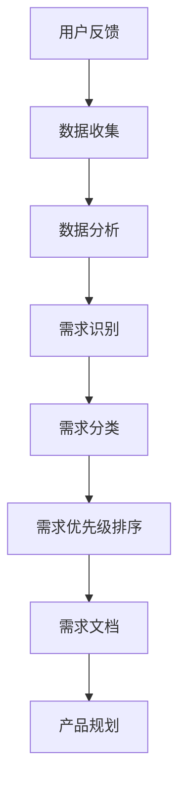
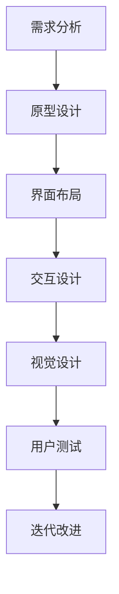
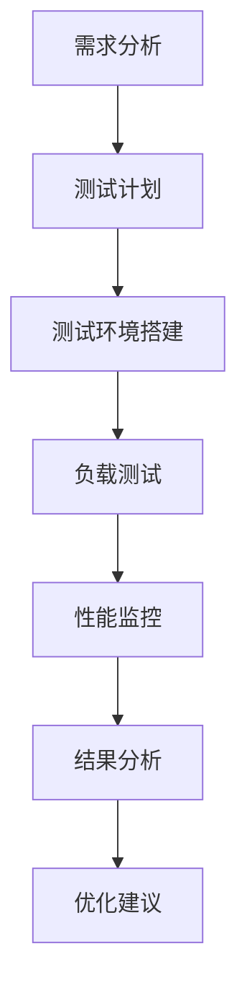
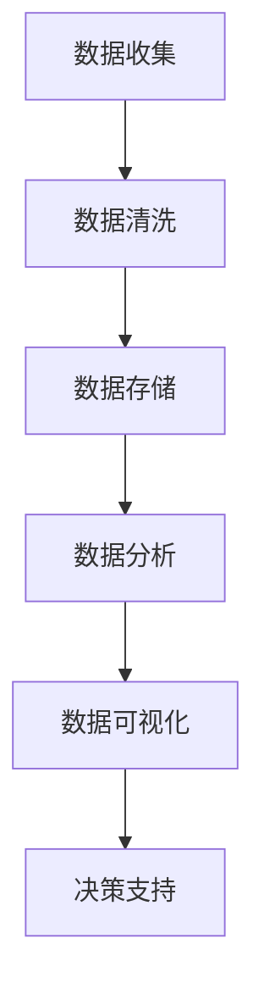
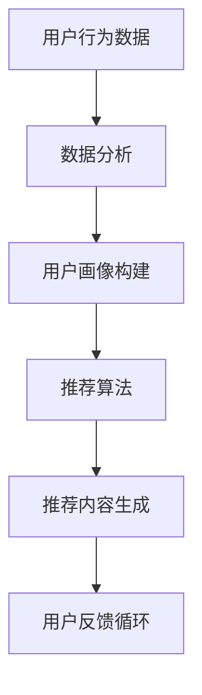

                 

 关键词：AI创业公司，用户体验，优化策略，用户界面设计，性能测试，数据分析，反馈机制，个性化推荐。

> 摘要：本文旨在探讨AI创业公司在产品开发过程中如何优化用户体验。通过深入分析用户需求、设计直观的界面、进行性能测试和数据分析，AI创业公司可以不断改进产品，提升用户满意度和市场竞争力。

## 1. 背景介绍

随着人工智能技术的快速发展，越来越多的创业公司开始将AI技术应用于其产品和服务中。然而，AI技术的复杂性及其带来的潜在用户体验挑战，使得创业公司在产品开发过程中面临诸多挑战。用户体验（User Experience, UX）的优化成为AI创业公司成功的关键因素之一。良好的用户体验不仅能提升用户满意度，还能增加用户忠诚度和市场份额。

用户体验涉及多个方面，包括用户界面设计、性能测试、数据分析、个性化推荐等。为了优化用户体验，AI创业公司需要采用一系列策略，从用户需求分析、设计、开发和测试等多个环节入手，确保产品能够满足用户期望。

## 2. 核心概念与联系

### 2.1 用户需求分析

用户需求分析是优化用户体验的第一步。通过收集和分析用户反馈，AI创业公司可以深入了解用户的需求和痛点。这包括用户在使用产品时的行为、偏好和反馈。以下是一个Mermaid流程图，展示了用户需求分析的过程：



### 2.2 用户界面设计

用户界面设计（User Interface Design, UI）是用户体验的核心组成部分。一个直观、易用的界面可以提高用户的操作效率，减少用户的学习成本。以下是一个UI设计的Mermaid流程图：



### 2.3 性能测试

性能测试（Performance Testing）是确保产品稳定性和响应速度的重要环节。通过模拟用户行为，测试系统在不同负载下的表现，AI创业公司可以及时发现并解决性能瓶颈。以下是一个性能测试的Mermaid流程图：



### 2.4 数据分析

数据分析（Data Analysis）是AI创业公司优化用户体验的关键手段。通过对用户行为数据进行深入分析，公司可以发现用户的行为模式、偏好和痛点，从而进行针对性的优化。以下是一个数据分析的Mermaid流程图：



### 2.5 个性化推荐

个性化推荐（Personalized Recommendation）是一种基于用户行为数据提供个性化内容或服务的策略。通过个性化推荐，AI创业公司可以提升用户的参与度和满意度。以下是一个个性化推荐的Mermaid流程图：



## 3. 核心算法原理 & 具体操作步骤

### 3.1 算法原理概述

在用户体验优化过程中，常用的核心算法包括用户行为分析算法、界面布局优化算法、性能监控算法和推荐算法。这些算法的基本原理如下：

- 用户行为分析算法：通过对用户行为数据进行分析，识别用户的行为模式和偏好。
- 界面布局优化算法：通过优化界面布局，提高用户的操作效率和满意度。
- 性能监控算法：通过监测系统的性能指标，识别性能瓶颈和问题。
- 推荐算法：通过分析用户行为数据，生成个性化的推荐内容。

### 3.2 算法步骤详解

以下是每个算法的具体操作步骤：

#### 3.1 用户行为分析算法

1. 数据收集：收集用户在产品中的行为数据，如点击、浏览、搜索等。
2. 数据清洗：对收集到的数据进行分析，去除噪声数据和异常值。
3. 特征提取：从原始数据中提取有用的特征，如用户年龄、性别、兴趣爱好等。
4. 模型训练：使用机器学习算法训练用户行为分析模型。
5. 模型评估：对模型进行评估，选择性能最佳的模型。
6. 模型应用：将训练好的模型应用于实际场景，分析用户行为模式。

#### 3.2 界面布局优化算法

1. 需求分析：分析用户需求，确定界面布局的目标和关键功能。
2. 原型设计：设计界面原型，包括布局、交互和视觉元素。
3. 用户测试：邀请用户参与界面测试，收集用户反馈。
4. 数据分析：分析用户测试数据，识别界面布局的问题和改进点。
5. 迭代优化：根据数据分析结果，对界面布局进行迭代优化。
6. 最终验收：在优化完成后，进行最终验收，确保界面布局满足用户需求。

#### 3.3 性能监控算法

1. 指标选择：选择合适的性能指标，如响应时间、吞吐量、错误率等。
2. 数据收集：收集系统性能数据，如系统资源占用、网络延迟等。
3. 数据分析：对收集到的数据进行分析，识别性能瓶颈和问题。
4. 优化策略：根据数据分析结果，制定优化策略。
5. 性能测试：对优化后的系统进行性能测试，验证优化效果。
6. 持续监控：持续监控系统性能，确保性能稳定。

#### 3.4 推荐算法

1. 数据收集：收集用户行为数据，如浏览、搜索、购买等。
2. 特征提取：从原始数据中提取有用的特征，如用户年龄、性别、兴趣爱好等。
3. 模型训练：使用机器学习算法训练推荐模型。
4. 模型评估：对模型进行评估，选择性能最佳的模型。
5. 推荐生成：根据用户行为数据和模型，生成个性化的推荐内容。
6. 用户反馈：收集用户对推荐内容的反馈，用于模型优化。

### 3.3 算法优缺点

#### 用户行为分析算法

- 优点：能够深入了解用户行为模式，为产品优化提供数据支持。
- 缺点：数据收集和处理成本较高，且对算法和数据处理能力要求较高。

#### 界面布局优化算法

- 优点：直观、易用的界面可以提高用户满意度，降低用户学习成本。
- 缺点：设计过程复杂，需要大量用户测试和数据分析。

#### 性能监控算法

- 优点：能够及时发现性能瓶颈和问题，确保系统稳定性和响应速度。
- 缺点：对监控指标的选择和监控数据的处理能力要求较高。

#### 推荐算法

- 优点：能够提供个性化的推荐内容，提升用户参与度和满意度。
- 缺点：推荐结果的准确性和多样性较难保证，且对用户行为数据的依赖较高。

### 3.4 算法应用领域

- 用户行为分析算法：电子商务、在线教育、社交媒体等。
- 界面布局优化算法：移动应用、Web应用、桌面应用等。
- 性能监控算法：服务器、云计算、大数据等。
- 推荐算法：电子商务、在线教育、社交媒体等。

## 4. 数学模型和公式 & 详细讲解 & 举例说明

### 4.1 数学模型构建

在用户体验优化过程中，常用的数学模型包括线性回归模型、决策树模型和神经网络模型等。以下是一个线性回归模型的构建过程：

#### 4.1.1 数据收集

收集用户在产品中的行为数据，如点击次数、浏览时长、购买金额等。

#### 4.1.2 特征提取

从原始数据中提取有用的特征，如用户年龄、性别、兴趣爱好等。

#### 4.1.3 模型构建

使用线性回归模型，构建用户行为与目标变量（如购买金额）之间的关系。

#### 4.1.4 模型评估

使用交叉验证等方法评估模型性能，选择最佳模型。

### 4.2 公式推导过程

线性回归模型的公式如下：

$$
Y = \beta_0 + \beta_1X_1 + \beta_2X_2 + \cdots + \beta_nX_n + \epsilon
$$

其中，$Y$为目标变量，$X_1, X_2, \cdots, X_n$为特征变量，$\beta_0, \beta_1, \beta_2, \cdots, \beta_n$为模型参数，$\epsilon$为误差项。

#### 4.2.1 特征选择

使用信息增益、卡方检验等方法选择最佳特征。

#### 4.2.2 模型训练

使用最小二乘法等优化算法训练模型，求解模型参数。

#### 4.2.3 模型评估

使用交叉验证等方法评估模型性能，选择最佳模型。

### 4.3 案例分析与讲解

#### 4.3.1 案例背景

某电商公司希望通过分析用户行为数据，预测用户购买金额，以便进行精准营销。

#### 4.3.2 数据收集

收集用户在产品中的行为数据，如点击次数、浏览时长、购买金额等。

#### 4.3.3 特征提取

从原始数据中提取有用的特征，如用户年龄、性别、兴趣爱好等。

#### 4.3.4 模型构建

使用线性回归模型，构建用户行为与目标变量（购买金额）之间的关系。

#### 4.3.5 模型训练

使用最小二乘法等优化算法训练模型，求解模型参数。

#### 4.3.6 模型评估

使用交叉验证等方法评估模型性能，选择最佳模型。

#### 4.3.7 模型应用

将训练好的模型应用于实际场景，预测用户购买金额，为精准营销提供数据支持。

## 5. 项目实践：代码实例和详细解释说明

### 5.1 开发环境搭建

搭建一个Python编程环境，安装必要的库，如NumPy、Pandas、Scikit-learn等。

```python
pip install numpy pandas scikit-learn
```

### 5.2 源代码详细实现

以下是一个用户行为分析算法的Python代码实现：

```python
import numpy as np
import pandas as pd
from sklearn.linear_model import LinearRegression
from sklearn.model_selection import train_test_split
from sklearn.metrics import mean_squared_error

# 数据收集
data = pd.read_csv('user_behavior.csv')

# 特征提取
features = data[['age', 'gender', 'interests']]
target = data['purchase_amount']

# 模型构建
model = LinearRegression()

# 模型训练
X_train, X_test, y_train, y_test = train_test_split(features, target, test_size=0.2, random_state=42)
model.fit(X_train, y_train)

# 模型评估
y_pred = model.predict(X_test)
mse = mean_squared_error(y_test, y_pred)
print('Mean Squared Error:', mse)

# 模型应用
new_user = np.array([[25, 0, 1]])  # 年龄：25，性别：男，兴趣爱好：运动
predicted_purchase = model.predict(new_user)
print('Predicted Purchase Amount:', predicted_purchase[0])
```

### 5.3 代码解读与分析

1. 导入必要的库：NumPy、Pandas和Scikit-learn。
2. 数据收集：读取用户行为数据，包括年龄、性别、兴趣爱好和购买金额。
3. 特征提取：将数据分为特征变量和目标变量。
4. 模型构建：创建线性回归模型。
5. 模型训练：将数据分为训练集和测试集，训练模型。
6. 模型评估：使用均方误差（MSE）评估模型性能。
7. 模型应用：使用训练好的模型预测新用户的购买金额。

## 6. 实际应用场景

用户体验优化在多个领域都有广泛的应用，以下是一些实际应用场景：

- 电子商务：通过用户行为分析，预测用户购买金额，进行精准营销。
- 在线教育：通过个性化推荐，为用户提供感兴趣的课程和资源。
- 社交媒体：通过用户行为分析，优化推荐算法，提升用户参与度。
- 医疗健康：通过用户行为数据，为用户提供个性化的健康建议。

## 7. 未来应用展望

随着人工智能技术的不断发展，用户体验优化将在更多领域得到应用。未来，AI创业公司可以进一步探索以下方向：

- 深度学习算法的应用：使用深度学习算法进行用户行为分析和推荐。
- 虚拟现实和增强现实：利用VR/AR技术提升用户体验。
- 自然语言处理：利用自然语言处理技术，实现更智能的交互。

## 8. 工具和资源推荐

- 学习资源推荐：
  - 《用户体验设计实战》：详细介绍用户体验设计的方法和技巧。
  - 《深度学习》：全面介绍深度学习的基本概念和应用。
- 开发工具推荐：
  - PyCharm：一款强大的Python编程环境，支持代码调试和性能分析。
  - Jupyter Notebook：一款交互式的Python编程环境，适合进行数据分析和可视化。
- 相关论文推荐：
  - "User Experience Design Principles for Mobile Applications"
  - "Deep Learning for User Experience Optimization"

## 9. 总结：未来发展趋势与挑战

用户体验优化是AI创业公司成功的关键因素之一。随着人工智能技术的不断发展，用户体验优化将朝着更智能化、个性化、实时化的方向发展。然而，这也带来了一系列挑战，如数据隐私保护、算法透明性等。未来，AI创业公司需要不断探索和创新，以满足用户需求，提升用户体验。

### 附录：常见问题与解答

**Q：用户体验优化为什么要考虑用户需求？**

**A：用户体验优化的核心目标是满足用户需求，提高用户满意度。只有深入了解用户需求，才能设计出符合用户期望的产品和服务。**

**Q：如何评估用户体验优化效果？**

**A：可以使用用户满意度调查、用户行为分析、性能指标等手段评估用户体验优化效果。通过对比优化前后的数据，可以判断优化措施的有效性。**

**Q：个性化推荐有哪些挑战？**

**A：个性化推荐面临的主要挑战包括推荐结果的准确性和多样性，以及用户隐私保护等问题。为了解决这些挑战，需要不断改进推荐算法，并确保用户数据的安全。**

### 作者署名

作者：禅与计算机程序设计艺术 / Zen and the Art of Computer Programming

[完]

