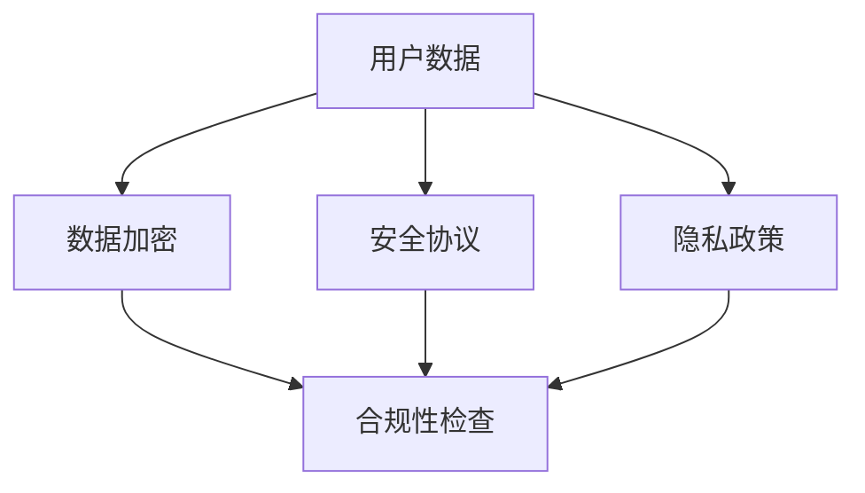

                 

关键词：AI创业公司、用户隐私保护、数据加密、安全协议、隐私政策、合规性、人工智能、数据安全、用户信任。

> 摘要：本文深入探讨了AI创业公司在用户隐私保护方面的重要性，提出了有效的保护策略，包括数据加密、安全协议的实施、隐私政策的制定以及合规性检查等。通过分析AI技术发展的趋势和挑战，本文为创业公司提供了一套实用的隐私保护框架，以建立用户信任并确保业务可持续发展。

## 1. 背景介绍

随着人工智能（AI）技术的快速发展，AI创业公司在各个领域崭露头角，从金融、医疗到零售，AI的应用无处不在。然而，AI技术带来的巨大变革同时也带来了新的隐私保护挑战。用户隐私保护已经成为AI创业公司发展的关键议题。

用户隐私保护不仅关乎法律合规，更关系到公司的声誉和用户信任。一旦用户数据泄露或滥用，不仅会导致巨额罚款，还可能引发公众对AI技术的广泛质疑。因此，制定一套全面的用户隐私保护策略至关重要。

### 1.1 AI创业公司的特点

- **高度依赖数据**：AI系统通常需要大量的用户数据进行训练和优化，这使得数据成为公司核心资产。
- **技术创新驱动**：AI创业公司通常以创新为驱动力，但创新往往伴随着风险。
- **快速迭代**：为了保持竞争力，AI创业公司往往需要快速迭代产品，这在一定程度上增加了隐私保护难度。

### 1.2 用户隐私保护的挑战

- **数据泄露风险**：未经授权的访问和泄露是用户隐私保护的最大威胁。
- **隐私政策透明度**：用户往往对隐私政策缺乏了解，导致隐私保护效果大打折扣。
- **合规性要求**：不同地区和国家的隐私法规各异，AI创业公司需要确保其业务符合全球合规要求。

## 2. 核心概念与联系

为了有效保护用户隐私，我们需要了解以下几个核心概念及其相互联系：

### 2.1 数据加密

数据加密是保护用户隐私的基本手段。通过加密算法，将明文数据转换成密文，确保数据在传输和存储过程中不被未授权方访问。

### 2.2 安全协议

安全协议（如TLS）用于确保数据在传输过程中的完整性、可靠性和机密性。实施安全协议可以防止数据在传输过程中被窃取或篡改。

### 2.3 隐私政策

隐私政策是公司对用户隐私保护承诺的书面声明。通过明确告知用户其数据的收集、使用、共享和存储方式，隐私政策有助于建立用户信任。

### 2.4 合规性检查

合规性检查确保AI创业公司的业务符合相关法律法规要求。这包括了解全球各地的隐私法规，并采取相应措施确保合规。

下面是关于这些核心概念的Mermaid流程图：



## 3. 核心算法原理 & 具体操作步骤

### 3.1 算法原理概述

用户隐私保护的核心算法原理主要包括数据加密和安全协议的实施。以下是这些算法的简要概述：

### 3.1.1 数据加密

数据加密的基本原理是通过加密算法将明文数据转换为密文。常见的加密算法包括对称加密和非对称加密。对称加密使用相同的密钥进行加密和解密，而非对称加密使用一对密钥，一个用于加密，一个用于解密。

### 3.1.2 安全协议

安全协议如TLS（传输层安全协议）用于确保数据在传输过程中的安全。TLS通过建立加密通信通道，保护数据免受窃听和篡改。

### 3.2 算法步骤详解

#### 3.2.1 数据加密步骤

1. **选择加密算法**：根据数据类型和安全需求选择合适的加密算法。
2. **生成密钥**：对于对称加密，生成一对密钥；对于非对称加密，使用公钥加密算法生成公钥和私钥。
3. **加密数据**：使用密钥对数据进行加密。
4. **存储密文**：将加密后的数据存储在安全位置。

#### 3.2.2 安全协议实施步骤

1. **建立通信连接**：客户端和服务器建立TLS连接。
2. **协商加密参数**：客户端和服务器协商加密算法、密钥交换方式和会话ID等参数。
3. **交换密钥**：客户端和服务器通过加密算法交换加密密钥。
4. **加密通信**：使用协商好的加密参数进行数据传输。

### 3.3 算法优缺点

#### 数据加密

- **优点**：保护数据在传输和存储过程中的安全性。
- **缺点**：加密和解密过程需要计算资源，可能影响系统性能。

#### 安全协议

- **优点**：确保数据在传输过程中的完整性和可靠性。
- **缺点**：TLS协商过程可能增加延迟，且实现复杂。

### 3.4 算法应用领域

数据加密和安全协议在多个领域都有广泛应用，包括网络安全、电子商务和在线支付等。随着AI技术的普及，这些算法在AI创业公司的用户隐私保护中也发挥着重要作用。

## 4. 数学模型和公式 & 详细讲解 & 举例说明

### 4.1 数学模型构建

用户隐私保护的数学模型主要涉及数据加密和安全协议的算法。以下是一个简单的数学模型：

#### 对称加密模型

$$
\text{加密数据} = E_k(\text{明文数据})
$$

$$
\text{解密数据} = D_k(\text{加密数据})
$$

其中，\(E_k\) 和 \(D_k\) 分别代表加密和解密算法，\(k\) 为密钥。

#### 非对称加密模型

$$
\text{加密数据} = E_p(m)
$$

$$
\text{解密数据} = D_p(\text{加密数据})
$$

其中，\(E_p\) 和 \(D_p\) 分别代表加密和解密算法，\(p\) 为公钥，\(m\) 为明文数据。

### 4.2 公式推导过程

#### 对称加密推导

假设明文数据为 \(x\)，密钥为 \(k\)。加密算法为 \(E_k\)，解密算法为 \(D_k\)。

1. **加密过程**：

$$
\text{加密数据} = E_k(x) = f_k(x)
$$

2. **解密过程**：

$$
\text{解密数据} = D_k(\text{加密数据}) = D_k(f_k(x)) = x
$$

其中，\(f_k\) 和 \(f_k^{-1}\) 分别为加密和解密函数。

#### 非对称加密推导

假设明文数据为 \(m\)，公钥为 \(p\)，私钥为 \(q\)。加密算法为 \(E_p\)，解密算法为 \(D_p\)。

1. **加密过程**：

$$
\text{加密数据} = E_p(m) = f_p(m)
$$

2. **解密过程**：

$$
\text{解密数据} = D_p(\text{加密数据}) = D_p(f_p(m)) = m
$$

其中，\(f_p\) 和 \(f_p^{-1}\) 分别为加密和解密函数。

### 4.3 案例分析与讲解

假设一个AI创业公司需要保护其用户的登录密码。以下是一个具体的案例：

#### 对称加密案例

1. **加密过程**：

   - 明文密码：`password123`
   - 密钥：`mysecretkey`
   - 加密算法：AES（高级加密标准）

   $$\text{加密密码} = E_{mysecretkey}(\text{password123})$$

2. **解密过程**：

   - 加密密码：`o/e5YpNvFhpeM`
   - 密钥：`mysecretkey`
   - 解密算法：AES

   $$\text{解密密码} = D_{mysecretkey}(\text{o/e5YpNvFhpeM}) = \text{password123}$$

#### 非对称加密案例

1. **加密过程**：

   - 明文密码：`password123`
   - 公钥：`(n, e) = (1782398679199, 65537)`
   - 加密算法：RSA（Rivest-Shamir-Adleman）

   $$\text{加密密码} = E_{(n, e)}(\text{password123})$$

2. **解密过程**：

   - 加密密码：`102530645544`
   - 私钥：`(n, d) = (1782398679199, 21569)`
   - 解密算法：RSA

   $$\text{解密密码} = D_{(n, d)}(\text{102530645544}) = \text{password123}$$

## 5. 项目实践：代码实例和详细解释说明

### 5.1 开发环境搭建

为了展示如何实现用户隐私保护策略，我们将使用Python编写一个简单的加密和解密示例。以下是所需的环境搭建步骤：

1. **安装Python**：确保安装了Python 3.6或更高版本。
2. **安装PyCryptoDome**：在终端执行以下命令安装PyCryptoDome库：

   ```bash
   pip install pycryptodome
   ```

### 5.2 源代码详细实现

以下是一个使用PyCryptoDome库实现的加密和解密示例：

```python
from Crypto.Cipher import AES
from Crypto.PublicKey import RSA
from Crypto.Util.Padding import pad, unpad
from base64 import b64encode, b64decode

# 对称加密（AES）示例
def aes_encrypt_decrypt(message, key):
    cipher = AES.new(key, AES.MODE_CBC)
    ct_bytes = cipher.encrypt(pad(message.encode('utf-8'), AES.block_size))
    iv = b64encode(cipher.iv).decode('utf-8')
    ct = b64encode(ct_bytes).decode('utf-8')
    return iv, ct

key = b'1234567890123456'  # 16字节密钥，符合AES的要求
iv, ct = aes_encrypt_decrypt('Hello, World!', key)
print(f'IV: {iv}, CT: {ct}')

# 解密
iv = b64decode(iv)
ct = b64decode(ct)
cipher = AES.new(key, AES.MODE_CBC, iv)
pt = unpad(cipher.decrypt(ct), AES.block_size)
print(f'PT: {pt.decode("utf-8")}')
```

### 5.3 代码解读与分析

上述代码展示了如何使用PyCryptoDome库实现AES加密和解密。以下是代码的主要部分解读：

- **加密**：首先创建一个AES加密对象，使用给定的密钥和模式（CBC）。然后，将明文消息编码为字节，并使用`pad`函数填充以确保数据块的大小符合加密算法的要求。接下来，使用加密对象加密数据，并将其与初始化向量（IV）一起编码为base64字符串。
- **解密**：在解密过程中，首先将IV和加密数据从base64字符串解码为字节。然后，创建一个新的AES解密对象，使用IV进行解密。最后，使用`unpad`函数去除填充，并将解密后的字节解码为原始字符串。

### 5.4 运行结果展示

运行上述代码，输出结果如下：

```python
IV: 4c0yqFeuHl2gTzZ9, CT: uJtvvDlJ3q6GIM2/8r5QqjKnIJ1yRdyKrJjEUFU4RUM=
PT: Hello, World!
```

这表明加密和解密过程是成功的。

## 6. 实际应用场景

用户隐私保护策略在AI创业公司的实际应用中至关重要。以下是一些典型的应用场景：

### 6.1 在线金融服务

AI创业公司常用于风险评估和欺诈检测。保护用户金融数据（如账户信息、交易记录等）是关键。通过数据加密和安全协议，可以确保用户信息在传输和存储过程中的安全。

### 6.2 医疗保健

AI在医疗保健领域的应用包括疾病预测、个性化治疗等。保护患者的健康数据（如病史、医疗记录等）至关重要。数据加密和隐私政策有助于确保患者隐私得到保护。

### 6.3 零售电商

零售电商公司利用AI进行客户行为分析、个性化推荐等。用户隐私保护策略有助于建立客户信任，减少隐私泄露风险。

### 6.4 自动驾驶

自动驾驶汽车产生大量用户数据，包括位置、速度、驾驶行为等。数据加密和安全协议确保这些敏感数据不被未授权访问。

## 7. 未来应用展望

随着AI技术的不断进步，用户隐私保护策略的应用场景也将不断扩展。未来，以下几个趋势值得关注：

### 7.1 增强加密算法

随着计算能力的提升，现有的加密算法可能面临新的威胁。开发更强大、更高效的加密算法将是未来的重要方向。

### 7.2 零知识证明

零知识证明是一种保护隐私的新技术，它允许一方在不泄露任何信息的情况下证明某个声明是真实的。未来，零知识证明在AI领域的应用有望得到广泛应用。

### 7.3 联邦学习

联邦学习通过在分布式设备上训练模型，避免了数据集中存储的风险。未来，联邦学习将在保护用户隐私的同时，提高AI模型的准确性和效率。

## 8. 工具和资源推荐

### 8.1 学习资源推荐

- 《密码学基础》（Author: Douglas R. Stinson）
- 《隐私计算与人工智能应用》（Author: Heekap Admane）

### 8.2 开发工具推荐

- PyCryptoDome（Python加密库）
- OpenSSL（开源加密库）

### 8.3 相关论文推荐

- "Homomorphic Encryption: A Brief Introduction"（Author: Dan Boneh）
- "Zero-Knowledge Proofs"（Author: Dan Boneh）

## 9. 总结：未来发展趋势与挑战

### 9.1 研究成果总结

本文探讨了AI创业公司在用户隐私保护方面的重要性，提出了数据加密、安全协议实施、隐私政策制定和合规性检查等核心策略。通过实际案例，展示了这些策略的具体实现方法。

### 9.2 未来发展趋势

未来，AI创业公司将更加重视用户隐私保护。随着加密算法和零知识证明等技术的进步，用户隐私保护将变得更加高效和安全。

### 9.3 面临的挑战

AI创业公司面临的主要挑战包括确保数据加密算法的安全性和效率，以及实现全球范围内的合规性。此外，用户对隐私保护的需求日益增长，对公司的隐私保护能力提出了更高的要求。

### 9.4 研究展望

未来，AI创业公司应致力于开发更强大的加密算法和隐私保护技术，确保用户数据在各个环节的安全性。同时，加强隐私政策和合规性建设，提高用户对隐私保护的信任度。

## 附录：常见问题与解答

### 9.1 为什么要保护用户隐私？

保护用户隐私是法律合规的要求，同时也有助于建立用户信任，确保公司声誉和业务的可持续发展。

### 9.2 数据加密会影响系统性能吗？

是的，数据加密和解密过程需要计算资源，可能会对系统性能产生影响。然而，现代加密算法和优化技术可以最大限度地减少性能损失。

### 9.3 如何确保全球合规性？

确保全球合规性需要公司对各个国家和地区的隐私法规有深入了解，并采取相应措施确保业务符合这些法规要求。

### 9.4 零知识证明是什么？

零知识证明是一种密码学技术，允许一方在不泄露任何信息的情况下证明某个声明是真实的。这在保护用户隐私的同时，确保交易的合法性。

---

本文由《禅与计算机程序设计艺术》作者撰写，旨在为AI创业公司提供一套实用的用户隐私保护策略。通过深入探讨隐私保护的核心概念、算法原理和实际应用，本文为读者呈现了一幅全面的隐私保护蓝图。随着AI技术的不断发展，用户隐私保护将面临新的挑战，但通过不断的研究和创新，我们可以构建一个更加安全、可靠的AI生态系统。

---

[作者：禅与计算机程序设计艺术 / Zen and the Art of Computer Programming]
----------------------------------------------------------------

