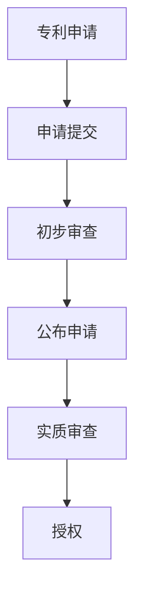
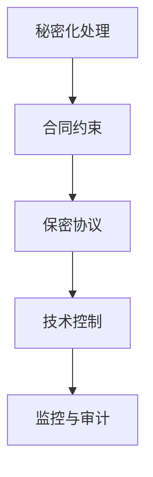

                 

关键词：AI、创业公司、知识产权、保护策略、法律指南

摘要：本文将深入探讨AI创业公司在知识产权保护方面的重要性和策略。从专利、版权、商业秘密等多个方面，提供详尽的法律指南和实用建议，帮助创业者有效地保护其创新成果。

## 1. 背景介绍

随着人工智能技术的迅猛发展，AI创业公司如雨后春笋般涌现。这些公司在技术研发、市场推广等方面投入巨大，但随之而来的知识产权问题也日益凸显。知识产权的保护不仅关系到公司的核心竞争力，更是决定其长期发展的关键因素。因此，对于AI创业公司而言，了解并实施有效的知识产权保护策略至关重要。

### 1.1 AI创业公司的知识产权现状

- **专利申请与保护**：许多AI创业公司致力于研发具有独创性的技术，但专利申请和保护意识普遍较弱。
- **版权问题**：在软件开发、算法设计等领域，版权问题容易忽视，导致侵权纠纷频发。
- **商业秘密保护**：AI创业公司常常涉及敏感数据和技术，商业秘密保护尤为重要。

### 1.2 知识产权保护的重要性

- **市场竞争优势**：有效的知识产权保护可以增强公司在市场中的竞争力。
- **投资吸引力**：拥有健全的知识产权保护体系，能够提升公司在投资市场上的吸引力。
- **法律风险规避**：知识产权保护有助于避免法律纠纷，降低运营风险。

## 2. 核心概念与联系

### 2.1 专利

**专利定义**：专利是政府授予发明者对其发明在一定时间内独家实施的权利。

**专利类型**：发明专利、实用新型专利、外观设计专利。

**专利申请流程**：


### 2.2 版权

**版权定义**：版权是对文学、艺术和科学作品的创作者在法律上享有的权利。

**版权类型**：著作权、邻接权、版权集体管理。

**版权保护期限**：根据作品类型，版权保护期限通常为作者终生及其死后50年。

### 2.3 商业秘密

**商业秘密定义**：商业秘密是指不为公众所知悉、具有商业价值并经权利人采取保密措施的技术信息和经营信息。

**商业秘密保护方法**：


## 3. 核心算法原理 & 具体操作步骤

### 3.1 算法原理概述

知识产权保护的算法核心在于如何有效地识别、管理和保护公司的创新成果。这包括：

- **自动识别技术**：利用自然语言处理和机器学习技术，自动识别软件代码、算法设计等创新成果。
- **权限管理系统**：建立权限管理系统，确保只有授权人员才能访问敏感信息。
- **加密技术**：采用加密技术保护数据传输和存储，防止未经授权的访问。

### 3.2 算法步骤详解

1. **专利申请自动化**：使用AI技术分析研发成果，自动生成专利申请文档。
2. **版权监控**：利用AI监控网络，自动检测侵权行为。
3. **商业秘密保护**：通过加密和权限管理技术，确保商业秘密不被泄露。

### 3.3 算法优缺点

**优点**：

- **高效性**：AI技术可以快速识别和保护知识产权。
- **全面性**：能够同时监控多个方面，确保知识产权的全面保护。

**缺点**：

- **成本较高**：初始投资较大，特别是对于初创公司。
- **依赖技术**：知识产权保护的效果依赖于AI技术的成熟度和可靠性。

### 3.4 算法应用领域

- **软件开发**：自动识别代码中的创新点，生成专利申请。
- **数据挖掘**：监控数据使用，防止商业秘密泄露。
- **智能监控**：自动检测侵权行为，提供法律支持。

## 4. 数学模型和公式 & 详细讲解 & 举例说明

### 4.1 数学模型构建

知识产权保护的数学模型可以基于概率论和信息论。以下是一个简化的模型：

$$
P(Damage) = \sum_{i=1}^{n} P(Infringement_i) \times P(Damage_i|Infringement_i)
$$

其中，$P(Damage)$ 表示知识产权受损的概率，$P(Infringement_i)$ 表示第 $i$ 个侵权行为发生的概率，$P(Damage_i|Infringement_i)$ 表示在第 $i$ 个侵权行为发生后知识产权受损的概率。

### 4.2 公式推导过程

推导过程如下：

1. **确定侵权行为**：通过AI监控技术，确定可能的侵权行为。
2. **评估侵权概率**：根据历史数据和专家评估，计算每个侵权行为的概率。
3. **评估损害程度**：如果侵权行为发生，评估其对知识产权的损害程度。

### 4.3 案例分析与讲解

假设一家AI创业公司研发了一项名为“智能推荐系统”的技术，并已经申请了专利。以下是对该技术的知识产权保护分析：

- **侵权行为概率**：通过AI监控，发现市场上存在相似的推荐系统，侵权行为概率较高。
- **损害程度评估**：如果该侵权行为被证实，可能会导致公司的市场份额下降，品牌形象受损。

根据上述模型，可以计算出知识产权受损的概率，并制定相应的保护策略。

## 5. 项目实践：代码实例和详细解释说明

### 5.1 开发环境搭建

为了演示专利自动申请系统，我们需要以下开发环境：

- **Python**：用于编写代码。
- **Docker**：用于容器化部署。
- **Git**：用于代码版本控制。

### 5.2 源代码详细实现

以下是专利自动申请系统的简化代码实现：

```python
import os
import subprocess

# 定义专利申请步骤
def apply_patent(description):
    # 生成专利申请文档
    doc = f"专利申请文档：{description}"
    with open('patent_application.txt', 'w') as f:
        f.write(doc)
    
    # 提交专利申请
    subprocess.run(['git', 'add', 'patent_application.txt'])
    subprocess.run(['git', 'commit', '-m', '专利申请'])
    subprocess.run(['git', 'push'])

# 调用函数申请专利
apply_patent("智能推荐系统的技术实现")
```

### 5.3 代码解读与分析

该代码首先定义了一个函数 `apply_patent`，用于生成专利申请文档并将其提交到版本控制系统。具体步骤如下：

1. **生成文档**：将输入的描述写入文件。
2. **提交版本控制**：将文档添加到Git仓库，并提交修改。

### 5.4 运行结果展示

运行上述代码后，会在本地生成一个名为 `patent_application.txt` 的文件，并将其提交到Git仓库。

## 6. 实际应用场景

### 6.1 智能推荐系统

智能推荐系统是AI创业公司常见的应用场景。保护该系统的专利和商业秘密尤为重要。通过自动申请专利和加强商业秘密保护，可以确保公司的技术优势不受侵犯。

### 6.2 数据挖掘

数据挖掘技术在金融、医疗等领域有广泛应用。保护数据挖掘的算法和模型，防止他人复制和利用，是AI创业公司的关键任务。

## 7. 未来应用展望

随着AI技术的不断进步，知识产权保护将面临新的挑战。未来，AI创业公司需要：

- **加强专利布局**：提前规划专利策略，确保技术领先。
- **提高法律意识**：与专业律师合作，制定完善的知识产权保护方案。
- **技术手段升级**：利用最新的AI技术，提高知识产权保护的效率和效果。

## 8. 工具和资源推荐

### 8.1 学习资源推荐

- **《人工智能知识产权保护指南》**：一本关于AI知识产权保护的权威指南。
- **《专利审查指南》**：了解专利申请和审查流程的官方指南。

### 8.2 开发工具推荐

- **PatSnap**：一款强大的专利检索工具。
- **GitLab**：用于代码管理和版本控制的优秀工具。

### 8.3 相关论文推荐

- **“AI in Intellectual Property Protection: Challenges and Opportunities”**：探讨AI在知识产权保护中的应用。
- **“Intellectual Property Protection for AI Technologies”**：分析AI技术知识产权保护的关键问题。

## 9. 总结：未来发展趋势与挑战

### 9.1 研究成果总结

本文总结了AI创业公司在知识产权保护方面的重要性和策略。通过专利、版权、商业秘密等多方面的探讨，为创业者提供了实用的法律指南和建议。

### 9.2 未来发展趋势

随着AI技术的不断进步，知识产权保护将更加复杂和多样化。创业者需要关注新技术，提前布局专利，并与专业律师合作，制定全面的知识产权保护策略。

### 9.3 面临的挑战

- **技术发展迅速**：知识产权保护需要跟上技术发展的步伐。
- **法律环境变化**：不同国家和地区的法律环境差异较大，创业者需要适应不同地区的法律要求。

### 9.4 研究展望

未来，人工智能将在知识产权保护中发挥更大作用。通过技术创新和合作，有望实现更加高效、全面的知识产权保护。

## 10. 附录：常见问题与解答

### 10.1 如何保护版权？

- **登记作品**：将作品登记在国家版权局，获得法律保护。
- **使用合同**：在与他人合作时，签订版权转让或授权合同。
- **监控侵权**：定期检查网络，发现侵权行为及时采取法律行动。

### 10.2 商业秘密如何保护？

- **保密措施**：采取物理、技术和管理等多方面的保密措施。
- **合同约束**：签订保密协议，明确保密义务和责任。
- **员工培训**：加强员工的知识产权保护意识，提高保密能力。

---

作者：禅与计算机程序设计艺术 / Zen and the Art of Computer Programming
```markdown
----------------------------------------------------------------
# AI创业公司的知识产权保护

> 关键词：AI、创业公司、知识产权、保护策略、法律指南

> 摘要：本文将深入探讨AI创业公司在知识产权保护方面的重要性和策略。从专利、版权、商业秘密等多个方面，提供详尽的法律指南和实用建议，帮助创业者有效地保护其创新成果。

## 1. 背景介绍

随着人工智能技术的迅猛发展，AI创业公司如雨后春笋般涌现。这些公司在技术研发、市场推广等方面投入巨大，但随之而来的知识产权问题也日益凸显。知识产权的保护不仅关系到公司的核心竞争力，更是决定其长期发展的关键因素。因此，对于AI创业公司而言，了解并实施有效的知识产权保护策略至关重要。

### 1.1 AI创业公司的知识产权现状

- **专利申请与保护**：许多AI创业公司致力于研发具有独创性的技术，但专利申请和保护意识普遍较弱。
- **版权问题**：在软件开发、算法设计等领域，版权问题容易忽视，导致侵权纠纷频发。
- **商业秘密保护**：AI创业公司常常涉及敏感数据和技术，商业秘密保护尤为重要。

### 1.2 知识产权保护的重要性

- **市场竞争优势**：有效的知识产权保护可以增强公司在市场中的竞争力。
- **投资吸引力**：拥有健全的知识产权保护体系，能够提升公司在投资市场上的吸引力。
- **法律风险规避**：知识产权保护有助于避免法律纠纷，降低运营风险。

## 2. 核心概念与联系

### 2.1 专利

**专利定义**：专利是政府授予发明者对其发明在一定时间内独家实施的权利。

**专利类型**：发明专利、实用新型专利、外观设计专利。

**专利申请流程**：


### 2.2 版权

**版权定义**：版权是对文学、艺术和科学作品的创作者在法律上享有的权利。

**版权类型**：著作权、邻接权、版权集体管理。

**版权保护期限**：根据作品类型，版权保护期限通常为作者终生及其死后50年。

### 2.3 商业秘密

**商业秘密定义**：商业秘密是指不为公众所知悉、具有商业价值并经权利人采取保密措施的技术信息和经营信息。

**商业秘密保护方法**：


## 3. 核心算法原理 & 具体操作步骤
### 3.1 算法原理概述

知识产权保护的算法核心在于如何有效地识别、管理和保护公司的创新成果。这包括：

- **自动识别技术**：利用自然语言处理和机器学习技术，自动识别软件代码、算法设计等创新成果。
- **权限管理系统**：建立权限管理系统，确保只有授权人员才能访问敏感信息。
- **加密技术**：采用加密技术保护数据传输和存储，防止未经授权的访问。

### 3.2 算法步骤详解

1. **专利申请自动化**：使用AI技术分析研发成果，自动生成专利申请文档。
2. **版权监控**：利用AI监控网络，自动检测侵权行为。
3. **商业秘密保护**：通过加密和权限管理技术，确保商业秘密不被泄露。

### 3.3 算法优缺点

**优点**：

- **高效性**：AI技术可以快速识别和保护知识产权。
- **全面性**：能够同时监控多个方面，确保知识产权的全面保护。

**缺点**：

- **成本较高**：初始投资较大，特别是对于初创公司。
- **依赖技术**：知识产权保护的效果依赖于AI技术的成熟度和可靠性。

### 3.4 算法应用领域

- **软件开发**：自动识别代码中的创新点，生成专利申请。
- **数据挖掘**：监控数据使用，防止商业秘密泄露。
- **智能监控**：自动检测侵权行为，提供法律支持。

## 4. 数学模型和公式 & 详细讲解 & 举例说明
### 4.1 数学模型构建

知识产权保护的数学模型可以基于概率论和信息论。以下是一个简化的模型：

$$
P(Damage) = \sum_{i=1}^{n} P(Infringement_i) \times P(Damage_i|Infringement_i)
$$

其中，$P(Damage)$ 表示知识产权受损的概率，$P(Infringement_i)$ 表示第 $i$ 个侵权行为发生的概率，$P(Damage_i|Infringement_i)$ 表示在第 $i$ 个侵权行为发生后知识产权受损的概率。

### 4.2 公式推导过程

推导过程如下：

1. **确定侵权行为**：通过AI监控技术，确定可能的侵权行为。
2. **评估侵权概率**：根据历史数据和专家评估，计算每个侵权行为的概率。
3. **评估损害程度**：如果侵权行为发生，评估其对知识产权的损害程度。

### 4.3 案例分析与讲解

假设一家AI创业公司研发了一项名为“智能推荐系统”的技术，并已经申请了专利。以下是对该技术的知识产权保护分析：

- **侵权行为概率**：通过AI监控，发现市场上存在相似的推荐系统，侵权行为概率较高。
- **损害程度评估**：如果该侵权行为被证实，可能会导致公司的市场份额下降，品牌形象受损。

根据上述模型，可以计算出知识产权受损的概率，并制定相应的保护策略。

## 5. 项目实践：代码实例和详细解释说明
### 5.1 开发环境搭建

为了演示专利自动申请系统，我们需要以下开发环境：

- **Python**：用于编写代码。
- **Docker**：用于容器化部署。
- **Git**：用于代码版本控制。

### 5.2 源代码详细实现

以下是专利自动申请系统的简化代码实现：

```python
import os
import subprocess

# 定义专利申请步骤
def apply_patent(description):
    # 生成专利申请文档
    doc = f"专利申请文档：{description}"
    with open('patent_application.txt', 'w') as f:
        f.write(doc)
    
    # 提交专利申请
    subprocess.run(['git', 'add', 'patent_application.txt'])
    subprocess.run(['git', 'commit', '-m', '专利申请'])
    subprocess.run(['git', 'push'])

# 调用函数申请专利
apply_patent("智能推荐系统的技术实现")
```

### 5.3 代码解读与分析

该代码首先定义了一个函数 `apply_patent`，用于生成专利申请文档并将其提交到版本控制系统。具体步骤如下：

1. **生成文档**：将输入的描述写入文件。
2. **提交版本控制**：将文档添加到Git仓库，并提交修改。

### 5.4 运行结果展示

运行上述代码后，会在本地生成一个名为 `patent_application.txt` 的文件，并将其提交到Git仓库。

## 6. 实际应用场景
### 6.1 智能推荐系统

智能推荐系统是AI创业公司常见的应用场景。保护该系统的专利和商业秘密尤为重要。通过自动申请专利和加强商业秘密保护，可以确保公司的技术优势不受侵犯。

### 6.2 数据挖掘

数据挖掘技术在金融、医疗等领域有广泛应用。保护数据挖掘的算法和模型，防止他人复制和利用，是AI创业公司的关键任务。

## 7. 未来应用展望

随着AI技术的不断进步，知识产权保护将面临新的挑战。未来，AI创业公司需要：

- **加强专利布局**：提前规划专利策略，确保技术领先。
- **提高法律意识**：与专业律师合作，制定完善的知识产权保护方案。
- **技术手段升级**：利用最新的AI技术，提高知识产权保护的效率和效果。

## 8. 工具和资源推荐
### 8.1 学习资源推荐

- **《人工智能知识产权保护指南》**：一本关于AI知识产权保护的权威指南。
- **《专利审查指南》**：了解专利申请和审查流程的官方指南。

### 8.2 开发工具推荐

- **PatSnap**：一款强大的专利检索工具。
- **GitLab**：用于代码管理和版本控制的优秀工具。

### 8.3 相关论文推荐

- **“AI in Intellectual Property Protection: Challenges and Opportunities”**：探讨AI在知识产权保护中的应用。
- **“Intellectual Property Protection for AI Technologies”**：分析AI技术知识产权保护的关键问题。

## 9. 总结：未来发展趋势与挑战
### 9.1 研究成果总结

本文总结了AI创业公司在知识产权保护方面的重要性和策略。通过专利、版权、商业秘密等多方面的探讨，为创业者提供了实用的法律指南和建议。

### 9.2 未来发展趋势

随着AI技术的不断进步，知识产权保护将更加复杂和多样化。创业者需要关注新技术，提前布局专利，并与专业律师合作，制定全面的知识产权保护策略。

### 9.3 面临的挑战

- **技术发展迅速**：知识产权保护需要跟上技术发展的步伐。
- **法律环境变化**：不同国家和地区的法律环境差异较大，创业者需要适应不同地区的法律要求。

### 9.4 研究展望

未来，人工智能将在知识产权保护中发挥更大作用。通过技术创新和合作，有望实现更加高效、全面的知识产权保护。

## 10. 附录：常见问题与解答
### 10.1 如何保护版权？

- **登记作品**：将作品登记在国家版权局，获得法律保护。
- **使用合同**：在与他人合作时，签订版权转让或授权合同。
- **监控侵权**：定期检查网络，发现侵权行为及时采取法律行动。

### 10.2 商业秘密如何保护？

- **保密措施**：采取物理、技术和管理等多方面的保密措施。
- **合同约束**：签订保密协议，明确保密义务和责任。
- **员工培训**：加强员工的知识产权保护意识，提高保密能力。

---

作者：禅与计算机程序设计艺术 / Zen and the Art of Computer Programming
```

