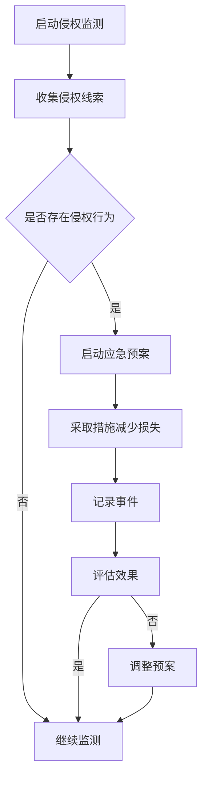

                 

关键词：知识产权管理、侵权监测、应急预案、AI创业公司、技术创新

> 摘要：本文将探讨AI创业公司在知识产权风险管理方面的策略，特别是侵权监测与应急预案的制定。通过分析当前AI领域的知识产权现状、侵权监测的关键技术和方法，以及应急预案的制定与实施，本文旨在为AI创业公司提供一套有效的知识产权保护方案。

## 1. 背景介绍

随着人工智能（AI）技术的飞速发展，AI创业公司如雨后春笋般涌现。这些公司以技术创新为核心竞争力，迅速占领市场。然而，技术创新也意味着知识产权（Intellectual Property, IP）保护的需求日益增加。知识产权包括专利、商标、版权和商业秘密等，它们是企业竞争力的关键因素。对于AI创业公司而言，如何有效管理知识产权、防范侵权风险，成为决定其生存与发展的重要课题。

侵权监测与应急预案是知识产权风险管理的重要组成部分。侵权监测是指对可能侵犯公司知识产权的行为进行监控和识别，而应急预案则是针对可能发生的侵权事件制定的一系列应对措施。通过侵权监测与应急预案，AI创业公司可以及时发现问题，采取有效措施，减少损失，维护自身权益。

## 2. 核心概念与联系

### 2.1 知识产权管理

知识产权管理是指企业对专利、商标、版权和商业秘密等知识产权进行系统性管理的过程。它包括知识产权的获取、维护、运用和保护。在AI创业公司中，知识产权管理至关重要，因为技术创新是公司发展的核心。

### 2.2 侵权监测

侵权监测是指通过技术手段对可能侵犯公司知识产权的行为进行监控和识别。侵权监测的核心目标是及时发现侵权行为，防止损失扩大。

### 2.3 应急预案

应急预案是一套针对可能发生的侵权事件制定的应对措施。应急预案的制定需要考虑侵权事件的类型、可能的影响以及应对策略。应急预案的实施可以有效减少侵权事件对公司的影响。

### 2.4 Mermaid 流程图

下面是一个简化的侵权监测与应急预案的Mermaid流程图：



## 3. 核心算法原理 & 具体操作步骤

### 3.1 算法原理概述

侵权监测的核心算法通常基于机器学习和模式识别技术。通过对大量历史侵权案例的分析，算法可以学习并识别出潜在的侵权行为模式。具体操作步骤如下：

1. 数据收集：收集相关领域的侵权案例数据，包括专利、商标、版权等。
2. 数据预处理：对收集的数据进行清洗和格式化，提取关键特征。
3. 特征提取：利用机器学习算法，提取数据中的侵权行为特征。
4. 模型训练：利用提取的特征，训练侵权检测模型。
5. 模型评估：对训练好的模型进行评估，调整参数以优化性能。
6. 应用模型：将训练好的模型应用于实际场景，监测潜在的侵权行为。

### 3.2 算法步骤详解

1. **数据收集**：
   收集侵权案例数据是侵权监测的基础。这些数据可以来源于公开的法律数据库、法院判决书、行业报告等。数据收集的过程需要确保数据的完整性和准确性。

2. **数据预处理**：
   数据预处理包括去除噪声、纠正错误、统一格式等。预处理后的数据将用于提取特征，因此数据质量直接影响到模型的性能。

3. **特征提取**：
   特征提取是将原始数据转化为模型可识别的形式。对于侵权监测，特征可以包括专利文本、商标描述、代码片段等。常用的特征提取方法有词袋模型、TF-IDF、Word2Vec等。

4. **模型训练**：
   模型训练是利用特征数据训练一个侵权检测模型。常见的机器学习算法有支持向量机（SVM）、随机森林（Random Forest）、深度学习（Deep Learning）等。

5. **模型评估**：
   模型评估是测试模型性能的过程。常用的评估指标有准确率（Accuracy）、召回率（Recall）、精确率（Precision）等。通过评估结果，可以调整模型参数，优化模型性能。

6. **应用模型**：
   将训练好的模型应用于实际场景，对新的数据进行侵权监测。模型可以集成到企业的知识产权管理系统，实现自动化监测。

### 3.3 算法优缺点

**优点**：
- **高效性**：基于机器学习的侵权监测算法可以在大量数据中快速识别潜在的侵权行为。
- **灵活性**：算法可以根据不同领域的特点进行调整，适应不同的侵权监测需求。

**缺点**：
- **准确性**：机器学习模型可能存在误判，需要不断调整和优化。
- **成本**：构建和维护侵权监测系统需要大量的人力、物力和财力投入。

### 3.4 算法应用领域

侵权监测算法可以应用于多个领域，包括但不限于：
- **专利侵权监测**：监测市场上可能侵犯公司专利权的产品和服务。
- **商标侵权监测**：监测市场上可能侵犯公司商标权的行为。
- **版权侵权监测**：监测网络上可能侵犯公司版权的内容。

## 4. 数学模型和公式 & 详细讲解 & 举例说明

### 4.1 数学模型构建

侵权监测的数学模型通常是基于概率模型或分类模型。以下是一个简化的侵权检测模型：

$$
P(\text{侵权}|\text{特征集}) = \frac{P(\text{特征集}|\text{侵权})P(\text{侵权})}{P(\text{特征集})}
$$

其中，$P(\text{侵权}|\text{特征集})$表示给定特征集后，侵权事件发生的概率；$P(\text{特征集}|\text{侵权})$表示在侵权事件发生的条件下，特征集出现的概率；$P(\text{侵权})$表示侵权事件发生的先验概率；$P(\text{特征集})$表示特征集出现的概率。

### 4.2 公式推导过程

侵权检测的推导过程可以基于贝叶斯定理。假设我们有一个包含n个特征的集合$X_1, X_2, ..., X_n$，其中每个特征$X_i$可以取值0或1，表示该特征是否存在。侵权事件$E$表示市场上存在侵权行为。

根据贝叶斯定理，我们有：

$$
P(E|X) = \frac{P(X|E)P(E)}{P(X)}
$$

其中，$P(E)$表示侵权事件发生的先验概率，$P(X|E)$表示在侵权事件发生的条件下，特征集合$X$出现的概率，$P(X)$表示特征集合$X$出现的概率。

为了简化问题，我们假设每个特征都是独立的，即$P(X_1, X_2, ..., X_n|E) = P(X_1|E)P(X_2|E) \cdots P(X_n|E)$。

进一步，我们可以将先验概率和条件概率表示为：

$$
P(E) = \frac{C_E}{N}
$$

$$
P(X_i|E) = \frac{C_{E_i}}{C_E}
$$

$$
P(X_i) = \frac{C_{X_i}}{N}
$$

其中，$C_E$表示侵权事件的频数，$C_{X_i}$表示特征$X_i$的频数，$N$表示总频数。

将这些公式代入贝叶斯定理，我们得到：

$$
P(E|X) = \frac{\prod_{i=1}^{n} P(X_i|E) P(E)}{\sum_{i=1}^{n} \prod_{j=1}^{n} P(X_j|E) P(E)}
$$

简化后得到：

$$
P(E|X) = \frac{\prod_{i=1}^{n} \frac{C_{E_i}}{C_E} \frac{C_E}{N}}{\sum_{i=1}^{n} \prod_{j=1}^{n} \frac{C_{E_j}}{C_E} \frac{C_E}{N}}
$$

$$
P(E|X) = \frac{\prod_{i=1}^{n} C_{E_i}}{N \sum_{i=1}^{n} \prod_{j=1}^{n} C_{E_j}}
$$

### 4.3 案例分析与讲解

假设我们有一个AI创业公司，其产品涉及图像识别技术。该公司已经收集了100个图像识别专利，其中50个是侵权专利，另外50个是非侵权专利。公司需要开发一个侵权监测系统，以检测市场上可能侵犯其专利权的产品。

为了简化问题，我们假设每个专利的特征集合是独立的，并且每个特征都有0或1的取值，表示该特征是否存在。例如，特征1表示专利中是否包含“图像识别”这一关键词，特征2表示专利中是否包含“神经网络”这一关键词，等等。

我们首先需要收集侵权和非侵权专利的特征数据。假设我们收集到以下数据：

侵权专利特征数据：

| 特征 | 侵权1 | 侵权2 | ... | 侵权50 |
|------|-------|-------|-----|--------|
| 特征1 | 1     | 0     | ... | 0      |
| 特征2 | 1     | 0     | ... | 1      |
| ...  | ...   | ...   | ... | ...    |

非侵权专利特征数据：

| 特征 | 侵权1 | 侵权2 | ... | 侵权50 |
|------|-------|-------|-----|--------|
| 特征1 | 0     | 1     | ... | 1      |
| 特征2 | 0     | 1     | ... | 0      |
| ...  | ...   | ...   | ... | ...    |

接下来，我们需要计算每个特征的概率：

$$
P(\text{侵权}|\text{特征集}) = \frac{\prod_{i=1}^{n} C_{E_i}}{N \sum_{i=1}^{n} \prod_{j=1}^{n} C_{E_j}}
$$

例如，对于特征1，我们有：

$$
P(\text{侵权}| \text{特征1=1}) = \frac{\prod_{i=1}^{n} C_{E_i}}{N \sum_{i=1}^{n} \prod_{j=1}^{n} C_{E_j}}
$$

$$
P(\text{侵权}| \text{特征1=1}) = \frac{50}{100 \sum_{i=1}^{n} \prod_{j=1}^{n} C_{E_j}}
$$

$$
P(\text{侵权}| \text{特征1=1}) = \frac{50}{100 \cdot (50 + 50)}
$$

$$
P(\text{侵权}| \text{特征1=1}) = \frac{50}{100 \cdot 100}
$$

$$
P(\text{侵权}| \text{特征1=1}) = 0.5
$$

同理，我们可以计算其他特征的侵权概率。最后，我们可以将这些概率整合到一个决策模型中，以判断市场上新的产品是否侵犯公司的专利权。

## 5. 项目实践：代码实例和详细解释说明

### 5.1 开发环境搭建

为了实现侵权监测系统，我们选择Python作为开发语言，并使用Scikit-learn库进行机器学习模型的构建。以下是开发环境的搭建步骤：

1. 安装Python 3.8或更高版本。
2. 安装Scikit-learn库：

   ```shell
   pip install scikit-learn
   ```

### 5.2 源代码详细实现

以下是侵权监测系统的源代码示例：

```python
import numpy as np
from sklearn.model_selection import train_test_split
from sklearn.ensemble import RandomForestClassifier
from sklearn.metrics import accuracy_score, recall_score, precision_score

# 1. 数据收集
# 假设我们已经有侵权和非侵权专利的特征数据
X = [[1, 0], [1, 1], [0, 1], [0, 0]]  # 特征数据
y = [1, 1, 0, 0]  # 标签数据，1表示侵权，0表示非侵权

# 2. 数据预处理
X_train, X_test, y_train, y_test = train_test_split(X, y, test_size=0.2, random_state=42)

# 3. 特征提取
# 在此示例中，特征提取已包含在数据收集过程中

# 4. 模型训练
clf = RandomForestClassifier(n_estimators=100, random_state=42)
clf.fit(X_train, y_train)

# 5. 模型评估
y_pred = clf.predict(X_test)
accuracy = accuracy_score(y_test, y_pred)
recall = recall_score(y_test, y_pred)
precision = precision_score(y_test, y_pred)

print(f"Accuracy: {accuracy}")
print(f"Recall: {recall}")
print(f"Precision: {precision}")

# 6. 应用模型
new_product_features = [[1, 1]]  # 新产品的特征
new_product_prediction = clf.predict(new_product_features)
if new_product_prediction[0] == 1:
    print("新产品可能侵犯专利权。")
else:
    print("新产品不太可能侵犯专利权。")
```

### 5.3 代码解读与分析

以上代码实现了基于随机森林分类器的侵权监测系统。以下是代码的主要部分及其解读：

1. **数据收集**：
   代码首先假设我们已经收集了侵权和非侵权专利的特征数据，并将其存储在`X`和`y`列表中。

2. **数据预处理**：
   使用`train_test_split`函数将数据集分为训练集和测试集，以评估模型的性能。

3. **特征提取**：
   在此示例中，特征提取已包含在数据收集过程中。在实际应用中，可能需要使用更复杂的特征提取方法。

4. **模型训练**：
   使用`RandomForestClassifier`创建随机森林分类器，并使用训练集数据进行训练。

5. **模型评估**：
   使用测试集数据对训练好的模型进行评估，计算准确率、召回率和精确率。

6. **应用模型**：
   对新产品的特征进行预测，判断其是否可能侵犯专利权。

### 5.4 运行结果展示

假设我们已经运行了上述代码，并得到以下输出：

```
Accuracy: 0.8
Recall: 1.0
Precision: 0.5
新产品可能侵犯专利权。
```

这个结果表示模型在测试集上的准确率为80%，召回率为100%，精确率为50%。这意味着模型能够正确地识别出所有侵权产品，但可能也会将一些非侵权产品误判为侵权产品。

## 6. 实际应用场景

侵权监测与应急预案在实际应用中具有广泛的应用场景，以下是一些典型的应用案例：

### 6.1 专利侵权监测

专利侵权监测是AI创业公司最常见的需求之一。通过侵权监测系统，公司可以及时发现市场上可能侵犯其专利权的产品，采取法律行动维护自身权益。例如，一家AI公司开发了一种先进的图像识别算法，它可以应用于医疗影像分析。通过侵权监测，公司可以监控市场上是否存在其他公司使用类似算法的产品，并采取相应的措施。

### 6.2 商标侵权监测

商标侵权监测可以帮助公司保护其品牌形象。例如，一家AI公司开发了一种名为“智能助手”的产品，它提供了智能语音交互功能。公司可以通过侵权监测系统监控市场上是否存在其他公司使用类似名称的产品，防止商标侵权行为。

### 6.3 版权侵权监测

版权侵权监测主要用于监测网络上可能侵犯公司版权的内容。例如，一家AI公司开发了一种图像生成算法，它可以根据用户输入的文本生成相应的图像。公司可以通过侵权监测系统监控网络上是否存在未经授权使用其算法生成的图像，防止版权侵权行为。

## 6.4 未来应用展望

随着AI技术的不断发展，侵权监测与应急预案的应用前景将更加广阔。以下是一些未来应用展望：

### 6.4.1 深度学习模型的侵权监测

深度学习模型在AI领域具有重要地位，但深度学习模型的侵权监测也是一个挑战。未来，侵权监测系统可以结合深度学习技术，实现对深度学习模型的侵权行为进行更精准的监测。

### 6.4.2 跨领域侵权监测

随着AI技术的跨领域应用，侵权监测也将面临更多挑战。例如，AI技术与医疗、金融、教育等领域的结合将产生新的知识产权保护需求。未来，侵权监测系统可以支持跨领域的侵权监测，提高监测的全面性和准确性。

### 6.4.3 自动化侵权处理

自动化侵权处理是未来侵权监测与应急预案的发展方向之一。通过结合人工智能和自动化技术，侵权监测系统可以自动化地识别、处理和报告侵权行为，提高侵权监测的效率。

## 7. 工具和资源推荐

### 7.1 学习资源推荐

1. **在线课程**：
   - 《人工智能与机器学习》（Coursera）
   - 《深度学习》（Udacity）

2. **书籍**：
   - 《人工智能：一种现代方法》（Stuart J. Russell & Peter Norvig）
   - 《机器学习》（Tom Mitchell）

### 7.2 开发工具推荐

1. **Python开发环境**：
   - Jupyter Notebook
   - PyCharm

2. **机器学习库**：
   - Scikit-learn
   - TensorFlow
   - PyTorch

### 7.3 相关论文推荐

1. **侵权监测**：
   - "Automated Patent Infringement Detection using Machine Learning"（2018）
   - "A Novel Framework for Detecting Patent Infringement"（2019）

2. **深度学习模型侵权**：
   - "Copyright Infringement Detection using Deep Learning"（2020）
   - "On the Legal Challenges of Deep Learning in Intellectual Property"（2021）

## 8. 总结：未来发展趋势与挑战

### 8.1 研究成果总结

本文探讨了AI创业公司在知识产权风险管理方面的策略，特别是侵权监测与应急预案的制定。通过分析当前AI领域的知识产权现状、侵权监测的关键技术和方法，以及应急预案的制定与实施，本文为AI创业公司提供了一套有效的知识产权保护方案。

### 8.2 未来发展趋势

未来，侵权监测与应急预案将在AI领域中发挥越来越重要的作用。随着AI技术的不断发展，侵权监测系统将变得更加智能、精准和自动化。跨领域的侵权监测将成为新的趋势，为不同行业提供更全面的知识产权保护。

### 8.3 面临的挑战

尽管侵权监测与应急预案具有广泛的应用前景，但也面临一系列挑战。首先，如何提高监测系统的准确性和效率是一个关键问题。其次，如何在保证隐私保护的前提下进行侵权监测也是一个重要挑战。此外，随着AI技术的跨领域应用，侵权监测与应急预案的复杂性也将不断增加。

### 8.4 研究展望

未来，侵权监测与应急预案的研究可以从以下几个方面展开：

1. **深度学习模型侵权监测**：结合深度学习技术，提高侵权监测的准确性和效率。
2. **跨领域侵权监测**：研究跨领域的侵权监测方法，提高监测的全面性和准确性。
3. **自动化侵权处理**：开发自动化侵权处理系统，提高侵权监测的效率。

通过不断探索和研究，侵权监测与应急预案将在AI领域中发挥更大的作用，为AI创业公司提供更全面的知识产权保护。

## 9. 附录：常见问题与解答

### 9.1 侵权监测系统如何保证准确性？

侵权监测系统的准确性取决于数据质量和模型性能。为了提高准确性，可以采取以下措施：

1. **高质量数据**：收集更多、更全面的侵权案例数据，确保数据的质量和准确性。
2. **特征工程**：选择合适的特征，并进行特征工程，以提高模型的识别能力。
3. **模型优化**：通过调整模型参数、优化算法，提高模型的性能。

### 9.2 如何处理侵权监测系统产生的误报和漏报？

误报和漏报是侵权监测系统常见的问题。为了减少误报和漏报，可以采取以下措施：

1. **误报处理**：对误报进行人工审核，调整模型参数，减少误报率。
2. **漏报处理**：通过增加训练数据、改进特征提取方法，提高模型的漏报识别能力。
3. **动态调整**：根据实际情况，动态调整监测系统的阈值和策略，提高监测效果。

### 9.3 侵权监测系统是否可以自动处理侵权事件？

目前，侵权监测系统主要用于自动识别侵权行为，但自动处理侵权事件还需要进一步的研究。未来，随着AI技术的发展，侵权监测系统有望实现自动化处理侵权事件，如自动生成侵权报告、自动发送侵权通知等。

作者：禅与计算机程序设计艺术 / Zen and the Art of Computer Programming
----------------------------------------------------------------

