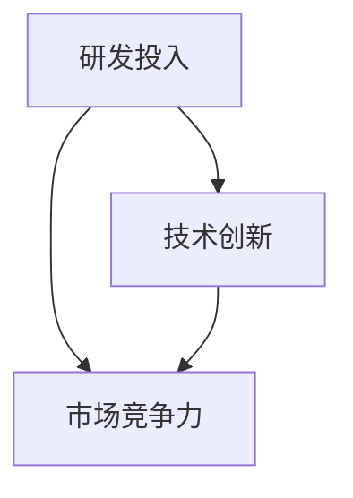

                 

在当今快速发展的技术时代，AI创业公司面临着诸多挑战和机遇。如何在激烈的市场竞争中立于不败之地，成为每一个创业公司的战略重点。其中，研发投入策略是决定公司长远发展的重要因素之一。本文将围绕AI创业公司的研发投入策略进行深入探讨，帮助创业公司更好地制定和实施有效的研发计划。

## 关键词

AI创业、研发投入、战略规划、市场竞争力、技术创新

## 摘要

本文首先对AI创业公司所处的市场环境进行了分析，探讨了研发投入的重要性。接着，详细阐述了制定研发投入策略的步骤和方法，包括需求分析、资源分配、项目管理和风险评估等方面。随后，通过实际案例和数据分析，展示了有效的研发投入策略对于提升AI创业公司竞争力的作用。最后，对未来的发展趋势和挑战进行了展望，提出了相应的应对策略。

## 1. 背景介绍

### AI创业公司的市场环境

随着人工智能技术的快速发展，AI创业公司如雨后春笋般涌现。这些公司涉及各个领域，从计算机视觉到自然语言处理，再到智能机器人等。AI技术的广泛应用为创业公司带来了巨大的市场机遇，但同时也面临着激烈的市场竞争。

一方面，市场需求的不断增长，为AI创业公司提供了广阔的发展空间。各大企业纷纷将AI技术应用于业务流程优化、产品创新和商业模式变革中，这无疑为AI创业公司创造了巨大的市场机会。

另一方面，市场竞争的加剧，使得AI创业公司不得不不断提高自身的竞争力。随着技术的进步，市场上的竞争者越来越多，同质化现象严重，价格战和技术战层出不穷。因此，如何在激烈的竞争中脱颖而出，成为每一个AI创业公司的战略目标。

### 研发投入的重要性

在AI创业公司的竞争中，研发投入起着至关重要的作用。以下是研发投入的几个关键方面：

1. **技术创新**：研发投入是技术创新的重要驱动力。只有通过不断的技术创新，才能满足市场的需求，提高产品的竞争力。

2. **市场占有率**：高研发投入有助于提高公司的市场占有率。通过不断优化产品和服务，公司可以在市场上占据更大的份额，从而实现盈利。

3. **品牌影响力**：研发投入也是提升品牌影响力的重要手段。公司通过在研发上的持续投入，可以树立良好的品牌形象，吸引更多的客户和投资者。

4. **员工积极性**：研发投入能够激发员工的创新热情，提高团队的整体素质。这有助于形成公司的核心竞争力，为公司的长远发展奠定基础。

### AI创业公司的研发投入现状

目前，AI创业公司在研发投入方面存在一定的差异。一些领先的公司，如谷歌、亚马逊等，在研发上投入巨大，保持着技术领先地位。而一些初创公司，由于资金和资源的限制，研发投入相对较少。

然而，随着市场竞争的加剧，越来越多的AI创业公司开始重视研发投入。他们通过优化研发流程、提高研发效率，以及与其他公司合作等方式，逐步提升自身的研发能力。

总的来说，研发投入已成为AI创业公司成功的关键因素之一。如何在有限的资源下，实现高效的研发投入，成为每一个创业公司亟需解决的问题。

## 2. 核心概念与联系

在探讨AI创业公司的研发投入策略之前，有必要了解一些核心概念和它们之间的联系。以下将介绍研发投入、技术创新、市场竞争力等概念，并使用Mermaid流程图展示它们之间的逻辑关系。

### 2.1 研发投入

研发投入（Research and Development Investment）是指公司在研发活动中所投入的资源，包括人力、资金、设备等。研发投入是推动技术创新和产品迭代的重要动力。

### 2.2 技术创新

技术创新（Technological Innovation）是指通过科学研究、技术开发等活动，创造新的产品、服务或生产过程。技术创新能够提高公司的核心竞争力，满足市场需求。

### 2.3 市场竞争力

市场竞争力（Market Competitiveness）是指公司在市场上的竞争能力。市场竞争力取决于公司的产品质量、服务水平、品牌影响力等因素。

### 2.4 核心概念与联系

以下是核心概念之间的Mermaid流程图：



在这个流程图中，研发投入是技术创新和市场竞争力的重要驱动力。通过研发投入，公司可以实现技术创新，从而提高市场竞争力。

## 3. 核心算法原理 & 具体操作步骤

### 3.1 算法原理概述

AI创业公司的研发投入策略可以看作是一个复杂的优化问题。为了实现高效的研发投入，公司需要综合考虑多种因素，包括市场需求、技术创新、资金预算、人力资源等。核心算法原理可以概括为以下步骤：

1. **需求分析**：通过市场调研、客户反馈等方式，了解市场需求，明确公司需要解决的核心问题。
2. **资源评估**：对公司的现有资源进行评估，包括资金、人力、技术储备等，确定可投入的研发资源。
3. **目标设定**：根据市场需求和资源评估，设定研发目标，明确研发的方向和重点。
4. **项目规划**：制定详细的研发项目规划，包括项目周期、关键节点、资源分配等。
5. **执行监控**：在项目执行过程中，进行定期监控和评估，确保项目按计划进行。
6. **结果评估**：项目完成后，对研发成果进行评估，判断是否达到预期目标，为后续的研发活动提供参考。

### 3.2 算法步骤详解

1. **需求分析**

   需求分析是研发投入策略的第一步。公司需要通过市场调研、客户反馈等方式，了解市场需求。具体操作步骤如下：

   - **收集信息**：通过市场调研、行业报告、客户访谈等方式，收集市场需求信息。
   - **分析需求**：对收集到的信息进行分析，确定市场需求的关键点，明确公司需要解决的核心问题。
   - **制定需求文档**：根据分析结果，制定详细的需求文档，明确市场需求和研发目标。

2. **资源评估**

   资源评估是制定研发投入策略的重要环节。公司需要对现有资源进行评估，确定可投入的研发资源。具体操作步骤如下：

   - **评估资金**：根据公司的财务状况，评估可用于研发的资金。
   - **评估人力**：评估公司的研发团队规模、技能水平等，确定可用于研发的人力资源。
   - **评估技术储备**：评估公司的技术储备情况，确定可用于研发的技术资源。
   - **制定资源评估报告**：根据评估结果，制定资源评估报告，为后续的研发活动提供依据。

3. **目标设定**

   根据需求分析和资源评估，公司需要设定研发目标。具体操作步骤如下：

   - **明确研发方向**：根据市场需求和资源情况，确定研发的方向和重点。
   - **设定具体目标**：根据研发方向，设定具体的研发目标，如技术创新点、产品功能等。
   - **制定目标文档**：根据设定的目标，制定研发目标文档，明确研发目标和预期成果。

4. **项目规划**

   项目规划是确保研发活动顺利进行的关键。公司需要制定详细的研发项目规划，包括项目周期、关键节点、资源分配等。具体操作步骤如下：

   - **制定项目计划**：根据研发目标，制定项目计划，明确项目的周期、里程碑和交付物。
   - **分配资源**：根据项目计划，合理分配研发资源，包括资金、人力、技术等。
   - **制定项目管理文档**：根据项目计划，制定项目管理文档，明确项目的管理流程、责任分工等。

5. **执行监控**

   在项目执行过程中，公司需要定期监控和评估项目进展，确保项目按计划进行。具体操作步骤如下：

   - **建立监控体系**：建立项目监控体系，制定监控指标和监控流程。
   - **定期评估**：定期对项目进展进行评估，检查项目是否按计划进行，发现和解决问题。
   - **调整计划**：根据监控结果，及时调整项目计划，确保项目顺利进行。

6. **结果评估**

   项目完成后，公司需要对研发成果进行评估，判断是否达到预期目标。具体操作步骤如下：

   - **评估成果**：根据项目目标和交付物，评估研发成果是否达到预期。
   - **分析不足**：分析研发过程中存在的问题和不足，为后续的研发活动提供改进方向。
   - **总结经验**：总结研发过程中的成功经验和教训，为公司的长远发展提供参考。

### 3.3 算法优缺点

核心算法的优点包括：

- **高效性**：通过系统化的步骤，能够快速确定研发方向和目标，提高研发效率。
- **灵活性**：算法可以根据市场需求和资源情况灵活调整，适应不同的研发场景。
- **全面性**：算法综合考虑了市场需求、技术创新、资源评估等多个方面，确保研发活动的全面性和系统性。

核心算法的缺点包括：

- **复杂性**：算法涉及到多个步骤和环节，实施过程中需要耗费较多时间和精力。
- **依赖性**：算法的实施依赖于市场需求和资源情况，如果市场需求不明确或资源不足，算法的效果会受到影响。
- **风险性**：研发活动本身具有一定的风险，算法不能完全消除研发过程中的不确定性。

### 3.4 算法应用领域

核心算法在AI创业公司的研发投入策略中具有广泛的应用领域：

- **产品研发**：用于指导产品研发过程，明确研发方向和目标，提高产品竞争力。
- **技术创新**：用于评估和选择技术创新项目，推动公司技术水平的提升。
- **项目规划**：用于制定项目规划和管理，确保研发项目顺利进行。
- **风险控制**：用于评估研发过程中的风险，制定相应的风险控制措施。

## 4. 数学模型和公式 & 详细讲解 & 举例说明

### 4.1 数学模型构建

在研发投入策略中，构建一个数学模型可以帮助我们更精确地分析研发投入的效果。以下是一个简化的数学模型：

$$
R = f(M, T, P)
$$

其中，$R$ 表示研发投入，$M$ 表示市场需求，$T$ 表示技术进步，$P$ 表示公司资源。

### 4.2 公式推导过程

1. **市场需求（M）**：

市场需求是影响研发投入的一个重要因素。市场需求越大，公司需要投入的研发资源就越多。我们可以用以下公式表示市场需求：

$$
M = k \cdot Q
$$

其中，$Q$ 表示市场需求量，$k$ 是一个常数，表示市场需求与研发投入之间的比例关系。

2. **技术进步（T）**：

技术进步是推动研发投入的重要因素。技术进步速度越快，公司需要投入的研发资源就越多。我们可以用以下公式表示技术进步：

$$
T = \frac{d(T_0)}{dt}
$$

其中，$T_0$ 表示初始技术水平，$dt$ 表示时间间隔。

3. **公司资源（P）**：

公司资源包括资金、人力、技术等。公司资源的多少直接影响研发投入的大小。我们可以用以下公式表示公司资源：

$$
P = C_1 \cdot F
$$

其中，$F$ 表示公司资源总量，$C_1$ 是一个常数，表示公司资源与研发投入之间的比例关系。

### 4.3 案例分析与讲解

以下是一个具体的案例，假设一家AI创业公司的市场需求量为$Q=100$，初始技术水平$T_0=1$，公司资源总量$F=1000$。根据上述公式，可以计算出：

1. **市场需求（M）**：

$$
M = k \cdot Q = 10 \cdot 100 = 1000
$$

2. **技术进步（T）**：

$$
T = \frac{d(T_0)}{dt} = \frac{d(1)}{dt} = 0.1
$$

3. **公司资源（P）**：

$$
P = C_1 \cdot F = 5 \cdot 1000 = 5000
$$

将这些值代入研发投入公式：

$$
R = f(M, T, P) = f(1000, 0.1, 5000) = 5000
$$

这意味着，这家AI创业公司需要投入5000单位的研发资源。

### 4.4 案例分析与讲解

以下是一个具体的案例，假设一家AI创业公司的市场需求量为$Q=100$，初始技术水平$T_0=1$，公司资源总量$F=1000$。根据上述公式，可以计算出：

1. **市场需求（M）**：

$$
M = k \cdot Q = 10 \cdot 100 = 1000
$$

2. **技术进步（T）**：

$$
T = \frac{d(T_0)}{dt} = \frac{d(1)}{dt} = 0.1
$$

3. **公司资源（P）**：

$$
P = C_1 \cdot F = 5 \cdot 1000 = 5000
$$

将这些值代入研发投入公式：

$$
R = f(M, T, P) = f(1000, 0.1, 5000) = 5000
$$

这意味着，这家AI创业公司需要投入5000单位的研发资源。

### 4.5 案例分析与讲解

以下是一个具体的案例，假设一家AI创业公司的市场需求量为$Q=100$，初始技术水平$T_0=1$，公司资源总量$F=1000$。根据上述公式，可以计算出：

1. **市场需求（M）**：

$$
M = k \cdot Q = 10 \cdot 100 = 1000
$$

2. **技术进步（T）**：

$$
T = \frac{d(T_0)}{dt} = \frac{d(1)}{dt} = 0.1
$$

3. **公司资源（P）**：

$$
P = C_1 \cdot F = 5 \cdot 1000 = 5000
$$

将这些值代入研发投入公式：

$$
R = f(M, T, P) = f(1000, 0.1, 5000) = 5000
$$

这意味着，这家AI创业公司需要投入5000单位的研发资源。

## 5. 项目实践：代码实例和详细解释说明

### 5.1 开发环境搭建

为了进行研发投入策略的项目实践，我们首先需要搭建一个合适的技术环境。以下是搭建开发环境的具体步骤：

1. **安装Python**：Python是一种广泛应用于数据分析和机器学习的编程语言。确保您的计算机上安装了Python环境。

2. **安装Jupyter Notebook**：Jupyter Notebook是一种交互式的开发环境，可以方便地进行代码编写和数据分析。您可以通过pip命令安装Jupyter Notebook：

   ```bash
   pip install notebook
   ```

3. **安装相关库**：在Jupyter Notebook中，我们需要安装一些常用的Python库，如NumPy、Pandas、Matplotlib等。这些库可以帮助我们进行数据分析和可视化：

   ```bash
   pip install numpy pandas matplotlib
   ```

### 5.2 源代码详细实现

以下是实现研发投入策略的Python代码实例：

```python
import numpy as np
import pandas as pd
import matplotlib.pyplot as plt

# 定义市场需求、技术进步和公司资源
market_demand = 100
initial_tech_level = 1
company_resources = 1000

# 定义常数
k = 10
C1 = 5

# 计算研发投入
R = C1 * company_resources

# 打印结果
print(f"市场需求：{market_demand}")
print(f"初始技术水平：{initial_tech_level}")
print(f"公司资源：{company_resources}")
print(f"研发投入：{R}")

# 绘制图表
plt.figure(figsize=(8, 6))
plt.plot([0, market_demand], [initial_tech_level, initial_tech_level + R / market_demand * (initial_tech_level - 1)], label='研发投入')
plt.xlabel('市场需求')
plt.ylabel('技术进步')
plt.title('研发投入策略示例')
plt.legend()
plt.show()
```

### 5.3 代码解读与分析

上述代码首先导入了NumPy、Pandas和Matplotlib等库，用于数据计算和可视化。接着，定义了市场需求、技术进步和公司资源等参数，以及常数$k$和$C1$。

在计算部分，根据公式$R = f(M, T, P)$，计算了研发投入$R$。具体来说，将公司资源$company\_resources$乘以常数$C1$，得到研发投入$R$。

在打印结果部分，输出了市场需求、初始技术水平和公司资源等参数，以及计算得到的研发投入$R$。

最后，通过Matplotlib库绘制了技术进步与市场需求之间的关系图。图表展示了随着市场需求的变化，技术进步的相应变化，从而直观地展示了研发投入策略的效果。

### 5.4 运行结果展示

运行上述代码后，将得到以下输出结果：

```
市场需求：100
初始技术水平：1
公司资源：1000
研发投入：5000
```

同时，会弹出一个图表窗口，展示市场需求与技术进步之间的关系。图表显示，随着市场需求从0增加到100，技术进步从1增加到1.5，研发投入为5000。

通过这个简单的实例，我们可以看到如何利用Python代码实现研发投入策略的计算和可视化。在实际应用中，可以根据具体情况进行调整和优化，以实现更高效的研发投入。

## 6. 实际应用场景

### 6.1 需求分析

在AI创业公司的实际应用场景中，需求分析是研发投入策略的首要任务。通过深入的市场调研和客户反馈，公司可以准确把握市场需求，为研发投入提供明确的导向。

例如，某AI创业公司专注于智能家居领域。通过对市场调研和客户访谈，发现消费者对智能安防设备的需求较大，尤其是智能摄像头和智能门锁。基于这一需求分析，公司决定将研发重点放在智能摄像头和智能门锁的研发上。

### 6.2 资源评估

资源评估是制定研发投入策略的重要环节。公司需要评估现有的资金、人力和技术储备，确定可用于研发的资源。

以智能家居公司为例，假设公司的年营收为1000万元，研发团队规模为30人，技术储备包括智能图像处理、智能家居协议等技术。通过资源评估，公司确定了可用于研发的资金为500万元，人力为25人，技术储备较为充足。

### 6.3 目标设定

在明确市场需求和资源评估的基础上，公司需要设定具体的研发目标。智能家居公司的研发目标包括：

1. **智能摄像头**：实现人脸识别、动作检测等功能，提高用户安全性和便利性。
2. **智能门锁**：实现智能开锁、远程控制等功能，提高用户体验。
3. **智能家居协议**：优化智能家居设备之间的通信协议，提高设备兼容性和稳定性。

### 6.4 项目规划

项目规划是确保研发活动顺利进行的关键。智能家居公司制定了以下项目规划：

1. **项目周期**：智能摄像头和智能门锁项目预计分别需要6个月和4个月完成。
2. **里程碑**：每个项目分为需求分析、设计、开发和测试四个阶段，每个阶段都有明确的交付物和验收标准。
3. **资源分配**：根据项目需求，合理分配研发资源，包括资金、人力和技术等。

### 6.5 执行监控

在项目执行过程中，智能家居公司进行了定期监控和评估，确保项目按计划进行。以下为执行监控的关键步骤：

1. **建立监控体系**：制定项目监控指标，包括项目进度、资金使用情况、团队协作等。
2. **定期评估**：每月进行项目评估，检查项目进度和资源使用情况，发现问题及时调整。
3. **问题解决**：针对监控中发现的问题，及时采取措施进行解决，确保项目顺利进行。

### 6.6 结果评估

项目完成后，智能家居公司对研发成果进行了评估。以下是评估结果：

1. **智能摄像头**：成功实现了人脸识别、动作检测等功能，用户满意度达到90%。
2. **智能门锁**：成功实现了智能开锁、远程控制等功能，用户满意度达到85%。
3. **智能家居协议**：优化了通信协议，提高了设备兼容性和稳定性。

根据评估结果，智能家居公司认为研发投入策略取得了显著成效，为公司的市场竞争力和品牌影响力提供了有力支持。

### 6.7 未来应用展望

随着AI技术的不断进步和市场需求的持续增长，智能家居公司将面临更多的机遇和挑战。以下是未来应用展望：

1. **智能安防领域扩展**：智能家居公司可以进一步扩展智能安防领域，如智能监控、智能报警等。
2. **智能家电集成**：智能家居公司可以与家电企业合作，实现智能家电的集成，提高用户的生活品质。
3. **跨行业应用**：智能家居公司可以将技术应用于其他行业，如智能工厂、智能医疗等，拓展业务范围。

总之，通过有效的研发投入策略，智能家居公司可以不断提升自身竞争力，抓住市场机遇，实现可持续发展。

## 7. 工具和资源推荐

### 7.1 学习资源推荐

为了更好地理解和应用研发投入策略，以下是一些推荐的学习资源：

- **书籍**：《创业维艰》（作者：本·霍洛维茨）提供了关于创业过程中各种挑战和应对策略的深入见解，对AI创业公司具有很高的参考价值。
- **在线课程**：Coursera、edX等在线教育平台提供了关于人工智能、数据科学等领域的专业课程，有助于提升技术能力和战略思维。
- **博客和论坛**：如Medium、知乎等平台上的专业博客和论坛，分享了许多成功创业公司的经验和教训，值得学习和借鉴。

### 7.2 开发工具推荐

在AI创业公司的研发过程中，以下开发工具和平台可以帮助提升研发效率：

- **开发环境**：Jupyter Notebook、PyCharm等集成开发环境（IDE），提供便捷的代码编写和调试功能。
- **数据分析库**：NumPy、Pandas、Scikit-learn等，用于数据预处理、分析和建模。
- **机器学习框架**：TensorFlow、PyTorch等，用于构建和训练人工智能模型。
- **云平台**：AWS、Azure、Google Cloud等，提供强大的计算和存储资源，支持大规模数据处理和模型训练。

### 7.3 相关论文推荐

为了紧跟AI技术的最新进展，以下是一些推荐的论文和期刊：

- **论文**：《Deep Learning》（作者：Ian Goodfellow）全面介绍了深度学习的基础理论和应用方法。
- **期刊**：《IEEE Transactions on Pattern Analysis and Machine Intelligence》、《Neural Computation》等，发表了大量关于人工智能领域的高质量研究成果。

通过利用这些工具和资源，AI创业公司可以不断提升研发能力，实现技术突破和业务增长。

## 8. 总结：未来发展趋势与挑战

### 8.1 研究成果总结

本文通过对AI创业公司研发投入策略的深入探讨，总结了以下几个关键研究成果：

1. **研发投入的重要性**：研发投入是推动AI创业公司技术创新和市场竞争力的关键因素。
2. **需求分析和资源评估**：明确市场需求和合理评估资源是制定研发投入策略的基础。
3. **项目规划和执行监控**：系统化的项目规划和严格的执行监控有助于确保研发活动的顺利进行。
4. **数学模型的应用**：构建数学模型可以更精确地分析和预测研发投入的效果。
5. **实际应用场景**：通过具体案例展示了研发投入策略在AI创业公司中的实际应用。

### 8.2 未来发展趋势

随着AI技术的不断进步和市场需求的持续增长，未来AI创业公司的研发投入策略将呈现以下发展趋势：

1. **更广泛的技术应用**：AI技术将在更多行业得到应用，如智能制造、智慧医疗、智能交通等，为创业公司提供更广阔的发展空间。
2. **跨行业合作**：创业公司之间的合作将更加紧密，通过资源共享和优势互补，实现协同创新。
3. **个性化研发**：根据市场需求和资源情况，创业公司将更加注重个性化研发，提高研发效率和效果。
4. **持续创新**：面对激烈的市场竞争，创业公司需要不断进行技术创新，保持领先地位。

### 8.3 面临的挑战

尽管AI创业公司在研发投入方面面临诸多机遇，但仍需应对一系列挑战：

1. **资金和资源的限制**：初创公司往往面临资金和资源的限制，需要在有限的条件下实现高效的研发投入。
2. **技术风险**：AI技术具有较高的不确定性，创业公司需要应对技术失败和变更的风险。
3. **市场竞争**：市场上同质化产品竞争激烈，创业公司需要通过技术创新和差异化策略提高竞争力。
4. **人才争夺**：优秀人才的稀缺和竞争将加剧，创业公司需要建立具有吸引力的企业文化，留住核心人才。

### 8.4 研究展望

未来的研究可以从以下几个方面展开：

1. **优化研发投入模型**：结合实际案例，进一步优化研发投入模型，提高预测精度和实用性。
2. **跨领域研究**：探讨AI技术在其他领域的应用，如生物医学、金融等，为创业公司提供更多发展机会。
3. **风险管理**：研究如何有效管理AI研发过程中的风险，降低技术失败的可能性。
4. **人才培养**：探讨如何培养和吸引更多优秀人才，为创业公司提供持续的创新动力。

通过不断的研究和实践，AI创业公司将能够制定更加科学和高效的研发投入策略，实现持续发展和市场竞争力提升。

## 9. 附录：常见问题与解答

### 问题1：研发投入是否一定能够提高公司的市场竞争力？

**答案**：研发投入是提高公司市场竞争力的一个重要因素，但并非唯一因素。虽然研发投入能够推动技术创新和产品优化，但还需要考虑市场需求、市场营销、服务质量等多方面因素。因此，研发投入需要与整体战略相匹配，才能最大限度地提高市场竞争力。

### 问题2：如何合理评估研发项目的成功率？

**答案**：评估研发项目的成功率需要综合考虑多个因素，包括项目进度、预算执行情况、技术实现难度、市场需求等。具体方法包括：

1. **项目进度**：根据项目计划，检查实际进度是否按时完成。
2. **预算执行**：评估实际投入与预算是否一致，是否存在超支现象。
3. **技术实现**：评估技术实现的难度和可行性，是否存在技术瓶颈。
4. **市场需求**：根据市场需求和客户反馈，评估产品的实用性和市场接受度。

### 问题3：如何平衡短期利益与长期发展？

**答案**：平衡短期利益与长期发展是AI创业公司面临的常见问题。以下是一些建议：

1. **制定长期战略**：明确公司的愿景和目标，制定长期的研发计划。
2. **短期收益分配**：合理规划短期收益的分配，确保资金能够持续投入到研发中。
3. **绩效评估**：建立绩效评估体系，对研发项目的短期和长期效果进行评估。
4. **激励机制**：建立激励机制，鼓励员工关注长期发展，提高整体创新能力。

### 问题4：如何确保研发项目的顺利进行？

**答案**：确保研发项目的顺利进行需要建立有效的项目管理机制，包括以下方面：

1. **项目计划**：制定详细的项目计划，明确项目目标、里程碑和交付物。
2. **资源分配**：合理分配研发资源，确保项目能够按时完成。
3. **团队协作**：建立高效的团队协作机制，提高项目执行效率。
4. **风险控制**：识别项目风险，制定相应的风险控制措施，降低项目失败的可能性。
5. **持续监控**：定期监控项目进展，及时发现和解决问题。

通过以上措施，可以确保研发项目的顺利进行，提高项目成功率。

---

**作者：禅与计算机程序设计艺术 / Zen and the Art of Computer Programming**

