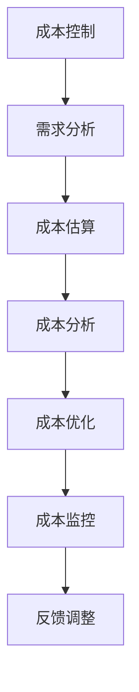
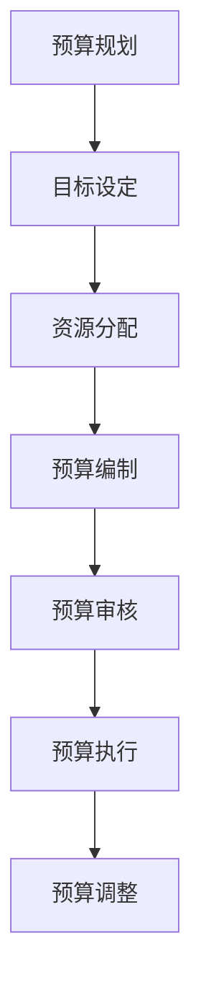
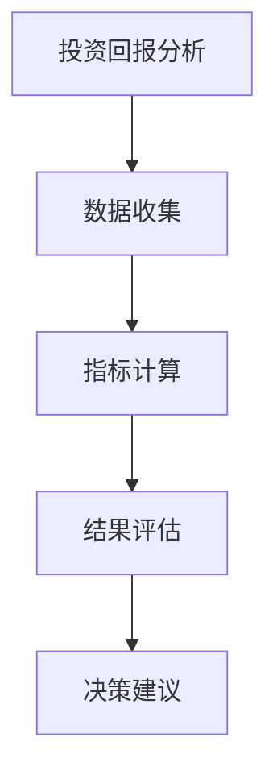
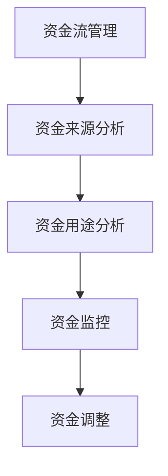
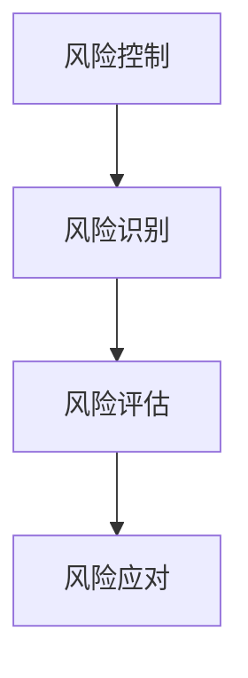
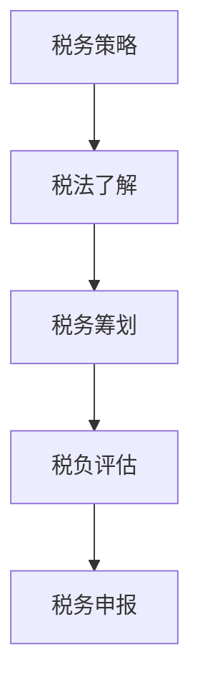

                 

关键词：AI创业公司、财务管理、成本控制、预算规划、投资回报分析、资金流管理、风险控制、税务策略、财务规划工具。

> 摘要：本文旨在探讨AI创业公司在初创和发展阶段如何制定有效的财务管理策略，包括成本控制、预算规划、投资回报分析、资金流管理、风险控制和税务策略等。通过这些策略的实施，AI创业公司可以确保财务稳健，为长期发展奠定坚实基础。

## 1. 背景介绍

随着人工智能技术的飞速发展，越来越多的创业公司投身于这一领域。然而，AI创业公司面临着诸多财务挑战，如资金短缺、成本控制难、预算规划不合理等。因此，制定有效的财务管理策略成为AI创业公司成功的关键。本文将重点讨论以下几个方面的财务管理策略：

- **成本控制**：减少不必要支出，提高资源利用效率。
- **预算规划**：合理分配资金，确保财务资源最大化利用。
- **投资回报分析**：评估投资项目，确保资金投入获得回报。
- **资金流管理**：监控资金流动，确保公司资金链健康。
- **风险控制**：识别潜在风险，制定应对措施。
- **税务策略**：合理规划税务，降低公司税负。

## 2. 核心概念与联系

### 2.1 成本控制

成本控制是AI创业公司财务管理的核心之一。通过优化运营流程、降低库存成本、合理采购等方式，可以减少不必要支出。以下是一个简单的成本控制流程图：



### 2.2 预算规划

预算规划是确保财务资源最大化利用的关键。通过制定详细的预算计划，可以更好地分配资金，减少浪费。以下是一个简单的预算规划流程图：



### 2.3 投资回报分析

投资回报分析是评估投资项目的重要手段。通过计算投资回报率（ROI）、净现值（NPV）等指标，可以判断投资项目是否值得投入。以下是一个简单的投资回报分析流程图：



### 2.4 资金流管理

资金流管理是确保公司资金链健康的重要环节。通过监控资金流动、及时调整资金使用计划，可以避免资金短缺或浪费。以下是一个简单的资金流管理流程图：



### 2.5 风险控制

风险控制是识别和应对潜在风险的过程。通过制定风险管理策略、建立风险预警机制，可以降低公司风险。以下是一个简单的风险控制流程图：



### 2.6 税务策略

税务策略是合理规划税务、降低公司税负的重要手段。通过了解税法、合理避税，可以提高公司利润。以下是一个简单的税务策略流程图：



## 3. 核心算法原理 & 具体操作步骤

### 3.1 算法原理概述

本文涉及的核心算法主要包括成本控制算法、预算规划算法、投资回报分析算法、资金流管理算法、风险控制算法和税务策略算法。这些算法基于数学模型和数据分析技术，可以有效地解决AI创业公司的财务管理问题。

### 3.2 算法步骤详解

#### 3.2.1 成本控制算法

1. 需求分析：分析公司运营过程中产生的各项成本，包括固定成本和变动成本。
2. 成本估算：根据历史数据和市场信息，估算各项成本。
3. 成本分析：对比实际成本与估算成本，分析成本差异。
4. 成本优化：针对成本差异，提出优化建议，如调整采购策略、降低库存成本等。
5. 成本监控：持续监控成本变化，确保优化效果。

#### 3.2.2 预算规划算法

1. 目标设定：根据公司发展战略和业务需求，设定预算目标。
2. 资源分配：根据预算目标，合理分配各部门资源。
3. 预算编制：编制详细的预算计划，包括收入预算、支出预算等。
4. 预算审核：对预算计划进行审核，确保预算合理。
5. 预算执行：根据预算计划，执行各项业务活动。
6. 预算调整：根据实际情况，对预算计划进行调整。

#### 3.2.3 投资回报分析算法

1. 数据收集：收集投资项目的历史数据、市场信息和相关指标。
2. 指标计算：计算投资回报率（ROI）、净现值（NPV）等指标。
3. 结果评估：根据计算结果，评估投资项目的可行性。
4. 决策建议：根据评估结果，提出投资决策建议。

#### 3.2.4 资金流管理算法

1. 资金来源分析：分析公司资金来源，包括股权融资、债务融资等。
2. 资金用途分析：分析公司资金用途，包括投资、运营等。
3. 资金监控：实时监控资金流动，确保资金使用合理。
4. 资金调整：根据资金流动情况，调整资金使用计划。

#### 3.2.5 风险控制算法

1. 风险识别：识别公司可能面临的风险，包括市场风险、运营风险等。
2. 风险评估：评估风险的影响程度和发生概率。
3. 风险应对：制定应对措施，降低风险。
4. 风险监控：持续监控风险变化，确保应对措施有效。

#### 3.2.6 税务策略算法

1. 税法了解：了解国家和地方税法，掌握税收优惠政策。
2. 税务筹划：根据税法，制定合理的税务筹划方案。
3. 税负评估：评估税务筹划方案的税负，确保合法合规。
4. 税务申报：根据税务筹划方案，进行税务申报。

### 3.3 算法优缺点

#### 3.3.1 成本控制算法

**优点**：

- 降低成本，提高资源利用效率。
- 提高公司竞争力，降低运营风险。

**缺点**：

- 成本控制过于严格可能导致创新受阻。
- 成本控制需要大量数据支持和专业人才。

#### 3.3.2 预算规划算法

**优点**：

- 提高预算管理效率，确保财务资源最大化利用。
- 促进公司各部门之间的协作与沟通。

**缺点**：

- 预算编制过程中可能存在人为偏差。
- 预算执行过程中可能遇到突发情况，需要灵活调整。

#### 3.3.3 投资回报分析算法

**优点**：

- 评估投资项目可行性，确保资金投入获得回报。
- 提高公司投资决策的科学性。

**缺点**：

- 需要大量数据支持，数据质量直接影响分析结果。
- 分析结果可能受到市场波动等因素的影响。

#### 3.3.4 资金流管理算法

**优点**：

- 确保公司资金链健康，提高资金使用效率。
- 提高公司应对突发事件的能力。

**缺点**：

- 需要实时监控资金流动，增加管理成本。
- 部分公司可能存在资金使用不规范的问题。

#### 3.3.5 风险控制算法

**优点**：

- 识别和应对潜在风险，降低公司风险。
- 提高公司风险管理能力。

**缺点**：

- 风险识别和评估需要大量数据和专业人才。
- 风险应对措施可能影响公司业务发展。

#### 3.3.6 税务策略算法

**优点**：

- 合理规划税务，降低公司税负。
- 提高公司盈利能力。

**缺点**：

- 需要了解国家和地方税法，政策变化可能导致筹划方案失效。
- 税务筹划需要专业人才支持。

### 3.4 算法应用领域

#### 3.4.1 成本控制算法

- 适用于各类创业公司，特别是成本结构复杂的企业。
- 适用于成本控制较为严格的企业，如制造行业。

#### 3.4.2 预算规划算法

- 适用于初创期和扩张期的创业公司。
- 适用于需要进行大规模投资的创业公司。

#### 3.4.3 投资回报分析算法

- 适用于需要进行投资决策的创业公司。
- 适用于需要对投资项目进行跟踪评估的创业公司。

#### 3.4.4 资金流管理算法

- 适用于资金需求较大的创业公司。
- 适用于需要进行跨国运营的创业公司。

#### 3.4.5 风险控制算法

- 适用于面临较高风险的创业公司。
- 适用于需要进行全面风险管理的创业公司。

#### 3.4.6 税务策略算法

- 适用于需要进行税务筹划的创业公司。
- 适用于需要降低税负的创业公司。

## 4. 数学模型和公式 & 详细讲解 & 举例说明

### 4.1 数学模型构建

#### 成本控制模型

成本控制模型主要基于成本估算、成本分析和成本优化三个环节。以下是一个简单的成本控制数学模型：

$$
C = C_0 + C_1 \cdot Q + C_2 \cdot Q^2
$$

其中，$C$ 为总成本，$C_0$ 为固定成本，$C_1$ 和 $C_2$ 为变动成本系数，$Q$ 为产量。

#### 预算规划模型

预算规划模型主要基于目标设定、资源分配和预算编制三个环节。以下是一个简单的预算规划数学模型：

$$
B = B_0 + B_1 \cdot R + B_2 \cdot R^2
$$

其中，$B$ 为预算总额，$B_0$ 为基本预算，$B_1$ 和 $B_2$ 为资源分配系数，$R$ 为资源数量。

#### 投资回报分析模型

投资回报分析模型主要基于数据收集、指标计算和结果评估三个环节。以下是一个简单的投资回报分析数学模型：

$$
ROI = \frac{NPV}{Investment}
$$

其中，$ROI$ 为投资回报率，$NPV$ 为净现值，$Investment$ 为投资总额。

#### 资金流管理模型

资金流管理模型主要基于资金来源分析、资金用途分析和资金监控三个环节。以下是一个简单的资金流管理数学模型：

$$
CashFlow = Income - Expenses
$$

其中，$CashFlow$ 为现金流量，$Income$ 为收入，$Expenses$ 为支出。

#### 风险控制模型

风险控制模型主要基于风险识别、风险评估和风险应对三个环节。以下是一个简单的风险控制数学模型：

$$
Risk = P \cdot C
$$

其中，$Risk$ 为风险，$P$ 为风险发生概率，$C$ 为风险损失。

#### 税务策略模型

税务策略模型主要基于税法了解、税务筹划和税负评估三个环节。以下是一个简单的税务策略数学模型：

$$
Tax = TaxRate \cdot Income
$$

其中，$Tax$ 为税额，$TaxRate$ 为税率，$Income$ 为收入。

### 4.2 公式推导过程

#### 成本控制模型推导

成本控制模型基于成本估算、成本分析和成本优化三个环节。假设公司固定成本为 $C_0$，变动成本系数为 $C_1$ 和 $C_2$，产量为 $Q$，则总成本可以表示为：

$$
C = C_0 + C_1 \cdot Q + C_2 \cdot Q^2
$$

其中，$C_0$ 为固定成本，不随产量变化而变化。$C_1$ 和 $C_2$ 为变动成本系数，分别表示每增加一个单位产量所需增加的成本。$Q$ 为产量，表示公司生产的产品数量。

#### 预算规划模型推导

预算规划模型基于目标设定、资源分配和预算编制三个环节。假设公司基本预算为 $B_0$，资源分配系数为 $B_1$ 和 $B_2$，资源数量为 $R$，则预算总额可以表示为：

$$
B = B_0 + B_1 \cdot R + B_2 \cdot R^2
$$

其中，$B_0$ 为基本预算，表示公司日常运营所需的最低预算。$B_1$ 和 $B_2$ 为资源分配系数，分别表示每增加一个单位资源所需增加的预算。$R$ 为资源数量，表示公司可分配的资源总量。

#### 投资回报分析模型推导

投资回报分析模型基于数据收集、指标计算和结果评估三个环节。假设公司投资总额为 $Investment$，净现值为 $NPV$，则投资回报率可以表示为：

$$
ROI = \frac{NPV}{Investment}
$$

其中，$ROI$ 为投资回报率，表示投资获得的回报与投资总额的比值。$NPV$ 为净现值，表示投资项目的未来现金流量的现值与投资总额的差额。$Investment$ 为投资总额，表示公司为投资项目投入的资金。

#### 资金流管理模型推导

资金流管理模型基于资金来源分析、资金用途分析和资金监控三个环节。假设公司收入为 $Income$，支出为 $Expenses$，则现金流量可以表示为：

$$
CashFlow = Income - Expenses
$$

其中，$CashFlow$ 为现金流量，表示公司一定时期内的资金流入与流出的差额。$Income$ 为收入，表示公司一定时期内获得的资金。$Expenses$ 为支出，表示公司一定时期内支付的资金。

#### 风险控制模型推导

风险控制模型基于风险识别、风险评估和风险应对三个环节。假设风险发生概率为 $P$，风险损失为 $C$，则风险可以表示为：

$$
Risk = P \cdot C
$$

其中，$Risk$ 为风险，表示公司面临的风险。$P$ 为风险发生概率，表示风险事件发生的可能性。$C$ 为风险损失，表示风险事件发生时公司可能遭受的损失。

#### 税务策略模型推导

税务策略模型基于税法了解、税务筹划和税负评估三个环节。假设税率为 $TaxRate$，收入为 $Income$，则税额可以表示为：

$$
Tax = TaxRate \cdot Income
$$

其中，$Tax$ 为税额，表示公司应缴纳的税款。$TaxRate$ 为税率，表示税收的比例。$Income$ 为收入，表示公司一定时期内获得的收入。

### 4.3 案例分析与讲解

以下以一家AI创业公司为例，分析其财务管理策略。

#### 案例一：成本控制

1. 需求分析：分析公司运营过程中的固定成本和变动成本。例如，固定成本包括租金、员工薪酬等；变动成本包括原材料采购、研发投入等。

2. 成本估算：根据历史数据和市场需求，估算各项成本。例如，租金为每月 100,000 元，员工薪酬为每月 200,000 元，原材料采购为每月 150,000 元，研发投入为每月 50,000 元。

3. 成本分析：对比实际成本与估算成本，分析成本差异。例如，实际成本为每月 180,000 元，比估算成本高出 30,000 元。

4. 成本优化：提出优化建议，如降低原材料采购成本、优化员工薪酬结构等。例如，通过与供应商谈判降低原材料采购成本，每月可节省 10,000 元。

5. 成本监控：持续监控成本变化，确保优化效果。例如，每月进行成本分析，确保成本控制措施得到有效执行。

#### 案例二：预算规划

1. 目标设定：根据公司发展战略和业务需求，设定预算目标。例如，预算目标为每月收入 500,000 元，支出 400,000 元。

2. 资源分配：根据预算目标，合理分配各部门资源。例如，将收入目标分配给销售部门，支出目标分配给生产部门、研发部门和行政管理部门。

3. 预算编制：编制详细的预算计划，包括收入预算、支出预算等。例如，销售部门收入预算为 300,000 元，生产部门支出预算为 200,000 元，研发部门支出预算为 50,000 元，行政管理部门支出预算为 50,000 元。

4. 预算审核：对预算计划进行审核，确保预算合理。例如，财务部门对预算计划进行审核，确保各部门预算不超出公司财务能力。

5. 预算执行：根据预算计划，执行各项业务活动。例如，销售部门开展促销活动，生产部门优化生产流程，研发部门加大研发投入，行政管理部门加强内部管理。

6. 预算调整：根据实际情况，对预算计划进行调整。例如，如果市场环境发生变化，导致收入目标无法实现，需要对预算计划进行调整，确保公司财务状况稳定。

#### 案例三：投资回报分析

1. 数据收集：收集投资项目的历史数据、市场信息和相关指标。例如，投资项目的市场前景、竞争对手情况、投资金额、预期收益等。

2. 指标计算：计算投资回报率（ROI）、净现值（NPV）等指标。例如，投资回报率为 20%，净现值为 100 万元。

3. 结果评估：根据计算结果，评估投资项目的可行性。例如，投资回报率高于行业平均水平，净现值为正，说明投资项目具有可行性。

4. 决策建议：根据评估结果，提出投资决策建议。例如，建议公司加大投资力度，扩大市场份额。

#### 案例四：资金流管理

1. 资金来源分析：分析公司资金来源，包括股权融资、债务融资等。例如，公司通过股权融资获得 100 万元，通过债务融资获得 200 万元。

2. 资金用途分析：分析公司资金用途，包括投资、运营等。例如，投资金额为 300 万元，运营费用为 200 万元。

3. 资金监控：实时监控资金流动，确保资金使用合理。例如，每月进行资金流动分析，确保投资和运营资金得到有效使用。

4. 资金调整：根据资金流动情况，调整资金使用计划。例如，如果资金流动紧张，可以减少投资规模，确保运营资金充足。

#### 案例五：风险控制

1. 风险识别：识别公司可能面临的风险，包括市场风险、运营风险等。例如，市场风险包括市场竞争加剧、客户流失等；运营风险包括产品质量问题、运营成本上升等。

2. 风险评估：评估风险的影响程度和发生概率。例如，市场风险的影响程度较高，发生概率较高；运营风险的影响程度较低，发生概率较低。

3. 风险应对：制定应对措施，降低风险。例如，市场风险可以通过加强与客户沟通、提高产品质量等方式降低；运营风险可以通过加强质量管理、优化运营流程等方式降低。

4. 风险监控：持续监控风险变化，确保应对措施有效。例如，定期进行风险评估，及时调整应对措施，确保风险得到有效控制。

#### 案例六：税务策略

1. 税法了解：了解国家和地方税法，掌握税收优惠政策。例如，国家针对高新技术企业有税收优惠政策。

2. 税务筹划：根据税法，制定合理的税务筹划方案。例如，通过优化企业组织结构、提高研发投入等方式降低税负。

3. 税负评估：评估税务筹划方案的税负，确保合法合规。例如，对比不同税务筹划方案的税负，选择最优方案。

4. 税务申报：根据税务筹划方案，进行税务申报。例如，按照筹划方案申报税款，确保企业合法合规。

## 5. 项目实践：代码实例和详细解释说明

以下以Python代码为例，实现AI创业公司的财务管理策略。

### 5.1 开发环境搭建

1. 安装Python环境：下载并安装Python 3.8及以上版本。
2. 安装Python包：使用pip命令安装相关Python包，如numpy、matplotlib等。

### 5.2 源代码详细实现

```python
import numpy as np
import matplotlib.pyplot as plt

# 成本控制算法
def cost_control(production, fixed_cost, variable_cost1, variable_cost2):
    total_cost = fixed_cost + variable_cost1 * production + variable_cost2 * production**2
    return total_cost

# 预算规划算法
def budget_planning(basic_budget, resource分配系数，resource_number):
    budget_total = basic_budget + resource分配系数 * resource_number + resource分配系数 * resource_number**2
    return budget_total

# 投资回报分析算法
def investment_analysis(investment, npv):
    roi = npv / investment
    return roi

# 资金流管理算法
def cash_flow_management(income, expenses):
    cash_flow = income - expenses
    return cash_flow

# 风险控制算法
def risk_control(risk_probability, risk_loss):
    risk = risk_probability * risk_loss
    return risk

# 税务策略算法
def tax_strategy(tax_rate, income):
    tax = tax_rate * income
    return tax

# 案例实现
production = 1000
fixed_cost = 100000
variable_cost1 = 0.5
variable_cost2 = 0.05
resource分配系数 = 0.3
resource_number = 1000
investment = 300000
npv = 100000
income = 500000
expenses = 400000
tax_rate = 0.3

# 执行算法
total_cost = cost_control(production, fixed_cost, variable_cost1, variable_cost2)
budget_total = budget_planning(100000, resource分配系数，resource_number)
roi = investment_analysis(investment, npv)
cash_flow = cash_flow_management(income, expenses)
risk = risk_control(0.8, 50000)
tax = tax_strategy(tax_rate, income)

# 输出结果
print("总成本：", total_cost)
print("预算总额：", budget_total)
print("投资回报率：", roi)
print("现金流量：", cash_flow)
print("风险：", risk)
print("税额：", tax)
```

### 5.3 代码解读与分析

1. 成本控制算法：通过输入产量、固定成本和变动成本系数，计算总成本。该算法可以用于分析公司运营过程中的成本结构，为成本控制提供依据。

2. 预算规划算法：通过输入基本预算、资源分配系数和资源数量，计算预算总额。该算法可以用于制定公司的预算计划，确保财务资源最大化利用。

3. 投资回报分析算法：通过输入投资金额和净现值，计算投资回报率。该算法可以用于评估投资项目的可行性，为投资决策提供参考。

4. 资金流管理算法：通过输入收入和支出，计算现金流量。该算法可以用于监控公司资金流动情况，确保资金链健康。

5. 风险控制算法：通过输入风险发生概率和风险损失，计算风险。该算法可以用于识别和评估公司面临的风险，为风险应对提供依据。

6. 税务策略算法：通过输入税率

