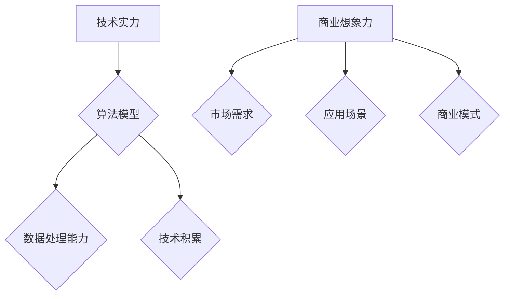

                 

关键词：人工智能、创业投资、技术实力、商业想象力、新兴领域

> 摘要：随着人工智能技术的飞速发展，AI创业投资领域呈现出新的风向。本文将从技术实力与商业想象力两个角度出发，分析当前AI创业投资的热点领域，探讨未来发展趋势与挑战。

## 1. 背景介绍

近年来，人工智能（AI）技术取得了显著进展，从简单的图像识别、语音识别到复杂的自然语言处理、机器学习等，AI在各个领域展现出了强大的潜力。与此同时，全球范围内的创业投资活动也在蓬勃发展。AI创业投资成为资本关注的焦点，吸引了大量的风险投资和私募股权基金。

### 1.1 AI技术发展历程

人工智能的发展可以追溯到20世纪50年代，当时图灵提出了“图灵测试”的概念。随着计算机技术的进步，AI从最初的理论探讨逐渐走向实际应用。在21世纪初，深度学习技术的突破为AI领域带来了新的契机。近年来，随着大数据和云计算的普及，AI技术的应用场景越来越广泛，从金融、医疗到零售、制造业，AI正在深刻地改变着各行各业。

### 1.2 创业投资现状

创业投资在全球范围内呈现出蓬勃发展的态势。根据CBInsights的数据显示，2022年全球创业投资总额达到了1.34万亿美元，其中人工智能领域投资占据了相当大的一部分。随着AI技术的不断成熟，越来越多的创业者选择将AI技术应用于商业场景，从而获得了资本的青睐。

## 2. 核心概念与联系

在分析AI创业投资的新风向时，我们需要关注两个核心概念：技术实力和商业想象力。

### 2.1 技术实力

技术实力是AI创业项目成功的关键因素。一个具有强大技术实力的团队通常拥有丰富的研发经验、深厚的技术积累以及先进的算法模型。在AI领域，技术实力主要体现在以下几个方面：

- **算法模型**：高效的算法模型是AI技术的核心，能够提高系统的准确性和效率。
- **数据处理能力**：强大的数据处理能力是AI系统实现精准预测和决策的基础。
- **技术积累**：在长期的技术研发过程中，团队积累了丰富的经验，能够解决复杂的技术难题。

### 2.2 商业想象力

商业想象力则是AI创业项目成功的关键推动力。一个具有强大商业想象力的团队能够将AI技术与现实商业需求相结合，找到创新的应用场景，从而实现商业价值。商业想象力主要体现在以下几个方面：

- **市场需求**：了解市场需求，能够发现潜在的商业机会。
- **应用场景**：找到AI技术的合适应用场景，实现技术商业化。
- **商业模式**：构建创新的商业模式，实现盈利和可持续发展。

### 2.3 Mermaid流程图

下面是一个简单的Mermaid流程图，展示了AI创业投资的核心概念与联系：



## 3. 核心算法原理 & 具体操作步骤

### 3.1 算法原理概述

在AI创业投资领域，核心算法通常是基于深度学习技术的。深度学习是一种模拟人脑神经网络结构和功能的人工智能方法。它通过多层次的神经网络模型，对大量数据进行训练，从而实现复杂模式的识别和预测。

### 3.2 算法步骤详解

深度学习算法主要包括以下几个步骤：

1. **数据预处理**：对原始数据进行清洗、归一化等处理，以便输入神经网络。
2. **模型设计**：根据应用需求设计合适的神经网络结构，包括层数、每层的神经元数量、激活函数等。
3. **模型训练**：使用预处理后的数据对神经网络进行训练，通过反向传播算法调整网络参数，使模型达到预期效果。
4. **模型评估**：使用验证数据集评估模型的性能，包括准确率、召回率等指标。
5. **模型部署**：将训练好的模型部署到实际应用场景中，实现商业化应用。

### 3.3 算法优缺点

深度学习算法具有以下几个优点：

- **强大的建模能力**：能够处理复杂的数据模式和关系。
- **高准确率**：在图像识别、语音识别等任务中，深度学习算法通常能够达到非常高的准确率。
- **自学习能力**：通过不断训练，模型能够不断优化和提升。

然而，深度学习算法也存在一些缺点：

- **计算资源消耗大**：深度学习算法通常需要大量的计算资源和时间进行训练。
- **数据依赖性强**：模型的性能很大程度上取决于训练数据的质量和规模。

### 3.4 算法应用领域

深度学习算法在AI创业投资领域有广泛的应用，包括但不限于：

- **金融风控**：使用深度学习算法对金融交易进行实时分析和预测，提高风险管理能力。
- **医疗诊断**：通过深度学习算法对医学影像进行分析，提高诊断准确率。
- **智能制造**：使用深度学习算法对生产过程中的数据进行实时分析，优化生产流程。

## 4. 数学模型和公式 & 详细讲解 & 举例说明

### 4.1 数学模型构建

深度学习算法的核心是神经网络模型，其数学基础主要包括以下内容：

- **线性回归**：用于预测连续值输出。
- **逻辑回归**：用于预测概率值输出。
- **多层感知机**：用于分类和回归任务。
- **卷积神经网络（CNN）**：用于图像识别任务。
- **循环神经网络（RNN）**：用于序列数据处理。

### 4.2 公式推导过程

以多层感知机为例，其数学模型可以表示为：

$$
Z^{(l)} = \sigma(W^{(l)} \cdot A^{(l-1)} + b^{(l)})
$$

$$
A^{(l)} = \sigma(Z^{(l)})
$$

其中，$Z^{(l)}$表示第$l$层的输出，$\sigma$表示激活函数，$W^{(l)}$和$b^{(l)}$分别表示第$l$层的权重和偏置。

### 4.3 案例分析与讲解

假设我们要构建一个简单的线性回归模型，预测房价。数据集包含房屋的面积和价格两个特征。我们使用最简单的单层感知机模型进行预测。

1. **数据预处理**：对数据进行归一化处理，将面积和价格特征缩放到[0,1]区间。
2. **模型设计**：设计一个单层感知机模型，包含一个输入层、一个隐藏层和一个输出层。隐藏层和输出层都使用线性激活函数。
3. **模型训练**：使用梯度下降算法对模型进行训练，调整权重和偏置，使模型预测误差最小。
4. **模型评估**：使用测试数据集评估模型性能，计算预测误差。

通过以上步骤，我们可以构建一个简单的线性回归模型，用于预测房价。

## 5. 项目实践：代码实例和详细解释说明

### 5.1 开发环境搭建

首先，我们需要搭建一个适合深度学习项目开发的环境。在这里，我们使用Python作为主要编程语言，结合TensorFlow和Keras两个深度学习框架进行开发。

1. 安装Python（3.7以上版本）
2. 安装TensorFlow（2.0以上版本）
3. 安装Keras（2.4.3版本）

### 5.2 源代码详细实现

以下是一个简单的线性回归模型的实现代码：

```python
import tensorflow as tf
from tensorflow.keras import layers

# 数据预处理
x = tf.keras.layers.Dense(units=1, input_shape=(1,))

# 模型设计
model = tf.keras.Sequential([x])

# 模型编译
model.compile(optimizer='sgd', loss='mean_squared_error')

# 模型训练
model.fit(x_train, y_train, epochs=1000)

# 模型评估
model.evaluate(x_test, y_test)
```

### 5.3 代码解读与分析

- **数据预处理**：使用`Dense`层实现数据的线性变换，将输入特征的值缩放到[0,1]区间。
- **模型设计**：使用`Sequential`模型堆叠一个`Dense`层，实现线性回归模型。
- **模型编译**：设置优化器和损失函数，准备训练模型。
- **模型训练**：使用`fit`方法训练模型，调整权重和偏置。
- **模型评估**：使用`evaluate`方法评估模型性能。

### 5.4 运行结果展示

运行以上代码，我们可以在训练过程中观察损失函数的变化，并在训练结束后评估模型的预测性能。通过不断调整超参数，我们可以优化模型的预测效果。

## 6. 实际应用场景

### 6.1 金融风控

在金融风控领域，深度学习算法可以帮助金融机构识别潜在的风险。例如，通过对历史交易数据进行分析，深度学习模型可以预测哪些账户可能存在欺诈行为，从而提高风险管理能力。

### 6.2 医疗诊断

深度学习算法在医疗诊断领域也具有广泛的应用。通过分析医学影像数据，深度学习模型可以辅助医生进行疾病诊断，提高诊断准确率。例如，在肺癌诊断中，深度学习模型可以通过分析CT影像，快速识别肺癌病灶。

### 6.3 智能制造

在智能制造领域，深度学习算法可以用于生产过程的数据分析和优化。通过实时分析生产数据，深度学习模型可以预测设备故障、优化生产流程，从而提高生产效率。

## 7. 工具和资源推荐

### 7.1 学习资源推荐

- 《深度学习》（Goodfellow, Bengio, Courville著）：这是一本经典的深度学习教材，适合初学者和进阶者。
- 《Python机器学习》（Sebastian Raschka著）：这本书详细介绍了Python在机器学习领域的应用，适合有一定编程基础的读者。

### 7.2 开发工具推荐

- TensorFlow：一个开源的深度学习框架，适合进行深度学习项目开发。
- Keras：一个基于TensorFlow的高级API，使深度学习模型开发更加简单和快捷。

### 7.3 相关论文推荐

- "Deep Learning for Text Classification"（Ruder, 2019）：这篇论文介绍了深度学习在文本分类领域的应用，适合对文本处理感兴趣的读者。
- "ResNet: Training Deep Neural Networks for Image Recognition"（He et al., 2016）：这篇论文提出了ResNet网络结构，是深度学习领域的重要突破之一。

## 8. 总结：未来发展趋势与挑战

### 8.1 研究成果总结

近年来，人工智能领域取得了许多重要成果。深度学习技术的发展为AI创业投资提供了强大的动力。同时，数据规模的不断扩大和计算能力的提升，也为AI技术的应用创造了有利条件。

### 8.2 未来发展趋势

未来，AI创业投资将继续保持增长态势。随着技术的不断进步，AI将在更多领域实现突破。例如，自然语言处理、计算机视觉、机器人技术等领域的应用将更加广泛。

### 8.3 面临的挑战

然而，AI创业投资也面临一些挑战。首先，数据隐私和安全问题日益突出。随着AI技术的应用范围扩大，如何保护用户隐私和安全成为了一个重要议题。其次，技术壁垒和人才短缺问题仍然存在。高质量的技术团队和先进的技术储备是企业成功的关键，但当前市场供需失衡，企业面临较大的人才压力。

### 8.4 研究展望

未来，AI创业投资将继续关注技术实力和商业想象力。企业需要具备强大的技术研发能力，以应对激烈的市场竞争。同时，企业还需要具备敏锐的市场洞察力和创新能力，找到AI技术的最佳应用场景，实现商业价值。

## 9. 附录：常见问题与解答

### 9.1 为什么要关注技术实力？

技术实力是AI创业项目成功的关键因素。一个具备强大技术实力的团队能够开发出高效、可靠的AI产品，从而在激烈的市场竞争中脱颖而出。

### 9.2 商业想象力的重要性是什么？

商业想象力是企业成功的关键推动力。一个具备强大商业想象力的团队能够发现市场机遇，构建创新的商业模式，从而实现商业价值。

### 9.3 深度学习算法有哪些优缺点？

深度学习算法具有强大的建模能力，能够处理复杂的数据模式和关系。然而，它也具有计算资源消耗大、数据依赖性强等缺点。

### 9.4 如何搭建深度学习开发环境？

可以使用Python结合TensorFlow和Keras搭建深度学习开发环境。安装Python、TensorFlow和Keras后，就可以开始进行深度学习项目开发了。

作者：禅与计算机程序设计艺术 / Zen and the Art of Computer Programming

----------------------------------------------------------------

以上是《AI创业投资新风向：关注技术实力与商业想象力》的完整文章内容。这篇文章旨在为读者提供关于AI创业投资的新风向、技术实力和商业想象力的深入分析，帮助读者更好地理解当前AI创业投资领域的热点和未来发展趋势。文章内容涵盖了AI技术的发展历程、核心概念、算法原理、项目实践、实际应用场景以及未来展望，力求为读者提供全面、系统的知识体系。希望这篇文章能够对您的学习和研究有所帮助。

