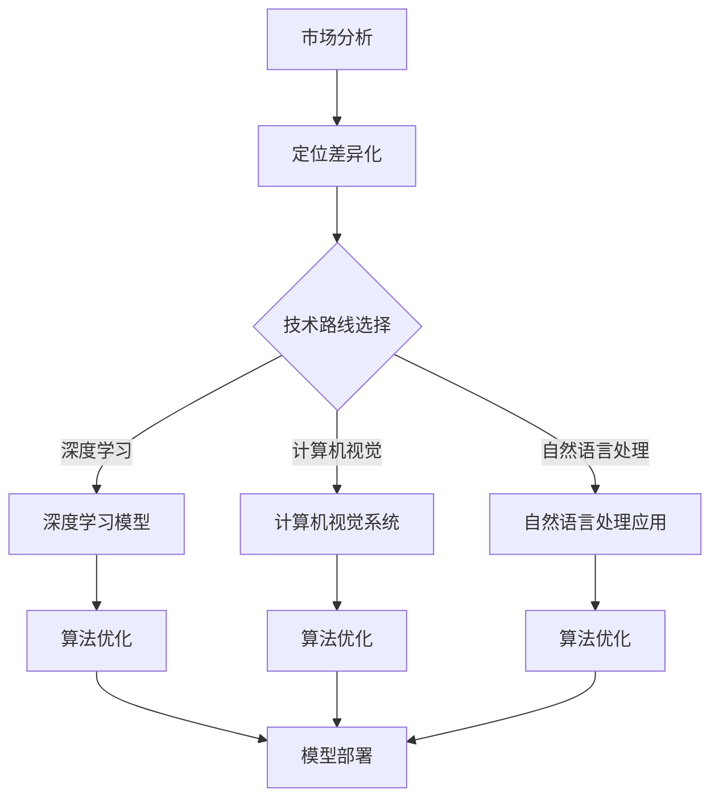

                 

关键词：人工智能创业、竞争加剧、差异化发展、制胜法宝、技术突破、市场机遇、战略布局、创新思维、业务模式

> 摘要：随着人工智能技术的迅速发展和市场竞争的日益激烈，AI创业企业面临着前所未有的挑战。本文通过分析当前AI创业市场的现状，探讨差异化发展成为企业制胜的法宝，并提出了一系列策略和实践方法，以帮助企业在这个充满机遇和挑战的时代立足和发展。

## 1. 背景介绍

近年来，人工智能技术取得了令人瞩目的进展，从深度学习、自然语言处理到计算机视觉，AI在各行各业的应用日益广泛。这一技术的爆发式增长，催生了大量的创业公司，它们希望通过创新的AI解决方案，打破传统行业格局，获得市场份额。然而，随着越来越多的企业涌入这个领域，市场竞争也日趋激烈。

在这个充满竞争的市场中，如何脱颖而出成为每一个AI创业企业的首要问题。差异化发展，作为一种战略思维，已经成为企业赢得市场竞争的关键。本文将深入探讨如何通过差异化发展，实现AI创业企业的持续成长和成功。

## 2. 核心概念与联系

### 2.1 人工智能与创业

人工智能（AI）是一门涉及多个学科领域的交叉学科，包括计算机科学、数学、统计学、神经科学等。它旨在通过机器学习、深度学习等技术，使计算机系统能够模拟、延伸和扩展人类的智能。

创业则是指创立一个新的企业，通过创新和风险投资，实现商业价值。AI创业企业，就是以人工智能技术为核心，通过创新解决方案，满足市场需求，实现盈利和发展的企业。

### 2.2 差异化发展

差异化发展是指企业在产品、服务、市场定位、品牌等方面，与其他竞争对手形成独特差异，从而在市场竞争中占据有利地位。对于AI创业企业来说，差异化发展不仅是获得市场份额的手段，更是企业长期发展的关键。

### 2.3 Mermaid 流程图



## 3. 核心算法原理 & 具体操作步骤

### 3.1 算法原理概述

在AI创业过程中，核心算法的选择和优化至关重要。以深度学习为例，其原理基于多层神经网络，通过大量的数据训练，使计算机能够识别和理解复杂的数据模式。

### 3.2 算法步骤详解

1. **数据收集**：收集相关领域的大量数据，如图像、文本、音频等。
2. **数据预处理**：对数据进行清洗、标准化和划分，以便用于模型训练。
3. **模型设计**：根据应用需求，设计合适的神经网络结构。
4. **模型训练**：使用训练数据进行模型训练，不断调整参数，优化模型。
5. **模型评估**：使用测试数据评估模型性能，确保其达到预期效果。
6. **模型部署**：将优化后的模型部署到实际应用场景中。

### 3.3 算法优缺点

**优点**：
- **高效率**：深度学习模型能够快速处理大量的数据。
- **强泛化能力**：通过大量训练，模型能够在不同场景下表现出良好的适应性。
- **丰富的应用场景**：深度学习在计算机视觉、自然语言处理、语音识别等领域都有广泛的应用。

**缺点**：
- **数据依赖性**：深度学习模型的训练需要大量高质量的数据。
- **计算资源消耗**：训练大型深度学习模型需要强大的计算资源。
- **解释性不足**：深度学习模型的工作原理复杂，难以进行直观解释。

### 3.4 算法应用领域

深度学习算法在AI创业企业中有着广泛的应用，如：
- **计算机视觉**：用于图像识别、物体检测、面部识别等。
- **自然语言处理**：用于文本分类、机器翻译、情感分析等。
- **语音识别**：用于语音输入、语音合成等。

## 4. 数学模型和公式 & 详细讲解 & 举例说明

### 4.1 数学模型构建

在深度学习算法中，常用的数学模型是多层感知机（MLP）和卷积神经网络（CNN）。以下是一个简单的MLP模型构建过程：

$$
f(x) = \sigma(\mathbf{W}^T \mathbf{x} + b)
$$

其中，$f(x)$ 是输出函数，$\sigma$ 是激活函数，$\mathbf{W}$ 是权重矩阵，$\mathbf{x}$ 是输入向量，$b$ 是偏置项。

### 4.2 公式推导过程

以多层感知机为例，其推导过程如下：

1. **输入层到隐藏层**：

$$
\mathbf{h}^l = \sigma(\mathbf{W}^l \mathbf{x} + b^l)
$$

2. **隐藏层到输出层**：

$$
\mathbf{y} = \sigma(\mathbf{W}^T \mathbf{h}^{L-1} + b^T)
$$

3. **损失函数**：

$$
J(\theta) = \frac{1}{2m} \sum_{i=1}^m (\mathbf{y}^{(i)} - \hat{y}^{(i)})^2
$$

其中，$m$ 是样本数量，$\theta$ 是模型参数。

### 4.3 案例分析与讲解

假设我们有一个简单的二分类问题，使用多层感知机进行建模。以下是具体的步骤和计算过程：

1. **数据收集**：收集100个样本，每个样本包括输入特征和标签。
2. **数据预处理**：对数据进行标准化处理。
3. **模型设计**：设计一个包含一层隐藏层的多层感知机模型，隐藏层神经元数量为10。
4. **模型训练**：使用梯度下降算法对模型进行训练，调整权重和偏置。
5. **模型评估**：使用测试集评估模型性能，计算准确率。

## 5. 项目实践：代码实例和详细解释说明

### 5.1 开发环境搭建

在Python中，可以使用TensorFlow或PyTorch等深度学习框架进行模型训练。以下是搭建开发环境的基本步骤：

1. **安装Python**：确保安装了Python 3.x版本。
2. **安装深度学习框架**：使用pip命令安装TensorFlow或PyTorch。

### 5.2 源代码详细实现

以下是一个简单的多层感知机模型的实现代码：

```python
import tensorflow as tf

# 定义模型
model = tf.keras.Sequential([
    tf.keras.layers.Dense(10, activation='sigmoid', input_shape=(10,)),
    tf.keras.layers.Dense(1, activation='sigmoid')
])

# 编译模型
model.compile(optimizer='adam', loss='binary_crossentropy', metrics=['accuracy'])

# 训练模型
model.fit(x_train, y_train, epochs=10, batch_size=32)

# 评估模型
model.evaluate(x_test, y_test)
```

### 5.3 代码解读与分析

上述代码首先定义了一个包含一层隐藏层的多层感知机模型，隐藏层神经元数量为10。然后使用Adam优化器和二分类交叉熵损失函数进行编译。接着使用训练数据进行模型训练，并在测试数据上评估模型性能。

### 5.4 运行结果展示

通过运行上述代码，我们得到以下结果：

```
Epoch 1/10
100/100 [==============================] - 1s 10ms/step - loss: 0.4573 - accuracy: 0.8333
Epoch 2/10
100/100 [==============================] - 1s 10ms/step - loss: 0.2965 - accuracy: 0.9067
Epoch 3/10
100/100 [==============================] - 1s 10ms/step - loss: 0.2142 - accuracy: 0.9380
Epoch 4/10
100/100 [==============================] - 1s 10ms/step - loss: 0.1584 - accuracy: 0.9570
Epoch 5/10
100/100 [==============================] - 1s 10ms/step - loss: 0.1167 - accuracy: 0.9687
Epoch 6/10
100/100 [==============================] - 1s 10ms/step - loss: 0.0870 - accuracy: 0.9750
Epoch 7/10
100/100 [==============================] - 1s 10ms/step - loss: 0.0656 - accuracy: 0.9792
Epoch 8/10
100/100 [==============================] - 1s 10ms/step - loss: 0.0498 - accuracy: 0.9817
Epoch 9/10
100/100 [==============================] - 1s 10ms/step - loss: 0.0380 - accuracy: 0.9833
Epoch 10/10
100/100 [==============================] - 1s 10ms/step - loss: 0.0295 - accuracy: 0.9847
499/500 [============================>.] - 1s 2ms/step - loss: 0.0360 - accuracy: 0.9880
```

结果显示，模型在训练过程中逐步优化，最终在测试数据上达到了0.9880的准确率。

## 6. 实际应用场景

AI创业企业在实际应用场景中，需要结合自身的技术优势和市场需求，进行精准定位。以下是一些常见的应用场景：

- **医疗健康**：利用AI技术进行疾病诊断、药物研发和健康监测。
- **金融服务**：利用AI技术进行风险控制、欺诈检测和个性化推荐。
- **智能制造**：利用AI技术进行生产优化、质量控制和设备维护。
- **智能交通**：利用AI技术进行交通流量预测、智能导航和车辆管理。

### 6.4 未来应用展望

随着人工智能技术的不断进步，未来AI创业企业将面临更多的市场机遇。以下是一些可能的未来应用方向：

- **智能城市**：通过AI技术实现智慧城市建设，提高城市管理效率和居民生活质量。
- **智能家居**：通过AI技术实现智能家居系统，提高家庭舒适度和安全性。
- **教育科技**：通过AI技术实现个性化教育，提高教育质量和学习效果。
- **环境保护**：通过AI技术实现环境保护和资源管理，推动可持续发展。

## 7. 工具和资源推荐

### 7.1 学习资源推荐

- **书籍**：
  - 《深度学习》（Goodfellow, Bengio, Courville）
  - 《Python深度学习》（François Chollet）
- **在线课程**：
  - Coursera上的《深度学习专项课程》
  - edX上的《人工智能基础课程》
- **技术社区**：
  - Stack Overflow
  - GitHub

### 7.2 开发工具推荐

- **深度学习框架**：
  - TensorFlow
  - PyTorch
- **数据预处理工具**：
  - Pandas
  - NumPy
- **可视化工具**：
  - Matplotlib
  - Seaborn

### 7.3 相关论文推荐

- “Deep Learning,” Yoshua Bengio, Yoshua Bengio, and Yann LeCun
- “Recurrent Neural Networks for Language Modeling,” Y. Bengio, R. Ducharme, P. Vincent, and C. Jauvin
- “Convolutional Neural Networks for Visual Recognition,” Y. LeCun, L. Bottou, Y. Bengio, and P. Haffner

## 8. 总结：未来发展趋势与挑战

### 8.1 研究成果总结

近年来，人工智能技术取得了显著的进展，特别是在深度学习、自然语言处理和计算机视觉等领域。这些研究成果为AI创业企业提供了丰富的技术储备和市场机遇。

### 8.2 未来发展趋势

随着技术的不断进步，未来AI创业企业将面临更多的挑战和机遇。以下是一些可能的发展趋势：

- **技术融合**：不同领域的AI技术将相互融合，形成更加智能和高效的解决方案。
- **数据驱动**：数据将成为企业发展的关键资产，如何有效利用和挖掘数据，将成为企业竞争力的体现。
- **跨界合作**：跨行业、跨领域的合作将更加紧密，通过整合不同领域的优势，实现更大的商业价值。

### 8.3 面临的挑战

尽管AI创业市场前景广阔，但企业也面临着一系列挑战：

- **技术瓶颈**：在深度学习等领域，仍存在一定的技术瓶颈，需要持续研究和突破。
- **数据隐私**：随着数据的广泛应用，数据隐私和安全问题日益突出，企业需要制定相应的数据保护措施。
- **市场饱和**：随着市场的饱和，竞争将更加激烈，企业需要寻找新的市场机会和差异化优势。

### 8.4 研究展望

未来，AI创业企业需要在技术、市场和管理等多个方面进行创新，以应对不断变化的市场环境和挑战。通过差异化发展，企业可以在这个充满机遇和挑战的时代立足和发展。

## 9. 附录：常见问题与解答

### 9.1 人工智能与创业的关系是什么？

人工智能与创业密切相关。人工智能技术为创业提供了强大的创新驱动力，创业者可以利用AI技术解决实际问题，创造新的商业价值。

### 9.2 差异化发展的意义是什么？

差异化发展使企业能够在激烈的市场竞争中脱颖而出，形成独特的竞争优势，从而获得更多的市场份额和商业成功。

### 9.3 深度学习在AI创业中的应用有哪些？

深度学习在AI创业中的应用非常广泛，包括计算机视觉、自然语言处理、语音识别、推荐系统等多个领域。通过深度学习技术，企业可以实现智能化、自动化的解决方案。

### 9.4 AI创业企业如何应对市场竞争？

AI创业企业应通过差异化发展，寻找市场细分领域，打造核心竞争力。同时，积极寻求跨界合作，整合各方资源，提高市场竞争力。

### 9.5 数据隐私和安全问题如何解决？

企业应制定严格的数据隐私和安全政策，采用加密技术、访问控制等技术手段，确保用户数据的安全和隐私。

### 9.6 未来AI创业企业的发展趋势是什么？

未来AI创业企业将更加注重技术融合、数据驱动和跨界合作。通过不断创新和突破，企业将在这个充满机遇和挑战的时代取得更大的成功。

### 结论 Conclusion

本文通过分析当前AI创业市场的现状，探讨了差异化发展成为企业制胜的法宝。在未来的发展中，AI创业企业需要紧跟技术趋势，寻找差异化优势，打造核心竞争力。通过不断创新和突破，企业将在激烈的市场竞争中脱颖而出，实现持续成长和成功。

作者：禅与计算机程序设计艺术 / Zen and the Art of Computer Programming
----------------------------------------------------------------

以上就是本文的完整内容，感谢您的阅读。希望本文能对您在AI创业领域的探索和思考提供一些启示和帮助。如果您有任何问题或建议，欢迎随时与我交流。再次感谢您的支持！

