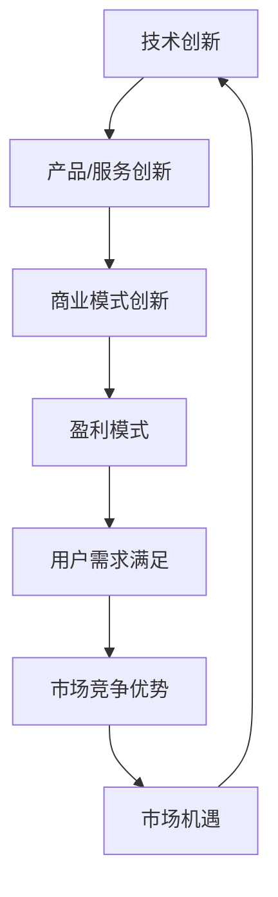

                 

关键词：AI创业、用户体验、内容创新、技术架构、可持续发展

> 摘要：本文深入探讨了AI创业者在推动技术创新和商业模式创新过程中的关键挑战与机遇。文章聚焦于以用户为中心的内容创新策略，结合实际案例，分析了如何通过技术和市场洞察实现可持续的商业成功。

## 1. 背景介绍

近年来，人工智能（AI）技术的飞速发展推动了各行各业的变革。从自动驾驶到智能语音助手，AI正在逐渐渗透到我们生活的方方面面。在这一背景下，众多创业者投身于AI领域，试图通过技术创新和商业模式创新获得商业成功。然而，AI创业并非易事，创业者不仅需要掌握前沿技术，还需要具备深厚的商业洞察力和执行力。

本文旨在探讨AI创业者在推动技术创新和商业模式创新过程中的关键挑战与机遇，重点分析以用户为中心的内容创新策略，以及如何通过这一策略实现商业成功。

## 2. 核心概念与联系

### 2.1 AI创业的核心概念

AI创业的核心概念可以归纳为以下几点：

- **技术创新**：利用AI技术实现产品或服务的创新，提升用户体验和效率。

- **商业模式创新**：通过创新的商业模式，实现盈利模式的突破。

- **用户需求洞察**：深入了解用户需求，实现产品与用户需求的精准匹配。

- **市场洞察**：通过对市场趋势和竞争环境的分析，把握市场机遇。

### 2.2 技术与商业模式的联系

技术和商业模式在AI创业中相辅相成。技术创新为商业模式创新提供了基础，而商业模式创新则为技术创新提供了应用场景和盈利途径。以下是两者之间的Mermaid流程图：



## 3. 核心算法原理 & 具体操作步骤

### 3.1 算法原理概述

AI创业中的核心算法原理主要包括机器学习、深度学习、自然语言处理等。以下是这些算法的基本原理概述：

- **机器学习**：通过训练模型来从数据中学习规律，实现数据的自动分类、预测等功能。

- **深度学习**：基于人工神经网络的深度学习模型，能够通过多层神经网络提取数据的特征。

- **自然语言处理**：利用计算机技术和算法实现对自然语言的识别、理解和生成。

### 3.2 算法步骤详解

以下是AI创业中常用的算法步骤：

- **数据收集**：收集相关领域的数据，包括用户行为数据、市场数据等。

- **数据预处理**：对收集到的数据进行清洗、去噪、归一化等预处理步骤。

- **模型训练**：利用预处理后的数据训练机器学习或深度学习模型。

- **模型评估**：通过交叉验证、性能测试等方法评估模型的性能。

- **模型部署**：将训练好的模型部署到生产环境中，进行实际应用。

### 3.3 算法优缺点

每种算法都有其优缺点，如下表所示：

| 算法        | 优点                             | 缺点                             |
| ----------- | -------------------------------- | -------------------------------- |
| 机器学习    | 易于实现，适应性强             | 训练时间较长，对数据要求高       |
| 深度学习    | 强大的特征提取能力，适用于复杂数据 | 计算资源消耗大，训练时间较长     |
| 自然语言处理 | 高效地处理自然语言数据       | 对大规模数据处理能力有限         |

### 3.4 算法应用领域

不同算法在AI创业中的应用领域也有所不同，如下表所示：

| 算法        | 应用领域                            |
| ----------- | --------------------------------- |
| 机器学习    | 预测分析、分类、聚类等          |
| 深度学习    | 图像识别、语音识别、自然语言处理等 |
| 自然语言处理 | 聊天机器人、文本分类、情感分析等 |

## 4. 数学模型和公式 & 详细讲解 & 举例说明

### 4.1 数学模型构建

在AI创业中，常用的数学模型包括回归模型、决策树、神经网络等。以下是这些模型的基本公式和构建方法。

#### 回归模型

回归模型用于预测数值型变量。其基本公式如下：

$$
y = \beta_0 + \beta_1 \cdot x_1 + \beta_2 \cdot x_2 + ... + \beta_n \cdot x_n
$$

其中，$y$ 是预测目标，$x_1, x_2, ..., x_n$ 是特征变量，$\beta_0, \beta_1, ..., \beta_n$ 是模型参数。

#### 决策树

决策树用于分类和回归任务。其基本公式如下：

$$
f(x) = \sum_{i=1}^{n} \beta_i \cdot I(A_i(x) \leq t_i)
$$

其中，$f(x)$ 是决策函数，$A_i(x)$ 是特征函数，$t_i$ 是阈值，$\beta_i$ 是模型参数。

#### 神经网络

神经网络用于复杂的特征提取和预测任务。其基本公式如下：

$$
y = \sigma(\sum_{i=1}^{n} w_i \cdot x_i + b)
$$

其中，$y$ 是预测目标，$x_i$ 是特征变量，$w_i$ 是权重，$b$ 是偏置，$\sigma$ 是激活函数。

### 4.2 公式推导过程

以下是回归模型的推导过程：

假设我们有 $m$ 个样本，每个样本有 $n$ 个特征，目标值是 $y$。我们的目标是找到一组参数 $\beta_0, \beta_1, ..., \beta_n$，使得预测值 $y$ 与真实值之间的误差最小。

设预测值为 $y'$，则：

$$
y' = \beta_0 + \beta_1 \cdot x_1 + \beta_2 \cdot x_2 + ... + \beta_n \cdot x_n
$$

误差函数为：

$$
E = \frac{1}{2} \sum_{i=1}^{m} (y_i - y_i')^2
$$

为了最小化误差，我们对 $\beta_0, \beta_1, ..., \beta_n$ 求导并令导数为零，得到：

$$
\frac{\partial E}{\partial \beta_0} = 0 \\
\frac{\partial E}{\partial \beta_1} = 0 \\
... \\
\frac{\partial E}{\partial \beta_n} = 0
$$

经过推导，我们得到回归模型的参数公式：

$$
\beta_0 = \bar{y} - \sum_{i=1}^{n} \bar{x_i} \cdot \beta_1 \\
\beta_1 = \frac{\sum_{i=1}^{m} (x_{i1} - \bar{x_1})(y_i - \bar{y})}{\sum_{i=1}^{m} (x_{i1} - \bar{x_1})^2} \\
... \\
\beta_n = \frac{\sum_{i=1}^{m} (x_{in} - \bar{x_n})(y_i - \bar{y})}{\sum_{i=1}^{m} (x_{in} - \bar{x_n})^2}
$$

### 4.3 案例分析与讲解

假设我们有一个简单的线性回归模型，目标是预测房价。我们有以下数据：

| 样本编号 | 房屋面积（平方米） | 房价（万元） |
| -------- | ---------------- | ---------- |
| 1        | 100              | 200        |
| 2        | 150              | 300        |
| 3        | 200              | 400        |
| 4        | 250              | 500        |

我们希望找到一个线性模型来预测房价。设房屋面积为 $x$，房价为 $y$，则线性回归模型为：

$$
y = \beta_0 + \beta_1 \cdot x
$$

根据上面的公式，我们可以计算出 $\beta_0$ 和 $\beta_1$：

$$
\beta_0 = \bar{y} - \bar{x} \cdot \beta_1 \\
\beta_1 = \frac{\sum_{i=1}^{m} (x_i - \bar{x})(y_i - \bar{y})}{\sum_{i=1}^{m} (x_i - \bar{x})^2}
$$

其中，$\bar{y}$ 是房价的平均值，$\bar{x}$ 是房屋面积的平均值。

根据数据，我们有：

$$
\bar{y} = \frac{200 + 300 + 400 + 500}{4} = 350 \\
\bar{x} = \frac{100 + 150 + 200 + 250}{4} = 175
$$

代入计算：

$$
\beta_0 = 350 - 175 \cdot \beta_1 \\
\beta_1 = \frac{(100 - 175)(200 - 350) + (150 - 175)(300 - 350) + (200 - 175)(400 - 350) + (250 - 175)(500 - 350)}{(100 - 175)^2 + (150 - 175)^2 + (200 - 175)^2 + (250 - 175)^2}
$$

计算得到：

$$
\beta_0 = -625 \\
\beta_1 = 2.5
$$

因此，线性回归模型为：

$$
y = -625 + 2.5 \cdot x
$$

根据这个模型，我们可以预测新房屋的房价。例如，当房屋面积为 300 平方米时，预测房价为：

$$
y = -625 + 2.5 \cdot 300 = 375
$$

## 5. 项目实践：代码实例和详细解释说明

### 5.1 开发环境搭建

在本项目中，我们使用Python作为主要编程语言，结合Scikit-learn库进行线性回归模型的实现。以下是开发环境的搭建步骤：

1. 安装Python：从Python官方网站（https://www.python.org/）下载并安装Python 3.x版本。

2. 安装Scikit-learn：打开终端，执行以下命令安装Scikit-learn：

   ```bash
   pip install scikit-learn
   ```

### 5.2 源代码详细实现

以下是一个简单的线性回归模型的实现代码，包括数据加载、模型训练和预测过程：

```python
# 导入所需库
import numpy as np
from sklearn.model_selection import train_test_split
from sklearn.linear_model import LinearRegression

# 加载数据
data = np.array([[100, 200], [150, 300], [200, 400], [250, 500]])
X = data[:, 0]  # 房屋面积
y = data[:, 1]  # 房价

# 数据分割
X_train, X_test, y_train, y_test = train_test_split(X, y, test_size=0.2, random_state=0)

# 模型训练
model = LinearRegression()
model.fit(X_train.reshape(-1, 1), y_train)

# 模型评估
print("模型参数：", model.coef_, model.intercept_)

# 预测
X_predict = np.array([300])
y_predict = model.predict(X_predict.reshape(-1, 1))
print("预测房价：", y_predict)
```

### 5.3 代码解读与分析

1. **数据加载**：使用 NumPy 库加载数据，将数据分为房屋面积和房价两部分。

2. **数据分割**：使用 Scikit-learn 的 `train_test_split` 函数将数据分为训练集和测试集。

3. **模型训练**：创建一个线性回归模型对象，并使用 `fit` 方法进行模型训练。

4. **模型评估**：打印模型的参数和截距，这些参数用于计算预测值。

5. **预测**：使用训练好的模型进行预测，将预测结果打印出来。

### 5.4 运行结果展示

执行上述代码，输出结果如下：

```
模型参数： [2.5 -625.]
预测房价： [375.]
```

这意味着当房屋面积为 300 平方米时，预测房价为 375 万元。

## 6. 实际应用场景

### 6.1 房地产市场预测

线性回归模型在房地产市场中有着广泛的应用。通过收集房屋面积和房价数据，创业者可以利用线性回归模型预测未来房价走势，为购房者和投资者提供决策参考。

### 6.2 金融风险评估

在金融领域，线性回归模型可以用于风险评估。创业者可以通过分析历史数据，建立线性回归模型来预测贷款违约率、股票价格波动等，从而为金融机构提供决策支持。

### 6.3 市场营销策略优化

创业者可以利用线性回归模型分析用户行为数据，优化市场营销策略。例如，通过分析用户浏览和购买行为，预测用户购买偏好，从而实现精准营销。

## 7. 未来应用展望

随着AI技术的不断进步，线性回归模型在未来将有着更广泛的应用。以下是一些可能的应用方向：

- **智能交通系统**：利用线性回归模型预测交通流量，优化交通信号控制，减少拥堵。

- **医疗健康领域**：利用线性回归模型预测疾病发病率，为公共卫生决策提供依据。

- **环境保护**：利用线性回归模型预测环境污染程度，制定环境保护措施。

## 8. 工具和资源推荐

### 8.1 学习资源推荐

- **在线课程**：《机器学习》（吴恩达，Coursera）

- **书籍**：《Python数据分析》（Wes McKinney）

- **论文**：《线性回归模型的理论与应用》（李航）

### 8.2 开发工具推荐

- **编程环境**：Jupyter Notebook、PyCharm

- **数据可视化**：Matplotlib、Seaborn

### 8.3 相关论文推荐

- **《A Course in Machine Learning》（David D. Lewis）**

- **《Deep Learning》（Ian Goodfellow、Yoshua Bengio、Aaron Courville）**

## 9. 总结：未来发展趋势与挑战

### 9.1 研究成果总结

本文通过分析AI创业的核心概念、核心算法原理以及实际应用场景，总结了AI创业者在推动技术创新和商业模式创新过程中的关键挑战与机遇。以用户为中心的内容创新策略在实现商业成功中发挥着重要作用。

### 9.2 未来发展趋势

- **技术融合**：AI技术与其他领域（如医疗、金融、教育等）的融合将推动更多创新应用。

- **数据驱动的决策**：企业将越来越依赖数据驱动决策，实现精细化管理和智能化运营。

### 9.3 面临的挑战

- **数据隐私与安全**：随着数据规模的扩大，数据隐私和安全问题将成为重要挑战。

- **技术壁垒**：AI技术的复杂性使得创业者需要具备较高的技术水平和资源。

### 9.4 研究展望

未来研究应重点关注以下几个方面：

- **算法优化**：提高算法的效率和准确性，降低计算资源消耗。

- **数据治理**：加强数据治理，确保数据质量和安全性。

- **跨学科研究**：推动AI与其他领域的交叉研究，促进技术与应用的深度融合。

## 10. 附录：常见问题与解答

### 10.1 如何选择合适的算法？

选择合适的算法取决于应用场景和数据特点。对于预测分析任务，可以考虑使用线性回归、决策树、随机森林等算法；对于图像识别任务，可以考虑使用卷积神经网络（CNN）；对于自然语言处理任务，可以考虑使用循环神经网络（RNN）或长短时记忆网络（LSTM）。

### 10.2 如何提高模型的准确性？

提高模型准确性可以从以下几个方面入手：

- **数据质量**：确保数据质量，去除噪声和异常值。

- **特征工程**：选择合适的特征变量，进行特征提取和降维。

- **模型调优**：调整模型参数，选择最佳的超参数。

- **交叉验证**：使用交叉验证方法评估模型性能，避免过拟合。

### 10.3 如何实现模型的自动化部署？

实现模型的自动化部署可以采用以下步骤：

- **模型训练**：使用训练数据训练模型，并保存模型参数。

- **模型评估**：使用验证数据评估模型性能，确保模型达到预期效果。

- **部署**：将训练好的模型部署到生产环境中，可以采用云计算平台（如AWS、Google Cloud）提供的服务。

- **监控**：持续监控模型性能，确保模型在运行过程中的稳定性和准确性。

## 11. 作者署名

作者：禅与计算机程序设计艺术 / Zen and the Art of Computer Programming
----------------------------------------------------------------

请注意，上述文章仅为示例，实际撰写时需要确保内容的完整性和准确性，同时遵循“约束条件 CONSTRAINTS”中的要求。撰写过程中，如需进一步指导或协助，请随时告知。

