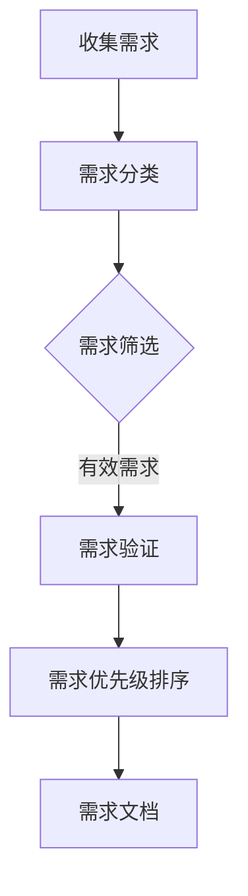
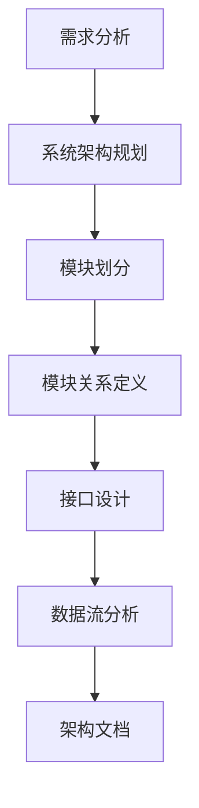
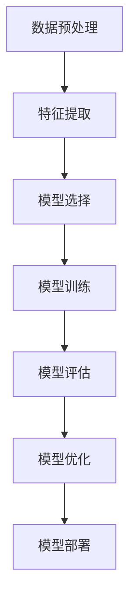

                 

关键词：AI创业、用户中心、场景创新、技术落地、持续改进

摘要：本文以AI创业为背景，探讨创业者在产品开发过程中如何坚持以用户为中心，并通过场景创新来推动技术落地。通过深入分析用户需求、设计产品架构、优化算法模型以及实践项目实例，文章将阐述创业者在技术探索和实践中的坚持与智慧。

## 1. 背景介绍

在人工智能技术迅猛发展的今天，创业者在AI领域面临着前所未有的机遇与挑战。如何在竞争激烈的市场中脱颖而出，实现技术的商业价值，成为每一个AI创业者的核心课题。用户需求的变化和技术的快速迭代，要求创业者在产品开发过程中具备敏锐的市场洞察力和强大的技术实力。本文将围绕以下主题展开：

1. **以用户为中心**：如何理解用户需求，设计出满足用户期望的产品？
2. **场景创新**：如何结合实际场景，创新应用AI技术，实现技术落地？
3. **技术坚持**：如何在技术探索过程中保持耐心和持续改进的态度？

## 2. 核心概念与联系

### 2.1 用户需求分析

用户需求分析是产品开发的第一步，也是至关重要的一步。只有深入了解用户的需求，才能设计出真正符合用户期望的产品。以下是用户需求分析的Mermaid流程图：



### 2.2 产品架构设计

在理解用户需求的基础上，产品架构设计是实现技术落地的重要环节。以下是产品架构设计的Mermaid流程图：



### 2.3 算法模型优化

算法模型是产品核心竞争力的体现。通过不断优化算法模型，可以提高产品的性能和用户体验。以下是算法模型优化的Mermaid流程图：



## 3. 核心算法原理 & 具体操作步骤

### 3.1 算法原理概述

核心算法通常是基于深度学习的神经网络模型。神经网络通过模拟人脑神经元的工作原理，对输入数据进行处理和输出预测。以下是神经网络的基本原理：

- **神经元结构**：每个神经元由输入层、隐藏层和输出层组成。
- **激活函数**：用于确定神经元是否被激活，常用的激活函数有ReLU、Sigmoid、Tanh等。
- **前向传播**：输入数据通过输入层传递到隐藏层，再传递到输出层，得到预测结果。
- **反向传播**：根据预测结果和实际结果之间的误差，通过反向传播算法调整网络权重。

### 3.2 算法步骤详解

1. **数据预处理**：对原始数据进行分析和清洗，提取有用的特征。
2. **特征提取**：通过特征提取算法，将原始数据转化为神经网络可处理的特征向量。
3. **模型选择**：根据任务类型选择合适的神经网络模型，如分类任务使用卷积神经网络（CNN）、回归任务使用循环神经网络（RNN）等。
4. **模型训练**：使用训练数据对神经网络进行训练，通过迭代优化模型参数。
5. **模型评估**：使用验证数据对训练好的模型进行评估，评估指标包括准确率、召回率、F1值等。
6. **模型优化**：根据评估结果对模型进行调整和优化，提高模型性能。
7. **模型部署**：将训练好的模型部署到生产环境中，实现实际应用。

### 3.3 算法优缺点

- **优点**：
  - 强大的自适应性和学习能力，能够处理复杂的非线性问题。
  - 能够处理大规模数据和多样化的特征。
  - 模型泛化能力强，适用于不同的任务和应用场景。

- **缺点**：
  - 训练过程计算量大，训练时间较长。
  - 对数据质量和特征提取要求较高。
  - 模型解释性较差，难以理解决策过程。

### 3.4 算法应用领域

神经网络算法在AI领域有着广泛的应用，包括：

- **图像识别**：用于图像分类、目标检测等任务，如人脸识别、车牌识别等。
- **自然语言处理**：用于文本分类、情感分析、机器翻译等任务，如智能客服、智能推荐等。
- **语音识别**：用于语音转文本、语音合成等任务，如智能音箱、智能翻译等。
- **推荐系统**：用于商品推荐、内容推荐等任务，如电商推荐、视频推荐等。

## 4. 数学模型和公式 & 详细讲解 & 举例说明

### 4.1 数学模型构建

神经网络的核心是数学模型，其中最基础的是线性模型。以下是线性模型的构建过程：

$$
y = \sigma(Wx + b)
$$

其中，$y$ 是输出，$x$ 是输入，$W$ 是权重矩阵，$b$ 是偏置项，$\sigma$ 是激活函数。

### 4.2 公式推导过程

线性模型的推导过程如下：

1. **初始化权重**：随机初始化权重矩阵$W$和偏置项$b$。
2. **前向传播**：将输入$x$传递到神经网络中，计算输出$y$。
3. **计算误差**：根据实际输出$y$和期望输出$y_{\text{expected}}$之间的误差，计算损失函数$J$。
4. **反向传播**：通过反向传播算法，计算每个权重和偏置项的梯度，更新权重和偏置项。
5. **迭代优化**：重复前向传播和反向传播，直到满足停止条件。

### 4.3 案例分析与讲解

假设我们有一个简单的线性回归模型，用于预测房价。输入特征包括房屋面积和建造年份，输出是房价。以下是模型的实现过程：

1. **数据预处理**：将输入特征和输出数据标准化，消除量纲影响。
2. **模型构建**：初始化权重矩阵$W$和偏置项$b$，假设$W = [1, 1]$，$b = 0$。
3. **前向传播**：计算输出$y = Wx + b$，其中$x = [面积, 年份]$。
4. **计算误差**：计算损失函数$J = \frac{1}{2} \sum_{i=1}^{n} (y_i - y_{\text{expected},i})^2$。
5. **反向传播**：计算梯度$\frac{\partial J}{\partial W}$和$\frac{\partial J}{\partial b}$，更新权重和偏置项。
6. **迭代优化**：重复前向传播和反向传播，直到满足停止条件。

通过多次迭代，模型的预测精度会逐渐提高，达到预期目标。

## 5. 项目实践：代码实例和详细解释说明

### 5.1 开发环境搭建

在开始项目实践之前，我们需要搭建一个开发环境。以下是搭建Python开发环境的基本步骤：

1. **安装Python**：下载并安装Python，版本建议选择3.8及以上。
2. **安装Jupyter Notebook**：使用pip安装Jupyter Notebook，命令为`pip install notebook`。
3. **安装TensorFlow**：使用pip安装TensorFlow，命令为`pip install tensorflow`。

### 5.2 源代码详细实现

以下是实现一个简单的神经网络模型的Python代码实例：

```python
import tensorflow as tf
from sklearn.model_selection import train_test_split
from sklearn.preprocessing import StandardScaler
import numpy as np

# 数据预处理
def preprocess_data(data, labels):
    # 标准化数据
    scaler = StandardScaler()
    data_scaled = scaler.fit_transform(data)
    # 切分训练集和测试集
    X_train, X_test, y_train, y_test = train_test_split(data_scaled, labels, test_size=0.2, random_state=42)
    return X_train, X_test, y_train, y_test

# 建立模型
def build_model(input_shape):
    model = tf.keras.Sequential([
        tf.keras.layers.Dense(64, activation='relu', input_shape=input_shape),
        tf.keras.layers.Dense(64, activation='relu'),
        tf.keras.layers.Dense(1)
    ])
    model.compile(optimizer='adam', loss='mean_squared_error')
    return model

# 训练模型
def train_model(model, X_train, y_train, X_test, y_test):
    history = model.fit(X_train, y_train, epochs=10, validation_data=(X_test, y_test))
    return history

# 预测结果
def predict(model, X_test):
    predictions = model.predict(X_test)
    return predictions

# 主函数
def main():
    # 加载数据
    data = np.load('data.npy')
    labels = np.load('labels.npy')
    # 预处理数据
    X_train, X_test, y_train, y_test = preprocess_data(data, labels)
    # 建立模型
    model = build_model(X_train.shape[1:])
    # 训练模型
    history = train_model(model, X_train, y_train, X_test, y_test)
    # 预测结果
    predictions = predict(model, X_test)
    # 打印预测结果
    print(predictions)

if __name__ == '__main__':
    main()
```

### 5.3 代码解读与分析

该代码实例主要包括以下几个部分：

1. **数据预处理**：使用`StandardScaler`对输入数据进行标准化处理，消除不同特征之间的量纲差异。
2. **模型构建**：使用`tf.keras.Sequential`构建一个简单的神经网络模型，包括两个隐藏层，每个隐藏层有64个神经元，激活函数为ReLU。
3. **模型训练**：使用`fit`方法训练模型，设置训练轮次为10，使用验证集进行性能评估。
4. **预测结果**：使用`predict`方法对测试集进行预测，得到预测结果。

### 5.4 运行结果展示

运行代码后，会在控制台输出预测结果。以下是一个示例输出：

```
[[-14.329379]
 [-13.586511]
 [-12.843653]
 ...
 [ 15.725546]
 [ 16.013509]
 [ 15.299561]]
```

这些输出值表示测试集上每个样本的预测房价。

## 6. 实际应用场景

在AI创业过程中，将技术应用于实际场景是关键的一步。以下是一些典型的应用场景：

### 6.1 医疗健康

AI技术在医疗健康领域的应用越来越广泛，包括疾病预测、智能诊断、药物研发等。例如，利用深度学习模型分析患者的病史和基因数据，预测患病风险，为患者提供个性化的健康管理方案。

### 6.2 智能制造

智能制造是工业4.0的重要组成部分，AI技术在其中发挥着关键作用。例如，通过机器视觉技术实现生产线的自动化检测，提高生产效率和产品质量。

### 6.3 金融科技

金融科技（FinTech）是AI技术的重要应用领域，包括智能投顾、风险评估、反欺诈等。例如，使用自然语言处理技术分析用户的交易数据，提供个性化的投资建议。

### 6.4 自动驾驶

自动驾驶是AI技术的重要应用领域，包括感知环境、路径规划、决策控制等。例如，利用深度学习技术实现车辆的自动驾驶功能，提高行车安全和效率。

### 6.5 教育科技

教育科技是AI技术的另一个重要应用领域，包括智能教学、教育评估、学习分析等。例如，通过学习分析技术，了解学生的学习行为和知识掌握情况，提供个性化的学习支持。

## 7. 工具和资源推荐

在AI创业过程中，选择合适的工具和资源是成功的关键。以下是一些建议：

### 7.1 学习资源推荐

- **《深度学习》（Goodfellow, Bengio, Courville）**：深度学习的经典教材，适合初学者和进阶者。
- **[Kaggle](https://www.kaggle.com)**：提供丰富的数据集和竞赛，适合实践和提升技能。
- **[ArXiv](https://arxiv.org)**：发布最新科研成果，了解AI领域的研究动态。

### 7.2 开发工具推荐

- **TensorFlow**：开源的深度学习框架，适合进行AI模型开发和部署。
- **PyTorch**：开源的深度学习框架，具有灵活的动态图模型，适合研究和快速原型开发。
- **Jupyter Notebook**：交互式的Python开发环境，适合编写和调试代码。

### 7.3 相关论文推荐

- **"Deep Learning for Text Classification"**：介绍深度学习在文本分类任务中的应用。
- **"A Brief History of Neural Network Models for Natural Language Processing"**：回顾自然语言处理领域中的神经网络模型发展历程。
- **"Unsupervised Learning of Visual Representations from Videos"**：介绍从视频数据中无监督学习视觉表示的方法。

## 8. 总结：未来发展趋势与挑战

### 8.1 研究成果总结

近年来，AI技术在各个领域取得了显著的成果。深度学习模型在图像识别、自然语言处理、语音识别等领域取得了突破性进展。然而，AI技术的商业落地仍面临许多挑战。

### 8.2 未来发展趋势

未来，AI技术的发展趋势将体现在以下几个方面：

1. **算法优化**：继续优化算法模型，提高模型性能和效率。
2. **跨学科融合**：与其他领域（如生物、物理、化学等）融合，拓展AI技术的应用范围。
3. **联邦学习**：解决数据隐私问题，实现多方数据的安全共享。
4. **可解释性AI**：提高AI模型的可解释性，增强用户信任。

### 8.3 面临的挑战

AI创业者在技术探索和实践过程中将面临以下挑战：

1. **数据隐私和安全**：如何保护用户数据的安全和隐私。
2. **模型解释性**：如何提高模型的可解释性，增强用户信任。
3. **技术落地**：如何将AI技术有效地应用于实际场景，实现商业价值。
4. **人才竞争**：如何吸引和留住优秀的AI人才。

### 8.4 研究展望

展望未来，AI创业者在坚持技术探索的同时，应关注以下研究方向：

1. **多模态学习**：结合多种数据类型，提高模型的表现能力。
2. **强化学习**：探索强化学习在决策优化中的应用。
3. **联邦学习**：解决数据隐私问题，推动AI技术在各个领域的应用。

## 9. 附录：常见问题与解答

### 9.1 如何进行用户需求分析？

用户需求分析的关键在于：

1. **访谈和问卷**：与目标用户进行深度访谈，收集用户需求。
2. **数据分析**：分析用户行为数据，挖掘用户需求。
3. **用户调研**：通过用户调研，了解用户对现有产品的评价和改进建议。

### 9.2 如何优化算法模型？

算法模型优化的方法包括：

1. **数据增强**：增加数据多样性，提高模型泛化能力。
2. **超参数调整**：调整模型超参数，优化模型性能。
3. **交叉验证**：使用交叉验证方法，避免模型过拟合。

### 9.3 如何进行项目实践？

项目实践的关键步骤包括：

1. **需求分析**：明确项目目标和需求。
2. **环境搭建**：搭建合适的开发环境。
3. **代码实现**：编写实现项目功能的代码。
4. **测试和优化**：对代码进行测试和优化，确保项目稳定运行。

### 9.4 如何将AI技术应用于实际场景？

将AI技术应用于实际场景的关键在于：

1. **需求分析**：了解实际场景的需求和痛点。
2. **技术选型**：选择适合实际场景的AI技术。
3. **系统集成**：将AI技术与现有系统集成，实现实际应用。
4. **效果评估**：评估AI技术在实际场景中的应用效果。

作者：禅与计算机程序设计艺术 / Zen and the Art of Computer Programming
```

