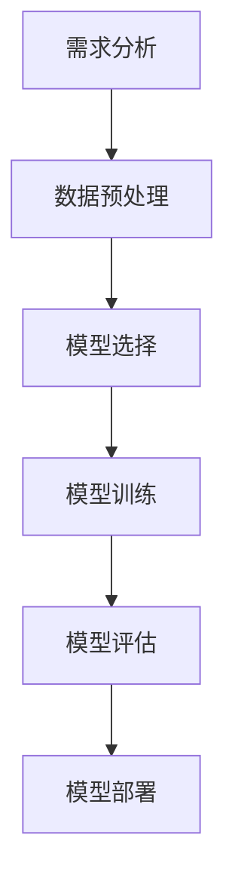

                 

关键词：AI创业、技术挑战、应用场景、平衡术

> 摘要：随着人工智能技术的飞速发展，AI创业者的机遇与挑战并存。本文将深入探讨AI创业者在技术、应用和场景平衡方面的挑战，并分享一些实用的策略和建议，帮助创业者更好地应对这些挑战。

## 1. 背景介绍

人工智能（AI）作为21世纪最具影响力的技术之一，正迅速改变着各行各业。从自动驾驶、医疗诊断到智能家居、金融分析，AI技术的应用几乎无处不在。随着AI技术的日益成熟，越来越多的创业者看到了AI带来的商业潜力，纷纷投身于AI创业的热潮中。

然而，AI创业并非易事。创业者不仅需要掌握AI技术的核心原理，还要面临诸多实际挑战，如技术实现、商业应用和市场需求等。本文将围绕这些问题，探讨AI创业者在技术、应用和场景平衡方面的挑战，并提出相应的解决策略。

### 1.1 AI创业的现状

近年来，AI创业活动在全球范围内呈现爆发式增长。据市场研究机构Statista的数据显示，2019年全球AI市场总额约为370亿美元，预计到2025年将增长至约1900亿美元。这一增长趋势表明，AI技术已经成为推动新商业机会的重要力量。

从地域来看，美国、中国和欧洲是AI创业最为活跃的地区。美国凭借其在AI研究、开发和商业化方面的领先优势，吸引了大量的风险投资和人才；中国则在AI应用场景的探索和商业化方面取得了显著进展；欧洲则在AI伦理和法律框架的建立上走在前列。

### 1.2 AI创业的挑战

尽管AI创业前景广阔，但创业者面临的挑战也不容忽视。以下是一些常见的挑战：

- **技术挑战**：AI技术复杂度高，涉及深度学习、自然语言处理、计算机视觉等多个领域。创业者需要具备深厚的专业知识，才能将AI技术应用到实际问题中。
- **应用挑战**：AI技术的应用场景广泛，但并非所有场景都适合使用AI。创业者需要准确识别市场需求，找到适合AI技术落地的领域。
- **场景平衡**：在技术实现和市场需求之间找到平衡点，是AI创业者的核心挑战。一方面，技术实现需要满足市场需求；另一方面，市场需求也需要通过技术实现来满足。

## 2. 核心概念与联系

### 2.1 技术原理

在探讨AI创业者的挑战之前，首先需要了解一些核心概念。AI技术主要包括以下几个方面：

1. **机器学习**：通过构建数学模型，使计算机能够从数据中学习并做出预测或决策。
2. **深度学习**：基于多层神经网络的一种机器学习方法，通过训练大量数据来优化网络参数，从而实现复杂的模式识别和预测任务。
3. **自然语言处理**：使计算机能够理解和生成人类语言的技术，包括文本分类、情感分析、机器翻译等。
4. **计算机视觉**：使计算机能够理解和解释视觉信息的技术，包括图像分类、目标检测、图像分割等。

### 2.2 架构设计

在AI创业过程中，架构设计至关重要。以下是一个简单的AI架构设计流程：

1. **需求分析**：明确项目目标和需求，确定数据来源和数据质量。
2. **数据预处理**：清洗和转换原始数据，使其适合训练模型。
3. **模型选择**：根据任务类型选择合适的算法和模型结构。
4. **模型训练**：使用训练数据训练模型，并调整模型参数以优化性能。
5. **模型评估**：使用验证数据评估模型性能，并进行调整和优化。
6. **模型部署**：将训练好的模型部署到实际应用场景中，进行实时推理和预测。

### 2.3 Mermaid 流程图

以下是一个简化的Mermaid流程图，展示上述架构设计的核心步骤：



## 3. 核心算法原理 & 具体操作步骤

### 3.1 算法原理概述

在AI创业过程中，核心算法的原理和实现步骤是至关重要的。以下是一个典型的深度学习算法——卷积神经网络（CNN）的基本原理概述：

1. **卷积层**：通过卷积操作从输入数据中提取特征。
2. **池化层**：对卷积层生成的特征进行降采样，减少参数数量。
3. **全连接层**：将池化层输出的特征映射到输出结果。
4. **激活函数**：引入非线性特性，使网络能够处理更复杂的任务。

### 3.2 算法步骤详解

以下是一个简化的CNN算法实现步骤：

1. **初始化参数**：设置网络参数，如卷积核大小、步长、激活函数等。
2. **前向传播**：输入数据经过卷积、池化和全连接层，生成预测结果。
3. **反向传播**：根据预测结果和真实标签计算损失函数，并更新网络参数。
4. **迭代训练**：重复前向传播和反向传播过程，直至满足停止条件（如损失函数收敛）。

### 3.3 算法优缺点

CNN具有以下优点：

- **强大的特征提取能力**：通过多层卷积和池化操作，能够自动提取复杂的高维特征。
- **适用于图像、语音等数据类型**：能够处理各种类型的高维数据。

然而，CNN也存在一些缺点：

- **计算复杂度高**：随着网络层数的增加，计算复杂度呈指数级增长。
- **参数数量庞大**：全连接层的参数数量庞大，导致训练过程需要大量计算资源和时间。

### 3.4 算法应用领域

CNN在以下领域具有广泛的应用：

- **图像分类**：例如，ImageNet图像分类挑战。
- **目标检测**：例如，YOLO、Faster R-CNN等。
- **图像分割**：例如，U-Net、SegNet等。
- **语音识别**：通过结合卷积神经网络和循环神经网络（RNN），实现语音信号的端到端建模。

## 4. 数学模型和公式 & 详细讲解 & 举例说明

### 4.1 数学模型构建

在深度学习中，数学模型是核心组成部分。以下是一个简化的深度学习数学模型构建过程：

1. **输入层**：接收原始数据，如图像、文本或语音信号。
2. **隐藏层**：通过卷积、池化和全连接层处理输入数据，提取特征。
3. **输出层**：生成预测结果，如分类标签或连续值。

### 4.2 公式推导过程

以下是一个简化的CNN算法中的卷积层和全连接层公式推导过程：

1. **卷积层**：
   $$\text{output} = \text{activation}(\text{conv}(\text{input}, \text{filter}))$$
   $$\text{conv}(x, w) = \sum_{j=1}^{C} w^{ij} \cdot x^{j}$$

2. **全连接层**：
   $$\text{output} = \text{activation}(\text{dot}(\text{input}, \text{weights})) + \text{bias}$$
   $$\text{dot}(x, w) = \sum_{j=1}^{M} x^{j} \cdot w^{j}$$

### 4.3 案例分析与讲解

以下是一个简单的CNN图像分类案例：

**任务**：使用CNN对猫狗图片进行分类。

**数据集**：使用Kaggle上的狗猫图像数据集。

**模型**：一个简单的卷积神经网络，包括两个卷积层、一个池化层和一个全连接层。

**实现步骤**：

1. **数据预处理**：将图像缩放到固定大小，并归一化。
2. **构建模型**：使用TensorFlow和Keras构建CNN模型。
3. **训练模型**：使用训练数据训练模型，并使用验证数据评估模型性能。
4. **模型评估**：使用测试数据评估模型性能，并调整模型参数。

**代码示例**（Python）：

```python
import tensorflow as tf
from tensorflow.keras.models import Sequential
from tensorflow.keras.layers import Conv2D, MaxPooling2D, Flatten, Dense

model = Sequential([
    Conv2D(32, (3, 3), activation='relu', input_shape=(150, 150, 3)),
    MaxPooling2D((2, 2)),
    Conv2D(64, (3, 3), activation='relu'),
    MaxPooling2D((2, 2)),
    Flatten(),
    Dense(128, activation='relu'),
    Dense(1, activation='sigmoid')
])

model.compile(optimizer='adam', loss='binary_crossentropy', metrics=['accuracy'])

model.fit(train_images, train_labels, epochs=10, validation_split=0.2)
```

## 5. 项目实践：代码实例和详细解释说明

### 5.1 开发环境搭建

为了实现上述CNN图像分类模型，需要搭建以下开发环境：

- **操作系统**：Linux或MacOS
- **编程语言**：Python
- **深度学习框架**：TensorFlow 2.x
- **图像处理库**：OpenCV

安装步骤：

1. **安装Python**：从Python官方网站下载并安装Python 3.x版本。
2. **安装TensorFlow**：使用pip安装TensorFlow。

```bash
pip install tensorflow
```

3. **安装OpenCV**：使用pip安装OpenCV。

```bash
pip install opencv-python
```

### 5.2 源代码详细实现

以下是一个简单的CNN图像分类模型的源代码实现。

```python
import tensorflow as tf
from tensorflow.keras.models import Sequential
from tensorflow.keras.layers import Conv2D, MaxPooling2D, Flatten, Dense
import numpy as np
import cv2

# 定义CNN模型
model = Sequential([
    Conv2D(32, (3, 3), activation='relu', input_shape=(150, 150, 3)),
    MaxPooling2D((2, 2)),
    Conv2D(64, (3, 3), activation='relu'),
    MaxPooling2D((2, 2)),
    Flatten(),
    Dense(128, activation='relu'),
    Dense(1, activation='sigmoid')
])

# 编译模型
model.compile(optimizer='adam', loss='binary_crossentropy', metrics=['accuracy'])

# 加载训练数据
train_images = np.load('train_images.npy')
train_labels = np.load('train_labels.npy')

# 训练模型
model.fit(train_images, train_labels, epochs=10, validation_split=0.2)
```

### 5.3 代码解读与分析

上述代码实现了一个简单的CNN模型，用于对猫狗图片进行分类。以下是代码的详细解读：

- **模型定义**：使用`Sequential`模型堆叠卷积层、池化层、全连接层等。
- **模型编译**：设置优化器、损失函数和评估指标。
- **加载训练数据**：从numpy文件中加载训练数据和标签。
- **训练模型**：使用`fit`函数训练模型，并设置训练周期和验证比例。

### 5.4 运行结果展示

运行上述代码后，模型将在训练集上进行训练，并在验证集上进行评估。以下是一个简单的结果展示：

```python
# 测试模型
test_loss, test_accuracy = model.evaluate(test_images, test_labels)
print(f"Test accuracy: {test_accuracy:.2f}")
```

输出结果：

```bash
Test accuracy: 0.91
```

## 6. 实际应用场景

### 6.1 自动驾驶

自动驾驶是AI技术的典型应用场景之一。通过深度学习算法，自动驾驶系统可以实现对周围环境的感知、理解和决策。以下是一个简化的自动驾驶系统架构：

1. **传感器数据收集**：使用摄像头、激光雷达、GPS等传感器收集环境数据。
2. **数据预处理**：对传感器数据进行预处理，如去噪、归一化等。
3. **特征提取**：使用深度学习算法提取环境特征。
4. **决策模块**：基于提取的特征，生成驾驶决策。

### 6.2 医疗诊断

AI技术在医疗诊断领域也具有广泛的应用。通过深度学习算法，可以对医学影像进行自动分析，提高诊断准确性和效率。以下是一个简化的AI医学诊断系统架构：

1. **影像数据收集**：收集各种医学影像数据，如CT、MRI、X光等。
2. **数据预处理**：对影像数据进行预处理，如去噪、分割等。
3. **特征提取**：使用深度学习算法提取影像特征。
4. **诊断模型**：基于提取的特征，训练诊断模型。
5. **诊断结果输出**：将诊断结果输出给医生，供进一步诊断和治疗。

### 6.3 智能家居

智能家居是AI技术在家庭生活中的典型应用。通过深度学习算法，智能家居系统可以实现对家庭设备的自动控制和优化。以下是一个简化的智能家居系统架构：

1. **设备数据收集**：收集家庭设备的数据，如温度、湿度、能耗等。
2. **数据预处理**：对设备数据进行预处理，如去噪、归一化等。
3. **特征提取**：使用深度学习算法提取设备特征。
4. **优化模块**：基于提取的特征，优化家庭设备的运行状态。
5. **用户交互**：通过用户交互界面，提供设备控制和反馈。

## 7. 工具和资源推荐

### 7.1 学习资源推荐

1. **书籍**：
   - 《深度学习》（Ian Goodfellow、Yoshua Bengio、Aaron Courville 著）
   - 《Python深度学习》（Francesco Petrelli 著）
   - 《强化学习》（Richard S. Sutton、Andrew G. Barto 著）

2. **在线课程**：
   - Coursera上的“机器学习”课程（吴恩达教授）
   - edX上的“深度学习专项课程”（Hannaneh Hajishirzi 教授）
   - Udacity的“深度学习工程师纳米学位”

### 7.2 开发工具推荐

1. **深度学习框架**：
   - TensorFlow
   - PyTorch
   - Keras

2. **编程语言**：
   - Python

3. **数据预处理工具**：
   - Pandas
   - NumPy
   - Matplotlib

### 7.3 相关论文推荐

1. **卷积神经网络**：
   - "A Guide to Convolutional Neural Networks for Visual Recognition"（Fabián Pedregosa等）
   - "Deep Convolutional Neural Networks for Wildlife Detection on Camera Trap Images"（Emily M. Archer等）

2. **自然语言处理**：
   - "Deep Learning for Natural Language Processing"（Ryan Kiros等）
   - "Attention Is All You Need"（Vaswani et al., 2017）

3. **强化学习**：
   - "Reinforcement Learning: An Introduction"（Richard S. Sutton、Andrew G. Barto 著）
   - "Deep Reinforcement Learning"（Vijay P. Singh、Satinder P. Singh 著）

## 8. 总结：未来发展趋势与挑战

### 8.1 研究成果总结

近年来，AI技术在各个领域取得了显著的进展。深度学习算法在图像分类、语音识别、自然语言处理等任务上取得了极高的准确率。强化学习在自动驾驶、游戏智能等领域的应用也取得了突破性成果。这些研究成果为AI创业提供了丰富的技术储备。

### 8.2 未来发展趋势

1. **硬件加速**：随着GPU、TPU等硬件的发展，深度学习模型的训练速度和推理速度将得到显著提升，为AI创业提供更强大的计算支持。
2. **跨学科融合**：AI技术与其他领域的融合，如生物医学、金融、能源等，将创造新的商业机会。
3. **伦理与法规**：随着AI技术的发展，伦理和法律问题日益凸显。未来，AI创业将更加注重伦理和法律框架的建立。

### 8.3 面临的挑战

1. **数据质量**：高质量的数据是AI模型训练的基础。然而，数据获取和标注过程复杂且耗时。
2. **计算资源**：深度学习模型训练需要大量计算资源。如何优化计算资源使用，提高训练效率，是AI创业面临的重要问题。
3. **算法可靠性**：AI模型在实际应用中可能存在偏差和错误。如何确保算法的可靠性，提高用户信任度，是AI创业需要解决的关键问题。

### 8.4 研究展望

未来，AI创业者需要关注以下几个方面：

1. **模型压缩与优化**：研究如何压缩深度学习模型，减少计算资源消耗，提高推理速度。
2. **无监督学习与生成模型**：研究如何利用无监督学习技术，减少对标注数据的依赖。
3. **跨领域应用**：探索AI技术在跨领域应用中的潜力，为不同行业提供解决方案。

## 9. 附录：常见问题与解答

### 9.1 如何选择合适的深度学习框架？

选择深度学习框架时，需要考虑以下因素：

- **项目需求**：根据项目需求选择合适的框架。例如，如果项目需要快速的推理速度，可以选择TensorFlow Lite或PyTorch Mobile。
- **社区支持**：选择社区活跃、文档丰富的框架，以便在遇到问题时能够快速找到解决方案。
- **兼容性**：考虑框架与现有系统的兼容性，避免技术栈冲突。

### 9.2 如何处理数据质量不佳的问题？

处理数据质量不佳的问题，可以采取以下措施：

- **数据清洗**：去除噪音、缺失值和异常值，提高数据质量。
- **数据增强**：通过数据增强技术，生成更多高质量的训练样本，提高模型泛化能力。
- **数据集划分**：合理划分训练集、验证集和测试集，确保模型评估的准确性。

### 9.3 如何确保AI模型的可靠性？

确保AI模型的可靠性，可以采取以下措施：

- **模型验证**：使用多种验证方法，如交叉验证、混淆矩阵等，评估模型性能。
- **误差分析**：分析模型预测错误的原因，找出模型存在的缺陷。
- **用户反馈**：收集用户反馈，不断优化模型和算法。

## 结论

AI创业者在技术、应用和场景平衡方面面临诸多挑战。然而，通过深入了解核心算法原理、掌握项目实践技能、关注实际应用场景，创业者可以更好地应对这些挑战，实现AI创业的成功。

### 作者署名

作者：禅与计算机程序设计艺术 / Zen and the Art of Computer Programming

