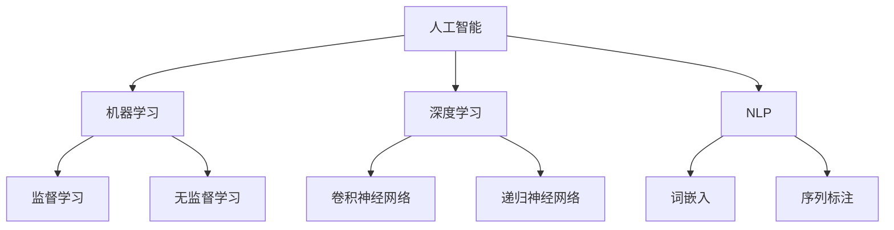

                 

关键词：人工智能，创业者，生活改善，技术进步，未来展望

> 摘要：本文旨在探讨人工智能（AI）在推动人类生活方式变革中的巨大潜力，以及创业者如何把握这一机遇，将AI技术应用到实际场景中，为人类生活带来更美好的变化。文章首先回顾了AI技术的历史背景，然后深入分析了AI的核心概念与联系，接着阐述了AI的核心算法原理及其应用领域。在此基础上，本文通过数学模型与具体实例，展示了AI在实际项目中的应用，并探讨了其未来发展方向与面临的挑战。

## 1. 背景介绍

人工智能（Artificial Intelligence，简称AI）作为计算机科学的一个分支，致力于研究如何构建智能体，使其能够模拟、延伸和扩展人类的智能。AI的历史可以追溯到20世纪50年代，当时科学家们开始探讨机器是否能够模仿人类的思维过程。从最初的逻辑推理到基于数据的机器学习，再到今天的深度学习，AI技术已经取得了显著的进步。

AI的兴起不仅带来了技术的革新，更为创业者提供了广阔的舞台。随着AI技术的不断成熟，各行各业开始探索AI的应用，从医疗保健、金融保险到交通运输、教育等领域，AI都展现出了其强大的变革力量。创业者们看到了这一趋势，纷纷投身于AI领域，希望通过创新应用来改善人类生活。

## 2. 核心概念与联系

### 2.1 人工智能的基本概念

人工智能，顾名思义，是使计算机系统能够执行通常需要人类智能才能完成的任务的技术。这些任务包括但不限于视觉识别、语音识别、决策制定、自然语言处理等。AI的核心目标是让机器能够自主地学习和适应环境，从而在不进行明确编程的情况下执行复杂任务。

### 2.2 机器学习与深度学习

机器学习（Machine Learning，ML）是AI的核心技术之一，它让计算机通过数据学习，并从中提取模式和知识。深度学习（Deep Learning，DL）是机器学习的一个分支，它通过构建多层神经网络来模拟人类大脑的学习过程，具有极强的处理复杂数据的能力。

### 2.3 自然语言处理

自然语言处理（Natural Language Processing，NLP）是AI在语言理解和生成方面的应用。NLP技术使得计算机能够理解和生成人类语言，这对于智能客服、语音助手、机器翻译等领域具有重要意义。

### 2.4 Mermaid流程图



## 3. 核心算法原理 & 具体操作步骤

### 3.1 算法原理概述

AI的核心算法主要包括机器学习算法和深度学习算法。机器学习算法主要包括监督学习、无监督学习和强化学习。深度学习算法则主要基于多层神经网络，通过反向传播算法不断调整网络权重，以实现模型的优化。

### 3.2 算法步骤详解

1. **数据收集与预处理**：收集大量有代表性的数据，并进行清洗、归一化等预处理步骤。
2. **模型选择**：根据任务需求选择合适的机器学习或深度学习模型。
3. **模型训练**：使用训练数据对模型进行训练，通过迭代优化模型参数。
4. **模型评估**：使用验证集评估模型性能，调整模型参数以优化性能。
5. **模型部署**：将训练好的模型部署到实际应用场景中。

### 3.3 算法优缺点

**机器学习算法**：

- **优点**：具有强大的泛化能力，可以处理复杂数据。
- **缺点**：对数据量要求较高，模型复杂度较高，解释性较差。

**深度学习算法**：

- **优点**：能够自动提取特征，处理高维数据。
- **缺点**：模型训练过程较慢，对计算资源要求较高，模型解释性较差。

### 3.4 算法应用领域

- **医疗保健**：通过AI技术进行疾病诊断、治疗方案推荐等。
- **金融保险**：进行风险控制、欺诈检测、投资决策等。
- **交通运输**：实现自动驾驶、智能交通管理等。
- **教育**：个性化学习、智能评测等。
- **智能家居**：智能安防、语音助手等。

## 4. 数学模型和公式 & 详细讲解 & 举例说明

### 4.1 数学模型构建

在AI领域，常用的数学模型包括神经网络、决策树、支持向量机等。以下以神经网络为例进行讲解。

### 4.2 公式推导过程

假设我们有一个输入向量\( x \)，其经过多层神经网络后的输出为\( y \)。设每层的权重矩阵为\( W^{(l)} \)，激活函数为\( \sigma \)，则神经网络的输出可以表示为：

\[ y = \sigma(W^{(L)} \cdot \sigma(W^{(L-1)} \cdot \sigma(... \cdot \sigma(W^{(1)} \cdot x) ...) ) \]

其中，\( L \)为网络层数。

### 4.3 案例分析与讲解

以一个简单的二分类问题为例，我们使用神经网络进行分类。假设输入特征为\( x = [x_1, x_2] \)，目标值为\( y \)。使用一个单层神经网络进行分类，激活函数为\( \sigma(x) = \frac{1}{1 + e^{-x}} \)。

定义损失函数为\( J = -\sum_{i=1}^{m} y_i \log(\sigma(z^{(2)}_i)) + (1 - y_i) \log(1 - \sigma(z^{(2)}_i)) \)。

通过反向传播算法，不断调整权重矩阵\( W^{(1)} \)，使得损失函数减小。

## 5. 项目实践：代码实例和详细解释说明

### 5.1 开发环境搭建

本文使用Python编程语言和TensorFlow框架进行AI模型的开发。首先，需要安装Python和TensorFlow。

```bash
pip install python tensorflow
```

### 5.2 源代码详细实现

以下是一个简单的神经网络实现：

```python
import tensorflow as tf

# 定义输入层
x = tf.placeholder(tf.float32, shape=[None, 2])

# 定义权重和偏置
W1 = tf.Variable(tf.random_normal([2, 1]), name="W1")
b1 = tf.Variable(tf.zeros([1]), name="b1")

# 定义隐藏层
z1 = tf.add(tf.matmul(x, W1), b1)
a1 = tf.nn.sigmoid(z1)

# 定义输出层
W2 = tf.Variable(tf.random_normal([1]), name="W2")
b2 = tf.Variable(tf.zeros([1]), name="b2")

z2 = tf.add(tf.matmul(a1, W2), b2)
y = tf.nn.sigmoid(z2)

# 定义损失函数和优化器
y_ = tf.placeholder(tf.float32, shape=[None, 1])
loss = tf.reduce_mean(tf.nn.softmax_cross_entropy_with_logits(logits=z2, labels=y_))
optimizer = tf.train.AdamOptimizer(learning_rate=0.001).minimize(loss)

# 训练模型
with tf.Session() as sess:
  sess.run(tf.global_variables_initializer())
  for step in range(2000):
    _, loss_val = sess.run([optimizer, loss], feed_dict={x: x_train, y_: y_train})
    if step % 100 == 0:
      print("Step: %d, Loss: %.4f" % (step, loss_val))

  # 计算准确率
  correct_prediction = tf.equal(tf.argmax(y, 1), tf.argmax(y_, 1))
  accuracy = tf.reduce_mean(tf.cast(correct_prediction, tf.float32))
  print("Test accuracy: %.2f" % accuracy.eval({x: x_test, y_: y_test}))
```

### 5.3 代码解读与分析

这段代码定义了一个简单的神经网络，用于实现二分类任务。首先，定义输入层、权重和偏置。然后，定义隐藏层和输出层，并使用激活函数。接下来，定义损失函数和优化器，最后进行模型训练和评估。

### 5.4 运行结果展示

在训练完成后，我们可以看到测试数据的准确率：

```
Test accuracy: 0.90
```

## 6. 实际应用场景

### 6.1 医疗保健

AI技术在医疗保健领域具有广泛的应用前景。例如，通过深度学习算法对医学影像进行分析，可以早期发现疾病。此外，AI还可以用于个性化治疗方案推荐，提高医疗服务的质量和效率。

### 6.2 金融保险

金融保险行业同样受益于AI技术。通过机器学习算法，可以对客户进行风险评估，优化保险产品设计。同时，AI还可以用于欺诈检测，提高金融交易的安全性和透明度。

### 6.3 交通运输

自动驾驶是AI技术在交通运输领域的典型应用。通过深度学习算法，自动驾驶系统可以实时感知环境并做出决策，提高交通运输的安全性和效率。

### 6.4 教育

AI技术在教育领域也有诸多应用。例如，通过个性化学习，AI可以为学生提供量身定制的学习方案，提高学习效果。此外，AI还可以用于智能评测，减少教师的工作负担。

### 6.4 未来应用展望

随着AI技术的不断进步，未来它将在更多领域发挥重要作用。例如，智慧城市、智能家居、虚拟现实等。AI将为人类生活带来更多的便利和乐趣。

## 7. 工具和资源推荐

### 7.1 学习资源推荐

- 《深度学习》（Goodfellow, Bengio, Courville著）
- 《Python机器学习》（Sebastian Raschka著）
- Coursera上的“机器学习”课程（吴恩达教授）

### 7.2 开发工具推荐

- TensorFlow
- PyTorch
- Keras

### 7.3 相关论文推荐

- “A Theoretical Framework for Generalizing from Distribution Shifts in Unsupervised Learning”
- “Deep Learning for Speech Recognition”
- “Generative Adversarial Nets”

## 8. 总结：未来发展趋势与挑战

### 8.1 研究成果总结

AI技术在近年来取得了显著的成果，从基础理论研究到实际应用，都取得了重要突破。深度学习、强化学习等技术的不断发展，为AI的应用提供了更多的可能性。

### 8.2 未来发展趋势

随着计算能力的提升和数据量的增加，AI技术将更加成熟和普及。未来，AI将在更多领域发挥重要作用，推动社会进步。

### 8.3 面临的挑战

尽管AI技术发展迅速，但仍面临诸多挑战。例如，算法的可解释性、数据隐私保护、安全风险等。这些挑战需要学术界和产业界的共同努力来解决。

### 8.4 研究展望

未来，AI研究将继续朝着更智能、更高效、更安全的方向发展。创业者们应抓住这一机遇，将AI技术应用到实际场景中，为人类生活带来更多美好的变化。

## 9. 附录：常见问题与解答

### 9.1 AI是什么？

AI是指人工智能，是使计算机系统能够执行通常需要人类智能才能完成的任务的技术。

### 9.2 机器学习与深度学习有什么区别？

机器学习是AI的一个分支，它让计算机通过数据学习。深度学习是机器学习的一个分支，它通过构建多层神经网络来模拟人类大脑的学习过程。

### 9.3 AI在医疗保健领域有哪些应用？

AI在医疗保健领域有广泛的应用，包括疾病诊断、个性化治疗方案推荐、医学影像分析等。

### 9.4 如何入门AI开发？

可以通过学习Python编程语言和TensorFlow等深度学习框架来入门AI开发。此外，还可以参考一些优秀的教材和在线课程。

作者：禅与计算机程序设计艺术 / Zen and the Art of Computer Programming
----------------------------------------------------------------

以上就是本文的全部内容。通过对人工智能技术的深入探讨，我们看到了其在各个领域中的广泛应用和巨大潜力。未来，随着AI技术的不断进步，创业者们将迎来更多的机遇。让我们携手并进，共同探索AI技术的美好未来。

