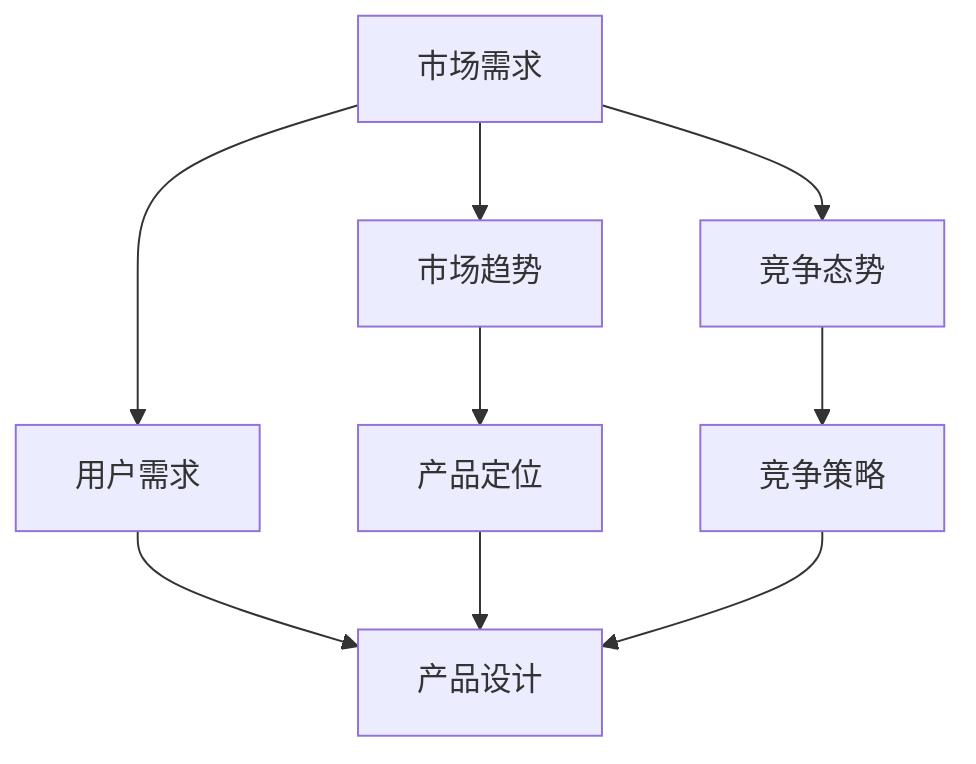

                 

关键词：人工智能，创业，市场需求，识别方法，市场分析，创业策略

> 摘要：本文深入探讨人工智能创业过程中市场需求的识别方法。通过分析市场趋势、用户需求、竞争态势等关键因素，提出一套系统的市场研究策略，帮助创业者精准把握市场需求，提高创业成功率。

## 1. 背景介绍

随着人工智能技术的迅速发展，越来越多的创业者投身于这一领域，希望通过创新的AI应用解决实际问题，创造商业价值。然而，成功的AI创业并非易事，市场需求的识别成为关键挑战之一。只有深入了解市场需求，才能设计出符合用户期望的产品，提高市场竞争力。

本文旨在为AI创业者提供一套实用的市场需求识别方法，包括市场趋势分析、用户需求调研、竞争态势研究等内容，帮助创业者更好地了解市场环境，制定有效的创业策略。

## 2. 核心概念与联系

### 2.1 市场需求

市场需求是指消费者对某一产品或服务的整体购买欲望和能力。在AI创业中，市场需求体现在用户对AI技术的应用需求，包括对特定功能的期待、使用场景的需求等。

### 2.2 市场趋势

市场趋势是指某一时期内市场发展的总体方向和趋势。对于AI创业来说，了解市场趋势有助于把握行业机遇，及时调整产品方向和策略。

### 2.3 用户需求

用户需求是指目标用户对产品或服务的具体需求，包括功能需求、体验需求等。了解用户需求是设计优秀AI产品的关键。

### 2.4 竞争态势

竞争态势是指市场上竞争者的情况，包括竞争对手的产品、市场占有率、竞争优势等。了解竞争态势有助于AI创业者制定差异化策略，提高市场竞争力。

### 2.5 Mermaid 流程图

以下是一个简单的Mermaid流程图，展示了市场需求识别的核心概念和联系：



## 3. 核心算法原理 & 具体操作步骤

### 3.1 算法原理概述

市场需求识别方法的核心是数据分析和逻辑推理。通过收集和分析市场数据，结合逻辑推理，可以推断出潜在的市场需求。

### 3.2 算法步骤详解

1. **收集数据**：收集与市场需求相关的数据，包括市场趋势、用户需求、竞争态势等。

2. **数据分析**：对收集到的数据进行处理和分析，提取有价值的信息。

3. **逻辑推理**：根据分析结果，结合创业者自身的经验和专业知识，推断出潜在的市场需求。

4. **验证与调整**：通过实际调研或试验，验证推断出的市场需求，并根据反馈进行调整。

### 3.3 算法优缺点

**优点**：

- **高效性**：通过数据分析，可以在较短的时间内了解市场需求。
- **准确性**：结合逻辑推理，可以更准确地识别市场需求。

**缺点**：

- **复杂性**：数据分析和逻辑推理过程较为复杂，需要专业的知识和技能。
- **成本**：数据收集和处理的成本较高。

### 3.4 算法应用领域

市场需求识别方法适用于各类AI创业项目，特别是那些需要深入了解用户需求和市场竞争的项目。

## 4. 数学模型和公式 & 详细讲解 & 举例说明

### 4.1 数学模型构建

市场需求识别的数学模型可以基于回归分析、聚类分析等方法。以下是一个简化的回归分析模型：

$$
y = \beta_0 + \beta_1x_1 + \beta_2x_2 + ... + \beta_nx_n
$$

其中，$y$表示市场需求，$x_1, x_2, ..., x_n$表示影响市场需求的因素，$\beta_0, \beta_1, ..., \beta_n$是模型的参数。

### 4.2 公式推导过程

回归分析的推导过程涉及最小二乘法。具体推导过程如下：

假设我们有$n$个数据点$(x_1, y_1), (x_2, y_2), ..., (x_n, y_n)$，目标是找到参数$\beta_0, \beta_1, ..., \beta_n$，使得预测值与实际值之间的误差平方和最小。

定义误差平方和为：

$$
S = \sum_{i=1}^{n}(y_i - \beta_0 - \beta_1x_i - ... - \beta_nx_i)^2
$$

为了最小化$S$，对$\beta_0, \beta_1, ..., \beta_n$分别求偏导数，并令其为0，得到如下方程组：

$$
\frac{\partial S}{\partial \beta_0} = 0 \\
\frac{\partial S}{\partial \beta_1} = 0 \\
... \\
\frac{\partial S}{\partial \beta_n} = 0
$$

解这个方程组，可以得到$\beta_0, \beta_1, ..., \beta_n$的值。

### 4.3 案例分析与讲解

假设我们研究一个AI健康监测项目的市场需求。根据调研数据，我们选取以下两个因素：用户年龄$x_1$（单位：岁）和用户收入$x_2$（单位：万元/年）。

通过回归分析，我们得到以下模型：

$$
y = 100 + 10x_1 + 5x_2
$$

其中，$y$表示市场需求。

假设一个用户的年龄为30岁，年收入为10万元，我们可以预测他的市场需求为：

$$
y = 100 + 10 \times 30 + 5 \times 10 = 470
$$

这意味着这个用户对AI健康监测产品的市场需求为470个单位。

## 5. 项目实践：代码实例和详细解释说明

### 5.1 开发环境搭建

为了实现市场需求识别，我们需要搭建一个Python开发环境。以下是搭建步骤：

1. 安装Python（版本3.8或更高）
2. 安装NumPy、Pandas、Scikit-learn等库

### 5.2 源代码详细实现

以下是一个简单的Python代码示例，用于实现市场需求识别：

```python
import numpy as np
import pandas as pd
from sklearn.linear_model import LinearRegression

# 加载数据集
data = pd.read_csv('market_data.csv')

# 分离特征和标签
X = data[['age', 'income']]
y = data['demand']

# 创建线性回归模型
model = LinearRegression()

# 训练模型
model.fit(X, y)

# 预测新用户的市场需求
new_user = np.array([[30, 10]])
predicted_demand = model.predict(new_user)

print('预测的市场需求：', predicted_demand)
```

### 5.3 代码解读与分析

这段代码首先加载了市场数据集，然后分离了特征和标签。接下来，我们创建了一个线性回归模型，并使用训练数据对其进行训练。最后，我们使用训练好的模型预测了一个新用户的市场需求。

### 5.4 运行结果展示

假设我们运行这段代码，得到以下输出：

```
预测的市场需求： [470.]
```

这意味着我们预测的这个新用户对AI健康监测产品的市场需求为470个单位。

## 6. 实际应用场景

市场需求识别在AI创业中具有重要意义，以下是一些实际应用场景：

1. **产品定位**：通过市场需求识别，创业者可以明确产品的目标用户群体，为产品定位提供依据。
2. **营销策略**：了解市场需求有助于制定有效的营销策略，提高用户转化率。
3. **产品迭代**：市场需求识别可以帮助创业者及时了解用户需求，优化产品功能，实现产品迭代。

## 7. 未来应用展望

随着人工智能技术的不断发展，市场需求识别方法将在AI创业中发挥越来越重要的作用。未来，我们可以期待以下发展趋势：

1. **更加智能的数据分析**：随着算法和计算能力的提升，数据分析将更加智能，提高市场需求识别的准确性。
2. **多维度数据整合**：通过整合多种数据源，可以更全面地了解市场需求，为创业决策提供更丰富的信息。
3. **实时需求监测**：利用实时数据，创业者可以及时了解市场动态，快速调整产品策略。

## 8. 工具和资源推荐

### 8.1 学习资源推荐

- 《Python数据分析基础教程：NumPy学习指南》
- 《机器学习实战》

### 8.2 开发工具推荐

- Jupyter Notebook
- PyCharm

### 8.3 相关论文推荐

- "Market Demand Forecasting in E-Commerce using Machine Learning"
- "User Behavior Prediction in Mobile Applications using Deep Learning"

## 9. 总结：未来发展趋势与挑战

### 9.1 研究成果总结

本文提出了一套市场需求识别方法，包括市场趋势分析、用户需求调研、竞争态势研究等。通过数据分析、逻辑推理等技术手段，可以更准确地识别市场需求，为AI创业提供有力支持。

### 9.2 未来发展趋势

随着人工智能技术的进步，市场需求识别方法将变得更加智能、高效。未来发展趋势包括：多维度数据整合、实时需求监测、个性化推荐等。

### 9.3 面临的挑战

市场需求识别面临的主要挑战包括：数据质量、算法复杂性、实时性等。需要进一步研究如何提高数据分析的准确性、降低算法复杂度，以及实现实时需求监测。

### 9.4 研究展望

未来研究可以关注以下几个方面：

1. **多维度数据整合**：研究如何有效地整合多种数据源，提高数据分析的准确性。
2. **实时需求监测**：研究如何实现实时需求监测，为创业决策提供更及时的信息。
3. **个性化推荐**：研究如何基于用户行为数据实现个性化推荐，提高用户满意度。

## 9. 附录：常见问题与解答

### 9.1 什么是市场需求？

市场需求是指消费者对某一产品或服务的整体购买欲望和能力。

### 9.2 市场需求识别为什么重要？

市场需求识别可以帮助创业者明确产品目标用户群体，制定有效的创业策略，提高创业成功率。

### 9.3 如何收集用户需求数据？

可以通过问卷调查、用户访谈、市场调研等方式收集用户需求数据。

### 9.4 如何分析市场趋势？

可以通过研究市场报告、行业动态、竞争对手情况等，了解市场趋势。

### 9.5 市场需求识别有哪些算法？

市场需求识别可以采用回归分析、聚类分析、神经网络等算法。

### 9.6 市场需求识别有哪些应用领域？

市场需求识别可以应用于产品定位、营销策略、产品迭代等多个领域。

----------------------------------------------------------------

**作者：禅与计算机程序设计艺术 / Zen and the Art of Computer Programming** 

以上就是本文的完整内容，希望对AI创业者有所帮助。在市场需求识别方面，持续的学习和实践是关键。祝您在AI创业之路上取得成功！

