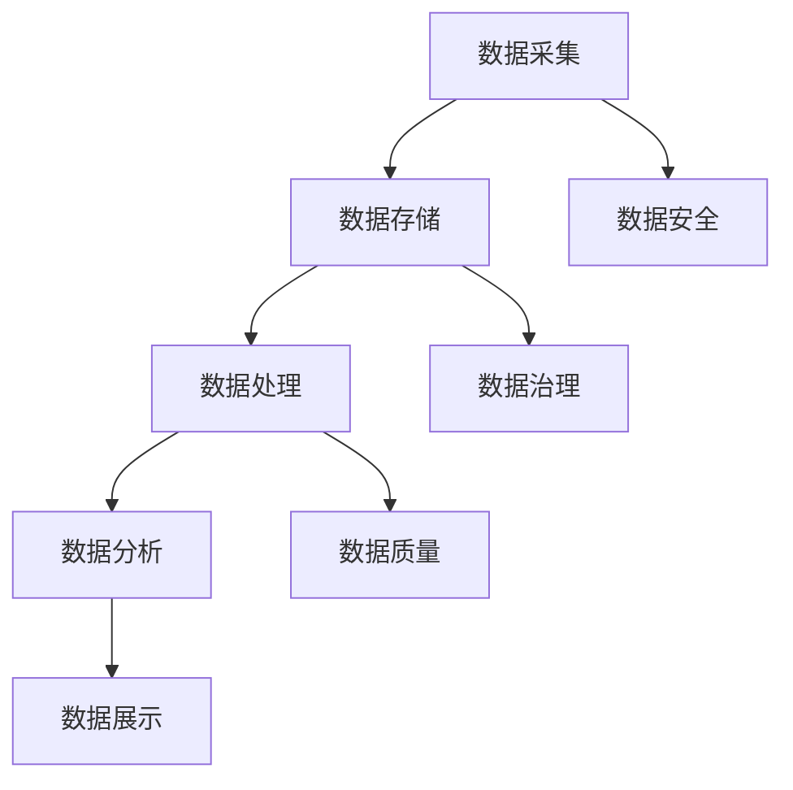

                 

关键词：AI创业、数据管理、策略、实践、案例分析、算法、数学模型

> 摘要：本文从AI创业的角度，深入探讨了数据管理的实用策略。通过案例分析、算法解析、数学模型构建以及项目实践等多个维度，为创业者提供了一套全面的数据管理指南，旨在帮助他们在激烈的竞争环境中，有效利用数据，实现业务增长。

## 1. 背景介绍

在当今的数字经济时代，数据已经成为企业的核心资产。然而，如何有效地管理和利用这些数据，却成为了许多AI创业公司的难题。数据管理不仅涉及到数据的收集、存储、处理和分析，还包括如何确保数据的质量、安全性和合规性。一个有效的数据管理策略，不仅能够提高企业的运营效率，还能为企业提供强大的竞争优势。

本文旨在为AI创业者提供一套实用的数据管理策略，帮助他们应对数据管理的挑战，实现业务的快速发展。本文将首先介绍数据管理的基本概念和核心要素，然后通过案例分析和算法解析，展示如何将理论转化为实践，并最终提出一套适用于AI创业公司的数据管理框架。

## 2. 核心概念与联系

### 2.1 数据管理的基本概念

数据管理是指对数据资源进行有效组织、控制、维护和利用的过程。它包括以下几个核心要素：

1. **数据质量**：确保数据准确性、完整性、一致性和及时性。
2. **数据安全**：保护数据免受未经授权的访问、使用、披露、破坏、修改或损失。
3. **数据治理**：制定数据管理的政策和流程，确保数据符合法律法规和行业标准。
4. **数据存储**：选择合适的数据存储解决方案，以满足数据的存储需求。
5. **数据集成**：整合来自不同来源的数据，使其能够在同一平台上进行统一管理和分析。
6. **数据分析**：运用各种数据挖掘和分析技术，从数据中提取有价值的信息。

### 2.2 数据管理的架构

下图展示了数据管理的典型架构，包括数据采集、数据存储、数据处理、数据分析和数据展示等关键环节。



## 3. 核心算法原理 & 具体操作步骤

### 3.1 算法原理概述

在数据管理中，核心算法扮演着至关重要的角色。以下是一些常用的算法：

1. **数据清洗算法**：用于处理缺失值、异常值和重复值，确保数据质量。
2. **数据挖掘算法**：如聚类、分类、关联规则挖掘等，用于从数据中提取有价值的信息。
3. **机器学习算法**：如线性回归、决策树、神经网络等，用于建立预测模型。
4. **数据加密算法**：如AES、RSA等，用于保护数据安全。

### 3.2 算法步骤详解

以下以数据清洗算法为例，详细介绍其操作步骤：

1. **数据预处理**：读取原始数据，对数据格式进行统一处理。
2. **缺失值处理**：根据数据特征，选择合适的缺失值处理方法，如删除、填充等。
3. **异常值处理**：识别并处理异常值，如使用Z-Score方法、IQR方法等。
4. **重复值处理**：识别并删除重复值，确保数据唯一性。

### 3.3 算法优缺点

每种算法都有其优缺点，创业者需要根据具体业务需求选择合适的算法。例如：

- **数据清洗算法**：优点是简单易用，缺点是对复杂数据结构的处理能力有限。
- **数据挖掘算法**：优点是能够从大量数据中提取有价值的信息，缺点是计算复杂度高。
- **机器学习算法**：优点是能够建立预测模型，缺点是需要大量训练数据和较长时间的训练。

### 3.4 算法应用领域

算法在数据管理中的应用非常广泛，包括：

- **数据分析**：用于从数据中提取有价值的信息，支持业务决策。
- **数据安全**：用于加密和解密数据，保护数据安全。
- **数据治理**：用于监控和审计数据质量，确保数据符合法律法规和行业标准。

## 4. 数学模型和公式 & 详细讲解 & 举例说明

### 4.1 数学模型构建

在数据管理中，数学模型用于描述数据之间的关系，指导算法的设计和实现。以下是一个简单的线性回归模型：

$$
y = \beta_0 + \beta_1 x_1 + \beta_2 x_2 + ... + \beta_n x_n
$$

其中，$y$ 是因变量，$x_1, x_2, ..., x_n$ 是自变量，$\beta_0, \beta_1, ..., \beta_n$ 是模型的参数。

### 4.2 公式推导过程

线性回归模型的推导过程如下：

1. **损失函数**：选择合适的损失函数，如均方误差（MSE），衡量预测值与真实值之间的差距。
2. **梯度下降法**：通过迭代优化参数，使损失函数最小化。

### 4.3 案例分析与讲解

以下是一个简单的案例，说明如何使用线性回归模型预测房价：

1. **数据收集**：收集100个房屋的面积和售价数据。
2. **数据预处理**：对数据缺失值和异常值进行处理。
3. **模型训练**：使用训练数据，使用梯度下降法训练线性回归模型。
4. **模型评估**：使用测试数据，评估模型的预测准确性。

## 5. 项目实践：代码实例和详细解释说明

### 5.1 开发环境搭建

- **Python环境**：安装Python 3.8及以上版本。
- **库安装**：安装NumPy、Pandas、Scikit-learn等库。

### 5.2 源代码详细实现

以下是一个简单的线性回归代码示例：

```python
import numpy as np
import pandas as pd
from sklearn.linear_model import LinearRegression
from sklearn.model_selection import train_test_split
from sklearn.metrics import mean_squared_error

# 数据收集
data = pd.read_csv('house_data.csv')

# 数据预处理
data = data.dropna()
X = data[['area']]
y = data['price']

# 模型训练
X_train, X_test, y_train, y_test = train_test_split(X, y, test_size=0.2)
model = LinearRegression()
model.fit(X_train, y_train)

# 模型评估
y_pred = model.predict(X_test)
mse = mean_squared_error(y_test, y_pred)
print(f'MSE: {mse}')

# 预测房价
area = np.array([2000])
price_pred = model.predict(area)
print(f'Predicted Price: {price_pred[0]}')
```

### 5.3 代码解读与分析

- **数据收集**：读取CSV文件，获取房屋面积和售价数据。
- **数据预处理**：删除缺失值，确保数据质量。
- **模型训练**：使用训练数据，训练线性回归模型。
- **模型评估**：使用测试数据，评估模型预测准确性。
- **预测房价**：输入新数据，预测房价。

## 6. 实际应用场景

数据管理在AI创业中的应用非常广泛，以下是一些典型的应用场景：

1. **客户关系管理**：通过数据挖掘和机器学习技术，分析客户行为，提高客户满意度。
2. **需求预测**：利用历史销售数据，预测未来销售趋势，优化库存管理。
3. **风险管理**：通过数据分析和风险评估模型，识别潜在风险，制定风险管理策略。
4. **供应链优化**：通过数据分析和优化算法，降低供应链成本，提高供应链效率。

## 7. 工具和资源推荐

### 7.1 学习资源推荐

- 《数据科学入门教程》：提供丰富的数据科学基础知识和实践案例。
- 《机器学习实战》：深入讲解机器学习算法和实战应用。

### 7.2 开发工具推荐

- **Jupyter Notebook**：强大的交互式开发环境，支持Python等多种编程语言。
- **SQLAlchemy**：用于数据库操作和查询的ORM（对象关系映射）工具。

### 7.3 相关论文推荐

- “Deep Learning for Data Science” by Goodfellow et al.
- “Recurrent Neural Networks for Language Modeling” by LSTM and GRU architectures.

## 8. 总结：未来发展趋势与挑战

数据管理作为AI创业的核心环节，其发展趋势和挑战主要体现在以下几个方面：

1. **数据质量**：随着数据量的爆炸式增长，如何确保数据质量成为一个重要挑战。
2. **数据安全**：如何保障数据安全，防止数据泄露和滥用，是创业者必须面对的问题。
3. **数据治理**：如何制定有效的数据治理策略，确保数据合规，是企业长远发展的关键。
4. **人工智能与数据管理**：如何将人工智能技术应用于数据管理，提高数据管理的效率和智能化水平。

未来，数据管理将更加智能化、自动化，结合人工智能和大数据技术，为企业提供更全面、准确的数据支持。

## 9. 附录：常见问题与解答

### 9.1 如何选择数据存储方案？

选择数据存储方案时，需要考虑以下因素：

- **数据量**：根据数据量大小，选择合适的存储方案，如关系型数据库、NoSQL数据库、分布式文件系统等。
- **读写性能**：根据业务需求，选择适合的读写性能，如SSD、HDD、SSD集群等。
- **数据安全**：选择具备数据备份和恢复功能的存储方案，确保数据安全。
- **成本**：根据预算，选择成本合理的存储方案。

### 9.2 如何保证数据质量？

保证数据质量需要从以下几个方面入手：

- **数据采集**：选择可靠的数据源，确保数据的准确性。
- **数据清洗**：定期对数据进行清洗，处理缺失值、异常值和重复值。
- **数据监控**：建立数据质量监控体系，及时发现和纠正数据质量问题。
- **数据治理**：制定数据治理策略，确保数据符合法律法规和行业标准。

### 9.3 如何进行数据加密？

进行数据加密时，可以采取以下措施：

- **选择合适的加密算法**：如AES、RSA等，确保数据安全。
- **加密存储**：在数据存储过程中进行加密，防止数据泄露。
- **加密传输**：在数据传输过程中进行加密，确保数据在传输过程中的安全。
- **密钥管理**：妥善管理密钥，防止密钥泄露。

---

作者：禅与计算机程序设计艺术 / Zen and the Art of Computer Programming
----------------------------------------------------------------

