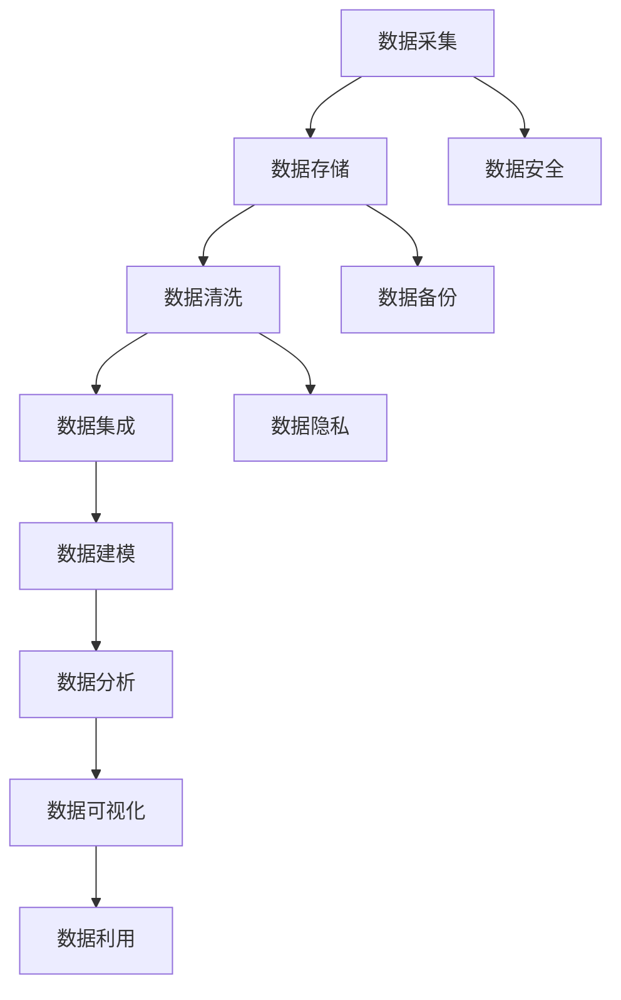

                 

 关键词：AI创业，数据管理，策略，对策，人工智能，数据分析，数据治理，创业公司

> 摘要：随着人工智能技术的发展，数据管理成为AI创业公司的关键挑战。本文探讨了数据管理的策略与对策，包括数据质量、数据安全、数据隐私以及数据利用等多个方面，为AI创业公司提供实用的指导。

## 1. 背景介绍

随着人工智能（AI）技术的迅速发展，数据管理在AI创业公司中变得越来越重要。数据是AI算法的基石，而数据管理的质量直接影响到算法的性能和企业的竞争力。AI创业公司通常面临着数据量庞大、数据种类多样、数据来源复杂等挑战。如何高效地采集、存储、处理、分析数据，确保数据质量和数据安全，成为企业成功的关键因素。

本文旨在探讨AI创业公司在数据管理方面的策略与对策，帮助创业者更好地应对这些挑战，提高数据利用效率，确保数据安全和隐私保护。

## 2. 核心概念与联系

### 2.1 数据管理核心概念

**数据质量**：数据质量是指数据满足特定需求的能力，包括准确性、完整性、一致性、可用性、及时性和可靠性。

**数据安全**：数据安全涉及保护数据免受未经授权的访问、泄露、篡改和破坏。

**数据隐私**：数据隐私是指保护个人和组织的隐私权利，确保数据收集、存储、处理和使用过程中不会侵犯隐私。

**数据治理**：数据治理是确保数据质量、数据安全和数据隐私的一系列政策和流程。

### 2.2 数据管理架构



### 2.3 数据管理联系

数据管理是一个闭环过程，各个环节相互关联。数据采集是起点，数据存储是基础，数据清洗和数据集成是确保数据质量的关键，数据建模和分析是数据利用的前奏，数据可视化有助于决策，数据安全、数据备份和数据隐私保护贯穿整个流程。

## 3. 核心算法原理 & 具体操作步骤

### 3.1 算法原理概述

数据管理算法主要包括数据清洗、数据集成、数据建模、数据分析等步骤。以下是每个步骤的简要原理：

- **数据清洗**：去除数据中的错误、缺失、重复和异常值，确保数据质量。
- **数据集成**：将来自不同来源和格式的数据整合到一个统一的结构中，便于后续处理。
- **数据建模**：使用统计学、机器学习等方法对数据进行分析和建模，提取有价值的信息。
- **数据分析**：对模型进行分析，评估模型的性能，为业务决策提供依据。

### 3.2 算法步骤详解

#### 3.2.1 数据清洗

- **去除错误和缺失值**：使用填充、删除或插值等方法处理错误和缺失值。
- **去除重复值**：识别和删除重复的数据记录，以避免数据冗余。
- **处理异常值**：对异常值进行标记、修复或删除，以确保数据的准确性。

#### 3.2.2 数据集成

- **数据格式转换**：将不同格式（如CSV、JSON、数据库等）的数据转换为统一的格式。
- **数据去重**：识别和删除重复的数据记录。
- **数据合并**：将多个数据集合并为一个数据集，确保数据的完整性和一致性。

#### 3.2.3 数据建模

- **特征工程**：选择和构造与目标变量相关的特征，提高模型的性能。
- **模型选择**：根据业务需求选择合适的算法和模型，如线性回归、决策树、神经网络等。
- **模型训练**：使用训练数据对模型进行训练，优化模型参数。

#### 3.2.4 数据分析

- **模型评估**：使用验证集对模型进行评估，评估模型的性能。
- **结果分析**：对模型的结果进行分析，提取有价值的信息，为业务决策提供依据。
- **可视化**：使用图表和可视化工具展示模型的结果，便于理解和分析。

### 3.3 算法优缺点

**优点**：

- **提高数据质量**：通过数据清洗和集成，提高数据的质量和可用性。
- **提高模型性能**：通过特征工程和模型选择，提高模型的性能和预测准确性。
- **降低风险**：通过数据治理和安全管理，降低数据泄露和隐私侵犯的风险。

**缺点**：

- **成本高**：数据管理和治理需要投入大量的人力、物力和时间。
- **技术门槛**：数据管理和分析需要专业的技术知识和经验。
- **数据依赖**：数据管理的成功与否很大程度上依赖于数据的完整性和质量。

### 3.4 算法应用领域

- **金融**：风险评估、信用评分、投资策略等。
- **医疗**：疾病预测、药物研发、健康监测等。
- **电商**：推荐系统、价格优化、库存管理等。
- **制造业**：质量控制、设备维护、生产计划等。

## 4. 数学模型和公式 & 详细讲解 & 举例说明

### 4.1 数学模型构建

数据管理中的数学模型主要包括统计模型、机器学习模型和深度学习模型等。

- **统计模型**：如线性回归、逻辑回归、聚类等。
- **机器学习模型**：如决策树、随机森林、支持向量机等。
- **深度学习模型**：如神经网络、卷积神经网络、循环神经网络等。

### 4.2 公式推导过程

以线性回归为例，线性回归模型的目标是最小化预测值与实际值之间的误差平方和。

- **损失函数**：$$J(\theta) = \frac{1}{2m}\sum_{i=1}^{m}(h_\theta(x^{(i)}) - y^{(i)})^2$$
- **梯度下降**：$$\theta_j := \theta_j - \alpha \frac{\partial J(\theta)}{\partial \theta_j}$$

### 4.3 案例分析与讲解

假设我们有一个简单的线性回归模型，预测房价，模型为$$h_\theta(x) = \theta_0 + \theta_1x$$。

- **数据集**：包含房屋的面积和房价。
- **特征工程**：将面积作为特征，房价作为目标变量。
- **模型训练**：使用梯度下降算法训练模型，得到最优参数。
- **模型评估**：使用验证集评估模型性能，计算均方误差。

## 5. 项目实践：代码实例和详细解释说明

### 5.1 开发环境搭建

- **Python**：安装Python 3.8及以上版本。
- **库**：安装NumPy、Pandas、Scikit-learn、Matplotlib等库。

### 5.2 源代码详细实现

以下是一个简单的线性回归模型实现：

```python
import numpy as np
import pandas as pd
from sklearn.linear_model import LinearRegression
from sklearn.model_selection import train_test_split
from sklearn.metrics import mean_squared_error

# 加载数据
data = pd.read_csv('house_data.csv')
X = data[['area']]
y = data['price']

# 数据预处理
X_train, X_test, y_train, y_test = train_test_split(X, y, test_size=0.2, random_state=42)

# 模型训练
model = LinearRegression()
model.fit(X_train, y_train)

# 模型评估
y_pred = model.predict(X_test)
mse = mean_squared_error(y_test, y_pred)
print('均方误差：', mse)
```

### 5.3 代码解读与分析

- **数据加载**：使用Pandas读取CSV文件，获取房屋面积和房价数据。
- **数据预处理**：使用Scikit-learn的train_test_split函数将数据集分为训练集和测试集。
- **模型训练**：使用LinearRegression类训练线性回归模型。
- **模型评估**：使用均方误差评估模型性能。

## 6. 实际应用场景

### 6.1 金融行业

在金融行业，数据管理可以帮助企业进行风险评估、信用评分和投资策略。例如，通过分析客户的信用记录、财务状况和市场趋势，金融机构可以更准确地评估客户的信用风险，为贷款审批和投资决策提供依据。

### 6.2 医疗行业

在医疗行业，数据管理可以用于疾病预测、药物研发和健康监测。例如，通过分析患者的医疗记录、基因数据和临床数据，医疗机构可以预测疾病的发生风险，为患者提供个性化的治疗方案。

### 6.3 电商行业

在电商行业，数据管理可以帮助企业进行推荐系统、价格优化和库存管理。例如，通过分析用户的购物行为、浏览历史和产品属性，电商平台可以推荐合适的商品给用户，提高用户满意度和转化率。

### 6.4 未来应用展望

随着人工智能技术的发展，数据管理将在更多领域得到应用。未来，数据管理将更加智能化、自动化和高效化，为企业提供更全面、更准确的数据支持，助力企业实现数字化转型和创新发展。

## 7. 工具和资源推荐

### 7.1 学习资源推荐

- **书籍**：《数据科学入门》、《Python数据分析》、《机器学习实战》
- **在线课程**：Coursera、Udacity、edX上的数据科学和机器学习课程
- **博客和社区**：Kaggle、DataCamp、Reddit的数据科学和机器学习社区

### 7.2 开发工具推荐

- **Python**：NumPy、Pandas、Scikit-learn、Matplotlib等
- **R**：ggplot2、dplyr、caret等
- **数据库**：MySQL、PostgreSQL、MongoDB等

### 7.3 相关论文推荐

- **数据质量**：《Data Quality in the Age of Big Data》
- **数据安全**：《Data Security and Privacy》
- **数据治理**：《Data Governance and Compliance》

## 8. 总结：未来发展趋势与挑战

### 8.1 研究成果总结

近年来，人工智能技术在数据管理领域取得了显著成果。通过数据清洗、数据集成、数据建模和数据分析等技术，企业可以更高效地管理和利用数据，提高业务决策的准确性。

### 8.2 未来发展趋势

- **智能化**：数据管理将更加智能化，利用人工智能技术实现自动化数据清洗、数据分析和数据治理。
- **平台化**：数据管理将更加平台化，提供一站式的数据管理解决方案，降低企业的使用门槛。
- **多样化**：数据管理将涵盖更多领域，如物联网、区块链、生物信息等，满足不同行业的需求。

### 8.3 面临的挑战

- **数据质量**：随着数据来源的多样化和数据量的增加，数据质量成为数据管理的最大挑战。
- **数据安全**：数据安全风险日益增加，如何确保数据的安全和隐私成为企业关注的焦点。
- **技术门槛**：数据管理需要专业的技术知识和经验，如何培养和引进人才成为企业面临的难题。

### 8.4 研究展望

未来，数据管理研究将继续深入探索智能化、平台化和多样化的方向，推动数据管理技术的创新和发展。同时，企业应加强对数据质量、数据安全和数据隐私的关注，确保数据管理工作的顺利进行。

## 9. 附录：常见问题与解答

### 9.1 数据质量如何保障？

**解答**：确保数据质量的关键在于数据采集、数据清洗和数据治理。在数据采集阶段，要确保数据的来源可靠、格式统一；在数据清洗阶段，要去除错误、缺失、重复和异常值；在数据治理阶段，要建立完善的数据质量标准和流程，定期对数据质量进行监控和评估。

### 9.2 如何确保数据安全？

**解答**：确保数据安全的关键在于数据安全策略的制定和实施。企业应建立完善的数据安全管理体系，包括数据加密、访问控制、数据备份和恢复等措施。同时，要加强对员工的培训和管理，提高员工的数据安全意识和能力。

### 9.3 数据隐私如何保护？

**解答**：保护数据隐私的关键在于数据隐私策略的制定和实施。企业应遵循相关法律法规，对数据进行分类和保护，确保敏感数据的安全。同时，要加强对用户隐私的保护，提供透明的隐私政策和用户同意机制，确保用户隐私权益。

作者：禅与计算机程序设计艺术 / Zen and the Art of Computer Programming

----------------------------------------------------------------

### 文章标题：AI创业：数据管理的策略与对策解析

关键词：AI创业，数据管理，策略，对策，人工智能，数据分析，数据治理，创业公司

摘要：随着人工智能技术的发展，数据管理成为AI创业公司的关键挑战。本文探讨了数据管理的策略与对策，包括数据质量、数据安全、数据隐私以及数据利用等多个方面，为AI创业公司提供实用的指导。

## 1. 背景介绍

随着人工智能（AI）技术的迅速发展，数据管理在AI创业公司中变得越来越重要。数据是AI算法的基石，而数据管理的质量直接影响到算法的性能和企业的竞争力。AI创业公司通常面临着数据量庞大、数据种类多样、数据来源复杂等挑战。如何高效地采集、存储、处理、分析数据，确保数据质量和数据安全，成为企业成功的关键因素。

本文旨在探讨AI创业公司在数据管理方面的策略与对策，帮助创业者更好地应对这些挑战，提高数据利用效率，确保数据安全和隐私保护。

## 2. 核心概念与联系

### 2.1 数据管理核心概念

**数据质量**：数据质量是指数据满足特定需求的能力，包括准确性、完整性、一致性、可用性、及时性和可靠性。

**数据安全**：数据安全涉及保护数据免受未经授权的访问、泄露、篡改和破坏。

**数据隐私**：数据隐私是指保护个人和组织的隐私权利，确保数据收集、存储、处理和使用过程中不会侵犯隐私。

**数据治理**：数据治理是确保数据质量、数据安全和数据隐私的一系列政策和流程。

### 2.2 数据管理架构


### 2.3 数据管理联系

数据管理是一个闭环过程，各个环节相互关联。数据采集是起点，数据存储是基础，数据清洗和数据集成是确保数据质量的关键，数据建模和分析是数据利用的前奏，数据可视化有助于决策，数据安全、数据备份和数据隐私保护贯穿整个流程。

## 3. 核心算法原理 & 具体操作步骤

### 3.1 算法原理概述

数据管理算法主要包括数据清洗、数据集成、数据建模、数据分析等步骤。以下是每个步骤的简要原理：

- **数据清洗**：去除数据中的错误、缺失、重复和异常值，确保数据质量。
- **数据集成**：将来自不同来源和格式的数据整合到一个统一的结构中，便于后续处理。
- **数据建模**：使用统计学、机器学习等方法对数据进行分析和建模，提取有价值的信息。
- **数据分析**：对模型进行分析，评估模型的性能，为业务决策提供依据。

### 3.2 算法步骤详解

#### 3.2.1 数据清洗

- **去除错误和缺失值**：使用填充、删除或插值等方法处理错误和缺失值。
- **去除重复值**：识别和删除重复的数据记录，以避免数据冗余。
- **处理异常值**：对异常值进行标记、修复或删除，以确保数据的准确性。

#### 3.2.2 数据集成

- **数据格式转换**：将不同格式（如CSV、JSON、数据库等）的数据转换为统一的格式。
- **数据去重**：识别和删除重复的数据记录。
- **数据合并**：将多个数据集合并为一个数据集，确保数据的完整性和一致性。

#### 3.2.3 数据建模

- **特征工程**：选择和构造与目标变量相关的特征，提高模型的性能。
- **模型选择**：根据业务需求选择合适的算法和模型，如线性回归、决策树、神经网络等。
- **模型训练**：使用训练数据对模型进行训练，优化模型参数。

#### 3.2.4 数据分析

- **模型评估**：使用验证集对模型进行评估，评估模型的性能。
- **结果分析**：对模型的结果进行分析，提取有价值的信息，为业务决策提供依据。
- **可视化**：使用图表和可视化工具展示模型的结果，便于理解和分析。

### 3.3 算法优缺点

**优点**：

- **提高数据质量**：通过数据清洗和集成，提高数据的质量和可用性。
- **提高模型性能**：通过特征工程和模型选择，提高模型的性能和预测准确性。
- **降低风险**：通过数据治理和安全管理，降低数据泄露和隐私侵犯的风险。

**缺点**：

- **成本高**：数据管理和治理需要投入大量的人力、物力和时间。
- **技术门槛**：数据管理和分析需要专业的技术知识和经验。
- **数据依赖**：数据管理的成功与否很大程度上依赖于数据的完整性和质量。

### 3.4 算法应用领域

- **金融**：风险评估、信用评分、投资策略等。
- **医疗**：疾病预测、药物研发、健康监测等。
- **电商**：推荐系统、价格优化、库存管理等。
- **制造业**：质量控制、设备维护、生产计划等。

## 4. 数学模型和公式 & 详细讲解 & 举例说明

### 4.1 数学模型构建

数据管理中的数学模型主要包括统计模型、机器学习模型和深度学习模型等。

- **统计模型**：如线性回归、逻辑回归、聚类等。
- **机器学习模型**：如决策树、随机森林、支持向量机等。
- **深度学习模型**：如神经网络、卷积神经网络、循环神经网络等。

### 4.2 公式推导过程

以线性回归为例，线性回归模型的目标是最小化预测值与实际值之间的误差平方和。

- **损失函数**：$$J(\theta) = \frac{1}{2m}\sum_{i=1}^{m}(h_\theta(x^{(i)}) - y^{(i)})^2$$
- **梯度下降**：$$\theta_j := \theta_j - \alpha \frac{\partial J(\theta)}{\partial \theta_j}$$

### 4.3 案例分析与讲解

假设我们有一个简单的线性回归模型，预测房价，模型为$$h_\theta(x) = \theta_0 + \theta_1x$$。

- **数据集**：包含房屋的面积和房价。
- **特征工程**：将面积作为特征，房价作为目标变量。
- **模型训练**：使用梯度下降算法训练模型，得到最优参数。
- **模型评估**：使用验证集评估模型性能，计算均方误差。

## 5. 项目实践：代码实例和详细解释说明

### 5.1 开发环境搭建

- **Python**：安装Python 3.8及以上版本。
- **库**：安装NumPy、Pandas、Scikit-learn、Matplotlib等库。

### 5.2 源代码详细实现

以下是一个简单的线性回归模型实现：

```python
import numpy as np
import pandas as pd
from sklearn.linear_model import LinearRegression
from sklearn.model_selection import train_test_split
from sklearn.metrics import mean_squared_error

# 加载数据
data = pd.read_csv('house_data.csv')
X = data[['area']]
y = data['price']

# 数据预处理
X_train, X_test, y_train, y_test = train_test_split(X, y, test_size=0.2, random_state=42)

# 模型训练
model = LinearRegression()
model.fit(X_train, y_train)

# 模型评估
y_pred = model.predict(X_test)
mse = mean_squared_error(y_test, y_pred)
print('均方误差：', mse)
```

### 5.3 代码解读与分析

- **数据加载**：使用Pandas读取CSV文件，获取房屋面积和房价数据。
- **数据预处理**：使用Scikit-learn的train_test_split函数将数据集分为训练集和测试集。
- **模型训练**：使用LinearRegression类训练线性回归模型。
- **模型评估**：使用均方误差评估模型性能。

## 6. 实际应用场景

### 6.1 金融行业

在金融行业，数据管理可以帮助企业进行风险评估、信用评分和投资策略。例如，通过分析客户的信用记录、财务状况和市场趋势，金融机构可以更准确地评估客户的信用风险，为贷款审批和投资决策提供依据。

### 6.2 医疗行业

在医疗行业，数据管理可以用于疾病预测、药物研发和健康监测。例如，通过分析患者的医疗记录、基因数据和临床数据，医疗机构可以预测疾病的发生风险，为患者提供个性化的治疗方案。

### 6.3 电商行业

在电商行业，数据管理可以帮助企业进行推荐系统、价格优化和库存管理。例如，通过分析用户的购物行为、浏览历史和产品属性，电商平台可以推荐合适的商品给用户，提高用户满意度和转化率。

### 6.4 未来应用展望

随着人工智能技术的发展，数据管理将在更多领域得到应用。未来，数据管理将更加智能化、自动化和高效化，为企业提供更全面、更准确的数据支持，助力企业实现数字化转型和创新发展。

## 7. 工具和资源推荐

### 7.1 学习资源推荐

- **书籍**：《数据科学入门》、《Python数据分析》、《机器学习实战》
- **在线课程**：Coursera、Udacity、edX上的数据科学和机器学习课程
- **博客和社区**：Kaggle、DataCamp、Reddit的数据科学和机器学习社区

### 7.2 开发工具推荐

- **Python**：NumPy、Pandas、Scikit-learn、Matplotlib等
- **R**：ggplot2、dplyr、caret等
- **数据库**：MySQL、PostgreSQL、MongoDB等

### 7.3 相关论文推荐

- **数据质量**：《Data Quality in the Age of Big Data》
- **数据安全**：《Data Security and Privacy》
- **数据治理**：《Data Governance and Compliance》

## 8. 总结：未来发展趋势与挑战

### 8.1 研究成果总结

近年来，人工智能技术在数据管理领域取得了显著成果。通过数据清洗、数据集成、数据建模和数据分析等技术，企业可以更高效地管理和利用数据，提高业务决策的准确性。

### 8.2 未来发展趋势

- **智能化**：数据管理将更加智能化，利用人工智能技术实现自动化数据清洗、数据分析和数据治理。
- **平台化**：数据管理将更加平台化，提供一站式的数据管理解决方案，降低企业的使用门槛。
- **多样化**：数据管理将涵盖更多领域，如物联网、区块链、生物信息等，满足不同行业的需求。

### 8.3 面临的挑战

- **数据质量**：随着数据来源的多样化和数据量的增加，数据质量成为数据管理的最大挑战。
- **数据安全**：数据安全风险日益增加，如何确保数据的安全和隐私成为企业关注的焦点。
- **技术门槛**：数据管理需要专业的技术知识和经验，如何培养和引进人才成为企业面临的难题。

### 8.4 研究展望

未来，数据管理研究将继续深入探索智能化、平台化和多样化的方向，推动数据管理技术的创新和发展。同时，企业应加强对数据质量、数据安全和数据隐私的关注，确保数据管理工作的顺利进行。

## 9. 附录：常见问题与解答

### 9.1 数据质量如何保障？

**解答**：确保数据质量的关键在于数据采集、数据清洗和数据治理。在数据采集阶段，要确保数据的来源可靠、格式统一；在数据清洗阶段，要去除错误、缺失、重复和异常值；在数据治理阶段，要建立完善的数据质量标准和流程，定期对数据质量进行监控和评估。

### 9.2 如何确保数据安全？

**解答**：确保数据安全的关键在于数据安全策略的制定和实施。企业应建立完善的数据安全管理体系，包括数据加密、访问控制、数据备份和恢复等措施。同时，要加强对员工的培训和管理，提高员工的数据安全意识和能力。

### 9.3 数据隐私如何保护？

**解答**：保护数据隐私的关键在于数据隐私策略的制定和实施。企业应遵循相关法律法规，对数据进行分类和保护，确保敏感数据的安全。同时，要加强对用户隐私的保护，提供透明的隐私政策和用户同意机制，确保用户隐私权益。

作者：禅与计算机程序设计艺术 / Zen and the Art of Computer Programming

---

由于篇幅限制，本文仅提供了文章的核心框架和部分内容。完整的文章应包括更多的实际案例、详细的数据管理策略和对策、深入的数学模型解析以及丰富的代码实例和解释。在撰写完整文章时，可以参考以下步骤：

1. **详细案例分析**：为每个应用领域提供具体的数据管理案例，分析其挑战、解决方案和效果。
2. **策略深度探讨**：对数据质量、数据安全、数据隐私等策略进行更深入的讨论，结合实际案例提供详细的实施方案。
3. **数学模型扩展**：为每种算法提供更详细的数学公式和推导过程，以及如何应用于实际问题的指南。
4. **代码实例丰富**：提供更多的代码实例，包括数据预处理、特征工程、模型训练、模型评估等各个环节，并进行详细的解读。
5. **实践建议与展望**：基于行业趋势，提出具体的数据管理实践建议，并对未来的发展进行展望。

通过这些扩展，可以使文章内容更加丰富和实用，为AI创业公司提供更有价值的指导。

