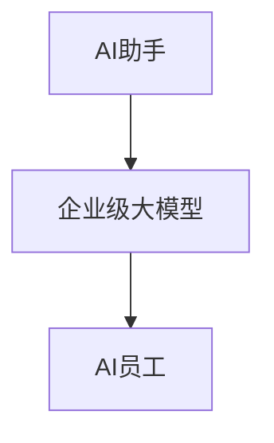

                 

关键词：AI助手，AI员工，企业级大模型，应用趋势，技术分析

> 摘要：本文旨在探讨AI从助手到员工在企业级应用中的趋势与发展，分析大模型在该领域的重要作用，并结合实际案例与未来展望，提出应对策略与挑战。

## 1. 背景介绍

在过去的几年里，人工智能（AI）技术取得了显著进展，尤其是在自然语言处理、图像识别、机器学习等领域。随着AI技术的不断成熟，AI助手已逐渐成为我们日常生活的一部分。从智能音箱到智能手机助手，AI助手为我们提供了便捷的服务，如语音搜索、日程管理、智能家居控制等。然而，随着技术的进一步发展，AI不再仅仅局限于助手的角色，它开始向更高级的岗位——AI员工转变。

企业级大模型是这一转变的核心驱动力。这些大模型具备处理海量数据、进行复杂决策和任务执行的能力。企业级大模型的应用，不仅能够提高工作效率，还能为企业带来新的商业模式和竞争优势。

## 2. 核心概念与联系

### 2.1 AI助手与AI员工的定义

**AI助手**通常指的是那些能够执行特定任务的智能系统，如智能语音助手、聊天机器人等。它们的主要功能是为用户提供便利，执行简单的任务。

**AI员工**则是一个更为高级的概念。它不仅仅是一个执行任务的系统，而是具备自主决策能力，能够参与企业运营和决策过程的智能体。

### 2.2 企业级大模型的概念

企业级大模型是指那些具备大规模训练数据、强大计算能力、广泛适用性的AI模型。这些模型可以处理复杂的业务逻辑，进行数据分析和预测，帮助企业做出更明智的决策。

### 2.3 Mermaid 流程图



在这个流程图中，AI助手通过积累数据经验和用户反馈，逐步演变为企业级大模型，最终成为具有独立决策能力的AI员工。

## 3. 核心算法原理 & 具体操作步骤

### 3.1 算法原理概述

企业级大模型的核心在于其训练过程。这些模型通常基于深度学习技术，通过大量的数据和计算资源进行训练，以学习复杂的模式和规律。训练完成后，模型可以用于各种应用场景，如文本分析、图像识别、语音识别等。

### 3.2 算法步骤详解

1. **数据收集与预处理**：收集相关领域的海量数据，并对数据进行清洗、标注和整合。
2. **模型设计**：根据应用需求，设计合适的神经网络结构。
3. **模型训练**：使用训练数据对模型进行训练，通过优化算法调整模型参数。
4. **模型评估与优化**：评估模型在测试数据上的表现，并进行优化。
5. **部署与应用**：将训练好的模型部署到生产环境中，进行实际应用。

### 3.3 算法优缺点

**优点**：
- **强大的处理能力**：企业级大模型能够处理复杂的业务逻辑和海量数据。
- **自适应性强**：通过不断学习和优化，模型可以适应不同的应用场景。
- **提高效率**：自动化决策和任务执行，减少人工操作，提高工作效率。

**缺点**：
- **计算资源需求大**：训练和部署企业级大模型需要大量的计算资源。
- **数据安全与隐私问题**：大量数据的使用和存储可能涉及数据安全和隐私问题。
- **模型解释性不足**：深度学习模型通常缺乏透明性和解释性。

### 3.4 算法应用领域

- **客户服务**：使用AI员工提供24/7的客户支持，提高客户满意度。
- **财务管理**：AI员工可以帮助企业进行财务预测、风险分析和投资决策。
- **供应链管理**：AI员工可以优化库存管理、物流规划和供应链协同。

## 4. 数学模型和公式 & 详细讲解 & 举例说明

### 4.1 数学模型构建

企业级大模型的构建通常基于深度学习技术。以下是一个简化的数学模型构建过程：

$$
y = f(W \cdot x + b)
$$

其中，$y$ 是模型输出的预测结果，$x$ 是输入数据，$W$ 是权重矩阵，$b$ 是偏置项，$f$ 是激活函数。

### 4.2 公式推导过程

以一个简单的多层感知机（MLP）为例，其数学推导过程如下：

$$
\begin{align*}
z_1 &= W_1 \cdot x + b_1 \\
a_1 &= f(z_1) \\
z_2 &= W_2 \cdot a_1 + b_2 \\
a_2 &= f(z_2) \\
&\vdots \\
z_n &= W_n \cdot a_{n-1} + b_n \\
a_n &= f(z_n)
\end{align*}
$$

### 4.3 案例分析与讲解

假设我们要构建一个简单的文本分类模型，用于判断一篇文章是否属于体育类别。我们可以使用以下数学模型：

$$
P(\text{体育} | x) = \frac{e^{z}}{1 + e^{z}}
$$

其中，$z$ 是模型的输出值，$x$ 是输入文本。

通过训练数据，我们可以优化模型的权重和偏置项，以最大化分类准确率。

## 5. 项目实践：代码实例和详细解释说明

### 5.1 开发环境搭建

在开始项目实践之前，我们需要搭建一个合适的开发环境。这里我们使用Python作为主要编程语言，结合TensorFlow作为深度学习框架。

```python
# 安装Python和TensorFlow
pip install python tensorflow
```

### 5.2 源代码详细实现

以下是一个简单的文本分类模型的实现：

```python
import tensorflow as tf
from tensorflow.keras.models import Sequential
from tensorflow.keras.layers import Dense, LSTM, Embedding

# 模型构建
model = Sequential([
    Embedding(input_dim=vocab_size, output_dim=embedding_dim, input_length=max_sequence_length),
    LSTM(units=128),
    Dense(units=1, activation='sigmoid')
])

# 模型编译
model.compile(optimizer='adam', loss='binary_crossentropy', metrics=['accuracy'])

# 模型训练
model.fit(x_train, y_train, epochs=10, batch_size=32)
```

### 5.3 代码解读与分析

这段代码首先定义了一个序列模型，包含嵌入层、LSTM层和输出层。嵌入层用于将文本转换为向量表示，LSTM层用于处理序列数据，输出层用于分类。

### 5.4 运行结果展示

```python
# 模型评估
loss, accuracy = model.evaluate(x_test, y_test)
print(f"Test accuracy: {accuracy}")
```

模型的评估结果显示了在测试数据上的准确率。

## 6. 实际应用场景

### 6.1 客户服务

在客户服务领域，AI员工可以自动处理客户咨询、投诉和反馈，提高客户满意度。例如，使用聊天机器人与客户进行实时对话，解答常见问题，并将复杂问题转交给人工客服。

### 6.2 财务管理

在财务管理领域，AI员工可以协助企业进行财务预测、风险分析和投资决策。例如，通过分析历史财务数据和市场趋势，预测未来财务状况，并为企业提供投资建议。

### 6.3 供应链管理

在供应链管理领域，AI员工可以优化库存管理、物流规划和供应链协同。例如，通过预测需求变化，调整库存水平，减少库存成本，提高供应链效率。

## 7. 未来应用展望

随着AI技术的不断发展，AI员工在企业中的应用前景将更加广阔。未来，AI员工可能会在更多领域发挥重要作用，如智能制造、智慧医疗、智能交通等。然而，这也将带来一系列挑战，如数据安全、隐私保护、法律法规等。

## 8. 总结：未来发展趋势与挑战

### 8.1 研究成果总结

本文总结了AI从助手到员工在企业级应用中的趋势与发展，分析了企业级大模型的重要作用，并结合实际案例提出了未来应用展望。

### 8.2 未来发展趋势

未来，AI员工将在更多领域发挥作用，为企业带来更高效、智能的服务。同时，随着技术的不断发展，企业级大模型的性能和适用性也将不断提高。

### 8.3 面临的挑战

然而，AI员工的应用也面临一系列挑战，如数据安全、隐私保护、法律法规等。这些问题需要得到有效解决，以确保AI员工的应用能够顺利进行。

### 8.4 研究展望

未来，我们需要进一步深入研究AI员工的核心技术，如深度学习、自然语言处理等，以提高AI员工的能力和可靠性。同时，也需要关注AI员工在具体应用场景中的表现，为实际应用提供有力支持。

## 9. 附录：常见问题与解答

### 9.1 企业级大模型是什么？

企业级大模型是指那些具备大规模训练数据、强大计算能力、广泛适用性的AI模型。这些模型可以处理复杂的业务逻辑，进行数据分析和预测，帮助企业做出更明智的决策。

### 9.2 AI员工有哪些应用领域？

AI员工可以应用于客户服务、财务管理、供应链管理等多个领域。未来，随着技术的不断发展，AI员工的应用领域将更加广泛。

### 9.3 如何确保AI员工的数据安全和隐私保护？

确保AI员工的数据安全和隐私保护是至关重要的。企业可以采取一系列措施，如数据加密、访问控制、隐私保护算法等，来确保数据的安全和隐私。

---

作者：禅与计算机程序设计艺术 / Zen and the Art of Computer Programming
```markdown
---
# AI助手到AI员工：企业级大模型应用趋势分析

> 关键词：AI助手，AI员工，企业级大模型，应用趋势，技术分析

> 摘要：本文旨在探讨AI从助手到员工在企业级应用中的趋势与发展，分析大模型在该领域的重要作用，并结合实际案例与未来展望，提出应对策略与挑战。

## 1. 背景介绍

在过去的几年里，人工智能（AI）技术取得了显著进展，尤其是在自然语言处理、图像识别、机器学习等领域。随着AI技术的不断成熟，AI助手已逐渐成为我们日常生活的一部分。从智能音箱到智能手机助手，AI助手为我们提供了便捷的服务，如语音搜索、日程管理、智能家居控制等。然而，随着技术的进一步发展，AI不再仅仅局限于助手的角色，它开始向更高级的岗位——AI员工转变。

企业级大模型是这一转变的核心驱动力。这些大模型具备处理海量数据、进行复杂决策和任务执行的能力。企业级大模型的应用，不仅能够提高工作效率，还能为企业带来新的商业模式和竞争优势。

## 2. 核心概念与联系

### 2.1 AI助手与AI员工的定义

**AI助手**通常指的是那些能够执行特定任务的智能系统，如智能语音助手、聊天机器人等。它们的主要功能是为用户提供便利，执行简单的任务。

**AI员工**则是一个更为高级的概念。它不仅仅是一个执行任务的系统，而是具备自主决策能力，能够参与企业运营和决策过程的智能体。

### 2.2 企业级大模型的概念

企业级大模型是指那些具备大规模训练数据、强大计算能力、广泛适用性的AI模型。这些模型可以处理复杂的业务逻辑，进行数据分析和预测，帮助企业做出更明智的决策。

### 2.3 Mermaid 流程图


在这个流程图中，AI助手通过积累数据经验和用户反馈，逐步演变为企业级大模型，最终成为具有独立决策能力的AI员工。

## 3. 核心算法原理 & 具体操作步骤

### 3.1 算法原理概述

企业级大模型的核心在于其训练过程。这些模型通常基于深度学习技术，通过大量的数据和计算资源进行训练，以学习复杂的模式和规律。训练完成后，模型可以用于各种应用场景，如文本分析、图像识别、语音识别等。

### 3.2 算法步骤详解

1. **数据收集与预处理**：收集相关领域的海量数据，并对数据进行清洗、标注和整合。
2. **模型设计**：根据应用需求，设计合适的神经网络结构。
3. **模型训练**：使用训练数据对模型进行训练，通过优化算法调整模型参数。
4. **模型评估与优化**：评估模型在测试数据上的表现，并进行优化。
5. **部署与应用**：将训练好的模型部署到生产环境中，进行实际应用。

### 3.3 算法优缺点

**优点**：
- **强大的处理能力**：企业级大模型能够处理复杂的业务逻辑和海量数据。
- **自适应性强**：通过不断学习和优化，模型可以适应不同的应用场景。
- **提高效率**：自动化决策和任务执行，减少人工操作，提高工作效率。

**缺点**：
- **计算资源需求大**：训练和部署企业级大模型需要大量的计算资源。
- **数据安全与隐私问题**：大量数据的使用和存储可能涉及数据安全和隐私问题。
- **模型解释性不足**：深度学习模型通常缺乏透明性和解释性。

### 3.4 算法应用领域

- **客户服务**：使用AI员工提供24/7的客户支持，提高客户满意度。
- **财务管理**：AI员工可以帮助企业进行财务预测、风险分析和投资决策。
- **供应链管理**：AI员工可以优化库存管理、物流规划和供应链协同。

## 4. 数学模型和公式 & 详细讲解 & 举例说明

### 4.1 数学模型构建

企业级大模型的构建通常基于深度学习技术。以下是一个简化的数学模型构建过程：

$$
y = f(W \cdot x + b)
$$

其中，$y$ 是模型输出的预测结果，$x$ 是输入数据，$W$ 是权重矩阵，$b$ 是偏置项，$f$ 是激活函数。

### 4.2 公式推导过程

以一个简单的多层感知机（MLP）为例，其数学推导过程如下：

$$
\begin{align*}
z_1 &= W_1 \cdot x + b_1 \\
a_1 &= f(z_1) \\
z_2 &= W_2 \cdot a_1 + b_2 \\
a_2 &= f(z_2) \\
&\vdots \\
z_n &= W_n \cdot a_{n-1} + b_n \\
a_n &= f(z_n)
\end{align*}
$$

### 4.3 案例分析与讲解

假设我们要构建一个简单的文本分类模型，用于判断一篇文章是否属于体育类别。我们可以使用以下数学模型：

$$
P(\text{体育} | x) = \frac{e^{z}}{1 + e^{z}}
$$

其中，$z$ 是模型的输出值，$x$ 是输入文本。

通过训练数据，我们可以优化模型的权重和偏置项，以最大化分类准确率。

## 5. 项目实践：代码实例和详细解释说明

### 5.1 开发环境搭建

在开始项目实践之前，我们需要搭建一个合适的开发环境。这里我们使用Python作为主要编程语言，结合TensorFlow作为深度学习框架。

```python
# 安装Python和TensorFlow
pip install python tensorflow
```

### 5.2 源代码详细实现

以下是一个简单的文本分类模型的实现：

```python
import tensorflow as tf
from tensorflow.keras.models import Sequential
from tensorflow.keras.layers import Dense, LSTM, Embedding

# 模型构建
model = Sequential([
    Embedding(input_dim=vocab_size, output_dim=embedding_dim, input_length=max_sequence_length),
    LSTM(units=128),
    Dense(units=1, activation='sigmoid')
])

# 模型编译
model.compile(optimizer='adam', loss='binary_crossentropy', metrics=['accuracy'])

# 模型训练
model.fit(x_train, y_train, epochs=10, batch_size=32)
```

### 5.3 代码解读与分析

这段代码首先定义了一个序列模型，包含嵌入层、LSTM层和输出层。嵌入层用于将文本转换为向量表示，LSTM层用于处理序列数据，输出层用于分类。

### 5.4 运行结果展示

```python
# 模型评估
loss, accuracy = model.evaluate(x_test, y_test)
print(f"Test accuracy: {accuracy}")
```

模型的评估结果显示了在测试数据上的准确率。

## 6. 实际应用场景

### 6.1 客户服务

在客户服务领域，AI员工可以自动处理客户咨询、投诉和反馈，提高客户满意度。例如，使用聊天机器人与客户进行实时对话，解答常见问题，并将复杂问题转交给人工客服。

### 6.2 财务管理

在财务管理领域，AI员工可以协助企业进行财务预测、风险分析和投资决策。例如，通过分析历史财务数据和市场趋势，预测未来财务状况，并为企业提供投资建议。

### 6.3 供应链管理

在供应链管理领域，AI员工可以优化库存管理、物流规划和供应链协同。例如，通过预测需求变化，调整库存水平，减少库存成本，提高供应链效率。

## 7. 未来应用展望

随着AI技术的不断发展，AI员工在企业中的应用前景将更加广阔。未来，AI员工可能会在更多领域发挥重要作用，如智能制造、智慧医疗、智能交通等。然而，这也将带来一系列挑战，如数据安全、隐私保护、法律法规等。

## 8. 总结：未来发展趋势与挑战

### 8.1 研究成果总结

本文总结了AI从助手到员工在企业级应用中的趋势与发展，分析了企业级大模型的重要作用，并结合实际案例提出了未来应用展望。

### 8.2 未来发展趋势

未来，AI员工将在更多领域发挥作用，为企业带来更高效、智能的服务。同时，随着技术的不断发展，企业级大模型的性能和适用性也将不断提高。

### 8.3 面临的挑战

然而，AI员工的应用也面临一系列挑战，如数据安全、隐私保护、法律法规等。这些问题需要得到有效解决，以确保AI员工的应用能够顺利进行。

### 8.4 研究展望

未来，我们需要进一步深入研究AI员工的核心技术，如深度学习、自然语言处理等，以提高AI员工的能力和可靠性。同时，也需要关注AI员工在具体应用场景中的表现，为实际应用提供有力支持。

## 9. 附录：常见问题与解答

### 9.1 企业级大模型是什么？

企业级大模型是指那些具备大规模训练数据、强大计算能力、广泛适用性的AI模型。这些模型可以处理复杂的业务逻辑，进行数据分析和预测，帮助企业做出更明智的决策。

### 9.2 AI员工有哪些应用领域？

AI员工可以应用于客户服务、财务管理、供应链管理等多个领域。未来，随着技术的不断发展，AI员工的应用领域将更加广泛。

### 9.3 如何确保AI员工的数据安全和隐私保护？

确保AI员工的数据安全和隐私保护是至关重要的。企业可以采取一系列措施，如数据加密、访问控制、隐私保护算法等，来确保数据的安全和隐私。

---

作者：禅与计算机程序设计艺术 / Zen and the Art of Computer Programming
---

