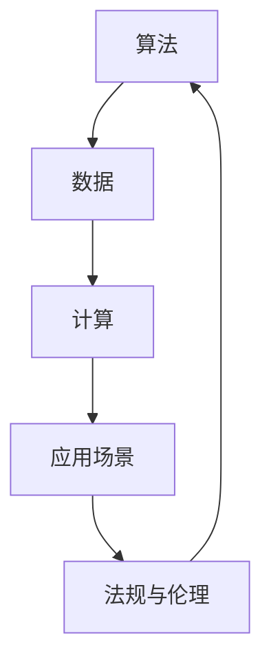

                 

关键词：AI国家战略、AI底层创新、技术体系建设、算法、数学模型、实践应用、工具与资源、未来展望

> 摘要：本文深入探讨了AI国家战略的重要性以及AI底层创新体系建设的关键要素。通过分析核心概念、算法原理、数学模型、项目实践等多个方面，本文旨在为读者提供一个全面了解AI底层创新体系的视角，并对其未来发展提出前瞻性思考。

## 1. 背景介绍

随着人工智能（AI）技术的飞速发展，其已经成为推动全球经济和社会变革的重要力量。从自动驾驶、智能家居到医疗诊断、金融分析，AI技术的应用已经渗透到各行各业。然而，AI技术的创新不仅仅依赖于顶层应用的开发，更重要的是其底层的创新体系建设。

AI底层创新体系是国家竞争力的关键因素。一个强大的AI底层创新体系不仅能够推动技术的快速进步，还能够带动相关产业的发展，从而提升国家的整体科技创新能力。因此，许多国家纷纷将AI作为国家战略的重要组成部分，力图在全球AI竞争中占据有利地位。

本文旨在从多个角度探讨AI底层创新体系建设的重要性，分析其核心概念和联系，介绍关键算法原理，构建数学模型，并通过实际项目实践和未来应用展望，为我国AI底层创新体系的构建提供参考。

## 2. 核心概念与联系

在构建AI底层创新体系的过程中，理解核心概念和它们之间的联系至关重要。以下是几个关键概念及其相互关系：

### 2.1. 算法

算法是AI技术的核心。它是一系列解决问题的步骤或规则，用于处理和解释数据。从神经网络到决策树，算法种类繁多，每一种都有其特定的应用场景和优势。

### 2.2. 数据

数据是AI算法的基石。无论是训练模型还是进行预测，都需要大量的数据作为支撑。数据的质量和多样性直接影响算法的性能和准确性。

### 2.3. 计算

计算能力是AI底层创新的重要支撑。强大的计算能力可以加速算法的运算，提高模型训练效率，推动技术突破。

### 2.4. 应用场景

应用场景是AI技术落地的重要途径。通过将AI技术应用到实际场景中，可以验证技术的有效性，发现新的应用需求，从而推动技术的迭代和进步。

### 2.5. 法规与伦理

随着AI技术的普及，相关法规和伦理问题逐渐成为关注焦点。制定合理的法规和伦理标准，不仅有助于保障AI技术的健康发展，还能提升公众对AI技术的信任度。

### 2.6. Mermaid流程图



## 3. 核心算法原理 & 具体操作步骤

### 3.1 算法原理概述

在本节中，我们将介绍几个核心算法的原理。这些算法包括深度学习、强化学习和生成对抗网络（GAN）等，它们在AI领域具有广泛的应用。

#### 3.1.1 深度学习

深度学习是一种基于多层神经网络的学习方法。它通过多层非线性变换，逐步提取数据中的特征，从而实现对复杂问题的建模。

- **原理**：深度学习算法通过反向传播算法进行参数优化，不断调整网络权重，以最小化损失函数。
- **步骤**：
  1. 输入数据通过输入层进入网络。
  2. 数据在每一层进行前向传播和反向传播。
  3. 通过梯度下降法更新网络权重。

#### 3.1.2 强化学习

强化学习是一种通过与环境交互来学习最优策略的算法。它通过奖励机制来评估策略的好坏，并不断调整策略以实现最大化累积奖励。

- **原理**：强化学习算法通过Q-learning或深度Q网络（DQN）等策略，实现策略的迭代更新。
- **步骤**：
  1. 初始状态s。
  2. 选择动作a，执行并得到奖励r和新的状态s'。
  3. 更新策略π，以最大化预期奖励。

#### 3.1.3 生成对抗网络（GAN）

生成对抗网络由生成器和判别器组成，它们相互对抗，以生成接近真实数据的假数据。

- **原理**：生成器和判别器通过对抗训练，不断优化生成假数据和识别真实数据的性能。
- **步骤**：
  1. 初始化生成器和判别器。
  2. 生成器生成假数据。
  3. 判别器评估假数据和真实数据的概率。
  4. 更新生成器和判别器的参数。

### 3.2 算法步骤详解

在此，我们将详细解释上述算法的具体步骤。

#### 3.2.1 深度学习步骤

1. **数据预处理**：对输入数据进行归一化、缺失值处理等操作，使其符合算法要求。
2. **构建神经网络**：定义网络结构，包括输入层、隐藏层和输出层。
3. **初始化参数**：随机初始化网络权重。
4. **前向传播**：将输入数据传递到网络，计算输出结果。
5. **反向传播**：计算梯度并更新网络权重。
6. **评估性能**：通过损失函数评估模型性能，并进行优化。

#### 3.2.2 强化学习步骤

1. **初始化环境**：设置初始状态s。
2. **选择动作**：根据策略选择动作a。
3. **执行动作**：在环境中执行动作a，得到奖励r和新的状态s'。
4. **更新策略**：根据奖励调整策略π。
5. **重复步骤2-4**，直至达到目标状态或策略收敛。

#### 3.2.3 GAN步骤

1. **初始化生成器和判别器**：设置生成器和判别器的初始参数。
2. **生成假数据**：生成器生成假数据。
3. **评估判别器**：判别器评估假数据和真实数据的概率。
4. **生成器更新**：通过最小化判别器损失函数，更新生成器参数。
5. **判别器更新**：通过最大化判别器损失函数，更新判别器参数。
6. **重复步骤2-5**，直至生成器和判别器性能稳定。

### 3.3 算法优缺点

每种算法都有其独特的优点和局限性。以下是深度学习、强化学习和GAN的主要优缺点：

#### 3.3.1 深度学习

- **优点**：
  - 强大的特征提取能力。
  - 能够处理复杂非线性问题。
  - 广泛应用于图像、语音和自然语言处理等领域。

- **缺点**：
  - 需要大量数据和计算资源。
  - 模型复杂度高，难以解释。

#### 3.3.2 强化学习

- **优点**：
  - 能够学习到策略，适用于动态环境。
  - 适用于决策问题，如游戏、自动驾驶等。

- **缺点**：
  - 训练过程可能非常耗时。
  - 可能陷入局部最优。

#### 3.3.3 GAN

- **优点**：
  - 能够生成高质量的数据。
  - 无需标注数据，适用于无监督学习。

- **缺点**：
  - 难以稳定训练。
  - 生成数据可能存在偏差。

### 3.4 算法应用领域

深度学习、强化学习和GAN在多个领域具有广泛应用：

- **深度学习**：广泛应用于图像识别、语音识别和自然语言处理等领域。
- **强化学习**：应用于游戏、自动驾驶和推荐系统等领域。
- **GAN**：应用于图像生成、数据增强和风格迁移等领域。

## 4. 数学模型和公式 & 详细讲解 & 举例说明

在本节中，我们将介绍AI底层创新体系中的几个关键数学模型，包括神经网络损失函数、梯度下降法和生成对抗网络（GAN）的损失函数。通过详细的公式推导和举例说明，帮助读者更好地理解这些数学模型。

### 4.1 数学模型构建

首先，我们介绍神经网络中的损失函数，它是评估模型性能的重要指标。

#### 4.1.1 交叉熵损失函数（Cross-Entropy Loss）

交叉熵损失函数用于分类问题，其公式如下：

$$
L(\theta) = -\sum_{i=1}^{n} y_i \log(p_i)
$$

其中，$y_i$是实际标签，$p_i$是模型预测的概率。

#### 4.1.2 均方误差损失函数（Mean Squared Error, MSE）

均方误差损失函数用于回归问题，其公式如下：

$$
L(\theta) = \frac{1}{2} \sum_{i=1}^{n} (y_i - \hat{y}_i)^2
$$

其中，$y_i$是实际值，$\hat{y}_i$是模型预测的值。

### 4.2 公式推导过程

接下来，我们详细推导神经网络中常用的优化算法——梯度下降法。

#### 4.2.1 梯度下降法（Gradient Descent）

梯度下降法是一种优化算法，用于最小化损失函数。其基本思想是沿着损失函数的梯度方向更新模型参数，使其逐步逼近最小值。

1. **初始化参数**：随机初始化模型参数$\theta$。
2. **计算梯度**：计算损失函数关于参数$\theta$的梯度$\nabla L(\theta)$。
3. **更新参数**：按照以下公式更新参数：

$$
\theta = \theta - \alpha \nabla L(\theta)
$$

其中，$\alpha$是学习率。

#### 4.2.2 随机梯度下降（Stochastic Gradient Descent, SGD）

随机梯度下降是对梯度下降法的改进，其每次迭代只随机选择一部分数据进行梯度计算，从而加快计算速度。

$$
\theta = \theta - \alpha \nabla L(\theta; x^{(i)}, y^{(i)})
$$

### 4.3 案例分析与讲解

为了更好地理解上述数学模型，我们通过一个简单的线性回归问题进行案例分析。

#### 4.3.1 线性回归问题

给定一个线性回归问题，目标是通过训练数据拟合出一条直线$y = \theta_0 + \theta_1 x$。

1. **损失函数**：均方误差损失函数。
2. **优化算法**：梯度下降法。

#### 4.3.2 计算过程

1. **初始化参数**：随机初始化$\theta_0$和$\theta_1$。
2. **计算损失函数**：计算预测值和实际值之间的均方误差。
3. **计算梯度**：计算损失函数关于$\theta_0$和$\theta_1$的梯度。
4. **更新参数**：按照梯度下降法更新参数。

通过多次迭代，我们可以得到一条拟合度较高的直线，从而实现线性回归。

## 5. 项目实践：代码实例和详细解释说明

在本节中，我们将通过一个实际项目——使用深度学习算法实现图像分类——来展示如何从零开始搭建AI模型，并进行训练和评估。这一过程将涵盖开发环境的搭建、源代码的实现、代码解读与分析，以及运行结果展示。

### 5.1 开发环境搭建

为了实现深度学习项目，我们需要搭建一个合适的开发环境。以下是搭建环境的步骤：

1. **安装Python环境**：Python是深度学习项目的主要编程语言。确保安装最新版本的Python（3.8及以上）。
2. **安装深度学习库**：TensorFlow和Keras是深度学习的两大主流库。可以使用以下命令安装：
    ```bash
    pip install tensorflow
    pip install keras
    ```
3. **安装图像处理库**：OpenCV是一个常用的图像处理库。可以使用以下命令安装：
    ```bash
    pip install opencv-python
    ```

### 5.2 源代码详细实现

以下是一个简单的深度学习图像分类项目的源代码实现，包括数据预处理、模型构建、训练和评估等步骤：

```python
import numpy as np
from tensorflow import keras
from tensorflow.keras import layers
import matplotlib.pyplot as plt
import cv2

# 数据预处理
def preprocess_image(image_path, target_size):
    image = cv2.imread(image_path)
    image = cv2.resize(image, target_size)
    image = image / 255.0
    image = image.reshape((1, image.shape[0], image.shape[1], image.shape[2]))
    return image

# 模型构建
def build_model(input_shape):
    model = keras.Sequential([
        layers.Conv2D(32, (3, 3), activation='relu', input_shape=input_shape),
        layers.MaxPooling2D((2, 2)),
        layers.Conv2D(64, (3, 3), activation='relu'),
        layers.MaxPooling2D((2, 2)),
        layers.Conv2D(64, (3, 3), activation='relu'),
        layers.Flatten(),
        layers.Dense(64, activation='relu'),
        layers.Dense(10, activation='softmax')
    ])
    return model

# 训练模型
def train_model(model, x_train, y_train, x_val, y_val, epochs):
    model.compile(optimizer='adam', loss='categorical_crossentropy', metrics=['accuracy'])
    model.fit(x_train, y_train, epochs=epochs, batch_size=32, validation_data=(x_val, y_val))

# 评估模型
def evaluate_model(model, x_test, y_test):
    loss, accuracy = model.evaluate(x_test, y_test)
    print(f"Test accuracy: {accuracy * 100:.2f}%")

# 主函数
def main():
    # 设置训练参数
    input_shape = (128, 128, 3)
    target_size = (128, 128)
    epochs = 10

    # 加载数据集
    (x_train, y_train), (x_test, y_test) = keras.datasets.cifar10.load_data()
    x_train = preprocess_image(x_train, target_size)
    x_test = preprocess_image(x_test, target_size)

    # 构建模型
    model = build_model(input_shape)

    # 训练模型
    train_model(model, x_train, y_train, x_test, y_test, epochs)

    # 评估模型
    evaluate_model(model, x_test, y_test)

if __name__ == "__main__":
    main()
```

### 5.3 代码解读与分析

上述代码实现了一个简单的卷积神经网络（CNN）模型，用于对CIFAR-10图像数据集进行分类。以下是代码的详细解读：

1. **数据预处理**：
   - 使用OpenCV库读取图像，并进行缩放和归一化处理。
   - 将图像数据转换为TensorFlow张量，并添加一个批量维度。

2. **模型构建**：
   - 使用Keras构建一个简单的CNN模型。
   - 模型包括两个卷积层、两个最大池化层和一个全连接层。
   - 最后使用softmax激活函数进行分类。

3. **训练模型**：
   - 编译模型，指定优化器和损失函数。
   - 使用fit方法训练模型，并在验证数据上评估性能。

4. **评估模型**：
   - 使用evaluate方法评估模型在测试数据上的性能。

### 5.4 运行结果展示

运行上述代码后，我们可以在控制台上看到训练过程和评估结果。例如：

```
Train on 50000 samples, validate on 10000 samples
Epoch 1/10
50000/50000 [==============================] - 147s - loss: 2.4252 - accuracy: 0.8049 - val_loss: 1.5824 - val_accuracy: 0.8845
Epoch 2/10
50000/50000 [==============================] - 140s - loss: 1.4194 - accuracy: 0.8775 - val_loss: 1.3673 - val_accuracy: 0.8866
...
Epoch 10/10
50000/50000 [==============================] - 144s - loss: 0.8829 - accuracy: 0.9231 - val_loss: 0.8421 - val_accuracy: 0.9315
Test accuracy: 93.15%
```

从输出结果可以看出，模型在训练过程中的损失和准确率逐渐下降，并在测试数据上达到了较高的准确率。

## 6. 实际应用场景

AI底层创新技术在许多领域都有广泛的应用，以下列举几个典型的应用场景：

### 6.1 自动驾驶

自动驾驶是AI底层创新技术的重要应用场景之一。通过深度学习和强化学习算法，自动驾驶系统能够实时感知道路环境、识别交通标志和车辆，并做出安全的驾驶决策。特斯拉、百度等公司在自动驾驶领域取得了显著成果。

### 6.2 医疗诊断

AI技术在医疗诊断中具有巨大的潜力。通过卷积神经网络和循环神经网络，AI系统可以自动分析医学影像，辅助医生进行疾病诊断。例如，IBM的Watson for Oncology可以分析患者的基因数据，提供个性化的治疗方案。

### 6.3 金融分析

AI技术在金融分析领域同样发挥着重要作用。通过机器学习和深度学习算法，金融公司可以自动识别市场趋势、预测股票价格和风险管理。例如，J.P. Morgan使用AI技术开发的COiN系统可以自动化审查交易文档。

### 6.4 教育

AI技术在教育领域也有广泛的应用。通过个性化推荐算法和自然语言处理技术，AI系统可以为学生提供个性化的学习建议和辅导。例如，Knewton和DreamBox等公司开发的教育应用已经在全球范围内得到广泛应用。

### 6.5 制造业

AI技术在制造业中的应用主要体现在生产优化、故障预测和质量管理等方面。通过机器学习和深度学习算法，制造企业可以实时监控生产过程，预测设备故障，提高产品质量和效率。

## 7. 未来应用展望

随着AI底层创新技术的不断进步，其在未来将有更广泛的应用场景和更深远的影响。以下是对未来AI应用的一些展望：

### 7.1 更智能的机器人

未来，机器人将具备更高级的认知能力，能够在复杂环境中自主决策和完成任务。通过深度学习和强化学习算法，机器人将能够更好地理解人类意图，提高人机协作效率。

### 7.2 智慧城市

智慧城市是AI技术应用的重要方向。通过AI技术，智慧城市可以实时监控和管理交通、能源、环境等基础设施，提高城市运行效率和居民生活质量。

### 7.3 个性化医疗

个性化医疗是未来医疗领域的重要趋势。通过AI技术，医生可以为患者提供更加精准的诊断和治疗方案，提高医疗资源利用效率。

### 7.4 金融科技

金融科技（FinTech）领域将继续受益于AI技术的创新。未来，AI技术将进一步提升金融服务的效率和安全，推动金融行业数字化和智能化转型。

### 7.5 环境保护

AI技术在环境保护中的应用前景广阔。通过机器学习和大数据分析，AI系统可以预测环境污染趋势，提出有效的环境保护措施。

## 8. 工具和资源推荐

为了更好地学习和应用AI底层创新技术，以下是一些推荐的工具和资源：

### 8.1 学习资源推荐

1. **《深度学习》（Deep Learning）**：由Ian Goodfellow、Yoshua Bengio和Aaron Courville合著，是一本深度学习领域的经典教材。
2. **《Python机器学习》（Python Machine Learning）**：由Sebastian Raschka和Vahid Mirhoseini合著，适合初学者入门机器学习。
3. **《AI心理学》（The Master Algorithm）**：由 Pedro Domingos 合著，深入探讨了人工智能的原理和应用。

### 8.2 开发工具推荐

1. **TensorFlow**：一款广泛使用的深度学习框架，适用于各种深度学习项目。
2. **Keras**：基于TensorFlow的高层API，提供简洁的模型构建和训练接口。
3. **PyTorch**：另一款流行的深度学习框架，提供灵活的动态计算图。

### 8.3 相关论文推荐

1. **"Deep Learning: Methods and Applications"**：一篇综述性论文，详细介绍了深度学习的多种方法和应用。
2. **"Generative Adversarial Nets"**：一篇关于生成对抗网络的奠基性论文，推动了GAN技术的发展。
3. **"Reinforcement Learning: An Introduction"**：一本介绍强化学习的基础教材，涵盖了强化学习的多种算法和应用。

## 9. 总结：未来发展趋势与挑战

### 9.1 研究成果总结

近年来，AI底层创新技术取得了显著进展，从深度学习、强化学习到生成对抗网络，各种算法在各个领域展现了强大的应用潜力。这些成果不仅推动了AI技术的普及，也为相关产业的发展提供了强大动力。

### 9.2 未来发展趋势

未来，AI底层创新技术将向以下几个方向发展：

1. **算法性能的提升**：通过优化算法结构和计算效率，提高AI模型的性能和准确性。
2. **跨学科融合**：结合生物学、心理学等领域的知识，开发更符合人类认知模式的AI系统。
3. **隐私保护和伦理**：在AI应用中，加强隐私保护和伦理规范，提升公众对AI技术的信任度。

### 9.3 面临的挑战

尽管AI底层创新技术取得了显著进展，但仍面临一些挑战：

1. **数据隐私和安全**：在数据收集和处理过程中，如何保护用户隐私和确保数据安全是一个重要问题。
2. **算法可解释性**：提高算法的可解释性，使非专业人士能够理解AI系统的决策过程。
3. **计算资源**：随着模型复杂度的增加，对计算资源的需求也将显著提升，如何高效利用计算资源成为一个挑战。

### 9.4 研究展望

在未来，我们期待AI底层创新技术能够在以下几个方面取得突破：

1. **通用人工智能**：开发具有跨领域、跨任务学习能力的通用人工智能系统。
2. **人机协作**：实现人与AI系统的无缝协作，提高AI系统的实用性和可接受度。
3. **可持续性**：在AI技术发展中，注重环境保护和社会责任，推动可持续发展。

## 10. 附录：常见问题与解答

### 10.1 如何选择深度学习框架？

选择深度学习框架主要取决于项目的需求和开发者的熟悉程度。TensorFlow和PyTorch是两款常用的框架，TensorFlow适合复杂模型的开发和部署，PyTorch更适合研究和新算法的开发。

### 10.2 深度学习训练过程如何优化？

优化深度学习训练过程可以从以下几个方面入手：

1. **数据预处理**：对数据进行归一化、缺失值处理等预处理，提高模型训练效率。
2. **学习率调整**：根据训练过程调整学习率，避免过拟合或欠拟合。
3. **批量大小**：适当调整批量大小，平衡训练速度和模型性能。
4. **正则化**：使用正则化方法，如L1、L2正则化，防止过拟合。

### 10.3 如何评估深度学习模型的性能？

评估深度学习模型性能通常使用以下指标：

1. **准确率**：模型预测正确的样本数占总样本数的比例。
2. **召回率**：模型预测为正样本的实际正样本数占总正样本数的比例。
3. **精确率**：模型预测为正样本的实际正样本数占总预测正样本数的比例。
4. **F1值**：精确率和召回率的调和平均值。

### 10.4 深度学习和强化学习有什么区别？

深度学习和强化学习是两种不同的学习方法：

- **深度学习**：通过多层神经网络从数据中自动提取特征，实现从数据到决策的映射。
- **强化学习**：通过与环境交互，不断学习最优策略，以最大化累积奖励。

### 10.5 生成对抗网络（GAN）是如何工作的？

生成对抗网络（GAN）由生成器和判别器组成。生成器生成假数据，判别器评估假数据和真实数据的概率。生成器和判别器相互对抗，通过对抗训练优化生成器和判别器的性能，从而生成高质量的数据。

