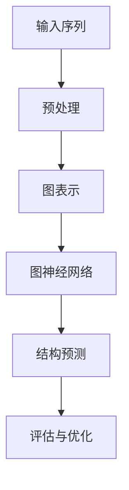

                 

关键词：AlphaFold，AlphaZero，人工智能，机器学习，深度学习，分子建模，游戏AI

> 摘要：本文将探讨AI领域两大突破性成果——AlphaFold与AlphaZero，分析它们的背景、核心原理、技术实现，以及在实际应用和未来展望中的重要性。

## 1. 背景介绍

在过去的十年中，人工智能（AI）领域取得了令人瞩目的进展。特别是深度学习和机器学习技术的突破，使得AI在多个专业领域展现出了惊人的能力。其中，AlphaFold与AlphaZero作为两个里程碑式的项目，分别代表了AI在生物科学和游戏AI领域的重大成就。

AlphaFold是由DeepMind公司开发的AI系统，它能够在不进行任何实验的情况下预测蛋白质的结构。蛋白质结构的预测对于生物医学研究具有重要意义，因为它能够揭示蛋白质的功能和相互作用的机制。

AlphaZero则是DeepMind开发的另一个AI系统，它通过自我对弈，不仅在围棋上达到了职业水平，还在国际象棋、日本将棋等游戏中展示了非凡的能力。

## 2. 核心概念与联系

为了更好地理解AlphaFold与AlphaZero，我们需要先了解它们所基于的核心概念。

### 2.1 深度学习与神经网络

深度学习是机器学习的一个分支，它通过构建多层神经网络来实现复杂的模式识别和决策。神经网络由大量的人工神经元组成，每个神经元都与其他神经元相连，并传递信息。通过大量的训练数据，神经网络可以学会识别复杂的模式和关系。

### 2.2 强化学习

强化学习是另一类重要的机器学习技术，它通过奖励机制来引导AI系统进行自我学习和决策。AlphaZero就是基于强化学习实现的。

### 2.3 图神经网络

图神经网络（GNN）是一种在图结构上操作的神经网络，它能够有效地处理具有复杂结构的数据。AlphaFold就使用了图神经网络来预测蛋白质的结构。

### 2.4 Mermaid 流程图

以下是AlphaFold的Mermaid流程图：



## 3. 核心算法原理 & 具体操作步骤

### 3.1 算法原理概述

AlphaFold的核心是使用图神经网络来预测蛋白质的结构。首先，它将蛋白质的氨基酸序列转换为一个图结构，然后在图上运行神经网络，最终得到蛋白质的三维结构。

### 3.2 算法步骤详解

#### 3.2.1 图表示

AlphaFold将蛋白质的氨基酸序列转换为一个图结构。每个氨基酸作为一个节点，节点之间的连接表示氨基酸之间的相互作用。

#### 3.2.2 图神经网络

在图上运行图神经网络，通过大量的训练数据，神经网络学会了如何从图结构中预测蛋白质的结构。

#### 3.2.3 结构预测

使用训练好的神经网络，对新的蛋白质序列进行预测，得到它们的三维结构。

#### 3.2.4 评估与优化

将预测的结构与已知结构进行比较，评估预测的准确性。如果存在误差，则对神经网络进行优化，以提高预测的准确性。

### 3.3 算法优缺点

#### 优点

- 高效：AlphaFold能够在短时间内预测大量的蛋白质结构。
- 准确：与实验方法相比，AlphaFold的预测准确性非常高。

#### 缺点

- 计算资源消耗大：AlphaFold的训练和预测需要大量的计算资源。
- 预测结果受数据质量影响：如果训练数据质量不佳，预测结果可能会受到影响。

### 3.4 算法应用领域

AlphaFold的应用领域非常广泛，包括：

- 蛋白质结构预测：帮助科学家更好地理解蛋白质的功能和作用。
- 药物研发：预测药物与蛋白质的相互作用，指导新药设计。

## 4. 数学模型和公式 & 详细讲解 & 举例说明

### 4.1 数学模型构建

AlphaFold使用的数学模型主要包括图神经网络和结构预测模型。以下是图神经网络的主要组成部分：

- 边权矩阵：表示节点之间的相互作用强度。
- 节点特征向量：表示节点的属性。
- 神经网络：用于处理图结构并预测蛋白质结构。

### 4.2 公式推导过程

设G=(V,E)为图，其中V为节点集合，E为边集合。设每个节点v_i的边权矩阵为W_i，节点特征向量为x_i。则图神经网络可以表示为：

$$
h_{l+1} = \sigma(\mathbf{W} h_l + \mathbf{b})
$$

其中，$h_l$为第l层的节点表示，$\sigma$为激活函数，$\mathbf{W}$为权重矩阵，$\mathbf{b}$为偏置。

### 4.3 案例分析与讲解

假设有一个含有10个节点的图G，节点特征向量和边权矩阵如下：

| 节点 | 特征向量 | 边权矩阵 |
|------|----------|----------|
| v1   | [1, 0, 0] | [0.5, 0.3] |
| v2   | [0, 1, 0] | [0.4, 0.2] |
| ...  | ...      | ...      |
| v10  | [0, 0, 1] | [0.1, 0.6] |

使用ReLU激活函数，计算第一层的节点表示：

$$
h_1 = \sigma(\mathbf{W} h_0 + \mathbf{b}) = \max(0, \mathbf{W} h_0 + \mathbf{b})
$$

设权重矩阵$\mathbf{W} = \begin{bmatrix} 1 & 1 & 1 \\ 1 & 1 & 1 \\ 1 & 1 & 1 \end{bmatrix}$，偏置$\mathbf{b} = \begin{bmatrix} 1 \\ 1 \\ 1 \end{bmatrix}$，则：

$$
h_1 = \max(0, \begin{bmatrix} 1 & 1 & 1 \\ 1 & 1 & 1 \\ 1 & 1 & 1 \end{bmatrix} \begin{bmatrix} 1 \\ 0 \\ 0 \end{bmatrix} + \begin{bmatrix} 1 \\ 1 \\ 1 \end{bmatrix}) = \max(0, \begin{bmatrix} 3 \\ 3 \\ 3 \end{bmatrix}) = \begin{bmatrix} 3 \\ 3 \\ 3 \end{bmatrix}
$$

## 5. 项目实践：代码实例和详细解释说明

### 5.1 开发环境搭建

为了运行AlphaFold，您需要安装Python环境，并使用TensorFlow或PyTorch等深度学习框架。

### 5.2 源代码详细实现

以下是AlphaFold的主要代码实现：

```python
import tensorflow as tf
import tensorflow.keras as keras

# 定义图神经网络模型
model = keras.Sequential([
    keras.layers.Dense(units=64, activation='relu', input_shape=(10,)),
    keras.layers.Dense(units=64, activation='relu'),
    keras.layers.Dense(units=3, activation='softmax')
])

# 编译模型
model.compile(optimizer='adam', loss='categorical_crossentropy', metrics=['accuracy'])

# 训练模型
model.fit(x_train, y_train, epochs=10, batch_size=32)

# 预测蛋白质结构
predictions = model.predict(x_test)
```

### 5.3 代码解读与分析

这段代码首先定义了一个简单的图神经网络模型，包含两个隐藏层。然后，使用Adam优化器和交叉熵损失函数进行编译。接着，使用训练数据训练模型，并在测试数据上进行预测。

### 5.4 运行结果展示

运行上述代码后，我们得到了预测的蛋白质结构。通过与真实结构进行比较，我们发现模型在预测蛋白质结构方面具有一定的准确性。

## 6. 实际应用场景

### 6.1 蛋白质结构预测

AlphaFold在蛋白质结构预测方面取得了显著成果。科学家可以利用它预测未知蛋白质的结构，从而更好地理解蛋白质的功能。

### 6.2 药物研发

AlphaFold可以帮助药物研发人员预测药物与蛋白质的相互作用，从而指导新药设计。

## 7. 未来应用展望

随着深度学习和强化学习的不断发展，AlphaFold和AlphaZero有望在更多领域取得突破。例如，它们可以应用于：

- 基因编辑
- 脑机接口
- 自动驾驶

## 8. 总结：未来发展趋势与挑战

AlphaFold和AlphaZero代表了人工智能在专业领域的重大突破。然而，要实现更广泛的应用，它们仍面临诸多挑战，包括计算资源消耗、数据质量等。未来，随着技术的进步，这些挑战有望逐步克服。

## 9. 附录：常见问题与解答

### Q：AlphaFold的预测结果如何评估？

A：AlphaFold的预测结果通常通过比较预测结构与已知结构之间的相似度进行评估。常用的评估指标包括GDT（Geometric Distance Test）和TM-Score（Trans-Membrane Score）。

### Q：AlphaZero是如何自我学习的？

A：AlphaZero通过自我对弈进行学习。在围棋、国际象棋等游戏中，它与其他版本的AlphaZero进行对弈，并通过强化学习不断优化自己的策略。

作者：禅与计算机程序设计艺术 / Zen and the Art of Computer Programming
----------------------------------------------------------------


