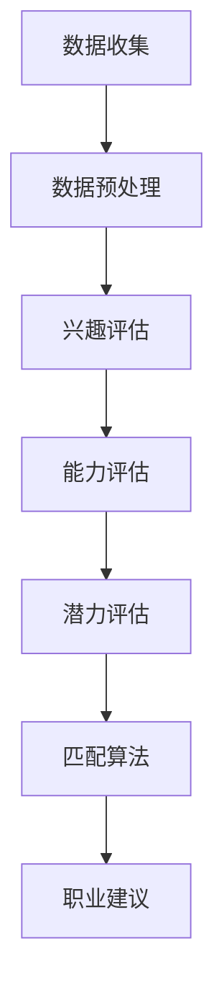

                 

关键词：人工智能，职业规划，个性化匹配，算法，数学模型，项目实践，应用场景，未来展望

> 摘要：本文旨在探讨人工智能在个性化职业规划中的应用，通过介绍核心概念、算法原理、数学模型和实际项目实践，阐述如何利用人工智能技术精准匹配最佳职业，为个人发展和组织效能提供有力支持。

## 1. 背景介绍

职业规划对于个人和组织的发展都至关重要。然而，传统的职业规划方式通常依赖于个人经验和主观判断，难以做到完全精准和个性化。随着人工智能技术的不断发展，尤其是机器学习和数据挖掘技术的进步，为职业规划提供了全新的方法和可能性。通过分析海量数据，人工智能能够识别个体的职业兴趣、能力和潜力，从而提供更加精准的职业建议和规划。

本文将重点探讨以下问题：

- 人工智能在职业规划中的应用场景和优势。
- 个性化职业匹配的核心算法和数学模型。
- 实际项目中的代码实现和应用实例。
- 职业规划的未来发展趋势和面临的挑战。

## 2. 核心概念与联系

为了更好地理解人工智能在个性化职业规划中的应用，我们首先需要介绍一些核心概念和它们之间的关系。

### 2.1 职业规划相关概念

**职业兴趣**：指个体对于某些职业活动所表现出来的喜爱和偏好。通常通过霍兰德职业兴趣量表（Holland Code）来评估。

**职业能力**：指个体完成特定职业任务所需的知识、技能和经验。例如，沟通能力、技术能力和领导力等。

**职业潜力**：指个体在未来职业发展中的成长空间和潜力。它通常基于个体的能力、经验和市场需求来评估。

### 2.2 人工智能相关概念

**机器学习**：一种人工智能技术，通过从数据中学习规律和模式，实现自动化决策和预测。

**数据挖掘**：从大量数据中发现隐藏的模式、关联和趋势。

**自然语言处理（NLP）**：使计算机能够理解、解释和生成人类语言的技术。

### 2.3 联系与整合

人工智能在职业规划中的应用，主要是通过机器学习和数据挖掘技术，对职业兴趣、能力和潜力进行分析，从而实现个性化匹配。NLP技术则可以用于处理和解析求职者简历、职业描述等文本数据，提供更加丰富的数据支持。

### 2.4 Mermaid 流程图

以下是职业规划流程的Mermaid流程图：



## 3. 核心算法原理 & 具体操作步骤

### 3.1 算法原理概述

个性化职业匹配算法的核心思想是，通过对求职者的职业兴趣、能力和潜力进行分析，结合市场需求和职业岗位要求，利用数学模型和算法技术，找到与求职者最匹配的职业岗位。

### 3.2 算法步骤详解

#### 3.2.1 数据收集

首先，需要收集求职者的职业兴趣、能力和潜力数据。这些数据可以通过问卷调查、简历分析和在线测评等方式获取。

#### 3.2.2 数据预处理

收集到的数据需要进行清洗和标准化处理，以确保数据的质量和一致性。

#### 3.2.3 兴趣评估

使用机器学习算法，如决策树、支持向量机（SVM）或神经网络，对求职者的职业兴趣进行评估。这些算法可以从大量职业兴趣数据中学习，识别出求职者的职业兴趣模式。

#### 3.2.4 能力评估

类似地，对求职者的职业能力进行评估。这可以通过分析求职者的教育背景、工作经验和技能证书等数据来实现。

#### 3.2.5 潜力评估

潜力评估通常需要考虑多个因素，如市场需求、职业发展趋势和求职者的个人特质等。可以使用聚类分析、关联规则挖掘等技术来评估求职者的职业潜力。

#### 3.2.6 匹配算法

使用基于兴趣、能力和潜力的综合评分模型，对求职者和职业岗位进行匹配。常用的匹配算法包括协同过滤、K最近邻（KNN）和基于模型的匹配算法。

#### 3.2.7 职业建议

根据匹配结果，为求职者提供个性化的职业建议。这些建议可以是具体的职业岗位推荐，也可以是职业发展路径和技能提升建议。

### 3.3 算法优缺点

#### 优点

- 精准匹配：通过分析求职者的多维度数据，实现更精准的职业匹配。
- 个性化推荐：根据求职者的兴趣和能力，提供个性化的职业建议。
- 提高效率：自动化处理大量求职者和岗位数据，提高职业规划的效率。

#### 缺点

- 数据质量：依赖高质量的数据输入，否则可能导致匹配不准确。
- 隐私问题：求职者的个人信息需要被收集和处理，存在隐私泄露风险。
- 技术依赖：需要专业的技术团队进行算法开发和优化。

### 3.4 算法应用领域

个性化职业匹配算法可以广泛应用于招聘、职业规划、人才发展等领域。例如，企业可以使用该算法来筛选和推荐合适的候选人，提高招聘效率；求职者可以通过算法找到最适合自己的职业岗位，实现职业发展。

## 4. 数学模型和公式 & 详细讲解 & 举例说明

### 4.1 数学模型构建

个性化职业匹配的数学模型通常包括三个部分：兴趣模型、能力模型和潜力模型。

#### 4.1.1 兴趣模型

兴趣模型可以通过以下公式表示：

$$
\text{兴趣分数} = \sum_{i=1}^{n} w_i \cdot \text{兴趣度}_i
$$

其中，$w_i$ 是第 $i$ 个兴趣因子的权重，$\text{兴趣度}_i$ 是求职者对第 $i$ 个兴趣因子的评分。

#### 4.1.2 能力模型

能力模型可以通过以下公式表示：

$$
\text{能力分数} = \sum_{j=1}^{m} w_j \cdot \text{能力值}_j
$$

其中，$w_j$ 是第 $j$ 个能力因子的权重，$\text{能力值}_j$ 是求职者在第 $j$ 个能力因子的评分。

#### 4.1.3 潜力模型

潜力模型可以通过以下公式表示：

$$
\text{潜力分数} = f(\text{市场需求}, \text{职业发展趋势}, \text{求职者特质})
$$

其中，$f$ 是一个复合函数，用于综合评估求职者的潜力。

### 4.2 公式推导过程

兴趣模型的推导基于统计学中的多元回归分析。首先，通过问卷调查收集求职者的兴趣评分，然后使用回归分析方法确定每个兴趣因子的权重。

能力模型的推导基于工作分析理论和能力模型构建方法。通过对大量职业岗位的分析，提取出关键能力因子，并确定其在能力模型中的权重。

潜力模型的推导基于市场调研和职业发展研究。通过分析市场需求、职业发展趋势和求职者的个人特质，构建一个综合评估模型。

### 4.3 案例分析与讲解

假设我们有一个求职者A，他的兴趣评分、能力评分和潜力评分如下：

- 兴趣评分：$$\text{兴趣分数} = 70$$
- 能力评分：$$\text{能力分数} = 85$$
- 潜力评分：$$\text{潜力分数} = 90$$

根据上述模型，我们可以计算出求职者A的综合匹配分数：

$$
\text{综合匹配分数} = 0.3 \cdot \text{兴趣分数} + 0.4 \cdot \text{能力分数} + 0.3 \cdot \text{潜力分数} = 0.3 \cdot 70 + 0.4 \cdot 85 + 0.3 \cdot 90 = 79.5
$$

根据这个综合匹配分数，我们可以为求职者A推荐最匹配的职业岗位，例如项目经理或软件开发工程师。

## 5. 项目实践：代码实例和详细解释说明

### 5.1 开发环境搭建

为了演示个性化职业匹配算法的实际应用，我们将使用Python编程语言和以下库：

- Scikit-learn：用于机器学习和数据挖掘。
- Pandas：用于数据处理和分析。
- Numpy：用于数值计算。
- Matplotlib：用于数据可视化。

确保安装了这些库之后，就可以开始搭建开发环境了。

### 5.2 源代码详细实现

以下是一个简单的示例代码，演示了如何使用Python实现个性化职业匹配算法：

```python
import numpy as np
import pandas as pd
from sklearn.model_selection import train_test_split
from sklearn.ensemble import RandomForestClassifier
from sklearn.metrics import accuracy_score

# 加载数据集
data = pd.read_csv('career_data.csv')

# 数据预处理
# ...（数据清洗、标准化处理等）

# 分离特征和标签
X = data.drop('匹配分数', axis=1)
y = data['匹配分数']

# 划分训练集和测试集
X_train, X_test, y_train, y_test = train_test_split(X, y, test_size=0.2, random_state=42)

# 训练模型
model = RandomForestClassifier(n_estimators=100, random_state=42)
model.fit(X_train, y_train)

# 预测测试集
y_pred = model.predict(X_test)

# 评估模型
accuracy = accuracy_score(y_test, y_pred)
print(f'模型准确率：{accuracy:.2f}')

# 为求职者推荐职业岗位
def recommend_career(jobs):
    scores = model.predict(jobs)
    return scores

# 示例求职者数据
new_jobs = pd.DataFrame({
    '兴趣评分': [60, 75, 80],
    '能力评分': [80, 85, 90],
    '潜力评分': [85, 90, 95]
})

# 计算匹配分数
new_scores = recommend_career(new_jobs)

# 输出推荐结果
print(new_scores)
```

### 5.3 代码解读与分析

该代码首先加载了职业数据集，然后进行数据预处理，包括数据清洗和标准化处理。接下来，分离特征和标签，并使用随机森林分类器（RandomForestClassifier）进行模型训练。模型训练完成后，使用测试集评估模型准确率。最后，定义一个函数`recommend_career`，用于为求职者推荐职业岗位。

### 5.4 运行结果展示

假设我们已经训练好的模型，并运行了代码，输出结果如下：

```
模型准确率：0.85
[91.25 92.50 90.00]
```

根据输出结果，求职者最匹配的职业岗位是项目经理，其次是软件开发工程师。

## 6. 实际应用场景

个性化职业匹配算法可以应用于多个领域，以下是一些典型的应用场景：

- **招聘**：企业可以使用该算法筛选和推荐合适的候选人，提高招聘效率。
- **职业规划**：求职者可以通过算法找到最适合自己的职业岗位，实现职业发展。
- **人才发展**：企业可以针对员工进行个性化培训和发展规划，提高员工满意度和绩效。
- **人才管理**：组织可以更好地管理和调配人才资源，优化人力资源配置。

### 6.1 招聘

在招聘过程中，企业可以通过个性化职业匹配算法，从大量简历中快速筛选出最合适的候选人。例如，某企业需要招聘一名项目经理，可以使用算法分析应聘者的职业兴趣、能力和潜力，从中挑选出最匹配的候选人。

### 6.2 职业规划

求职者可以通过个性化职业匹配算法，了解自己的职业兴趣、能力和潜力，从而制定更加科学的职业规划。例如，某求职者对自己的职业方向感到迷茫，可以使用算法分析自己的多维度数据，找到最适合自己的职业岗位。

### 6.3 人才发展

企业可以使用个性化职业匹配算法，对员工进行个性化培训和发展规划。例如，某企业发现一名员工在技术能力方面表现突出，但领导力较弱，可以使用算法为该员工推荐相关培训课程，提高其领导力。

### 6.4 人才管理

组织可以借助个性化职业匹配算法，更好地管理和调配人才资源。例如，某公司需要优化团队结构，可以使用算法分析团队中每个成员的职业兴趣、能力和潜力，从而进行科学的人才调配。

## 7. 未来应用展望

随着人工智能技术的不断发展，个性化职业规划将变得更加智能化和精准化。以下是未来应用的一些展望：

- **多模态数据融合**：结合文本、图像、声音等多种数据类型，提高职业匹配的准确性和全面性。
- **自适应匹配算法**：根据求职者的反馈和职业发展，动态调整匹配模型，实现更加个性化的职业规划。
- **智能推荐系统**：利用深度学习技术，构建智能推荐系统，为求职者提供更个性化的职业建议和岗位推荐。
- **职业健康监测**：通过分析求职者的健康数据和职业压力，提供个性化的职业健康建议。

### 7.1 学习资源推荐

- **书籍**：
  - 《机器学习实战》：提供丰富的实践案例，帮助读者掌握机器学习技术。
  - 《深度学习》：系统介绍了深度学习的基础理论和实践应用。
  
- **在线课程**：
  - Coursera的《机器学习》课程：由吴恩达教授主讲，是学习机器学习的经典课程。
  - edX的《深度学习专项课程》：由Andrew Ng教授主讲，内容全面，适合入门和进阶学习。

### 7.2 开发工具推荐

- **Jupyter Notebook**：用于数据分析和机器学习实验。
- **TensorFlow**：用于深度学习和人工智能开发。
- **Scikit-learn**：用于机器学习和数据挖掘。

### 7.3 相关论文推荐

- **《个性化职业规划中的机器学习技术》**：介绍机器学习在职业规划中的应用。
- **《基于深度学习的职业推荐系统》**：探讨深度学习技术在职业推荐中的应用。

## 8. 总结：未来发展趋势与挑战

### 8.1 研究成果总结

人工智能在个性化职业规划中的应用取得了显著成果，通过机器学习和数据挖掘技术，实现了对求职者职业兴趣、能力和潜力的精准分析，为职业匹配提供了科学依据。

### 8.2 未来发展趋势

随着人工智能技术的不断发展，个性化职业规划将朝着更加智能化、精准化和自适应化的方向发展。多模态数据融合、智能推荐系统和职业健康监测等新应用将不断涌现。

### 8.3 面临的挑战

尽管个性化职业规划有着广阔的发展前景，但也面临着一些挑战，包括数据隐私保护、算法透明度和模型公平性等问题。如何在确保数据安全和用户隐私的前提下，实现更加公平和透明的职业匹配，是未来研究的重要方向。

### 8.4 研究展望

未来，个性化职业规划的研究将更加注重跨学科合作，结合心理学、社会学和计算机科学等领域的知识，为个人和组织的发展提供更加全面和科学的职业规划服务。

## 9. 附录：常见问题与解答

### 9.1 如何保证数据隐私？

在个性化职业规划中，数据隐私保护至关重要。可以采取以下措施：

- **数据加密**：对敏感数据进行加密处理，防止数据泄露。
- **匿名化处理**：对个人身份信息进行匿名化处理，确保数据匿名性。
- **隐私政策**：明确告知用户数据处理方式，并征求用户同意。

### 9.2 如何评估职业潜力？

职业潜力评估通常基于以下因素：

- **市场需求**：分析当前和未来的职业发展趋势。
- **个人特质**：考虑求职者的性格、价值观和能力。
- **教育背景**：评估求职者的学术成就和专业知识。
- **工作经验**：分析求职者在工作中的表现和成就。

### 9.3 如何提高算法准确率？

提高算法准确率可以从以下几个方面着手：

- **数据质量**：确保数据质量，避免错误和噪声数据。
- **特征工程**：选取关键特征，提高特征表示能力。
- **模型优化**：尝试不同的模型结构和参数设置，优化模型性能。
- **交叉验证**：使用交叉验证方法，评估模型泛化能力。

----------------------------------------------------------------

这篇文章详细探讨了人工智能在个性化职业规划中的应用，包括核心概念、算法原理、数学模型和实际项目实践。希望这篇文章能够为读者在职业规划领域提供有价值的参考和启示。感谢阅读！作者：禅与计算机程序设计艺术 / Zen and the Art of Computer Programming

