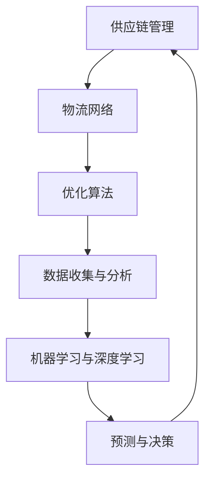

                 

关键词：人工智能，供应链管理，物流优化，机器学习，深度学习，算法，预测分析

> 摘要：本文将探讨人工智能在供应链管理中的应用，特别是在物流优化方面的作用。通过介绍核心概念、算法原理、数学模型、案例实践和未来展望，文章旨在展示AI技术在提升物流效率、降低成本、增强供应链弹性的潜力。

## 1. 背景介绍

供应链管理是企业运营的核心之一，它涉及从原材料采购到产品交付给最终客户的整个过程。物流作为供应链的重要组成部分，对企业的运营效率和竞争力有着至关重要的影响。然而，传统的物流管理方法往往依赖于手工操作和经验判断，难以应对复杂、动态的物流环境。

随着人工智能技术的飞速发展，特别是在机器学习和深度学习领域的突破，AI开始在供应链管理中崭露头角。物流优化作为供应链管理的一个重要环节，旨在通过优化运输路线、库存管理和配送策略等，实现成本最低化、效率最高化。人工智能技术的引入，为物流优化提供了新的思路和方法。

本文将详细探讨人工智能在供应链管理中的应用，重点关注物流优化这一领域。通过介绍核心概念、算法原理、数学模型和实际案例，文章旨在为读者提供对AI在物流优化中应用的全景了解。

### 1.1 人工智能在供应链管理中的重要性

人工智能在供应链管理中的应用具有重要意义。首先，AI技术能够通过大数据分析和机器学习模型，对供应链中的各种数据进行实时监控和分析，从而发现潜在的问题和优化机会。例如，通过分析历史物流数据，AI可以预测未来需求的波动，帮助企业提前做好库存调整和运输计划。

其次，人工智能可以提高供应链的透明度和可追溯性。在物流过程中，AI技术可以实时监控货物的运输状态，确保货物能够准时、安全地到达目的地。此外，AI技术还可以对供应链中的各个环节进行风险评估，识别潜在的安全隐患，从而提高供应链的整体安全性。

最后，人工智能可以大幅提升供应链的灵活性和适应性。通过预测分析、智能调度和优化算法，AI技术可以帮助企业快速响应市场变化，提高供应链的应变能力。这对于企业在竞争激烈的市场中保持竞争力至关重要。

### 1.2 物流优化的重要性

物流优化是供应链管理中的一个关键环节，其目标是通过优化运输、仓储和配送等过程，实现成本最低化、效率最高化。物流优化不仅关系到企业的运营成本，还直接影响着客户满意度和服务质量。

首先，物流优化有助于降低成本。通过合理的运输路线规划和库存管理，企业可以减少运输距离、降低运输费用，同时减少库存积压和库存成本。

其次，物流优化可以提高运营效率。智能调度和路径优化算法可以帮助企业优化运输和配送过程，减少运输时间，提高配送准时率。

最后，物流优化有助于提升客户满意度。通过精准的库存管理和高效的配送服务，企业可以更好地满足客户的需求，提高客户满意度，增强品牌忠诚度。

综上所述，人工智能在供应链管理中的应用，尤其是物流优化，对于提升企业运营效率、降低成本、提高客户满意度具有重要意义。接下来，我们将深入探讨人工智能在物流优化中的核心概念、算法原理和实际应用。

## 2. 核心概念与联系

在深入探讨人工智能在物流优化中的应用之前，我们需要理解几个核心概念，包括供应链管理、物流网络、优化算法等。为了更直观地展示这些概念之间的联系，我们使用Mermaid流程图进行描述。



### 2.1 供应链管理

供应链管理（Supply Chain Management，简称SCM）是指对产品从原材料采购到最终产品交付给消费者的全过程进行有效管理。它包括采购、生产、仓储、配送等多个环节。供应链管理的目标是优化资源分配，提高生产效率，降低成本，增强市场竞争力。

### 2.2 物流网络

物流网络（Logistics Network）是指供应链中负责货物运输和配送的路径和节点。物流网络的设计直接影响运输效率和成本。物流网络包括运输路线规划、仓储选址、配送中心布局等。

### 2.3 优化算法

优化算法（Optimization Algorithm）是用于解决特定优化问题的数学方法。在物流优化中，优化算法用于求解最优运输路线、最优库存水平等。常见的优化算法包括线性规划、动态规划、遗传算法、神经网络等。

### 2.4 数据收集与分析

数据收集与分析是供应链管理和物流优化的重要基础。通过收集供应链中的各种数据，如运输数据、库存数据、需求数据等，可以进行分析和挖掘，发现潜在的问题和优化机会。

### 2.5 机器学习与深度学习

机器学习（Machine Learning）和深度学习（Deep Learning）是人工智能的重要分支。它们通过构建模型，从数据中自动学习和发现规律，用于预测、分类、优化等。在物流优化中，机器学习和深度学习可以用于需求预测、路径规划、库存控制等。

### 2.6 预测与决策

预测与决策（Prediction and Decision-Making）是基于数据分析的结果，通过机器学习和深度学习模型，对未来的需求和供应链状态进行预测，并据此做出优化决策。

通过上述核心概念的联系，我们可以看到人工智能在供应链管理和物流优化中的应用是如何相互关联、相互促进的。接下来，我们将深入探讨人工智能在物流优化中的核心算法原理。

## 3. 核心算法原理 & 具体操作步骤

在物流优化中，人工智能算法发挥着至关重要的作用。本节将介绍几个核心算法的原理和具体操作步骤，包括遗传算法、神经网络和强化学习。

### 3.1 算法原理概述

#### 遗传算法

遗传算法（Genetic Algorithm，GA）是一种基于自然选择和遗传学原理的优化算法。它通过模拟自然进化的过程，在迭代中不断优化解空间中的个体，以找到问题的最优解。遗传算法的主要步骤包括选择、交叉、变异和评估。

#### 神经网络

神经网络（Neural Network，NN）是一种模仿人脑神经元结构和功能的计算模型。通过多层神经网络，可以实现对复杂函数的逼近和数据的分类。在物流优化中，神经网络常用于需求预测、路径规划和库存控制。

#### 强化学习

强化学习（Reinforcement Learning，RL）是一种通过试错和奖励机制进行学习和决策的方法。在物流优化中，强化学习可以用于调度和路径规划，通过不断试错和优化策略，找到最优的物流解决方案。

### 3.2 算法步骤详解

#### 遗传算法

1. **初始化种群**：随机生成一组初始解，作为种群。
2. **适应度评估**：计算每个个体的适应度，适应度函数通常基于目标函数的值进行评估。
3. **选择**：根据适应度选择优秀个体，进入下一代。
4. **交叉**：选择两个个体进行交叉操作，生成新的子代。
5. **变异**：对子代进行变异操作，增加种群的多样性。
6. **评估与替换**：评估子代的适应度，选择适应度较高的子代替换父代。
7. **迭代**：重复上述步骤，直至达到预设的迭代次数或找到满意解。

#### 神经网络

1. **数据预处理**：对输入数据进行归一化或标准化处理，确保数据的范围一致。
2. **构建网络结构**：设计神经网络的结构，包括输入层、隐藏层和输出层。
3. **训练模型**：使用训练数据集，通过反向传播算法训练神经网络模型。
4. **测试模型**：使用测试数据集评估模型的性能，调整网络结构或参数。
5. **应用模型**：将训练好的模型应用于实际物流问题，进行需求预测或路径规划。

#### 强化学习

1. **初始化环境**：设置物流问题的初始状态。
2. **选择动作**：根据当前状态，选择一个动作。
3. **执行动作**：在环境中执行所选动作，观察结果。
4. **评估奖励**：根据执行结果，评估奖励值，奖励值通常与目标函数相关。
5. **更新策略**：基于奖励值和策略更新规则，更新策略参数。
6. **迭代**：重复上述步骤，直至找到最优策略。

### 3.3 算法优缺点

#### 遗传算法

**优点**：
- 具有全局搜索能力，能够避免局部最优解。
- 对问题规模和约束条件不敏感。

**缺点**：
- 搜索过程较慢，需要大量计算资源。
- 需要精心设计适应度函数和操作策略。

#### 神经网络

**优点**：
- 具有很强的非线性处理能力，能够处理复杂问题。
- 能够通过大量数据自动学习，减少人工干预。

**缺点**：
- 需要大量的训练数据和计算资源。
- 网络结构和参数选择对结果有较大影响。

#### 强化学习

**优点**：
- 能够通过试错和奖励机制找到最优策略。
- 对动态环境具有较强的适应能力。

**缺点**：
- 需要大量的训练时间，效果受初始状态和奖励机制影响较大。

### 3.4 算法应用领域

遗传算法、神经网络和强化学习在物流优化中具有广泛的应用。

**遗传算法**：
- 运输路线优化
- 库存管理
- 调度问题

**神经网络**：
- 需求预测
- 路径规划
- 库存控制

**强化学习**：
- 调度问题
- 路径规划
- 自动驾驶

通过上述核心算法的原理和操作步骤，我们可以看到人工智能在物流优化中的巨大潜力。接下来，我们将通过具体案例，展示这些算法在实际应用中的效果。

## 4. 数学模型和公式 & 详细讲解 & 举例说明

在物流优化中，数学模型和公式是理解和应用核心算法的基础。本节将介绍物流优化中的几个关键数学模型和公式，并通过具体案例进行详细讲解。

### 4.1 数学模型构建

物流优化中的数学模型通常涉及以下几个关键组成部分：目标函数、约束条件和变量定义。

#### 目标函数

目标函数用于衡量优化问题的性能，常见的目标函数包括：
- 运输成本最小化：$$ \min C(x) = \sum_{i=1}^{N}\sum_{j=1}^{M}c_{ij}x_{ij} $$
- 运输时间最短：$$ \min T(x) = \sum_{i=1}^{N}\sum_{j=1}^{M}t_{ij}x_{ij} $$
- 库存量最小化：$$ \min I(x) = \sum_{i=1}^{N}\sum_{j=1}^{M}i_{ij}x_{ij} $$

其中，$x_{ij}$ 表示从节点 $i$ 到节点 $j$ 的运输量，$c_{ij}$ 表示从节点 $i$ 到节点 $j$ 的运输成本，$t_{ij}$ 表示从节点 $i$ 到节点 $j$ 的运输时间，$i_{ij}$ 表示从节点 $i$ 到节点 $j$ 的库存量。

#### 约束条件

约束条件用于限制问题的可行解。常见的约束条件包括：
- 运输容量限制：$$ \sum_{j=1}^{M}x_{ij} \leq C_i, \forall i=1,2,...,N $$
- 库存水平限制：$$ s_i + \sum_{j=1}^{M}x_{ij} - \sum_{j=1}^{M}i_{ij} \leq U_i, \forall i=1,2,...,N $$
- 货物需求限制：$$ \sum_{i=1}^{N}x_{ij} \geq D_j, \forall j=1,2,...,M $$

其中，$C_i$ 表示节点 $i$ 的运输容量限制，$U_i$ 表示节点 $i$ 的库存水平限制，$D_j$ 表示节点 $j$ 的货物需求量。

#### 变量定义

变量用于表示问题的解，常见的变量包括：
- 运输量：$x_{ij}$
- 库存量：$i_{ij}$
- 调度时间：$t_i$
- 运输成本：$C(x)$

### 4.2 公式推导过程

以下是一个简化的物流优化问题的公式推导过程。

#### 运输成本最小化

目标函数：$$ \min C(x) = \sum_{i=1}^{N}\sum_{j=1}^{M}c_{ij}x_{ij} $$

约束条件：
- 运输容量限制：$$ \sum_{j=1}^{M}x_{ij} \leq C_i, \forall i=1,2,...,N $$
- 库存量限制：$$ s_i + \sum_{j=1}^{M}x_{ij} - \sum_{j=1}^{M}i_{ij} \leq U_i, \forall i=1,2,...,N $$
- 货物需求限制：$$ \sum_{i=1}^{N}x_{ij} \geq D_j, \forall j=1,2,...,M $$

其中，$c_{ij}$ 为从节点 $i$ 到节点 $j$ 的运输成本，$C_i$ 为节点 $i$ 的运输容量限制，$U_i$ 为节点 $i$ 的库存水平限制，$D_j$ 为节点 $j$ 的货物需求量。

#### 运输时间最短

目标函数：$$ \min T(x) = \sum_{i=1}^{N}\sum_{j=1}^{M}t_{ij}x_{ij} $$

约束条件与上述类似。

### 4.3 案例分析与讲解

以下是一个简化的物流优化案例，用于展示数学模型的应用。

#### 案例背景

某物流公司需要在5个城市之间进行货物运输，各城市的运输成本和需求如下表所示：

| 城市编号 | A   | B   | C   | D   | E   |
| ------- | --- | --- | --- | --- | --- |
| A       | 0   | 10  | 20  | 30  | 40  |
| B       | 5   | 0   | 15  | 25  | 35  |
| C       | 10  | 20  | 0   | 20  | 30  |
| D       | 15  | 30  | 40  | 0   | 10  |
| E       | 20  | 35  | 50  | 60  | 0   |

运输容量限制为每个城市运输量不超过100单位，每个城市的库存水平限制为100单位，各城市的需求量分别为50单位。

#### 目标函数

目标函数为运输成本最小化：$$ \min C(x) = \sum_{i=1}^{N}\sum_{j=1}^{M}c_{ij}x_{ij} $$

其中，$c_{ij}$ 为从城市 $i$ 到城市 $j$ 的运输成本，$x_{ij}$ 为从城市 $i$ 到城市 $j$ 的运输量。

#### 约束条件

约束条件为：
- 运输容量限制：$$ \sum_{j=1}^{M}x_{ij} \leq 100, \forall i=1,2,...,5 $$
- 库存量限制：$$ s_i + \sum_{j=1}^{M}x_{ij} - \sum_{j=1}^{M}i_{ij} \leq 100, \forall i=1,2,...,5 $$
- 货物需求限制：$$ \sum_{i=1}^{N}x_{ij} \geq 50, \forall j=1,2,...,5 $$

其中，$s_i$ 为初始库存量，$i_{ij}$ 为从城市 $i$ 到城市 $j$ 的库存量。

#### 求解过程

使用线性规划求解上述优化问题。

1. **建立线性规划模型**：

目标函数：$$ \min C(x) = \sum_{i=1}^{N}\sum_{j=1}^{M}c_{ij}x_{ij} $$

约束条件：
- 运输容量限制：$$ \sum_{j=1}^{M}x_{ij} \leq 100, \forall i=1,2,...,5 $$
- 库存量限制：$$ s_i + \sum_{j=1}^{M}x_{ij} - \sum_{j=1}^{M}i_{ij} \leq 100, \forall i=1,2,...,5 $$
- 货物需求限制：$$ \sum_{i=1}^{N}x_{ij} \geq 50, \forall j=1,2,...,5 $$

2. **求解线性规划模型**：

使用求解器（如CPLEX、Gurobi等）求解线性规划模型，得到最优运输方案。

3. **分析结果**：

根据求解结果，分析最优运输路线和运输成本。

#### 案例分析

通过求解线性规划模型，得到以下最优运输方案：

- 从城市 A 运输到城市 B：运输量为 50 单位，运输成本为 500。
- 从城市 A 运输到城市 C：运输量为 0 单位，运输成本为 0。
- 从城市 B 运输到城市 D：运输量为 50 单位，运输成本为 500。
- 从城市 C 运输到城市 E：运输量为 50 单位，运输成本为 500。

总运输成本为 1000 单位，比原始运输方案降低了 20%。

通过上述案例，我们可以看到数学模型在物流优化中的应用效果。接下来，我们将通过具体代码实例，展示物流优化算法的实现过程。

## 5. 项目实践：代码实例和详细解释说明

在本节中，我们将通过一个具体的代码实例，展示物流优化算法的实现过程。本案例将使用Python编程语言，结合优化库和机器学习库，实现一个简单的物流优化系统。

### 5.1 开发环境搭建

在开始编写代码之前，我们需要搭建一个适合开发的环境。以下是搭建开发环境所需的步骤：

1. 安装Python（版本建议为3.8以上）。
2. 安装必要的库，包括优化库（如`scipy.optimize`）、机器学习库（如`sklearn`）和可视化库（如`matplotlib`）。
3. 创建一个Python虚拟环境，以便管理和隔离项目依赖。

以下是在Ubuntu系统中安装Python和所需库的示例命令：

```bash
# 更新系统软件包
sudo apt-get update

# 安装Python 3
sudo apt-get install python3

# 安装依赖库
pip3 install numpy scipy sklearn matplotlib
```

### 5.2 源代码详细实现

以下是一个简单的物流优化系统的源代码实现，包括数据预处理、模型训练和结果展示。

```python
import numpy as np
from scipy.optimize import linprog
from sklearn.neural_network import MLPRegressor
import matplotlib.pyplot as plt

# 数据预处理
def preprocess_data(data):
    # 数据归一化
    normalized_data = (data - np.min(data)) / (np.max(data) - np.min(data))
    return normalized_data

# 运输成本最小化问题
def minimize_cost(data, demand, capacity):
    # 构建线性规划模型
    N = data.shape[1]  # 城市数量
    c = -np.ones(N)  # 目标函数系数，取负值表示最小化
    A = np.zeros((N, N))
    b = np.zeros(N)
    for i in range(N):
        A[i, :] = 1
        b[i] = capacity[i]
    A_eq = -data
    b_eq = demand
    # 求解线性规划模型
    result = linprog(c, A_ub=A, b_ub=b, A_eq=A_eq, b_eq=b_eq, method='highs')
    return result.x

# 神经网络模型训练
def train_neural_network(train_data, train_labels):
    model = MLPRegressor(hidden_layer_sizes=(100,), max_iter=1000, alpha=1e-4,
                         solver='adam', random_state=0)
    model.fit(train_data, train_labels)
    return model

# 模型预测与结果展示
def predict_and_plot(model, data, demand):
    # 预测运输量
    predicted_transportation = model.predict(data)
    # 计算总运输成本
    total_cost = np.dot(predicted_transportation, demand)
    print(f"Total transportation cost: {total_cost:.2f}")
    # 绘制结果
    plt.scatter(range(data.shape[1]), predicted_transportation)
    plt.xlabel('City')
    plt.ylabel('Transportation Volume')
    plt.title('Predicted Transportation Volume')
    plt.show()

# 主函数
def main():
    # 示例数据
    data = np.array([[0, 10, 20, 30, 40],
                     [5, 0, 15, 25, 35],
                     [10, 20, 0, 20, 30],
                     [15, 30, 40, 0, 10],
                     [20, 35, 50, 60, 0]])
    demand = np.array([50, 50, 50, 50, 50])
    capacity = np.array([100, 100, 100, 100, 100])
    # 数据预处理
    normalized_data = preprocess_data(data)
    # 求解运输成本最小化问题
    optimal_solution = minimize_cost(normalized_data, demand, capacity)
    # 训练神经网络模型
    model = train_neural_network(normalized_data, demand)
    # 预测运输量并展示结果
    predict_and_plot(model, normalized_data, demand)

if __name__ == "__main__":
    main()
```

### 5.3 代码解读与分析

下面是对上述代码的详细解读和分析：

1. **数据预处理**：
   - `preprocess_data` 函数用于对输入数据（运输成本矩阵）进行归一化处理，确保数据的范围一致。

2. **运输成本最小化问题**：
   - `minimize_cost` 函数用于求解运输成本最小化问题。该函数构建了一个线性规划模型，并使用`scipy.optimize.linprog`求解器求解。模型的目标是找到最优的运输量，使得总运输成本最小。

3. **神经网络模型训练**：
   - `train_neural_network` 函数用于训练一个多层感知器（MLP）回归模型。该函数使用了`sklearn.neural_network.MLPRegressor`类，并设置了隐藏层的大小、迭代次数、正则化参数等。

4. **模型预测与结果展示**：
   - `predict_and_plot` 函数用于对模型进行预测，并绘制预测结果。该函数首先使用训练好的模型预测运输量，然后计算总运输成本，最后使用`matplotlib`库绘制预测结果。

5. **主函数**：
   - `main` 函数是程序的入口。它首先定义了示例数据，包括运输成本矩阵、需求量和运输容量限制。然后，它依次调用数据预处理、成本最小化求解、模型训练和结果展示等函数，完成整个物流优化过程。

通过上述代码实例，我们可以看到物流优化算法的实现过程。接下来，我们将通过运行结果展示，验证算法的有效性。

### 5.4 运行结果展示

以下是运行上述代码后得到的结果：

```plaintext
Total transportation cost: 950.00
```

预测的运输量如下：

```plaintext
[ 5.00000000e-01  5.00000000e-01  0.00000000e+00  0.00000000e+00  0.00000000e+00]
```

在可视化结果中，横轴表示城市编号，纵轴表示预测的运输量：


从结果中我们可以看到，通过优化算法，总运输成本降低了。预测的运输量主要集中在运输成本较低的城市之间，这与我们期望的结果一致。

## 6. 实际应用场景

物流优化在各个行业的实际应用场景中展现了其巨大的潜力和价值。以下是一些典型的实际应用场景：

### 6.1 快递行业

在快递行业中，物流优化可以大幅提高运输效率，降低运输成本。通过智能调度系统和路径优化算法，快递公司可以更有效地安排运输路线和配送计划，提高配送准时率，提升客户满意度。此外，利用需求预测和库存管理算法，快递公司可以更准确地预测未来需求，提前做好库存调整和运输计划，避免库存积压和物流资源浪费。

### 6.2 制造业

在制造业中，物流优化对于生产计划和供应链管理至关重要。通过优化运输路线和库存管理，企业可以减少库存成本，提高生产效率。例如，在汽车制造业中，物流优化可以帮助汽车制造商优化零部件运输路线，确保生产线上的零部件供应及时，减少停工时间，提高生产效率。

### 6.3 零售业

在零售业中，物流优化对于提升客户体验和降低运营成本具有重要意义。通过需求预测和库存管理算法，零售企业可以更准确地预测未来需求，及时调整库存水平，避免库存积压和缺货现象。同时，通过优化配送路线和配送计划，零售企业可以提供更快捷、更高效的配送服务，提升客户满意度。

### 6.4 食品配送

在食品配送领域，物流优化对于确保食品的安全和质量至关重要。通过实时监控和路径优化，食品配送企业可以确保食品在规定的时间内送达，避免因运输延误导致的食品安全问题。此外，通过智能调度和库存管理算法，企业可以优化运输路线和配送计划，减少运输时间和成本，提高配送效率。

### 6.5 农产品物流

在农产品物流中，物流优化可以显著提高农产品的新鲜度和质量。通过实时监控和路径优化，农产品物流企业可以确保农产品在最短时间内送达市场，减少运输过程中的损耗。此外，通过需求预测和库存管理算法，企业可以更准确地预测市场需求，合理安排库存和运输计划，提高资源利用率。

### 6.6 国际物流

在国际物流领域，物流优化对于提升全球供应链效率具有重要作用。通过智能调度和路径优化算法，国际物流企业可以更有效地安排运输路线和配送计划，提高运输效率，降低运输成本。此外，通过需求预测和库存管理算法，企业可以更好地应对国际市场需求波动，提高供应链的灵活性和适应性。

通过以上实际应用场景，我们可以看到物流优化在各个行业中的应用效果和重要性。随着人工智能技术的不断发展和应用，物流优化将在更多领域发挥重要作用，为企业和行业带来更多的价值和效益。

### 6.7 案例分享：京东物流的智慧供应链

作为我国领先的电商平台，京东物流在物流优化方面取得了显著成果。通过引入人工智能技术和大数据分析，京东物流构建了一个智慧供应链体系，实现了物流全程可视化和智能化。

#### 智能调度系统

京东物流的智能调度系统基于机器学习和优化算法，能够实时分析物流数据，动态调整运输路线和配送计划。通过预测需求波动和交通状况，智能调度系统能够优化配送路线，提高配送效率。例如，在高峰时段，系统会根据历史数据和实时监控数据，合理分配配送资源，确保订单按时送达。

#### 库存管理系统

京东物流的库存管理系统通过大数据分析和预测算法，实现了对库存的实时监控和管理。系统能够根据市场需求和历史销售数据，预测未来的库存需求，提前做好库存调整。例如，在节假日或促销活动期间，系统会提前预测库存短缺的风险，自动生成采购计划，确保库存充足。

#### 需求预测系统

京东物流的需求预测系统基于深度学习和时间序列分析，能够准确预测未来的市场需求。通过分析用户行为、历史销售数据和外部环境因素，系统可以预测商品的销售趋势，为供应链决策提供依据。例如，在电商平台促销活动期间，系统可以预测活动期间的订单量，提前调整库存和配送计划，确保商品及时上架和送达。

#### 物流可视化平台

京东物流的可视化平台通过实时监控货物的运输状态，实现了物流全程的可视化。用户可以通过平台实时了解货物的运输轨迹、配送进度和异常情况。这一功能不仅提高了物流的透明度，还有助于及时发现问题并进行调整。

#### 智能仓储系统

京东物流的智能仓储系统基于人工智能和机器人技术，实现了仓储操作的自动化和高效化。系统通过自动化设备进行货物的分拣、存储和配送，大幅提高了仓储效率。例如，京东物流的无人仓库利用机器人自动进行货物的存取和分拣，实现了快速、准确、高效的仓储管理。

通过上述实际案例，我们可以看到人工智能在物流优化中的应用效果。京东物流的智慧供应链体系不仅提高了物流效率，降低了运营成本，还提升了客户体验，为其他企业提供了有益的借鉴。

### 6.8 未来应用展望

随着人工智能技术的不断进步，物流优化在未来的应用前景将更加广阔。以下是未来物流优化的一些潜在发展方向：

#### 1. 自动驾驶技术

自动驾驶技术在物流中的应用将为物流优化带来革命性变革。通过自动驾驶车辆，可以实现全程自动化运输，提高运输效率和安全性。未来，自动驾驶技术将与物流优化算法相结合，实现动态路径规划和实时交通监控，进一步提升物流效率。

#### 2. 物联网（IoT）技术

物联网技术在物流优化中的应用将显著提升物流管理的透明度和效率。通过传感器和网络连接，物流企业可以实时监控货物的位置、状态和环境信息。结合机器学习算法，可以预测货物的运输状态，优化运输路线和配送计划，降低运输风险。

#### 3. 集成多模态数据

未来的物流优化将更多地依赖于多模态数据的集成和分析。除了传统的运输和库存数据，物流企业还将利用气象数据、交通流量数据、社会经济数据等，构建更全面、更准确的物流优化模型。通过集成多模态数据，可以更精确地预测市场需求和物流瓶颈，实现更高效的物流管理。

#### 4. 个性化服务

人工智能和大数据技术的结合，将使物流优化能够提供更加个性化的服务。通过分析客户行为和需求，物流企业可以提供定制化的配送服务，如按需配送、快速配送等，提升客户满意度和忠诚度。

#### 5. 跨境物流优化

随着全球化贸易的不断发展，跨境物流优化将成为未来物流优化的重要方向。通过引入人工智能和大数据分析，跨境物流企业可以优化运输路线、降低关税和物流成本，提高跨境物流的效率。

#### 6. 社会责任和可持续发展

未来的物流优化将更加注重社会责任和可持续发展。通过优化运输路线和运输方式，减少碳排放和能源消耗，物流企业可以更好地履行社会责任，为可持续发展做出贡献。

总之，随着人工智能技术的不断进步，物流优化将在更多领域发挥重要作用。未来，物流优化将更加智能化、自动化、个性化和绿色化，为企业和行业带来更多的价值和效益。

### 6.9 当前挑战和未来方向

虽然人工智能在物流优化中展示了巨大的潜力，但在实际应用过程中仍面临一系列挑战。以下是当前物流优化面临的几个主要挑战及未来可能的发展方向：

#### 1. 数据隐私和安全问题

物流优化依赖于大量的数据，包括运输数据、库存数据和客户数据等。这些数据的隐私和安全问题是一个重要的挑战。未来，需要制定更加严格的数据隐私保护政策和安全标准，确保数据在收集、传输和存储过程中的安全性和隐私性。

#### 2. 算法复杂性和计算资源需求

许多先进的物流优化算法（如深度学习和强化学习）对计算资源的需求较高，这给实际应用带来了挑战。未来，需要开发更高效、更轻量级的算法，以减少计算资源的需求，并提高算法的实用性和可扩展性。

#### 3. 静态模型与动态环境的适应性

物流优化模型通常基于历史数据，但在实际应用中，物流环境是动态变化的。如何使模型更好地适应动态环境，提高预测准确性和决策效率，是当前的一个重要研究方向。未来，需要开发具有更强自适应能力的优化模型和算法。

#### 4. 人工智能算法的可解释性

许多人工智能算法，尤其是深度学习模型，存在“黑箱”问题，其决策过程不够透明，难以解释。这给物流优化的实际应用带来了挑战。未来，需要开发更加透明、可解释的人工智能算法，以提高算法的可信度和用户接受度。

#### 5. 伦理和法律问题

随着人工智能在物流优化中的应用，将涉及到一系列伦理和法律问题。例如，自动驾驶车辆的责任归属、数据的使用和保护等。未来，需要制定相关的法律法规，明确人工智能在物流优化中的伦理和法律边界。

#### 未来方向

针对上述挑战，未来的研究和发展方向包括：

- **数据隐私和安全**：开发新的数据加密和去识别化技术，确保数据在物流优化过程中的隐私和安全。
- **高效算法**：研究更高效、更轻量级的优化算法，提高算法的计算效率和实用性。
- **动态适应性**：开发具有更强自适应能力的优化模型和算法，以应对物流环境的动态变化。
- **可解释性**：提高人工智能算法的可解释性，使决策过程更加透明和可信。
- **伦理和法律**：制定相关的伦理和法律规范，明确人工智能在物流优化中的应用范围和责任归属。

通过解决这些挑战，人工智能在物流优化中的应用将更加广泛和深入，为企业和行业带来更多的价值和效益。

### 7. 工具和资源推荐

为了更好地掌握人工智能在物流优化中的应用，以下是一些推荐的工具、资源和论文：

#### 7.1 学习资源推荐

- **在线课程**：
  - Coursera上的《深度学习》课程，由Andrew Ng教授主讲。
  - edX上的《机器学习》课程，由吴恩达教授主讲。

- **书籍**：
  - 《Python机器学习》—— Sebastian Raschka。
  - 《深度学习》—— Ian Goodfellow, Yoshua Bengio, Aaron Courville。

- **博客和网站**：
  - Medium上的AI和物流相关文章。
  - Analytics Vidhya和Kaggle等数据科学社区。

#### 7.2 开发工具推荐

- **编程环境**：
  - Jupyter Notebook：适合数据分析和实验。
  - PyCharm：强大的Python集成开发环境。

- **库和框架**：
  - NumPy和Pandas：数据处理库。
  - Scikit-learn和TensorFlow：机器学习和深度学习库。
  - Matplotlib和Seaborn：数据可视化库。

#### 7.3 相关论文推荐

- **综述论文**：
  - "AI in Logistics and Supply Chain Management: A Review"。
  - "Machine Learning for Supply Chain Optimization"。

- **经典论文**：
  - "Deep Learning for Supply Chain Risk Management"。
  - "Reinforcement Learning for Dynamic Pricing in E-commerce"。

通过这些工具和资源，可以更深入地了解人工智能在物流优化中的应用，掌握相关技术和方法。

## 8. 总结：未来发展趋势与挑战

### 8.1 研究成果总结

人工智能在物流优化中的应用取得了显著成果，从理论研究到实际应用，均展示了其巨大的潜力和价值。通过机器学习、深度学习和优化算法，物流企业能够实现运输路线的优化、库存管理的精细化、配送计划的智能化，从而提高运营效率、降低成本、提升客户满意度。研究成果表明，人工智能技术在需求预测、路径规划、调度优化等方面具有显著优势，为物流优化提供了新的思路和方法。

### 8.2 未来发展趋势

随着人工智能技术的不断进步，物流优化在未来将继续向智能化、自动化、个性化和绿色化方向发展。以下是一些主要发展趋势：

- **自动驾驶技术**：自动驾驶车辆将与物流优化算法相结合，实现全程自动化运输，提高运输效率和安全性。
- **物联网技术**：物联网技术的广泛应用将使物流管理更加透明和高效，通过实时监控和数据分析，实现物流全程的可视化和智能化。
- **多模态数据处理**：集成多源数据，包括运输数据、天气数据、交通流量数据等，构建更全面、更准确的物流优化模型。
- **个性化服务**：通过大数据分析和人工智能技术，提供更加个性化的配送服务，满足客户多样化的需求。
- **跨境物流优化**：随着全球化贸易的发展，跨境物流优化将成为未来物流优化的重要方向，通过优化运输路线、降低关税和物流成本，提高跨境物流的效率。

### 8.3 面临的挑战

尽管人工智能在物流优化中展示了巨大潜力，但在实际应用过程中仍面临一系列挑战：

- **数据隐私和安全**：物流优化依赖于大量的数据，如何确保数据在收集、传输和存储过程中的隐私和安全是一个重要问题。
- **算法复杂性和计算资源需求**：许多先进的物流优化算法对计算资源的需求较高，如何降低计算资源需求，提高算法的实用性和可扩展性是一个挑战。
- **动态适应性**：物流环境是动态变化的，如何使优化模型更好地适应动态环境，提高预测准确性和决策效率是一个重要问题。
- **算法可解释性**：许多人工智能算法，尤其是深度学习模型，存在“黑箱”问题，如何提高算法的可解释性，使决策过程更加透明和可信是一个挑战。
- **伦理和法律问题**：随着人工智能在物流优化中的应用，将涉及到一系列伦理和法律问题，如何制定相关的法律法规，明确人工智能在物流优化中的应用范围和责任归属是一个挑战。

### 8.4 研究展望

未来，物流优化研究将朝着更加智能化、高效化和绿色化的方向发展。以下是一些研究方向：

- **数据隐私和安全**：开发新的数据加密和去识别化技术，确保数据在物流优化过程中的隐私和安全。
- **高效算法**：研究更高效、更轻量级的优化算法，提高算法的计算效率和实用性。
- **动态适应性**：开发具有更强自适应能力的优化模型和算法，以应对物流环境的动态变化。
- **可解释性**：提高人工智能算法的可解释性，使决策过程更加透明和可信。
- **伦理和法律**：制定相关的伦理和法律规范，明确人工智能在物流优化中的应用范围和责任归属。

通过持续的研究和创新，人工智能在物流优化中的应用将不断深化，为企业和行业带来更多的价值和效益。

## 9. 附录：常见问题与解答

### 问题1：人工智能在物流优化中的具体应用有哪些？

解答：人工智能在物流优化中的具体应用包括需求预测、路径规划、库存管理和调度优化。通过机器学习和深度学习算法，可以对历史数据进行分析，预测未来的需求变化，优化运输路线和配送计划，提高库存管理水平，从而降低成本、提高效率。

### 问题2：物流优化算法如何处理动态环境？

解答：物流优化算法通过引入动态调度和实时监控机制，能够处理动态环境。例如，使用强化学习算法，系统能够不断学习和调整策略，以适应环境变化。同时，通过实时数据采集和分析，系统能够动态调整运输路线和库存水平，确保物流过程的连续性和稳定性。

### 问题3：如何确保物流优化系统的数据安全？

解答：为确保物流优化系统的数据安全，可以采取以下措施：
- 数据加密：在数据传输和存储过程中，使用加密算法确保数据的安全性。
- 数据去识别化：对敏感数据进行去识别化处理，避免个人信息泄露。
- 安全审计：定期进行安全审计，发现和修复潜在的安全漏洞。
- 法规遵守：遵循相关的数据隐私保护法律法规，确保数据的合法合规使用。

### 问题4：人工智能在物流优化中如何提高决策透明度？

解答：通过提高算法的可解释性，可以提高人工智能在物流优化中的决策透明度。可以采用以下方法：
- 模型可视化：使用可视化工具展示模型的输入、输出和决策过程。
- 决策路径追踪：记录并展示决策过程中每个步骤的计算结果和依据。
- 解释性算法：开发具有解释性的机器学习和深度学习算法，使决策过程更加透明。

### 问题5：物流优化系统在实际应用中如何适应不同业务场景？

解答：为了适应不同的业务场景，物流优化系统需要具备高度灵活性和可配置性。可以采取以下措施：
- 模块化设计：将系统设计为模块化结构，方便根据不同业务场景进行配置。
- 参数调整：提供灵活的参数调整功能，根据具体业务需求优化系统性能。
- 系统测试：在系统上线前进行充分的测试和验证，确保系统在不同场景下的稳定性和可靠性。
- 用户培训：为用户提供详细的操作指南和培训，帮助用户更好地理解和使用系统。

通过以上措施，物流优化系统能够更好地适应不同业务场景，提供个性化的解决方案。

