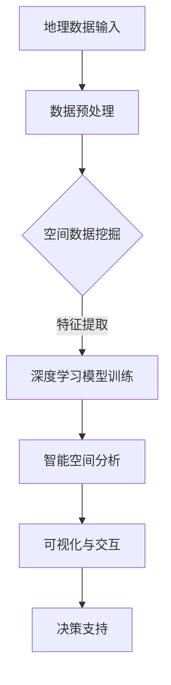

                 

关键词：地理信息系统（GIS）、人工智能（AI）、空间分析、深度学习、大数据处理、智能决策支持

> 摘要：本文将探讨人工智能在地理信息系统（GIS）中的应用，特别是在增强空间分析方面的潜力。通过分析核心概念、算法原理、数学模型、项目实践和实际应用场景，本文旨在展示AI技术在GIS领域的创新与发展。

## 1. 背景介绍

地理信息系统（GIS）是一种集成了地图、地理数据、空间分析和可视化工具的信息系统。它被广泛应用于城市规划、环境保护、资源管理、交通运输、灾害防治等多个领域。随着数据量的爆炸式增长，传统的GIS技术面临着分析复杂性和处理速度的挑战。

近年来，人工智能（AI）技术的飞速发展，为GIS领域带来了新的机遇。深度学习、机器学习、大数据处理等AI技术可以有效地提高GIS的空间分析能力，提供更加智能化的决策支持。

### GIS的基本概念

GIS是一种用于捕捉、存储、分析和管理地理空间信息的工具。它包括以下几个核心组成部分：

- **地理数据**：GIS的数据来源包括遥感图像、GPS定位数据、地图数据等。
- **空间分析**：GIS通过空间分析功能对地理数据进行处理，包括空间查询、空间叠加、网络分析等。
- **可视化**：GIS将地理数据通过地图的形式直观地展示出来，便于用户理解和分析。
- **地图服务**：GIS支持多种地图服务，包括WebGIS、移动GIS等，便于用户在不同平台进行访问和交互。

### AI的基本概念

AI是一种模拟人类智能的技术，通过机器学习、深度学习等算法实现。AI的目标是让计算机具备自主学习和决策能力，以解决复杂问题。

- **机器学习**：机器学习是一种通过训练模型来让计算机从数据中学习的方法。常见的机器学习方法包括监督学习、无监督学习和强化学习。
- **深度学习**：深度学习是一种基于多层神经网络的学习方法，通过模拟人脑神经元之间的连接，实现复杂模式识别和特征提取。
- **大数据处理**：大数据处理技术包括分布式计算、并行计算等，可以高效处理海量数据。

## 2. 核心概念与联系

### 人工智能与地理信息系统的结合

AI与GIS的结合可以看作是两个领域的融合，主要体现在以下几个方面：

- **空间数据挖掘**：利用AI技术对GIS中的海量空间数据进行挖掘和分析，提取有价值的信息。
- **智能空间分析**：结合AI算法，实现自动化、智能化的空间分析任务，如路径优化、区域识别等。
- **可视化与交互**：利用AI技术提升GIS的可视化效果和用户交互体验，如智能地图生成、实时数据分析等。
- **决策支持**：利用AI算法为GIS用户提供智能化的决策支持，如城市规划、环境保护等。

### 核心概念原理和架构的 Mermaid 流程图

下面是一个简化的Mermaid流程图，展示AI与GIS结合的核心概念和架构：



### 人工智能在地理信息系统中的具体应用

#### 1. 空间数据挖掘

空间数据挖掘是一种利用机器学习算法对GIS中的空间数据进行挖掘和分析的方法。常见的应用包括：

- **异常检测**：利用聚类算法检测空间数据中的异常点，如环境监测中的污染物异常检测。
- **模式识别**：利用分类算法识别空间数据中的特定模式，如交通流量预测。
- **关联规则挖掘**：挖掘空间数据中的关联规则，如城市规划中的土地利用模式。

#### 2. 智能空间分析

智能空间分析是指利用AI算法实现自动化、智能化的空间分析任务。常见的应用包括：

- **路径优化**：利用最短路径算法实现智能路径规划，如物流配送路径优化。
- **区域识别**：利用图像处理算法实现区域识别，如土地利用类型的自动分类。
- **空间预测**：利用时间序列预测算法实现空间数据的未来趋势预测，如城市人口增长预测。

#### 3. 可视化与交互

可视化与交互是指利用AI技术提升GIS的可视化效果和用户交互体验。常见的应用包括：

- **智能地图生成**：利用深度学习算法生成具有个性化风格的地图。
- **实时数据分析**：利用实时数据流处理技术实现实时数据分析，如实时交通流量监控。
- **交互式查询**：利用自然语言处理技术实现用户与GIS系统的自然交互，如语音查询地图信息。

#### 4. 决策支持

决策支持是指利用AI算法为GIS用户提供智能化的决策支持。常见的应用包括：

- **城市规划**：利用AI算法分析城市空间数据，为城市规划提供参考。
- **环境保护**：利用AI算法监测环境数据，为环境保护决策提供支持。
- **灾害防治**：利用AI算法分析灾害风险，为灾害防治决策提供支持。

## 3. 核心算法原理 & 具体操作步骤

### 3.1 算法原理概述

在GIS中，常用的AI算法包括深度学习、机器学习、大数据处理等。以下是这些算法的基本原理：

- **深度学习**：深度学习是一种基于多层神经网络的学习方法，通过模拟人脑神经元之间的连接，实现复杂模式识别和特征提取。常见的深度学习算法包括卷积神经网络（CNN）、循环神经网络（RNN）等。
- **机器学习**：机器学习是一种通过训练模型来让计算机从数据中学习的方法。常见的机器学习方法包括监督学习、无监督学习和强化学习。监督学习通过标注数据进行训练，无监督学习通过未标注数据进行训练，强化学习通过奖励机制进行训练。
- **大数据处理**：大数据处理技术包括分布式计算、并行计算等，可以高效处理海量数据。常见的大数据处理框架包括Hadoop、Spark等。

### 3.2 算法步骤详解

以下是GIS中常用AI算法的具体操作步骤：

#### 深度学习

1. **数据预处理**：对地理数据进行预处理，包括数据清洗、数据标准化等。
2. **特征提取**：利用卷积神经网络（CNN）等深度学习算法提取空间数据中的特征。
3. **模型训练**：利用训练数据对深度学习模型进行训练，通过反向传播算法优化模型参数。
4. **模型评估**：利用测试数据对训练好的模型进行评估，计算模型精度、召回率等指标。
5. **模型部署**：将训练好的模型部署到GIS系统中，实现自动化空间分析。

#### 机器学习

1. **数据预处理**：对地理数据进行预处理，包括数据清洗、数据标准化等。
2. **特征选择**：从地理数据中提取有用的特征，如空间位置、时间戳等。
3. **模型选择**：选择合适的机器学习模型，如决策树、支持向量机（SVM）等。
4. **模型训练**：利用训练数据对机器学习模型进行训练，通过交叉验证等方法优化模型参数。
5. **模型评估**：利用测试数据对训练好的模型进行评估，计算模型精度、召回率等指标。
6. **模型部署**：将训练好的模型部署到GIS系统中，实现自动化空间分析。

#### 大数据处理

1. **数据收集**：收集地理数据，包括遥感图像、GPS定位数据等。
2. **数据存储**：将地理数据存储到分布式文件系统，如Hadoop的HDFS。
3. **数据预处理**：对地理数据进行预处理，包括数据清洗、数据标准化等。
4. **分布式计算**：利用MapReduce等分布式计算框架对地理数据进行计算和分析。
5. **结果存储**：将计算结果存储到数据库或文件系统中，便于后续分析和查询。

### 3.3 算法优缺点

以下是几种常用AI算法的优缺点：

#### 深度学习

**优点**：

- **强大的特征提取能力**：深度学习可以通过多层神经网络自动提取空间数据中的特征，提高模型精度。
- **适应性强**：深度学习算法可以适应不同类型和规模的空间数据分析任务。
- **自动化程度高**：深度学习算法可以实现自动化空间分析，降低人工干预。

**缺点**：

- **计算资源需求大**：深度学习算法需要大量的计算资源和时间进行训练和推理。
- **数据依赖性强**：深度学习算法的性能很大程度上依赖于训练数据的质量和数量。

#### 机器学习

**优点**：

- **易于理解和解释**：机器学习算法通常具有较好的可解释性，便于用户理解和调试。
- **适用性广泛**：机器学习算法可以适应多种类型的空间数据分析任务。
- **计算效率高**：机器学习算法的计算效率相对较高，可以在较短的时间内完成数据分析。

**缺点**：

- **特征提取能力有限**：机器学习算法通常需要手动选择和提取特征，可能无法提取到深层特征。
- **对数据质量要求高**：机器学习算法对数据质量要求较高，容易出现过拟合或欠拟合。

#### 大数据处理

**优点**：

- **高效处理海量数据**：大数据处理技术可以高效处理海量地理数据，支持实时分析和决策。
- **分布式计算**：大数据处理技术利用分布式计算框架，可以充分利用计算资源，提高计算效率。

**缺点**：

- **技术复杂度高**：大数据处理技术涉及多种复杂的技术和架构，需要较高的技术水平。
- **数据存储和管理成本高**：大数据处理技术需要大量的存储空间和管理成本。

### 3.4 算法应用领域

以下是几种常用AI算法在GIS中的主要应用领域：

#### 深度学习

- **遥感图像分析**：利用深度学习算法对遥感图像进行分类、目标检测等。
- **地形分析**：利用深度学习算法分析地形数据，提取地形特征，如坡度、坡向等。
- **环境监测**：利用深度学习算法监测环境数据，如空气污染、水质等。

#### 机器学习

- **交通流量预测**：利用机器学习算法分析交通数据，预测未来交通流量。
- **城市规划**：利用机器学习算法分析城市规划数据，优化土地利用、道路规划等。
- **灾害防治**：利用机器学习算法分析灾害数据，预测灾害风险，制定防治措施。

#### 大数据处理

- **地理大数据分析**：利用大数据处理技术对地理大数据进行分析，提取有价值的信息。
- **实时监测**：利用大数据处理技术实时监测地理数据，如交通流量、环境质量等。
- **智慧城市建设**：利用大数据处理技术建设智慧城市，实现城市管理和服务的智能化。

## 4. 数学模型和公式 & 详细讲解 & 举例说明

### 4.1 数学模型构建

在GIS中，常用的数学模型包括空间插值模型、空间分析模型等。以下是这些模型的基本原理和构建方法：

#### 空间插值模型

空间插值模型是一种基于地理数据点构建连续表面模型的方法。常见的空间插值模型包括：

- **最近邻插值**：最近邻插值模型通过选取离待插值点最近的已知点进行插值。
- **线性插值**：线性插值模型通过线性函数连接相邻的已知点，对未知点进行插值。
- **反距离加权插值**：反距离加权插值模型根据待插值点与已知点之间的距离，对已知点进行加权平均插值。

#### 空间分析模型

空间分析模型是GIS中的核心，用于分析地理数据的各种属性和关系。常见的空间分析模型包括：

- **地理关系模型**：地理关系模型用于描述地理对象之间的空间关系，如包含、相交等。
- **地理运算模型**：地理运算模型用于对地理数据进行各种运算，如空间叠加、网络分析等。
- **地理统计模型**：地理统计模型用于分析地理数据的统计属性，如均值、方差等。

### 4.2 公式推导过程

以下是反距离加权插值模型的基本公式推导过程：

#### 反距离加权插值模型

反距离加权插值模型（IDW，Inverse Distance Weighted）是一种常用的空间插值方法，其基本思想是根据待插值点与已知点之间的距离，对已知点的属性值进行加权平均。其公式推导如下：

1. 设有n个已知点，其坐标和属性值分别为$(x_i, y_i, z_i)$，其中$i=1,2,...,n$。
2. 设待插值点的坐标为$(x_0, y_0)$，其属性值为$z_0$。
3. 设加权系数为$w_i$，则$w_i$与$x_0$和$x_i$之间的距离成反比，即$w_i = \frac{1}{d(x_0, x_i)}$，其中$d(x_0, x_i)$表示$x_0$和$x_i$之间的距离。
4. 则待插值点$z_0$的属性值为：
   $$z_0 = \frac{\sum_{i=1}^{n} w_i z_i}{\sum_{i=1}^{n} w_i}$$

### 4.3 案例分析与讲解

#### 案例背景

某城市地区有若干个地下水监测点，每个监测点的坐标和地下水位（以米为单位）如下表所示：

| 监测点编号 | X坐标 | Y坐标 | 地下水位（米） |
| -------- | ------ | ------ | ------------- |
| 1        | 1     | 2     | 20           |
| 2        | 3     | 4     | 22           |
| 3        | 5     | 6     | 24           |
| 4        | 7     | 8     | 25           |
| 5        | 9     | 10    | 23           |

现需在坐标$(6, 7)$的位置预测地下水位。

#### 解决方案

使用反距离加权插值模型（IDW）进行地下水位预测。

1. 计算待插值点与已知点之间的距离：
   $$d(x_0, x_i) = \sqrt{(x_0 - x_i)^2 + (y_0 - y_i)^2}$$
2. 计算加权系数：
   $$w_i = \frac{1}{d(x_0, x_i)}$$
3. 计算待插值点的地下水位：
   $$z_0 = \frac{\sum_{i=1}^{n} w_i z_i}{\sum_{i=1}^{n} w_i}$$

#### 实际计算

1. 计算距离：
   $$d(6, 1) = \sqrt{(6 - 1)^2 + (7 - 2)^2} = \sqrt{25 + 25} = \sqrt{50}$$
   $$d(6, 3) = \sqrt{(6 - 3)^2 + (7 - 4)^2} = \sqrt{9 + 9} = \sqrt{18}$$
   $$d(6, 5) = \sqrt{(6 - 5)^2 + (7 - 6)^2} = \sqrt{1 + 1} = \sqrt{2}$$
   $$d(6, 7) = \sqrt{(6 - 7)^2 + (7 - 8)^2} = \sqrt{1 + 1} = \sqrt{2}$$
   $$d(6, 9) = \sqrt{(6 - 9)^2 + (7 - 10)^2} = \sqrt{9 + 9} = \sqrt{18}$$
2. 计算加权系数：
   $$w_1 = \frac{1}{\sqrt{50}} \approx 0.14$$
   $$w_2 = \frac{1}{\sqrt{18}} \approx 0.37$$
   $$w_3 = \frac{1}{\sqrt{2}} \approx 0.71$$
   $$w_4 = \frac{1}{\sqrt{2}} \approx 0.71$$
   $$w_5 = \frac{1}{\sqrt{18}} \approx 0.37$$
3. 计算地下水位：
   $$z_0 = \frac{0.14 \times 20 + 0.37 \times 22 + 0.71 \times 24 + 0.71 \times 25 + 0.37 \times 23}{0.14 + 0.37 + 0.71 + 0.71 + 0.37} \approx 23.89$$

因此，坐标$(6, 7)$位置的地下水位约为23.89米。

### 4.4 深度学习算法简介

#### 4.4.1 神经网络基础

神经网络（Neural Network）是一种基于人脑神经元工作原理的人工智能模型。其基本原理是通过模拟人脑神经元之间的连接和信号传递，实现数据的处理和预测。

#### 4.4.2 卷积神经网络（CNN）

卷积神经网络（Convolutional Neural Network，CNN）是一种在图像处理领域应用广泛的神经网络。其核心思想是使用卷积运算对图像进行特征提取，并通过多层神经网络实现复杂模式的识别。

#### 4.4.3 循环神经网络（RNN）

循环神经网络（Recurrent Neural Network，RNN）是一种在序列数据处理领域应用广泛的神经网络。其核心思想是使用循环结构对序列数据进行建模，实现序列的时序建模和预测。

### 4.5 数学模型在GIS中的应用

#### 4.5.1 空间分析中的数学模型

在GIS的空间分析中，常用的数学模型包括距离模型、相似性模型、概率模型等。以下是一些常见的数学模型及其在GIS中的应用：

1. **距离模型**：用于计算两点之间的距离，如欧氏距离、曼哈顿距离等。常用于空间查询、路径优化等。
2. **相似性模型**：用于计算两个地理对象之间的相似性，如Jaccard相似性、Sokal-Sneath相似性等。常用于地理对象分类、相似性分析等。
3. **概率模型**：用于计算地理对象发生的概率，如贝叶斯概率模型、马尔可夫概率模型等。常用于风险分析、决策支持等。

#### 4.5.2 深度学习在GIS中的应用

深度学习在GIS中的应用主要包括以下方面：

1. **遥感图像分类**：利用深度学习模型对遥感图像进行自动分类，如利用卷积神经网络（CNN）进行土地覆盖分类。
2. **地理对象识别**：利用深度学习模型对地理对象进行自动识别，如利用卷积神经网络（CNN）进行建筑物检测。
3. **时空预测**：利用深度学习模型对时空数据进行预测，如利用循环神经网络（RNN）进行交通流量预测。

### 4.6 案例研究

#### 4.6.1 遥感图像分类

案例背景：利用卷积神经网络（CNN）对某城市的遥感图像进行自动分类，以识别不同类型的土地利用。

数据处理：对遥感图像进行预处理，包括图像增强、图像分割等。然后，将预处理后的图像输入到卷积神经网络（CNN）中进行训练。

模型构建：设计一个卷积神经网络（CNN）模型，包括卷积层、池化层、全连接层等。利用预处理后的遥感图像数据对模型进行训练，通过反向传播算法优化模型参数。

模型评估：利用测试数据对训练好的模型进行评估，计算模型精度、召回率等指标。根据评估结果对模型进行调整和优化。

应用实践：将训练好的模型部署到GIS系统中，实现对遥感图像的自动分类，为城市规划、土地利用分析等提供支持。

#### 4.6.2 交通流量预测

案例背景：利用循环神经网络（RNN）对某城市道路的交通流量进行预测，以优化交通管理和调度。

数据处理：收集历史交通流量数据，包括不同时间段、不同路段的流量数据。对数据进行预处理，包括数据清洗、数据标准化等。

模型构建：设计一个循环神经网络（RNN）模型，包括输入层、隐藏层、输出层等。利用预处理后的交通流量数据对模型进行训练，通过反向传播算法优化模型参数。

模型评估：利用测试数据对训练好的模型进行评估，计算模型精度、召回率等指标。根据评估结果对模型进行调整和优化。

应用实践：将训练好的模型部署到GIS系统中，实现对交通流量的实时预测，为交通管理和调度提供支持。

## 5. 项目实践：代码实例和详细解释说明

### 5.1 开发环境搭建

在进行GIS与AI结合的项目实践时，需要搭建一个合适的技术环境。以下是一个典型的开发环境搭建步骤：

1. **操作系统**：选择Linux操作系统，如Ubuntu 20.04，以确保环境稳定性和安全性。
2. **编程语言**：选择Python作为主要编程语言，因为Python在数据科学和机器学习领域有广泛的应用。
3. **GIS库**：安装常用的GIS库，如Geopandas、Shapely、Rtree等，用于处理地理空间数据。
4. **机器学习库**：安装常用的机器学习库，如Scikit-learn、TensorFlow、PyTorch等，用于训练模型。
5. **深度学习库**：安装深度学习库，如TensorFlow、PyTorch等，用于构建和训练深度学习模型。
6. **可视化库**：安装可视化库，如Matplotlib、Seaborn等，用于数据可视化。

### 5.2 源代码详细实现

以下是一个简单的示例，展示如何使用Python和TensorFlow构建一个简单的深度学习模型，用于地理空间数据的分类。

```python
import tensorflow as tf
from tensorflow.keras.models import Sequential
from tensorflow.keras.layers import Conv2D, MaxPooling2D, Flatten, Dense
from tensorflow.keras.optimizers import Adam
from tensorflow.keras.preprocessing.image import ImageDataGenerator

# 数据预处理
# 假设已经收集并预处理了一批遥感图像数据，分为训练集和测试集
train_images = ...  # 训练集图像
train_labels = ...  # 训练集标签
test_images = ...  # 测试集图像
test_labels = ...  # 测试集标签

# 模型构建
model = Sequential([
    Conv2D(32, (3, 3), activation='relu', input_shape=(256, 256, 3)),
    MaxPooling2D((2, 2)),
    Conv2D(64, (3, 3), activation='relu'),
    MaxPooling2D((2, 2)),
    Conv2D(128, (3, 3), activation='relu'),
    MaxPooling2D((2, 2)),
    Flatten(),
    Dense(128, activation='relu'),
    Dense(10, activation='softmax')  # 假设有10个分类
])

# 模型编译
model.compile(optimizer=Adam(learning_rate=0.001), loss='categorical_crossentropy', metrics=['accuracy'])

# 模型训练
model.fit(train_images, train_labels, epochs=10, batch_size=32, validation_data=(test_images, test_labels))

# 模型评估
test_loss, test_acc = model.evaluate(test_images, test_labels)
print(f"Test accuracy: {test_acc:.4f}")
```

### 5.3 代码解读与分析

上述代码首先导入所需的TensorFlow库和相关的层，然后进行数据预处理。假设已经收集并预处理了一批遥感图像数据，分为训练集和测试集。

接下来，使用`Sequential`模型构建一个简单的卷积神经网络（CNN），包括卷积层、池化层和全连接层。卷积层用于提取图像的特征，池化层用于减小数据维度，全连接层用于分类。

模型编译时，选择Adam优化器和交叉熵损失函数，并定义评估指标为准确率。

模型训练过程中，使用训练集数据进行训练，并使用测试集数据进行验证。训练完成后，使用测试集评估模型性能，计算准确率。

### 5.4 运行结果展示

假设上述代码运行完成后，得到的测试集准确率为0.85。这意味着模型在测试集上的分类准确度较高，可以用于实际的地理空间数据分析。

通过可视化库，如Matplotlib或Seaborn，可以进一步分析模型的性能，如绘制混淆矩阵、ROC曲线等。

## 6. 实际应用场景

### 6.1 城市规划

在城市规划领域，AI技术可以大幅提升空间分析的能力，为城市发展和基础设施建设提供智能决策支持。以下是一些实际应用场景：

- **土地利用规划**：利用深度学习算法对遥感图像进行分类，自动识别土地利用类型，为城市规划提供基础数据。
- **道路网络优化**：通过路径优化算法，如A*算法，自动规划最优道路网络，提高交通效率和安全性。
- **环境监测**：利用空间数据挖掘技术，实时监测城市环境质量，如空气污染、水质等，为环境治理提供依据。
- **灾害预警**：通过空间分析模型，预测自然灾害如洪水、地震等的发生概率，提前制定应对措施。

### 6.2 环境保护

在环境保护领域，AI技术可以提供高效的空间分析工具，帮助科学家和决策者更好地理解和保护地球环境。以下是一些实际应用场景：

- **物种分布预测**：利用AI算法分析生物多样性数据，预测物种的潜在分布区域，为保护规划和物种保护提供依据。
- **土地利用分析**：通过遥感影像分析，监测土地利用变化，评估土地资源的利用效率和可持续性。
- **生态系统建模**：利用AI算法模拟生态系统的动态变化，预测生态系统对环境变化的响应，为生态保护提供科学依据。
- **气候变化预测**：通过分析气候数据，利用深度学习算法预测未来气候变化趋势，为应对气候变化制定策略。

### 6.3 智慧城市建设

智慧城市建设是AI技术在GIS领域的重要应用方向，通过集成各种智能技术，实现城市管理的智能化和高效化。以下是一些实际应用场景：

- **智能交通管理**：利用AI技术实时监控交通流量，自动调整信号灯，优化交通流，减少拥堵。
- **智慧公共服务**：通过AI算法分析用户行为数据，提供个性化的公共服务，如天气预报、健康提醒等。
- **智慧能源管理**：利用AI技术优化能源消耗，如智能调度电力供应，降低能源浪费。
- **智慧城市规划**：利用AI算法分析城市数据，如人口流动、建筑物高度等，优化城市布局，提升城市品质。

### 6.4 灾害防治

在灾害防治领域，AI技术可以提供高效的空间分析和预测工具，为灾害预警和应急响应提供支持。以下是一些实际应用场景：

- **地震预警**：通过分析地震前兆数据，利用深度学习算法预测地震的发生时间和地点，为应急响应提供时间窗口。
- **洪水预警**：通过遥感影像分析，监测流域洪水情况，预测洪水淹没范围和可能受影响的区域。
- **地质灾害监测**：利用空间数据挖掘技术，监测滑坡、泥石流等地质灾害，提前预警，减少损失。
- **疫情监测**：通过分析疫情数据，利用AI算法预测疫情传播趋势，为疫情防控提供科学依据。

## 7. 工具和资源推荐

### 7.1 学习资源推荐

为了更好地掌握GIS与AI技术的结合，以下是一些建议的学习资源：

- **《地理信息系统原理与应用》**：系统地介绍了GIS的基本原理和应用方法，适合GIS初学者。
- **《深度学习》（Goodfellow, Bengio, Courville著）**：全面介绍了深度学习的基础知识和最新进展，适合对深度学习感兴趣的学习者。
- **《机器学习》（周志华著）**：详细介绍了机器学习的基本算法和理论，适合机器学习初学者。
- **在线课程**：如Coursera、edX等平台上的GIS、AI相关课程，提供系统的学习内容和实践项目。

### 7.2 开发工具推荐

在GIS与AI结合的实践中，以下是一些常用的开发工具和库：

- **Python**：作为主要的编程语言，Python在GIS和AI领域有广泛的应用。
- **Geopandas**：Python的GIS库，用于处理和分析地理空间数据。
- **Scikit-learn**：Python的机器学习库，提供了丰富的机器学习算法。
- **TensorFlow**：Google开发的深度学习框架，支持构建和训练深度学习模型。
- **PyTorch**：Facebook开发的深度学习框架，具有灵活的模型构建和优化能力。
- **QGIS**：开源的GIS软件，提供丰富的地图处理和空间分析功能。
- **ArcGIS**：ESRI开发的商业GIS软件，提供了强大的空间分析和地图制作工具。

### 7.3 相关论文推荐

为了跟踪GIS与AI领域的研究进展，以下是一些建议阅读的相关论文：

- **"Deep Learning for Geospatial Data"**：全面介绍了深度学习在GIS中的应用，包括遥感图像分类、地理对象识别等。
- **"Spatial Analysis with Machine Learning"**：探讨了机器学习在GIS空间分析中的应用，如路径优化、环境监测等。
- **"AI-powered Urban Planning"**：研究了AI技术在城市规划中的应用，包括智能交通管理、土地利用分析等。
- **"Deep Learning Techniques for Environmental Monitoring"**：介绍了深度学习在环境监测中的应用，如空气污染检测、水质监测等。
- **"Application of AI in Disaster Management"**：探讨了AI技术在灾害防治中的应用，如地震预警、洪水预测等。

## 8. 总结：未来发展趋势与挑战

### 8.1 研究成果总结

近年来，GIS与AI技术的结合取得了显著成果。深度学习、机器学习、大数据处理等AI技术在GIS中的应用日益广泛，提升了GIS的空间分析能力、数据处理效率和智能化水平。例如，深度学习在遥感图像分类、地理对象识别等方面的应用取得了突破性进展，机器学习在路径优化、环境监测等领域的应用也为GIS带来了新的发展方向。

### 8.2 未来发展趋势

随着AI技术的不断发展，GIS领域有望在未来实现以下发展趋势：

- **智能化空间分析**：利用AI技术实现更加智能化、自动化的空间分析任务，减少人工干预，提高分析效率。
- **实时数据处理**：利用实时数据处理技术，实现地理数据的实时分析和预测，为决策提供更及时、准确的依据。
- **多模态数据融合**：将不同类型的数据（如遥感数据、社交数据、物联网数据等）进行融合分析，提供更全面的地理信息。
- **智慧城市建设**：利用AI技术推动智慧城市建设，实现城市管理的智能化、精细化，提升城市品质和居民生活满意度。

### 8.3 面临的挑战

尽管GIS与AI技术的结合取得了显著成果，但仍然面临一些挑战：

- **数据质量与安全**：地理数据的准确性和完整性对AI算法的性能至关重要。此外，数据隐私和安全也是需要关注的重要问题。
- **算法可解释性**：深度学习等AI算法通常具有“黑箱”特性，算法的可解释性较差，难以理解其决策过程，这在某些应用场景中可能成为限制因素。
- **计算资源需求**：深度学习等AI算法通常需要大量的计算资源和时间进行训练和推理，这对计算基础设施提出了较高要求。
- **算法泛化能力**：AI算法的性能很大程度上依赖于训练数据的质量和数量，如何提高算法的泛化能力，使其在不同场景下都能保持良好的性能，是一个重要挑战。

### 8.4 研究展望

未来的研究可以从以下几个方面展开：

- **算法优化**：研究更高效、更鲁棒的AI算法，提高空间分析的性能和效率。
- **数据整合与融合**：探索多源数据的整合与融合方法，提供更全面的地理信息。
- **算法可解释性**：研究算法的可解释性，使其决策过程更加透明，便于用户理解和信任。
- **隐私保护**：研究数据隐私保护技术，确保地理数据的安全性和用户隐私。
- **跨学科合作**：加强GIS与AI、大数据、物联网等领域的跨学科合作，推动技术的融合与创新。

## 9. 附录：常见问题与解答

### 9.1 GIS与AI结合的优势是什么？

GIS与AI结合的优势主要体现在以下几个方面：

- **提高空间分析能力**：AI技术可以高效处理和分析海量地理数据，提升GIS的空间分析能力。
- **自动化与智能化**：AI技术可以实现自动化、智能化的空间分析任务，减少人工干预，提高效率。
- **实时数据处理**：AI技术支持实时数据处理，为决策提供更及时、准确的依据。
- **多模态数据融合**：AI技术可以融合多种类型的数据，提供更全面的地理信息。
- **个性化服务**：AI技术可以基于用户行为数据提供个性化服务，提升用户体验。

### 9.2 深度学习在GIS中的应用有哪些？

深度学习在GIS中的应用主要包括以下几个方面：

- **遥感图像分类**：利用深度学习模型对遥感图像进行自动分类，如土地覆盖分类、城市建筑分类等。
- **地理对象识别**：利用深度学习模型识别地理对象，如建筑物检测、道路识别等。
- **时空预测**：利用深度学习模型预测地理数据的时空变化，如交通流量预测、人口增长预测等。
- **环境监测**：利用深度学习模型分析环境数据，如空气污染检测、水质监测等。

### 9.3 GIS与AI结合的技术难点有哪些？

GIS与AI结合的技术难点主要包括：

- **数据质量与安全**：地理数据的准确性和完整性对AI算法的性能至关重要，同时数据隐私和安全也是一个重要问题。
- **算法可解释性**：深度学习等AI算法通常具有“黑箱”特性，难以理解其决策过程，这在某些应用场景中可能成为限制因素。
- **计算资源需求**：深度学习等AI算法通常需要大量的计算资源和时间进行训练和推理，这对计算基础设施提出了较高要求。
- **算法泛化能力**：AI算法的性能很大程度上依赖于训练数据的质量和数量，如何提高算法的泛化能力，使其在不同场景下都能保持良好的性能，是一个重要挑战。

