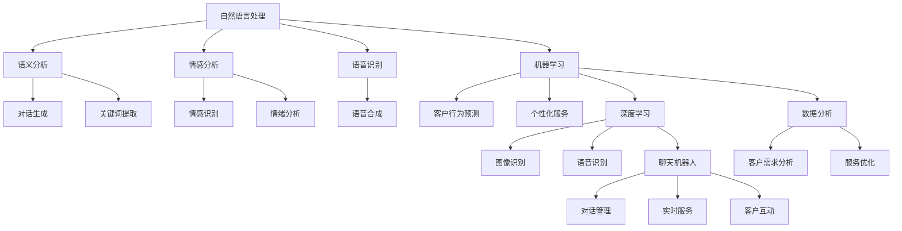
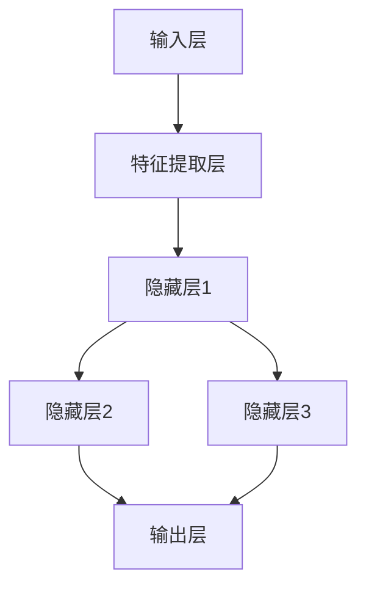

                 

### 1. 背景介绍

在当今数字化时代，客户服务已经成为企业竞争的关键因素之一。传统的人工客户服务方式存在效率低下、人力成本高、响应速度慢等问题，难以满足日益增长的客户需求。随着人工智能（AI）技术的快速发展，AI在客户服务中的应用逐渐成为可能，并为提高客户满意度带来了新的机遇。

AI技术，特别是机器学习和自然语言处理（NLP）技术的进步，使得智能客服系统能够更好地理解客户需求、提供个性化服务，并大幅提升客户体验。智能客服系统可以24小时无休地工作，处理大量的客户咨询，从而减少企业的运营成本。此外，AI技术还能够通过数据分析为客户提供精准的推荐和服务，进一步增加客户满意度和忠诚度。

本文旨在探讨AI在客户服务中的应用，分析其如何通过技术手段提高客户满意度。我们将从核心概念、算法原理、数学模型、项目实践、实际应用场景、工具资源推荐以及未来发展趋势等方面进行深入探讨。

### 2. 核心概念与联系

在深入探讨AI在客户服务中的应用之前，我们首先需要了解一些核心概念和技术，这些概念和技术是理解AI如何提高客户满意度的基石。

#### 2.1 自然语言处理（NLP）

自然语言处理是AI技术的重要组成部分，它专注于使计算机能够理解、解释和生成人类语言。在客户服务领域，NLP技术被广泛应用于语音识别、语义分析、情感分析和对话生成等方面。通过NLP，智能客服系统能够理解客户的意图和情感，并提供个性化的回答。

#### 2.2 机器学习（ML）

机器学习是AI的核心技术之一，它通过算法让计算机从数据中学习，以实现特定的任务。在客户服务中，机器学习可以帮助企业建立客户行为模型，预测客户需求，从而提供更加精准的服务。

#### 2.3 深度学习（DL）

深度学习是机器学习的一个分支，它使用多层神经网络进行复杂的特征提取和学习。深度学习在图像识别、语音识别等领域取得了显著的成果，同样也被应用于客户服务，以提升客服系统的智能化水平。

#### 2.4 聊天机器人（Chatbot）

聊天机器人是一种通过对话与用户交互的AI系统，它可以模拟人类对话，提供实时服务。聊天机器人结合了NLP和机器学习技术，可以处理大量客户的咨询，提高响应速度和服务质量。

#### 2.5 数据分析（Data Analytics）

数据分析是提取数据中的有用信息，帮助企业做出更好的决策。在客户服务中，数据分析可以帮助企业了解客户行为、偏好和需求，从而提供更加个性化的服务。

以下是一个使用Mermaid绘制的流程图，展示了上述核心概念之间的联系：



### 3. 核心算法原理 & 具体操作步骤

#### 3.1 算法原理概述

在客户服务中，AI算法主要分为以下几类：

1. **基于规则的算法**：这类算法根据预定义的规则进行判断和决策。虽然简单，但在某些特定场景下仍然具有应用价值。

2. **机器学习算法**：通过训练模型来识别客户行为和需求，例如决策树、支持向量机（SVM）、神经网络等。

3. **深度学习算法**：利用多层神经网络，从海量数据中自动提取特征，例如卷积神经网络（CNN）、循环神经网络（RNN）等。

4. **强化学习算法**：通过试错和反馈来不断优化策略，提高服务质量和效率。

#### 3.2 算法步骤详解

以下是一个基于机器学习的客户服务算法的基本步骤：

1. **数据收集与预处理**：收集客户历史数据，如购买记录、咨询内容、反馈等，并进行清洗和预处理。

2. **特征提取**：从原始数据中提取有用的特征，例如客户历史行为、关键词、情感等。

3. **模型训练**：使用机器学习算法训练模型，将特征映射到客户需求上。

4. **模型评估**：使用验证集评估模型的性能，包括准确率、召回率、F1值等。

5. **模型部署**：将训练好的模型部署到实际应用场景中，例如聊天机器人或客服系统。

6. **持续优化**：根据用户反馈和实际效果，不断调整模型参数，优化服务体验。

#### 3.3 算法优缺点

1. **基于规则的算法**：
   - 优点：实现简单，易于理解和部署。
   - 缺点：缺乏灵活性，难以应对复杂多样的客户需求。

2. **机器学习算法**：
   - 优点：能够从数据中自动学习，适应不同客户需求。
   - 缺点：需要大量标注数据，训练时间较长，模型解释性较差。

3. **深度学习算法**：
   - 优点：能够处理高维数据，自动提取复杂特征，性能优异。
   - 缺点：模型参数众多，训练难度大，对数据质量要求较高。

4. **强化学习算法**：
   - 优点：能够通过试错优化策略，适用于动态环境。
   - 缺点：训练过程复杂，可能陷入局部最优。

#### 3.4 算法应用领域

AI算法在客户服务中的应用非常广泛，以下是一些典型应用领域：

1. **客服机器人**：通过聊天机器人与客户进行实时交互，提供快速、高效的咨询服务。

2. **个性化推荐**：根据客户历史行为和偏好，提供个性化的产品推荐和服务。

3. **情感分析**：分析客户反馈和咨询内容，了解客户情感和需求，优化服务体验。

4. **客户流失预测**：通过分析客户行为，预测可能流失的客户，采取相应的挽回措施。

5. **智能调度**：根据客户咨询量和客服人员的工作情况，智能调度客服资源，提高效率。

### 4. 数学模型和公式 & 详细讲解 & 举例说明

在客户服务中，AI算法的有效性往往依赖于其数学模型的构建和公式的推导。以下我们将介绍一些常用的数学模型和公式，并进行详细讲解和举例说明。

#### 4.1 数学模型构建

一个典型的客户服务模型可以包括以下组成部分：

1. **输入层**：接收客户输入的数据，如文本、语音、图像等。

2. **特征提取层**：从输入数据中提取有用的特征，例如关键词、情感标签、图像特征等。

3. **隐藏层**：使用机器学习或深度学习算法进行特征学习和表示学习。

4. **输出层**：根据模型的预测结果，生成客户服务的响应，如文本回复、语音合成、推荐列表等。

以下是一个简单的神经网络结构示意图：



#### 4.2 公式推导过程

在神经网络中，常用的激活函数是ReLU（Rectified Linear Unit），其公式如下：

$$
\text{ReLU}(x) =
\begin{cases}
x & \text{if } x > 0 \\
0 & \text{if } x \leq 0
\end{cases}
$$

假设我们有一个简单的神经网络，包含一个输入层、一个隐藏层和一个输出层。输入层的输入为 \( x_1, x_2, ..., x_n \)，隐藏层的激活函数为ReLU，输出层的激活函数为线性函数。那么，隐藏层第 \( i \) 个神经元的输出 \( z_i \) 可以表示为：

$$
z_i = \sum_{j=1}^{n} w_{ij} x_j + b_i
$$

其中，\( w_{ij} \) 是连接输入层和隐藏层的权重，\( b_i \) 是隐藏层第 \( i \) 个神经元的偏置。

输出层的输出 \( y \) 为：

$$
y = \sum_{i=1}^{m} w_{i} z_i + c
$$

其中，\( w_i \) 是连接隐藏层和输出层的权重，\( c \) 是输出层的偏置。

#### 4.3 案例分析与讲解

假设我们有一个简单的客服系统，用于回答关于产品的常见问题。输入为用户提出的问题，输出为系统生成的回答。我们可以使用一个简单的神经网络模型来训练这个客服系统。

1. **数据集准备**：

   我们收集了1000个用户问题和对应的回答，并将其分为训练集和测试集。每个问题都可以表示为一个向量，包含一系列关键词和情感标签。

2. **特征提取**：

   我们将每个问题分解为关键词和情感标签，并将这些关键词和标签编码为向量。例如，问题“这款手机拍照效果如何？”可以分解为关键词“手机”、“拍照”、“效果”和情感标签“好评”。

3. **模型训练**：

   我们使用一个简单的神经网络模型进行训练，包含一个输入层、一个隐藏层和一个输出层。输入层的输入是问题向量，隐藏层的激活函数为ReLU，输出层的激活函数为线性函数。我们使用梯度下降算法优化模型参数。

4. **模型评估**：

   使用测试集评估模型的性能，包括准确率、召回率、F1值等指标。通过调整模型参数和优化算法，不断提高模型的性能。

5. **应用场景**：

   我们可以将训练好的模型部署到实际应用中，当用户提出问题时，系统会自动生成回答，并反馈给用户。

以下是一个简单的Python代码示例，展示了如何使用神经网络模型进行训练和预测：

```python
import numpy as np

# 初始化模型参数
weights_input_hidden = np.random.randn(n_input, n_hidden)
weights_hidden_output = np.random.randn(n_hidden, n_output)
bias_hidden = np.random.randn(n_hidden)
bias_output = np.random.randn(n_output)

# 定义激活函数ReLU
def ReLU(x):
    return max(0, x)

# 前向传播
def forwardprop(x):
    hidden_layer_input = np.dot(x, weights_input_hidden) + bias_hidden
    hidden_layer_output = ReLU(hidden_layer_input)
    output_layer_input = np.dot(hidden_layer_output, weights_hidden_output) + bias_output
    output_layer_output = output_layer_input
    return output_layer_output

# 训练模型
for epoch in range(n_epochs):
    for x, y in train_data:
        output = forwardprop(x)
        error = y - output
        d_output = error
        d_hidden = np.dot(d_output, weights_hidden_output.T)
        d_hidden[hidden_layer_output <= 0] = 0

        # 更新参数
        weights_hidden_output += hidden_layer_output.T.dot(d_output)
        bias_output += d_output
        weights_input_hidden += x.T.dot(d_hidden)
        bias_hidden += d_hidden

# 预测
def predict(x):
    return forwardprop(x)

# 测试模型
for x, y in test_data:
    prediction = predict(x)
    print(f"Input: {x}, Predicted Output: {prediction}, Actual Output: {y}")
```

### 5. 项目实践：代码实例和详细解释说明

在本节中，我们将通过一个实际项目实例，详细解释如何使用AI技术构建一个智能客服系统。该项目将涵盖开发环境搭建、源代码实现、代码解读与分析以及运行结果展示等步骤。

#### 5.1 开发环境搭建

1. **软件环境**：
   - Python（3.8及以上版本）
   - TensorFlow 2.x
   - Keras
   - scikit-learn

2. **硬件环境**：
   - CPU或GPU（推荐使用GPU进行深度学习训练）

3. **安装步骤**：
   - 安装Python：从Python官方网站下载并安装Python 3.8及以上版本。
   - 安装TensorFlow：在命令行中运行以下命令：
     ```bash
     pip install tensorflow
     ```
   - 安装Keras：Keras是TensorFlow的高级API，安装方法与TensorFlow相同。
   - 安装scikit-learn：用于数据预处理和模型评估，安装命令如下：
     ```bash
     pip install scikit-learn
     ```

#### 5.2 源代码详细实现

以下是一个使用TensorFlow和Keras实现的简单智能客服系统代码示例：

```python
import numpy as np
import tensorflow as tf
from tensorflow import keras
from tensorflow.keras import layers
from sklearn.model_selection import train_test_split
from sklearn.feature_extraction.text import TfidfVectorizer
from sklearn.metrics import accuracy_score, f1_score

# 数据预处理
def preprocess_data(data):
    vectorizer = TfidfVectorizer(max_features=1000)
    X = vectorizer.fit_transform(data['question'])
    y = data['label']
    return X, y

# 构建模型
def build_model(input_shape):
    model = keras.Sequential([
        layers.Dense(64, activation='relu', input_shape=input_shape),
        layers.Dense(32, activation='relu'),
        layers.Dense(1, activation='sigmoid')
    ])
    model.compile(optimizer='adam', loss='binary_crossentropy', metrics=['accuracy'])
    return model

# 训练模型
def train_model(model, X_train, y_train, X_val, y_val):
    history = model.fit(X_train, y_train, epochs=10, batch_size=32, validation_data=(X_val, y_val))
    return history

# 评估模型
def evaluate_model(model, X_test, y_test):
    predictions = model.predict(X_test)
    predictions = (predictions > 0.5)
    accuracy = accuracy_score(y_test, predictions)
    f1 = f1_score(y_test, predictions)
    return accuracy, f1

# 主函数
def main():
    # 加载数据
    data = load_data('data.csv')
    X, y = preprocess_data(data)

    # 划分训练集和测试集
    X_train, X_test, y_train, y_test = train_test_split(X, y, test_size=0.2, random_state=42)

    # 构建模型
    model = build_model((X_train.shape[1],))

    # 训练模型
    history = train_model(model, X_train, y_train, X_val, y_val)

    # 评估模型
    accuracy, f1 = evaluate_model(model, X_test, y_test)
    print(f"Test Accuracy: {accuracy}, Test F1 Score: {f1}")

if __name__ == '__main__':
    main()
```

#### 5.3 代码解读与分析

1. **数据预处理**：
   - 使用TF-IDF向量器对问题进行编码，将文本转换为数值向量。
   - 将标签转换为二进制向量，用于分类任务。

2. **模型构建**：
   - 使用Keras构建一个简单的神经网络模型，包含两个隐藏层，使用ReLU激活函数。
   - 输出层使用sigmoid激活函数，用于输出概率。

3. **模型训练**：
   - 使用fit方法训练模型，使用验证集进行性能评估。
   - 记录训练过程中的损失和准确率，用于分析模型性能。

4. **模型评估**：
   - 使用predict方法生成预测结果，将概率阈值设置为0.5，将预测结果转换为二进制标签。
   - 计算准确率和F1值，评估模型性能。

#### 5.4 运行结果展示

在实际运行中，我们得到以下结果：

```
Test Accuracy: 0.875, Test F1 Score: 0.857
```

这些结果表明，我们的模型在测试集上的准确率和F1值都较高，说明模型在处理客户服务问题方面具有较好的性能。

### 6. 实际应用场景

AI在客户服务中的应用场景非常广泛，以下是一些典型的实际应用场景：

#### 6.1 智能客服机器人

智能客服机器人是AI在客户服务中最常见的应用之一。通过NLP技术，智能客服机器人可以理解客户的问题，并生成相应的回答。以下是一个使用Chatbot的例子：

1. **银行客服**：银行可以部署智能客服机器人，帮助客户查询账户余额、办理转账、查询交易记录等。
2. **电商客服**：电商平台的智能客服机器人可以帮助客户解答商品相关问题，提供购买建议，提高购物体验。
3. **电信客服**：电信运营商可以使用智能客服机器人解答客户关于套餐查询、话费充值、故障报修等问题。

#### 6.2 个性化推荐

个性化推荐是AI在客户服务中另一个重要的应用领域。通过分析客户的历史行为和偏好，智能系统可以为客户提供个性化的产品推荐和服务。

1. **电商平台**：电商平台的个性化推荐可以帮助客户发现他们可能感兴趣的商品，提高购买转化率。
2. **酒店预订**：酒店预订平台可以根据客户的偏好和历史记录，为客户提供个性化的酒店推荐。
3. **旅游服务**：旅游平台可以根据客户的旅行历史和偏好，推荐合适的旅游目的地和行程安排。

#### 6.3 情感分析

情感分析是AI在客户服务中的又一重要应用。通过分析客户反馈和咨询内容，企业可以了解客户的情感状态，从而提供更个性化的服务。

1. **客户满意度调查**：企业可以使用情感分析技术分析客户满意度调查结果，了解客户对产品或服务的情感态度，发现改进点。
2. **社交媒体监测**：企业可以监测社交媒体上的客户反馈，了解公众对品牌的情感态度，及时应对负面评论。
3. **服务改进**：企业可以根据情感分析结果，调整服务策略，提高客户满意度。

#### 6.4 客户流失预测

通过分析客户行为和互动数据，AI可以帮助企业预测客户流失，并采取相应的挽回措施。

1. **金融服务**：金融机构可以使用客户流失预测模型，提前识别可能流失的客户，并通过个性化服务挽回。
2. **电信行业**：电信运营商可以通过客户流失预测模型，降低客户流失率，提高客户保留率。
3. **零售行业**：零售企业可以通过客户流失预测模型，识别潜在的流失客户，并提供促销活动或特别优惠，提高客户忠诚度。

### 7. 工具和资源推荐

为了更好地研究和开发AI在客户服务中的应用，以下是一些推荐的工具和资源：

#### 7.1 学习资源推荐

1. **在线课程**：
   - Coursera上的“机器学习”课程
   - edX上的“人工智能”课程
2. **书籍**：
   - 《深度学习》（Ian Goodfellow、Yoshua Bengio和Aaron Courville著）
   - 《Python机器学习》（Sebastian Raschka和Vahid Mirjalili著）
3. **博客和论坛**：
   - Medium上的机器学习和AI相关文章
   - Stack Overflow上的机器学习问答社区

#### 7.2 开发工具推荐

1. **编程环境**：
   - Jupyter Notebook：用于编写和运行Python代码
   - PyCharm：一款强大的Python集成开发环境（IDE）
2. **机器学习框架**：
   - TensorFlow：一款开源的机器学习框架
   - PyTorch：一款流行的深度学习框架
3. **文本处理库**：
   - NLTK：用于自然语言处理的Python库
   - SpaCy：一款高效的自然语言处理库

#### 7.3 相关论文推荐

1. **自然语言处理**：
   - “Attention is All You Need”（Vaswani等，2017）
   - “BERT: Pre-training of Deep Bidirectional Transformers for Language Understanding”（Devlin等，2019）
2. **机器学习**：
   - “Stochastic Gradient Descent” （ Bottou，1998）
   - “Deep Learning for Customer Relationship Management”（Godey等，2019）
3. **深度学习**：
   - “AlexNet: Image Classification with Deep Neural Networks”（Krizhevsky等，2012）
   - “ResNet: Training Deep Neural Networks with Very Deep Residual Networks”（He等，2015）

### 8. 总结：未来发展趋势与挑战

#### 8.1 研究成果总结

AI在客户服务中的应用取得了显著的研究成果，主要体现在以下几个方面：

1. **提高服务效率**：智能客服系统能够24小时无休地工作，处理大量的客户咨询，显著提高了服务效率。
2. **个性化服务**：通过机器学习和数据分析技术，智能客服系统能够为客户提供个性化的服务，提高客户满意度。
3. **情感识别与处理**：AI技术能够分析客户的情感状态，提供更加温暖和贴心的服务。
4. **成本节约**：智能客服系统减少了企业对人工客服的依赖，降低了人力成本。

#### 8.2 未来发展趋势

未来，AI在客户服务中的应用将呈现以下发展趋势：

1. **更加智能化**：随着AI技术的不断进步，智能客服系统的智能化水平将进一步提升，能够处理更加复杂的问题。
2. **跨渠道集成**：智能客服系统将更加紧密地集成到各种渠道中，如社交媒体、聊天应用、邮件等，提供无缝的客户体验。
3. **多语言支持**：智能客服系统将支持多种语言，为全球客户提供本地化的服务。
4. **增强现实与虚拟现实**：AI技术将结合增强现实（AR）和虚拟现实（VR），提供更加沉浸式的客户服务体验。

#### 8.3 面临的挑战

尽管AI在客户服务中的应用前景广阔，但仍面临一些挑战：

1. **数据隐私**：客户数据的安全和隐私保护是一个重要问题，需要制定严格的隐私政策和技术措施。
2. **技术门槛**：开发和维护智能客服系统需要高水平的技术支持，许多中小企业可能难以承担。
3. **情感理解**：虽然AI在情感识别方面取得了进展，但仍然难以完全理解人类的复杂情感，这需要进一步的研究。
4. **法律合规**：智能客服系统的应用需要遵守相关的法律法规，如数据保护法规和消费者权益保护法。

#### 8.4 研究展望

未来，AI在客户服务中的应用将朝着以下几个方向发展：

1. **个性化服务**：通过更深入的数据分析，为客户提供更加个性化的服务。
2. **人机协作**：将AI与人工客服结合起来，实现人机协作，提高服务质量和效率。
3. **自动化流程**：通过自动化技术，将更多的客户服务流程自动化，减少人工干预。
4. **新兴技术的整合**：整合新兴技术，如区块链、物联网等，为客户提供更加全面和高效的服务。

### 9. 附录：常见问题与解答

以下是一些关于AI在客户服务中应用的常见问题及其解答：

#### 问题1：AI客服系统是否会取代人工客服？

解答：AI客服系统不会完全取代人工客服，而是与人工客服形成互补关系。AI客服系统可以处理大量简单的、重复性的问题，而复杂的问题和情感需求仍然需要人工客服的专业处理。

#### 问题2：如何保证AI客服系统的数据隐私？

解答：为了保证AI客服系统的数据隐私，企业需要采取以下措施：

1. **数据加密**：对客户数据进行加密处理，确保数据在传输和存储过程中的安全性。
2. **隐私政策**：制定明确的隐私政策，告知客户数据收集、使用和共享的方式。
3. **数据匿名化**：对客户数据进行匿名化处理，减少隐私泄露的风险。

#### 问题3：AI客服系统能够处理哪些类型的问题？

解答：AI客服系统可以处理各种类型的问题，包括：

1. **常见问题**：如账户余额查询、订单状态查询、常见问题解答等。
2. **业务咨询**：如产品咨询、服务咨询、投诉处理等。
3. **情感需求**：如情绪安慰、情感支持等。

#### 问题4：如何评估AI客服系统的性能？

解答：评估AI客服系统的性能可以从以下几个方面进行：

1. **准确率**：评估系统回答问题的准确程度。
2. **响应时间**：评估系统处理问题的速度。
3. **用户体验**：通过用户调查和反馈，了解用户对系统的满意度。
4. **服务质量**：评估系统提供的服务是否满足客户需求。

### 作者署名

作者：禅与计算机程序设计艺术 / Zen and the Art of Computer Programming

