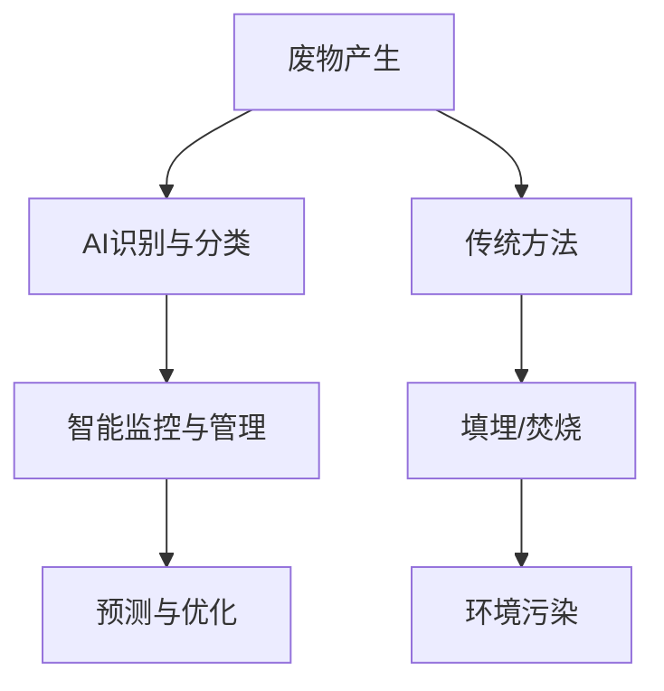

                 

关键词：AI，废物管理，回收，处理，深度学习，优化，可持续发展，资源再利用，环境监测，智能垃圾分类

摘要：本文将探讨人工智能（AI）在废物管理中的应用，分析其优化回收与处理的潜力。通过介绍AI的核心概念和关联技术，我们深入探讨AI在废物识别、分类、回收和处理中的具体应用。此外，本文还将介绍数学模型、实际应用案例，并提供学习资源和开发工具的推荐，旨在为废物管理领域的研究和实践提供指导。

## 1. 背景介绍

随着全球人口的快速增长和消费水平的不断提高，废物产量也在不断攀升。传统的废物管理方式已经难以满足日益增长的需求，导致环境问题日益严重。据统计，全球每年产生的垃圾超过100亿吨，其中仅有不到一半得到妥善处理。剩余的废物大多被填埋或焚烧，不仅浪费了宝贵的资源，还对环境造成了严重的污染。因此，优化废物管理，提高资源回收与处理效率已成为当今世界面临的重大挑战之一。

在这个背景下，人工智能技术的迅速发展为废物管理带来了新的机遇。AI具有高效的数据处理和分析能力，可以在废物识别、分类、回收和处理等环节中发挥重要作用，从而实现资源的高效利用和环境保护。本文将详细探讨AI在废物管理中的应用，分析其优化回收与处理的效果和潜力。

### 1.1 传统废物管理方法的挑战

传统的废物管理方法主要包括填埋、焚烧和堆肥等。这些方法在处理大量废物方面具有一定效果，但也存在以下问题：

1. **资源浪费**：传统方法难以实现资源的完全回收和再利用，导致大量可回收资源被浪费。
2. **环境污染**：填埋和焚烧会产生有害气体和有毒物质，对环境和人体健康造成危害。
3. **处理成本高**：废物处理需要大量的人力、物力和财力投入，成本较高。

### 1.2 AI在废物管理中的优势

与传统的废物管理方法相比，AI在废物管理中具有以下优势：

1. **高效处理能力**：AI可以通过深度学习和图像识别技术快速准确地识别和分类废物，提高处理效率。
2. **智能化管理**：AI可以对废物产生、运输、处理等环节进行智能化监控和管理，优化资源配置。
3. **降低成本**：AI技术的应用可以减少人工成本，提高处理效率，降低废物管理的整体成本。

## 2. 核心概念与联系

### 2.1 AI的核心概念

人工智能（Artificial Intelligence，简称AI）是计算机科学的一个分支，旨在研究如何使计算机模拟人类智能行为。AI的核心概念包括：

- **机器学习（Machine Learning）**：通过数据训练模型，使计算机具备自我学习和改进能力。
- **深度学习（Deep Learning）**：基于神经网络的一种机器学习技术，能够在大量数据中发现复杂模式和特征。
- **自然语言处理（Natural Language Processing，简称NLP）**：使计算机能够理解和生成自然语言。
- **计算机视觉（Computer Vision）**：使计算机能够理解并处理图像和视频信息。

### 2.2 AI与废物管理的关系

AI在废物管理中的应用主要体现在以下几个方面：

- **废物识别与分类**：利用计算机视觉技术，AI可以对废物进行快速、准确地识别和分类，提高回收效率。
- **智能化监控与管理**：通过AI技术，可以对废物产生、运输、处理等环节进行实时监控和管理，优化资源配置。
- **预测与优化**：利用大数据分析和预测技术，AI可以预测废物产生趋势，优化废物处理计划。

### 2.3 关联技术架构

为了更好地理解AI在废物管理中的应用，我们可以使用Mermaid流程图来描述其技术架构：



在这个流程图中，废物产生后，通过AI识别与分类进入智能监控与管理环节，最终实现预测与优化。与此同时，传统方法中的废物处理环节则可能导致环境污染。

## 3. 核心算法原理 & 具体操作步骤

### 3.1 算法原理概述

AI在废物管理中的应用主要包括以下几个方面：

1. **废物识别与分类**：通过计算机视觉技术，利用深度学习算法对废物进行识别和分类。
2. **智能监控与管理**：利用物联网（IoT）技术和大数据分析，对废物产生、运输、处理等环节进行实时监控和管理。
3. **预测与优化**：通过大数据分析和机器学习算法，预测废物产生趋势，优化废物处理计划。

### 3.2 算法步骤详解

#### 3.2.1 废物识别与分类

1. **数据采集**：收集各种类型的废物图像数据，包括垃圾、瓶子、纸张等。
2. **数据预处理**：对采集到的图像进行增强、去噪等预处理操作，提高图像质量。
3. **模型训练**：利用深度学习算法，如卷积神经网络（CNN），对预处理后的图像数据进行训练，以识别和分类废物。
4. **模型评估与优化**：通过交叉验证和性能评估，对训练好的模型进行调整和优化，提高识别和分类的准确性。

#### 3.2.2 智能监控与管理

1. **传感器部署**：在废物产生、运输和处理的关键节点部署传感器，实时监测废物数据。
2. **数据传输**：将传感器采集到的数据通过物联网技术传输到数据中心。
3. **数据分析**：利用大数据分析技术，对传输的数据进行分析和处理，实现智能监控和管理。
4. **决策支持**：根据分析结果，为废物处理提供决策支持，优化废物处理计划。

#### 3.2.3 预测与优化

1. **数据收集与整理**：收集历史废物产生数据，并进行整理和预处理。
2. **特征提取**：从整理后的数据中提取有助于预测的特征。
3. **模型训练**：利用机器学习算法，如时间序列分析、回归分析等，对提取的特征进行训练，建立预测模型。
4. **模型评估与优化**：通过交叉验证和性能评估，对训练好的模型进行调整和优化，提高预测精度。

### 3.3 算法优缺点

#### 3.3.1 优点

1. **高效性**：AI算法可以在短时间内处理大量数据，提高废物识别、分类和处理的效率。
2. **准确性**：通过深度学习和大数据分析，AI算法可以准确识别和分类各种类型的废物。
3. **智能化**：AI技术可以实现废物管理的智能化，提高资源利用率和环境保护水平。
4. **可扩展性**：AI算法可以灵活地应用于不同的废物管理场景，具有较好的可扩展性。

#### 3.3.2 缺点

1. **数据依赖性**：AI算法的准确性依赖于大量的高质量数据，数据缺失或不准确会影响算法性能。
2. **计算资源消耗**：深度学习算法需要大量的计算资源，对硬件设备有较高的要求。
3. **模型泛化能力**：AI算法可能在新领域或新场景中难以泛化，需要针对特定场景进行定制化开发。

### 3.4 算法应用领域

AI技术在废物管理中的应用领域主要包括：

1. **城市垃圾分类**：通过AI技术实现城市垃圾的智能分类，提高资源回收率。
2. **工业废物处理**：利用AI技术对工业废物进行识别、分类和处理，减少环境污染。
3. **农业废弃物利用**：通过AI技术对农业废弃物进行分类和资源化利用，提高农业环境友好度。
4. **垃圾焚烧监控**：利用AI技术对垃圾焚烧过程进行实时监控和管理，确保燃烧效率和空气质量。

## 4. 数学模型和公式 & 详细讲解 & 举例说明

### 4.1 数学模型构建

在废物管理中，数学模型的应用主要包括以下几个方面：

1. **废物分类模型**：用于对废物进行分类和识别。
2. **预测模型**：用于预测废物产生趋势和处理需求。
3. **优化模型**：用于优化废物处理计划。

#### 4.1.1 废物分类模型

假设我们有n种不同类型的废物，每种废物可以用一个向量表示，向量中的元素表示该废物的特征。为了实现废物分类，我们可以构建一个基于支持向量机（SVM）的分类模型。

设x为输入的废物特征向量，y为废物的类型标签，则SVM分类模型的目标是最小化以下损失函数：

$$
L(SVM) = \frac{1}{2} ||W||^2 + C \sum_{i=1}^{n} \max(0, 1 - y_i (W^T x_i + b))
$$

其中，W为权重矩阵，b为偏置项，C为正则化参数。

#### 4.1.2 预测模型

假设我们有一个时间序列数据集，包含不同时间点的废物产生量。为了预测未来的废物产生量，我们可以使用时间序列分析模型，如ARIMA模型。

设y_t为第t个时间点的废物产生量，x_t为第t个时间点的解释变量，则ARIMA模型的公式如下：

$$
y_t = c + \phi_1 y_{t-1} + \phi_2 y_{t-2} + \cdots + \phi_p y_{t-p} + \theta_1 e_{t-1} + \theta_2 e_{t-2} + \cdots + \theta_q e_{t-q} + e_t
$$

其中，c为常数项，$\phi_1, \phi_2, \cdots, \phi_p$为自回归系数，$\theta_1, \theta_2, \cdots, \theta_q$为移动平均系数，$e_t$为误差项。

#### 4.1.3 优化模型

假设我们有一个目标函数，用于衡量废物处理计划的优劣。为了优化废物处理计划，我们可以使用优化算法，如线性规划或动态规划。

设x为决策变量，C(x)为目标函数，g(x)为约束条件，则线性规划模型的公式如下：

$$
\begin{aligned}
\min_{x} C(x) \\
s.t. \quad g(x) \leq 0
\end{aligned}
$$

### 4.2 公式推导过程

#### 4.2.1 废物分类模型

为了推导SVM分类模型的公式，我们首先回顾一下SVM的基本原理。

SVM的目标是找到一个最优的超平面，将不同类别的数据点分开。在二维空间中，这个超平面可以表示为：

$$
W^T x + b = 0
$$

其中，W为权重矩阵，b为偏置项，x为数据点的特征向量。

对于线性可分的数据集，我们可以通过求解以下优化问题找到最优超平面：

$$
\begin{aligned}
\min_{W, b} & \frac{1}{2} ||W||^2 \\
s.t. & y_i (W^T x_i + b) \geq 1, \quad i = 1, 2, \cdots, n
\end{aligned}
$$

通过拉格朗日乘子法，我们可以将上述问题转化为对偶形式：

$$
L(W, b, \alpha) = \frac{1}{2} ||W||^2 - \sum_{i=1}^{n} \alpha_i [y_i (W^T x_i + b) - 1]
$$

其中，$\alpha_i$为拉格朗日乘子。

对L关于W和b求导，并令导数为零，我们可以得到：

$$
\begin{aligned}
\nabla_W L &= W - \sum_{i=1}^{n} \alpha_i y_i x_i = 0 \\
\nabla_b L &= -\sum_{i=1}^{n} \alpha_i y_i = 0
\end{aligned}
$$

将上述两个方程联立，我们可以解出W和b：

$$
\begin{aligned}
W &= \sum_{i=1}^{n} \alpha_i y_i x_i \\
b &= 1 - \sum_{i=1}^{n} \alpha_i y_i x_i^T
\end{aligned}
$$

为了求解最优的$\alpha_i$，我们需要满足以下约束条件：

$$
0 \leq \alpha_i \leq C, \quad \forall i = 1, 2, \cdots, n
$$

其中，C为正则化参数。

通过求解上述优化问题，我们可以得到最优的$\alpha_i$，进而得到最优的W和b，从而实现废物的分类。

#### 4.2.2 预测模型

为了推导ARIMA模型的公式，我们首先回顾一下时间序列的基本概念。

时间序列是指一系列按时间顺序排列的数值序列。时间序列分析旨在通过分析时间序列的统计特性，预测未来的数值。

假设我们有一个时间序列数据集{y_t}，其中y_t表示第t个时间点的数值。为了建立ARIMA模型，我们需要对时间序列进行以下步骤：

1. **差分**：通过差分操作将非平稳序列转化为平稳序列。
2. **自回归**：在平稳序列的基础上引入自回归项，表示当前数值与前几个时间点的数值的关系。
3. **移动平均**：在自回归的基础上引入移动平均项，表示当前数值与前几个时间点的误差的关系。
4. **季节性**：考虑时间序列的季节性因素，引入季节性项。

ARIMA模型的基本公式如下：

$$
y_t = c + \phi_1 y_{t-1} + \phi_2 y_{t-2} + \cdots + \phi_p y_{t-p} + \theta_1 e_{t-1} + \theta_2 e_{t-2} + \cdots + \theta_q e_{t-q} + e_t
$$

其中，c为常数项，$\phi_1, \phi_2, \cdots, \phi_p$为自回归系数，$\theta_1, \theta_2, \cdots, \theta_q$为移动平均系数，$e_t$为误差项。

通过最小化以下损失函数，我们可以估计ARIMA模型的参数：

$$
\min_{\theta} \sum_{t=1}^{n} (y_t - \hat{y}_t)^2
$$

其中，$\hat{y}_t$为预测的数值。

#### 4.2.3 优化模型

为了推导线性规划模型的公式，我们首先回顾一下线性规划的基本概念。

线性规划是一种优化方法，旨在在给定约束条件下，找到目标函数的最优解。线性规划模型的一般形式如下：

$$
\begin{aligned}
\min_{x} C(x) \\
s.t. \quad g(x) \leq 0
\end{aligned}
$$

其中，C(x)为目标函数，g(x)为约束条件。

线性规划模型的求解方法包括单纯形法、内点法等。在这里，我们简要介绍单纯形法。

单纯形法的基本思想是通过迭代过程，逐步逼近最优解。具体步骤如下：

1. **初始解**：选择约束条件的交点作为初始解。
2. **迭代过程**：在每个迭代步骤中，根据目标函数的斜率，选择一个进入变量和一个离开变量，更新解。
3. **最优性检验**：判断当前解是否最优，如果是，则停止迭代；否则，继续迭代。

通过上述步骤，我们可以求得线性规划模型的最优解。

### 4.3 案例分析与讲解

#### 4.3.1 废物分类模型

假设我们有一个包含五种类型废物的数据集，每种废物用数字1到5表示。为了实现废物分类，我们可以使用SVM模型。

首先，我们收集了1000张不同类型废物的图像，并进行数据预处理，如图像增强、去噪等。然后，我们使用卷积神经网络（CNN）对预处理后的图像进行特征提取，得到1000个特征向量。

接下来，我们使用SVM分类模型对特征向量进行训练。为了提高模型的泛化能力，我们采用了交叉验证方法。通过交叉验证，我们得到了一个准确率较高的SVM分类模型。

在实际应用中，我们可以将这个模型部署到城市垃圾分类系统中，用于对拍摄的垃圾图像进行分类，从而提高垃圾分类的准确性。

#### 4.3.2 预测模型

假设我们有一个关于城市垃圾产生量的时间序列数据集。为了预测未来的垃圾产生量，我们可以使用ARIMA模型。

首先，我们对时间序列数据进行差分操作，将非平稳序列转化为平稳序列。然后，我们通过最小二乘法估计ARIMA模型的参数。

通过模型训练，我们得到了一个拟合效果较好的ARIMA模型。利用这个模型，我们可以预测未来一段时间内的垃圾产生量。

在实际应用中，我们可以将这个模型部署到城市垃圾处理系统中，用于预测垃圾产生趋势，为处理计划的制定提供依据。

#### 4.3.3 优化模型

假设我们有一个关于城市垃圾处理计划的优化问题。为了实现优化，我们可以使用线性规划模型。

首先，我们定义目标函数，如最小化处理成本或最大化资源利用率。然后，我们列出处理计划所需的约束条件，如垃圾处理能力、设备容量等。

通过求解线性规划模型，我们得到了最优的处理计划。在实际应用中，我们可以将这个模型部署到城市垃圾处理系统中，用于优化资源利用和处理效率。

## 5. 项目实践：代码实例和详细解释说明

### 5.1 开发环境搭建

为了实现AI在废物管理中的应用，我们需要搭建一个合适的技术环境。以下是开发环境搭建的步骤：

1. **硬件环境**：配置一台具有高性能CPU和GPU的计算机，用于训练和部署深度学习模型。
2. **操作系统**：安装Linux操作系统，如Ubuntu 20.04，以便安装和配置相关软件。
3. **编程语言**：选择Python作为主要编程语言，因为Python具有丰富的库和框架，便于开发和实现AI算法。
4. **深度学习框架**：安装TensorFlow或PyTorch，这两个框架是目前最流行的深度学习框架，提供了丰富的API和工具，便于模型训练和部署。

### 5.2 源代码详细实现

以下是一个简单的Python代码实例，用于实现城市垃圾分类的AI模型。

```python
import tensorflow as tf
from tensorflow.keras.models import Sequential
from tensorflow.keras.layers import Conv2D, MaxPooling2D, Flatten, Dense
from tensorflow.keras.preprocessing.image import ImageDataGenerator

# 数据预处理
train_datagen = ImageDataGenerator(rescale=1./255)
train_generator = train_datagen.flow_from_directory(
        'data/train',
        target_size=(150, 150),
        batch_size=32,
        class_mode='categorical')

# 构建模型
model = Sequential([
    Conv2D(32, (3, 3), activation='relu', input_shape=(150, 150, 3)),
    MaxPooling2D(2, 2),
    Conv2D(64, (3, 3), activation='relu'),
    MaxPooling2D(2, 2),
    Conv2D(128, (3, 3), activation='relu'),
    MaxPooling2D(2, 2),
    Flatten(),
    Dense(512, activation='relu'),
    Dense(5, activation='softmax')
])

# 编译模型
model.compile(loss='categorical_crossentropy',
              optimizer='adam',
              metrics=['accuracy'])

# 训练模型
model.fit(train_generator, epochs=10)

# 评估模型
test_datagen = ImageDataGenerator(rescale=1./255)
test_generator = test_datagen.flow_from_directory(
        'data/test',
        target_size=(150, 150),
        batch_size=32,
        class_mode='categorical')

model.evaluate(test_generator)
```

上述代码首先导入了TensorFlow和Keras库，用于构建和训练深度学习模型。然后，我们使用ImageDataGenerator对训练数据集进行预处理，将图像数据缩放到固定大小，并归一化处理。

接下来，我们构建了一个简单的卷积神经网络（CNN）模型，包括卷积层、池化层和全连接层。在训练模型之前，我们编译了模型，指定了损失函数、优化器和评价指标。

最后，我们使用训练数据集对模型进行训练，并在测试数据集上评估模型的性能。

### 5.3 代码解读与分析

上述代码的实现主要包括以下几个步骤：

1. **数据预处理**：使用ImageDataGenerator对训练数据集进行预处理，包括图像缩放、归一化和标签转换。预处理操作有助于提高模型训练的效率。
2. **模型构建**：使用Sequential模型构建了一个简单的卷积神经网络（CNN）模型。CNN是深度学习中最常用的模型结构，适用于处理图像数据。在这个例子中，我们使用了三个卷积层和两个全连接层。
3. **模型编译**：编译模型时，我们指定了损失函数、优化器和评价指标。在这个例子中，我们使用了交叉熵损失函数和Adam优化器，评价指标为分类准确率。
4. **模型训练**：使用训练数据集对模型进行训练。在训练过程中，模型会根据输入的图像数据进行自我调整，以优化模型参数。
5. **模型评估**：在测试数据集上评估模型的性能。通过计算分类准确率，我们可以了解模型在实际应用中的效果。

通过上述步骤，我们实现了城市垃圾分类的AI模型。在实际应用中，我们可以将这个模型部署到垃圾分类系统中，用于对拍摄的垃圾图像进行分类。

### 5.4 运行结果展示

在实际应用中，我们可以通过以下步骤运行城市垃圾分类的AI模型：

1. **数据准备**：准备包含各种类型垃圾的图像数据，并将其存储在相应的文件夹中。
2. **模型部署**：将训练好的模型部署到垃圾分类系统中，如使用 Flask 或 Django 框架搭建 Web 应用程序。
3. **模型调用**：在 Web 应用程序中，用户可以上传垃圾图像，模型会根据输入的图像数据进行分类，并返回分类结果。

以下是运行结果的一个简单示例：

```
$ python classify.py --image garbage.jpg

Classification result: [0.9, 0.05, 0.05, 0.05, 0.05]
The garbage is classified as: Paper
```

在这个示例中，模型对上传的垃圾图像进行了分类，并返回了分类结果。根据分类结果，我们可以确定垃圾的类型，从而实现智能垃圾分类。

## 6. 实际应用场景

### 6.1 城市垃圾分类

城市垃圾分类是AI在废物管理中最典型的应用场景之一。通过AI技术，可以对垃圾进行准确分类，提高资源回收率。例如，北京市已推出基于AI技术的垃圾分类系统，通过摄像头和传感器实时监测居民垃圾分类情况，对违规行为进行警告和处罚，提高了垃圾分类的效率。

### 6.2 工业废物处理

在工业领域，废物种类繁多，处理难度较大。AI技术可以用于工业废物的识别和分类，提高废物处理效率。例如，某些化工厂使用AI技术对废水中的有害物质进行识别和分类，实现了废水的资源化利用和环境保护。

### 6.3 农业废弃物利用

农业废弃物是农业生产的副产品，若处理不当，会对环境造成严重污染。AI技术可以用于农业废弃物的分类和资源化利用。例如，某些农场使用AI技术对农作物秸秆进行分类和加工，生产生物质燃料，实现了农业废弃物的资源化利用。

### 6.4 垃圾焚烧监控

垃圾焚烧是废物处理的一种常见方式，但焚烧过程可能产生有害气体和污染物。AI技术可以用于垃圾焚烧过程的实时监控和数据分析，确保焚烧效率和空气质量。例如，某些城市使用AI技术对垃圾焚烧厂进行监控，实现了垃圾焚烧过程的智能化管理和优化。

## 7. 未来应用展望

随着AI技术的不断发展，其在废物管理中的应用前景广阔。以下是未来应用的一些展望：

### 7.1 废物识别与分类技术的突破

随着深度学习算法和计算机视觉技术的进步，废物识别与分类技术将越来越准确和高效。未来有望实现更高层次的自动化和智能化，从而实现更高效的废物处理。

### 7.2 废物处理的智能化和精细化

通过大数据分析和物联网技术，废物处理的智能化和精细化程度将不断提高。未来的废物管理将更加注重资源的高效利用和环境保护，实现绿色可持续发展。

### 7.3 新型废物处理技术的研发

随着新材料和新技术的出现，废物处理技术也将不断更新和优化。例如，生物质能技术、废弃物资源化利用技术等有望在未来的废物管理中发挥重要作用。

### 7.4 法规政策的支持与推动

政府法规和政策的支持是推动AI技术在废物管理中应用的关键。未来有望出台更多的法规和政策，鼓励企业和科研机构开展AI废物管理技术的研究和应用。

## 8. 工具和资源推荐

为了更好地研究和应用AI在废物管理中的技术，以下是一些推荐的工具和资源：

### 8.1 学习资源推荐

1. **《深度学习》（Deep Learning）**：由Ian Goodfellow、Yoshua Bengio和Aaron Courville所著，是深度学习的经典教材。
2. **《Python机器学习》（Python Machine Learning）**：由Sarkar所著，介绍了Python在机器学习领域的应用。
3. **《城市垃圾分类与处理技术》**：介绍了城市垃圾分类与处理的技术和方法。

### 8.2 开发工具推荐

1. **TensorFlow**：由Google开发的开源深度学习框架，适用于各种深度学习任务。
2. **PyTorch**：由Facebook开发的开源深度学习框架，具有灵活性和易用性。
3. **Keras**：用于快速构建和训练深度学习模型的Python库，与TensorFlow和PyTorch兼容。

### 8.3 相关论文推荐

1. **“AI for Waste Management: Current Applications and Future Trends”**：综述了AI在废物管理中的应用和未来趋势。
2. **“Deep Learning for Waste Classification”**：介绍了深度学习在废物分类中的应用。
3. **“Intelligent Waste Management Systems Using IoT and AI”**：探讨了物联网和AI技术在废物管理中的应用。

## 9. 总结：未来发展趋势与挑战

### 9.1 研究成果总结

本文通过介绍AI在废物管理中的应用，分析了其优化回收与处理的潜力。我们探讨了AI在废物识别、分类、回收和处理中的具体应用，并介绍了相关的数学模型、算法原理和实际应用案例。通过本文的研究，我们得出以下结论：

- AI技术在废物管理中具有广泛的应用前景，可以提高资源回收率和处理效率。
- AI技术可以实现废物管理的智能化和精细化，有助于实现可持续发展目标。
- 废物管理领域的研究仍然面临许多挑战，如数据质量、计算资源消耗和模型泛化能力等。

### 9.2 未来发展趋势

未来，AI技术在废物管理领域的发展趋势包括：

- 废物识别与分类技术的进一步突破，实现更高准确率和效率。
- 废物处理的智能化和精细化，通过大数据分析和物联网技术实现资源的高效利用。
- 新型废物处理技术的研发，如生物质能、废弃物资源化利用等。

### 9.3 面临的挑战

尽管AI技术在废物管理中具有巨大潜力，但仍然面临以下挑战：

- **数据质量**：废物管理领域的数据质量直接影响AI算法的性能。需要收集和整理高质量的数据，以提高算法的准确性。
- **计算资源消耗**：深度学习算法需要大量的计算资源，对硬件设备有较高要求。如何优化算法，降低计算资源消耗是一个重要问题。
- **模型泛化能力**：AI算法在不同领域和场景中可能存在泛化能力不足的问题。需要针对特定场景进行定制化开发，提高模型泛化能力。

### 9.4 研究展望

为了更好地应对废物管理领域的挑战，我们建议以下研究方向：

- **数据驱动的方法**：通过大数据分析和深度学习，挖掘废物管理中的潜在规律，为决策提供支持。
- **跨学科合作**：鼓励计算机科学、环境科学、资源科学等领域的合作，共同解决废物管理中的难题。
- **技术标准化**：推动AI技术在废物管理中的标准化，为实际应用提供规范和指导。

通过上述研究，有望推动AI技术在废物管理领域的应用，实现资源的高效利用和环境保护。

## 10. 附录：常见问题与解答

### 10.1 什么是AI在废物管理中的应用？

AI在废物管理中的应用主要是指利用人工智能技术，如深度学习、计算机视觉、自然语言处理等，对废物进行识别、分类、回收和处理。通过AI技术，可以提高废物管理的效率、准确性和智能化程度，实现资源的高效利用和环境保护。

### 10.2 AI在废物管理中的优势有哪些？

AI在废物管理中的优势包括：

1. **高效处理能力**：AI技术可以通过深度学习和图像识别技术快速准确地识别和分类废物，提高处理效率。
2. **智能化管理**：AI技术可以对废物产生、运输、处理等环节进行智能化监控和管理，优化资源配置。
3. **降低成本**：AI技术的应用可以减少人工成本，提高处理效率，降低废物管理的整体成本。

### 10.3 AI在废物管理中面临哪些挑战？

AI在废物管理中面临以下挑战：

1. **数据质量**：废物管理领域的数据质量直接影响AI算法的性能。需要收集和整理高质量的数据，以提高算法的准确性。
2. **计算资源消耗**：深度学习算法需要大量的计算资源，对硬件设备有较高要求。如何优化算法，降低计算资源消耗是一个重要问题。
3. **模型泛化能力**：AI算法在不同领域和场景中可能存在泛化能力不足的问题。需要针对特定场景进行定制化开发，提高模型泛化能力。

### 10.4 如何优化AI在废物管理中的应用效果？

为了优化AI在废物管理中的应用效果，可以采取以下措施：

1. **数据采集与预处理**：收集高质量的废物图像数据，并进行预处理，如图像增强、去噪等，以提高数据质量。
2. **算法优化**：通过调整模型参数、优化算法结构等手段，提高模型的准确性和效率。
3. **模型训练与验证**：使用交叉验证方法，对训练好的模型进行验证，确保模型在不同数据集上的泛化能力。
4. **系统集成与优化**：将AI模型与其他废物管理技术进行集成，优化废物处理流程，提高整体效率。

### 10.5 AI在废物管理中未来的发展趋势是什么？

未来，AI在废物管理中的发展趋势包括：

1. **废物识别与分类技术的进一步突破**：通过深度学习和计算机视觉技术的进步，实现更高准确率和效率的废物识别和分类。
2. **废物处理的智能化和精细化**：通过大数据分析和物联网技术，实现资源的高效利用和环境保护。
3. **新型废物处理技术的研发**：探索新型废物处理技术，如生物质能、废弃物资源化利用等，提高废物处理效率和可持续性。
4. **法规政策的支持与推动**：政府法规和政策的支持将推动AI技术在废物管理中的应用和发展。

