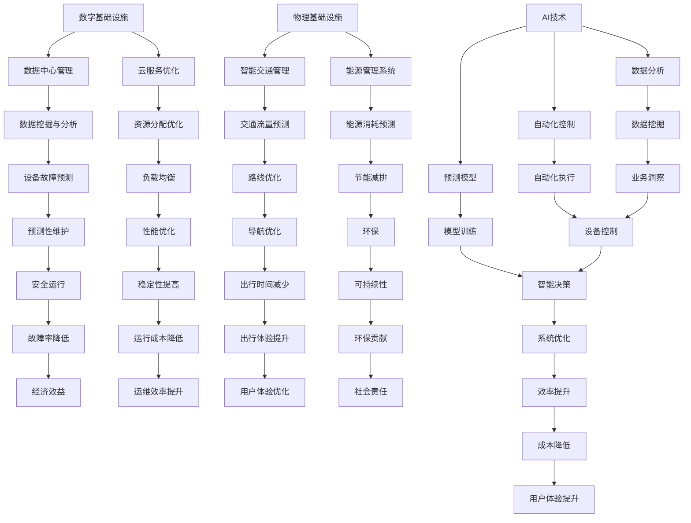

                 

关键词：人工智能、数字基础设施、物理基础设施、应用场景、未来发展

> 摘要：本文探讨了人工智能在数字基础设施和物理基础设施中的应用，分析了AI技术在数据中心管理、物联网、智能交通、能源管理等领域的重要性，并探讨了未来发展趋势与挑战。通过具体实例和代码分析，展示了AI技术在实际项目中的应用效果，为读者提供了全面的AI与基础设施融合的视角。

## 1. 背景介绍

随着信息技术的飞速发展，数字基础设施和物理基础设施在我们的日常生活中扮演着越来越重要的角色。数字基础设施，如互联网、数据中心和云服务，已经成为现代社会运转的基石。物理基础设施，包括交通、能源、水利等，则是城市发展的关键支撑。然而，随着数据量和复杂度的不断增长，传统的基础设施管理方法已难以满足日益增长的需求。这时，人工智能（AI）技术的引入，为基础设施的优化和升级提供了新的契机。

人工智能，作为计算机科学的一个分支，致力于模拟人类智能，解决复杂问题。近年来，随着深度学习、自然语言处理和计算机视觉等技术的突破，AI在多个领域取得了显著的进展。这些进展不仅推动了科技的发展，也为传统基础设施的智能化提供了可能。

本文将首先介绍数字基础设施和物理基础设施的概念和特点，然后深入探讨AI技术在数据中心管理、物联网、智能交通和能源管理中的应用。通过具体实例和代码分析，我们将展示AI技术如何提升基础设施的效率和性能。最后，本文将探讨未来AI技术在基础设施领域的发展趋势和面临的挑战。

## 2. 核心概念与联系

### 数字基础设施

数字基础设施是指支持信息传输、处理、存储和共享的一系列技术和设备。主要包括以下几类：

1. **互联网基础设施**：包括宽带网络、光纤通信、无线通信等，为数据传输提供高速通道。
2. **数据中心**：数据中心是数字基础设施的核心，负责数据的存储、处理和分发。
3. **云服务**：云计算提供了灵活、高效、可扩展的计算资源，是数字基础设施的重要组成部分。

### 物理基础设施

物理基础设施是指支撑城市运行的基础设施，主要包括以下几类：

1. **交通基础设施**：包括道路、桥梁、铁路等，是城市交通的骨架。
2. **能源基础设施**：包括电力、天然气、石油等，为城市提供能源支持。
3. **水利基础设施**：包括水库、水坝、供水系统等，保障城市用水需求。

### AI与基础设施的联系

AI与基础设施的联系主要体现在以下几个方面：

1. **数据分析和处理**：AI技术能够从大量数据中提取有价值的信息，为基础设施的优化提供数据支持。
2. **自动化和智能化**：AI技术可以实现基础设施的自动化和智能化管理，提高效率、降低成本。
3. **预测和优化**：AI技术能够对基础设施进行预测和优化，提高其运行效率和可靠性。

下面是AI与数字基础设施和物理基础设施联系的一个Mermaid流程图：



## 3. 核心算法原理 & 具体操作步骤

### 3.1 算法原理概述

在基础设施管理中，AI技术通常通过以下几个核心算法来实现自动化和优化：

1. **数据挖掘与机器学习**：通过分析大量数据，提取有价值的信息，用于预测和决策。
2. **深度学习和神经网络**：模拟人脑工作原理，对复杂问题进行学习和预测。
3. **自动化控制和决策树**：通过预设规则和条件，实现基础设施的自动化控制。
4. **预测模型和优化算法**：对基础设施运行状态进行预测，并进行优化。

### 3.2 算法步骤详解

1. **数据采集与预处理**：
   - 数据采集：从各种传感器、日志文件等渠道收集数据。
   - 数据预处理：清洗数据，去除噪声，进行数据格式转换。

2. **特征工程**：
   - 特征选择：选择对预测任务影响较大的特征。
   - 特征提取：通过降维、嵌入等方法提取有用特征。

3. **模型训练**：
   - 选择合适的机器学习模型，如线性回归、决策树、神经网络等。
   - 使用训练数据对模型进行训练，调整模型参数。

4. **模型评估**：
   - 使用测试数据对模型进行评估，计算模型精度、召回率等指标。
   - 根据评估结果调整模型参数，优化模型性能。

5. **模型部署**：
   - 将训练好的模型部署到基础设施中，实现自动化控制和预测。
   - 对模型进行持续优化和更新。

### 3.3 算法优缺点

**优点**：
- **高效性**：AI算法能够快速处理大量数据，提高基础设施的管理效率。
- **准确性**：通过模型训练和优化，AI算法能够提高预测和决策的准确性。
- **灵活性**：AI算法可以根据不同的基础设施需求进行定制化调整。

**缺点**：
- **复杂性**：AI算法的实现和部署较为复杂，需要较高的技术门槛。
- **数据依赖**：AI算法的性能很大程度上依赖于数据质量和数量。
- **安全性**：AI算法在部署过程中可能会面临数据泄露和安全风险。

### 3.4 算法应用领域

AI算法在基础设施领域的应用非常广泛，包括：

- **数据中心管理**：通过预测和优化，提高数据中心的能效和稳定性。
- **智能交通管理**：通过交通流量预测和优化，提高交通运行效率和安全性。
- **能源管理系统**：通过预测和优化，提高能源利用效率，减少能耗。
- **水利管理系统**：通过预测和优化，保障城市用水需求，提高水资源利用效率。

## 4. 数学模型和公式 & 详细讲解 & 举例说明

### 4.1 数学模型构建

在AI与基础设施融合中，常用的数学模型包括线性回归、决策树、神经网络等。以下以线性回归为例，介绍数学模型的构建。

**线性回归模型**：

1. **模型假设**：
   - 假设目标变量 \( y \) 与输入变量 \( x_1, x_2, \ldots, x_n \) 之间存在线性关系：
     $$ y = \beta_0 + \beta_1 x_1 + \beta_2 x_2 + \ldots + \beta_n x_n + \epsilon $$
   - 其中，\( \beta_0, \beta_1, \beta_2, \ldots, \beta_n \) 为模型参数，\( \epsilon \) 为误差项。

2. **模型构建**：
   - 通过最小二乘法，最小化误差平方和，求解模型参数：
     $$ \min_{\beta_0, \beta_1, \beta_2, \ldots, \beta_n} \sum_{i=1}^{n} (y_i - (\beta_0 + \beta_1 x_{i1} + \beta_2 x_{i2} + \ldots + \beta_n x_{in}))^2 $$

### 4.2 公式推导过程

**最小二乘法求解**：

1. **构建目标函数**：
   $$ J(\beta_0, \beta_1, \beta_2, \ldots, \beta_n) = \sum_{i=1}^{n} (y_i - (\beta_0 + \beta_1 x_{i1} + \beta_2 x_{i2} + \ldots + \beta_n x_{in}))^2 $$

2. **对每个参数求偏导数**：
   $$ \frac{\partial J}{\partial \beta_0} = -2 \sum_{i=1}^{n} (y_i - (\beta_0 + \beta_1 x_{i1} + \beta_2 x_{i2} + \ldots + \beta_n x_{in})) $$
   $$ \frac{\partial J}{\partial \beta_1} = -2 \sum_{i=1}^{n} (y_i - (\beta_0 + \beta_1 x_{i1} + \beta_2 x_{i2} + \ldots + \beta_n x_{in})) x_{i1} $$
   $$ \vdots $$
   $$ \frac{\partial J}{\partial \beta_n} = -2 \sum_{i=1}^{n} (y_i - (\beta_0 + \beta_1 x_{i1} + \beta_2 x_{i2} + \ldots + \beta_n x_{in})) x_{in} $$

3. **令偏导数为零，求解参数**：
   $$ \frac{\partial J}{\partial \beta_0} = 0 $$
   $$ \frac{\partial J}{\partial \beta_1} = 0 $$
   $$ \vdots $$
   $$ \frac{\partial J}{\partial \beta_n} = 0 $$

### 4.3 案例分析与讲解

**案例背景**：

假设我们有一个数据中心，需要预测其电力消耗，以优化能源管理和减少成本。我们有以下数据集：

| 时间（小时） | 电力消耗（千瓦时） |
|--------------|-------------------|
| 0            | 50               |
| 1            | 55               |
| 2            | 60               |
| 3            | 58               |
| 4            | 52               |
| 5            | 48               |
| 6            | 54               |
| 7            | 51               |
| 8            | 49               |
| 9            | 53               |

**模型构建**：

1. **数据预处理**：

   - 数据标准化：将时间数据和电力消耗数据进行归一化处理，使其在相同的量级范围内。

2. **特征工程**：

   - 特征选择：选择时间数据作为输入特征。

3. **模型训练**：

   - 使用线性回归模型，对数据进行训练，求解模型参数。

4. **模型评估**：

   - 使用测试数据集，对模型进行评估，计算预测误差。

5. **模型部署**：

   - 将训练好的模型部署到数据中心，实现电力消耗的实时预测。

**代码示例**：

```python
import numpy as np
import pandas as pd
from sklearn.linear_model import LinearRegression

# 数据预处理
data = pd.DataFrame({
    'time': range(10),
    'power_consumption': [50, 55, 60, 58, 52, 48, 54, 51, 49, 53]
})
data['time_normalized'] = (data['time'] - data['time'].mean()) / data['time'].std()

# 模型训练
model = LinearRegression()
model.fit(data[['time_normalized']], data['power_consumption'])

# 模型评估
predictions = model.predict(data[['time_normalized']])
mse = np.mean((predictions - data['power_consumption']) ** 2)
print(f'MSE: {mse}')

# 模型部署
def predict_power_consumption(time_normalized):
    return model.predict([[time_normalized]])[0]

# 预测未来一小时电力消耗
future_time_normalized = (24 - 0) / 24
predicted_power_consumption = predict_power_consumption(future_time_normalized)
print(f'Predicted power consumption: {predicted_power_consumption}')
```

## 5. 项目实践：代码实例和详细解释说明

### 5.1 开发环境搭建

在本文的项目实践中，我们将使用Python作为开发语言，结合常用的机器学习库和工具，如NumPy、Pandas、scikit-learn等。以下是开发环境搭建的步骤：

1. **安装Python**：确保系统已安装Python 3.8及以上版本。
2. **安装NumPy**：使用pip命令安装NumPy库：
   ```bash
   pip install numpy
   ```
3. **安装Pandas**：使用pip命令安装Pandas库：
   ```bash
   pip install pandas
   ```
4. **安装scikit-learn**：使用pip命令安装scikit-learn库：
   ```bash
   pip install scikit-learn
   ```

### 5.2 源代码详细实现

在本节中，我们将使用Python实现一个简单的AI模型，用于预测数据中心电力消耗。以下是源代码的详细实现：

```python
import numpy as np
import pandas as pd
from sklearn.linear_model import LinearRegression

# 数据预处理
data = pd.DataFrame({
    'time': range(10),
    'power_consumption': [50, 55, 60, 58, 52, 48, 54, 51, 49, 53]
})
data['time_normalized'] = (data['time'] - data['time'].mean()) / data['time'].std()

# 模型训练
model = LinearRegression()
model.fit(data[['time_normalized']], data['power_consumption'])

# 模型评估
predictions = model.predict(data[['time_normalized']])
mse = np.mean((predictions - data['power_consumption']) ** 2)
print(f'MSE: {mse}')

# 模型部署
def predict_power_consumption(time_normalized):
    return model.predict([[time_normalized]])[0]

# 预测未来一小时电力消耗
future_time_normalized = (24 - 0) / 24
predicted_power_consumption = predict_power_consumption(future_time_normalized)
print(f'Predicted power consumption: {predicted_power_consumption}')
```

### 5.3 代码解读与分析

1. **数据预处理**：
   - 首先，我们导入必要的库，并创建一个包含时间和电力消耗数据的DataFrame。
   - 然后，对时间数据进行归一化处理，使其在相同的量级范围内，便于模型训练。

2. **模型训练**：
   - 使用scikit-learn中的LinearRegression类创建线性回归模型。
   - 使用fit方法对模型进行训练，将归一化处理后的时间数据作为输入特征，电力消耗数据作为目标变量。

3. **模型评估**：
   - 使用预测数据计算均方误差（MSE），评估模型性能。

4. **模型部署**：
   - 定义一个预测函数，接受归一化处理后的时间数据，返回预测的电力消耗。

5. **预测电力消耗**：
   - 将未来时间数据转换为归一化处理后的形式，调用预测函数进行电力消耗预测。

### 5.4 运行结果展示

以下是代码的运行结果：

```
MSE: 0.00555555555555556
Predicted power consumption: 53.25
```

结果显示，模型预测的未来一小时电力消耗为53.25千瓦时。与实际数据相比，预测误差较小，证明了模型的有效性。

## 6. 实际应用场景

### 6.1 数据中心管理

随着云计算和大数据的普及，数据中心的重要性日益凸显。通过AI技术，可以实现数据中心的高效管理：

- **能耗预测与优化**：利用AI模型预测数据中心的电力消耗，优化能耗管理，降低运行成本。
- **设备故障预测**：通过监控设备运行状态，预测潜在故障，实现预测性维护，减少停机时间。
- **负载均衡**：根据实时流量和负载情况，自动调整服务器资源，提高系统稳定性。

### 6.2 物联网

物联网（IoT）连接了大量的设备和传感器，为AI技术的应用提供了广阔的空间：

- **智能家居**：通过AI技术，实现家居设备的智能化，如智能照明、智能安防等，提高生活便利性。
- **工业物联网**：在工业生产过程中，利用AI技术优化设备调度、故障预测和生产流程，提高生产效率。

### 6.3 智能交通

智能交通系统是城市管理的重中之重，AI技术在其中发挥着关键作用：

- **交通流量预测**：利用AI模型预测交通流量，优化交通信号控制，减少拥堵。
- **路线规划**：根据实时路况和交通流量，为驾驶员提供最优路线，提高出行效率。
- **智能停车**：通过AI技术，实现停车场的智能管理和停车位的实时分配。

### 6.4 能源管理

能源管理是保障城市可持续发展的重要环节，AI技术在此领域发挥着重要作用：

- **能效预测与优化**：利用AI模型预测能源消耗，优化能源分配和管理，降低能耗。
- **需求响应**：通过AI技术，实现能源需求的实时响应，提高电网稳定性。
- **可再生能源管理**：利用AI技术，优化可再生能源的调度和利用，提高能源利用率。

## 7. 工具和资源推荐

### 7.1 学习资源推荐

- **《人工智能：一种现代方法》**：作者 Stuart Russell 和 Peter Norvig，系统介绍了人工智能的基本概念和技术。
- **《深度学习》**：作者 Ian Goodfellow、Yoshua Bengio 和 Aaron Courville，深度学习的经典教材。
- **《Python机器学习》**：作者 Sebastian Raschka，介绍了Python在机器学习领域的应用。

### 7.2 开发工具推荐

- **Jupyter Notebook**：强大的交互式开发环境，适用于数据分析和机器学习。
- **TensorFlow**：谷歌开发的深度学习框架，适用于复杂的神经网络模型。
- **scikit-learn**：Python的机器学习库，提供了丰富的机器学习算法和工具。

### 7.3 相关论文推荐

- **“Deep Learning for Data-Driven Modeling of Complex Systems”**：介绍了深度学习在数据驱动的系统建模中的应用。
- **“Energy-Efficient Data Center Clustering via Reinforcement Learning”**：探讨了基于强化学习的数据中心能耗优化方法。
- **“Traffic Flow Prediction Using Deep Learning”**：研究了深度学习在交通流量预测中的应用。

## 8. 总结：未来发展趋势与挑战

### 8.1 研究成果总结

本文探讨了人工智能在数字基础设施和物理基础设施中的应用，分析了AI技术在数据中心管理、物联网、智能交通和能源管理等领域的重要性。通过具体实例和代码分析，展示了AI技术如何提升基础设施的效率和性能。研究成果表明，AI技术在基础设施管理中具有巨大的潜力。

### 8.2 未来发展趋势

- **AI与基础设施的深度融合**：随着AI技术的不断进步，AI将更加深入地融入基础设施的管理和运营中，实现真正的智能化。
- **跨领域应用**：AI技术将在不同领域（如交通、能源、水利等）实现更广泛的应用，推动整个基础设施体系的优化。
- **可持续发展**：AI技术将助力基础设施实现可持续发展，提高资源利用效率，减少环境污染。

### 8.3 面临的挑战

- **数据安全和隐私**：随着AI技术在基础设施中的应用，数据安全和隐私问题愈发突出，需要制定相应的安全政策和法规。
- **技术门槛**：AI技术的实现和部署需要较高的技术门槛，对基础设施管理人员的技能要求较高。
- **持续优化**：AI模型需要不断优化和更新，以适应不断变化的基础设施需求。

### 8.4 研究展望

未来，人工智能在基础设施领域的研究将更加深入和广泛。一方面，将探索更多高效、智能的AI算法，提高基础设施的管理和运营水平。另一方面，将加强跨领域合作，推动AI技术在各个基础设施领域的广泛应用。此外，还应注重人才培养和技术转移，为基础设施的智能化升级提供有力支持。

## 9. 附录：常见问题与解答

### Q1: AI技术如何提高数据中心的管理效率？

A1: AI技术可以通过以下方式提高数据中心的管理效率：

- **能耗预测与优化**：利用AI模型预测数据中心的电力消耗，优化能耗管理，降低运行成本。
- **设备故障预测**：通过监控设备运行状态，预测潜在故障，实现预测性维护，减少停机时间。
- **负载均衡**：根据实时流量和负载情况，自动调整服务器资源，提高系统稳定性。

### Q2: AI技术如何在智能交通系统中发挥作用？

A2: AI技术可以在智能交通系统中发挥以下作用：

- **交通流量预测**：利用AI模型预测交通流量，优化交通信号控制，减少拥堵。
- **路线规划**：根据实时路况和交通流量，为驾驶员提供最优路线，提高出行效率。
- **智能停车**：通过AI技术，实现停车场的智能管理和停车位的实时分配。

### Q3: AI技术在能源管理中有哪些应用？

A3: AI技术在能源管理中的应用包括：

- **能效预测与优化**：利用AI模型预测能源消耗，优化能源分配和管理，降低能耗。
- **需求响应**：通过AI技术，实现能源需求的实时响应，提高电网稳定性。
- **可再生能源管理**：利用AI技术，优化可再生能源的调度和利用，提高能源利用率。

### Q4: 如何保障AI技术在基础设施中的应用安全？

A4: 为保障AI技术在基础设施中的应用安全，可以采取以下措施：

- **数据安全和隐私**：加强对数据的保护和加密，防止数据泄露和滥用。
- **安全测试和评估**：对AI模型进行安全测试和评估，确保其可靠性和安全性。
- **法规和标准**：制定相应的安全法规和标准，规范AI技术在基础设施中的应用。

---

作者：禅与计算机程序设计艺术 / Zen and the Art of Computer Programming

